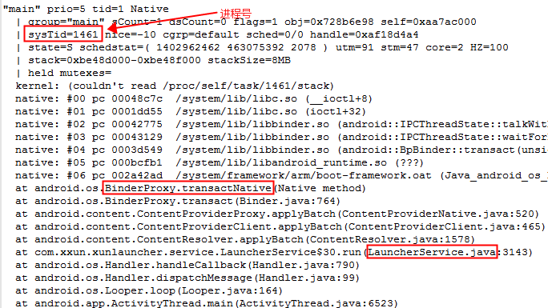
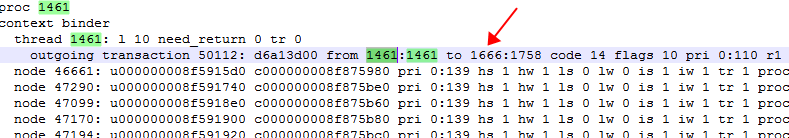
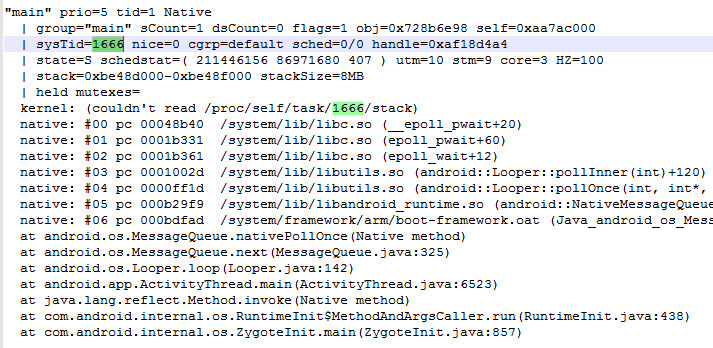
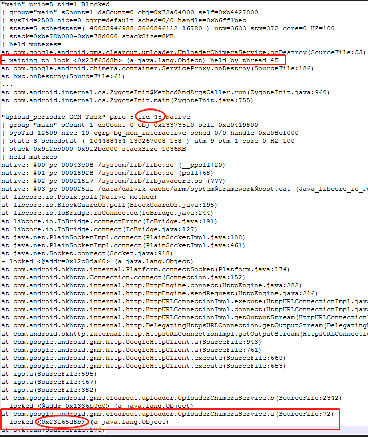
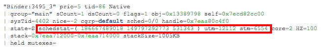
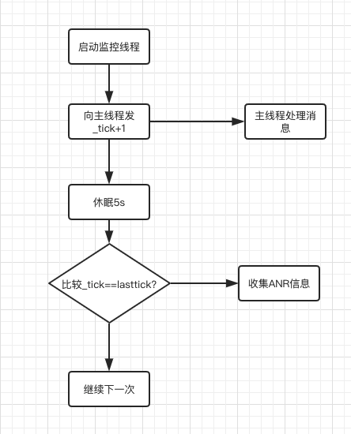
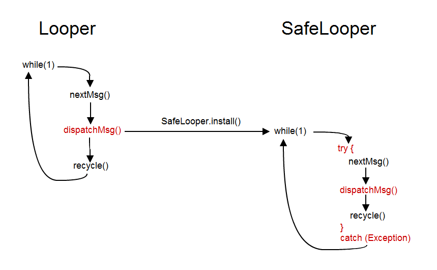
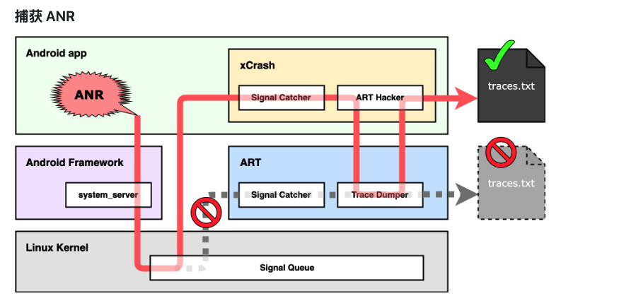

<h1 align="center">ANR</h1>

[toc]

## 一、 ANR分类及超时时间

### 1.1 分类及超时

* **InputDispatching Timeout：** 5秒内无法响应屏幕触摸事件或键盘输入事件
* **BroadcastQueue Timeout ：**  在执行前台广播（BroadcastReceiver）的onReceive()函数时10秒没有处理完成，后台为60秒。
* **Service Timeout ：**         前台服务20秒内，后台服务在200秒内没有执行完毕。
* **ContentProvider Timeout ：** ContentProvider的publish在10s内没进行完。

> 所以可能很多小伙伴会把上面四个条件的第一个和 Activity 直接挂钩，以为是在主线程耗时超过 5s 就会 ANR。实际上是 **InputDispatching。**

### 1.2 超时检测

#### 1.2.1 Service超时检测机制：

- 超过一定时间没有执行完相应操作来触发移除延时消息，则会触发anr；

#### 1.2.2 BroadcastReceiver超时检测机制：

- 有序广播的总执行时间超过 2 * receiver个数 * timeout 时长，则会触发anr；
- 有序广播的某一个receiver执行过程超过 timeout 时长，则会触发anr；

#### 1.2.3 另外:

- 对于Service，Broadcast，Input发生ANR之后，最终都会调用AMS.appNotResponding；
- 对于provider，在其进程启动时publish过程可能会出现ANR，**则会直接杀进程以及清理相应信息，而不会弹出ANR的对话框**。 appNotRespondingViaProvider()过程会走**appNotResponding()**，这个就不介绍了，很少使用，由用户自定义超时时间.

## 二、 BroadcastReceiver出现ANR

BroadcastReceiver Timeout是位于”ActivityManager”线程中的BroadcastQueue.BroadcastHandler收到BROADCAST_TIMEOUT_MSG消息时触发。

- 对于广播队列有两个: foreground队列和background队列:
   - 对于前台广播，则超时为BROADCAST_FG_TIMEOUT = 10s；
   - 对于后台广播，则超时为BROADCAST_BG_TIMEOUT = 60s

### 2.1 埋炸弹

[Android组件3--Broadcast广播机制分析](https://www.jianshu.com/p/82aba8e60fad)详细介绍广播启动流程，通过调用 processNextBroadcast来处理广播.其流程为先处理并行广播,再处理当前有序广播,最后获取并处理下条有序广播.

#### 2.1.1 processNextBroadcast

[-> BroadcastQueue.java]

```java
final void processNextBroadcast(boolean fromMsg) {
    synchronized(mService) {
        ...
        //part 2: 处理当前有序广播
        do {
            r = mOrderedBroadcasts.get(0);
            //获取所有该广播所有的接收者
            int numReceivers = (r.receivers != null) ? r.receivers.size() : 0;
            if (mService.mProcessesReady && r.dispatchTime > 0) {
                long now = SystemClock.uptimeMillis();
                if ((numReceivers > 0) &&
                        (now > r.dispatchTime + (2*mTimeoutPeriod*numReceivers))) {
                    //当广播处理时间超时，则强制结束这条广播【见小节3.3.2】
                    broadcastTimeoutLocked(false);
                    ...
                }
            }
            if (r.receivers == null || r.nextReceiver >= numReceivers
                    || r.resultAbort || forceReceive) {
                if (r.resultTo != null) {
                    //处理广播消息消息
                    performReceiveLocked(r.callerApp, r.resultTo,
                        new Intent(r.intent), r.resultCode,
                        r.resultData, r.resultExtras, false, false, r.userId);
                    r.resultTo = null;
                }
                //拆炸弹【见小节3.2.1】
                cancelBroadcastTimeoutLocked();
            }
        } while (r == null);
        ...

        //part 3: 获取下条有序广播
        r.receiverTime = SystemClock.uptimeMillis();
        if (!mPendingBroadcastTimeoutMessage) {
            long timeoutTime = r.receiverTime + mTimeoutPeriod;
            //埋炸弹【见小节3.1.3】
            setBroadcastTimeoutLocked(timeoutTime);
        }
        ...
    }
}
```

对于广播超时处理时机：

1. 首先在part3的过程中setBroadcastTimeoutLocked(timeoutTime) 设置超时广播消息；
2. 然后在part2根据广播处理情况来处理：
   - 当广播接收者等待时间过长，则调用broadcastTimeoutLocked(false)；
   - 当执行完广播，则调用cancelBroadcastTimeoutLocked；

#### 2.1.2 setBroadcastTimeoutLocked

```java
final void setBroadcastTimeoutLocked(long timeoutTime) {
    if (! mPendingBroadcastTimeoutMessage) {
        Message msg = mHandler.obtainMessage(BROADCAST_TIMEOUT_MSG, this);
        mHandler.sendMessageAtTime(msg, timeoutTime);
        mPendingBroadcastTimeoutMessage = true;
    }
}
```

设置定时广播BROADCAST_TIMEOUT_MSG，即当前往后推mTimeoutPeriod时间广播还没处理完毕，则进入广播超时流程。

### 2.2 拆炸弹

在processNextBroadcast()过程, 执行完performReceiveLocked,便会拆除炸弹.

#### 2.2.1 cancelBroadcastTimeoutLocked

```java
final void cancelBroadcastTimeoutLocked() {
    if (mPendingBroadcastTimeoutMessage) {
        mHandler.removeMessages(BROADCAST_TIMEOUT_MSG, this);
        mPendingBroadcastTimeoutMessage = false;
    }
}
```

移除广播超时消息BROADCAST_TIMEOUT_MSG

### 2.3 引爆炸弹

#### 2.3.1 BroadcastHandler.handleMessage

[-> BroadcastQueue.java ::BroadcastHandler]

```java
private final class BroadcastHandler extends Handler {
    public void handleMessage(Message msg) {
        switch (msg.what) {
            case BROADCAST_TIMEOUT_MSG: {
                synchronized (mService) {
                    //【见小节3.3.2】
                    broadcastTimeoutLocked(true);
                }
            } break;
            ...
        }
        ...
    }
}
```

#### 2.3.2 broadcastTimeoutLocked

[-> BroadcastRecord.java]

```kotlin
//fromMsg = true
final void broadcastTimeoutLocked(boolean fromMsg) {
    if (fromMsg) {
        mPendingBroadcastTimeoutMessage = false;
    }

    if (mOrderedBroadcasts.size() == 0) {
        return;
    }

    long now = SystemClock.uptimeMillis();
    BroadcastRecord r = mOrderedBroadcasts.get(0);
    if (fromMsg) {
        if (mService.mDidDexOpt) {
            mService.mDidDexOpt = false;
            long timeoutTime = SystemClock.uptimeMillis() + mTimeoutPeriod;
            setBroadcastTimeoutLocked(timeoutTime);
            return;
        }
        
        if (!mService.mProcessesReady) {
            return; //当系统还没有准备就绪时，广播处理流程中不存在广播超时
        }

        long timeoutTime = r.receiverTime + mTimeoutPeriod;
        if (timeoutTime > now) {
            //如果当前正在执行的receiver没有超时，则重新设置广播超时
            setBroadcastTimeoutLocked(timeoutTime);
            return;
        }
    }

    BroadcastRecord br = mOrderedBroadcasts.get(0);
    if (br.state == BroadcastRecord.WAITING_SERVICES) {
        //广播已经处理完成，但需要等待已启动service执行完成。当等待足够时间，则处理下一条广播。
        br.curComponent = null;
        br.state = BroadcastRecord.IDLE;
        processNextBroadcast(false);
        return;
    }

    r.receiverTime = now;
    //当前BroadcastRecord的anr次数执行加1操作
    r.anrCount++;

    if (r.nextReceiver <= 0) {
        return;
    }
    ...
    
    Object curReceiver = r.receivers.get(r.nextReceiver-1);
    //查询App进程
    if (curReceiver instanceof BroadcastFilter) {
        BroadcastFilter bf = (BroadcastFilter)curReceiver;
        if (bf.receiverList.pid != 0
                && bf.receiverList.pid != ActivityManagerService.MY_PID) {
            synchronized (mService.mPidsSelfLocked) {
                app = mService.mPidsSelfLocked.get(
                        bf.receiverList.pid);
            }
        }
    } else {
        app = r.curApp;
    }

    if (app != null) {
        anrMessage = "Broadcast of " + r.intent.toString();
    }

    if (mPendingBroadcast == r) {
        mPendingBroadcast = null;
    }

    //继续移动到下一个广播接收者
    finishReceiverLocked(r, r.resultCode, r.resultData,
            r.resultExtras, r.resultAbort, false);
    scheduleBroadcastsLocked();

    if (anrMessage != null) {
        // [见小节3.3.3]
        mHandler.post(new AppNotResponding(app, anrMessage));
    }
}
```

1. mOrderedBroadcasts已处理完成，则不会anr；
2. 正在执行dexopt，则不会anr；
3. 系统还没有进入ready状态(mProcessesReady=false)，则不会anr；
4. 如果当前正在执行的receiver没有超时，则重新设置广播超时，不会anr；

#### 2.3.3 AppNotResponding

[-> BroadcastQueue.java]

```java
private final class AppNotResponding implements Runnable {
    ...
    public void run() {
        // 进入ANR处理流程
        mService.appNotResponding(mApp, null, null, false, mAnnotation);
    }
}
```

## 三、 Service出现ANR

这个通常很少出现，但是如果在Service的主线程中有耗时操作同样会出现ANR现象，因此，耗时操作可以通过Thread或者AsyncTask来处理，也可以通过线程池进行处理。

Service Timeout是位于”ActivityManager”线程中的**AMS.MainHandler收到SERVICE_TIMEOUT_MSG消息时触发**。

对于Service有两类:

- 对于前台服务，则超时为SERVICE_TIMEOUT = 20s；
- 对于后台服务，则超时为SERVICE_BACKGROUND_TIMEOUT = 200s

由变量ProcessRecord.execServicesFg来决定是否前台启动

### 3.1 埋炸弹

[Android组件1--startService启动过程分析](https://www.jianshu.com/p/3245c8f5025f)详细介绍Service启动流程. 其中在Service进程attach到system_server进程的过程中会调用realStartServiceLocked()方法来埋下炸弹.

#### 3.1.1 AS.realStartServiceLocked

[-> ActiveServices.java]

```java
private final void realStartServiceLocked(ServiceRecord r, ProcessRecord app, boolean execInFg) throws RemoteException {
    ...
    //发送delay消息(SERVICE_TIMEOUT_MSG)，【见小节2.1.2】
    bumpServiceExecutingLocked(r, execInFg, "create");
    try {
        ...
        //最终执行服务的onCreate()方法
        app.thread.scheduleCreateService(r, r.serviceInfo,
                mAm.compatibilityInfoForPackageLocked(r.serviceInfo.applicationInfo),
                app.repProcState);
    } catch (DeadObjectException e) {
        mAm.appDiedLocked(app);
        throw e;
    } finally {
        ...
    }
}
```

#### 3.1.2 AS.bumpServiceExecutingLocked

```java
private final void bumpServiceExecutingLocked(ServiceRecord r, boolean fg, String why) {
    ... 
    scheduleServiceTimeoutLocked(r.app);
}

void scheduleServiceTimeoutLocked(ProcessRecord proc) {
    if (proc.executingServices.size() == 0 || proc.thread == null) {
        return;
    }
    long now = SystemClock.uptimeMillis();
    Message msg = mAm.mHandler.obtainMessage(
            ActivityManagerService.SERVICE_TIMEOUT_MSG);
    msg.obj = proc;
    
    //当超时后仍没有remove该SERVICE_TIMEOUT_MSG消息，则执行service Timeout流程【见2.3.1】
    mAm.mHandler.sendMessageAtTime(msg,
        proc.execServicesFg ? (now+SERVICE_TIMEOUT) : (now+ SERVICE_BACKGROUND_TIMEOUT));
}
```

该方法的主要工作发送delay消息(SERVICE_TIMEOUT_MSG)。炸弹已埋下，我们并不希望炸弹被引爆，那么就需要在炸弹爆炸之前拆除炸弹。

### 3.2 拆炸弹

- 在system_server进程AS.realStartServiceLocked()调用的过程会埋下一颗炸弹，超时没有启动完成则会爆炸。
- 那么什么时候会拆除这颗炸弹的引线呢？经过Binder等层层调用进入目标进程的主线程handleCreateService()的过程。

#### 3.2.1 AT.handleCreateService

[-> ActivityThread.java]

```kotlin
    private void handleCreateService(CreateServiceData data) {
        ...
        java.lang.ClassLoader cl = packageInfo.getClassLoader();
        Service service = (Service) cl.loadClass(data.info.name).newInstance();
        ...

        try {
            //创建ContextImpl对象
            ContextImpl context = ContextImpl.createAppContext(this, packageInfo);
            context.setOuterContext(service);
            //创建Application对象
            Application app = packageInfo.makeApplication(false, mInstrumentation);
            service.attach(context, this, data.info.name, data.token, app,
                    ActivityManagerNative.getDefault());
            //调用服务onCreate()方法 
            service.onCreate();
            
            //拆除炸弹引线[见小节2.2.2]
            ActivityManagerNative.getDefault().serviceDoneExecuting(
                    data.token, SERVICE_DONE_EXECUTING_ANON, 0, 0);
        } catch (Exception e) {
            ...
        }
    }
```

在这个过程会创建目标服务对象，以及回调onCreate()方法，紧接再次经过多次调用回到system_server来执行serviceDoneExecuting。

#### 3.2.2 AS.serviceDoneExecutingLocked

```java
private void serviceDoneExecutingLocked(ServiceRecord r, boolean inDestroying, boolean finishing) {
    ...
    if (r.executeNesting <= 0) {
        if (r.app != null) {
            r.app.execServicesFg = false;
            r.app.executingServices.remove(r);
            if (r.app.executingServices.size() == 0) {
                //当前服务所在进程中没有正在执行的service
                mAm.mHandler.removeMessages(ActivityManagerService.SERVICE_TIMEOUT_MSG, r.app);
        ...
    }
    ...
}
```

该方法的主要工作是当service启动完成，则移除服务超时消息SERVICE_TIMEOUT_MSG。

### 3.3 引爆炸弹

前面介绍了埋炸弹和拆炸弹的过程，如果在炸弹倒计时结束之前成功拆卸炸弹，那么就没有爆炸的机会。但是世事难料，总有些极端情况下无法即时拆除炸弹，导致炸弹爆炸，其结果就是App发生ANR。接下来，带大家来看看炸弹爆炸的现场：在system_server进程中有一个Handler线程，名叫”ActivityManager”。当倒计时结束便会向该Handler线程发送 一条信息SERVICE_TIMEOUT_MSG。

#### 3.3.1 MainHandler.handleMessage

[-> ActivityManagerService.java ::MainHandler]

```java
final class MainHandler extends Handler {
    public void handleMessage(Message msg) {
        switch (msg.what) {
            case SERVICE_TIMEOUT_MSG: {
                ...
                //【见小节2.3.2】
                mServices.serviceTimeout((ProcessRecord)msg.obj);
            } break;
            ...
        }
        ...
    }
}
```

#### 3.3.2 AS.serviceTimeout

```java
void serviceTimeout(ProcessRecord proc) {
    String anrMessage = null;

    synchronized(mAm) {
        if (proc.executingServices.size() == 0 || proc.thread == null) {
            return;
        }
        final long now = SystemClock.uptimeMillis();
        final long maxTime =  now -
                (proc.execServicesFg ? SERVICE_TIMEOUT : SERVICE_BACKGROUND_TIMEOUT);
        ServiceRecord timeout = null;
        long nextTime = 0;
        for (int i=proc.executingServices.size()-1; i>=0; i--) {
            ServiceRecord sr = proc.executingServices.valueAt(i);
            if (sr.executingStart < maxTime) {
                timeout = sr;
                break;
            }
            if (sr.executingStart > nextTime) {
                nextTime = sr.executingStart;
            }
        }
        if (timeout != null && mAm.mLruProcesses.contains(proc)) {
            Slog.w(TAG, "Timeout executing service: " + timeout);
            StringWriter sw = new StringWriter();
            PrintWriter pw = new FastPrintWriter(sw, false, 1024);
            pw.println(timeout);
            timeout.dump(pw, " ");
            pw.close();
            mLastAnrDump = sw.toString();
            mAm.mHandler.removeCallbacks(mLastAnrDumpClearer);
            mAm.mHandler.postDelayed(mLastAnrDumpClearer, LAST_ANR_LIFETIME_DURATION_MSECS);
            anrMessage = "executing service " + timeout.shortName;
        }
    }

    if (anrMessage != null) {
        //当存在timeout的service，则执行appNotResponding
        mAm.appNotResponding(proc, null, null, false, anrMessage);
    }
}
```

其中anrMessage的内容为”executing service [发送超时serviceRecord信息]”。

## 四、Provider出现ANR

- ContentProvider Timeout是位于”ActivityManager”线程中的AMS.MainHandler收到CONTENT_PROVIDER_PUBLISH_TIMEOUT_MSG消息时触发。
- ContentProvider 超时为CONTENT_PROVIDER_PUBLISH_TIMEOUT = 10s。这个跟前面的Service和BroadcastQueue完全不同，由Provider[进程启动](http://gityuan.com/2016/10/09/app-process-create-2/)过程相关。

### 4.1 埋炸弹

[Android组件4--理解ContentProvider原理](https://www.jianshu.com/p/4eaaad2461b4)详细介绍了Provider启动流程。埋炸弹的过程 其实是在进程创建的过程，进程创建后会调用attachApplicationLocked()进入system_server进程。

#### 4.1.1 AMS.attachApplicationLocked

```java
private final boolean attachApplicationLocked(IApplicationThread thread, int pid) {
    ProcessRecord app;
    if (pid != MY_PID && pid >= 0) {
        synchronized (mPidsSelfLocked) {
            app = mPidsSelfLocked.get(pid); // 根据pid获取ProcessRecord
        }
    } 
    ...
    
    //系统处于ready状态或者该app为FLAG_PERSISTENT进程则为true
    boolean normalMode = mProcessesReady || isAllowedWhileBooting(app.info);
    List<ProviderInfo> providers = normalMode ? generateApplicationProvidersLocked(app) : null;

    //app进程存在正在启动中的provider，则超时10s后发送CONTENT_PROVIDER_PUBLISH_TIMEOUT_MSG消息
    if (providers != null && checkAppInLaunchingProvidersLocked(app)) {
        Message msg = mHandler.obtainMessage(CONTENT_PROVIDER_PUBLISH_TIMEOUT_MSG);
        msg.obj = app;
        mHandler.sendMessageDelayed(msg, CONTENT_PROVIDER_PUBLISH_TIMEOUT);
    }
    
    thread.bindApplication(...);
    ...
}
```

10s之后引爆该炸弹

### 4.2 拆炸弹

当provider成功publish之后，便会拆除该炸弹。

#### 4.2.1 AMS.publishContentProviders

```dart
public final void publishContentProviders(IApplicationThread caller, List<ContentProviderHolder> providers) {
   ...
   
   synchronized (this) {
       final ProcessRecord r = getRecordForAppLocked(caller);
       
       final int N = providers.size();
       for (int i = 0; i < N; i++) {
           ContentProviderHolder src = providers.get(i);
           ...
           ContentProviderRecord dst = r.pubProviders.get(src.info.name);
           if (dst != null) {
               ComponentName comp = new ComponentName(dst.info.packageName, dst.info.name);
               
               mProviderMap.putProviderByClass(comp, dst); //将该provider添加到mProviderMap
               String names[] = dst.info.authority.split(";");
               for (int j = 0; j < names.length; j++) {
                   mProviderMap.putProviderByName(names[j], dst);
               }

               int launchingCount = mLaunchingProviders.size();
               int j;
               boolean wasInLaunchingProviders = false;
               for (j = 0; j < launchingCount; j++) {
                   if (mLaunchingProviders.get(j) == dst) {
                       //将该provider移除mLaunchingProviders队列
                       mLaunchingProviders.remove(j);
                       wasInLaunchingProviders = true;
                       j--;
                       launchingCount--;
                   }
               }
               //成功pubish则移除该消息
               if (wasInLaunchingProviders) {
                   mHandler.removeMessages(CONTENT_PROVIDER_PUBLISH_TIMEOUT_MSG, r);
               }
               synchronized (dst) {
                   dst.provider = src.provider;
                   dst.proc = r;
                   //唤醒客户端的wait等待方法
                   dst.notifyAll();
               }
               ...
           }
       }
   }    
}
```

### 4.3 引爆炸弹

在system_server进程中有一个Handler线程，名叫”ActivityManager”。当倒计时结束便会向该Handler线程发送 一条信息CONTENT_PROVIDER_PUBLISH_TIMEOUT_MSG。

#### 4.3.1 MainHandler.handleMessage

[-> ActivityManagerService.java ::MainHandler]

```java
final class MainHandler extends Handler {
    public void handleMessage(Message msg) {
        switch (msg.what) {
            case CONTENT_PROVIDER_PUBLISH_TIMEOUT_MSG: {
                ...
                ProcessRecord app = (ProcessRecord)msg.obj;
                synchronized (ActivityManagerService.this) {
                    //【见小节4.3.2】
                    processContentProviderPublishTimedOutLocked(app);
                }
            } break;
            ...
        }
        ...
    }
}
```

#### 4.3.2 AMS.processContentProviderPublishTimedOutLocked

```java
private final void processContentProviderPublishTimedOutLocked(ProcessRecord app) {
    cleanupAppInLaunchingProvidersLocked(app, true); //[见4.3.3]
    //[见小节4.3.4]
    removeProcessLocked(app, false, true, "timeout publishing content providers");
}
```

#### 4.3.3 AMS.cleanupAppInLaunchingProvidersLocked

```java
boolean cleanupAppInLaunchingProvidersLocked(ProcessRecord app, boolean alwaysBad) {
    boolean restart = false;
    for (int i = mLaunchingProviders.size() - 1; i >= 0; i--) {
        ContentProviderRecord cpr = mLaunchingProviders.get(i);
        if (cpr.launchingApp == app) {
            if (!alwaysBad && !app.bad && cpr.hasConnectionOrHandle()) {
                restart = true;
            } else {
                //移除死亡的provider
                removeDyingProviderLocked(app, cpr, true);
            }
        }
    }
    return restart;
}
```

removeDyingProviderLocked()的功能跟进程的存活息息相关：详见[ContentProvider引用计数](http://gityuan.com/2016/05/03/content_provider_release/) []小节4.5]

- 对于stable类型的provider(即conn.stableCount > 0)，则会杀掉所有跟该provider建立stable连接的非persistent进程。
- 对于unstable类的provider(即conn.unstableCount > 0)，并不会导致client进程被级联所杀。

#### 4.3.4 AMS.removeProcessLocked

```java
private final boolean removeProcessLocked(ProcessRecord app, boolean callerWillRestart, boolean allowRestart, String reason) {
    final String name = app.processName;
    final int uid = app.uid;

    //移除mProcessNames中的相应对象
    removeProcessNameLocked(name, uid);
    if (mHeavyWeightProcess == app) {
        mHandler.sendMessage(mHandler.obtainMessage(CANCEL_HEAVY_NOTIFICATION_MSG,
                mHeavyWeightProcess.userId, 0));
        mHeavyWeightProcess = null;
    }
    boolean needRestart = false;
    if (app.pid > 0 && app.pid != MY_PID) {
        int pid = app.pid;
        synchronized (mPidsSelfLocked) {
            mPidsSelfLocked.remove(pid);
            mHandler.removeMessages(PROC_START_TIMEOUT_MSG, app);
        }
        
        ...
        boolean willRestart = false;
        if (app.persistent && !app.isolated) {
            if (!callerWillRestart) {
                willRestart = true;
            } else {
                needRestart = true;
            }
        }
        app.kill(reason, true); //杀进程
        handleAppDiedLocked(app, willRestart, allowRestart);
        if (willRestart) {
            removeLruProcessLocked(app);
            addAppLocked(app.info, false, null /* ABI override */);
        }
    } else {
        mRemovedProcesses.add(app);
    }
    return needRestart;
}
```

## 五、ANR常见类型归纳

### 5.1 主线程Binder调用等待超时

比如下面的这段



​							1_binder等待超时.png

很明显当时在做Binder通信，并没有waiting to lock等代表死锁的字样，那么说明这个案例即有可能是在等Binder对端响应，我们知道Binder通信对于发起方来说是默认是阻塞等待响应，只有有了返回结果后才会继续执行下去，当然了可以给接口设置oneway声明，这样的话binder请求就是异步请求，这里不多说

所以，如上这个案例中需要找到对端是哪个进程，这个进程当时在做什么，这时候就需要找到anr文件夹下另外一个文件binderinfo，这里需要找到与我们发起方进程1461通信的是哪个进程



​						    2_binder等待超时.png

可以看到是1666号这个进程，再回到trace中看下，这个进程当时在做什么

							3_binder等待超时.png

可以看到当时对端在做消息的读取，也就是说这里出了问题，很明显这里我们无法修改，我们这个问题在于主线程执行了Binder请求，对端迟迟未返回便很容易出现这个问题，当前做法异步中执行

### 5.2 主线程等待锁

比如下面这个主线程的CallStack例子，可以看到如下信息：



​								4_主线程等待锁.png

这个案例中gallery的main thread在执行UploaderChimeraService的onDestroy方法时，需要lock 0x23f65d8b，但这个lock有被upload_periodic GCM Task 拿住，这个thread当前是在做连接网络的动作。从这段信息来看，很有可能与测试时手机连接的网络有关，当时连接的事google的网络，由于墙的原因，无法连接gms的相关server有关

还有一种情况就是死锁，即形成了头尾相连，互相等待的情况，对于这种问题以及上面案例的解决，一般会尝试将锁改为超时锁，比如lock的trylock，超时会自动释放锁，从而避免一直持有锁的情况发生

### 5.3 卡在IO上
 这种情况一般是和文件操作相关，判断是否是这种情况，可以看mainlog中搜索关键字"ANR in",看这段信息的最下边，比如下面的信息

ANRManager: 100% TOTAL: 2% user + 2.1% kernel + 95% iowait + 0.1% softirq
 很明显，IO占比很高，这个时候就需要查看trace日志看当时的callstack，或者在这段ANR点往前看0~4s，看看当时做的什么文件操作，这种场景有遇到过，常见解决方法是对耗时文件操作采取异步操作

### 5.4 主线程有耗时的动作
这种情况是ANR类型问题里遇到最多的，比如网络访问，访问数据库之类的，都很容易造成主线程堵塞，

这里以访问数据库来说，这类型引起的ANR，一般来讲看当时的CPU使用情况会发现user占比较高，看trace中主线程当时的信息会发现会有一些比如query像ContentProvider这种数据库的动作。这种情况下，还可以去看eventlog或者mainlog，在ANR发生前后打印出来的信息，比如访问数据库这种，在eventlog中搜索"am_anr",然后看前后片段，会发现发生ANR的这个进程有很多数据库相关的信息，说明在发生ANR前后主线程一直在忙于访问数据库，这类型的问题常见于图库，联系人，彩短信应用。

所以这种问题的解决，一般考虑的是异步解决，异步解决并不是简单的new一个线程，要根据业务场景以及频率来决定，Android常见的异步AsyncTask, IntentService, 线程池(官方四种或自定义), new thread等，一般来说不建议直接new thread

### 5.5 binder线程池被占满
 系统对每个process最多分配15个binder线程，这个是谷歌的设计（/frameworks/native/libs/binder/ProcessState.cpp)
 如果另一个process发送太多重复binder请求，那么就会导致接收端binder线程被占满，从而处理不了其它的binder请求
 ，这时候请求端发起的请求就会阻塞等待了(未设置异步请求的前提下)，这本身就是系统的一个限制，如果应用未按照系统的要求来实现对应逻辑，那么就会造成问题。

而系统端是不会（也不建议）通过修改系统行为来兼容应用逻辑，否则更容易造成其它根据系统需求正常编写的应用反而出现不可预料的问题。

判断Binder是否用完，可以在trace中搜索关键字"binder_f"，如果搜索到则表示已经用完，然后就要找log其他地方看是谁一直在消耗binder或者是有死锁发生

之前有遇到过压力测试手电筒应用，出现BInder线程池被占满情况，解决的思路就是降低极短时间内大量Binder请求的发生，修复的手法是发送BInder请求的函数中做时间差过滤，限定在500ms内最多执行一次

### 5.6 JE或者NE导致ANR

这种场景有遇到过，ANR前出现频繁NE，NE所在的进程与ANR的进程有交互，在解决了NE后，ANR也不复存在，对于这类在ANR前有JE或者NE，一般思路是先解决JE或NE，因为JE/NE发生时会去dump一大堆异常信息，本身也会加重CPU loading，修改完异常后再来看ANR是否还存在，如果还存在，那么就看trace 堆栈，如果不存在，则可以基本判定是JE或NE导致

### 5.7 只存在于Monkey测试下
 有些问题是只有在Monkey环境下才能跑出来，平时的user版本用户使用是不会出现的，这种问题的话就没有改动的意义。
 比如下面这个例子：

 ```java
ActivityManager: Not finishing activity because controller resumed
 03-18 07:25:50.901 810 870 I am_anr : [0,25443,android.process.media,1086897733,Input dispatching timed out (Waiting because no window has focus but there is a focused application that may eventually add a window when it finishes starting up.)]
 ```

 发生这个ANR的原因是Contoller将resume的操作给拦截了，导致Focus不过去，从而导致ANR，User版本不会有Contoller，所以不会出现这个 ANR。所以这个 ANR 可以忽略。

## 六、 Trace.txt

### 6.1 导出traces.txt文件

`traces.txt`文件位置在`/data/anr/`目录下，可以通过以下`adb`命令将其拷贝到sd卡目录下获取查看。

```
adb shell
cat  /data/anr/traces.txt  >/mnt/sdcard/traces.txt  
exit
或者
adb pull /data/anr/traces/txt 
```

### 6.2 traces.txt文件分析

```java
while(true) {
	Log.d("TAG", "ANR log");
}
```

`traces.txt`里的信息：

```
----- pid 4456 at 1970-01-12 19:50:20 -----
Cmd line: com.android.health
Build fingerprint: 'qcom/msm8937_32go/msm8937_32go:8.1.0/OPM1.171019.026/userdebug/test-keys'
ABI: 'arm'
Build type: optimized
Zygote loaded classes=5031 post zygote classes=222
Intern table: 66389 strong; 129 weak
JNI: CheckJNI is off; globals=493 (plus 28 weak)
Libraries: /data/app/com.android.health-joSF2Y7Vhc9-Y83j6TihZQ==/lib/arm/librstate-jni.so /system/lib/libandroid.so /system/lib/libcompiler_rt.so /system/lib/libjavacrypto.so /system/lib/libjnigraphics.so /system/lib/libmedia_jni.so /system/lib/libsoundpool.so /system/lib/libwebviewchromium_loader.so libjavacore.so libopenjdk.so (10)
Heap: 19% free, 2MB/2MB; 48359 objects
Dumping cumulative Gc timings
Start Dumping histograms for 44 iterations for concurrent copying
VisitConcurrentRoots:	Sum: 201.728ms 99% C.I. 3.775ms-14.591ms Avg: 4.584ms Max: 15.852ms
ProcessMarkStack:	Sum: 123.361ms 99% C.I. 2.118ms-6.847ms Avg: 2.803ms Max: 6.870ms
ClearFromSpace:	Sum: 81.525ms 99% C.I. 1.311ms-7.295ms Avg: 1.852ms Max: 7.531ms
ScanImmuneSpaces:	Sum: 81.131ms 99% C.I. 1.607ms-2.744ms Avg: 1.843ms Max: 2.744ms
InitializePhase:	Sum: 12.579ms 99% C.I. 209us-911.999us Avg: 285.886us Max: 941us
FlipOtherThreads:	Sum: 7.389ms 99% C.I. 107us-511us Avg: 167.931us Max: 511us
GrayAllDirtyImmuneObjects:	Sum: 5.270ms 99% C.I. 93us-416.999us Avg: 119.772us Max: 447us
VisitNonThreadRoots:	Sum: 5.093ms 99% C.I. 85us-767.999us Avg: 115.750us Max: 838us
RecordFree:	Sum: 4.890ms 99% C.I. 68us-1145.999us Avg: 111.136us Max: 1210us
EnqueueFinalizerReferences:	Sum: 4.225ms 99% C.I. 64us-901.999us Avg: 96.022us Max: 1052us
SweepSystemWeaks:	Sum: 3.760ms 99% C.I. 66us-472.999us Avg: 85.454us Max: 534us
FlipThreadRoots:	Sum: 3.629ms 99% C.I. 2us-477.999us Avg: 82.477us Max: 493us
MarkZygoteLargeObjects:	Sum: 3.303ms 99% C.I. 58us-220us Avg: 75.068us Max: 220us
ThreadListFlip:	Sum: 1.873ms 99% C.I. 22us-305.999us Avg: 42.568us Max: 307us
ResumeRunnableThreads:	Sum: 1.725ms 99% C.I. 18us-169us Avg: 39.204us Max: 169us
ForwardSoftReferences:	Sum: 1.539ms 99% C.I. 28us-134us Avg: 34.977us Max: 134us
MarkingPhase:	Sum: 1.513ms 99% C.I. 18us-411.999us Avg: 34.386us Max: 491us
MarkStackAsLive:	Sum: 1.262ms 99% C.I. 16us-154us Avg: 28.681us Max: 154us
(Paused)GrayAllNewlyDirtyImmuneObjects:	Sum: 1.206ms 99% C.I. 24us-75us Avg: 27.409us Max: 75us
EmptyRBMarkBitStack:	Sum: 1.135ms 99% C.I. 17us-166.999us Avg: 25.795us Max: 176us
ClearRegionSpaceCards:	Sum: 1.098ms 99% C.I. 19us-40us Avg: 24.954us Max: 40us
SweepLargeObjects:	Sum: 940us 99% C.I. 16us-155us Avg: 21.363us Max: 155us
ReclaimPhase:	Sum: 867us 99% C.I. 11us-132us Avg: 19.704us Max: 132us
SwapBitmaps:	Sum: 608us 99% C.I. 11us-49us Avg: 13.818us Max: 49us
ProcessReferences:	Sum: 466us 99% C.I. 2us-14us Avg: 5.295us Max: 14us
(Paused)SetFromSpace:	Sum: 223us 99% C.I. 4us-20us Avg: 5.068us Max: 20us
(Paused)FlipCallback:	Sum: 202us 99% C.I. 3us-42us Avg: 4.590us Max: 42us
SweepAllocSpace:	Sum: 162us 99% C.I. 3us-16us Avg: 3.681us Max: 16us
Sweep:	Sum: 139us 99% C.I. 3us-5us Avg: 3.159us Max: 5us
ResumeOtherThreads:	Sum: 84us 99% C.I. 1us-12us Avg: 1.909us Max: 12us
(Paused)ClearCards:	Sum: 76us 99% C.I. 250ns-16000ns Avg: 82ns Max: 16000ns
UnBindBitmaps:	Sum: 45us 99% C.I. 1us-2us Avg: 1.022us Max: 2us
Done Dumping histograms
concurrent copying paused:	Sum: 3.841ms 99% C.I. 62us-355us Avg: 87.295us Max: 355us
concurrent copying total time: 553.046ms mean time: 12.569ms
concurrent copying freed: 1886677 objects with total size 69MB
concurrent copying throughput: 3.41171e+06/s / 125MB/s
Cumulative bytes moved 2717208
Cumulative objects moved 67496
Total time spent in GC: 553.046ms
Mean GC size throughput: 125MB/s
Mean GC object throughput: 3.41143e+06 objects/s
Total number of allocations 1935034
Total bytes allocated 71MB
Total bytes freed 69MB
Free memory 512KB
Free memory until GC 512KB
Free memory until OOME 93MB
Total memory 2MB
Max memory 96MB
Zygote space size 632KB
Total mutator paused time: 3.841ms
Total time waiting for GC to complete: 53.447us
Total GC count: 44
Total GC time: 553.046ms
Total blocking GC count: 0
Total blocking GC time: 0
Histogram of GC count per 10000 ms: 31:1
Histogram of blocking GC count per 10000 ms: 0:1
Registered native bytes allocated: 71894
/data/app/com.android.health-joSF2Y7Vhc9-Y83j6TihZQ==/oat/arm/base.odex: quicken
Current JIT code cache size: 9KB
Current JIT data cache size: 5KB
Current JIT capacity: 64KB
Current number of JIT code cache entries: 11
Total number of JIT compilations: 11
Total number of JIT compilations for on stack replacement: 2
Total number of JIT code cache collections: 0
Memory used for stack maps: Avg: 383B Max: 1764B Min: 24B
Memory used for compiled code: Avg: 817B Max: 3KB Min: 2B
Memory used for profiling info: Avg: 101B Max: 496B Min: 16B
Start Dumping histograms for 11 iterations for JIT timings
Compiling:	Sum: 59.398ms 99% C.I. 0.875ms-19.545ms Avg: 5.399ms Max: 19.545ms
TrimMaps:	Sum: 2.712ms 99% C.I. 54us-978us Avg: 246.545us Max: 978us
Done Dumping histograms
Memory used for compilation: Avg: 152KB Max: 557KB Min: 17KB
ProfileSaver total_bytes_written=0
ProfileSaver total_number_of_writes=0
ProfileSaver total_number_of_code_cache_queries=0
ProfileSaver total_number_of_skipped_writes=0
ProfileSaver total_number_of_failed_writes=0
ProfileSaver total_ms_of_sleep=5000
ProfileSaver total_ms_of_work=0
ProfileSaver max_number_profile_entries_cached=0
ProfileSaver total_number_of_hot_spikes=0
ProfileSaver total_number_of_wake_ups=0

suspend all histogram:	Sum: 36.114ms 99% C.I. 5.222us-26199.040us Avg: 708.117us Max: 34796us
DALVIK THREADS (13):
"main" prio=5 tid=1 Runnable
  | group="main" sCount=0 dsCount=0 flags=0 obj=0x7214d790 self=0xa9127000
  | sysTid=4456 nice=-10 cgrp=default sched=0/0 handle=0xad3b04a4
  | state=R schedstat=( 5539330925 126588963 1516 ) utm=392 stm=161 core=2 HZ=100
  | stack=0xbe506000-0xbe508000 stackSize=8MB
  | held mutexes= "mutator lock"(shared held)
  native: #00 pc 002e8247  /system/lib/libart.so (art::DumpNativeStack(std::__1::basic_ostream<char, std::__1::char_traits<char>>&, int, BacktraceMap*, char const*, art::ArtMethod*, void*)+130)
  native: #01 pc 00379081  /system/lib/libart.so (art::Thread::DumpStack(std::__1::basic_ostream<char, std::__1::char_traits<char>>&, bool, BacktraceMap*, bool) const+204)
  native: #02 pc 003757b7  /system/lib/libart.so (art::Thread::Dump(std::__1::basic_ostream<char, std::__1::char_traits<char>>&, bool, BacktraceMap*, bool) const+34)
  native: #03 pc 0038d14b  /system/lib/libart.so (art::DumpCheckpoint::Run(art::Thread*)+698)
  native: #04 pc 00379c61  /system/lib/libart.so (art::Thread::RunCheckpointFunction()+284)
  native: #05 pc 003e0885  /system/lib/libart.so (art::JniMethodFastEndWithReference(_jobject*, unsigned int, art::Thread*)+28)
  native: #06 pc 00055611  /system/framework/arm/boot-core-libart.oat (Java_dalvik_system_VMStack_getCallingClassLoader__+104)
  at dalvik.system.VMStack.getCallingClassLoader(Native method)
  at java.lang.Class.forName(Class.java:378)
  at b.c.a.a.a.a.a(StringFogImpl.java:1)
  at b.f.e.b.g.a(StringFog.java:1)
  at com.android.health.ui.activity.MainActivity.onCreate(MainActivity.java:10)
  at android.app.Activity.performCreate(Activity.java:7023)
  at android.app.Activity.performCreate(Activity.java:7014)
  at android.app.Instrumentation.callActivityOnCreate(Instrumentation.java:1215)
  at android.app.ActivityThread.performLaunchActivity(ActivityThread.java:2734)
  at android.app.ActivityThread.handleLaunchActivity(ActivityThread.java:2859)
  at android.app.ActivityThread.-wrap11(ActivityThread.java:-1)
  at android.app.ActivityThread$H.handleMessage(ActivityThread.java:1592)
  at android.os.Handler.dispatchMessage(Handler.java:106)
  at android.os.Looper.loop(Looper.java:164)
  at android.app.ActivityThread.main(ActivityThread.java:6518)
  at java.lang.reflect.Method.invoke(Native method)
  at com.android.internal.os.RuntimeInit$MethodAndArgsCaller.run(RuntimeInit.java:438)
  at com.android.internal.os.ZygoteInit.main(ZygoteInit.java:807)

"Signal Catcher" daemon prio=5 tid=3 Runnable
  | group="system" sCount=0 dsCount=0 flags=0 obj=0x15280148 self=0xa9128200
  | sysTid=4462 nice=0 cgrp=default sched=0/0 handle=0xa2404970
  | state=R schedstat=( 25718797 6108385 37 ) utm=1 stm=1 core=0 HZ=100
  | stack=0xa230a000-0xa230c000 stackSize=1006KB
  | held mutexes= "mutator lock"(shared held)
  native: #00 pc 002e8247  /system/lib/libart.so (art::DumpNativeStack(std::__1::basic_ostream<char, std::__1::char_traits<char>>&, int, BacktraceMap*, char const*, art::ArtMethod*, void*)+130)
  native: #01 pc 00379081  /system/lib/libart.so (art::Thread::DumpStack(std::__1::basic_ostream<char, std::__1::char_traits<char>>&, bool, BacktraceMap*, bool) const+204)
  native: #02 pc 003757b7  /system/lib/libart.so (art::Thread::Dump(std::__1::basic_ostream<char, std::__1::char_traits<char>>&, bool, BacktraceMap*, bool) const+34)
  native: #03 pc 0038d14b  /system/lib/libart.so (art::DumpCheckpoint::Run(art::Thread*)+698)
  native: #04 pc 00386cc5  /system/lib/libart.so (art::ThreadList::RunCheckpoint(art::Closure*, art::Closure*)+320)
  native: #05 pc 003867c3  /system/lib/libart.so (art::ThreadList::Dump(std::__1::basic_ostream<char, std::__1::char_traits<char>>&, bool)+530)
  native: #06 pc 003864e3  /system/lib/libart.so (art::ThreadList::DumpForSigQuit(std::__1::basic_ostream<char, std::__1::char_traits<char>>&)+626)
  native: #07 pc 003643c3  /system/lib/libart.so (art::Runtime::DumpForSigQuit(std::__1::basic_ostream<char, std::__1::char_traits<char>>&)+122)
  native: #08 pc 0036b4bf  /system/lib/libart.so (art::SignalCatcher::HandleSigQuit()+1282)
  native: #09 pc 0036a49d  /system/lib/libart.so (art::SignalCatcher::Run(void*)+240)
  native: #10 pc 00046e53  /system/lib/libc.so (__pthread_start(void*)+22)
  native: #11 pc 0001ad15  /system/lib/libc.so (__start_thread+32)
  (no managed stack frames)

"Jit thread pool worker thread 0" daemon prio=5 tid=2 Native
  | group="main" sCount=1 dsCount=0 flags=1 obj=0x15280000 self=0xa9127c00
  | sysTid=4461 nice=9 cgrp=default sched=0/0 handle=0xa2505970
  | state=S schedstat=( 53567655 10374322 72 ) utm=1 stm=4 core=1 HZ=100
  | stack=0xa2407000-0xa2409000 stackSize=1022KB
  | held mutexes=
  kernel: (couldn't read /proc/self/task/4461/stack)
  native: #00 pc 00018d98  /system/lib/libc.so (syscall+28)
  native: #01 pc 000b75cd  /system/lib/libart.so (art::ConditionVariable::WaitHoldingLocks(art::Thread*)+80)
  native: #02 pc 0038e3d1  /system/lib/libart.so (art::ThreadPool::GetTask(art::Thread*)+172)
  native: #03 pc 0038dd47  /system/lib/libart.so (art::ThreadPoolWorker::Run()+62)
  native: #04 pc 0038d965  /system/lib/libart.so (art::ThreadPoolWorker::Callback(void*)+92)
  native: #05 pc 00046e53  /system/lib/libc.so (__pthread_start(void*)+22)
  native: #06 pc 0001ad15  /system/lib/libc.so (__start_thread+32)
  (no managed stack frames)

"JDWP" daemon prio=5 tid=4 WaitingInMainDebuggerLoop
  | group="system" sCount=1 dsCount=0 flags=1 obj=0x152801d0 self=0xa9128800
  | sysTid=4463 nice=0 cgrp=default sched=0/0 handle=0x92cc6970
  | state=S schedstat=( 2252710 2346719 9 ) utm=0 stm=0 core=0 HZ=100
  | stack=0x92bcc000-0x92bce000 stackSize=1006KB
  | held mutexes=
  kernel: (couldn't read /proc/self/task/4463/stack)
  native: #00 pc 00048528  /system/lib/libc.so (__pselect6+20)
  native: #01 pc 0001f1b5  /system/lib/libc.so (select+92)
  native: #02 pc 00408217  /system/lib/libart.so (art::JDWP::JdwpAdbState::ProcessIncoming()+262)
  native: #03 pc 0025d18b  /system/lib/libart.so (art::JDWP::JdwpState::Run()+438)
  native: #04 pc 0025c917  /system/lib/libart.so (art::JDWP::StartJdwpThread(void*)+22)
  native: #05 pc 00046e53  /system/lib/libc.so (__pthread_start(void*)+22)
  native: #06 pc 0001ad15  /system/lib/libc.so (__start_thread+32)
  (no managed stack frames)

"FinalizerDaemon" daemon prio=5 tid=5 Waiting
  | group="system" sCount=1 dsCount=0 flags=1 obj=0x15280258 self=0x9f7a8a00
  | sysTid=4465 nice=4 cgrp=default sched=0/0 handle=0x92ac4970
  | state=S schedstat=( 8023018 3220104 59 ) utm=0 stm=0 core=1 HZ=100
  | stack=0x929c2000-0x929c4000 stackSize=1038KB
  | held mutexes=
  at java.lang.Object.wait(Native method)
  - waiting on <0x09b00fe4> (a java.lang.Object)
  at java.lang.Object.wait(Object.java:422)
  at java.lang.ref.ReferenceQueue.remove(ReferenceQueue.java:188)
  - locked <0x09b00fe4> (a java.lang.Object)
  at java.lang.ref.ReferenceQueue.remove(ReferenceQueue.java:209)
  at java.lang.Daemons$FinalizerDaemon.runInternal(Daemons.java:232)
  at java.lang.Daemons$Daemon.run(Daemons.java:103)
  at java.lang.Thread.run(Thread.java:764)

"ReferenceQueueDaemon" daemon prio=5 tid=6 Waiting
  | group="system" sCount=1 dsCount=0 flags=1 obj=0x152803c8 self=0xa9128e00
  | sysTid=4464 nice=4 cgrp=default sched=0/0 handle=0x92bc9970
  | state=S schedstat=( 6551777 5536617 104 ) utm=0 stm=0 core=1 HZ=100
  | stack=0x92ac7000-0x92ac9000 stackSize=1038KB
  | held mutexes=
  at java.lang.Object.wait(Native method)
  - waiting on <0x03266c4d> (a java.lang.Class<java.lang.ref.ReferenceQueue>)
  at java.lang.Daemons$ReferenceQueueDaemon.runInternal(Daemons.java:178)
  - locked <0x03266c4d> (a java.lang.Class<java.lang.ref.ReferenceQueue>)
  at java.lang.Daemons$Daemon.run(Daemons.java:103)
  at java.lang.Thread.run(Thread.java:764)

"FinalizerWatchdogDaemon" daemon prio=5 tid=7 Sleeping
  | group="system" sCount=1 dsCount=0 flags=1 obj=0x15280508 self=0x9f7e4000
  | sysTid=4466 nice=4 cgrp=default sched=0/0 handle=0x929bf970
  | state=S schedstat=( 632500 1089687 10 ) utm=0 stm=0 core=0 HZ=100
  | stack=0x928bd000-0x928bf000 stackSize=1038KB
  | held mutexes=
  at java.lang.Thread.sleep(Native method)
  - sleeping on <0x0ce9c302> (a java.lang.Object)
  at java.lang.Thread.sleep(Thread.java:373)
  - locked <0x0ce9c302> (a java.lang.Object)
  at java.lang.Thread.sleep(Thread.java:314)
  at java.lang.Daemons$FinalizerWatchdogDaemon.sleepFor(Daemons.java:342)
  at java.lang.Daemons$FinalizerWatchdogDaemon.waitForFinalization(Daemons.java:364)
  at java.lang.Daemons$FinalizerWatchdogDaemon.runInternal(Daemons.java:281)
  at java.lang.Daemons$Daemon.run(Daemons.java:103)
  at java.lang.Thread.run(Thread.java:764)

"HeapTaskDaemon" daemon prio=5 tid=8 WaitingForCheckPointsToRun
  | group="system" sCount=1 dsCount=0 flags=1 obj=0x152817c0 self=0x9f7e4600
  | sysTid=4467 nice=4 cgrp=default sched=0/0 handle=0x928ba970
  | state=S schedstat=( 490659546 85688968 531 ) utm=40 stm=9 core=0 HZ=100
  | stack=0x927b8000-0x927ba000 stackSize=1038KB
  | held mutexes=
  kernel: (couldn't read /proc/self/task/4467/stack)
  native: #00 pc 00018d98  /system/lib/libc.so (syscall+28)
  native: #01 pc 000b75cd  /system/lib/libart.so (art::ConditionVariable::WaitHoldingLocks(art::Thread*)+80)
  native: #02 pc 000b271f  /system/lib/libart.so (art::Barrier::Increment(art::Thread*, int)+48)
  native: #03 pc 00175257  /system/lib/libart.so (art::gc::collector::ConcurrentCopying::ActivateReadBarrierEntrypoints()+270)
  native: #04 pc 00174bc5  /system/lib/libart.so (art::gc::collector::ConcurrentCopying::RunPhases()+440)
  native: #05 pc 0018473d  /system/lib/libart.so (art::gc::collector::GarbageCollector::Run(art::gc::GcCause, bool)+260)
  native: #06 pc 0019e78f  /system/lib/libart.so (art::gc::Heap::CollectGarbageInternal(art::gc::collector::GcType, art::gc::GcCause, bool)+2342)
  native: #07 pc 001ac5cf  /system/lib/libart.so (art::gc::Heap::ConcurrentGC(art::Thread*, art::gc::GcCause, bool)+70)
  native: #08 pc 001b1005  /system/lib/libart.so (art::gc::Heap::ConcurrentGCTask::Run(art::Thread*)+20)
  native: #09 pc 001cb647  /system/lib/libart.so (art::gc::TaskProcessor::RunAllTasks(art::Thread*)+30)
  native: #10 pc 0005504b  /system/framework/arm/boot-core-libart.oat (Java_dalvik_system_VMRuntime_runHeapTasks__+74)
  at dalvik.system.VMRuntime.runHeapTasks(Native method)
  at java.lang.Daemons$HeapTaskDaemon.runInternal(Daemons.java:461)
  at java.lang.Daemons$Daemon.run(Daemons.java:103)
  at java.lang.Thread.run(Thread.java:764)

"Binder:4456_1" prio=5 tid=9 Native
  | group="main" sCount=1 dsCount=0 flags=1 obj=0x15280f68 self=0x9f7e4c00
  | sysTid=4468 nice=0 cgrp=default sched=0/0 handle=0x926b7970
  | state=S schedstat=( 1830991 109635 14 ) utm=0 stm=0 core=2 HZ=100
  | stack=0x925bd000-0x925bf000 stackSize=1006KB
  | held mutexes=
  kernel: (couldn't read /proc/self/task/4468/stack)
  native: #00 pc 0004843c  /system/lib/libc.so (__ioctl+8)
  native: #01 pc 0001d965  /system/lib/libc.so (ioctl+32)
  native: #02 pc 00045643  /system/lib/libbinder.so (android::IPCThreadState::talkWithDriver(bool)+170)
  native: #03 pc 00045751  /system/lib/libbinder.so (android::IPCThreadState::getAndExecuteCommand()+8)
  native: #04 pc 00045c5b  /system/lib/libbinder.so (android::IPCThreadState::joinThreadPool(bool)+38)
  native: #05 pc 0005a591  /system/lib/libbinder.so (???)
  native: #06 pc 0000d24f  /system/lib/libutils.so (android::Thread::_threadLoop(void*)+90)
  native: #07 pc 0007412d  /system/lib/libandroid_runtime.so (android::AndroidRuntime::javaThreadShell(void*)+88)
  native: #08 pc 00046e53  /system/lib/libc.so (__pthread_start(void*)+22)
  native: #09 pc 0001ad15  /system/lib/libc.so (__start_thread+32)
  (no managed stack frames)

"Binder:4456_2" prio=5 tid=10 Native
  | group="main" sCount=1 dsCount=0 flags=1 obj=0x15281010 self=0x9f7e5200
  | sysTid=4469 nice=0 cgrp=default sched=0/0 handle=0x925ba970
  | state=S schedstat=( 2867968 7702500 12 ) utm=0 stm=0 core=1 HZ=100
  | stack=0x924c0000-0x924c2000 stackSize=1006KB
  | held mutexes=
  kernel: (couldn't read /proc/self/task/4469/stack)
  native: #00 pc 0004843c  /system/lib/libc.so (__ioctl+8)
  native: #01 pc 0001d965  /system/lib/libc.so (ioctl+32)
  native: #02 pc 00045643  /system/lib/libbinder.so (android::IPCThreadState::talkWithDriver(bool)+170)
  native: #03 pc 00045751  /system/lib/libbinder.so (android::IPCThreadState::getAndExecuteCommand()+8)
  native: #04 pc 00045c5b  /system/lib/libbinder.so (android::IPCThreadState::joinThreadPool(bool)+38)
  native: #05 pc 0005a591  /system/lib/libbinder.so (???)
  native: #06 pc 0000d24f  /system/lib/libutils.so (android::Thread::_threadLoop(void*)+90)
  native: #07 pc 0007412d  /system/lib/libandroid_runtime.so (android::AndroidRuntime::javaThreadShell(void*)+88)
  native: #08 pc 00046e53  /system/lib/libc.so (__pthread_start(void*)+22)
  native: #09 pc 0001ad15  /system/lib/libc.so (__start_thread+32)
  (no managed stack frames)

"Binder:4456_3" prio=5 tid=11 Native
  | group="main" sCount=1 dsCount=0 flags=1 obj=0x15281098 self=0x9f7e5800
  | sysTid=4471 nice=0 cgrp=default sched=0/0 handle=0x924bd970
  | state=S schedstat=( 3718960 1600886 13 ) utm=0 stm=0 core=2 HZ=100
  | stack=0x923c3000-0x923c5000 stackSize=1006KB
  | held mutexes=
  kernel: (couldn't read /proc/self/task/4471/stack)
  native: #00 pc 0004843c  /system/lib/libc.so (__ioctl+8)
  native: #01 pc 0001d965  /system/lib/libc.so (ioctl+32)
  native: #02 pc 00045643  /system/lib/libbinder.so (android::IPCThreadState::talkWithDriver(bool)+170)
  native: #03 pc 00045751  /system/lib/libbinder.so (android::IPCThreadState::getAndExecuteCommand()+8)
  native: #04 pc 00045c5b  /system/lib/libbinder.so (android::IPCThreadState::joinThreadPool(bool)+38)
  native: #05 pc 0005a591  /system/lib/libbinder.so (???)
  native: #06 pc 0000d24f  /system/lib/libutils.so (android::Thread::_threadLoop(void*)+90)
  native: #07 pc 0007412d  /system/lib/libandroid_runtime.so (android::AndroidRuntime::javaThreadShell(void*)+88)
  native: #08 pc 00046e53  /system/lib/libc.so (__pthread_start(void*)+22)
  native: #09 pc 0001ad15  /system/lib/libc.so (__start_thread+32)
  (no managed stack frames)

"AppInit" prio=5 tid=12 Native
  | group="main" sCount=1 dsCount=0 flags=1 obj=0x15281120 self=0x9f7e6400
  | sysTid=4476 nice=0 cgrp=default sched=0/0 handle=0x91d13970
  | state=S schedstat=( 742550 10813334 10 ) utm=0 stm=0 core=1 HZ=100
  | stack=0x91c11000-0x91c13000 stackSize=1038KB
  | held mutexes=
  kernel: (couldn't read /proc/self/task/4476/stack)
  native: #00 pc 00048300  /system/lib/libc.so (__epoll_pwait+20)
  native: #01 pc 0001b0f9  /system/lib/libc.so (epoll_pwait+36)
  native: #02 pc 0001b121  /system/lib/libc.so (epoll_wait+12)
  native: #03 pc 0000fd33  /system/lib/libutils.so (android::Looper::pollInner(int)+110)
  native: #04 pc 0000fc2d  /system/lib/libutils.so (android::Looper::pollOnce(int, int*, int*, void**)+32)
  native: #05 pc 000b3b15  /system/lib/libandroid_runtime.so (android::NativeMessageQueue::pollOnce(_JNIEnv*, _jobject*, int)+24)
  native: #06 pc 000ba55d  /system/framework/arm/boot-framework.oat (Java_android_os_MessageQueue_nativePollOnce__JI+92)
  at android.os.MessageQueue.nativePollOnce(Native method)
  at android.os.MessageQueue.next(MessageQueue.java:325)
  at android.os.Looper.loop(Looper.java:142)
  at android.os.HandlerThread.run(HandlerThread.java:65)

"Profile Saver" daemon prio=5 tid=13 Native
  | group="system" sCount=1 dsCount=0 flags=1 obj=0x15281738 self=0x9f7e6a00
  | sysTid=4475 nice=9 cgrp=default sched=0/0 handle=0x91fa1970
  | state=S schedstat=( 3156772 20836771 9 ) utm=0 stm=0 core=0 HZ=100
  | stack=0x91ea7000-0x91ea9000 stackSize=1006KB
  | held mutexes=
  kernel: (couldn't read /proc/self/task/4475/stack)
  native: #00 pc 00018d98  /system/lib/libc.so (syscall+28)
  native: #01 pc 000b75cd  /system/lib/libart.so (art::ConditionVariable::WaitHoldingLocks(art::Thread*)+80)
  native: #02 pc 00275ac7  /system/lib/libart.so (art::ProfileSaver::Run()+342)
  native: #03 pc 00277e5f  /system/lib/libart.so (art::ProfileSaver::RunProfileSaverThread(void*)+50)
  native: #04 pc 00046e53  /system/lib/libc.so (__pthread_start(void*)+22)
  native: #05 pc 0001ad15  /system/lib/libc.so (__start_thread+32)
  (no managed stack frames)

----- end 4456 -----
```

### 6.3 traces文件解读

```
"Binder_1" prio=5 tid=8 Native
  | group="main" sCount=1 dsCount=0 obj=0x12c610a0 self=0x5573e5c750
  | sysTid=12092 nice=0 cgrp=default sched=0/0 handle=0x7fa2743450
  | state=S schedstat=( 796240075 863170759 3586 ) utm=50 stm=29 core=1 HZ=100
  | stack=0x7fa2647000-0x7fa2649000 stackSize=1013KB
  | held mutexes=
```

第0行:

- 线程名: Binder_1（如有daemon则代表守护线程)
- prio: 线程优先级
- tid: 线程内部id
- 线程状态: NATIVE

第1行:

- group: 线程所属的线程组
- sCount: 线程挂起次数
- dsCount: 用于调试的线程挂起次数
- obj: 当前线程关联的java线程对象
- self: 当前线程地址

第2行：

- sysTid：线程真正意义上的tid
- nice: 调度有优先级
- cgrp: 进程所属的进程调度组
- sched: 调度策略
- handle: 函数处理地址

第3行：

- state: 线程状态
- schedstat: CPU调度时间统计, 见proc/[pid]/task/[tid]/schedstat
- utm/stm: 用户态/内核态的CPU时间(单位是jiffies), 见proc/[pid]/task/[tid]/stat
- core: 该线程的最后运行所在核
- HZ: 时钟频率

第4行：

- stack：线程栈的地址区间
- stackSize：栈的大小

第5行：

- mutex: 所持有mutex类型，有独占锁exclusive和共享锁shared两类

**schedstat含义说明：**



nice值越小则优先级越高。此处nice=-2, 可见优先级还是比较高的;

schedstat括号中的3个数字依次是Running、Runable、Switch，紧接着的是utm和stm

- Running时间：CPU运行的时间，单位ns
- Runable时间：RQ队列的等待时间，单位ns
- Switch次数：CPU调度切换次数
- utm: 该线程在用户态所执行的时间，单位是jiffies，jiffies定义为sysconf(_SC_CLK_TCK)，默认等于10ms
- stm: 该线程在内核态所执行的时间，单位是jiffies，默认等于10ms

可见，该线程Running=186667489018ns,也约等于186667ms。在CPU运行时间包括用户态(utm)和内核态(stm)。 utm + stm = (12112 + 6554) ×10 ms = 186666ms。

结论：utm + stm = schedstat第一个参数值。

## 7.ANR线上监控

### 常用的ANR数据收集工具：

* 国外
  * Google vitals：Google Play自带的性能统计工具。
  * Firebase Crashlytics：Google Cloud Platform为应用开发者们提供的实时性能分析系统。
  * ACRA：在Goolge Play上有2.68%实用率的ACRA库。

* 国内
  * Bugly：腾讯Bugly项目组推出移动应用崩溃监控分析平台，提供崩溃、脚本错误、ANR(Android)/卡顿(iOS)问题等监控分析服务。
  * xCrash：爱奇艺开源的一个性能监控的SDK。
  * Umeng：国内移动统计分析服务平台，提供统计分析、更新、分享、推送等服务，其中，错误分析也是在统计分析的基础上添加。
  * Testin：国内云测平台，服务升级后，提供云测，APM服务（包括性能监控，错误上报等），众测等服务。
    

### 实现ANR监控工具

#### 1、BlockCanary
BlockCanary是Android平台上的一个轻量的，非侵入式的性能监控组件，可以在使用应用的时候检测主线程上的各种卡顿问题，并可通过组件提供的各种信息分析出原因并进行修复。

原理：

(1) 在Looper里面的loop方法里面有一个Printer打印日志，它在每个Message处理的前后被调用，而如果主线程卡住了，就是dispatchMessage里卡住了。

```java
public static void loop() {
    // ....
	for (;;) {
        // ...

        // This must be in a local variable, in case a UI event sets the logger
        final Printer logging = me.mLogging;
        if (logging != null) {
            logging.println(">>>>> Dispatching to " + msg.target + " " +
                            msg.callback + ": " + msg.what);
        }

        // ...
        msg.target.dispatchMessage(msg);
        // ...

        if (logging != null) {
            logging.println("<<<<< Finished to " + msg.target + " " + msg.callback);
        }
       // ...
    }
}
```
(2) 每个线程只有一个Looper，而只要重新设置主线程Looper里面的Printer即可重写println方法，然后在这里面进行前后两次消息处理的时间差，从而计算是否有发生ANR。

```java
// 创建自定义Printer
...
@Override
public void println(String x) {
    if (!mStartedPrinting) {
        mStartTimeMillis = System.currentTimeMillis();
        mStartThreadTimeMillis = SystemClock.currentThreadTimeMillis();
        mStartedPrinting = true;
    } else {
        final long endTime = System.currentTimeMillis();
        mStartedPrinting = false;
        if (isBlock(endTime)) {
            notifyBlockEvent(endTime);
        }
    }
}

private boolean isBlock(long endTime) {
    return endTime - mStartTimeMillis > mBlockThresholdMillis;
}
...
```

(3)设置自定义Printer到主线程Looper

```java
Looper.getMainLooper().setMessageLogging(mainLooperPrinter);
```

优点：灵活配置可监控常见APP应用性能也可作为一部分场景的ANR监测，并且可以准确定位ANR和耗时调用栈。

缺点：

(1) 谷歌已经明确标注This must be in a local variable, in case a UI event sets the logger这个looger对象是可以被更改的，已经有开发者遇到在使用WebView时logger被set为Null导致BlockCanary失效，只能让BlockCanary在WebView初始化之后调用start。

(2) 如果dispatchMessage执行的非常久是无法触发BlockCanary的逻辑。

(3) 在Printer输出之前，有一段代码queue.next()也会可能发生ANR，从而造成无法监控到ANR。

(4) 无法监控CPU资源紧张造成系统卡顿无法响应的ANR。
#### 2、ANR-WatchDog
ANR-WatchDog是参考Android WatchDog机制，起了个单独线程向主线程发送一个变量+1的操作，然后休眠一定时间阈值（阈值可自定义，例如5s），休眠过后再判断变量是否已经+1，如果未完成则ANR告警。在GP上有有2.68%实用率的ACRA库也推荐使用这种方式。

原理：如下图所示。



优点：

* (1) 兼容性好，无需适配机型。
* (2) 无需改动APP逻辑代码，非侵入性。
* (3) 性能影响不大。

缺点：

* (1) 无法保证能捕获所有ANR，对阈值设置影响捕获概率。如时间过长，中间发生的ANR则可能被遗漏掉。

#### 3、SafeLooper
SafeLooper是一个第三方开源的库，主要用于捕获未知异常，避免出现ANR弹窗，从而在捕获到异常时获取ANR信息。

原理：SafeLooper其实就是一个Runnable，启动后把这个SafeLooper（消息）post到主线程，并且会轮训主线程的消息队列，通过反射把新消息进行处理，然后判断新消息的处理过程是否会出现ANR导致的异常，如果是就将其捕获，并把异常信息通过uncaughtException回调给用户进行处理。主要流程如下图所示。



优点：使用AOP思想进行异常捕获的思想值得借鉴。

缺点：使用反射会影响性能。
#### 4、FileObserver
通过复现ANR场景，可以发现/data/anr文件夹会伴随ANR发生而变化，所以可以通过监听/data/anr目录下是否有文件写入，如果有的话就认为发生了ANR，像Bugly对ANR的监控就是用这种方法来实现的。

原理：自定义FileObserver监听/data/anr目录下文件是否有新增".tarce"结尾的文件，如果有则认为发生ANR，并导出trace文件，注意如果当多个APP同时发生ANR，里面会有多个trace文件，需要对包名时间等进行过滤。

优点：

* (1) 基于原生接口调用，时机和内容准确。
* (2) 无性能问题，实现简单。

缺点：

* (1) /data/anr目录可能不会在发生ANR时马上写入文件，可能会发生滞后，从而导致收集到的trace文件和线程信息不准确。

#### 5、xCrash

[xCrash](https://github.com/iqiyi/xCrash)是爱奇艺开源的一个性能监控SDK，它的实现方案和以上四种不太一样，它是通过监控系统的信号量的变化，从而确定是否发生了ANR，然后再整理输出Tombstone文件。由于我对系统信号量了解不多，这里就贴出官方文档的原理图，欢迎了解的大神补充。





## 参考

* [Android进阶知识：ANR的定位与解决](https://juejin.im/post/6844904069731975176)
* [ANR问题一般解决思路](https://www.jianshu.com/p/3959a601cea6)
* [ANR（0）---理解Android ANR的触发原理](https://www.jianshu.com/p/1c827675f457)
* [ANR（1）---理解Android ANR的信息收集过程](https://www.jianshu.com/p/db198a499747)
* [ANR（3）---ART虚拟机之Trace原理](https://www.jianshu.com/p/20b89d2a5853)
* [解读Java进程的Trace文件](http://gityuan.com/2016/11/26/art-trace/)
* [今日头条 ANR 优化实践系列 - 设计原理及影响因素](https://mp.weixin.qq.com/s/ApNSEWxQdM19QoCNijagtg)--【优】
* [今日头条 ANR 优化实践系列 - 监控工具与分析思路](https://mp.weixin.qq.com/s/_Z6GdGRVWq-_JXf5Fs6fsw)--【优】
* [今日头条 ANR 优化实践系列分享 - 实例剖析集锦](https://mp.weixin.qq.com/s/4-_SnG4dfjMnkrb3rhgUag)--【优】
* [Android性能优化杂谈-如何监控和解决ANR问题？](https://blog.csdn.net/ljcITworld/article/details/104420422)

