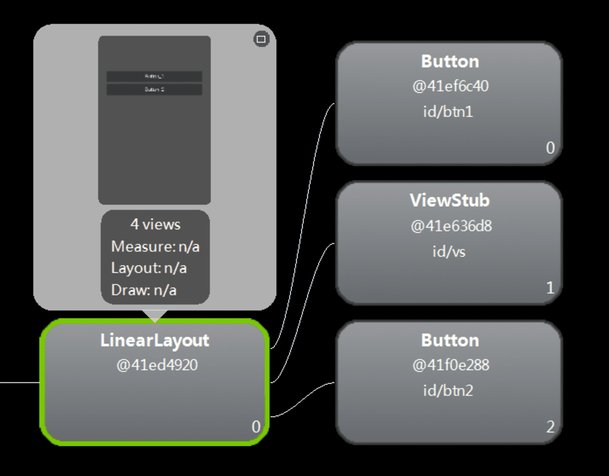
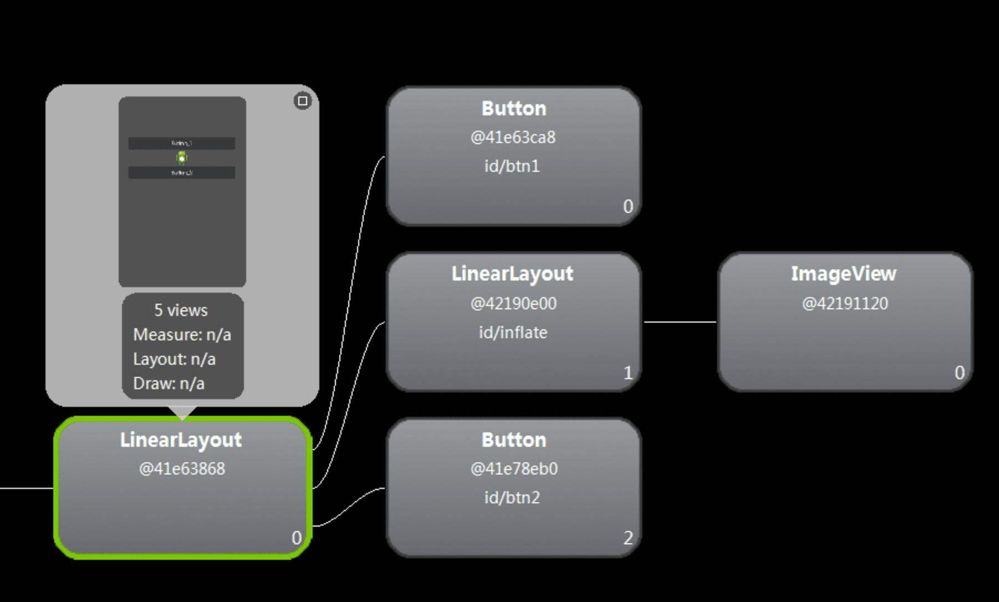
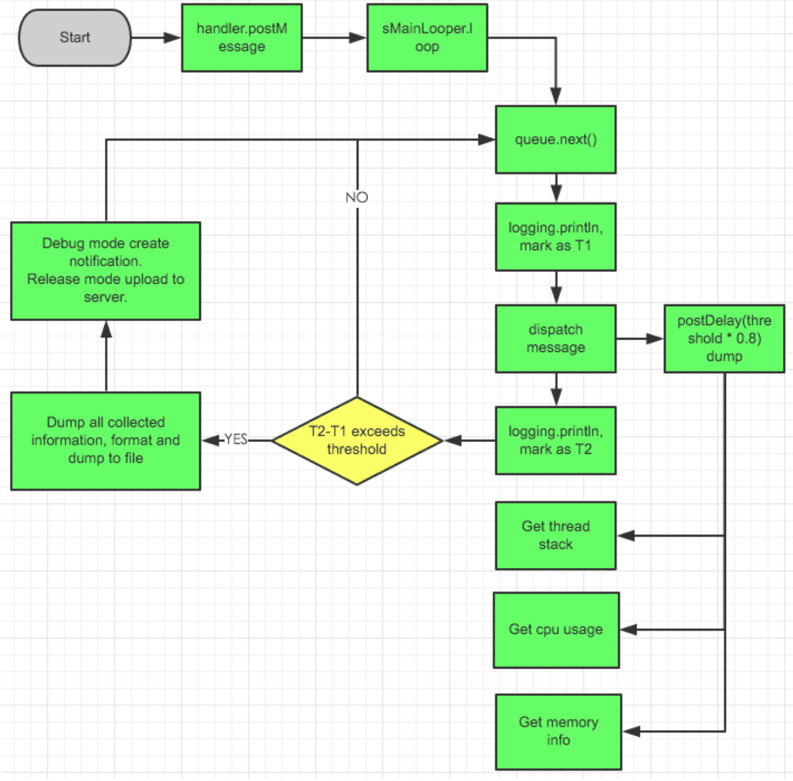
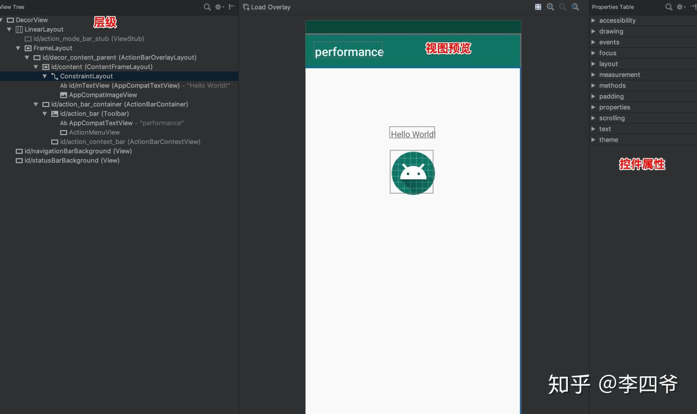
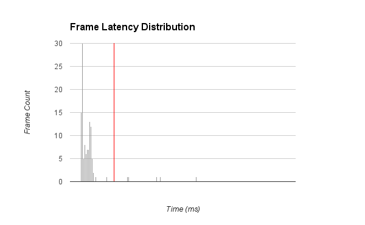
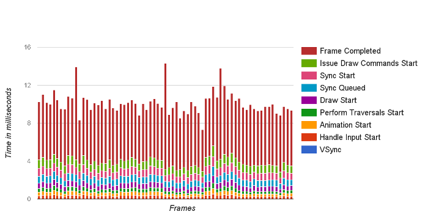
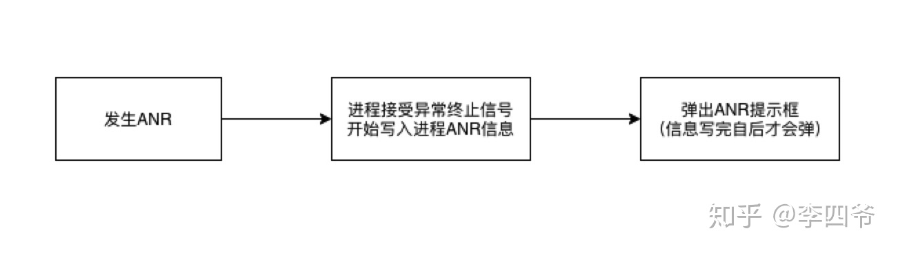
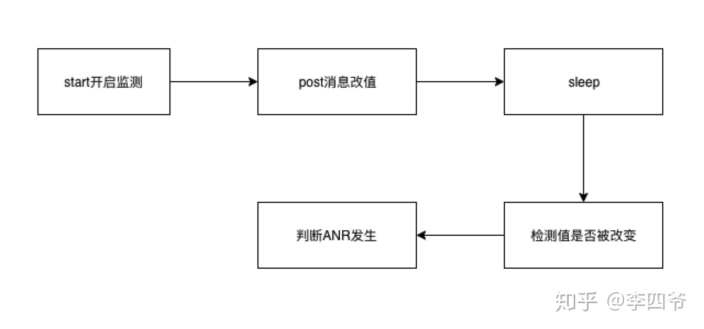
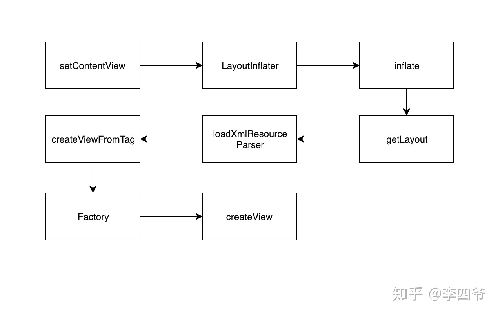

<h1 align="center">布局优化</h1>

[toc]

## 一、UI布局优化

### 1.1 merge

首先我们看官方的说明:

The <merge /> tag helps eliminate redundant view groups in your view hierarchy when including one layout within another. For example, if your main layout is a vertical LinearLayout in which two consecutive views can be re-used in multiple layouts, then the re-usable layout in which you place the two views requires its own root view. However, using another LinearLayout as the root for the re-usable layout would result in a vertical LinearLayout inside a vertical LinearLayout. The nested LinearLayout serves no real purpose other than to slow down your UI performance.

其实就是减少在include布局文件时的层级。\<merge\>标签是这几个标签中最让我费解的，大家可能想不到，<merge>标签竟然会是一个Activity，里面有一个LinearLayout对象。

使用merge来组织子元素可以减少布局的层级。例如我们在复用一个含有多个子控件的布局时，肯定需要一个ViewGroup来管理，例如这样 : 

```xml
<FrameLayout xmlns:android="http://schemas.android.com/apk/res/android"  
    android:layout_width="fill_parent"  
    android:layout_height="fill_parent">  
  
    <ImageView    
        android:layout_width="fill_parent"   
        android:layout_height="fill_parent"   
        android:scaleType="center"  
        android:src="@drawable/golden_gate" />  
      
    <TextView  
        android:layout_width="wrap_content"   
        android:layout_height="wrap_content"   
        android:layout_marginBottom="20dip"  
        android:layout_gravity="center_horizontal|bottom"  
        android:padding="12dip"  
        android:background="#AA000000"  
        android:textColor="#ffffffff"  
        android:text="Golden Gate" />  
  
</FrameLayout>  
```

将该布局通过include引入时就会多引入了一个FrameLayout层级，此时结构如下 : 

使用merge标签就会消除上图中蓝色的FrameLayout层级。示例如下 : 

```xml
<merge xmlns:android="http://schemas.android.com/apk/res/android">  
  
    <ImageView    
        android:layout_width="fill_parent"   
        android:layout_height="fill_parent"   
        android:scaleType="center"  
        android:src="@drawable/golden_gate" />  
      
    <TextView  
        android:layout_width="wrap_content"   
        android:layout_height="wrap_content"   
        android:layout_marginBottom="20dip"  
        android:layout_gravity="center_horizontal|bottom"  
        android:padding="12dip"  
        android:background="#AA000000"  
        android:textColor="#ffffffff"  
        android:text="Golden Gate" />  
  
</merge>  
```

那么它是如何实现的呢，我们还是看源码吧。相关的源码也是在LayoutInflater的inflate()函数中。

```java
public View inflate(XmlPullParser parser, ViewGroup root, boolean attachToRoot) {  
       synchronized (mConstructorArgs) {  
           final AttributeSet attrs = Xml.asAttributeSet(parser);  
           Context lastContext = (Context)mConstructorArgs[0];  
           mConstructorArgs[0] = mContext;  
           View result = root;  
  
           try {  
               // Look for the root node.  
               int type;  
               while ((type = parser.next()) != XmlPullParser.START_TAG &&  
                       type != XmlPullParser.END_DOCUMENT) {  
                   // Empty  
               }  
  
               if (type != XmlPullParser.START_TAG) {  
                   throw new InflateException(parser.getPositionDescription()  
                           + ": No start tag found!");  
               }  
  
               final String name = parser.getName();  
                 
               // 如果是merge标签，那么调用rInflate进行解析  
               if (TAG_MERGE.equals(name)) {  
                   if (root == null || !attachToRoot) {  
                       throw new InflateException("<merge /> can be used only with a valid "  
                               + "ViewGroup root and attachToRoot=true");  
                   }  
                   // 解析merge标签  
                   rInflate(parser, root, attrs, false);  
               } else {  
                  // 代码省略  
               }  
  
           } catch (XmlPullParserException e) {  
               // 代码省略  
           }   
  
           return result;  
       }  
   }  
  
  
  void rInflate(XmlPullParser parser, View parent, final AttributeSet attrs,  
       boolean finishInflate) throws XmlPullParserException, IOException {  
  
   final int depth = parser.getDepth();  
   int type;  
  
   while (((type = parser.next()) != XmlPullParser.END_TAG ||  
           parser.getDepth() > depth) && type != XmlPullParser.END_DOCUMENT) {  
  
       if (type != XmlPullParser.START_TAG) {  
           continue;  
       }  
  
       final String name = parser.getName();  
         
       if (TAG_REQUEST_FOCUS.equals(name)) {  
           parseRequestFocus(parser, parent);  
       } else if (TAG_INCLUDE.equals(name)) {  
           if (parser.getDepth() == 0) {  
               throw new InflateException("<include /> cannot be the root element");  
           }  
           parseInclude(parser, parent, attrs);  
       } else if (TAG_MERGE.equals(name)) {  
           throw new InflateException("<merge /> must be the root element");  
       } else if (TAG_1995.equals(name)) {  
           final View view = new BlinkLayout(mContext, attrs);  
           final ViewGroup viewGroup = (ViewGroup) parent;  
           final ViewGroup.LayoutParams params = viewGroup.generateLayoutParams(attrs);  
           rInflate(parser, view, attrs, true);  
           viewGroup.addView(view, params);                  
       } else { // 我们的例子会进入这里  
           final View view = createViewFromTag(parent, name, attrs);  
           // 获取merge标签的parent  
           final ViewGroup viewGroup = (ViewGroup) parent;  
           // 获取布局参数  
           final ViewGroup.LayoutParams params = viewGroup.generateLayoutParams(attrs);  
           // 递归解析每个子元素  
           rInflate(parser, view, attrs, true);  
           // 将子元素直接添加到merge标签的parent view中  
           viewGroup.addView(view, params);  
       }  
   }  
  
   if (finishInflate) parent.onFinishInflate();  
}  
```

其实就是如果是merge标签，那么直接将其中的子元素添加到merge标签parent中，这样就保证了不会引入额外的层级。

**为什么跟布局如果是FrameLayout的可以用merge标签，就可以省略一个层级呢，其实是我们的Layout添加到系统的Window中的时候是添加到FrameLauyout布局中的，所以不需要再添加一层FrameLayout**

详细内容参照：[Android系统源码分析--View绘制流程之-inflate](

### 1.2 ViewStubs

#### 1.2.1 含义解释：

ViewStub默认是不显示的，也不占用内存，加载时会被其他的布局所替代才占用内存并且才显示出来，加载后如果只是隐藏用ViewStub.setVisiblitiy(View.GONE)就可以正常隐藏，但是不能释放内存。

ViewStub和include的区别是：ViewStub中的布局不会随着它所在布局的渲染而渲染，而<include>标签中的布局会随着它所在布局的渲染而渲染，ViewStub中的布局只有在你需要的时候才会渲染到主界面中。

ViewStub只能在Activity中加载一次（除非重新创建Activity或者其他寄存器），加载后ViewStub就被ViewStub里的layout布局替换了最初的ViewStub,也就是加载后ViewStub就是相应的layout布局，因此ViewStub只能加载一次，不能重复加载否则报错。因此要做判断，ViewStub.getParent()是否为空，如果不为空则加载，为空则不加载，详情看下面代码。

#### 1.2.2 java代码：

第一种写法：判断ViewStub是否为空

```java
public class MyActivity extends Activity {

    private static final String TAG = "MyActivity";
    private Button mBtn1, mBtn2;
    private ViewStub mVs;
    private boolean isVisibility = false;

    @Override
    public void onCreate(Bundle savedInstanceState) {
        super.onCreate(savedInstanceState);
        setContentView(R.layout.main);

        mBtn1 = (Button) findViewById(R.id.btn1);
        mBtn2 = (Button) findViewById(R.id.btn2);
        mVs = (ViewStub) findViewById(R.id.vs);
        mBtn2.setOnClickListener(new View.OnClickListener() {
            @Override
            public void onClick(View v) {
                //要判断mVs是否为空，为空则说明已经加载过，不为空说明是第一次加载
                if (mVs.getParent() != null) {
                    Log.e(TAG, "vs is not null");
                    mVs.setInflatedId(R.id.inflate);
                    mVs.setLayoutResource(R.layout.myinflate);
                    mVs.inflate();
                } else {
                    Log.e(TAG, "vs is null");
                    if (!isVisibility) {
                        Log.e(TAG, "ViewStub is visible");
                        mVs.setVisibility(View.VISIBLE);
                    } else {
                        Log.e(TAG, "ViewStub is gone ");
                        mVs.setVisibility(View.GONE);
                    }
                }
                isVisibility = !isVisibility;
            }
        });
    }
}
```

第二种写法：直接作出判断第二次就不再加载

```java
public class MyActivity extends Activity {

    private static final String TAG = "MyActivity";
    private Button mBtn1, mBtn2;
    private ViewStub mVs;
    private boolean isStub = false;
    private boolean isVisibility = false;

    @Override
    public void onCreate(Bundle savedInstanceState) {
        super.onCreate(savedInstanceState);
        setContentView(R.layout.main);

        mBtn1 = (Button) findViewById(R.id.btn1);
        mBtn2 = (Button) findViewById(R.id.btn2);
        mBtn2.setOnClickListener(new View.OnClickListener() {
            @Override
            public void onClick(View v) {
                if (!isStub) {
                    Log.e(TAG, "inflate ViewStub");
                    mVs = (ViewStub) findViewById(R.id.vs);
                    mVs.setInflatedId(R.id.inflate);
                    mVs.setLayoutResource(R.layout.myinflate);
                    mVs.inflate();
                } else {
                    if (!isVisibility) {
                        Log.e(TAG, "ViewStub is visible");
                        mVs.setVisibility(View.VISIBLE);
                    } else {
                        Log.e(TAG, "ViewStub is gone ");
                        mVs.setVisibility(View.GONE);
                    }
                }
                isVisibility = !isVisibility;
                isStub = true;
            }
        });
    }
}
```

#### 1.2.3 xml代码：

main.layout代码：

```xml
<?xml version="1.0" encoding="utf-8"?>
<LinearLayout xmlns:android="http://schemas.android.com/apk/res/android"
    android:orientation="vertical"
    android:layout_width="fill_parent"
    android:layout_height="fill_parent">

    <Button
        android:id="@+id/btn1"
        android:layout_width="match_parent"
        android:layout_height="wrap_content"
        android:layout_marginTop="100dp"
        android:text="Button_1" />

    <ViewStub
        android:id="@+id/vs"
        android:layout_width="match_parent"
        android:layout_height="wrap_content"
        android:inflatedId="@+id/inflate"
        android:layout="@layout/myinflate" />

    <Button
        android:id="@+id/btn2"
        android:layout_width="match_parent"
        android:layout_height="wrap_content"
        android:text="Button_2" />
</LinearLayout>
```

解释：我之前看别人讲解一直不明白android:inflatedId="@+id/inflate"这个是什么意思，后来看java代码才知道里面有个setInflate函数中的id就是这个id，这个id是随便设置的，尽量和你的layout的id相近，为了布局多时好辨认，layout的id是你要加载的布局的id及下面的myinflate。

myinflate代码：这里为了显示清晰特意用LinearLayout嵌套了一个ImageView

```xml
<?xml version="1.0" encoding="utf-8"?>

<LinearLayout xmlns:android="http://schemas.android.com/apk/res/android"
    android:orientation="vertical"
    android:layout_width="match_parent"
    android:layout_height="match_parent">

    <ImageView
        android:layout_width="wrap_content"
        android:layout_height="wrap_content"
        android:layout_gravity="center_horizontal"
        android:background="@drawable/ic_launcher" />
</LinearLayout>
```

#### 1.2.4 看看结构层次图：

（1）未点击加载布局是的结构图：可以看到两个按钮中间没有其他组件，结构为两层，ViewStub和Button在一层上。




（2）第一次加载后：可以看到两个按钮之间多出一个图片组件，结构图也变成了三层，与上图相比LinearLayout是后即在出来的，而ViewStub组件也不见了，说明是被替换了。




（3）隐藏mVs（即后加载进来的LinearLayout布局）后的图：层次和结构未变只是中间的图片消失了。


#### 1.2.5 结尾：

ViewSub对于我们组件较多但又不需要一次性加载的应用优化是非常好的工具，希望大家熟练该组件的用法。


**节约内存从优化开始。**

详细内容可参考：[Android系统源码分析--View绘制流程之-inflate](http://codemx.cn/2018/11/20/AndroidOS013-View-inflate/)

## 二、UI卡顿检测

### 2.1 优化工具

#### 2.1.1 CPU Profile

目前Android Studio以及自带了CPU Profiler工具，它可以以图形化的形式展示执行的时间、调用栈等信息。收集的信息比较全面，包含了所有线程。但是由于其收集信息全面，导致了运行时内存开销严重，App函数整体运行都会变慢，可能会带偏我们的优化方向。

使用方式： Debug.startMethodTracing(); ... Debug.stopMethodTracing(); 最终生成的文件在sd卡：Android/data/packagename/files目录下。

#### 2.1.2 Systrace

Systrace之前文章已经讲解过，它是轻量级的框架，而且开销小，可以直观反映CPU的利用率而且右侧alter可以针对一些问题给出相关的建议。 比如绘制慢或者GC频繁等。

#### 2.1.3 StrictMode

Android2.3引入的一个工具类：严苛模式。是一种运行时检测机制。可以帮助开发人员检测代码当中不规范的问题。StrictMode主要检测线程策略和虚拟机策略。

线程策略包括：

- 自定义的耗时调用，detectCustimSlowCalls
- 磁盘读取操作，detectDiskReads
- 网络操作，detectNetwork

虚拟机策略：

- Activity泄漏，detectActivityLeaks
- Sqlite对象泄漏，detectLeakedSqlLiteObjects
- 检测实例数量，setClassInstanceLimit

我们在Application中使用：

```java
private void initStrictMode() {
        if (BuildConfig.DEBUG) {
            //线程
            StrictMode.setThreadPolicy(new StrictMode.ThreadPolicy.Builder()
                    .detectCustomSlowCalls() //API等级11，使用StrictMode.noteSlowCode
                    .detectDiskReads()
                    .detectDiskWrites()
                    .detectNetwork()// 或者直接使用 .detectAll() 手机全部信息
                    .penaltyLog() //在Logcat 中打印违规异常信息，还可以选择弹框提示或者直接奔溃等
                    .build());
            //虚拟机
            StrictMode.setVmPolicy(new StrictMode.VmPolicy.Builder()
                    .detectLeakedSqlLiteObjects()
                    .setClassInstanceLimit(StrictModeTest.class, 1)
                    .detectLeakedClosableObjects() //API等级11
                   .penaltyDropBox()
                    .build());
        }
    }
```

StrictMode本身也是耗性能的，所以我们只在debug模式下开启。当出现不符合检测策略的时候就会在控制台打印日志，输入StrictMode关键词过滤即可。

#### 2.1.4 [AndroidPerformanceMonitor](https://github.com/markzhai/AndroidPerformanceMonitor)

原理：见2.2节



#### 2.1.5 Layout Inspector

这个是Android Studio自带的检测工具，在Tools栏目下。它可以帮助我们查看视图的层次结构。

 

#### 2.1.6 ChoreoGrapher

ChoreoGrapher可以帮助我们获取应用的FPS，即上文中的60Hz，并且可以线上使用，具备实时性。但是有一点需要注意的是必须API 16后使用。如下代码：

```java
	private var mStartFrameTime: Long = 0
    private var mFrameCount = 0
    private val MONITOR_INTERVAL = 160L //单次计算FPS使用160毫秒
    private val MONITOR_INTERVAL_NANOS = MONITOR_INTERVAL * 1000L * 1000L
    private val MAX_INTERVAL = 1000L //设置计算fps的单位时间间隔1000ms,即fps/s;

    override fun onCreate(savedInstanceState: Bundle?) {
        setTheme(R.style.AppTheme)
        super.onCreate(savedInstanceState)
        setContentView(R.layout.activity_main)
        getFPS()
    }

    @TargetApi(Build.VERSION_CODES.JELLY_BEAN)
    private fun getFPS() {
        if (Build.VERSION.SDK_INT < Build.VERSION_CODES.JELLY_BEAN) {
            return
        }
        Choreographer.getInstance().postFrameCallback(object : Choreographer.FrameCallback {
            override fun doFrame(frameTimeNanos: Long) {
                if (mStartFrameTime == 0L) {
                    mStartFrameTime = frameTimeNanos
                }
                val interval = frameTimeNanos - mStartFrameTime
                if (interval > MONITOR_INTERVAL_NANOS) {
                    val fps = (mFrameCount.toLong() * 1000L * 1000L).toDouble() / interval * MAX_INTERVAL
                    Log.i("fps", fps.toString())
                    mFrameCount = 0
                    mStartFrameTime = 0
                } else {
                    ++mFrameCount
                }
                Choreographer.getInstance().postFrameCallback(this)
            }
        })
    }
```

执行代码后输出：

```text
fps: 60.0158955700371
fps: 60.00346688030940
fps: 60.01226146521353
fps: 59.98537016806971
fps: 60.00205735054243
```

每次打印的数据都在60左右，说明页面刷新没有出现卡顿。

#### 2.1.7 测试界面性能

界面 (UI) 性能测试可确保您的应用不仅满足其功能要求，而且用户与应用之间的交互顺畅无比，能够持续以每秒 60 帧（[为什么选择 60fps？](https://www.youtube.com/watch?v=CaMTIgxCSqU&index=25&list=PLWz5rJ2EKKc9CBxr3BVjPTPoDPLdPIFCE&hl=zh-cn)）的帧速运行，而不会出现任何帧丢失或延迟的现象，也就是我们通常所说的“卡顿”。本文档介绍了可用于衡量界面性能的工具，并提出一种将界面性能衡量方式融入测试实践中的方法。

**衡量界面性能**

为了改善性能，您首先必须能够衡量系统性能，然后诊断并识别可能源自管道各个部分的问题。

[dumpsys](https://developer.android.com/studio/command-line/dumpsys?hl=zh-cn) 是一种在设备上运行并转储需要关注的系统服务状态信息的 Android 工具。通过向 dumpsys 传递 gfxinfo 命令，可以提供 logcat 格式的输出，其中包含与录制阶段发生的动画帧相关的性能信息。

```
> adb shell dumpsys gfxinfo <PACKAGE_NAME>
```

此命令可以生成多个不同表达形式的帧时间数据。

**聚合帧统计信息**

借助 Android 6.0（API 级别 23），该命令可将在整个进程生命周期中收集的帧数据的聚合分析输出到 logcat。例如：

```
    Stats since: 752958278148ns
    Total frames rendered: 82189
    Janky frames: 35335 (42.99%)
    90th percentile: 34ms
    95th percentile: 42ms
    99th percentile: 69ms
    Number Missed Vsync: 4706
    Number High input latency: 142
    Number Slow UI thread: 17270
    Number Slow bitmap uploads: 1542
    Number Slow draw: 23342
```

这些总体统计信息可以较为全面地展示应用的渲染性能及其在多个帧之间的稳定性。

**精确的帧时间信息**

Android 6.0 附带提供了一个适用于 gfxinfo 的新命令，即：framestats，该命令会根据最近的帧提供非常详细的帧时间信息，让您能够更准确地查出并调试问题。

```
>adb shell dumpsys gfxinfo <PACKAGE_NAME> framestats
```

该命令会从应用生成的最近 120 个帧中输出带有纳秒时间戳的帧时间信息。以下是 adb dumpsys gfxinfo <PACKAGE_NAME> framestats 的原始输出示例：

```
 0,
 27965466202353,
 27965466202353,
 27965449758000,
 27965461202353,
 27965467153286,
 27965471442505,
 27965471925682,
 27965474025318,
 27965474588547,
 27965474860786,
 27965475078599,
 27965479796151,
 27965480589068,
 0,
 27965482993342,
 27965482993342,
 27965465835000,
 27965477993342,
 27965483807401,
 27965486875630,
 27965487288443,
 27965489520682,
 27965490184380,
 27965490568703,
 27965491408078,
 27965496119641,
 27965496619641,
 0,
 27965499784331,
 27965499784331,
 27965481404000,
 27965494784331,
 27965500785318,
 27965503736099,
 27965504201151,
 27965506776568,
 27965507298443,
 27965507515005,
 27965508405474,
 27965513495318,
 27965514061984,
 0,
 27965516575320,
 27965516575320,
 27965497155000,
 27965511575320,
 27965517697349,
 27965521276151,
 27965521734797,
 27965524350474,
 27965524884536,
 27965525160578,
 27965526020891,
 27965531371203,
 27965532114484,
```

每行输出均代表应用生成的一帧。每行都有固定的列数，描述帧生成管道的每个阶段所花的时间。下文将详细描述此格式，包括每列代表的具体内容。

**Framestats 数据格式**

由于数据块是 CSV 格式的输出，因此将其粘贴到所选的电子表格工具或使用脚本进行收集和解析非常简单。下表解释了输出数据列的格式。所有时间戳均以纳秒计。

- FLAGS
   - FLAGS 列为“0”的行可以通过从 FRAME_COMPLETED 列中减去 INTENDED_VSYNC 列计算得出总帧时间。
   - 该列为非零值的行应该被忽略，因为其对应的帧已被确定为偏离正常性能，其布局和绘制时间预计超过 16 毫秒。出现这种情况可能有如下几个原因：
      - 窗口布局发生变化（例如，应用的第一帧或在旋转后）
      - 此外，如果帧的某些值包含无意义的时间戳，则也可能跳过该帧。例如，如果帧的运行速度超过 60fps，或者如果屏幕上的所有内容最终都准确无误，则可能跳过该帧，这不一定表示应用中存在问题。
- INTENDED_VSYNC
   - 帧的预期起点。如果此值不同于 VSYNC，则表示界面线程中发生的工作使其无法及时响应 Vsync 信号。
- VSYNC
   - 所有 Vsync 监听器中使用的时间值和帧绘图（Choreographer 帧回调、动画、View.getDrawingTime() 等等）
   - 如需进一步了解 VSYNC 及其对应用产生的影响，请观看[了解 VSYNC](https://www.youtube.com/watch?v=1iaHxmfZGGc&list=PLOU2XLYxmsIKEOXh5TwZEv89aofHzNCiu&index=23&hl=zh-cn) 视频。
- OLDEST_INPUT_EVENT
   - 输入队列中最早输入事件的时间戳或 Long.MAX_VALUE（如果帧没有输入事件）。
   - 此值主要用于平台工作，对应用开发者的作用有限。
- NEWEST_INPUT_EVENT
   - 输入队列中最新输入事件的时间戳或 0（如果帧没有输入事件）。
   - 此值主要用于平台工作，对应用开发者的作用有限。
   - 但是，可以通过查看 (FRAME_COMPLETED - NEWEST_INPUT_EVENT) 大致了解应用增加的延迟时间。
- HANDLE_INPUT_START
   - 将输入事件分派给应用的时间戳。
   - 通过观察此时间戳与 ANIMATION_START 之间的时间差，可以测量应用处理输入事件所花的时间。
   - 如果这个数字较高（> 2 毫秒），则表明应用处理 View.onTouchEvent() 等输入事件所花的时间太长，这意味着此工作需要进行优化或转交给其他线程。请注意，有些情况下（例如，启动新 Activity 或类似活动的点击事件），这个数字较大是预料之中并且可以接受的。
- ANIMATION_START
   - 在 Choreographer 中注册的动画运行的时间戳。
   - 通过观察此时间戳与 PERFORM_TRANVERSALS_START 之间的时间差，可以确定评估正在运行的所有动画（常见动画有 ObjectAnimator、ViewPropertyAnimator 和 Transitions）所用的时间。
   - 如果这个数字较高（> 2 毫秒），请检查您的应用是否编写了任何自定义动画，或检查 ObjectAnimator 在对哪些字段设置动画并确保它们适用于动画。
   - 如需了解有关 Choreographer 的更多信息，请观看[利弊](https://www.youtube.com/watch?v=Q8m9sHdyXnE&hl=zh-cn)视频。
- PERFORM_TRAVERSALS_START
   - 如果您从此值中减去 DRAW_START，则可推断出完成布局和测量阶段所用的时间（请注意，在滚动或动画期间，您会希望此时间接近于零）。
   - 如需了解有关渲染管道的测量和布局阶段的更多信息，请观看[失效、布局和性能](https://www.youtube.com/watch?v=we6poP0kw6E&list=PLOU2XLYxmsIKEOXh5TwZEv89aofHzNCiu&index=27&hl=zh-cn)视频。
- DRAW_START
   - performTraversals 绘制阶段的开始时间。这是记录任何失效视图的显示列表的起点。
   - 此时间与 SYNC_START 之间的时间差就是对树中所有失效视图调用 View.draw() 所用的时间。
   - 如需了解有关绘图模型的详细信息，请参阅[硬件加速](https://developer.android.com/guide/topics/graphics/hardware-accel?hl=zh-cn#hardware-model)或[失效、布局和性能](https://www.youtube.com/watch?v=we6poP0kw6E&list=PLOU2XLYxmsIKEOXh5TwZEv89aofHzNCiu&index=27&hl=zh-cn)视频。
- SYNC_QUEUED
   - 将同步请求发送给 RenderThread 的时间。
   - 它标记的是将开始同步阶段的消息发送给 RenderThread 的时间点。如果该时间点与 SYNC_START 的时间差较大（约 > 0.1 毫秒），则意味着 RenderThread 正忙于处理另一帧。它在内部用于区分该帧是因作业负荷过大而超过了 16 毫秒的预算时间，还是该帧由于上一帧超过 16 毫秒的预算时间而停止。
- SYNC_START
   - 绘制同步阶段的开始时间。
   - 如果此时间与 ISSUE_DRAW_COMMANDS_START 之间相差较大（约 > 0.4 毫秒），通常表示绘制了大量必须上传到 GPU 的新位图。
   - 如需进一步了解同步阶段，请观看 [GPU 渲染分析](https://www.youtube.com/watch?v=VzYkVL1n4M8&index=24&list=PLOU2XLYxmsIKEOXh5TwZEv89aofHzNCiu&hl=zh-cn)视频。
- ISSUE_DRAW_COMMANDS_START
   - 硬件渲染器开始向 GPU 发出绘图命令的时间。
   - 此时间与 FRAME_COMPLETED 之间的时间差让您可以大致了解应用生成的 GPU 工作量。绘制过度或渲染效果不佳等问题都会在此显示出来。
- SWAP_BUFFERS
   - 调用 eglSwapBuffers 的时间，在平台工作范围之外，意义相对不大。
- FRAME_COMPLETED
   - 大功告成！处理此帧所花的总时间可以通过执行 FRAME_COMPLETED - INTENDED_VSYNC 计算得出。

您可以通过不同的方法使用此数据。一种简单却有用的可视化方式就是在不同的延迟时段中显示帧时间 (FRAME_COMPLETED - INTENDED_VSYNC) 分布的直方图（参见下图）。此图直观地表明，大部分帧非常有效，截止时间远低于 16 毫秒（显示为红色），但是少数帧明显超出了截止时间。我们可以观察此直方图中的变化趋势，了解所产生的整体变化或新异常值。此外，您还可以根据数据中的多个时间戳绘制表示输入延迟、布局所用时间或其他类似关注指标的图表。



**简单的帧时间转储**

如果在“Developer Options”中将 **Profile GPU rendering**（或 **Profile HWUI rendering**）设置为 **In adb shell dumpsys gfxinfo**，则 `adb shell dumpsys gfxinfo` 命令会输出最近 120 帧的时间信息，分为几个不同的类别，并且值以制表符分隔。这些数据可以用于大致表明绘图管道的哪些部分可能速度较慢。

与上述 [framestats](https://developer.android.com/training/testing/performance?hl=zh-cn#fs-data-format) 类似，将其粘贴到所选的电子表格工具或使用脚本进行收集和解析同样非常简单。下图详细显示了应用生成的许多帧的具体时间分布。



运行 gfxinfo、复制输出、将其粘贴到电子表格应用并将数据绘制成堆积条形图的结果。

每个竖条均代表一个动画帧；其高度代表计算该动画帧所用的毫秒数。竖条的每个彩色分段均代表渲染管道的一个不同阶段，因此您可以看到应用的哪些部分可能会造成瓶颈。如需了解有关渲染管道的详细信息，请参阅[失效、布局和性能](https://www.youtube.com/watch?v=we6poP0kw6E&index=27&list=PLWz5rJ2EKKc9CBxr3BVjPTPoDPLdPIFCE&hl=zh-cn)视频。

**控制统计信息收集的时段**

Framestats 和简单的帧时间均可在极短的时间内（相当于约 2 秒渲染）收集数据。要精确控制此时间范围（例如，将数据限制于特定动画），您可以重置所有计数器并汇总收集的统计信息。

```
>adb shell dumpsys gfxinfo <PACKAGE_NAME> reset
```

这也可以与转储命令结合使用来定期进行收集和重置，从而持续捕获时间范围不到 2 秒的帧。

**诊断性能回归**

为了查出问题并使应用保持良好运行状况，第一步最好是识别回归。但是，dumpsys 仅确定是否存在问题及其相对严重性。您仍需诊断性能问题的具体原因并找到适当的解决方法。为此，我们强烈建议您使用 [systrace](https://developer.android.com/tools/help/systrace?hl=zh-cn) 工具。

**其他资源**

如需了解有关 Android 渲染管道的工作原理、可能存在的常见问题以及如何解决这些问题的详细信息，以下资源可能对您有所帮助：

- [渲染性能 101](https://www.youtube.com/watch?v=HXQhu6qfTVU&hl=zh-cn)
- [为什么选择 60fps？](https://www.youtube.com/watch?v=CaMTIgxCSqU&hl=zh-cn)
- [Android、界面和 GPU](https://www.youtube.com/watch?v=WH9AFhgwmDw&hl=zh-cn)
- [失效、布局和性能](https://www.youtube.com/watch?v=we6poP0kw6E&hl=zh-cn)
- [系统跟踪概览](https://developer.android.com/topic/performance/tracing?hl=zh-cn)

**自动执行界面性能测试**

界面性能测试方法之一是让测试人员对目标应用执行一系列用户操作，并目视检查是否存在卡顿现象，或花费大量时间使用工具驱动型方法来查明是否存在卡顿现象。但是，这种人工方法充满风险：人为感知帧率变化的能力参差不齐，并且此过程还很费时、繁琐且易于出错。

更为有效的方法是记录并分析自动化界面测试中的关键性能指标。Android 6.0 包括新的日志记录功能。利用这些功能，您可以轻松确定应用动画中的卡顿数量和严重性，您还可以使用这些功能构建严格的流程，用于确定当前性能并跟踪未来的性能目标。

### 2.2 自动化检测卡顿方法

CPU Profiler 和 Systrace 都是适合线下使用的，无法带到线上。那我们如何做到线上监测卡顿呢？

我们都知道一个进程中只有个Looper对象，我们通过查看Looper源码发现，在其loop方法中的死循环中有个mLogging对象，在执行的时候打印了一个Dispatching to日志，执行完成的时候有打印了一个Finished to日志。如：

```java
public static void loop() {

       // ....省略开始代码...

        for (;;) {
            Message msg = queue.next(); // might block
            if (msg == null) {
                // No message indicates that the message queue is quitting.
                return;
            }

            // This must be in a local variable, in case a UI event sets the logger
            final Printer logging = me.mLogging;
            if (logging != null) {
                //重点 开始打印
                logging.println(">>>>> Dispatching to " + msg.target + " " +
                        msg.callback + ": " + msg.what);
            }

            // ...省略中间代码...

            if (logging != null) {
                //重点 完成打印
                logging.println("<<<<< Finished to " + msg.target + " " + msg.callback);
            }

            // ...省略最后代码...
        }
    }
```

所以我们可以自定义Printer对象，让Handler的日志都通过我们自定义的Printer进行打印，然后收集日志信息，匹配Dispatching to和Finished to字段，如果在设定的某个时间内只有Dispatching to字段而没有Finished to字段，那么就说明发生了卡顿。发生卡顿后我们就收集此时的调用栈信息。相反如果两个字段都存在则说明应用运行的很流畅。

字段Printer设置给mLogging对象：

```java
Looper.getMainLooper().setMessageLogging(new Printer() {
    @Override
    public void println(String log) {
          Log.e("printer","==println=="+log);
    }
});
```

代码中的log字段就是我们需要的Dispatch和Finished字段，我们监测这两个字段并收集调用栈信息将其发送到后端进行分析使用。

那么这里其实还存在一个问题就是可能我们收集的信息不够准确，为什么呢？就是我们收集的调用栈信息是最后收集的，那么这个时候有可能卡顿已经执行完成了，此刻搜集到的信息有可能不是卡顿发生的关键信息。就像OOM一样，它是一个随时都有可能发生的。所以我们需要高频率的收集日志信息，高频率的收集对后端有一定的压力，而我们高频收集的信息有很大一部分也是重复的，所以就需要日志去重操作。

### 2.3 ANR异常

ANR异常全称 Application Not Responding，即应用无响应。如果你的应用程序有一段时间响应不够灵敏，系统会向用户显示一个对话框，这个对话框称作应用程序无响应对话框，用户可以选择“等待”而让程序继续运行，也可以选择“强制关闭”。所以一个流畅的合理的应用程序中不能出现anr。因为这很影响用户的使用体验，当然由于厂商深度定制系统的原因，在某些手机上发生ANR也不会弹框的。

发生ANR到弹框在不同的组件之间时间定义是不一样的，按键是5秒。前台广播10秒，后台广播60秒。前台服务20秒，后台服务200秒。这些数据都定义在AMS中，读者可以去看看。

ANR发生执行的流程：



ANR的日志在data/anr/traces.txt目录下。

我们在线下的时候可以直接通过ADB命令来查看日志：

adb pull data/anr/traces.txt 你的目录 这样可以详细分析CPU、IO、锁等操作的问题所在。

线上我们可以使用FileObserver监控文件变化，但是这种方法在高版本系统中有权限问题。另外一种就是使用AnrWatchDog框架。这也是一个开源框架，地址：[https://github.com/SalomonBrys/ANR-WatchDog](https://link.zhihu.com/?target=https%3A//github.com/SalomonBrys/ANR-WatchDog)。它的原理就是通过修改值的方式判断UI线程是否发生卡顿。



这个库使用也非常简单，首先在gradle中配置：

```gradle
compile 'com.github.anrwatchdog:anrwatchdog:1.4.0'
```

然后在Application中进行初始化：

```java
new ANRWatchDog().start();
```

这样就可以了。默认检测到卡顿就直接抛ANRError异常将应用奔溃，我们可以复写Listener接口来抓取堆栈信息。

ANRWatchDog是继承之Thread线程的，那么我们就看下核心方法run方法中的代码逻辑。

```java
    // post的操作
    private final Runnable _ticker = new Runnable() {
        @Override 
        public void run() {
            _tick = 0;
            _reported = false;
        }
    };
    
    @Override
    public void run() {
        // 首先对线程进行重命名
        setName("|ANR-WatchDog|");

        long interval = _timeoutInterval;
        while (!isInterrupted()) {
            boolean needPost = _tick == 0;
            _tick += interval;
            if (needPost) {
                // 发送post
                _uiHandler.post(_ticker);
            }

            try {
                // 睡眠
                Thread.sleep(interval);
            } catch (InterruptedException e) {
                _interruptionListener.onInterrupted(e);
                return ;
            }

            // If the main thread has not handled _ticker, it is blocked. ANR.
            if (_tick != 0 && !_reported) {
                //noinspection ConstantConditions
                if (!_ignoreDebugger && (Debug.isDebuggerConnected() || Debug.waitingForDebugger())) {
                    Log.w("ANRWatchdog", "An ANR was detected but ignored because the debugger is connected (you can prevent this with setIgnoreDebugger(true))");
                    _reported = true;
                    continue ;
                }

                interval = _anrInterceptor.intercept(_tick);
                if (interval > 0) {
                    continue;
                }

                final ANRError error;
                if (_namePrefix != null) {
                    error = ANRError.New(_tick, _namePrefix, _logThreadsWithoutStackTrace);
                } else {
                    error = ANRError.NewMainOnly(_tick);
                }
                _anrListener.onAppNotResponding(error);
                interval = _timeoutInterval;
                _reported = true;
            }
        }
    }
```

使用ANRWatchDog的原因就是它是非侵入式的，并且可以弥补高版本权限问题。二者结合使用。

## 三、UI卡顿优化

### 3.1 布局加载原理

我们经常写的XML布局文件是如何被加载的呢？又是如何显示出来的？下面就带着大家顺着源码往下看，这里就不截图了，读者朋友们看完本章后自己可以去熟悉下这块代码。

首先要从setContentView方法开始说起了，其中调用了getDeleate().setContentView(resid)方法，接着调用了 LayoutInflater.from(this.mContext).inflate(resId, contentParent)来填充布局，这个API我们大家应该都很熟悉了吧。紧接着调用getLayout方法，在getlayout方法中通过loadXmlResourceParser加载并解析XML布局文件，后面调用createViewFromTag方法，根据标签创建相对应为view，具体view的创建则是由Factory或者Factory2来完成的，首先先判断了Factory2是否为null，不为null，则用其创建view，否则就判断Factory是否为null，不为null，则由其创建。如果两个都为null，则不创建view，紧接着判断了mPrivateFactory是否为null，这里需要说明的是mPrivateFactory是一个隐藏的API只有framework才能调用，如果都没创建，那么view则由后续逻辑通过onCreateView或者createView通过反射来创建。具体流程图如下：



从上面的分析中我们可以看出加载布局是有瓶颈的。其中有两个瓶颈分别是在布局文件解析的时候是一个IO过程，这肯定是比较耗时的。再一个就是最后创建View的时候是通过反射的方式进行的。既然是反射性能肯定也是有影响的，后面我们也是围绕这两点进行布局加载的优化。

### 3.2 获取界面布局耗时

我们做优化的前提就是得知道哪里是比较耗时的，所以检测耗时的UI还是蛮重要的。只有知道问题在哪了才能针对性的解决它。这里讲到检测耗时，读过我启动优化一文的读者肯定能想到至少两种方式，一种是手动埋点，另外一种就是AOP的方式。手动埋点呢就是在setContentView方法的前后执行的地方手动打点。

```java
override 
fun onCreate(savedInstanceState: Bundle?) {
        super.onCreate(savedInstanceState)
        LaunchRecord.startRecord()
        setContentView(R.layout.activity_main)
        LaunchRecord.endRecord("setContentView")
}
```

打印：

```text
===setContentView===170
```

这种方式呢不够优雅而且对代码有侵入性。

下面我们看下AOP的方式，操作和启动优化一文中的一样。

```java
	@Around("call(* android.app.Activity.setContentView(..))")
    public void getSetContentViewTime(ProceedingJoinPoint joinPoint) {
        Signature signature = joinPoint.getSignature();
        String name = signature.toShortString();
        long time = System.currentTimeMillis();
        try {
            joinPoint.proceed();
        } catch (Throwable throwable) {
            throwable.printStackTrace();
        }
        Log.d("ContentViewTime", name + " cost " + (System.currentTimeMillis() - time));
    }
```

控制台打印：

```text
ContentViewTime: MainActivity.setContentView(..) cost 74
```

以上两种方法都是获取全部布局被加载完成后的时间，那么如果想获取单个控件的加载耗时如何做呢？这里给大家介绍LayoutInflaterCompat.setFactory2方式（大家以后看到带有Compat字段的都是兼容的API），其使用必须在super.onCreate之前调用。

```java
public class MainActivity extends AppCompatActivity {

    @Override
    protected void onCreate(@Nullable Bundle savedInstanceState) {

        LayoutInflaterCompat.setFactory2(getLayoutInflater(), new LayoutInflater.Factory2() {
            @Override
            public View onCreateView(View parent, String name, Context context, AttributeSet attrs) {

                long start = System.currentTimeMillis();
                View view = getDelegate().createView(parent, name, context, attrs);
                long cost = System.currentTimeMillis() - start;
                Log.d("onCreateView", "==" + name + "==cost==" + cost);
                return view;
            }

            @Override
            public View onCreateView(String name, Context context, AttributeSet attrs) {
                return null;
            }
        });

        super.onCreate(savedInstanceState);
        setContentView(R.layout.activity_main);
    }
}
```

控制台打印：

```text
onCreateView: ==LinearLayout=cost==16
onCreateView: ==ViewStub=cost==0
onCreateView: ==FrameLayout=cost==0
onCreateView: ==android.support.v7.widget.ActionBarOverlayLayout=cost==0
onCreateView: ==android.support.v7.widget.ContentFrameLayout=cost==0
onCreateView: ==android.support.v7.widget.ActionBarContainer=cost==0
onCreateView: ==android.support.v7.widget.Toolbar=cost==0
onCreateView: ==android.support.v7.widget.ActionBarContextView=cost==0
onCreateView: ==android.support.constraint.ConstraintLayout=cost==0
onCreateView: ==TextView=cost==3
onCreateView: ==ImageView=cost==24
```

LayoutInflaterCompat.setFactory2的API不仅仅是可以统计View创建的时间，其实我们还可以用来替换系统控件的操作，比如某一天产品经理提了一个需求要我们将应用的TextView统一改成某种样式，我们就可以使用这种方式来做。如：

```java
	LayoutInflaterCompat.setFactory2(getLayoutInflater(), new LayoutInflater.Factory2() {
            @Override
            public View onCreateView(View parent, String name, Context context, AttributeSet attrs) {

               if(TextUtils.equals("TextView",name)){
                   //替换为我们自己的TextView

               }

               return null;//返回自定义View
            }

            @Override
            public View onCreateView(String name, Context context, AttributeSet attrs) {
                return null;
            }
        });
```

只要我们在基类Activity的onCreate中定义这个方法，就可以实现相关效果。

### 3.3 布局加载优化

基于布局加载的两个性能问题，谷歌给我们提供了一个类AsyncLayoutInflater，它可以从侧面解决布局加载耗时的问题，AsyncLayoutInflater是在工作线程中加载布局，加载好后会回调到主线程，这样可以节省主线程的时间。这个类没有包含在SDK中，需要我们在gradle中配置，如：

```text
implementation 'com.android.support:asynclayoutinflater:28.0.0-alpha1'
```

使用：

```java
public class MainActivity extends AppCompatActivity {

    @Override
    protected void onCreate(@Nullable Bundle savedInstanceState) {

        new AsyncLayoutInflater(MainActivity.this).inflate(R.layout.activity_main, null,
                new AsyncLayoutInflater.OnInflateFinishedListener() {
            @Override
            public void onInflateFinished(@NonNull View view, int i, @Nullable ViewGroup viewGroup) {
                setContentView(view); //view以及加载完成
                //可以在这里findViewById相关操作
            }
        });

        super.onCreate(savedInstanceState);
      //  setContentView(R.layout.activity_main); //这里就不用设置布局文件了
    }
}
```

我们在inflate的时候就将布局文件设置给AsyncLayoutInflater，所以下面我们就不需要在setContentView了。

上面说的AsyncLayoutInflater是从侧面解决布局加载耗时问题，那么我们如何从根本上解决这个问题呢？主要问题就是我们书写的XML文件需要加载解析和绘制，那如果我们不使用XML文件写布局文件，问题是不是就解决？在Android中，还有另外一种方式来写布局文件，那就是Java代码，通过Java代码来写布局，本质上是解决了性能问题，但是不便于开发，没有实时预览，而且可维护性太差。那么如果能有一种解决方式就是，我们开发人员还是正常写 XML文件，但是在加载的时候加载的是Java代码，那这样是不是很完美了。

所以下面给大家介绍一个新的框架：X2C，这是掌阅开源的一个框架，它保留了XML的优点，同时解决了性能问题，开发人员写XML文件，加载的时候只加载Java代码。

X2C的原理就是通过APT编译期时将XML翻译为Java代码。使用也很简单，首先gradle配置：

```text
annotationProcessor 'com.zhangyue.we:x2c-apt:1.1.2'
implementation 'com.zhangyue.we:x2c-lib:1.0.6'
```

Java代码使用：

```java
@Xml(layouts = "activity_main")
public class MainActivity extends AppCompatActivity {

    @Override
    protected void onCreate(@Nullable Bundle savedInstanceState) {
        super.onCreate(savedInstanceState);
      //  setContentView(R.layout.activity_main); //这里就不用设置布局文件了
    }
}
```

编译之后会在build/generated/source/apt/debug/ 下面生成相关的文件。如我们的activity_main的布局文件会被翻译为：

```java
Resources res = ctx.getResources();

        ConstraintLayout constraintLayout0 = new ConstraintLayout(ctx);

        TextView textView1 = new TextView(ctx);
        ConstraintLayout.LayoutParams layoutParam1 = new ConstraintLayout.LayoutParams(ViewGroup.LayoutParams.WRAP_CONTENT,ViewGroup.LayoutParams.WRAP_CONTENT);
        textView1.setId(R.id.mTextView);
        layoutParam1.topMargin= (int)(TypedValue.applyDimension(TypedValue.COMPLEX_UNIT_DIP,100,res.getDisplayMetrics())) ;
        textView1.setText("Hello World!");
        layoutParam1.leftToLeft = 0 ;
        layoutParam1.rightToRight = 0 ;
        layoutParam1.topToTop = 0 ;
        layoutParam1.validate();
        textView1.setLayoutParams(layoutParam1);
        constraintLayout0.addView(textView1);

        ImageView imageView2 = new ImageView(ctx);
        ConstraintLayout.LayoutParams layoutParam2 = new ConstraintLayout.LayoutParams(ViewGroup.LayoutParams.WRAP_CONTENT,ViewGroup.LayoutParams.WRAP_CONTENT);
        layoutParam2.topMargin= (int)(TypedValue.applyDimension(TypedValue.COMPLEX_UNIT_DIP,20,res.getDisplayMetrics())) ;
        imageView2.setImageResource(R.mipmap.ic_launcher);
        layoutParam2.leftToLeft = 0 ;
        layoutParam2.rightToRight = 0 ;
        layoutParam2.topToBottom = R.id.mTextView ;
        layoutParam2.validate();
        imageView2.setLayoutParams(layoutParam2);
        constraintLayout0.addView(imageView2);
```

运行APP，效果也是一样的。

X2C虽好，但也有一些问题，就是部分属性Java不支持，而且失去了系统的兼容性（AppCompat）。所以如果要带到线上使用，那么就要兼容不同的版本，所以需要定制化修改源码。

### 3.5 视图绘制优化

我们知道视图的绘制通常经历三个阶段，测量，确定view的大小；布局，确定view的具体位置包括view和viewGroup等；绘制，将view绘制完成。不管是测量、布局还是绘制，每一个阶段都是比较耗时的，都是自上而下的遍历每一个view，在某些场景下还会触发多次，比如嵌套使用RelativeLayout布局。

所以为了减少三个阶段的耗时，我们需要减少view树的层级，不要嵌套使用RelativeLayout布局，不在嵌套使用的LinearLayout中使用weight属性。适当的使用merge标签，它可以减少一个view层级，但是必须使用在根view上。

这里推荐大家使用ConstraintLayout布局，ConstraintLayout几乎实现了完全扁平化的布局，而且在构建复杂布局上面性能更高，同时他还具备了RelativeLayout和LinearLayout的特性，使用很方便。

同时我们在书写布局的时候还要注意避免过度绘制。Android手机在开发者选项中有个功能叫：调试GPU过度绘制。打开后手机界面会有一层蒙版，其中蓝色表示可以接受，红色表色出现过度绘制了。那我们如何避免过度绘制呢？首先是去掉多余的背景色，减少复杂shape的使用，避免层级叠加，在用自定义view的时候使用ClipRect屏蔽被遮盖view的绘制。

还有其他的一些优化视图绘制，

比如使用Viewstub，它是一个高效的占位符，可以用来延迟加载view布局。还有就是我们在onDraw中避免创建较大的对象和做耗时的操作等等。

### 3.6 总结

* 不要在主线程做耗时操作，多线程尽量使用线程池
* 减少onMeasure、onLayout、onDraw方法中对象的创建，以减少GC操作
* 不要在上述方法中创建Bitmap
* 减少UI层级，层级越深，绘制越慢
* 减少对象创建，利用重复对象

## 4. UI渲染优化

### 4.1 CPU、GPU的职责

对于大多数手机的屏幕刷新频率是60hz，也就是如果在1000/60=16.67ms内没有把这一帧的任务执行完毕，就会发生丢帧的现象，丢帧是造成界面卡顿的直接原因，渲染操作通常依赖于两个核心组件：CPU与GPU。CPU负责包括Measure，Layout等计算操作，GPU负责Rasterization(栅格化)操作(所谓栅格化就是将矢量图形转换为位图的过程，手机上显示是按照一个个像素来显示的，栅格化再普通一些的说法就是将一个Button,TextView等组件拆分到一个个像素上去显示)。

UI渲染优化的目的就是减轻CPU,GPU的压力，除去不必要的操作，保证每帧16ms以内处理完所有的CPU与GPU的计算，绘制，渲染等等操作，使UI顺滑，流畅的展示出来。

### 4.2 查找Overdraw

Overdraw(过度绘制)描述的是屏幕上的某个像素在同一帧的时间内被绘制了多次。在重叠的UI布局中，如果不可见的UI也在做绘制的操作或者后一个控件将前一个控件遮挡，会导致某些像素区域被绘制了多次，从而增加了CPU,GPU的压力。

那么如何找出布局中Overdraw的地方呢？很简单，一般手机里面开发者选项都有调试GPU过度绘制的开关，打开即可。

以小米4手机为例，依次找到`设置->更多设置->开发者选项->调试GPU过度绘制开关`，打开就可以了。

打开调试GPU过度绘制开关之后，再次回到自己开发的应用发现界面怎么多了一些花花绿绿的玩意，没错，不同的颜色代表过度绘制的程度，具体如下：


蓝色，淡绿，淡红，深红代表了4种不同程度的Overdraw情况，1x,2x,3x,4x分别表示同一像素上同一帧的时间内被绘制了多次，1x就表示一次(最理想情况)，4x表示4次(最差的情况)，我们要做的就是尽量减少3x,4x的情况出现。

下面以一个简单demo来进一步说明一下，比如我们开发好一个界面，如下：


很简单的功能，功能做完了，能不能做下优化呢？打开OverDraw功能，再次查看界面，如下：


咦？怎么大部分都是浅绿色呢？也就是说同一像素上同一帧的时间内被绘制了2次，这是怎么回事？这时我们需要看下UI布局了，看哪些地方可以优化一下。

主界面布局如下：

```xml
<?xml version="1.0" encoding="utf-8"?>
<RelativeLayout xmlns:android="http://schemas.android.com/apk/res/android"
	xmlns:tools="http://schemas.android.com/tools"
	android:layout_width="match_parent"
	android:layout_height="match_parent">

	<ListView
		android:id="@+id/list_view"
		android:layout_width="match_parent"
		android:layout_height="match_parent"
		android:divider="#F1F1F1"
		android:dividerHeight="1dp"
		android:background="@android:color/white"
		android:scrollbars="vertical">
	</ListView>

</RelativeLayout>
```

ListView每个条目布局如下：

```xml
<?xml version="1.0" encoding="utf-8"?>
<RelativeLayout xmlns:android="http://schemas.android.com/apk/res/android"
	android:layout_width="match_parent"
	android:layout_height="52dp"
	android:background="@drawable/ts_account_list_selector">

	<TextView
		android:id="@+id/ts_item_has_login_account"
		android:layout_width="wrap_content"
		android:layout_height="wrap_content"
		android:layout_marginLeft="10dp"
		android:layout_marginTop="4dp"
		android:gravity="center"
		android:text="12345678999"
		android:textColor="@android:color/black"
		android:textSize="16sp" />

	<LinearLayout
		android:layout_width="wrap_content"
		android:layout_height="20dp"
		android:layout_alignParentBottom="true"
		android:layout_marginBottom="3dp"
		android:layout_marginLeft="10dp"
		android:gravity="center_vertical" >

    <ImageView
      android:id="@+id/ts_item_time_clock_image"
      android:layout_width="12dp"
      android:layout_height="12dp"
      android:src="@mipmap/ts_login_clock" />

    <TextView
      android:id="@+id/ts_item_last_login_time"
      android:layout_width="wrap_content"
      android:layout_height="wrap_content"
      android:layout_marginLeft="5dp"
      android:layout_toRightOf="@id/ts_item_time_clock_image"
      android:text="上次登录"
      android:textColor="@android:color/darker_gray"
      android:textSize="11sp" />

    <TextView
      android:id="@+id/ts_item_login_time"
      android:layout_width="wrap_content"
      android:layout_height="wrap_content"
      android:layout_marginLeft="5dp"
      android:layout_toRightOf="@id/ts_item_last_login_time"
      android:text="59分钟前"
      android:textColor="@android:color/darker_gray"
      android:textSize="11sp" />
  </LinearLayout>

  <TextView
    android:id="@+id/ts_item_always_account_image_tips"
    android:layout_width="wrap_content"
    android:layout_height="13dp"
    android:layout_alignParentRight="true"
    android:layout_marginTop="2dp"
    android:background="@mipmap/ts_always_account_bg"
    android:gravity="center"
    android:text="常用"
    android:textColor="@android:color/white"
    android:textSize="9sp" />

  <ImageView
    android:id="@+id/ts_item_delete_account_image"
    android:layout_width="12dp"
    android:layout_height="12dp"
    android:layout_alignParentRight="true"
    android:layout_marginTop="2dp"
    android:layout_marginRight="13dp"
    android:layout_centerVertical="true"
    android:src="@mipmap/ts_close" />

</RelativeLayout>
```

发现哪里有问题了吗？问题在于ListView多余设置了背景：`android:background="@android:color/white"`，设置此背景对于我们这个需求根本就没有用，显示不出来并且增加GPU额外压力，去掉ListView背景之后再次观察如下：


渲染性能提升了一个档次，在实际工作中情况会复杂很多，为了实现一个效果会不得不牺牲性能，这就需要自己团队权衡了。

### 4.3 clipRect解决自定义View的OverDraw

平时写自定义View的时候有时会重写onDraw方法，但是Android系统是无法检测onDraw里面具体会执行什么操作，从而系统无法为我们做一些优化。这样对编程人员要求就高了，如果我们自己写的View有大量重叠的地方就造成了CPU,GPU资源的浪费，但是我们可以通过`canvas.clipRect()`来帮助系统识别那些可见的区域。这个方法可以指定一块矩形区域，只有在这个区域内才会被绘制，其他的区域会被忽视，下面我们通过谷歌提供的一个小demo进一步说明。实现效果如下：


主要就是卡片重叠效果，优化前代码实现如下：

DroidCard类封装要绘制的一个个卡片的信息：

```java
public class DroidCard {

  public int x;//左侧绘制起点
  public int width;
  public int height;
  public Bitmap bitmap;

  public DroidCard(Resources res,int resId,int x){
    this.bitmap = BitmapFactory.decodeResource(res,resId);
    this.x = x;
    this.width = this.bitmap.getWidth();
    this.height = this.bitmap.getHeight();
  }
}
```

DroidCardsView为真正的自定义View:

```java
public class DroidCardsView extends View {
  //图片与图片之间的间距
  private int mCardSpacing = 150;
  //图片与左侧距离的记录
  private int mCardLeft = 10;
  private List<DroidCard> mDroidCards = new ArrayList<DroidCard>();
  private Paint paint = new Paint();

  public DroidCardsView(Context context) {
    super(context);
    initCards();
  }

  public DroidCardsView(Context context, AttributeSet attrs) {
    super(context, attrs);
    initCards();
  }
  /**
  * 初始化卡片集合
    */
  protected void initCards(){
    Resources res = getResources();
    mDroidCards.add(new DroidCard(res,R.drawable.alex,mCardLeft));

    mCardLeft+=mCardSpacing;
    mDroidCards.add(new DroidCard(res,R.drawable.claire,mCardLeft));

    mCardLeft+=mCardSpacing;
    mDroidCards.add(new DroidCard(res,R.drawable.kathryn,mCardLeft));
  }

  @Override
  protected void onDraw(Canvas canvas) {
    super.onDraw(canvas);
    for (DroidCard c : mDroidCards){
    	drawDroidCard(canvas, c);
    }
    invalidate();
  }

  /**
  	* 绘制DroidCard
    */
    private void drawDroidCard(Canvas canvas, DroidCard c) {
    	canvas.drawBitmap(c.bitmap,c.x,0f,paint);
    }
 }
```

* 代码不是重点，不过也不难，自行查看就可以了。我们打开overdraw开关，效果如下：

  

  淡红色区域明显被绘制了三次（三张图片重合的地方），其实下面的图片完全没必要完全绘制，只需要绘制三分之一即可，接下来我们就需要对其优化，保证最下面两张图片只需要回执其三分之一最上面图片完全绘制出来就可。

  DroidCardsView代码优化为：

```java
public class DroidCardsView extends View {

  //图片与图片之间的间距
  private int mCardSpacing = 150;
  //图片与左侧距离的记录
  private int mCardLeft = 10;
  private List<DroidCard> mDroidCards = new ArrayList<DroidCard>();
  private Paint paint = new Paint();

  public DroidCardsView(Context context) {
    super(context);
    initCards();
  }

  public DroidCardsView(Context context, AttributeSet attrs) {
    super(context, attrs);
    initCards();
  }
	/**
	* 初始化卡片集合
  */
  protected void initCards(){
    Resources res = getResources();
    mDroidCards.add(new DroidCard(res, R.drawable.alex,mCardLeft));

    mCardLeft+=mCardSpacing;
    mDroidCards.add(new DroidCard(res, R.drawable.claire,mCardLeft));

    mCardLeft+=mCardSpacing;
    mDroidCards.add(new DroidCard(res, R.drawable.kathryn,mCardLeft));
  }

  @Override
  protected void onDraw(Canvas canvas) {
    super.onDraw(canvas);
    for (int i = 0; i < mDroidCards.size() - 1; i++){
    	drawDroidCard(canvas, mDroidCards,i);
    }
    drawLastDroidCard(canvas,mDroidCards.get(mDroidCards.size()-1));
    invalidate();
  }

  /**
    * 绘制最后一个DroidCard
    * @param canvas
    * @param c
    */
    private void drawLastDroidCard(Canvas canvas,DroidCard c) {
    	canvas.drawBitmap(c.bitmap,c.x,0f,paint);
    }

	/**
    * 绘制DroidCard
    * @param canvas
    * @param mDroidCards
    * @param i
    */
    private void drawDroidCard(Canvas canvas,List<DroidCard> mDroidCards,int i) {
      DroidCard c = mDroidCards.get(i);
      canvas.save();
      canvas.clipRect((float)c.x,0f,(float)(mDroidCards.get(i+1).x),(float)c.height);
      canvas.drawBitmap(c.bitmap,c.x,0f,paint);
      canvas.restore();
    }
}
```

主要就是使用Canvas的clipRect方法，绘制之前裁剪出一个区域，这样绘制的时候只在这区域内绘制，超出部分不会绘制出来。

重新执行程序，效果如下：


处理后性能就提升了一丝丝，此外我们还可以使用canvas.quickReject方法来判断是否没和某个矩形相交，从而跳过那些非矩形区域内的绘制操作。

### 4.4 Hierarchy Viewer的使用

Hierarchy Viewer可以很直观的呈现布局的层次关系。我们可以通过红，黄，绿三种不同的颜色来区分布局的Measure，Layout，Executive的相对性能表现如何

提升布局性能的关键点是尽量保持布局层级的扁平化，避免出现重复的嵌套布局。如果我们写的布局层级比较深会严重增加CPU的负担，造成性能的严重卡顿，关于Hierarchy Viewer的使用举例这里就不列举了。

### 4.5 内存抖动现象

在我们优化过view的树形结构和overdraw之后，可能还是感觉自己的app有卡顿和丢帧，或者滑动慢：卡顿还是存在。这时我们就要查看一下是否存在内存抖动情况了

Android有自动管理内存的机制，但是对内存的不恰当使用仍然容易引起严重的性能问题。在同一帧里面创建过多的对象是件需要特别引起注意的事情，在同一帧里创建大量对象可能引起GC的不停操作，执行GC操作的时候，所有线程的任何操作都会需要暂停，直到GC操作完成。大量不停的GC操作则会显著占用帧间隔时间。

如果在帧间隔时间里面做了过多的GC操作，那么自然其他类似计算，渲染等操作的可用时间就变得少了，严重时可能引起卡顿：


导致GC频繁操作有两个主要原因：

1. 内存抖动，所谓内存抖动就是短时间产生大量对象又在短时间内马上释放。
2. 短时间产生大量对象超出阈值，内存不够，同样会触发GC操作。

观察内存抖动我们可以借助android studio中的工具，3.0以前可以使用android monitor,3.0以后被替换为android Profiler。

如果工具里面查看到短时间发生了多次内存的涨跌，这意味着很有可能发生了内存抖动，如图：


为了避免发生内存抖动，我们需要避免在for循环里面分配对象占用内存，需要尝试把对象的创建移到循环体之外，自定义View中的onDraw方法也需要引起注意，每次屏幕发生绘制以及动画执行过程中，onDraw方法都会被调用到，避免在onDraw方法里面执行复杂的操作，避免创建对象。对于那些无法避免需要创建对象的情况，我们可以考虑对象池模型，通过对象池来解决频繁创建与销毁的问题，但是这里需要注意结束使用之后，需要手动释放对象池中的对象。

## 参考

* [如何监测Android应用卡顿？这篇就够了](https://zhuanlan.zhihu.com/p/90042663)
* [Android性能优化之布局优化实战](https://zhuanlan.zhihu.com/p/89488794)
* [测试界面性能](https://developer.android.com/training/testing/performance?hl=zh-cn)
* [Android流畅度之帧率](https://www.cnblogs.com/matric/p/6942281.html)
* [安卓帧率获取方法总结](https://blog.csdn.net/qq_42174669/article/details/107836614)
* [Android 两种实时获取FPS的方法](https://wizzie.top/Blog/2020/03/31/2020/200330_android_getFPS/)
* [fpsviewer—实时显示fps，监控Android卡顿的可视化工具](https://www.wanandroid.com/blog/show/2583)
* [Android App流畅度FPS测试方法总结](https://zhuanlan.zhihu.com/p/67056913)

