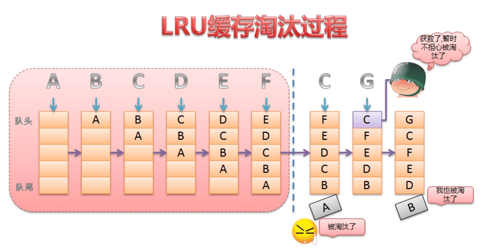

<h1 align="center">Bitmap优化</h1>

[toc]

## BitmapFactory


### Bitmap创建流程


### Option类

| 常用方法                         | 说明                                                         |
| -------------------------------- | ------------------------------------------------------------ |
| boolean inJustDecodeBounds       | 如果设置为true，不获取图片，不分配内存，但会返回图片的高度宽度信息 |
| int inSampleSize                 | 图片缩放的倍数                                               |
| int outWidth                     | 获取图片的宽度值                                             |
| int outHeight                    | 获取图片的高度值                                             |
| int inDensity                    | 用于位图的像素压缩比                                         |
| int inTargetDensity              | 用于目标位图的像素压缩比（要生成的位图）                     |
| byte[] inTempStorage             | 创建临时文件，将图片存储                                     |
| boolean inScaled                 | 设置为true时进行图片压缩，从inDensity到inTargetDensity       |
| boolean inDither                 | 如果为true,解码器尝试抖动解码                                |
| Bitmap.Config inPreferredConfig  | 设置解码器这个值是设置色彩模式，默认值是ARGB_8888，在这个模式下，一个像素点占用4bytes空间，一般对透明度不做要求的话，一般采用RGB_565模式，这个模式下一个像素点占用2bytes |
| String outMimeType               | 设置解码图像                                                 |
| boolean inPurgeable              | 当存储Pixel的内存空间在系统内存不足时是否可以被回收          |
| boolean inInputShareable         | inPurgeable为true情况下才生效，是否可以共享一个InputStream   |
| boolean inPreferQualityOverSpeed | 为true则优先保证Bitmap质量其次是解码速度                     |
| boolean inMutable                | 配置Bitmap是否可以更改，比如：在Bitmap上隔几个像素加一条线段 |
| int inScreenDensity              | 当前屏幕的像素密度                                           |

### 基本使用

```java
try {
    FileInputStream fis = new FileInputStream(filePath);
    BitmapFactory.Options options = new BitmapFactory.Options();
    options.inJustDecodeBounds = true;
    // 设置inJustDecodeBounds为true后，再使用decodeFile()等方法，并不会真正的分配空间，即解码出来的Bitmap为null，
    // 但是可计算出原始图片的宽度和高度，即options.outWidth和options.outHeight
    BitmapFactory.decodeFileDescriptor(fis.getFD(), null, options);
    float srcWidth = options.outWidth;
    float srcHeight = options.outHeight;
    int inSampleSize = 1;

    if (srcHeight > height || srcWidth > width) {
        if (srcWidth > srcHeight) {
            inSampleSize = Math.round(srcHeight / height);
        } else {
            inSampleSize = Math.round(srcWidth / width);
        }
    }

    options.inJustDecodeBounds = false;
    options.inSampleSize = inSampleSize;

    return BitmapFactory.decodeFileDescriptor(fis.getFD(), null, options);
} catch (Exception e) {
    e.printStackTrace();
}
```


## 基本操作

### 裁剪、缩放、旋转、移动

```java
Matrix matrix = new Matrix();  
// 缩放 
matrix.postScale(0.8f, 0.9f);  
// 左旋，参数为正则向右旋
matrix.postRotate(-45);  
// 平移, 在上一次修改的基础上进行再次修改 set 每次操作都是最新的 会覆盖上次的操作
matrix.postTranslate(100, 80);
// 裁剪并执行以上操作
Bitmap bitmap = Bitmap.createBitmap(source, 0, 0, source.getWidth(), source.getHeight(), matrix, true);
````

> 虽然Matrix还可以调用postSkew方法进行倾斜操作，但是却不可以在此时创建Bitmap时使用。

### Bitmap与Drawable转换

```java
// Drawable -> Bitmap
public static Bitmap drawableToBitmap(Drawable drawable) {
    Bitmap bitmap = Bitmap.createBitmap(drawable.getIntrinsicWidth(), drawable.getIntrinsicHeight(), drawable.getOpacity() != PixelFormat.OPAQUE ? Bitmap.Config.ARGB_8888 : Bitmap.Config.RGB_565);
    Canvas canvas = new Canvas(bitmap);
    drawable.setBounds(0, 0, drawable.getIntrinsicWidth(), drawable.getIntrinsicHeight();
    drawable.draw(canvas);
    return bitmap;
}

// Bitmap -> Drawable
public static Drawable bitmapToDrawable(Resources resources, Bitmap bm) {
    Drawable drawable = new BitmapDrawable(resources, bm);
    return drawable;
}
```

### 保存与释放

```java
Bitmap bitmap = BitmapFactory.decodeResource(getResources(), R.drawable.test);
File file = new File(getFilesDir(),"test.jpg");
if(file.exists()){
    file.delete();
}
try {
    FileOutputStream outputStream=new FileOutputStream(file);
    bitmap.compress(Bitmap.CompressFormat.JPEG,90,outputStream);
    outputStream.flush();
    outputStream.close();
} catch (FileNotFoundException e) {
    e.printStackTrace();
} catch (IOException e) {
    e.printStackTrace();
}
//释放bitmap的资源，这是一个不可逆转的操作
bitmap.recycle();
```

### 图片压缩

```java
public static Bitmap compressImage(Bitmap image) {
    if (image == null) {
        return null;
    }
    ByteArrayOutputStream baos = null;
    try {
        baos = new ByteArrayOutputStream();
        image.compress(Bitmap.CompressFormat.JPEG, 100, baos);
        byte[] bytes = baos.toByteArray();
        ByteArrayInputStream isBm = new ByteArrayInputStream(bytes);
        Bitmap bitmap = BitmapFactory.decodeStream(isBm);
        return bitmap;
    } catch (OutOfMemoryError e) {
        e.printStackTrace();
    } finally {
        try {
            if (baos != null) {
                baos.close();
            }
        } catch (IOException e) {
            e.printStackTrace();
        }
    }
    return null;
}
```


## 高效加载大型位图

**注意**：有几个库遵循了加载图片的最佳做法。您可以在应用中使用这些库，从而以最优化的方式加载图片。我们建议您使用 [Glide](https://github.com/bumptech/glide) 库，该库会尽可能快速、顺畅地加载和显示图片。其他常用的图片加载库包括 Square 的 [Picasso](http://square.github.io/picasso/)、Instacart 的 [Coil](https://github.com/coil-kt/coil) 和 Facebook 的 [Fresco](https://github.com/facebook/fresco)。这些库简化了与位图和 Android 上的其他图片类型相关的大多数复杂任务。

图片有各种形状和大小。在很多情况下，它们的大小超过了典型应用界面的要求。例如，系统“图库”应用会显示使用 Android 设备的相机拍摄的照片，这些照片的分辨率通常远高于设备的屏幕密度。

鉴于您使用的内存有限，理想情况下您只希望在内存中加载较低分辨率的版本。分辨率较低的版本应与显示该版本的界面组件的大小相匹配。分辨率更高的图片不会带来任何明显的好处，但仍会占用宝贵的内存，并且会因为额外的动态缩放而产生额外的性能开销。

本节课向您介绍如何通过在内存中加载较小的下采样版本来解码大型位图，从而不超出每个应用的内存限制。

### 1. 读取位图尺寸和类型

`BitmapFactory` 类提供了几种用于从各种来源创建 `Bitmap` 的解码方法（`decodeByteArray()`、`decodeFile()`、`decodeResource()` 等）。根据您的图片数据源选择最合适的解码方法。这些方法尝试为构造的位图分配内存，因此很容易导致 `OutOfMemory` 异常。每种类型的解码方法都有额外的签名，允许您通过 `BitmapFactory.Options` 类指定解码选项。在解码时将 `inJustDecodeBounds` 属性设置为 `true` 可避免内存分配，为位图对象返回 `null`，但设置 `outWidth`、`outHeight` 和 `outMimeType`。此方法可让您在构造位图并为其分配内存之前读取图片数据的尺寸和类型。

```java
    BitmapFactory.Options options = new BitmapFactory.Options();
    options.inJustDecodeBounds = true;
    BitmapFactory.decodeResource(getResources(), R.id.myimage, options);
    int imageHeight = options.outHeight;
    int imageWidth = options.outWidth;
    String imageType = options.outMimeType;
```

为避免出现 `java.lang.OutOfMemory` 异常，请先检查位图的尺寸，然后再对其进行解码，除非您绝对信任该来源可为您提供大小可预测的图片数据，以轻松适应可用的内存。

### 2. 将按比例缩小的版本加载到内存中

既然图片尺寸已知，便可用于确定应将完整图片加载到内存中，还是应改为加载下采样版本。以下是需要考虑的一些因素：

- 在内存中加载完整图片的估计内存使用量。
- 根据应用的任何其他内存要求，您愿意分配用于加载此图片的内存量。
- 图片要载入到的目标 `ImageView` 或界面组件的尺寸。
- 当前设备的屏幕大小和密度。

例如，如果 1024x768 像素的图片最终会在 `ImageView` 中显示为 128x96 像素缩略图，则不值得将其加载到内存中。

要让解码器对图片进行下采样，以将较小版本加载到内存中，请在 `BitmapFactory.Options` 对象中将 `inSampleSize` 设置为 `true`。例如，分辨率为 2048x1536 且以 4 作为 `inSampleSize` 进行解码的图片会生成大约 512x384 的位图。将此图片加载到内存中需使用 0.75MB，而不是完整图片所需的 12MB（假设位图配置为 `ARGB_8888`）。下面的方法用于计算样本大小值，即基于目标宽度和高度的 2 的幂：

```java
    public static int calculateInSampleSize(
                BitmapFactory.Options options, int reqWidth, int reqHeight) {
        // Raw height and width of image
        final int height = options.outHeight;
        final int width = options.outWidth;
        int inSampleSize = 1;

        if (height > reqHeight || width > reqWidth) {

            final int halfHeight = height / 2;
            final int halfWidth = width / 2;

            // Calculate the largest inSampleSize value that is a power of 2 and keeps both
            // height and width larger than the requested height and width.
            while ((halfHeight / inSampleSize) >= reqHeight
                    && (halfWidth / inSampleSize) >= reqWidth) {
                inSampleSize *= 2;
            }
        }

        return inSampleSize;
    }
```

**注意**：根据 `inSampleSize` 文档，计算 2 的幂的原因是解码器使用的最终值将向下舍入为最接近的 2 的幂。

要使用此方法，请先将 `inJustDecodeBounds` 设为 `true` 进行解码，传递选项，然后使用新的 `inSampleSize` 值并将 `inJustDecodeBounds` 设为 `false` 再次进行解码：

```java
    public static Bitmap decodeSampledBitmapFromResource(Resources res, int resId,
            int reqWidth, int reqHeight) {

        // First decode with inJustDecodeBounds=true to check dimensions
        final BitmapFactory.Options options = new BitmapFactory.Options();
        options.inJustDecodeBounds = true;
        BitmapFactory.decodeResource(res, resId, options);

        // Calculate inSampleSize
        options.inSampleSize = calculateInSampleSize(options, reqWidth, reqHeight);

        // Decode bitmap with inSampleSize set
        options.inJustDecodeBounds = false;
        return BitmapFactory.decodeResource(res, resId, options);
    }
    
```

采用此方法，您可以轻松地将任意大尺寸的位图加载到显示 100x100 像素缩略图的 `ImageView` 中，如以下示例代码所示：

```java
imageView.setImageBitmap(decodeSampledBitmapFromResource(getResources(), R.id.myimage, 100, 100));
```

您可以按照类似的流程来解码其他来源的位图，只需根据需要替换相应的 `BitmapFactory.decode*` 方法即可。

## 图片加载如何避免 OOM

我们知道内存中的 Bitmap 大小的计算公式是：长所占像素 * 宽所占像素 * 每个像素所占内存。想避免 OOM 有两种方法：等比例缩小长宽、减少每个像素所占的内存。

- 等比缩小长宽。我们知道 Bitmap 的创建是通过 BitmapFactory 的工厂方法，`decodeFile()、decodeStream()、decodeByteArray()、decodeResource()`。这些方法中都有一个 Options 类型的参数，这个 Options 是 BitmapFactory 的内部类，存储着 Bitmap 的一些信息。Options 中有一个属性：inSampleSize。我们通过修改 inSampleSize 可以缩小图片的长宽，从而减少 BItma p 所占内存。需要注意的是这个 inSampleSize 大小需要是 2 的幂次方，如果小于 1，代码会强制让inSampleSize为1。
- 减少像素所占内存。Options 中有一个属性 inPreferredConfig，默认是 `ARGB_8888`，代表每个像素所占尺寸。我们可以通过将之修改为 `RGB_565` 或者 `ARGB_4444` 来减少一半内存。

## 大图加载

加载高清大图，比如清明上河图，首先屏幕是显示不下的，而且考虑到内存情况，也不可能一次性全部加载到内存。这时候就需要局部加载了，Android中有一个负责局部加载的类：BitmapRegionDecoder。使用方法很简单，通过BitmapRegionDecoder.newInstance()创建对象，之后调用decodeRegion(Rect rect, BitmapFactory.Options options)即可。第一个参数rect是要显示的区域，第二个参数是BitmapFactory中的内部类Options。

### 1. 两种大图加载方式对比

#### 方法1

方法一是鸿洋大神多年前写的一种使用BitmapRegionDecoder分区域加载实现大图加载的方法，详情可见以下链接

[Android 高清加载巨图方案 拒绝压缩图片](https://blog.csdn.net/lmj623565791/article/details/49300989/)

源码地址可见：[自定义大图加载--LagouBitmap](https://github.com/McoyJiang/LagouAndroidShare/tree/master/course18_Bitmap/LagouBitmap)

#### 方法2

方法二基于SubsamplingScaleImageView这个库来实现大图加载，他主要利用了切片来实现大图加载，详细原理介绍可以见以下链接.

[Android超长图加载与subsampling scale image view实现分析](https://juejin.im/post/6844903910088392712) 使用SubSamplingScaleImageView实现加载

源码实例可见：[SubSamplingScaleImageView](https://github.com/davemorrissey/subsampling-scale-image-view)

## Bitmap配置信息和内存计算

**Bitmap 中有两个内部枚举类：**

- Config 是用来设置颜色配置信息
- CompressFormat 是用来设置压缩方式

| Config                  | 单位像素所占字节数 | 解析                                                         |
| ----------------------- | ------------------ | ------------------------------------------------------------ |
| Bitmap.Config.ALPHA_8   | 1                  | 颜色信息只由透明度组成，占8位                                |
| Bitmap.Config.ARGB_4444 | 2                  | 颜色信息由rgba四部分组成，每个部分都占4位，总共占16位        |
| Bitmap.Config.ARGB_8888 | 4                  | 颜色信息由rgba四部分组成，每个部分都占8位，总共占32位。是Bitmap默认的颜色配置信息，也是最占空间的一种配置 |
| Bitmap.Config.RGB_565   | 2                  | 颜色信息由rgb三部分组成，R占5位，G占6位，B占5位，总共占16位  |
| RGBA_F16                | 8                  | Android 8.0 新增（更丰富的色彩表现HDR）                      |
| HARDWARE                | Special            | Android 8.0 新增 （Bitmap直接存储在graphic memory）          |

```
Bitmap内存占用 ≈ 像素数据总大小 = 图片宽像素 × 图片高像素 × 每个像素的字节大小（可以详细阐述）
```


## Bitmap内存优化

图片占用的内存一般会分为运行时占用的运存和存储时本地开销（反映在包大小上），这里我们只关注运行时占用内存的优化。

在上一节中，我们看到对于一张800 * 600 大小的图片，不加任何处理直接解析到内存中，将近占用了17.28M的内存大小。想象一下这样的开销发生在一个图片列表中，内存占用将达到非常夸张的地步。从之前Bitmap占用内存的计算公式来看，减少内存主要可以通过以下几种方式：

1. 使用低色彩的解析模式，如RGB565，减少单个像素的字节大小
2. 资源文件合理放置，高分辨率图片可以放到高分辨率目录下
3. 图片缩小，减少尺寸

**第一种方式**，大约能减少一半的内存开销。Android默认是使用ARGB8888配置来处理色彩，占用4字节，改用RGB565，将只占用2字节，代价是显示的色彩将相对少，适用于对色彩丰富程度要求不高的场景。

**第二种方式**，和图片的具体分辨率有关，建议开发中，高分辨率的图像应该放置到合理的资源目录下，注意到Android默认放置的资源目录是对应于160dpi，目前手机屏幕分辨率越来越高，此处能节省下来的开销也是很可观的。理论上，图片放置的资源目录分辨率越高，其占用内存会越小，但是低分辨率图片会因此被拉伸，显示上出现失真。另一方面，高分辨率图片也意味着其占用的本地储存也变大。

**第三种方式**，理论上根据适用的环境，是可以减少十几倍的内存使用的，它基于这样一个事实：源图片尺寸一般都大于目标需要显示的尺寸，因此可以通过缩放的方式，来减少显示时的图片宽高，从而大大减少占用的内存。

假设有一张480x800的图片，四个格式下所占的内存如下

| 类型      | 内存计算          | 占内存大小（Byte） | 占内存大小（KB）  |
| :-------- | :---------------- | :----------------- | :---------------- |
| ARGB_8888 | 480×800×4（Byte） | 1536000            | 1536000÷1024=1500 |
| ARGB_4444 | 480×800×2（Byte） | 768000             | 768000÷1024=750   |
| ARGB_565  | 480×800×2（Byte） | 768000             | 768000÷1024=750   |
| ARGB_8    | 480×800×1（Byte） | 384000             | 384000÷1024=375   |

> 通常我们优化 Bitmap 时，当需要做性能优化或者防止 OOM，我们通常会使用 Bitmap.Config.RGB_565 这个配置，因为 Bitmap.Config.ALPHA_8 只有透明度，显示一般图片没有意义，Bitmap.Config.ARGB_4444 显示图片不清楚， Bitmap.Config.ARGB_8888 占用内存最多。

| CompressFormat             | 解析                                                         |
| -------------------------- | ------------------------------------------------------------ |
| Bitmap.CompressFormat.JPEG | 表示以 JPEG 压缩算法进行图像压缩，压缩后的格式可以是 ``.jpg`` 或者 ``.jpeg``，是一种有损压缩 |
| Bitmap.CompressFormat.PNG  | 颜色信息由 rgba 四部分组成，每个部分都占 4 位，总共占 16 位  |
| Bitmap.Config.ARGB_8888    | 颜色信息由 rgba 四部分组成，每个部分都占 8 位，总共占 32 位。是 Bitmap 默认的颜色配置信息，也是最占空间的一种配置 |
| Bitmap.Config.RGB_565      | 颜色信息由 rgb 三部分组成，R 占 5 位，G 占 6 位，B 占 5 位，总共占 16 位 |


## Bitmap缓存-LruCache

LruCache的核心思想很好理解，就是要维护一个缓存对象列表，其中对象列表的排列方式是按照访问顺序实现的，即一直没访问的对象，将放在队尾，即将被淘汰。而最近访问的对象将放在队头，最后被淘汰。

如下图所示：



那么这个队列到底是由谁来维护的，前面已经介绍了是由LinkedHashMap来维护。

而LinkedHashMap是由数组+双向链表的数据结构来实现的。其中双向链表的结构可以实现访问顺序和插入顺序，使得LinkedHashMap中的<key,value>对按照一定顺序排列起来。

通过下面构造函数来指定LinkedHashMap中双向链表的结构是访问顺序还是插入顺序。


```java
public LinkedHashMap(int initialCapacity,
                         float loadFactor,
                         boolean accessOrder) {
        super(initialCapacity, loadFactor);
        this.accessOrder = accessOrder;
    }
```

其中accessOrder设置为true则为访问顺序，为false，则为插入顺序。

以具体例子解释：

当设置为true时

```swift
public static final void main(String[] args) {
        LinkedHashMap<Integer, Integer> map = new LinkedHashMap<>(0, 0.75f, true);
        map.put(0, 0);
        map.put(1, 1);
        map.put(2, 2);
        map.put(3, 3);
        map.put(4, 4);
        map.put(5, 5);
        map.put(6, 6);
        map.get(1);
        map.get(2);

        for (Map.Entry<Integer, Integer> entry : map.entrySet()) {
            System.out.println(entry.getKey() + ":" + entry.getValue());

        }
    }
```

输出结果：

> 0:0
>
> 3:3
>
> 4:4
>
> 5:5
>
> 6:6
>
> 1:1
>
> 2:2

即最近访问的最后输出，那么这就正好满足的LRU缓存算法的思想。**可见LruCache巧妙实现，就是利用了LinkedHashMap的这种数据结构。**

下面我们在LruCache源码中具体看看，怎么应用LinkedHashMap来实现缓存的添加，获得和删除的。

```cpp
 public LruCache(int maxSize) {
     if (maxSize <= 0) {
         throw new IllegalArgumentException("maxSize <= 0");
     }
     this.maxSize = maxSize;
     this.map = new LinkedHashMap<K, V>(0, 0.75f, true);
 }
```

从LruCache的构造函数中可以看到正是用了LinkedHashMap的访问顺序。

**put()方法**

```csharp
public final V put(K key, V value) {
         // 不可为空，否则抛出异常
        if (key == null || value == null) {
            throw new NullPointerException("key == null || value == null");
        }
        V previous;
        synchronized (this) {
            // 插入的缓存对象值加1
            putCount++;
            // 增加已有缓存的大小
            size += safeSizeOf(key, value);
           // 向map中加入缓存对象
            previous = map.put(key, value);
            // 如果已有缓存对象，则缓存大小恢复到之前
            if (previous != null) {
                size -= safeSizeOf(key, previous);
            }
        }
        // entryRemoved()是个空方法，可以自行实现
        if (previous != null) {
            entryRemoved(false, key, previous, value);
        }
        // 调整缓存大小(关键方法)
        trimToSize(maxSize);
        return previous;
    }
```

可以看到put()方法并没有什么难点，重要的就是在添加过缓存对象后，调用 trimToSize()方法，来判断缓存是否已满，如果满了就要删除近期最少使用的算法。
 **trimToSize()方法**

```csharp
 public void trimToSize(int maxSize) {
        // 死循环
        while (true) {
            K key;
            V value;
            synchronized (this) {
                // 如果map为空并且缓存size不等于0或者缓存size小于0，抛出异常
                if (size < 0 || (map.isEmpty() && size != 0)) {
                    throw new IllegalStateException(getClass().getName()
                            + ".sizeOf() is reporting inconsistent results!");
                }
                // 如果缓存大小size小于最大缓存，或者map为空，不需要再删除缓存对象，跳出循环
                if (size <= maxSize || map.isEmpty()) {
                    break;
                }
                // 迭代器获取第一个对象，即队尾的元素，近期最少访问的元素
                Map.Entry<K, V> toEvict = map.entrySet().iterator().next();
                key = toEvict.getKey();
                value = toEvict.getValue();
                // 删除该对象，并更新缓存大小
                map.remove(key);
                size -= safeSizeOf(key, value);
                evictionCount++;
            }
            entryRemoved(true, key, value, null);
        }
    }
```

trimToSize()方法不断地删除LinkedHashMap中队尾的元素，即近期最少访问的，直到缓存大小小于最大值。

当调用LruCache的get()方法获取集合中的缓存对象时，就代表访问了一次该元素，将会更新队列，保持整个队列是按照访问顺序排序。这个更新过程就是在LinkedHashMap中的get()方法中完成的。

先看LruCache的get()方法

**get()方法**

```kotlin
public final V get(K key) {
        // key为空抛出异常
        if (key == null) {
            throw new NullPointerException("key == null");
        }

        V mapValue;
        synchronized (this) {
            // 获取对应的缓存对象
            // get()方法会实现将访问的元素更新到队列头部的功能
            mapValue = map.get(key);
            if (mapValue != null) {
                hitCount++;
                return mapValue;
            }
            missCount++;
        }
```

其中LinkedHashMap的get()方法如下：

```kotlin
public V get(Object key) {
    LinkedHashMapEntry<K,V> e = (LinkedHashMapEntry<K,V>)getEntry(key);
    if (e == null)
    return null;
    // 实现排序的关键方法
    e.recordAccess(this);
    return e.value;
 }
```

调用recordAccess()方法如下：

```csharp
 void recordAccess(HashMap<K,V> m) {
     LinkedHashMap<K,V> lm = (LinkedHashMap<K,V>)m;
     // 判断是否是访问排序
     if (lm.accessOrder) {
         lm.modCount++;
         // 删除此元素
         remove();
         // 将此元素移动到队列的头部
         addBefore(lm.header);
     }
 }
```

**由此可见LruCache中维护了一个集合LinkedHashMap，该LinkedHashMap是以访问顺序排序的。当调用put()方法时，就会在结合中添加元素，并调用trimToSize()判断缓存是否已满，如果满了就用LinkedHashMap的迭代器删除队尾元素，即近期最少访问的元素。当调用get()方法访问缓存对象时，就会调用LinkedHashMap的get()方法获得对应集合元素，同时会更新该元素到队头。**

以上便是LruCache实现的原理，理解了LinkedHashMap的数据结构就能理解整个原理。如果不懂，可以先看看LinkedHashMap的具体实现。

## 内存回收

```java
if(bitmap != null && !bitmap.isRecycled()){ 
    // 回收并且置为null
    bitmap.recycle(); 
    bitmap = null; 
} 
```

Bitmap 类的构造方法都是私有的，所以开发者不能直接 new 出一个 Bitmap 对象，只能通过 BitmapFactory 类的各种静态方法来实例化一个 Bitmap。仔细查看 BitmapFactory 的源代码可以看到，生成 Bitmap 对象最终都是通过 JNI 调用方式实现的。所以，加载 Bitmap 到内存里以后，是包含两部分内存区域的。简单的说，一部分是Java 部分的，一部分是 C 部分的。这个 Bitmap 对象是由 Java 部分分配的，不用的时候系统就会自动回收了，但是那个对应的 C 可用的内存区域，虚拟机是不能直接回收的，这个只能调用底层的功能释放。所以需要调用 recycle() 方法来释放 C 部分的内存。从 Bitmap 类的源代码也可以看到，recycle() 方法里也的确是调用了 JNI 方法了的。

## 参考

* [Android Bitmap优化](https://juejin.im/post/6844903919479422984)
* [Android性能优化（五）之细说Bitmap](https://juejin.im/post/6844903470030389255)
* [Android性能优化系列之Bitmap图片优化](https://blog.csdn.net/u012124438/article/details/66087785)
* [Bitmap优化详谈](https://www.jianshu.com/p/4c661166ff2a?tdsourcetag=s_pctim_aiomsg)
* [高效加载大型位图](https://developer.android.com/topic/performance/graphics/load-bitmap?hl=zh-cn)
* [Android性能优化之UI卡顿优化实例分析](https://juejin.cn/post/6870389004387385352)


