<h1 align="center">Apk包大小优化</h1>

[toc]

## 1. APK构成

可以用Zip工具打开APK查看。比如，美团App 7.8.6的线上版本的格式是这样的：

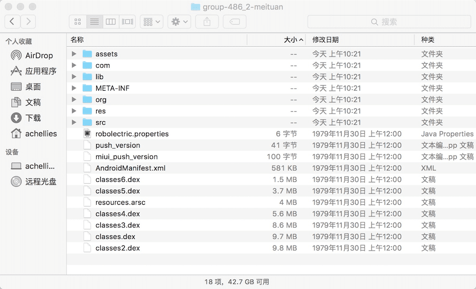

可以看到APK由以下主要部分组成：

| 文件/目录           | 描述                                                         |
| :------------------ | :----------------------------------------------------------- |
| lib/                | 存放so文件，可能会有armeabi、armeabi-v7a、arm64-v8a、x86、x86_64、mips，大多数情况下只需要支持armabi与x86的架构即可，如果非必需，可以考虑拿掉x86的部分 |
| res/                | 存放编译后的资源文件，例如：drawable、layout等等             |
| assets/             | 应用程序的资源，应用程序可以使用AssetManager来检索该资源     |
| META-INF/           | 该文件夹一般存放于已经签名的APK中，它包含了APK中所有文件的签名摘要等信息 |
| classes(n).dex      | classes文件是Java Class，被DEX编译后可供Dalvik/ART虚拟机所理解的文件格式 |
| resources.arsc      | 编译后的二进制资源文件                                       |
| AndroidManifest.xml | Android的清单文件，格式为AXML，用于描述应用程序的名称、版本、所需权限、注册的四大组件 |

当然还会有一些其它的文件，例如上图中的`org/`、`src/`、`push_version`等文件或文件夹。这些资源是Java Resources，感兴趣的可以结合编译工作流中的[流程图](http://tools.android.com/tech-docs/new-build-system/build-workflow)以及[MergeJavaResourcesTransform的源码](https://android.googlesource.com/platform/tools/base/+/gradle_2.0.0/build-system/gradle-core/src/main/groovy/com/android/build/gradle/internal/transforms/MergeJavaResourcesTransform.java)看看被打入APK包中的资源都有哪些，这里不做过多介绍。

在充分了解了APK各个组成部分以及它们的作用后，我们针对自身特点进行了分析和优化。下面将从Zip文件格式、classes.dex、资源文件、resources.arsc等方面来介绍下我们发现的部分优化技巧。

## 2. Zip格式优化

前面介绍了APK的文件格式以及主要组成部分，通过`aapt l -v xxx.apk`或`unzip -l xxx.apk`来查看APK文件时会得到以下信息，见下面截图：

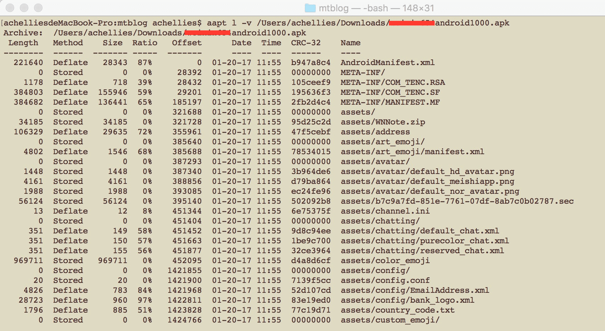

通过上图可以看到APK中很多资源是以`Stored`来存储的，根据Zip的文件格式中对压缩方式的描述[Compression_methods](https://en.wikipedia.org/wiki/Zip_(file_format)#Compression_methods)可以看出这些文件是没有压缩的，那为什么它们没有被压缩呢？从AAPT的源码中找到以下描述：

```C++
/* these formats are already compressed, or don't compress well */
static const char* kNoCompressExt[] = {
    ".jpg", ".jpeg", ".png", ".gif",
    ".wav", ".mp2", ".mp3", ".ogg", ".aac",
    ".mpg", ".mpeg", ".mid", ".midi", ".smf", ".jet",
    ".rtttl", ".imy", ".xmf", ".mp4", ".m4a",
    ".m4v", ".3gp", ".3gpp", ".3g2", ".3gpp2",
    ".amr", ".awb", ".wma", ".wmv", ".webm", ".mkv"
};
```

可以看出AAPT在资源处理时对这些文件后缀类型的资源是不做压缩的，那是不是可以修改它们的压缩方式从而达到瘦身的效果呢？

在介绍怎么做之前，先来大概介绍一下App的资源是怎么被打进APK包里的。Android构建工具链使用AAPT工具来对资源进行处理，来看下图（图片来源于[Build Workflow](http://tools.android.com/tech-docs/new-build-system/build-workflow)）：

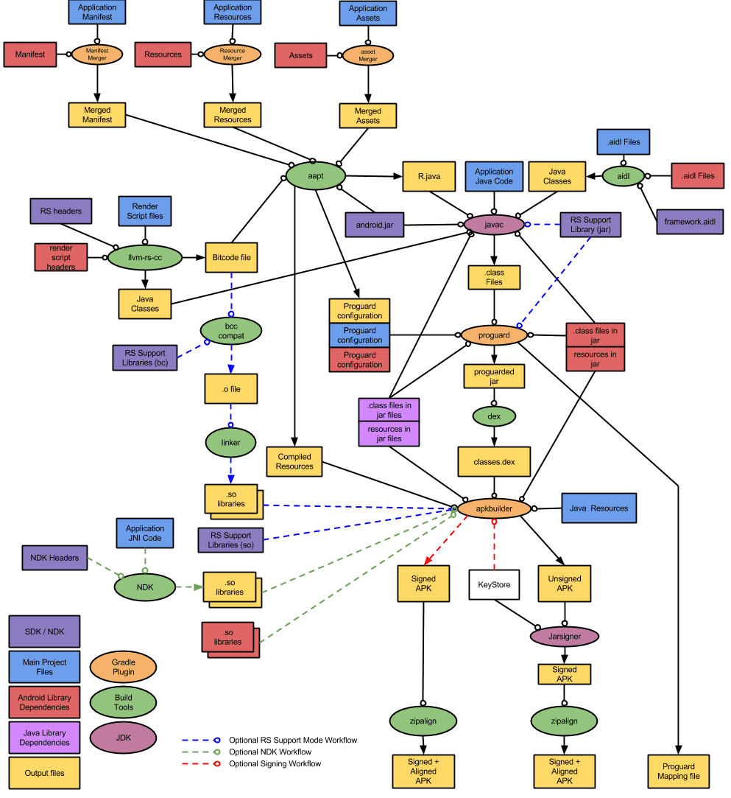

通过上图可以看到`Manifest`、`Resources`、`Assets`的资源经过`AAPT`处理后生成`R.java`、`Proguard Configuration`、`Compiled Resources`。其中`R.java`大家都比较熟悉，这里就不过多介绍了。我们来重点看看`Proguard Configuration`、`Compiled Resources`都是做什么的呢？

- `Proguard Configuration`是AAPT工具为`Manifest`中声明的四大组件以及布局文件中（`XML layouts`）使用的各种Views所生成的ProGuard配置，该文件通常存放在`${project.buildDir}/${AndroidProject.FD_INTERMEDIATES}/proguard-rules/${flavorName}/${buildType}/aapt_rules.txt`，下面是项目中该文件的截图，红框标记出来的就是对`AndroidManifest.xml`、`XML Layouts`中相关Class的ProGuard配置。

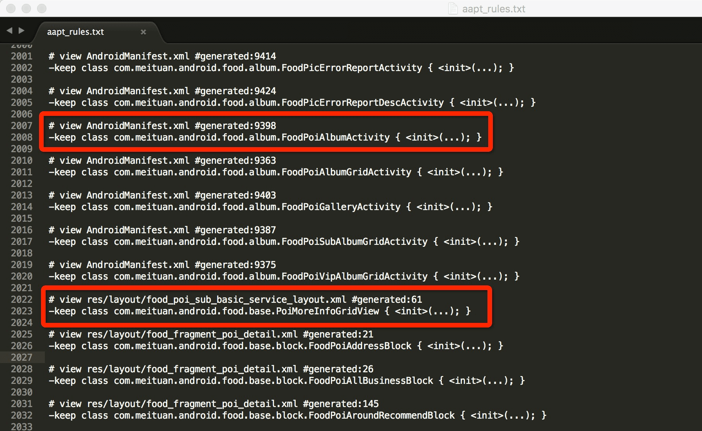

- `Compiled Resources`是一个Zip格式的文件，这个文件的路径通常为`${project.buildDir}/${AndroidProject.FD_INTERMEDIATES}/res/resources-${flavorName}-${buildType}-stripped.ap_`。 通过下面经过Zip解压后的截图，可以看出这个文件包含了`res`、`AndroidManifest.xml`和`resources.arsc`的文件或文件夹。结合[Build Workflow](http://tools.android.com/tech-docs/new-build-system/build-workflow)中的描述，可以看出这个文件（`resources-${flavorName}-${buildType}-stripped.ap_`）会被`apkbuilder`打包到APK包中，它其实就是APK的“资源包”（`res`、`AndroidManifest.xml`和`resources.arsc`）。

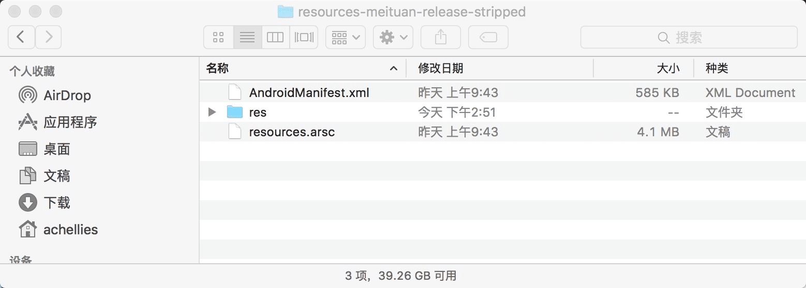

我们就是通过这个文件来修改不同后缀文件资源的压缩方式来达到瘦身效果的，而在后面“resources.arsc的优化”一节中也是操作的这个文件。

笔者在自己的项目中是通过在`package${flavorName}` Task（感兴趣的同学可以查看[源码](https://android.googlesource.com/platform/tools/build/+/master/gradle/src/main/groovy/com/android/build/gradle/tasks/PackageApplication.groovy)）之前进行这个操作的。

下面是部分代码片段：

```groovy
appPlugin.variantManager.variantDataList.each { variantData ->
    variantData.outputs.each {
        def sourceApFile = it.packageAndroidArtifactTask.getResourceFile();
        def destApFile = new File("${sourceApFile.name}.temp", sourceApFile.parentFile);
        it.packageAndroidArtifactTask.doFirst {
            byte[] buf = new byte[1024 * 8];

            ZipInputStream zin = new ZipInputStream(new FileInputStream(sourceApFile));
            ZipOutputStream out = new ZipOutputStream(new FileOutputStream(destApFile));

            ZipEntry entry = zin.getNextEntry();
            while (entry != null) {
                String name = entry.getName();

                // Add ZIP entry to output stream.
                ZipEntry zipEntry = new ZipEntry(name);

                if (ZipEntry.STORED == entry.getMethod() && !okayToCompress(entry.getName())) {
                    zipEntry.setMethod(ZipEntry.STORED)
                    zipEntry.setSize(entry.getSize())
                    zipEntry.setCompressedSize(entry.getCompressedSize())
                    zipEntry.setCrc(entry.getCrc())
                } else {
                    zipEntry.setMethod(ZipEntry.DEFLATED)
                    ...
                }
                ...

                out.putNextEntry(zipEntry);
                out.closeEntry();
                entry = zin.getNextEntry();
            }
            // Close the streams
            zin.close();
            out.close();

            sourceApFile.delete();
            destApFile.renameTo(sourceApFile);
        }
    }
}
```

当然也可以在其它构建步骤中采用更高压缩率的方式来达到瘦身效果，例如[采用7Zip压缩](http://mp.weixin.qq.com/s?__biz=MzAwNDY1ODY2OQ==&mid=208135658&idx=1&sn=ac9bd6b4927e9e82f9fa14e396183a8f#rd)等等。

> 本技巧的使用需要注意以下问题： * 如果音视频资源被压缩存放在APK中的话，在使用一些音频、视频API时尤其要注意，需要做好充分的测试。 * resources.arsc文件最好不要压缩存储，如果压缩会影响一定的性能（尤其是冷启动时间）。 * 如果想在`Android 6.0`上开启`android:extractNativeLibs=”false”`的话，.so 文件也不能被压缩，`android:extractNativeLibs`的使用姿势看这里：[App Manifest — application](https://developer.android.com/guide/topics/manifest/application-element.html#extractNativeLibs)。

## 3. classes.dex的优化

如何优化classes.dex的大小呢？大体有如下套路：

- 时刻保持良好的编程习惯和对包体积敏锐的嗅觉，去除重复或者不用的代码，慎用第三方库，选用体积小的第三方SDK等等。
- 开启ProGuard来进行代码压缩，通过使用ProGuard来对代码进行混淆、优化、压缩等工作。

针对第一种套路，因各个公司的项目的差异，共性的东西较少，需要case by case的分析，这里不做过多的介绍。

### 3.1 压缩代码

可以通过开启ProGuard来实现代码压缩，可以在build.gradle文件相应的构建类型中添加`minifyEnabled true`。

> 请注意，代码压缩会拖慢构建速度，因此应该尽可能避免在调试构建中使用。不过一定要为用于测试的最终APK启用代码压缩，如果不能充分地自定义要保留的代码，可能会引入错误。

例如，下面这段来自build.gradle文件的代码用于为发布构建启用代码压缩：

```groovy
android {
    buildTypes {
        release {
            minifyEnabled true
            proguardFiles getDefaultProguardFile(‘proguard-android.txt'),
                    'proguard-rules.pro'
        }
    }
    ...
}
```

除了`minifyEnabled`属性外，还有用于定义ProGuard规则的proguardFiles属性：

- `getDefaultProguardFile(‘proguard-android.txt')`是从Android SDK`tools/proguard/`文件夹获取默认ProGuard设置。
- `proguard-rules.pro`文件用于添加自定义ProGuard规则。默认情况下，该文件位于模块根目录（build.gradle文件旁）。

> 提示：要想做进一步的代码压缩，可尝试使用位于同一位置的`proguard-android-optimize.txt`文件。它包括相同的ProGuard规则，但还包括其他在字节码一级（方法内和方法间）执行分析的优化，以进一步减小APK大小和帮助提高其运行速度。
>
> 在Gradle Plugin 2.2.0及以上版本ProGuard的配置文件会自动解压缩到`${rootProject.buildDir}/${AndroidProject.FD_INTERMEDIATES}/proguard-files/`目录下，`proguardFiles`会从这个目录来获取ProGuard配置。

每次执行完ProGuard之后，ProGuard都会在`${project.buildDir}/outputs/mapping/${flavorDir}/`生成以下文件：

| 文件名      | 描述                                                         |
| :---------- | :----------------------------------------------------------- |
| dump.txt    | APK中所有类文件的内部结构                                    |
| mapping.txt | 提供原始与混淆过的类、方法和字段名称之间的转换，可以通过`proguard.obfuscate.MappingReader`来解析 |
| seeds.txt   | 列出未进行混淆的类和成员                                     |
| usage.txt   | 列出从APK移除的代码                                          |

可以通过在`usage.txt`文件中看到哪些代码被删除了，如下图中所示`android.support.multidex.MultiDex`已经被删除了：

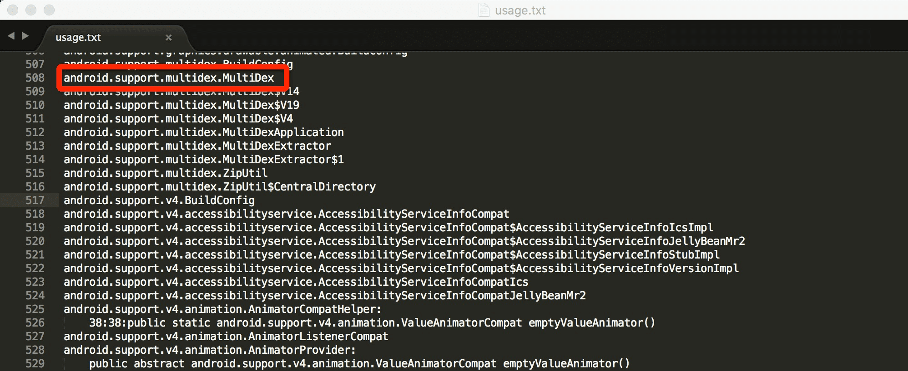

### 3.2 R Field的优化

除了对项目代码优化和开启代码压缩之外，笔者在[《美团Android DEX自动拆包及动态加载简介》](http://tech.meituan.com/mt-android-auto-split-dex.html)这篇文章中提到了通过内联R Field来解决R Field过多导致MultiDex 65536的问题，而这一步骤对代码瘦身能够起到明显的效果。下面是笔者通过字节码工具在构建流程中内联R Field的代码片段（字节码的修改可以使用[Javassist](http://jboss-javassist.github.io/javassist/)或者[ASM](http://asm.ow2.org/)，该步骤笔者采用的是Javassist）。

```groovy
ctBehaviors.each { CtBehavior ctBehavior ->
    if (!ctBehavior.isEmpty()) {
        try {
            ctBehavior.instrument(new ExprEditor() {
                @Override
                public void edit(FieldAccess f) {
                    try {
                        def fieldClassName = JavassistUtils.getClassNameFromCtClass(f.getCtClass())
                        if (shouldInlineRField(className, fieldClassName) && f.isReader()) {
                            def temp = fieldClassName.substring(fieldClassName.indexOf(ANDROID_RESOURCE_R_FLAG) + ANDROID_RESOURCE_R_FLAG.length())
                            def fieldName = f.fieldName
                            def key = "${temp}.${fieldName}"

                            if (resourceSymbols.containsKey(key)) {
                                Object obj = resourceSymbols.get(key)
                                try {
                                    if (obj instanceof Integer) {
                                        int value = ((Integer) obj).intValue()
                                        f.replace("\$_=${value};")
                                    } else if (obj instanceof Integer[]) {
                                        def obj2 = ((Integer[]) obj)
                                        StringBuilder stringBuilder = new StringBuilder()
                                        for (int index = 0; index < obj2.length; ++index) {
                                            stringBuilder.append(obj2[index].intValue())
                                            if (index != obj2.length - 1) {
                                                stringBuilder.append(",")
                                            }
                                        }
                                        f.replace("\$_ = new int[]{${stringBuilder.toString()}};")
                                    } else {
                                        throw new GradleException("Unknown ResourceSymbols Type!")
                                    }
                                } catch (NotFoundException e) {
                                    throw new GradleException(e.message)
                                } catch (CannotCompileException e) {
                                    throw new GradleException(e.message)
                                }
                            } else {
                                throw new GradleException("******** InlineRFieldTask unprocessed ${className}, ${fieldClassName}, ${f.fieldName}, ${key}")
                            }
                        }
                    } catch (NotFoundException e) {
                    }
                }
            })
        } catch (CannotCompileException e) {
        }
    }
}
```

### 3.3 其它优化手段

针对代码的瘦身还有很多优化的技巧，例如：

- 减少ENUM的使用（详情可以参考：[Remove Enumerations](https://developer.android.com/topic/performance/reduce-apk-size.html#reduce-code)），每减少一个ENUM可以减少大约1.0到1.4 KB的大小；
- 通过[pmd cpd](https://pmd.github.io/pmd-5.4.1/usage/cpd-usage.html)来检查重复的代码从而进行代码优化；
- 移除掉所有无用或者功能重复的依赖库。

### 3.4 Facebook的redex优化字节码

redex是facebook发布的一款android字节码的优化工具. [redex](https://github.com/facebook/redex)

## 4. 资源的优化

### 4.1 图片优化

为了支持Android设备DPI的多样化（[l|m|tv|h|x|xx|xxx]dpi）以及用户对高质量UI的期待，美团App中使用了大量的图片，在Android下支持很多格式的图片，例如：[PNG](https://en.wikipedia.org/wiki/Portable_Network_Graphics)、[JPG](https://en.wikipedia.org/wiki/JPEG) 、[WebP](https://en.wikipedia.org/wiki/WebP)，那我们该怎么选择不同类型的图片格式呢？ 在`Google I/O 2016`中提到了针对图片格式的选择，来看下图（图片来源于[Image compression for Android developers](https://events.google.com/io2016/schedule?sid=8c2d2aeb-0bef-e511-a517-00155d5066d7)）：

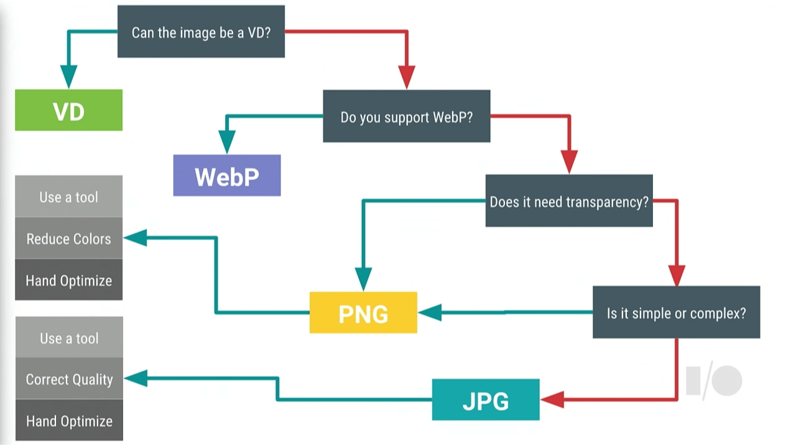

通过上图可以看出一个大概图片格式选择的方法。如果能用`VectorDrawable`来表示的话优先使用VectorDrawable，如果支持`WebP`则优先用WebP，而`PNG`主要用在展示透明或者简单的图片，而其它场景可以使用`JPG`格式。针对每种图片格式也有各类的优化手段和优化工具。

#### 4.1.1 使用矢量图片(svg)

可以使用[矢量图形](https://developer.android.com/guide/topics/graphics/vector-drawable-resources.html)来创建独立于分辨率的图标和其他可伸缩图片。使用矢量图片能够有效的减少App中图片所占用的大小，矢量图形在Android中表示为[VectorDrawable](https://developer.android.com/guide/topics/graphics/vector-drawable-resources.html)对象。 使用[VectorDrawable](https://developer.android.com/guide/topics/graphics/vector-drawable-resources.html)对象，100字节的文件可以生成屏幕大小的清晰图像，但系统渲染每个VectorDrawable对象需要大量的时间，较大的图像需要更长的时间才能出现在屏幕上。 因此只有在显示小图像时才考虑使用矢量图形。有关使用[VectorDrawable](https://developer.android.com/reference/android/graphics/drawable/VectorDrawable.html)的更多信息，请参阅 [Working with Drawables](https://developer.android.com/training/material/drawables.html)。

矢量图是由点与线组成,和位图不一样,它再放大也能保持清晰度，而且使用矢量图比位图设计方案能节约30～40%的空间，现在谷歌一直在强调扁平化方式，矢量图可很好的契合该设计理念。

#### 4.1.2 使用WebP

如果App的`minSdkVersion`高于14（`Android 4.0+`）的话，可以选用WebP格式，因为WebP在同画质下体积更小（WebP支持透明度，压缩比比JPEG更高但显示效果却不输于JPEG，官方评测quality参数等于75均衡最佳），可以通过[PNG到WebP转换工具](https://developers.google.com/speed/webp/docs/precompiled)来进行转换。当然Android从4.0才开始WebP的原生支持，但是不支持包含透明度，直到`Android 4.2.1+`才支持显示含透明度的WebP，在笔者使用中是判断当前App的`minSdkVersion`以及图片文件的类型（是否为透明）来选用是否适用WebP。见下面的代码片段：

```groovy
boolean isPNGWebpConvertSupported() {
    if (!isWebpConvertEnable()) {
        return false
    }

    // Android 4.0+
    return GradleUtils.getAndroidExtension(project).defaultConfig.minSdkVersion.apiLevel >= 14
    // 4.0
}

boolean isTransparencyPNGWebpConvertSupported() {
    if (!isWebpConvertEnable()) {
        return false
    }

    // Lossless, Transparency, Android 4.2.1+
    return GradleUtils.getAndroidExtension(project).defaultConfig.minSdkVersion.apiLevel >= 18
    // 4.3
}

def convert() {
    String resPath = "${project.buildDir}/${AndroidProject.FD_INTERMEDIATES}/res/merged/${variant.dirName}"
    def resDir = new File("${resPath}")
    resDir.eachDirMatch(~/drawable[a-z0-9-]*/) { dir ->
        FileTree tree = project.fileTree(dir: dir)
        tree.filter { File file ->
            return (isJPGWebpConvertSupported() && (file.name.endsWith(SdkConstants.DOT_JPG) || file.name.endsWith(SdkConstants.DOT_JPEG))) || (isPNGWebpConvertSupported() && file.name.endsWith(SdkConstants.DOT_PNG) && !file.name.endsWith(SdkConstants.DOT_9PNG))
        }.each { File file ->
            def shouldConvert = true
            if (file.name.endsWith(SdkConstants.DOT_PNG)) {
                if (!isTransparencyPNGWebpConvertSupported()) {
                    shouldConvert = !Imaging.getImageInfo(file).isTransparent()
                }
            }
            if (shouldConvert) {
                WebpUtils.encode(project, webpFactorQuality, file.absolutePath, webp)
            }
        }
    }
}   
```

#### 4.1.3 webp 无侵入式兼容

**tinypng 和 webp 的选择**

tinypng 与 webp 到底哪个压缩比更高呢？在网上找不到两种压缩算法压缩比的直接比较，需要更直观的对比，于是做了如下的实验：

1. 扫描项目中 1960 张图片，通过不同的算法压缩进行对比：

| 描述         | 大小       |
| ------------ | ---------- |
| 原图         | 13463.07KB |
| webp 压缩    | 4177.18KB  |
| tinypng 压缩 | 6732.18KB  |

1. 从项目中找 490 张图片，新建 demo，不同算法压缩图片后比较打包 apk 的大小：

| 描述             | 大小      |
| ---------------- | --------- |
| 原图 APK         | 9617.53KB |
| webp 压缩 APK    | 3924.06KB |
| tinypng 压缩 APK | 5386.80KB |

通过这两组实验对比，可以看出 webp 的压缩比是优于 tinypng 的。之前也手动的使用 webp 工具压缩过抖音工程中所有图片，包大小减少了 1.6MB 左右。因此选择了 Webp 压缩算法。

**方案选型**

webp 压缩算法，相较于 pngquant、guetzli、tinypng，webp 压缩比更高，所以 webbp 压缩图片应该是更优的选择。但是 Android 设备对 webp 的支持存在兼容性问题，在 4.3 以上才完全支持。通过官网我们知道，想在应用中直接使用带有透明度的 webp，minSDK 至少需要是 18。

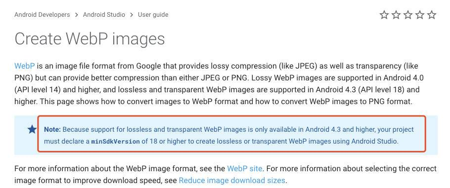


 包括抖音、今日头条在内的头条系 Android 应用，大部分 minSDK 是 16，无法直接使用 webp 图片，需要做低版本兼容。通过大量调研，找到了三种兼容的方式：

| -                                  | 优点                       | 缺点                                                         |
| ---------------------------------- | -------------------------- | ------------------------------------------------------------ |
| 提供特定 api 兼容                  | 实现起来简单               | 侵入性太强，必须用特定接口或特定 View 进行加载               |
| LayoutInflater setFactory 进行兼容 | 实现起来简单               | 需要针对所有的 ImageView 及子 View 处理，且必须有统一的 Activity、Fregment 的基类处理 |
| 运行时 hook 系统关键方法           | 方法替换，可以做到无侵入式 | 实现起来复杂些                                               |

**方案实现**

想要做到无侵入式的兼容，运行时 hook 不失为一种最佳的选择。但是运行时 hook 方案，需要解决以下几点问题：

- 选择的 hook 方案要稳定可靠；
- hook 点要足够收敛，保证所有解析图片的操作都能符合预期。

**Hook 方案要稳定可靠**

通过对 Xposed、AndFix、Cydia Substrate、dexposed 等常见的 Android Java hook 方案的调研对比，dexposed 具有不需要 root、又能 hook 系统方法的特点，最终选择 dexposed:

- dexposed 在 Dalvik 上比较稳定，只需要针对 4.3 以下的手机版本做 hook，不需要考虑版本兼容性问题和系统升级问题；
- 通过内部数据可以知道，抖音 4.3 以下的用户并不多，在十万级别，占总用户数的万分之几，风险较低。

**Hook 点要足够收敛**

通过阅读源码，发现所有图片被加载解析成 Bitmap 的过程，最终都调用到了 BitmapFactory 中的方法。 比如 ImageView 的 `setImageResource()` 的调用路径如下:


ImageView 的 setImageResource 过程，Bitmap 的创建是通过 BitmapFactory 来实现。 如 View 的 `setBackgroundResource(int resid)`的源码如下：


查阅所有加载图片的 api，都会经历 Resources 调用 getDrawable 的过程。会调用到 Drawable 的相关方法，然后通过 BitmapFactory 去解析不同的资源类型（File\ByteArray\Stream\FileDescriptory）为 Bitmap。由此可以推断出，BitmapFactory 是 Android 系统通过不同的资源类型加载成 Bitmap 的统一接口，这一点从 BitmapFactory 的类注释中也能看出：

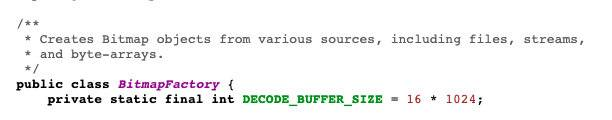

由于系统加载解析 Bitmap 的过程已经足够收敛，都是通过 BitmapFactory 来实现，因此 BitmapFactory 是一个非常不错的 hook 点。

有了稳定的 Hook 方案和足够收敛的 Hook 点，方案的实现起来就手到擒来了，利用 dexposed 对 BitmapFactory 里的关键方法进行替换就可以了。

#### 4.1.4 图片压缩

**图片压缩原理**

在不进行压缩的情况下，图片大小计算公式：图片大小=长 x 宽 x 图片位深。一张原始图像(1920x1080)，如果每个像素 32bit 表示(RGBA)，那么图像需要的存储大小 1920x1080x4 = 8294400Byte，大约 8M，一张图这么大是难以接受的。因此我们使用的图片都是经过压缩的。
 图片压缩利用的是空间冗余和视觉冗余原理：

- 空间冗余利用的是图像上各采样点颜色之间存在着的空间连贯性，把本该一个一个像素存储的数据，合并压缩存储，加载时进行解压还原。通常无损压缩利用的就是空间冗余原理。
- 视觉冗余是指人类的视觉系统由于受生理特性的限制，对于图像场的注意是非均匀的，人对细微的颜色差异感觉不明显。 例如，人类视觉的一般分辨能力为 26 灰度等级，而一般的图像的量化采用的是 28 灰度等级，即存在视觉冗余。 通常有损压缩利用的是人的视觉冗余原理，擦除了对人的眼睛来说冗余的信息。

**选择更优的压缩工具**

可以使用[pngcrush](http://pmt.sourceforge.net/pngcrush/)、[pngquant](https://pngquant.org/)或[zopflipng](https://github.com/google/zopfli)等压缩工具来减少PNG文件大小，而不会丢失图像质量。所有这些工具都可以减少PNG文件大小，同时保持图像质量。

[pngcrush](http://pmt.sourceforge.net/pngcrush/)工具特别有效：此工具在PNG过滤器和zlib（Deflate）参数上迭代，使用过滤器和参数的每个组合来压缩图像。然后选择产生最小压缩输出的配置。

对于JPEG文件，你可以使用[packJPG](http://www.elektronik.htw-aalen.de/packjpg/)或[guetzli](https://github.com/google/guetzli/)等工具将JPEG文件压缩的更小，这些工具能够在保持图片质量不变的情况下，把图片文件压缩的更小。[guetzli](https://github.com/google/guetzli/)工具更是能够在图片质量不变的情况下，将文件大小降低35%。

在Android构建流程中AAPT会使用内置的压缩算法来优化`res/drawable/`目录下的PNG图片，但也可能会导致本来已经优化过的图片体积变大，可以通过在`build.gradle`中设置`cruncherEnabled`来禁止AAPT来优化PNG图片。

```groovy
aaptOptions {
    cruncherEnabled = false
}
```

抖音 Android 研发团队开发了 Gradle 插件 McImage，在编译期间 hook 资源，采用开源的算法 pngquant/guetzli 进行压缩，支持 webp 压缩。与 tinypng 等一些已知的方案相比，存在以下优势：

- McImage 现支持 webp 压缩，压缩比高于 tinypng，不过 Android 上 webp 需要做兼容，下文会详细介绍；
- tinypng 不开源，每个账号每个月只能免费压缩 500 张；McImage 使用的压缩算法都是基于开源算法；
- McImage 不仅可以压缩 module 中的图片，还能压缩 jar 和 aar 中的图片；
- McImage 支持压缩算法扩展，有更优的压缩算法选择时扩展方便；
- 和行业里其他方案相比，McImage 还能够支持压缩包含透明度的 webp 图片，并且兼容了 aapt2 对资源的 hook。

McImage 支持两种优化方式，这两种优化方式不可同时使用:

- Compress，pngquant 压缩 png 图片，guetzli 压缩 jpg 图片；
- ConvertWebp，webp 压缩 png\png 图片。

> webp 的压缩比要高于 pngquant、guetzli，所以现在更推荐使用 ConvertWebp 这种压缩方式。
>
> McImage 还被应用于字节跳动旗下多个产品的图片压缩优化工作中，收益如下：

| 描述                 | 收益   |
| -------------------- | ------ |
| 抖音-Compress        | 9.5MB  |
| 抖音-ConvertWebp     | 11.6MB |
| 火山-ConvertWebp     | 3.6MB  |
| Vigo-ConvertWebp     | 4MB    |
| Vigo aab-Compress    | 1.2MB  |
| vigo aab-ConvertWebp | 3.2MB  |
| 多闪-ConvertWebp     | 3.5MB  |

除了压缩、优化图片，McImage 还提供了以下功能：

1. 大图检测。在 app/build/mcimage_result 目录下会生成 mcimage_log.txt 日志文件，除了输出转换结果的日志外，在最后还输出了大像素图片和大体积图片，阈值可在 McImageConfig 里进行设置，方便大图复盘优化包大小；也支持编译阶段检测，检测到大图直接 block 编译，可及时发现大图提交；
2. 压缩算法方便扩展。如果想接入其他压缩算法，只需要继承 AbstractTask，实现 ITask 接口中的 work 方法即可；
3. 支持多线程压缩。把所有 task 的执行放入线程池中执行，大大缩短了 mcimage 的执行时间；
4. 增加了图片缓存 cache，进一步缩短打包时间。在开启多线程+图片缓存的情况下，全部命中缓存的情况下，整个 mcimage 的过程不到 10s；缓存路径可配置；
5. 压缩质量可配置，满足不同的压缩质量需求，缓存文件也会按照不同的压缩质量进行保存和命中；
6. 扫描不包含透明通道的图片到 app/build/mcimage_result 目录下。

对打包后的图片进行压缩：使用7zip压缩方式对图片进行压缩,建议使用微信的[AndResGuard](https://github.com/shwenzhang/AndResGuard)

#### 4.1.5 其他

**(1).只用一套图片**

对于绝大对数APP来说，只需要取一套设计图就足够了。从内存占用和适配的角度考虑，这一套图建议放在xhdpi文件夹下；

**(2).使用不带alpha值的jpg图片**

对于非透明的大图，jpg将会比png的大小有显著的优势，虽然不是绝对的，但是通常会减小到一半都不止。

**(3).使用shape**

特别是在扁平化盛行的当下，很多纯色的渐变的圆角的图片都可以用shape实现，代码灵活可控，省去了大量的背景图片。

**(4).使用着色方案**

相信你的工程里也有很多selector文件，也有很多相似的图片只是颜色不同，通过着色方案我们能大大减轻这样的工作量，减少这样的文件。

### 4.2 多 DPI 优化

Android 为了适配各种不同分辨率或者模式的设备，为开发者设计了同一资源多个配置的资源路径，app 通过 resource 获取图片资源时，自动根据设备配置加载适配的资源，但这些配置伴随着的问题就是高分辨率的设备包含低分辨率的无用图片或者低分辨率的设备包含高分辨率的无用图片。

一般情况下，针对国内应用市场，App 为了减少包大小，会选用市场占有率最高的一套 dpi（google 推荐 xxhdpi）兼容所有设备。 而针对海外应用市场的 APP，大多会通过 AppBundle 打包上传至 Google Play，能够享受动态分发 dpi 这一功能，不同分辨率手机可以下载不同 dpi 的图片资源，因此我们需要提供多套 dpi 来满足所有设备。 在项目中，我们的图片有的只有一套 dpi，有的有多套 dpi，针对上述两种场景，我们分别在打包时合并资源、复制资源，减少了包大小。

#### 4.2.1 DPI 复制（bundle 打包）

在国内项目中，为了减少图片的占用，一般都会对市场占用率高的 dpi 进行适配，比如只保留 xxhdpi 分辨率的图片。这样就导致了两个问题，一个是市场上 2k 分辨率手机越来越多，如果以后手机主流分辨率是 xxxhdpi，那么项目中几千张图片修改成本会非常高。 另一个问题是，公司不少海外产品是通过 AppBundle 打包上传到 Google Play 的，能够给不同设备用户下发不同 dpi 的资源。但项目中只有 xxhdpi，仍然下发 xxhdpi 的图片，无法通过降低 dpi 减小包大小。在巴西，我们 80%用户都使用 xhdpi 和 hdpi 手机，xxhdpi 图片相比 hdpi 占用多了一倍，这部分收益相当高。

因此，我们通过压缩分辨率的方式将高分辨率的图片降低到低分辨，项目业务只存放最高 dpi 图片，在打包的时候按需求复制筛选。 我们在 hook 了图片压缩的 task，在图片压缩前，获取到包括依赖库在内的所有 PNG 图片，利用 Graphics2D 降低图片分辨率，放在对应分辨率文件夹中。之后再执行图片压缩 task，防止一些图片重采样后大小增加。

我们仅对图片的分辨率进行缩放，并不降低图片采样率，因此在显示效果上没有区别。 不同 dpi 具体应该调整到多少分辨率，我们根据 [Google 的定义](https://developer.android.com/training/multiscreen/screendensities?hl=zh-CN#TaskProvideAltBmp)制作了一个表格：

| -            | LDPI    | MDPI    | HDPI    | XHDPI    | XXHDPI    | XXXHDPI |
| ------------ | ------- | ------- | ------- | -------- | --------- | ------- |
| 分辨率(普遍) | 240x320 | 320x480 | 480x800 | 720x1280 | 1080x1920 | 2k      |
| 倍率         | 3       | 4       | 6       | 8        | 12        | 16      |

我们复制一张 xxhdpi 的默认 logo 到所有 dpi，流程如下图，xhdpi 和 mdpi 文件夹下没有对应图片，复制；在 hdpi 中有对应图片，跳过；xxxhdpi 也没有对应图片，但为了避免降低图片精度，不能向更高分辨率文件夹复制，跳过。

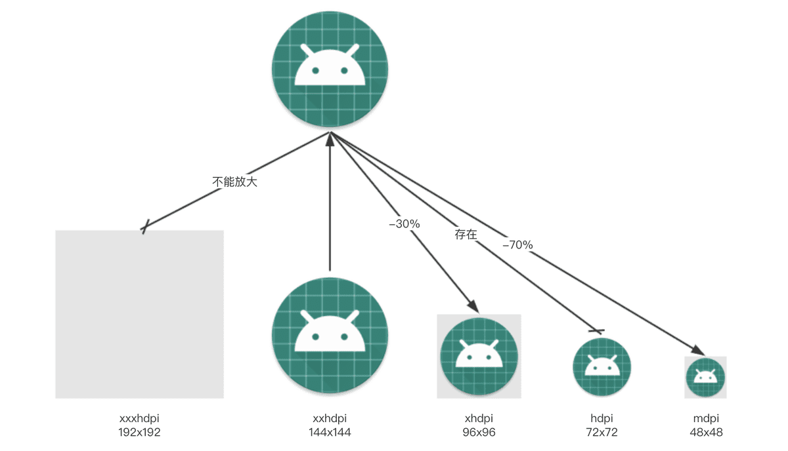

最终收益如图，公司内海外产品 TikTok 研发团队在使用该方案优化时，ldpi 相比 xxhdpi 减少了 2.5M 包大小。同时，低分辨率手机加载图片时直接加载对应 dpi 图片资源，不再需要对高分辨率图片进行缩放处理，提高了性能。

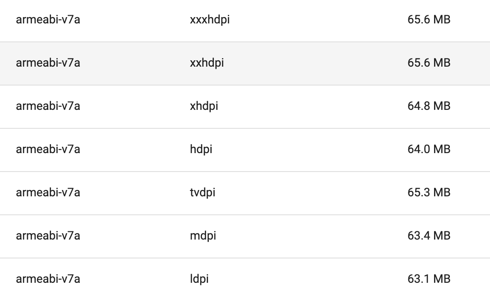

在复制时需要注意这些问题： 为了处理包括依赖库中的所有图片，在资源合并阶段进行了复制，这样会导致.cache 目录的很多路径下会多出大量图片资源，因此这个插件我们在 CI 上开启，避免本地打包新增大量图片，提交到代码仓库。同时，由于.cache 中被复制了多份图片，需要在 assemble 打包流程中进行多 dpi 去重。 在 CI 上会有并发场景，同时复制和压缩会导致.cache 目录下同时存在 a.png 和 a.webp，出现 Duplicated 错误，因此最后需要扫描删除同名的.png 文件。

#### 4.2.2 多 DPI 去重(assemble 打包）

针对普通打包模式(直接产出 apk，比如抖音包)，我们可以选择只保留一份分辨率偏高的的图片，这样高分辨率设备可以拿到合适的图片、低分辨率设备通过 Resource 获取时会自动进行缩放，依然可以保证合理的运行内存。

多 dpi 图片可以通过 Android 自带的 [resConfig](https://developer.android.com/guide/topics/resources/providing-resources.html#AlternativeResources) 去重，但这个配置只对资源的 qualifier 去重，比如对像素密度和屏幕尺寸不会同时做去重，抖音使用基于 AndResguard 修改的方式对 drawable 去重，可以定义不同配置的优先级和作用范围。 根据优化配置确保留一份资源，优化方式如下图(灰色数据表示会被删除)：


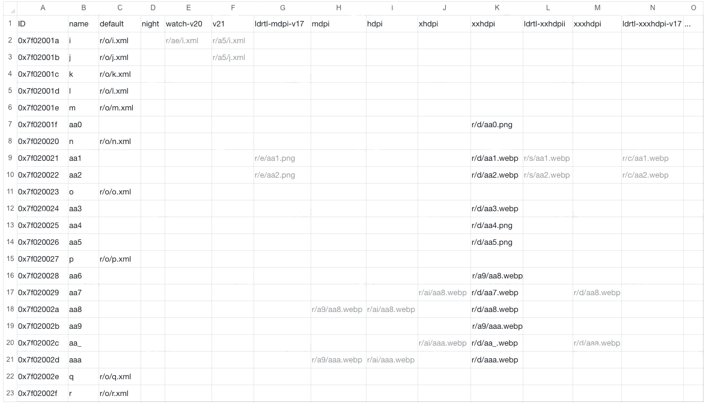

### 4.3 开启资源压缩

Android的编译工具链中提供了一款资源压缩的工具，可以通过该工具来压缩资源，如果要启用资源压缩，可以在build.gradle文件中将`shrinkResources true`。例如：

```groovy
android {
    ...
    buildTypes {
        release {
            shrinkResources true
            minifyEnabled true
            proguardFiles getDefaultProguardFile('proguard-android.txt'),
                    'proguard-rules.pro'
        }
    }
}
```

> 需要注意的是目前资源压缩器目前不会移除values/文件夹中定义的资源（例如字符串、尺寸、样式和颜色），有关详情，请参阅[问题 70869](https://code.google.com/p/android/issues/detail?id=70869&hl=zh-cn)。

Android构建工具是通过[ResourceUsageAnalyzer](https://android.googlesource.com/platform/tools/base/+/gradle_2.0.0/build-system/gradle-core/src/main/groovy/com/android/build/gradle/tasks/ResourceUsageAnalyzer.java)来检查哪些资源是无用的，当检查到无用的资源时会把该资源替换成预定义的版本。详看下面代码片段（摘自`com.android.build.gradle.tasks.ResourceUsageAnalyzer`）：

```java
public class ResourceUsageAnalyzer {
	...

    /**
     * Whether we should create small/empty dummy files instead of actually
     * removing file resources. This is to work around crashes on some devices
     * where the device is traversing resources. See http://b.android.com/79325 for more.
     */
    public static final boolean REPLACE_DELETED_WITH_EMPTY = true;

  	// A 1x1 pixel PNG of type BufferedImage.TYPE_BYTE_GRAY
    public static final byte[] TINY_PNG = new byte[] {
            (byte)-119, (byte)  80, (byte)  78, (byte)  71, (byte)  13, (byte)  10,
            (byte)  26, (byte)  10, (byte)   0, (byte)   0, (byte)   0, (byte)  13,
            (byte)  73, (byte)  72, (byte)  68, (byte)  82, (byte)   0, (byte)   0,
            (byte)   0, (byte)   1, (byte)   0, (byte)   0, (byte)   0, (byte)   1,
            (byte)   8, (byte)   0, (byte)   0, (byte)   0, (byte)   0, (byte)  58,
            (byte) 126, (byte)-101, (byte)  85, (byte)   0, (byte)   0, (byte)   0,
            (byte)  10, (byte)  73, (byte)  68, (byte)  65, (byte)  84, (byte) 120,
            (byte) -38, (byte)  99, (byte)  96, (byte)   0, (byte)   0, (byte)   0,
            (byte)   2, (byte)   0, (byte)   1, (byte) -27, (byte)  39, (byte) -34,
            (byte)  -4, (byte)   0, (byte)   0, (byte)   0, (byte)   0, (byte)  73,
            (byte)  69, (byte)  78, (byte)  68, (byte) -82, (byte)  66, (byte)  96,
            (byte)-126
    };

    public static final long TINY_PNG_CRC = 0x88b2a3b0L;

    // A 3x3 pixel PNG of type BufferedImage.TYPE_INT_ARGB with 9-patch markers
    public static final byte[] TINY_9PNG = new byte[] {
            (byte)-119, (byte)  80, (byte)  78, (byte)  71, (byte)  13, (byte)  10,
            (byte)  26, (byte)  10, (byte)   0, (byte)   0, (byte)   0, (byte)  13,
            (byte)  73, (byte)  72, (byte)  68, (byte)  82, (byte)   0, (byte)   0,
            (byte)   0, (byte)   3, (byte)   0, (byte)   0, (byte)   0, (byte)   3,
            (byte)   8, (byte)   6, (byte)   0, (byte)   0, (byte)   0, (byte)  86,
            (byte)  40, (byte) -75, (byte) -65, (byte)   0, (byte)   0, (byte)   0,
            (byte)  20, (byte)  73, (byte)  68, (byte)  65, (byte)  84, (byte) 120,
            (byte) -38, (byte)  99, (byte)  96, (byte)-128, (byte)-128, (byte)  -1,
            (byte)  12, (byte)  48, (byte)   6, (byte)   8, (byte) -96, (byte)   8,
            (byte)-128, (byte)   8, (byte)   0, (byte)-107, (byte)-111, (byte)   7,
            (byte)  -7, (byte) -64, (byte) -82, (byte)   8, (byte)   0, (byte)   0,
            (byte)   0, (byte)   0, (byte)   0, (byte)  73, (byte)  69, (byte)  78,
            (byte)  68, (byte) -82, (byte)  66, (byte)  96, (byte)-126
    };

    public static final long TINY_9PNG_CRC = 0x1148f987L;

    // The XML document <x/> as binary-packed with AAPT
    public static final byte[] TINY_XML = new byte[] {
            (byte)   3, (byte)   0, (byte)   8, (byte)   0, (byte) 104, (byte)   0,
            (byte)   0, (byte)   0, (byte)   1, (byte)   0, (byte)  28, (byte)   0,
            (byte)  36, (byte)   0, (byte)   0, (byte)   0, (byte)   1, (byte)   0,
            (byte)   0, (byte)   0, (byte)   0, (byte)   0, (byte)   0, (byte)   0,
            (byte)   0, (byte)   1, (byte)   0, (byte)   0, (byte)  32, (byte)   0,
            (byte)   0, (byte)   0, (byte)   0, (byte)   0, (byte)   0, (byte)   0,
            (byte)   0, (byte)   0, (byte)   0, (byte)   0, (byte)   1, (byte)   1,
            (byte) 120, (byte)   0, (byte)   2, (byte)   1, (byte)  16, (byte)   0,
            (byte)  36, (byte)   0, (byte)   0, (byte)   0, (byte)   1, (byte)   0,
            (byte)   0, (byte)   0, (byte)  -1, (byte)  -1, (byte)  -1, (byte)  -1,
            (byte)  -1, (byte)  -1, (byte)  -1, (byte)  -1, (byte)   0, (byte)   0,
            (byte)   0, (byte)   0, (byte)  20, (byte)   0, (byte)  20, (byte)   0,
            (byte)   0, (byte)   0, (byte)   0, (byte)   0, (byte)   0, (byte)   0,
            (byte)   0, (byte)   0, (byte)   3, (byte)   1, (byte)  16, (byte)   0,
            (byte)  24, (byte)   0, (byte)   0, (byte)   0, (byte)   1, (byte)   0,
            (byte)   0, (byte)   0, (byte)  -1, (byte)  -1, (byte)  -1, (byte)  -1,
            (byte)  -1, (byte)  -1, (byte)  -1, (byte)  -1, (byte)   0, (byte)   0,
            (byte)   0, (byte)   0
    };

    public static final long TINY_XML_CRC = 0xd7e65643L;

    ...
}    
```

上面截图中3个byte数组的定义就是资源压缩工具为无用资源提供的预定义版本，可以看出对`.png`提供了`TINY_PNG`， 对`.9.png`提供了`TINY_9PNG`以及对`.xml`提供了`TINY_XML`的预定义版本。

资源压缩工具的详细使用可以参考[Shrink Your Code and Resources](https://developer.android.com/studio/build/shrink-code.html)。资源压缩工具默认是采用安全压缩模式来运行，可以通过[开启严格压缩模式](https://developer.android.com/studio/build/shrink-code.html#strict-reference-checks)来达到更好的瘦身效果。

如果想知道哪些资源是无用的，可以通过资源压缩工具的输出日志文件`${project.buildDir}/outputs/mapping/release/resources.txt`来查看。如下图所示`res/layout/abc_activity_chooser_viewer.xml`就是无用的，然后被预定义的版本`TINY_XML`所替换：

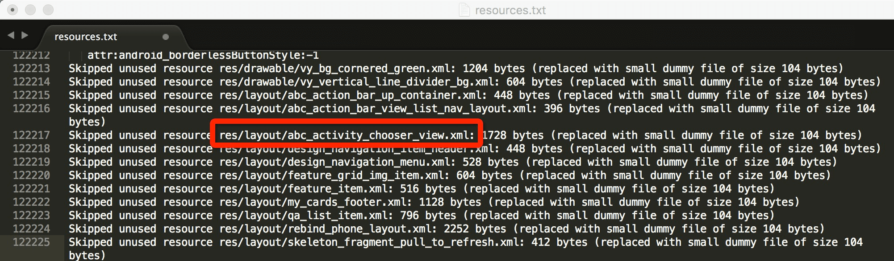

资源压缩工具只是把无用资源替换成预定义较小的版本，那我们如何删除这些无用资源呢？通常的做法是结合资源压缩工具的输出日志，找到这些资源并把它们进行删除。但在笔者的项目中很多无用资源是被其它组件或第三方SDK所引入的，如果采用这种优化方式会带来这些SDK后期维护成本的增加，针对这种情况笔者是通过采用在resources.arsc中做优化来解决的，详情看下面“resources.arsc的优化”一节的介绍。

### 4.4 语言资源优化

根据App自身支持的语言版本选用合适的语言资源，例如使用了AppCompat，如果不做任何配置的话，最终APK包中会包含AppCompat中消息的所有已翻译语言字符串，无论应用的其余部分是否翻译为同一语言，可以通过`resConfig`来配置使用哪些语言，从而让构建工具移除指定语言之外的所有资源。下图是具体的配置示例：

```groovy
android {
	...
    defaultConfig {
    	...
        resConfigs "zh", "zh-rCN"
    }
    ...
}    
```

> 针对为不同DPI所提供的图片也可以采用相同的策略，需要针对自身的目标用户和目标设备做一定的选择，可以参考[Support Only Specific Densities](https://developer.android.com/topic/performance/reduce-apk-size.html?#reduce-resources)来操作。有关屏幕密度的详细信息，请参阅[Screen Sizes and Densities](https://developer.android.com/about/dashboards/index.html#Screens)。
>
> 对`.so`文件也可以采用类似的策略，比如笔者的项目中只保留了`armeabi`版本的`.so`文件。

### 4.5 清理无用资源

在我们应用版本的迭代中，肯定有废弃的代码和资源，我们要及时地清理，来减小App体积。

清理的方法：

**(1).使用Refactor->Remove unused Resource**

这个一键清除的小功能不是特别的又用，因为资源是经过反射或字符拼接等方式获取，所以检查不完全，需要我们不断的实验。

```
Idea->Refactor->Remove Unused Resources
```

**(2).使用Lint工具**

lint工具还是很有用的，它给我们需要优化的点

需要注意的点：

* 检测没有用的布局并且删除

* 把未使用到的资源删除

* 建议String.xml有一些没有用到的字符也删除掉

**(3).删除无用的语言资源**

大部分应用其实并不需要支持几十种语言的国际化支持。比如我们只是保存中文支持：

```groovy
    android {
        defaultConfig {
            resConfigs "zh"
        }
    }
```

**(4).清理第三方库中冗余代码**

对于第三方库，可能我们只是用到库中的一个功能，那么我们就可以导入源码，并且删除无关的代码，来减小体积。

### 4.6 资源动态加载

资源可以动态加载，减小apk体积。

**(1).在线化素材库**

如果你的APP支持素材库(比如聊天表情库)的话，考虑在线加载模式，因为往往素材库都有不小的体积

**(2).皮肤加载**

有的app用到皮肤库，这是就可以使用动态加载。

**(3).模块插件化**

如果模块过多，apk体积过大，可以考虑插件化，来减少体积。

## 5. resources.arsc的优化

针对`resources.arsc`，笔者尝试过的优化手段如下：

- 开启资源混淆；
- 对重复的资源进行优化；
- 对被`shrinkResources`优化掉的资源进行处理。

下面将分别对这些优化手段进行展开介绍。

### 5.1 资源混淆

在笔者另一篇[《美团Android资源混淆保护实践》](http://tech.meituan.com/mt-android-resource-obfuscation.html)文章中介绍了采用对资源混淆的方式来保护资源的安全，同时也提到了这种方式有显著的瘦身效果。笔者当时是采用修改AAPT的相关源码的方式，这种方式的痛点是每次升级`Build Tools`都要修改一次AAPT源码，维护性较差。目前笔者采用了微信开源的资源混淆库[AndResGuard](https://github.com/shwenzhang/AndResGuard)，具体的原理和使用帮助可以参考[安装包立减1M–微信Android资源混淆打包工具](http://mp.weixin.qq.com/s?__biz=MzAwNDY1ODY2OQ==&mid=208135658&idx=1&sn=ac9bd6b4927e9e82f9fa14e396183a8f#rd)。

### 5.2 无用资源优化

在上一节中介绍了可以通过`shrinkResources true`来开启资源压缩，资源压缩工具会把无用的资源替换成预定义的版本而不是移除，如果采用人工移除的方式会带来后期的维护成本，这里笔者采用了一种比较取巧的方式，在Android构建工具执行`package${flavorName}`Task之前通过修改`Compiled Resources`来实现自动去除无用资源。

具体流程如下：

- 收集资源包（`Compiled Resources`的简称）中被替换的预定义版本的资源名称，通过查看资源包（Zip格式）中每个`ZipEntry`的`CRC-32 checksum`来寻找被替换的预定义资源，预定义资源的`CRC-32`定义在[ResourceUsageAnalyzer](https://android.googlesource.com/platform/tools/base/+/gradle_2.0.0/build-system/gradle-core/src/main/groovy/com/android/build/gradle/tasks/ResourceUsageAnalyzer.java)，下面是它们的定义。

```groovy
  	// A 1x1 pixel PNG of type BufferedImage.TYPE_BYTE_GRAY
    public static final long TINY_PNG_CRC = 0x88b2a3b0L;

    // A 3x3 pixel PNG of type BufferedImage.TYPE_INT_ARGB with 9-patch markers
    public static final long TINY_9PNG_CRC = 0x1148f987L;

    // The XML document <x/> as binary-packed with AAPT
    public static final long TINY_XML_CRC = 0xd7e65643L;
```

- 通过[android-chunk-utils](https://github.com/madisp/android-chunk-utils)把`resources.arsc`中对应的定义移除；
- 删除资源包中对应的资源文件。

### 5.3 重复资源优化

目前美团App是由各个业务团队共同开发完成，为了方便各业务团队的独立开发，美团App进行了平台化改造。改造时存在很多资源文件（如：drawable、layout等）被不同的业务团队都拷贝到自己的Library下，同时为了避免引发资源覆盖的问题，每个业务团队都会为自己的资源文件名添加前缀。这样就导致了这些资源文件虽然内容相同，但因为名称的不同而不能被覆盖，最终都会被集成到APK包中，针对这种问题笔者采用了和前面“无用资源优化”一节中描述类似的策略。

具体步骤如下：

- 通过资源包中的每个`ZipEntry`的`CRC-32 checksum`来筛选出重复的资源；
- 通过[android-chunk-utils](https://github.com/madisp/android-chunk-utils)修改`resources.arsc`，把这些重复的资源都`重定向`到同一个文件上；
- 把其它重复的资源文件从资源包中删除。

代码片段：

```groovy
variantData.outputs.each {
    def apFile = it.packageAndroidArtifactTask.getResourceFile();

    it.packageAndroidArtifactTask.doFirst {
        def arscFile = new File(apFile.parentFile, "resources.arsc");
        JarUtil.extractZipEntry(apFile, "resources.arsc", arscFile);

        def HashMap<String, ArrayList<DuplicatedEntry>> duplicatedResources = findDuplicatedResources(apFile);

        removeZipEntry(apFile, "resources.arsc");

        if (arscFile.exists()) {
            FileInputStream arscStream = null;
            ResourceFile resourceFile = null;
            try {
                arscStream = new FileInputStream(arscFile);

                resourceFile = ResourceFile.fromInputStream(arscStream);
                List<Chunk> chunks = resourceFile.getChunks();

                HashMap<String, String> toBeReplacedResourceMap = new HashMap<String, String>(1024);

                // 处理arsc并删除重复资源
                Iterator<Map.Entry<String, ArrayList<DuplicatedEntry>>> iterator = duplicatedResources.entrySet().iterator();
                while (iterator.hasNext()) {
                    Map.Entry<String, ArrayList<DuplicatedEntry>> duplicatedEntry = iterator.next();

                    // 保留第一个资源，其他资源删除掉
                    for (def index = 1; index < duplicatedEntry.value.size(); ++index) {
                        removeZipEntry(apFile, duplicatedEntry.value.get(index).name);

                        toBeReplacedResourceMap.put(duplicatedEntry.value.get(index).name, duplicatedEntry.value.get(0).name);
                    }
                }

                for (def index = 0; index < chunks.size(); ++index) {
                    Chunk chunk = chunks.get(index);
                    if (chunk instanceof ResourceTableChunk) {
                        ResourceTableChunk resourceTableChunk = (ResourceTableChunk) chunk;
                        StringPoolChunk stringPoolChunk = resourceTableChunk.getStringPool();
                        for (def i = 0; i < stringPoolChunk.stringCount; ++i) {
                            def key = stringPoolChunk.getString(i);
                            if (toBeReplacedResourceMap.containsKey(key)) {
                                stringPoolChunk.setString(i, toBeReplacedResourceMap.get(key));
                            }
                        }
                    }
                }

            } catch (IOException ignore) {
            } catch (FileNotFoundException ignore) {
            } finally {
                if (arscStream != null) {
                    IOUtils.closeQuietly(arscStream);
                }

                arscFile.delete();
                arscFile << resourceFile.toByteArray();

                addZipEntry(apFile, arscFile);
            }
        }
    }
}
```

通过这种方式可以有效减少重复资源对包体大小的影响，同时这种操作方式对各业务团队透明，也不会增加协调相同资源如何被不同业务团队复用的成本。

#### 5.3.1 重复资源合并

随着项目的迭代，项目中难免会出现相同的资源被重复添加到资源路径中，对于这类文件，人工处理肯定是不可行的，可以在打包阶段自动去重。

抖音选择在 AndResguard 阶段对所有的资源进行分析，对 md5 相同的资源文件保留一份，删除其余的重复的文件，然后在 AndResguard 写入 arsc 文件时进行将删除的资源文件对应的资源路径指向唯一保留的一份资源文件。 优化方式如下图：

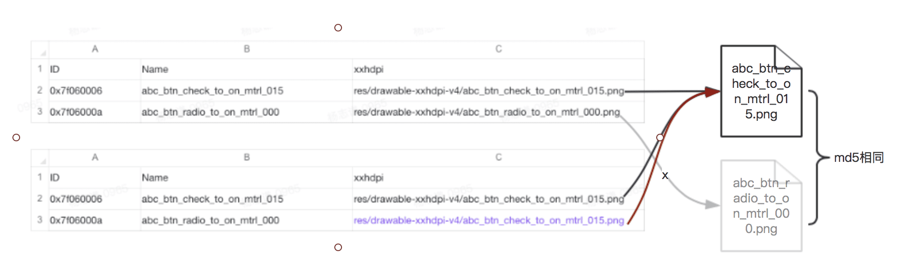

下图是抖音 511 版本接入多 dpi 去重与重复资源合并功能的优化结果：

| MD5 文件去重 | DPI 图片去重     | MD5 文件去重减少文件数量 | MD5 文件去重减少文件总体积 | DPI 图片文件去重减少文件数量 | DPI 图片文件去重减少文件总体积 | apk 大小   | 相比于原始包减少 |
| ------------ | ---------------- | ------------------------ | -------------------------- | ---------------------------- | ------------------------------ | ---------- | ---------------- |
| false        | false            | -                        | -                          | -                            | -                              | 85,030,636 | -                |
| true         | false            | 171                      | 156.6KB                    | -                            | -                              | 84,883,829 | 143KB            |
| true         | true             | 171                      | 156.6KB                    | 391                          | 312.9KB                        | 84,507,008 | 511KB            |
| false        | true             | -                        | -                          | 422                          | 434.5KB                        | 84,523,236 | 495KB            |
| true         | true（配置全开） | 171                      | 156.6KB                    | 463                          |                                |            |                  |

**配置：mergeDuplicatedRes = true，参考：[AndResGuard](https://github.com/shwenzhang/AndResGuard)**

## 6. shrinkResource 严格模式

随着项目的开发迭代，我们会有许多资源已经不再使用了，但仍然存在于项目中。虽然我们可以使用公司开源的字节码插件开发平台 [ByteX](https://github.com/bytedance/ByteX.git) 开发插件在 ProGuard 之前扫描出一些无用资源，但因为这一步没有经过无用代码删除，因此扫描出的结果并不全。而 shrinkResources 是 google 官方提供的优化此类无用资源的方法，它运行在 Proguard 之后，能标记所有无用资源并将其优化。

抖音 Android 在开启 shrinkResources 严格模式后，shrink 资源数 600+，收益大小 0.57MB。

shrinkResources 是由 Google 官方提供的工具，因此详细的接入方式参考 [Google Developer 上的文档](https://developer.android.com/studio/build/shrink-code#shrink-resources)即可。

在build.gradle 里面配置shrinkResources true，在打包的时候会自动清除掉无用的资源，但经过实验发现打出的包并不会，而是会把部分无用资源用更小的东西代替掉。注意，这里的“无用”是指调用图片的所有父级函数最终是废弃代码，而shrinkResources true 只能去除没有任何父函数调用的情况.

```bash
    android {
        buildTypes {
            release {
                shrinkResources true
            }
        }
    }
```

### 6.1 shrinkResources 原理

默认情况下，Resource shrink 是 safe 模式的，即其会帮助我们识别类似 `val name = String.format("img_%1d", angle + 1)` `val res = resources.getIdentifier(name, "drawable", packageName)` 这样模式的代码，从而保证我们在反射调用资源文件的时候，也是能够安全返回资源的。 从源码来看，Resource shrink 时会帮助我们识别以下五种情况：

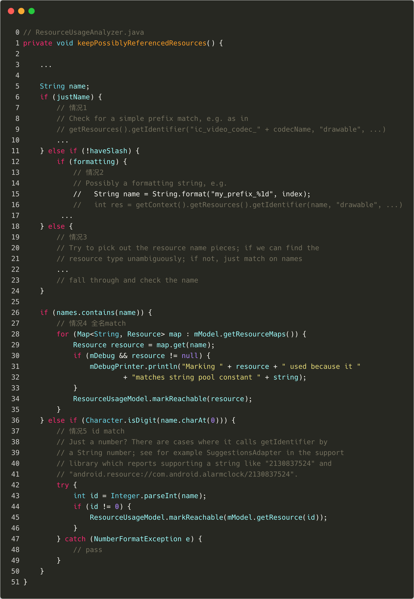

而 Resource shrink 使用了一种最笨但却最安全的方法去获取匹配的前缀/后缀字符串，那就是将应用中所有的字符串都认为是可能的前缀/后缀匹配字符串。


所以这就造成了在安全模式下，不小心被某个字符串所匹配到的资源，即使没有被使用也会被保留下来。以我们的项目为例，在 `com.ss.android.ugc.aweme.utils.PatternUtils` 中，我们有以下代码：

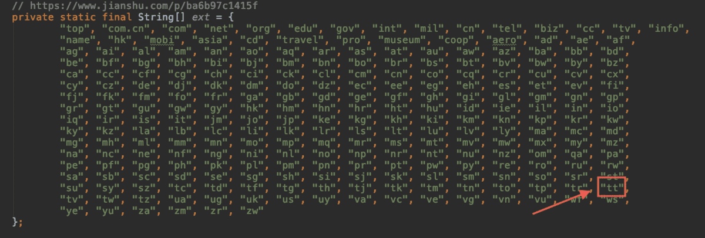

在安全模式下，这就造成了所有以 `tt` 开头的无用资源都不会被 shrink 掉（这也就是为什么严格模式一开，`ttlive_` 开头的无用资源那么多的原因）。

而严格模式打开后，其作用便是强行关闭这一段的字符匹配的过程：


当然这也就造成了我们在使用 `getIdentifier()` 的时候是不安全的，因为严格模式下是不会匹配任何字符串的，所以在开启严格模式之后，一定要严格检查所有被 shrink 的资源，是否有自己需要反射的资源！

### 6.2 shrinkResources 兼容 Dynamic Feature

AppBundle 是 Google 近年来力推的一个功能，它能够让我们的 apk 按照不同的维度生成下发，也提供了一个动态下发功能的方式，Dynamic Feature。但是如果我们在开启 Dynamic Feature 之后使用 shrinkResources，则提示以下错误：

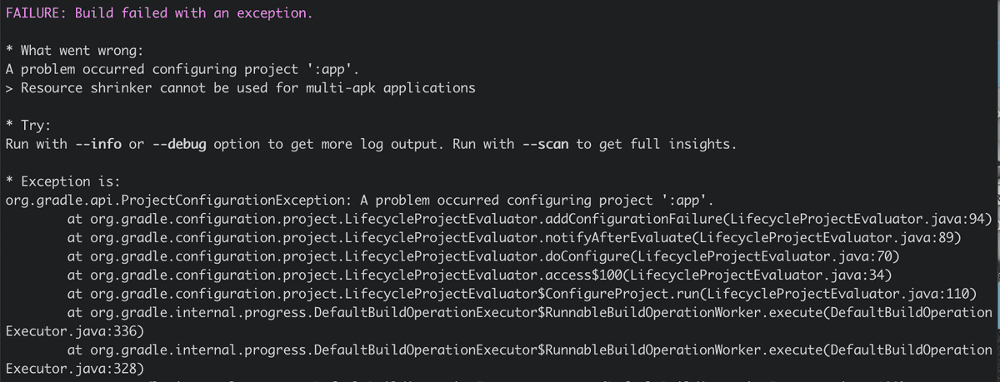

由此看来 Google 官方并不支持 App Bundle 使用 Dynamic Feature 时使用 shrink resource。在 Google Issue Tracker 上发现已经有人对此提交过 Issue 了，[相关 Issue](https://issuetracker.google.com/issues/120517460)。而 Google 的回复也是简单粗暴----计划中，但是没有时间：

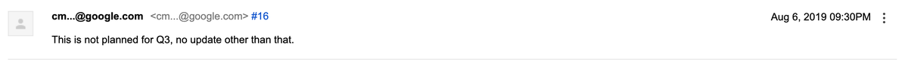

但是正常来说，如果做的好的话，我们的 App Bundle 的 Dynamic Feature 模块是很少会引用 Master 的资源的，即使有，使用 keep.xml 的方式也能将这种资源给保留下来。因此，理论上来说，单独对 Master 模块进行 shrinkResource 并注意反射调用的话，是没多大问题的。 Dynamic Feature 下检查 shrinkResources 配置是在 Configuring 阶段

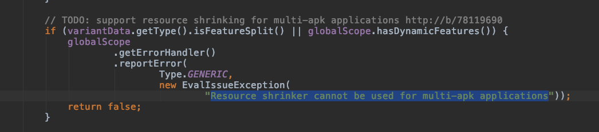

因此我们的想法便是在配置阶段不开启 shrinkResources 开关，而在后面执行资源处理任务的时候自行插入 shrinkResources 的 Task：

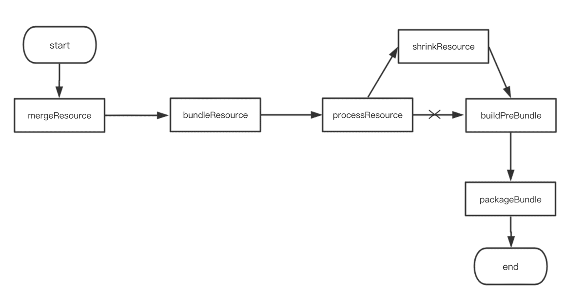

这样就能在 Dynamic Feature 下开启 shrinkResources 的 Task 了，整个代码编写十分简单，不到 50 行就能完成：

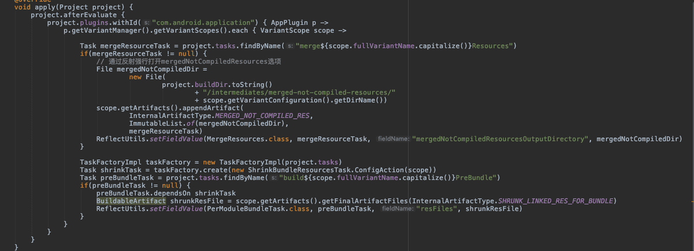

## 7. 资源混淆(兼容 aab 模式)

资源 id 与资源全路径的映射关系记录在 arsc 文件中，app 通过资源 id 再通过 Resource 获取对应的资源，所以对于映射关系中的资源路径做名字混淆可以达到减少包体积的效果。

抖音启用了微信开源的 [AndResguard](https://github.com/shwenzhang/AndResGuard) 进行资源混淆，在开源的基础上进行了增加了 MD5 去、多 DPI 只保留一份资源等优化。 由于公司内部有很多海外产品，在上架 Google Play 时需要走 aab，因此团队做了资源混淆的 aab 兼容-- [aabResguard](https://github.com/bytedance/AabResGuard)，已开源。

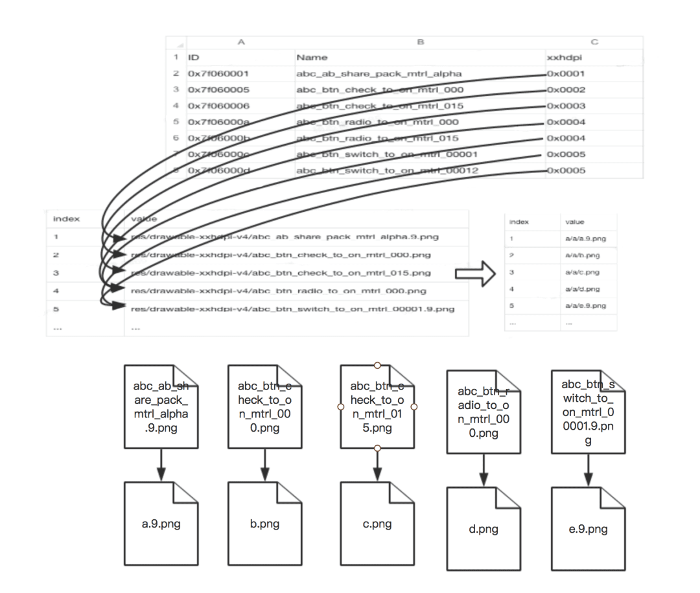

### 7.1 代码混淆

在gradle使用minifyEnabled进行Proguard混淆的配置.

```groovy
    android {
        buildTypes {
            release {
                minifyEnabled true
            }
        }
    }
```

为什么代码混淆可以让apk变小?

1. 可以删除注释和不用的代码。
2. 将java文件名改成短名
3. 将方法名改成短名

### 7.2 资源(res)混淆

资源混淆简单来说希望实现将res/drawable/icon,png变成res/drawable/a.png,或我们甚至可以将文件路径也同时混淆，改成r/s/a.png。
 建议使用微信的[AndResGuard](https://github.com/shwenzhang/AndResGuard)对资源混淆并且压缩图片res等资源

```csharp
    apply plugin: 'AndResGuard'
    buildscript {
        dependencies {
            classpath 'com.tencent.mm:AndResGuard-gradle-plugin:1.1.7'
        }
    }
    andResGuard {
        mappingFile = null
        use7zip = true
        useSign = true
        keepRoot = false
        // add <your_application_id>.R.drawable.icon into whitelist.
        // because the launcher will get thgge icon with his name
        def packageName = <your_application_id>
                whiteList = [
        //for your icon
        packageName + ".R.drawable.icon",
                //for fabric
                packageName + ".R.string.com.crashlytics.*",
                //for umeng update
                packageName + ".R.string.umeng*",
                packageName + ".R.string.UM*",
                packageName + ".R.string.tb_*",
                packageName + ".R.layout.umeng*",
                packageName + ".R.layout.tb_*",
                packageName + ".R.drawable.umeng*",
                packageName + ".R.drawable.tb_*",
                packageName + ".R.anim.umeng*",
                packageName + ".R.color.umeng*",
                packageName + ".R.color.tb_*",
                packageName + ".R.style.*UM*",
                packageName + ".R.style.umeng*",
                packageName + ".R.id.umeng*"
        ]
        compressFilePattern = [
        "*.png",
                "*.jpg",
                "*.jpeg",
                "*.gif",
                "resources.arsc"
        ]
        sevenzip {
            artifact = 'com.tencent.mm:SevenZip:1.1.7'
            //path = "/usr/local/bin/7za"
        }
    }
```

## 8. ARSC 瘦身

### 8.1 背景

resources.arsc 这个文件在很多项目中都占用了相当多的空间。常见的优化方法是使用 AndResGuard 混淆减少文件名及目录长度，7z 压缩，如果有海外产品的话可以动态下发语言。 我们在做完这些优化后，由于公司内部有很多海外产品，涉及到多语言的关系，ARSC 依然很大，我们决定尝试进一步优化。
 经过调研，最终我们对 3 个方面做了优化，分别是删除无用 Name、合并字符串池中重复字符串、删除无用文案，最终带来的收益是 1.6MB。 在此之前，我们还在 AndResGuard 的基础上完成了重复 MD5 文件图片合并，原理是一样的。

### 8.2 原理

先贴一张 arsc 结构的图，这个二进制文件的数据结构相当复杂，AndResGuard 其实只修改了这个文件的一小部分，至于更多的修改就无能为力了，于是我们自己解析了这个文件进行分析。 网上也有不少关于这个文件格式的说明，这里就不赘述了。推荐老罗和尼古拉斯的博客以及 aapt2 源码。google 提供的 [android-arscblamer](https://github.com/google/android-arscblamer) 和 [apktool](https://github.com/iBotPeaches/Apktool) 的代码也值得一看。

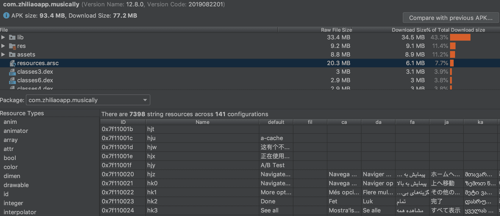

下面用一张图简单描述一下修改过程：

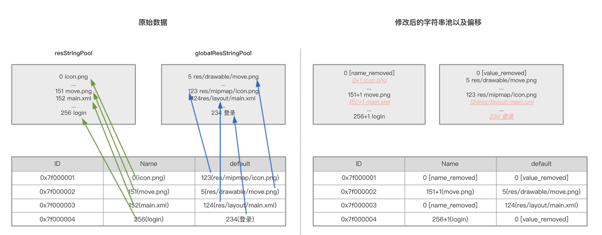

如图，字符串其实是通过索引的方式来获取的，所有字符串都保存在两个字符串池中（单个 package），一个是全局字符串池，一个是 package 下的字符串池，我们只需要修改指向全局字符串的偏移值就行了。name 和 value 所在二进制位置如下图。

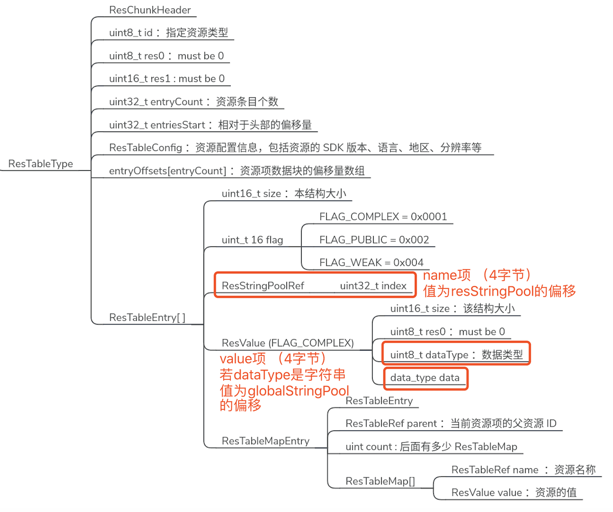

### 8.3 方案

#### 8.3.1 删除无用 Name

AndResGuard 在今年的 7 月也增加了这个功能，我们来看一下实现原理。 Name 对应的字符串池是 package 字符串池，由于这个字符串池中只包含所有 Name，我们操作可以稍微暴力一点，先做一份备份，然后清空字符串池，添加一个用于替换的字符串，赋值为 [name_removed]。

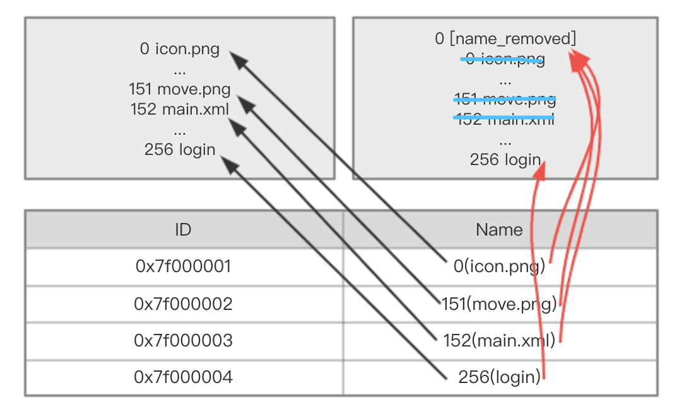

首先要确定哪些 name 是通过 getIdentifier 调用，配置成白名单。 遍历 name 项，如果不在白名单，那么把这一个 name 的偏移替换成 0，使其指向[name_removed]。 如果 name 在白名单，那么不应该删除，我们通过备份的字符串池找到这个 name 对应的字符串，添加到字符串池中，把偏移指向对应下标即可。

抖音通过这个优化减少了包大小 70k。

#### 8.3.2 合并重复字符串

value 所对应的是全局字符串池，虽然名字听起来不会有重复值，但在我们扫描排序后发现其实有很多重复字符串（用 AppBundle 打包就不会存在这个问题） 在抖音项目中，这个字符串池里有 1k+个重复字符串，合并这些字符串是非常必要的。


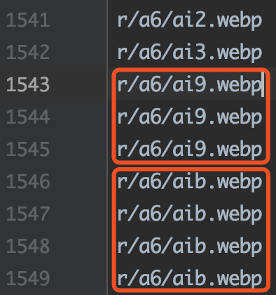

我们先遍历所有数据，然后把字符串池的重复字符串合并，记录偏移的修改，最后把需要修改的 value 的引用指向新的偏移。这个过程需要操作 arsc 数据结构的 ResValuel 和 ResTableMap，以保证所有 string 类型的值都能得到替换。

抖音通过这个优化减少了包大小 30k。

#### 8.3.3 删除无用文案

在打包过程中，其实所有 strings.xml 中保存的字符串都是不会被优化的，随着项目逐渐变大，一些废弃文案或者下个版本才有用的文案被引入了 apk 中，我们在 Proguard 后再次扫描，发现了 3000+个无用字符串。在公司内部的一些海外项目中，有的文案被翻译成 100 多个国家的语言，占用了极大的空间。

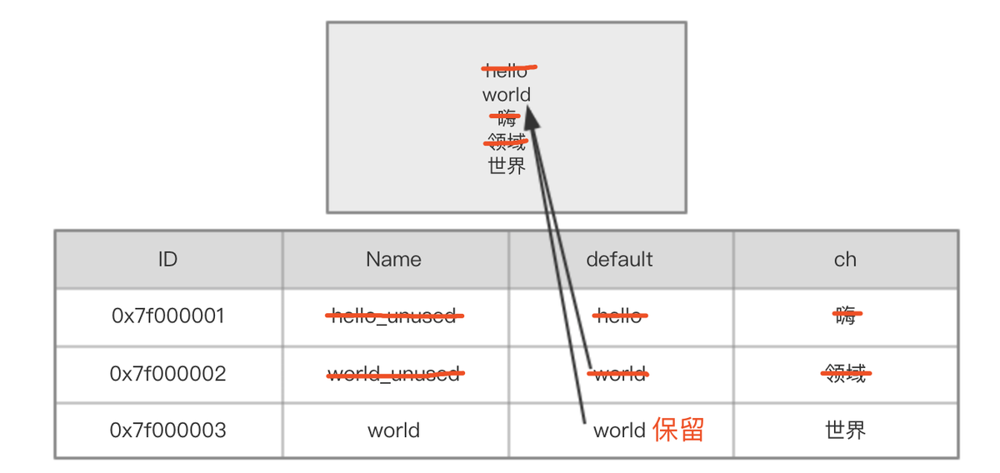

删除的方法和上面类似，都是指向替换的字符串所在偏移。 如图可能会存在两个不同 name 指向同一个字符串，需要判断待删除的字符串是否还有其他引用。

不同项目收益可能不太一样，公司内部海外项目对这些无用文案进行了替换，减少了 1.5M 包大小左右。

### 8.4 实现

如果是普通的 assemble 打包，直接在 ProcessResources 过程中获取 ap_文件中的 arsc 文件，利用我们的工具修改即可。

如果是 AppBundle 方式打包，修改 ap_是没有用的，因为最后产物是用 aapt 以 proto 格式生成的 resources.pb 文件，要修改只能 hook aapt 过程。这个文件和 arsc 文件结构不太一样，好在我们可以使用官方提供的 Resources 类解析、生成 pb 文件，使用相似的方法修改即可。

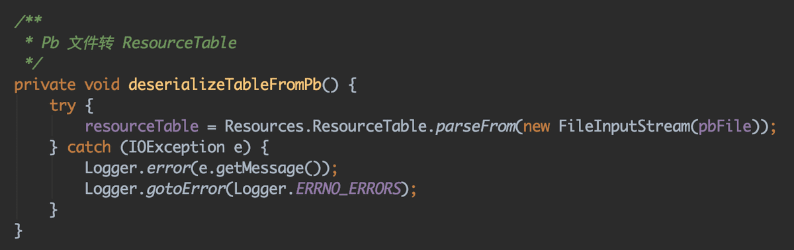

修改效果如图：


### 8.5 进一步优化

arsc 中的偏移数组是有优化空间的，我们会在未来尝试进行优化。 用二进制编辑器打开 arsc 文件可以发现，这样的 FF 值在文件中大量存在。

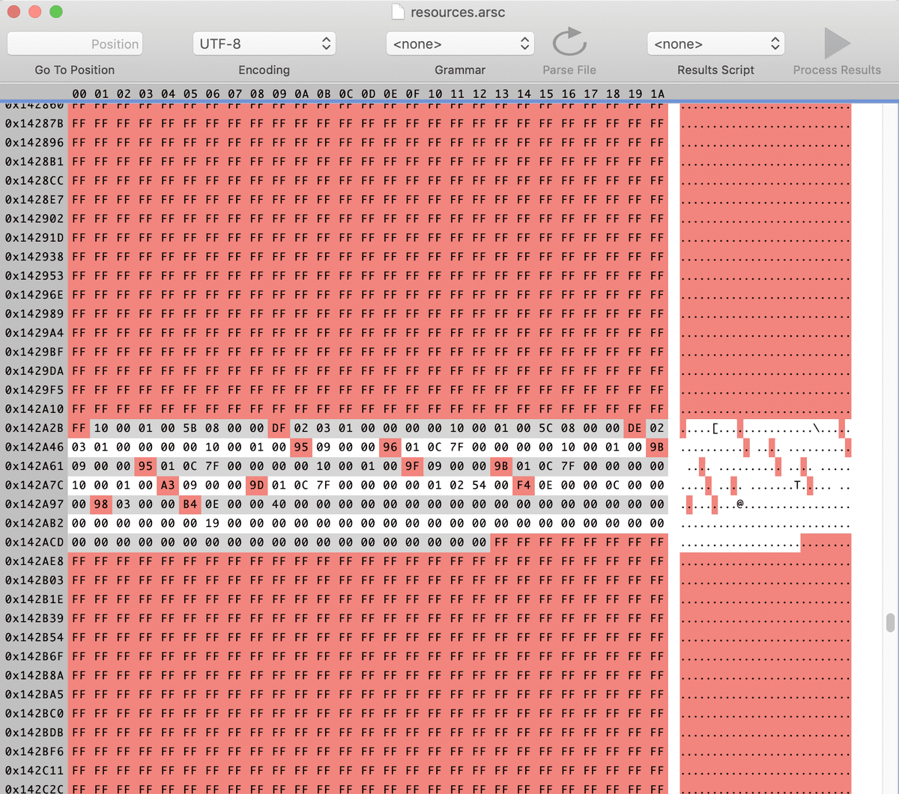

是什么导致了这样的空间浪费？ 我们可以看到下图中框选的空白，每一个都代表了其字符串所在的偏移值，这里并没有值，赋值 FF FF FF FF 作为默认偏移值，浪费了 4 字节空间。 某些列（configuration）可能就只有几个格子有值，如图抖音中 drawable 有 4k+张图片，有 24 列，大多数 configuration 只有几张图片，因此浪费了 4k*23*4≈380k。大致估算，抖音可以减少 1M 体积。（压缩前）

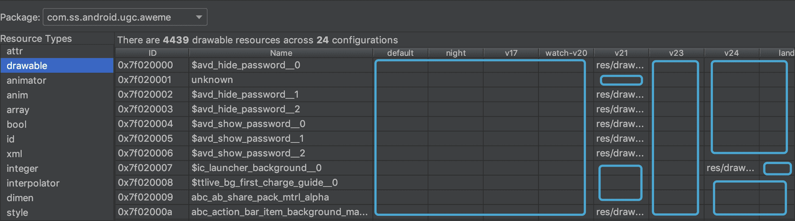

如下图 facebook 针对 arsc 文件的处理，我们可以把一行只有一个值的 id 抽出来，单独放到一个 Resource Type 中，每一个 id 只有一个值，避免了上述空间浪费情况。 但这样做修改了 ID，因此对应的代码中的 ID 也要修改，涉及了逆向 xml 以及 dex，提高了修改成本。还有一种思路是修改 aapt 源码，没有直接改 arsc 灵活。

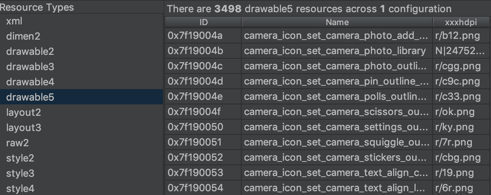

## 9. lib库优化

只提供对主流架构的支持，比如arm，对于mips和x86架构可以考虑不支持，这样可以大大减小APK的体积.

## 10. 总结

上述就是我们抖音 Android 端在包大小优化方面针对资源做的一些尝试和积累，力求追求极致。

我们针对包大小优化，在其他方面还做了很多优化措施:针对 so 优化，做了 so 合并、stl 版本统一、精简导出符号表和 so 压缩等措施；针对代码优化，细化混淆规则，开发 bytex 插件进行无用代码扫描、acess 方法内联、getter/setter 方法内联、删除行号等优化措施。

除了优化措施，良好的包大小监控系统是防止包大小劣化最重要的工具，否则包大小优化措施取得的收益抵不过业务快速迭代带来的包大小增长。抖音 Android 端结合 CI、Cony 平台，开发出了一套代码合入前置检查系统，每个分支增量超过阈值不准合入；还开发了分业务线监控包大小的工具，便于监控每个业务线包大小增长和给各个业务线定包大小指标。

## 参考

* [Android App包瘦身优化实践](https://tech.meituan.com/2017/04/07/android-shrink-overall-solution.html)
* [APK包大小优化总结](https://felixzhang00.github.io/2020/03/24/APK%E5%8C%85%E5%A4%A7%E5%B0%8F%E4%BC%98%E5%8C%96%E6%80%BB%E7%BB%93/)
* [抖音包大小优化-资源优化](https://juejin.im/post/6844904106696376334)
* [抖音BoostMultiDex优化实践：Android低版本上APP首次启动时间减少80%（二）](https://mp.weixin.qq.com/s/ILDTykAwR0xIkW-d1YzRHw)
* [抖音BoostMultiDex优化实践：Android低版本上APP首次启动时间减少80%（一）](https://mp.weixin.qq.com/s/jINCbTJ5qMaD6NdeGBHEwQ)
* [开源 | AabResGuard: AAB 资源混淆工具](https://mp.weixin.qq.com/s/4hBhaS_0uwHsJdwUHk1ZOQ)

