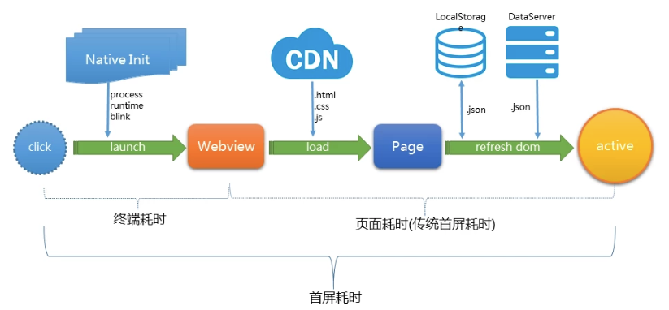
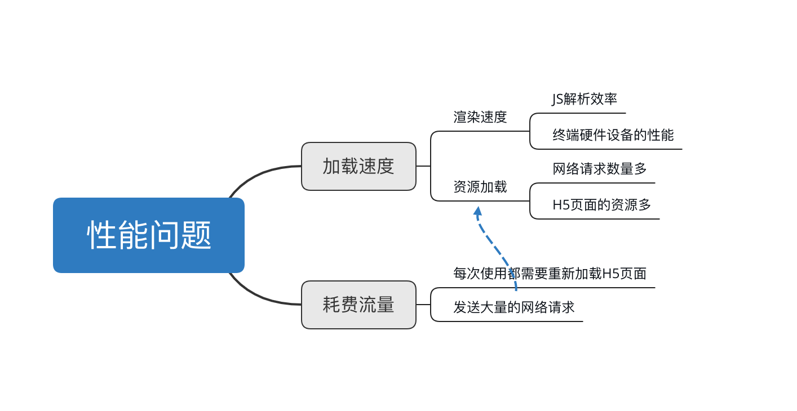

<h1 align="center">WebView缓存优化</h1>

[toc]

## 1. 一般的H5加载流程

通常将html/js/css等静态资源放到CDN上，然后页面加载后，再通过[CGI](https://baike.baidu.com/item/CGI/607810?fr=aladdin&fromid=6717913&fromtitle=ＣＧＩ)去拉取最新的数据，进行拼接展示。这种模式的加载流程如下：



1. 加载开始前做初始化工作，包括Runtime初始化，创建WebView等；
2. 完成初始化之后，WebView开始去请求资源加载H5页面；
3. 页面发起CGI请求对应的数据（或者通过本地缓存获取），拿到数据后对DOM进行操作更新。

从流程上看存在的直观的问题：

1. 终端耗时：终端初始化阶段的时间里（网络资料显示耗时在1s以上），网络完全是处于空闲等待状态的，浪费时间；
2. 资源和数据动态拉取，获取的速度受制于网络速度；

## 2. 存在的问题

H5页面的渲染速度主要取决于三点，`渲染速度`、`资源加载速度`和`WebView创建耗时`： `渲染速度`取决于两个方面：

1. JS解析效率：如果JS文件较多、本身解析过程复杂就会导致解析速度不快；
2. 硬件性能：手机硬件性能也是影响渲染速度的重要因素，Android机型碎片化严重，性能参差不齐。

`资源加载速度`：一般加载一个H5页面，都会产生多个的网络请求，包括：

1. H5自身的主要URL请求；
2. 图片、css文件、H5持有的外部引用的JS文件等，都是一个独立的HTTP请求。 这些文件都下载完成后才能完成渲染，而且每一个请求都是串行的，导致H5加载缓慢。

`WebView创建耗时`：本地Webview初始化都要不少时间, 首次初始化webview与第二次初始化不同，首次会比第二次慢很多。 原因猜测：webview初始化后，即使webview已经释放，但一些webview共用的全局服务或资源对象仍没有释放，第二次初始化时不需要再初始化这些对象。 H5的流量耗费主要源于：每次使用H5页面时，都需要重新加载H5页面。每次加载都会产生较多的网络请求。 问题总结如下图：



## 3. 解决方案

针对上述问题，主流的解决方案有：

1. WebView自带的H5缓存机制
2. 预加载
3. 离线包

## 4. 缓存机制

H5中有很多的特性，其中就包括离线存储（也可称为缓存机制）这个重要的特性。加入了缓存机制，意味着web应用可以进行缓存，在没有网络的情况下进行离线访问。缓存机制带来的好处包括：

1. 离线访问：用户可以在离线环境下使用
2. 提高速度：缓存在本地的资源加载速度更快
3. 减少服务器压力：只需下载更新过的文件，无需每次加载页面都进行一次完整的请求流程

到目前为止，H5的缓存机制一共有六种，分别是：

1. 浏览器缓存机制
2. Dom Storgage（Web Storage）存储机制
3. Web SQL Database存储机制
4. Indexed Database（IndexedDB）
5. Application Cache（AppCache）机制
6. File System API

### 浏览器缓存机制

浏览器缓存机制主要是根据HTTP协议头里的`Cache-Control`、`Expires`、`Last-Modified`以及`Etag`请求头控制缓存：

- `Cache-Control`：用于控制资源在本地的缓存有效时长： Cache-Control的值就有十几种，其中包含了请求首部可携带的和响应首部携带的。例如： `max-age=<seconds>`设置缓存存储的最大周期，超过这个时间缓存被认为过期(单位秒)，如果在时间期限内有再次请求这个资源，浏览器不会发出HTTP请求，而是直接使用本地缓存的文件。 `no-cache`并不意味着不缓存，在发布缓存副本之前，强制要求缓存把请求提交给原始服务器进行验证。在每次请求中使用任何缓存响应之前都不会不会直接去拿缓存资源，而是会首先会通过服务器进行验证，通过验证后才使用缓存，否则直接使用服务器返回的新的资源。 `no-store`是真正的不进行缓存，不会存储有关客户端请求或服务器响应的任何内容。本地和代理服务器都不缓冲，每次都从服务器获取。请求和响应的信息都不会被存储在对方的磁盘系统中。
- `Expires`：作用和`Cache-Control`类似，响应头包含日期/时间（格林尼治时间），表示在此时候之后，响应过期。 在`Expires`设置的时间之前，浏览器不会再次请求获取资源的。但如果本地时间和服务器时间不同步就会导致出现问题，因此才会有了上面的`Cache-Control`。需要注意的是，`Cache-Control`的优先级比`Expires`要高。如果在`Cache-Control`响应头设置了`max-age`，那么`Expires`头会被忽略。 示例：`Expires: Wed, 21 Oct 2015 07:28:00 GMT`
- `Last-Modified`：包含源头服务器认定的资源做出修改的日期及时间，用于标识文件在服务器上的最新更新时间。判断接收到的或者存储的资源是否彼此一致，再次请求时，如果文件缓存过期，浏览器通过[If-Modified-Since](https://developer.mozilla.org/zh-CN/docs/Web/HTTP/Headers/If-Modified-Since)字段带上这个时间，发送给服务器，由服务器比较时间戳来判断文件是否有修改。如果请求的资源从接收的那时起未经修改，那么返回一个不带有消息主体的304响应告知浏览器使用缓存。否则就返回200，同时返回最新的资源。精确度比`ETag`要低，是一个备用机制。
- `ETag`：作用和`Last-Modified`类似，标识文件在服务器上的最新更新时间。不同的是，ETag的值是一个对文件进行标识的特征字串。在向服务器查询文件是否有更新时，浏览器通过If-None-Match字段把特征字串发送给服务器，服务器将客户端的ETag与其当前版本的资源的ETag进行比较，如果两个值匹配（即资源未更改），服务器将返回不带任何内容的304未修改状态告知浏览器使用缓存。没有明确指定生成ETag值的方法。通常，使用内容的散列，最后修改时间戳的哈希值，或简单地使用版本号。`ETag`和`Last-Modified`可根据需求使用一个或两个同时使用。两个同时使用时，只要满足基中一个条件，就认为文件没有更新。

常见用法是`Cache-Control`与`Last-Modified`一起使用, `Expires`与`ETag`一起使用。一个负责控制缓存的有效时间，一对负责用于缓存失效后判断是否需要更新。还存在两种特殊情况：

1. 手动刷新时（F5）浏览器会认为缓存已经过期，在请求中加上字段`Cache-Control:max-age=0`，直接向服务器查询是否有文件需要更新。
2. 强制刷新页面（Ctrl+F5）时浏览器会直接忽略本地的缓存，在请求中加上字段`Cache-Control:no-cache`，直接向服务器请求新的资源。

浏览器缓存主要用于静态资源文件的存储，例如JS、CSS、字体、图片等资源，Webview会将缓存的文件记录及文件内容会存在当前app的data目录中。WebView内置自动实现，使用默认的CacheMode就可以实现。也可手动设置缓存模式：

```
WebSettings webSettings = webView.getSettings();
webSettings.setCacheMode(WebSettings.LOAD_DEFAULT);
```

1. `LOAD_CACHE_ONLY`:不使用网络，只读取本地缓存数据
2. `LOAD_DEFAULT`:根据cache-control决定是否从网络上取数据
3. `LOAD_CACHE_NORMAL`:API level 17中已经废弃，从API level 11开始作用同LOAD_DEFAULT模式
4. `LOAD_NO_CACHE`:不使用缓存，只从网络获取数据
5. `LOAD_CACHE_ELSE_NETWORK`:只要本地有，无论是否过期，或者no-cache，都使用缓存中的数据。本地没有缓存时才从网络上获取。

一般设置为默认的缓存模式就可以了。 浏览器缓存的优势在于支持Http协议层。不足之处有：

1. 需要首次加载之后才能产生缓存文件；
2. 终端设备缓存的空间有限，缓存有可能会被清除；
3. 缓存使用缺乏校验，有可能被篡改；

各个请求头详解：[Cache-Control](https://developer.mozilla.org/zh-CN/docs/Web/HTTP/Headers/Cache-Control)、[Expires](https://developer.mozilla.org/zh-CN/docs/Web/HTTP/Headers/Expires)、[Last-Modified](https://developer.mozilla.org/zh-CN/docs/Web/HTTP/Headers/Last-Modified)、[ETag](https://developer.mozilla.org/zh-CN/docs/Web/HTTP/Headers/ETag)

### Dom Storage存储机制

Dom Storage的官方描述为：

> DOM 存储是一套在 Web Applications 1.0 规范中首次引入的与存储相关的特性的总称，现在已经分离出来，单独发展成为独立的 W3C Web 存储规范。 DOM存储被设计为用来提供一个更大存储量、更安全、更便捷的存储方法，从而可以代替掉将一些不需要让服务器知道的信息存储到 cookies里的这种传统方法。 Dom Storage机制类似Cookies，但有一些优势。Dom Storage是通过存储字符串的Key-Value对来提供的， Dom Storage存储的数据在本地，不像Cookies，每次请求一次页面，Cookies都会发送给服务器。 DOM Storage分为sessionStorage和localStorage，二者使用方法基本相同，区别在于作用范围不同：前者具有临时性，用来存储与页面相关的数据，它在页面关闭后无法使用，后者具备持久性，即保存的数据在页面关闭后也可以使用。

- sessionStorage 是个全局对象，它维护着在页面会话(page session)期间有效的存储空间。只要浏览器开着，页面会话周期就会一直持续。当页面重新载入(reload)或者被恢复(restores)时，页面会话也是一直存在的。每在新标签或者新窗口中打开一个新页面，都会初始化一个新的会话。
- localStorage保存的数据是持久性的。当前PAGE关闭（Page Session结束后），保存的数据依然存在。重新打开PAGE，上次保存的数据可以获取到。另外，Local Storage 是全局性的，同时打开两个 PAGE 会共享一份存数据，在一个PAGE中修改数据，另一个 PAGE 中是可以感知到的。

Dom Storage的优势在于：存储空间（5M）大，远远大于Cookies（4KB），而且数据存储在本地无需经常和服务器进行交互，存储安全、便捷。可用于存储临时的简单数据。作用机制类似于`SharedPreference`。但是，如果要存储结构化的数据，可能要借助JSON了，将要存储的对象转为JSON 串。不太适合存储比较复杂或存储空间要求比较大的数据，也不适合存储静态的文件。 使用方法如下：

```
webSettings.setDomStorageEnabled(true);
```

### Web SQL Database存储机制

Web SQL Database基于SQL的数据库存储机制，用于存储适合数据库的结构化数据，充分利用数据库的优势，存储适合数据库的结构化数据，Web SQL Database存储机制提供了一组可方便对数据进行增加、删除、修改、查询。 Android系统也使用了大量的数据库用来存储数据，比如联系人、短消息等；数据库的格式为SQLite。Android也提供了API来操作SQLite。Web SQL Database存储机制就是通过提供一组API，借助浏览器的实现，将这种Native的功能提供给了Web。 实现方法为：

```java
String cacheDirPath = context.getFilesDir().getAbsolutePath()+"cache/";
// 设置缓存路径
webSettings.setDatabasePath(cacheDirPath);
webSettings.setDatabaseEnabled(true);
```

Web SQL Database存储机制官方已不再推荐使用，也已经停止了维护，取而代之的是IndexedDB缓存机制

### Indexed Database缓存机制

IndexedDB也是一种数据库的存储机制，但不同于已经不再支持 Web SQL Database缓存机制。IndexedDB不是传统的关系数据库，而是属于NoSQL数据库，通过存储字符串的Key-Value对来提供存储（类似于Dom Storage，但功能更强大，且存储空间更大）。其中Key是必需的，且唯一的，Key可以自己定义，也可由系统自动生成。Value也是必需的，但Value非常灵活，可以是任何类型的对象。一般Value通过Key来存取的。 IndexedDB提供了一组异步的API，可以进行数据存、取以及遍历。IndexedDB有个非常强大的功能：index（索引），它可对Value对象中任何属性生成索引，然后可以基于索引进行Value对象的快速查询。 IndexedDB集合了Dom Storage和Web SQL Database的优点，用于存储大块或复杂结构的数据，提供更大的存储空间，使用起来也比较简单。可以作为 Web SQL Database的替代。但是不太适合静态文件的缓存。 Android在4.4开始支持IndexedDB，开启方法如下：

```
webSettings.setJavaScriptEnabled(true);
```

### Application Cache缓存机制（AppCache）

AppCache的缓存机制类似于浏览器的缓存（Cache-Control和Last-Modified）机制，都是以文件为单位进行缓存，且文件有一定更新机制。但AppCache是对浏览器缓存机制的补充，不是替代。AppCache有两个关键点：manifest属性和manifest文件。在头中通过manifest属性引用manifest文件 浏览器在首次加载时，会解析manifest属性，并读取manifest文件，获取`Section:CACHE MANIFEST`下要缓存的文件列表，再对文件缓存。AppCache也有更新机制。被缓存的文件如果要更新，需要更新manifest文件。发现有修改，就会重新获取manifest文件，manifest文件与缓存文件的检查更新也遵守浏览器缓存机制。用于存储静态文件（如JS、CSS、字体文件）。AppCache已经不推荐使用了，标准也不会再支持。 使用方法：

```java
String path = getApplicationContext().getDir("cache", Context.MODE_PRIVATE).getPath();
//设置缓存路径
webSettings.setAppCachePath(path);
//设置缓存大小
webSettings.setAppCacheMaxSize(10*1024*1024);
//开启缓存
webSettings.setAppCacheEnabled(true);
```

### File System

File System是H5新加入的存储机制。它为Web App提供了一个运行在沙盒中的虚拟的文件系统。不同WebApp的虚拟文件系统是互相隔离的，虚拟文件系统与本地文件系统也是互相隔离的。Web App在虚拟的文件系统中，通过File System API提供的一组文件与文件夹的操作接口进行文件（夹）的创建、读、写、删除、遍历等操作。 浏览器给虚拟文件系统提供了两种类型的存储空间：临时的和持久性的：

- 临时的存储空间是由浏览器自动分配的，但可能被浏览器回收；
- 持久性的存储空间需要显示的申请，申请时浏览器会给用户一提示，需要用户进行确认。持久性的存储空间是 WebApp 自己管理，浏览器不会回收，也不会清除内容。存储空间大小通过配额管理，首次申请时会一个初始的配额，配额用完需要再次申请。

File System的优势在于：

- 可存储数据体积较大的二进制数据
- 可预加载资源文件
- 可直接编辑文件

遗憾的是：由于File System是H5新加入的缓存机制，目前Android WebView暂时还不支持。

#### 缓存机制汇总

| 名称             | 原理                                 | 优点                                       | 适用对象                        | 说明                                    |
| ---------------- | ------------------------------------ | ------------------------------------------ | ------------------------------- | --------------------------------------- |
| 浏览器缓存       | 使用HTTP协议头部字段进行缓存控制     | 支持HTTP协议层                             | 存储静态资源                    | Android默认实现                         |
| Dom Storage      | 通过存储键值对实现                   | 存储空间大，数据在本地，安全便捷           | 类似Cookies，存储临时的简单数据 | 类似Android中的SP                       |
| Web SQL DataBase | 基于SQL                              | 利用数据库优势，增删改查方便               | 存储复杂、数据量大的结构化数据  | 不推荐使用，用IndexedDB替代             |
| IndexedDB        | 通过存储键值对实现（NoSQL）          | 存储空间大、使用简单灵活                   | 存储复杂、数据量大的结构化数据  | 集合Dom Storage和Web SQL DataBase的有点 |
| AppCache         | 类似浏览器缓存，以文件为单位进行缓存 | 构建方便                                   | 离线缓存，存储静态资源          | 对浏览器缓存的补充                      |
| File System      | 提供一个虚拟的文件系统               | 可存储二进制数据、预加载资源和之间编辑文件 | 通过文件系统管理数据            | 目前Android不支持                       |

## 5. 预加载

- 预加载数据： 提前构建缓存，提早加载将需使用的H5页面——在初始化WebView的同时，直接由native开始网络请求数据, 当页面初始化完成后，向native获取其代理请求的数据, 数据请求和WebView初始化可以并行进行，缩短总体的页面加载时间。 实现思路：配置一个包含包含所需H5模块的页面和资源的预加载列表，在合适的时刻提前去请求, 客户端接管所有请求的缓存，拦截WebViewClient的那两个shouldInterceptRequest方法，无需进行webview默认缓存逻辑, 自行实现缓存机制。
- 预加载WebView： 首次使用WebView比后续使用初始化时间要漫长很多，webview初始化后，即使webview已经释放，但一些webview共用的全局服务或资源对象仍没有释放，第二次初始化时不需要再初始化这些对象。而且多次创建WebView对象耗费时间和资源。 实现思路：在Application里初始化一个WebView对象；构建WebView复用池，重复使用，避免每次都创建。

## 6. 离线包

可将更新频率较低、常用的静态资源文件（CSS、图片等）等H5的页面和资源进行打包后下发到客户端，并由客户端直接解压到本地储存中。在加载H5请求网络资源之前拦截网络请求并进行检测，如果成功匹配到本地的静态资源就直接从本地读取进行替换，从而免除从服务端获取。 实现方式：

```java
	mWebView.setWebViewClient(new WebViewClient() {
            @Override
            public boolean shouldOverrideUrlLoading(WebView view, String url) {

                view.loadUrl(url);
                return true;
            }

            @Nullable
            @Override
            public WebResourceResponse shouldInterceptRequest(WebView view, String url) {

                boolean isMatch = ...//判断是否匹配资源
                if (isMatch) {
                    WebResourceResponse response = ...
                    if (response != null) {
                        return response;
                    }
                }
                return super.shouldInterceptRequest(view, url);
            }
        });
```

优点是本地化，首屏加载速度快，用户体验更为接近原生, 可以不依赖网络，离线运行。 缺点就是开发流程和更新机制复杂, 需要客户端和服务端的共同协作。

## 7. 开源方案

[CacheWebView](https://github.com/yale8848/CacheWebView)：通过拦截shouldInterceptRequest方法使用Okhttp去下载资源, 同时给OkHttpClient配置了缓存拦截器

[VasSonic](https://github.com/Tencent/VasSonic)：一个轻量级的高性能的Hybrid框架，专注于提升页面首屏加载速度，完美支持静态直出页面和动态直出页面，支持预加载兼容离线包等方案。优点是性能好，速度快，大厂出品，缺点是配置复杂, 同时需要前后端接入。

## 8. 总结

本文虽然罗列分析了一些Android WebView的性能问题和解决方案，但是并未深入分析也没有写出详细的优化教程。具体使用要结合自己的项目进行优化。在此推荐一些文章供大家学习：

## 参考

* [H5 缓存机制浅析 - 移动端 Web 加载性能优化](https://segmentfault.com/a/1190000004132566#articleHeader8)
* [Android H5秒开方案调研—今日头条H5秒开方案详解](https://yuweiguocn.github.io/android-h5/)
* [腾讯祭出大招VasSonic，让你的H5页面首屏秒开](https://segmentfault.com/a/1190000010711024)
* [Android WebView缓存机制和性能优化](https://juejin.im/post/6844903934004297736)


