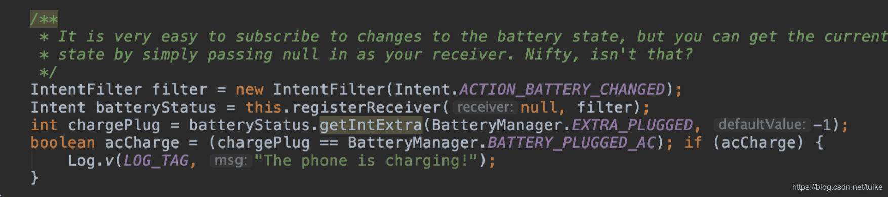
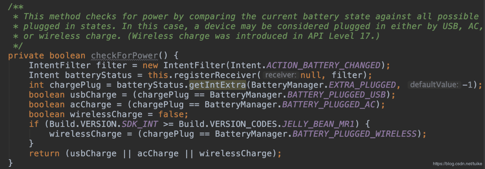
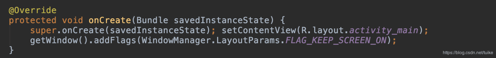
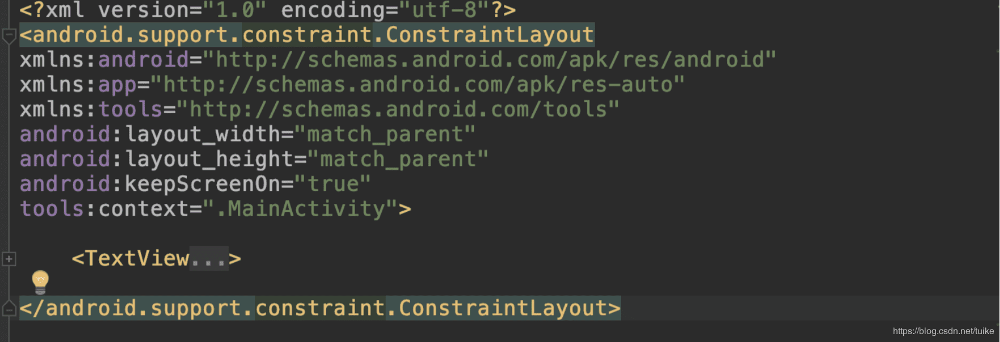
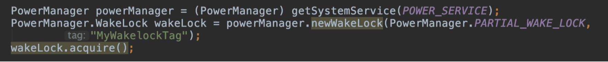
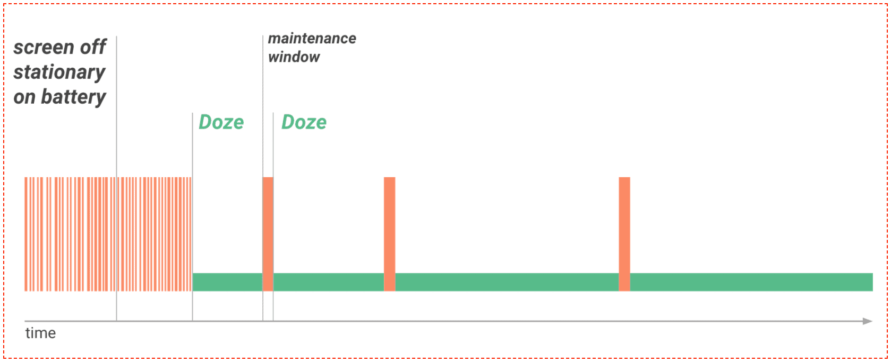

<h1 align="center">电量优化</h1>

[toc]


## 1. 耗电概述和分析工具

如何判断哪些耗电是可以避免，或者是需要去优化的呢？可以看下面这张图，当用户去看耗电排行榜的时候，发现“王者荣耀”使用了 7 个多小时，这时用户对“王者荣耀”的耗电是有预期的。


假设这个时候发现某个应用他根本没怎么使用（前台时间很少），但是耗电却非常多。这种情况会跟用户的预期差别很大，他可能就会想去投诉。

**所以耗电优化的第一个方向是优化应用的后台耗电。**

知道了系统是如何计算耗电的，那反过来看，我们也就可以知道应用在后台不应该做什么，例如长时间获取 WakeLock、WiFi 和蓝牙的扫描等。为什么说耗电优化第一个方向就是优化应用后台耗电，因为大部分厂商预装项目要求最严格的正是应用后台待机耗电。


当然前台耗电我们不会完全不管，但是标准会放松很多。再来看看下面这张图，如果系统对你的应用弹出这个对话框，可能对于微信来说，用户还可以忍受，但是对其他大多数的应用来说，可能很多用户就直接把你加入到后台限制的名单中了


**耗电优化的第二个方向是符合系统的规则，让系统认为你耗电是正常的。**

而 Android P 是通过 Android Vitals 监控后台耗电，所以我们需要符合 Android Vitals 的规则，目前它的具体规则如下：


虽然上面的标准可能随时会改变，但是可以看到，Android 系统目前比较关心后台 Alarm 唤醒、后台网络、后台 WiFi 扫描以及部分长时间 WakeLock 阻止系统后台休眠。

* [Bugreport详解](../Debug/BugReport.md)
* 在线分析工具battery-historian：[https://bathist.ef.lc/](https://bathist.ef.lc/)


## 2. 耗电优化

### 2.1 耗电因素

- 屏幕亮暗相关
- 设备 awake，sleep 的切换，尤其是唤醒。
- CPU 运行相关
- 网络
- 传感器

### 2.2 监听手机充电状态

我们可以通过下面的代码来获取手机的当前充电状态:

 得到充电状态信息之后，我们可以有针对性的对部分代码做优化。比如我们可以判断只有当前 手机为 AC 充电状态时 才去执行一些非常耗电的操作。可以通过下面的方法判断手机当前的充 电状态。



这里我们就需要思考，根据具体的业务，考虑将一些不需要及时地和用户交互的操作放到充电 的时候去做。比如：360 手机助手，当充上电的时候，才会自动清理手机垃圾，自动备份上传图片、联系人 等到云端，从而避免当用户手机低电量时，任然继续进行耗电操作。

### 2.3 屏幕唤醒

当 Android 设备空闲时，屏幕会变暗，然后关闭屏幕，最后会停止 CPU 的运行，这样可以防 止电池电量掉的快。但有些时候我们需要改变 Android 系统默认的这种状态:比如玩游戏时我 们需要保持屏幕常亮，比如一些下载操作不需要屏幕常亮但需要 CPU 一直运行直到任务完成。

保持屏幕常亮比较好的方式是在 Activity 中使用 FLAG_KEEP_SCREEN_ON 的 Flag。



这个方法的好处是不像唤醒锁(wake locks)，需要一些特定的权限(permission)。并且能 正确管理不同 app 之间的切换，不用担心无用资源的释放问题。

另一个方式是在布局文件中使用 android:keepScreenOn 属性:



android:keepScreenOn = “true”的作用和 FLAG_KEEP_SCREEN_ON 一样，使用代码的好 处是你允许你在需要的地方关闭屏幕。

注意:一般不需要人为的去掉 FLAG_KEEP_SCREEN_ON 的 flag，windowManager 会管理好程序进入 后台回到前台的的操作。如果确实需要手动清掉常亮的 flag，使用


所以这里我们需要根据自己的 APP 实际情况，根据业务来控制好是否保持屏幕常量。比如 APP 需要支持视频播放。那么在播放的界面需要控制好不熄屏，当退出播放时，当然就没有了 这个设置。

### 2.4 WakeLock

wake_lock 锁主要是相对系统的休眠而言的，意思就是程序给 CPU 加了这个锁那系统就不会 休眠了，这样做的目的是为了全力配合我们程序的运行。有的情况如果不这么做就会出现一些 问题。 需要使用 PowerManager 这个系统服务的唤醒锁(wake locks)特征来保持 CPU 处于唤醒状 态。唤醒锁允许程序控制宿主设备的电量状态，创建和持有唤醒锁对电池的续航有较大的影 响，所以，除非是真的需要唤醒锁完成尽可能短的时间在后台完成的任务时才使用它。比如在 Acitivity 中就没必要用了。如果需要关闭屏幕，使用上述的 FLAG_KEEP_SCREEN_ON。

只有一种合理的使用场景，使用后台服务在屏幕关闭情况下 hold 住 CPU 完成一些工作，需要 使用唤醒锁，如果不使用唤醒锁来执行后台服务，不能保证因 CPU 休眠未来的某个时刻任务 会停止，这不是我们想要的。

唤醒锁可划分并识别为四种用户唤醒锁:

| 标记值                  | CPU  | 屏幕 | 键盘 |
| :---------------------- | :--- | :--- | :--- |
| PARTIAL_WAKE_LOCK       | 开启 | 关闭 | 关闭 |
| SCREEN_DIM_WAKE_LOCK    | 开启 | 变暗 | 关闭 |
| SCREEN_BRIGHT_WAKE_LOCK | 开启 | 变亮 | 关闭 |
| FULL_WAKE_LOCK          | 开启 | 变亮 | 变亮 |

注意:自 API 等级 17 开始，FULL_WAKE_LOCK 将被弃用。 应用应使用 FLAG_KEEP_SCREEN_ON。

1.添加唤醒锁权限:


2.直接使用唤醒锁:



注意:在使用该类的时候，必须保证 acquire 和 release 是成对出现的。不然当我们业务已经不需要时， 当 CPU 处于唤醒状态，这个时候就会损耗多余的电量。

1）、**「注意成对使用 acquire、release」**。

2）、**「建议使用带参数的 acquire，避免没有及时释放而导致电量消耗过大」**。

3）、**「使用 finally 确保 release 一定会被调用」**。

4）、**「常亮场景使用 keepScreenOn 即可」**。

5）、**「WakeLock 有一个接口 setReferenceCounted，用来设置 WakeLock 的技术机制，官方默认为计数。true 为计数，false 为不计数。所谓计数即每一个 acquire 必须对应一个 release；不计数则是无论有多少个 acquire，一个 release 就可以释放。但是问题是有的第三方 ROM 它将默认设置为了不计数，以为我们需要在调用 newWakeLock 之后再调用 setReferenceCounted 为 false」**。

### 2.5 JobScheduler

自 Android 5.0 发布以来，JobScheduler 已成为执行后台工作的很好的方式，其工作方式有 利于用户在适当的时机执行正确的事情。应用可以在安排作业的同时允许系统基于内存、电源 和连接情况进行优化。JobSchedule 的宗旨就是把一些不是特别紧急的任务放到更合适的时机 批量处理。这样做有两个好处:

- 避免频繁的唤醒硬件模块，造成不必要的电量消耗。
- 避免在不合适的时间(例如低电量情况下、弱网络或者移动网络情况下的)执行过多的 任务消耗电量。

### 2.6 GPS

**选择合适的 Location Provider**

Android 系统支持多个 Location Provider:

- **GPS_PROVIDER:** GPS 定位，利用 GPS 芯片通过卫星获得自己的位置信息。定位精准度高，一般在 10 米左右， 耗电量大;但是在室内，GPS 定位基本没用。
- **NETWORK_PROVIDER:** 网络定位，利用手机基站和 WIFI 节点的地址来大致定位位置，这种定位方式取决于服务器， 即取决于将基站或 WIF 节点信息翻译成位置信息的服务器的能力。
- **PASSIVE_PROVIDER:** 被动定位，就是用现成的，当其他应用使用定位更新了定位信息，系统会保存下来，该应用接 收到消息后直接读取就可以了。

如果 App 只是需要一个粗略的定位那么就不需要使用 GPS 进行定位，既耗费电量，定位的耗 时也久。

**及时注销定位监听**

在获取到定位之后或者程序处于后台时，注销定位监听，此时监听 GPS 传感器相当于执行 no- op(无操作指令)，用户不会有感知但是却耗电。

**多模块使用定位尽量复**

多个模块使用定位，尽量复用上一次的结果，而不是都重新走定位的过程，节省电量损耗;例 如:在应用启动的时候获取一次定位，保存结果，之后再用到定位的地方都直接去取。

### 2.7 传感器

使用传感器，选择合适的采样率，越高的采样率类型则越费电。

- SENSOR_DELAY_NOMAL (200000 微秒)
- SENSOR_DELAY_UI (60000 微秒)
- SENSOR_DELAY_GAME (20000 微秒)
- SENSOR_DELAY_FASTEST (0 微秒)

在后台时注意及时注销传感器监听

### 2.8 Doze and App Standby

最后提这一点，理论上不是电量优化，而是做电量优化要注意的一个坑。Doze and App Standby 是 Android 6.0 以后，提供了两种省电延长电池寿命的功能。 具体可参考 google 官方介绍文档。

参考资料：[github.com/google/batt…](https://github.com/google/battery-historian#wakelock-analysis)

### 2.9 CPU 时间片

**「Android 手机保护 AP 和 BP 两个 CPU。AP 即 Application Processor，所有的用户界面以及 App 都是运行在 AP 上的。BP 即 Baseband Processor，手机射频都是运行在这个 CPU 上的。而一般我们所说的耗电，PowerProfile 文件里面的 CPU，指的是 AP」**。

CPU 耗电通常有两种情况：

- 1）、**「长期频繁唤醒：原本可以仅仅在 BP 上运行，消耗 5mA 左右，但是因为唤醒，AP 就会运作，不同手机情况不一样，至少会导致 20~30 mA 左右的耗电」**。
- 2）、**「CPU 长期高负荷：例如 App 退到后台的时候没有停止动画，或者程序有不退出的死循环等等，导致 CPU 满频、满核地跑」**。

常用优化 CPU 时间片的方式有：

- 1）、**「获取运行过程线程 CPU 消耗，定位 CPU 占用率异常方法」**。
- 2）、**「减少后台应用的主动运行」**。

### 2.10 网络相关

通常情况下，使用 WIFI 连接网络时的功耗要低于使用移动网络的功耗。而使用移动网络传输数据，电量的消耗有以下3种状态：

- **「Full power：高功率状态，移动网络连接被激活，允许设备以最大的传输速率进行操作」**。
- **「Low power：低功耗状态，对电量的消耗差不多是 Full power 状态下的 50%」**。
- **「Standby：空闲态，没有数据连接需要传输，电量消耗最少」**。

因此，为了避免网络连接所带来的电量消耗，我们可以采用如下几种方案：

- 1）、尽量在 WIFI 环境下进行数据传输，在使用 WIFI 传输数据时，应该尽可能增大每个包的大小（不超过 MTU），并降低发包的频率。
- 2）、在蜂窝移动网络下需要对请求时机及次数控制：可以延迟执行的网络请求稍后一起发送，最好做到批量执行，尽量避免频繁的间隔网络请求，以尽量多地保持在 Radio Standby 状态。
- 3）、使用 JSON 和 Protobuf 进行数据压缩，减少时间。
- 4）、禁止使用轮询功能：轮询会导致网络请求一直处于被激活的状态，耗电过高。

### 2.11 界面相关

- 1）、**「离开界面后停止相关活动，例如关闭动画」**。
- 2）、**「耗电操作判断前后台，如果是后台则不执行相关操作」**。

### 2.12 计算优化

**「浮点运算比整数运算更消耗 CPU 时间片，因此耗电也会增加」**。避开浮点运算的优化方法如下所示：

- 1）、**「除法变乘法」**。
- 2）、**「充分利用移位」**。
- 3）、**「在 native 层开发时，可以利用 ARM neon 指令集做并行运算，注意需要 ARM V7 及以上架构 CPU 才能支持」**。

### 2.13 灭屏时停止动画

**「我们可以监听灭屏以及亮屏的广播，在灭屏的时候停止 surfaceView 的动画绘制。在亮屏的时候，恢复动画的绘制」**。

## 3. 耗电监控

以后台耗电监控为主，必须监控的模块有：

- 1）、**「Alarm wakeup」**
- 2）、**「WakeLock」**
- 3）、**「WiFi scans」**
- 4）、**「Network」**

**「必须监控的现场信息有」** ：

- 1）、**「堆栈信息」**
- 2）、**「是否充电」**
- 3）、**「电量水平」**
- 4）、**「应用前后台时间」**
- 5）、**「CPU 状态信息」**

最后，我们需要 **「提炼规则，将监控内容 => 抽象成规则」**。

### 3.1 电量都监控什么

Android Vitals并不是那么好用，而且对于国内的应用来说其实也根本无法使用。不管怎样，我们还是需要搭建自己的耗电监控系统。

那我们的耗电监控系统应该监控哪些内容，怎么样才能比 Android Vitals 做得更好呢？

- **监控信息**。简单来说系统关心什么，我们就监控什么，而且应该以后台耗电监控为主。类似 Alarm wakeup、WakeLock、WiFi scans、Network 都是必须的，其他的可以根据应用的实际情况。如果是地图应用，后台获取 GPS 是被允许的；如果是计步器应用，后台获取 Sensor 也没有太大问题。
- **现场信息**。监控系统希望可以获得完整的堆栈信息，比如哪一行代码发起了 WiFi scans、哪一行代码申请了 WakeLock 等。还有当时手机是否在充电、手机的电量水平、应用前台和后台时间、CPU 状态等一些信息也可以帮助我们排查某些问题。
- **提炼规则**。最后我们需要将监控的内容抽象成规则，当然不同应用监控的事项或者参数都不太一样。 由于每个应用的具体情况都不太一样，下面是一些可以用来参考的简单规则。


在安卓绿色联盟的会议中，华为公开过他们后台资源使用的“红线”，你也可以参考里面的一些规则：


### 3.2 如何监控电量

#### 3.2.1 Java Hook

我们可以通过代理对应的 Service 实现，完成收集 Wakelock、Alarm、GPS 的申请堆栈、释放信息、手机充电状态等等。

[示例项目](https://github.com/simplezhli/Chapter19)

明确了我们需要监控什么以及具体的规则之后，就可以来到实现这个环节了。跟 I/O 监控、网络监控一样，我首先想到的还是 Hook 方案。

Hook 方案的好处在于使用者接入非常简单，不需要去修改自己的代码。下面我以几个比较常用的规则为例，看看如果使用 Java Hook 达到监控的目的。

- [WakeLock](https://developer.android.com/training/scheduling/wakelock)。WakeLock 用来阻止 CPU、屏幕甚至是键盘的休眠。类似 Alarm、JobService 也会申请 WakeLock 来完成后台 CPU 操作。WakeLock 的核心控制代码都在[PowerManagerService](http://androidxref.com/7.0.0_r1/xref/frameworks/base/services/core/java/com/android/server/power/PowerManagerService.java)中，实现的方法非常简单。

```java
// 代理 PowerManagerService
ProxyHook().proxyHook(context.getSystemService(Context.POWER_SERVICE), "mService", this)；

@Override
public void beforeInvoke(Method method, Object[] args) {
    // 申请 Wakelock
    if (method.getName().equals("acquireWakeLock")) {
        if (isAppBackground()) {
            // 应用后台逻辑，获取应用堆栈等等     
         } else {
            // 应用前台逻辑，获取应用堆栈等等
         }
    // 释放 Wakelock
    } else if (method.getName().equals("releaseWakeLock")) {
       // 释放的逻辑    
    }
}
```

- [Alarm](https://developer.android.com/training/scheduling/alarms)。Alarm 用来做一些定时的重复任务，它一共有四个类型，其中[ELAPSED_REALTIME_WAKEUP](https://developer.android.com/reference/android/app/AlarmManager.html#ELAPSED_REALTIME_WAKEUP)和[RTC_WAKEUP](https://developer.android.com/reference/android/app/AlarmManager.html#RTC_WAKEUP)类型都会唤醒设备。同样，Alarm 的核心控制逻辑都在[AlarmManagerService](http://androidxref.com/7.0.0_r1/xref/frameworks/base/services/core/java/com/android/server/AlarmManagerService.java)中，实现如下：

```java
// 代理 AlarmManagerService
new ProxyHook().proxyHook(context.getSystemService
(Context.ALARM_SERVICE), "mService", this)；

public void beforeInvoke(Method method, Object[] args) {
    // 设置 Alarm
    if (method.getName().equals("set")) {
        // 不同版本参数类型的适配，获取应用堆栈等等
    	// 清除 Alarm
    } else if (method.getName().equals("remove")) {
        // 清除的逻辑
    }
}
```

- 其他。对于后台 CPU，我们可以使用卡顿监控相关的方法。对于后台网络，同样我们可以通过网络监控相关的方法。对于 GPS 监控，我们可以通过 Hook 代理[LOCATION_SERVICE](http://androidxref.com/7.0.0_r1/xref/frameworks/base/services/core/java/com/android/server/LocationManagerService.java)。对于 Sensor，我们通过 Hook [SENSOR_SERVICE](http://androidxref.com/7.0.0_r1/xref/frameworks/base/core/java/android/hardware/SystemSensorManager.java)中的“mSensorListeners”，可以拿到部分信息。
- **通过 Hook，我们可以在申请资源的时候将堆栈信息保存起来。当我们触发某个规则上报问题的时候，可以将收集到的堆栈信息、电池是否充电、CPU 信息、应用前后台时间等辅助信息也一起带上。**

#### 3.2.2 插桩

虽然使用 Hook 非常简单，但是某些规则可能不太容易找到合适的 Hook 点。而且在 Android P 之后，很多的 Hook 点都不支持了。

出于兼容性考虑，我首先想到的是写一个基础类，然后在统一的调用接口中增加监控逻辑。以 WakeLock 为例：

```java
public class WakelockMetrics {
    // Wakelock 申请
    public void acquire(PowerManager.WakeLock wakelock) {
        wakeLock.acquire();
        // 在这里增加 Wakelock 申请监控逻辑
    }
    // Wakelock 释放
    public void release(PowerManager.WakeLock wakelock, int flags) {
        wakelock.release();
        // 在这里增加 Wakelock 释放监控逻辑
    }
}
```

Facebook 也有一个耗电监控的开源库Battery-Metrics，它监控的数据非常全，包括 Alarm、WakeLock、Camera、CPU、Network 等，而且也有收集电量充电状态、电量水平等信息。

Battery-Metrics 只是提供了一系列的基础类，在实际使用中，接入者可能需要修改大量的源码。但对于一些第三方 SDK 或者后续增加的代码，我们可能就不太能保证可以监控到了。这些场景也就无法监控了，所以 Facebook 内部是使用插桩来动态替换。

遗憾的是，Facebook 并没有开源它们内部的插桩具体实现方案。不过这实现起来其实并不困难，事实上在 [Sample](https://github.com/AndroidAdvanceWithGeektime/Chapter19) 中，已经使用过 ASM、Aspectj 这两种插桩方案了。

插桩方案使用起来兼容性非常好，并且使用者也没有太大的接入成本。但是它并不是完美无缺的，对于系统的代码插桩方案是无法替换的，例如 JobService 申请 PARTIAL_WAKE_LOCK 的场景。

##### 编译插装实例

**「写一个基础类，然后在统一的调用接口中添加监控逻辑」**。这里我们可以参考 `Facebook Battery-Metrics` 获取、监控数据的方式。其代码如下所示：

```java
public class WakelockMetrics {

    /**
     * 获取 WakeLock
     *
     * @param wakeLock WakeLock
     * @param timeout 超时时间
     */
    public static void acquire(PowerManager.WakeLock wakeLock, long timeout) {
        wakeLock.acquire(timeout);
        // 监控 wakelock 相关信息
        Log.e("HOOOOOOOOK", "--acquireWakeLock--");
        Log.e("HOOOOOOOOK", Utils.getStackTrace());
        // 使用 Battery-Metrics 库统计其它维度的电量信息
        
    }

    /**
     * 释放 WakeLock
     *
     * @param wakeLock WakeLock
     */
    public static void release(PowerManager.WakeLock wakeLock) {
        wakeLock.release();
        Log.e("HOOOOOOOOK", "--releaseWakeLock--");
        Log.e("HOOOOOOOOK", Utils.getStackTrace());
        // 使用 Battery-Metrics 库统计其它维度的电量信息
        
    }

}
```

Gradle 耗电量统计插件中 BatteryCreateMethodVisitor 的核心实现代码如下所示：

```java
@Override
public void visitMethodInsn(int opcode, String owner, String name, String descriptor, boolean isInterface) {
    // 监控 Wakelock
    String monitorClass = "com/ss/android/ugc/bytex/example/battery_monitor/WakelockMetrics";
    if (!monitorClass.equals(className)
            && "android/os/PowerManager$WakeLock".equals(owner)
            && opcode == Opcodes.INVOKEVIRTUAL
            && "acquire".equals(name)) {
        mv.visitMethodInsn(
                Opcodes.INVOKESTATIC,
                monitorClass,
                name,
                "(Landroid/os/PowerManager$WakeLock;J)V",
                isInterface
        );
        return;
    }
    if (!monitorClass.equals(className)
            && "android/os/PowerManager$WakeLock".equals(owner)
            && opcode == Opcodes.INVOKEVIRTUAL
            && "release".equals(name)) {
        mv.visitMethodInsn(
                Opcodes.INVOKESTATIC,
                monitorClass,
                name,
                "(Landroid/os/PowerManager$WakeLock;)V",
                isInterface
        );
        return;
    }
    // 监控 Gps
    monitorClass = "com/ss/android/ugc/bytex/example/battery_monitor/GpsMetrics";
    if (!monitorClass.equals(className)
            && "android/location/LocationManager".equals(owner)
            && opcode == Opcodes.INVOKEVIRTUAL
            && "requestLocationUpdates".equals(name)) {
        mv.visitMethodInsn(
                Opcodes.INVOKESTATIC,
                monitorClass,
                name,
                "(Landroid/location/LocationManager;Ljava/lang/String;JFLandroid/location/LocationListener;)V",
                isInterface
        );
        return;
    }
    if (!monitorClass.equals(className)
            && "android/location/LocationManager".equals(owner)
            && opcode == Opcodes.INVOKEVIRTUAL
            && "removeUpdates".equals(name)) {
        mv.visitMethodInsn(
                Opcodes.INVOKESTATIC,
                monitorClass,
                name,
                "(Landroid/location/LocationManager;Landroid/location/LocationListener;)V",
                isInterface
        );
        return;
    }
    // 监控 Alarm Service
    monitorClass = "com/ss/android/ugc/bytex/example/battery_monitor/AlarmMetrics";
    if (!monitorClass.equals(className)
            && "android/app/AlarmManager".equals(owner)
            && opcode == Opcodes.INVOKEVIRTUAL
            && "set".equals(name)) {
        mv.visitMethodInsn(
                Opcodes.INVOKESTATIC,
                monitorClass,
                name,
                "(Landroid/app/AlarmManager;IJLandroid/app/PendingIntent;)V",
                isInterface
        );
        return;
    }
    if (!monitorClass.equals(className)
            && "android/app/AlarmManager".equals(owner)
            && opcode == Opcodes.INVOKEVIRTUAL
            && "cancel".equals(name)) {
        mv.visitMethodInsn(
                Opcodes.INVOKESTATIC,
                monitorClass,
                name,
                "(Landroid/app/AlarmManager;Landroid/app/PendingIntent;)V",
                isInterface
        );
        return;
    }
    super.visitMethodInsn(opcode, owner, name, descriptor, isInterface);
}
```

### 3.3 电量辅助监控实战

#### 3.3.1 获取运行时能耗文件

- 1）、adb pull /system/framework/framework-res.apk
- 2）、反编译，xml—》power_profile

#### 3.3.2 电量辅助监控

线下使用 epic 进行 AOP 电量辅助统计

这里我们就以 WakeLock 的监控为例，切面代码如下所示：

```java
public static long sStartTime = 0;
@Insert(value = "acquire")
@TargetClass(value = "com.optimize.performance.wakelock.WakeLockUtils",scope = Scope.SELF)
public static void acquire(Context context){
    trace = Log.getStackTraceString(new Throwable());
    sStartTime = System.currentTimeMillis();
    Origin.callVoid();
    new Handler().postDelayed(new Runnable() {
        @Override
        public void run() {
            WakeLockUtils.release();
        }
    },1000);
}
@Insert(value = "release")
@TargetClass(value = "com.optimize.performance.wakelock.WakeLockUtils",scope = Scope.SELF)
public static void release(){
    LogUtils.i("PowerManager "+(System.currentTimeMillis() - sStartTime)+"/n"+trace);
```

此外，我们也可以利用 epic 来监控每个线程的执行时间，超过阈值则警告，示例代码如下所示：

```java
public static long runTime = 0;
@Insert(value = "run")
@TargetClass(value = "java.lang.Runnable",scope = Scope.ALL)
public void run(){
    runTime = System.currentTimeMillis();
    Origin.callVoid();
    LogUtils.i("runTime "+(System.currentTimeMillis() - runTime));
}
```

### 3.4 Android Vitals

Android Vitals 的几个关于电量的监控方案与规则：

- [Alarm Manager wakeup 唤醒过多](https://developer.android.com/topic/performance/vitals/wakeup)
- [频繁使用局部唤醒锁](https://developer.android.google.cn/topic/performance/vitals/wakelock)
- [后台网络使用量过高](https://developer.android.com/topic/performance/vitals/bg-network-usage)
- [后台 WiFi scans 过多](https://developer.android.com/topic/performance/vitals/bg-wifi)

在使用了一段时间之后，我发现它并不是那么好用。以 Alarm wakeup 为例，Vitals 以每小时超过 10 次作为规则。由于这个规则无法做修改，很多时候我们可能希望针对不同的系统版本做更加细致的区分。

其次跟 Battery Historian 一样，我们只能拿到 wakeup 的标记的组件，拿不到申请的堆栈，也拿不到当时手机是否在充电、剩余电量等信息。


对于网络、WiFi scans 以及 WakeLock 也是如此。虽然 Vitals 帮助我们缩小了排查的范围，但是依然需要在茫茫的代码中寻找对应的可疑代码。

## 4. 针对低电耗模式和应用待机模式进行优化

从 Android 6.0（API 级别 23）开始，Android 引入了两项省电功能，通过管理应用在设备未连接至电源时的行为方式，帮助用户延长电池寿命。当用户长时间未使用设备时，低电耗模式会延迟应用的后台 CPU 和网络活动，从而降低耗电量。应用待机模式会延迟用户近期未与之交互的应用的后台网络活动。

当设备处于低电耗模式时，应用对某些高耗电量资源的访问会延迟到维护期。[电源管理限制](https://developer.android.com/topic/performance/power/power-details?hl=zh-cn)中列出了具体的限制。

低电耗模式和应用待机模式管理在 Android 6.0 或更高版本上运行的所有应用的行为，无论它们是否专用于 API 级别 23。为确保用户获得最佳体验，请在低电耗模式和应用待机模式下测试您的应用，并对您的代码进行必要的调整。下面几部分提供了详细信息。

### 4.1 了解低电耗模式

如果用户未插接设备的电源，在屏幕关闭的情况下，让设备在一段时间内保持不活动状态，那么设备就会进入低电耗模式。在低电耗模式下，系统会尝试通过限制应用访问占用大量网络和 CPU 资源的服务来节省电量。它还会阻止应用访问网络，并延迟其作业、同步和标准闹钟。

系统会定期退出低电耗模式一小段时间，让应用完成其延迟的活动。在此维护期内，系统会运行所有待处理的同步、作业和闹钟，并允许应用访问网络。



**图 1.** 低电耗模式提供了周期性维护期，让应用使用网络并处理待处理的活动。

在每个维护期结束时，系统会再次进入低电耗模式，暂停网络访问并推迟作业、同步和闹钟。随着时间的推移，系统安排维护期的次数越来越少，这有助于在设备未连接至充电器的情况下长期处于不活动状态时降低耗电量。

一旦用户通过移动设备、打开屏幕或连接至充电器唤醒设备，系统就会立即退出低电耗模式，并且所有应用都会恢复正常活动。

#### 4.1.1 低电耗模式限制

在低电耗模式下，您的应用会受到以下限制：

- 暂停访问网络。
- 系统忽略[唤醒锁定](https://developer.android.com/reference/android/os/PowerManager.WakeLock?hl=zh-cn)。
- 标准 `AlarmManager` 闹钟（包括 `setExact()` 和 `setWindow()`）推迟到下一个维护期。
- - 如果您需要设置在设备处于低电耗模式时触发的闹钟，请使用 `setAndAllowWhileIdle()` 或 `setExactAndAllowWhileIdle()`。
   - 使用 `setAlarmClock()` 设置的闹钟将继续正常触发，系统会在这些闹钟触发之前不久退出低电耗模式。
- 系统不执行 WLAN 扫描。
- 系统不允许运行[同步适配器](https://developer.android.com/reference/android/content/AbstractThreadedSyncAdapter?hl=zh-cn)。
- 系统不允许运行 `JobScheduler`。

#### 4.1.2 低电耗模式核对清单

1. - 如果可能，请使用 FCM 进行[下游消息传递](https://firebase.google.com/docs/cloud-messaging/downstream?hl=zh-cn)。
   - 如果您的用户必须立即看到通知，请务必使用 [FCM 高优先级消息](https://firebase.google.com/docs/cloud-messaging/concept-options?hl=zh-cn#setting-the-priority-of-a-message)。
   - 在初始[消息负载](https://firebase.google.com/docs/cloud-messaging/concept-options?hl=zh-cn#notifications_and_data_messages)中提供足够的信息，这样随后就无需访问网络。
   - 使用 `setAndAllowWhileIdle()` 和 `setExactAndAllowWhileIdle()` 设置重要闹钟。
   - [在低电耗模式下测试您的应用。](https://developer.android.com/training/monitoring-device-state/doze-standby?hl=zh-cn#testing_doze)

#### 4.1.3 使应用适应低电耗模式

低电耗模式可能会对应用产生不同的影响，具体取决于应用提供的功能和使用的服务。许多应用无需修改即可在低电耗模式周期内正常运行。在某些情况下，您必须优化应用管理网络、闹钟、作业和同步的方式。应用应该能够在每个维护期内高效地管理活动。

低电耗模式尤其可能会影响 `AlarmManager` 闹钟和定时器管理的活动，因为当系统处于低电耗模式时，不会触发 Android 5.1（API 级别 22）或更低版本中的闹钟。

为了帮助安排闹钟，Android 6.0（API 级别 23）引入了两种新的 `AlarmManager` 方法：`setAndAllowWhileIdle()` 和 `setExactAndAllowWhileIdle()`。通过这些方法，您可以设置即使设备处于低电耗模式也会触发的闹钟。

**注意**：`setAndAllowWhileIdle()` 及 `setExactAndAllowWhileIdle()` 为每个应用触发闹钟的频率都不能超过每 9 分钟一次。

低电耗模式对网络访问的限制也有可能影响应用，特别是当应用依赖于操作消息或通知等实时消息时更是如此。如果应用需要与网络建立持久性连接来接收消息，您应尽可能使用 [Firebase 云消息传递 (FCM)](https://developer.android.com/training/monitoring-device-state/doze-standby?hl=zh-cn#using_fcm)。

要确认应用在低电耗模式下的行为方式符合预期，您可以使用 adb 命令强制系统进入和退出低电耗模式并观察应用的行为。如需了解详情，请参阅[在低电耗模式和应用待机模式下进行测试](https://developer.android.com/training/monitoring-device-state/doze-standby?hl=zh-cn#testing_doze_and_app_standby)。

### 4.2了解应用待机模式

应用待机模式允许系统判定应用在用户未主动使用它时是否处于闲置状态。当用户有一段时间未触摸应用时，系统便会作出此判定，以下条件均不适用：

- 用户明确启动应用。

- 应用当前有一个进程在前台运行（作为活动或前台服务，或者正在由其他活动或前台服务使用）。

   **注意**：您只能将[前台服务](https://developer.android.com/guide/components/services?hl=zh-cn#Foreground)用于用户希望系统立即执行或不中断的任务。 此类情况包括将照片上传到社交媒体，或者即使在音乐播放器应用不在前台运行时也能播放音乐。您不应该只是为了阻止系统判定您的应用处于闲置状态而启动前台服务。

- 应用生成用户可在锁定屏幕或通知栏中看到的通知。

- 应用是正在使用中的设备管理应用（例如[设备政策控制器](https://developer.android.com/work/dpc/build-dpc?hl=zh-cn)）。虽然设备管理应用通常在后台运行，但永远不会进入应用待机模式，因为它们必须保持可用性，以便随时从服务器接收策略。

当用户将设备插入电源时，系统会从待机状态释放应用，允许它们自由访问网络并执行任何待处理的作业和同步。如果设备长时间处于闲置状态，系统将允许闲置应用访问网络，频率大约每天一次。

### 4.3 在设备处于闲置状态时使用 FCM 与您的应用互动

[Firebase 云消息传递 (FCM)](https://firebase.google.com/docs/cloud-messaging?hl=zh-cn) 是一项云端至设备服务，可让您支持后端服务与 Android 设备上的应用之间的实时下游消息传递。FCM 提供了一个到云的持久性连接，所有需要实时消息传递的应用均可共享此连接。此共享连接使多个应用不必保有自己的独立持久性连接，也就避免了快速耗尽电池电量，从而显著优化耗电情况。因此，如果您的应用需要与后端服务进行消息传递集成，我们强烈建议您**尽可能使用 FCM**，而不是保有自己的持久性网络连接。

FCM 经过优化，可通过[高优先级 FCM 消息](https://firebase.google.com/docs/cloud-messaging/concept-options?hl=zh-cn#setting-the-priority-of-a-message)来支持低电耗模式和应用待机闲置模式。利用高优先级 FCM 消息，您可以可靠地唤醒应用以访问网络，即使用户的设备处于低电耗模式或应用处于应用待机模式也不例外。在低电耗模式或应用待机模式下，系统将传递消息并允许应用临时访问网络服务和部分唤醒锁定，然后将设备或应用恢复到闲置状态。

高优先级 FCM 消息不会影响低电耗模式，也不会影响任何其他应用的状态。这意味着您的应用可以使用这些消息来高效地通信，同时尽可能减小对整个系统和设备的电池影响。

作为一项常规最佳做法，如果您的应用需要下游消息传递，那么应使用 FCM。如果您的服务器和客户端已经在使用 FCM，请确保您的服务对关键消息使用高优先级消息，因为即使设备处于低电耗模式，这也会可靠地唤醒应用。

### 4.4 对其他用例的支持

通过妥善管理网络连接、闹钟、作业和同步以及使用高优先级 FCM 消息，几乎所有应用都应该能够支持低电耗模式。对于一小部分用例，这可能还不够。对于此类用例，系统提供了一个可配置的白名单，将**部分免除**低电耗模式和应用待机模式优化的应用列入其中。

在低电耗模式和应用待机模式期间，列入白名单的应用可以使用网络并保留[部分唤醒锁定](https://developer.android.com/reference/android/os/PowerManager?hl=zh-cn#PARTIAL_WAKE_LOCK)。不过，列入白名单的应用**仍会受到其他限制**，就像其他应用一样。例如，列入白名单的应用的作业和同步会延迟（在搭载 API 级别 23 及更低级别的设备上），并且其常规 `AlarmManager` 闹钟不会触发。应用可以调用 `isIgnoringBatteryOptimizations()` 来检查它当前是否在豁免白名单中。

用户可以依次转到**设置 > 电池 > 电池优化**来手动配置该白名单。另外，系统也提供了一些方法，让应用要求用户将其列入白名单。

- 应用可以触发 `ACTION_IGNORE_BATTERY_OPTIMIZATION_SETTINGS` Intent，让用户直接转到**电池优化**，以便他们在其中添加该应用。
- 具有 `REQUEST_IGNORE_BATTERY_OPTIMIZATIONS` 权限的应用可以触发一个系统对话框，让用户直接将该应用添加到白名单，而无需转到“设置”。此类应用将通过触发 `ACTION_REQUEST_IGNORE_BATTERY_OPTIMIZATIONS` Intent 来触发该对话框。
- 用户可以根据需要从白名单中手动移除应用。

在要求用户将您的应用添加到白名单之前，请确保该应用符合列入白名单的[可接受用例](https://developer.android.com/training/monitoring-device-state/doze-standby?hl=zh-cn#whitelisting-cases)。

**注意**：除非应用的核心功能受到不利影响，否则 Google Play 政策禁止应用请求直接免除 Android 6.0 及更高版本中的电源管理功能（低电耗模式和应用待机模式）的制约。

### 4.5 在低电耗模式和应用待机模式下进行测试

为确保用户获得良好的体验，您应在低电耗模式和应用待机模式下全面测试您的应用。

#### 4.5.1 在低电耗模式下测试您的应用

您可以按以下步骤在低电耗模式下测试您的应用：

1. 使用 Android 6.0（API 级别 23）或更高版本的系统映像配置硬件设备或虚拟设备。

2. 将设备连接到开发计算机并安装您的应用。

3. 运行您的应用并使其保持活动状态。

4. 运行以下命令，强制系统进入闲置模式：

   ```
   $ adb shell dumpsys deviceidle force-idle
   ```
   
5. 准备就绪后，运行以下命令，使系统退出闲置模式：

   ```
   $ adb shell dumpsys deviceidle unforce
   ```
   
6. 执行以下命令，重新激活设备：

   ```
   $ adb shell dumpsys battery reset
   ```
   
7. 在重新激活设备后观察应用的行为。确保应用在设备退出低电耗模式时正常恢复。

#### 4.5.2 在应用待机模式下测试您的应用

如需在应用待机模式下测试您的应用，请执行以下操作：

1. 使用 Android 6.0（API 级别 23）或更高版本的系统映像配置硬件设备或虚拟设备。

2. 将设备连接到开发计算机并安装您的应用。

3. 运行您的应用并使其保持活动状态。

4. 运行以下命令，强制应用进入应用待机模式：

   ```
   $ adb shell dumpsys battery unplug
   $ adb shell am set-inactive <packageName> true
   ```

5. 使用以下命令模拟唤醒您的应用：

   ```
   $ adb shell am set-inactive <packageName> false
   $ adb shell am get-inactive <packageName>
   ```

6. 在唤醒应用后观察它的行为。确保应用从待机模式正常恢复。您应特别检查应用的通知和后台作业是否继续按预期运行。

### 4.6 列入白名单的可接受用例

下表重点介绍了请求将应用列入电池优化豁免白名单或应用目前在该白名单中的可接受用例。一般来说，除非低电耗模式或应用待机模式破坏了应用的核心功能，或者由于技术方面的原因而导致您的应用无法使用高优先级 FCM 消息，否则您的应用不应在白名单中。

如需了解详情，请参阅[对其他用例的支持](https://developer.android.com/training/monitoring-device-state/doze-standby?hl=zh-cn#support_for_other_use_cases)。

| 类型                                                         | 用例                                                         | 是否可以使用 FCM？ | 是否可接受列入白名单？ | 备注                                        |
| :----------------------------------------------------------- | :----------------------------------------------------------- | :----------------- | :--------------------- | :------------------------------------------ |
| 即时通讯、聊天或通话应用。                                   | 当设备处于低电耗模式或应用处于应用待机模式时，需要将实时消息传递给用户。 | 是，使用 FCM       | 不可接受               | 应使用高优先级 FCM 消息唤醒应用并访问网络。 |
| 是，但不使用高优先级 FCM 消息。                              |                                                              |                    |                        |                                             |
| 即时通讯、聊天或通话应用；企业 VOIP 应用。                   | 否，不能使用 FCM，因为在技术上依赖其他消息传递服务，或者低电耗模式和应用待机模式破坏了应用的核心功能。 | 可接受             |                        |                                             |
| 任务自动化应用                                               | 应用的核心功能是安排自动化操作，例如即时通讯、语音通话或新照片管理。 | 如果适用。         | 可接受                 |                                             |
| 外围设备配套应用                                             | 应用的核心功能是保持与外围设备的持久性连接，以使外围设备能够接入互联网。 | 如果适用。         | 可接受                 |                                             |
| 应用只需定期连接到外围设备进行同步，或者只需连接到通过标准蓝牙配置文件连接的设备，如无线耳机。 | 如果适用。                                                   | 不可接受           |                        |                                             |

## 参考

* [Android电量优化全解析](https://juejin.im/post/6844903779268034574)
* [深入探索 Android 电量优化](https://juejin.im/post/6844904195523346439)
* [Android 电量测试以及电量优化](https://www.cnblogs.com/CharlesGrant/p/9284181.html)
* [针对低电耗模式和应用待机模式进行优化](https://developer.android.com/training/monitoring-device-state/doze-standby?hl=zh-cn)

