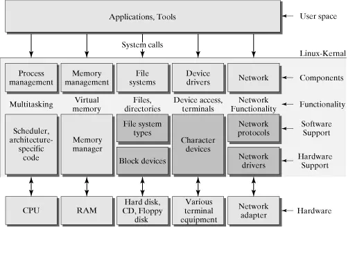

<h1 align="center">mmap + native 日志优化</h1>

[toc]

## 1. 当前遇到的问题

之前公司使用的日志框架是基于java层的IO系统开发的日志模块，主要实现方式分两类，一类是在特定的业务节点上，使用对应的输出流进行客户动作的记录。这就导致了，需要进行频繁的IO操作。另一类是用户需要频繁执行操作的页面，会将客户动作以流程的形式保存在内存中，如果用户长时间停留会造成内存大量使用，然后在合适的时机将内存里的日志写入到文件系统中（flush），如果在 flush 之前用户强杀了进程，那么内存里的内容会因此而丢失。

日志实时写入文件可以保证日志的完整性，但是写文件是 IO 操作，涉及到用户态与内核态的切换，而且这种开销是开启线程都无法避免的，也就是说即使开启一个新线程实时写入也是相对耗时的。

所以要优化的话，需要先了解文件读取和写入的流程。

## 2. 优化

从宏观上来看，Linux操作系统的体系架构分为用户态和内核态（或者用户空间和内核）。内核从本质上看是一种软件——控制计算机的硬件资源，并提供上层应用程序运行的环境。用户态即上层应用程序的活动空间，应用程序的执行必须依托于内核提供的资源，包括CPU资源、存储资源、I/O资源等。为了使上层应用能够访问到这些资源，内核必须为上层应用提供访问的接口：即系统调用。

下面这张图可以展示一个大概的流程：

主要表现为：向下控制硬件资源，向内管理操作系统资源：包括进程的调度和管理、内存的管理、文件系统的管理、设备驱动程序的管理以及网络资源的管理，向上则向应用程序提供系统调用的接口。从整体上来看，整个操作系统分为两层：用户态和内核态。

很多程序开始时运行于用户态，但在执行的过程中，一些操作需要在内核权限下才能执行，这就涉及到一个从用户态切换到内核态的过程。比如C函数库中的内存分配函数malloc()，它具体是使用sbrk()系统调用来分配内存，当malloc调用sbrk()的时候就涉及一次从用户态到内核态的切换，类似的函数还有printf()，调用的是wirte()系统调用来输出字符串，等等。

到底在什么情况下会发生从用户态到内核态的切换，一般存在以下三种情况：

1）当然就是系统调用：原因如上的分析。

2）异常事件： 当CPU正在执行运行在用户态的程序时，突然发生某些预先不可知的异常事件，这个时候就会触发从当前用户态执行的进程转向内核态执行相关的异常事件，典型的如缺页异常。

3）外围设备的中断：当外围设备完成用户的请求操作后，会像CPU发出中断信号，此时，CPU就会暂停执行下一条即将要执行的指令，转而去执行中断信号对应的处理程序，如果先前执行的指令是在用户态下，则自然就发生从用户态到内核态的转换。

总之要减少读写文件的次数，类比线程上下文的切换所带来的开销。那么，如何才能既减少读写文件次数，又防止断电造成内存数据丢失。

## 3. 案例

微信开源的 mars 框架中的 xlog 模块是基于 mmap 特性实现的，使用 mmap 文件映射内存作为缓存，可以在不牺牲性能的前提下最大化的保证日志的完整性。日志首先会写入到 mmap 文件映射内存中，基于 mmap 的特性，即使用户强杀了进程，日志文件也不会丢失，并且会在下次初始化的时候回写到日志文件中。

## 4. mmap

mmap是一种内存映射文件的方法，即将一个文件或者其它对象映射到进程的地址空间，实现文件磁盘地址和进程虚拟地址空间中一段虚拟地址的一一对映关系。实现这样的映射关系后，进程就可以采用指针的方式读写操作这一段内存，而系统会自动回写脏页面到对应的文件磁盘上，即完成了对文件的操作而不必再调用read,write等系统调用函数。相反，内核空间对这段区域的修改也直接反映用户空间，从而可以实现不同进程间的文件共享。

mmap内存映射的实现过程，总的来说可以分为三个阶段：

（一）进程启动映射过程，并在虚拟地址空间中为映射创建虚拟映射区域

进程在用户空间调用库函数mmap，原型：void *mmap(void *start, size_t length, int prot, int flags, int fd, off_t offset);

（二）调用内核空间的系统调用函数mmap（不同于用户空间函数），实现文件物理地址和进程虚拟地址的一一映射关系

（三）进程发起对这片映射空间的访问，引发缺页异常，实现文件内容到物理内存（主存）的拷贝

注：前两个阶段仅在于创建虚拟区间并完成地址映射，但是并没有将任何文件数据的拷贝至主存。真正的文件读取是当进程发起读或写操作时。

进程的读或写操作访问虚拟地址空间这一段映射地址，通过查询页表，发现这一段地址并不在物理页面上。因为目前只建立了地址映射，真正的硬盘数据还没有拷贝到内存中，因此引发缺页异常。

注：修改过的脏页面并不会立即更新回文件中，而是有一段时间的延迟，可以调用msync()来强制同步, 这样所写的内容就能立即保存到文件里了。

## 5. mmap和常规文件操作的区别

常规文件系统操作（调用read/fread等类函数）中，函数的调用过程：

1、进程发起读文件请求。

2、内核通过查找进程文件符表，定位到内核已打开文件集上的文件信息，从而找到此文件的inode。

3、inode在address_space上查找要请求的文件页是否已经缓存在页缓存中。如果存在，则直接返回这片文件页的内容。

4、如果不存在，则通过inode定位到文件磁盘地址，将数据从磁盘复制到页缓存。之后再次发起读页面过程，进而将页缓存中的数据发给用户进程。

总结来说，常规文件操作为了提高读写效率和保护磁盘，使用了页缓存机制。这样造成读文件时需要先将文件页从磁盘拷贝到页缓存中，由于页缓存处在内核空间，不能被用户进程直接寻址，所以还需要将页缓存中数据页再次拷贝到内存对应的用户空间中。这样，通过了两次数据拷贝过程，才能完成进程对文件内容的获取任务。写操作也是一样，待写入的buffer在内核空间不能直接访问，必须要先拷贝至内核空间对应的主存，再写回磁盘中（延迟写回），也是需要两次数据拷贝。

使用mmap操作文件中，创建新的虚拟内存区域和建立文件磁盘地址和虚拟内存区域映射这两步，没有任何文件拷贝操作。而之后访问数据时发现内存中并无数据而发起的缺页异常过程，可以通过已经建立好的映射关系，只使用一次数据拷贝，就从磁盘中将数据传入内存的用户空间中，供进程使用。

总而言之，常规文件操作需要从磁盘到页缓存再到用户主存的两次数据拷贝。而mmap操控文件，只需要从磁盘到用户主存的一次数据拷贝过程。说白了，mmap的关键点是实现了用户空间和内核空间的数据直接交互而省去了空间不同数据不通的繁琐过程。因此mmap效率更高。

## 6. mmap优点总结

1、对文件的读取操作跨过了页缓存，减少了数据的拷贝次数，用内存读写取代I/O读写，提高了文件读取效率。

2、实现了用户空间和内核空间的高效交互方式。两空间的各自修改操作可以直接反映在映射的区域内，从而被对方空间及时捕捉。

3、提供进程间共享内存及相互通信的方式。不管是父子进程还是无亲缘关系的进程，都可以将自身用户空间映射到同一个文件或匿名映射到同一片区域。从而通过各自对映射区域的改动，达到进程间通信和进程间共享的目的。

同时，如果进程A和进程B都映射了区域C，当A第一次读取C时通过缺页从磁盘复制文件页到内存中；但当B再读C的相同页面时，虽然也会产生缺页异常，但是不再需要从磁盘中复制文件过来，而可直接使用已经保存在内存中的文件数据。

4、可用于实现高效的大规模数据传输。内存空间不足，是制约大数据操作的一个方面，解决方案往往是借助硬盘空间协助操作，补充内存的不足。但是进一步会造成大量的文件I/O操作，极大影响效率。这个问题可以通过mmap映射很好的解决。换句话说，但凡是需要用磁盘空间代替内存的时候，mmap都可以发挥其功效。

## 7. mmap使用细节

1、使用mmap需要注意的一个关键点是，mmap映射区域大小必须是物理页大小(page_size)的整倍数（32位系统中通常是4k字节）。原因是，内存的最小粒度是页，而进程虚拟地址空间和内存的映射也是以页为单位。为了匹配内存的操作，mmap从磁盘到虚拟地址空间的映射也必须是页。

2、内核可以跟踪被内存映射的底层对象（文件）的大小，进程可以合法的访问在当前文件大小以内又在内存映射区以内的那些字节。也就是说，如果文件的大小一直在扩张，只要在映射区域范围内的数据，进程都可以合法得到，这和映射建立时文件的大小无关。具体情形参见“情形三”。

3、映射建立之后，即使文件关闭，映射依然存在。因为映射的是磁盘的地址，不是文件本身，和文件句柄无关。同时可用于进程间通信的有效地址空间不完全受限于被映射文件的大小，因为是按页映射。

在上面的知识前提下，我们下面看看如果大小不是页的整倍数的具体情况：

情形一：一个文件的大小是5000字节，mmap函数从一个文件的起始位置开始，映射5000字节到虚拟内存中。

分析：因为单位物理页面的大小是4096字节，虽然被映射的文件只有5000字节，但是对应到进程虚拟地址区域的大小需要满足整页大小，因此mmap函数执行后，实际映射到虚拟内存区域8192个 字节，5000~8191的字节部分用零填充。

此时：

（1）读/写前5000个字节（0~4999），会返回操作文件内容。

（2）读字节5000~8191时，结果全为0。写5000~8191时，进程不会报错，但是所写的内容不会写入原文件中 。

（3）读/写8192以外的磁盘部分，会返回一个SIGSECV错误。

情形二：一个文件的大小是5000字节，mmap函数从一个文件的起始位置开始，映射15000字节到虚拟内存中，即映射大小超过了原始文件的大小。

分析：由于文件的大小是5000字节，和情形一一样，其对应的两个物理页。那么这两个物理页都是合法可以读写的，只是超出5000的部分不会体现在原文件中。由于程序要求映射15000字节，而文件只占两个物理页，因此8192字节~15000字节都不能读写，操作时会返回异常。

此时：

（1）进程可以正常读/写被映射的前5000字节(0~4999)，写操作的改动会在一定时间后反映在原文件中。

（2）对于5000~8191字节，进程可以进行读写过程，不会报错。但是内容在写入前均为0，另外，写入后不会反映在文件中。

（3）对于8192~14999字节，进程不能对其进行读写，会报SIGBUS错误。

（4）对于15000以外的字节，进程不能对其读写，会引发SIGSEGV错误。

情形三：一个文件初始大小为0，使用mmap操作映射了1000*4K的大小，即1000个物理页大约4M字节空间，mmap返回指针ptr。

分析：如果在映射建立之初，就对文件进行读写操作，由于文件大小为0，并没有合法的物理页对应，如同情形二一样，会返回SIGBUS错误。

但是如果，每次操作ptr读写前，先增加文件的大小，那么ptr在文件大小内部的操作就是合法的。例如，文件扩充4096字节，ptr就能操作ptr ~ [ (char)ptr + 4095]的空间。只要文件扩充的范围在1000个物理页（映射范围）内，ptr都可以对应操作相同的大小。

这样，方便随时扩充文件空间，随时写入文件，不造成空间浪费。

## 参考

* https://juejin.cn/post/6844903999729041421