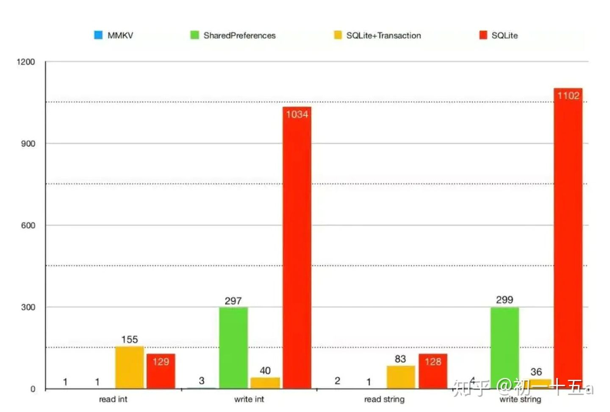
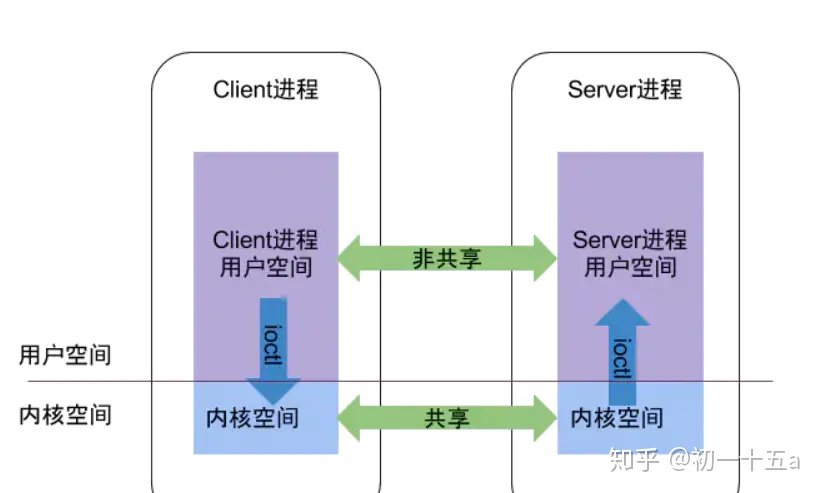
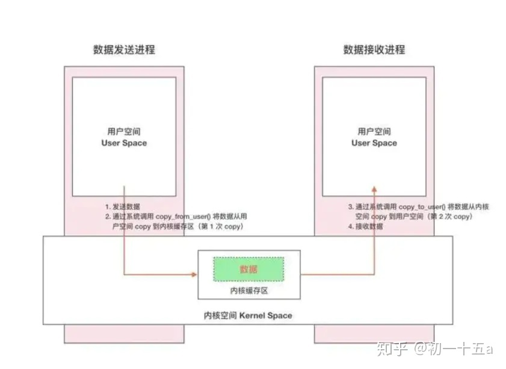
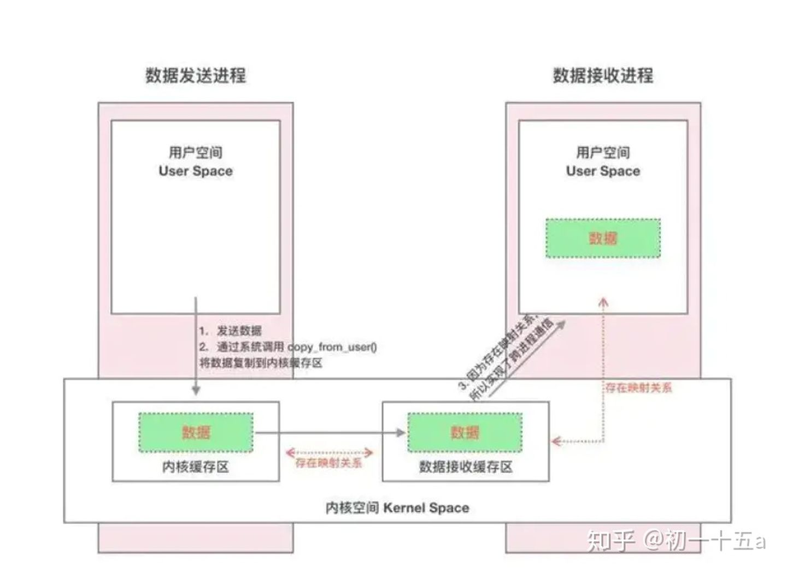

<h1 align="center">IO优化，使用 SharedPreferences卡顿，mmkv原理</h1>

[toc]

**面试官: IO优化是怎么做的，使用 SharedPreferences为什么这么卡，mmkv原理是什么**

**心理分析**：IO优化一直是每个企业必选项，每次闻到都很头疼，面试官想问有没有相关经验，如果有的话，只有两种答案sqlitedatabse， SharedPreferences。 这两个很常见，肯定不是面试官想问的。 那只有一种答案了，对，就是最新的mmkv框架

接下来，会问你他的原理 你是怎么看。 它的优缺点。为什么比其他的好。从原理层来解析。这才是最难的。

这篇文章 从原理层说明他们的区别

## 1 MMKV的概念

mkkv是基于 **mmap 的高性能通用** **key-value** 组件，底层序列化/反序列化使用 protobuf 实现，性能高，稳定性强。

> mmkv [github](https://link.zhihu.com/?target=https%3A//links.jianshu.com/go%3Fto%3Dhttps%3A%2F%2Fgithub.com%2FTencent%2FMMKV%2Fblob%2Fmaster%2Freadme_cn.md)下载地址

1. MMKV 是基于 mmap 内存映射的移动端通用 key-value 组件，底层序列化/反序列化使用 protobuf 实现，性能高，稳定性强。
2. 从 2015 年中至今，在Android 微信上使用已有近 3 年，其性能和稳定性经过了时间的验证。在腾讯内部开源半年之后，得到公司内部团队的广泛应用和一致好评。
3. 通过 mmap 内存映射文件，提供一段可供随时写入的内存块，App 只管往里面写数据，
   由操作系统负责将内存回写到文件，不必担心 crash 导致数据丢失。
4. XML、JSON 更注重数据结构化，关注人类可读性和语义表达能力。 ProtoBuf 更注重数据序列化，关注效率、空间、速度，人类可读性差，语义表达能力不足（为保证极致的效率，会舍弃一部分元信息）

## 2 特点

- 高性能 实时写入
- 稳定 防crash
- 多进程访问
   通过与 Android 开发同学的沟通，了解到系统自带的 SharedPreferences 对多进程的支持不好。
   现有基于 ContentProvider 封装的实现，虽然多进程是支持了，但是性能低下，经常导致 ANR。
   考虑到 mmap 共享内存本质上的多进程共享的，我们在这个基础上，深入挖掘了 Android 系统的能力，提供了可能是业界最高效的多进程数据共享组件。
- 匿名内存
   在多进程共享的基础上，考虑到某些敏感数据(例如密码)需要进程间共享，但是不方便落地存储到文件上，直接用 mmap 不合适。
   我们了解到 Android 系统提供了 Ashmem 匿名共享内存的能力，发现它在进程退出后就会消失，不会落地到文件上，非常适合这个场景。
   我们很愉快地提供了 Ashmem MMKV 的功能。
- 数据加密
   不像 iOS 提供了硬件层级的加密机制，在 Android 环境里，数据加密是非常必须的。
   MMKV 使用了 AES CFB-128 算法来加密/解密。我们选择 CFB 而不是常见的 CBC 算法，
   主要是因为 MMKV 使用 append-only 实现插入/更新操作，流式加密算法更加合适。
- 数据有效性

## 3 性能对比

我们将 MMKV 和 SharedPreferences、SQLite 进行对比, 重复读写操作 1k 次。相关测试代码在 Android/MMKV/mmkvdemo/。结果如下图表。

**单进程性能**



可见，MMKV 在写入性能上远远超越 SharedPreferences & SQLite，在读取性能上也有相近或超越的表现。


可见，MMKV 无论是在写入性能还是在读取性能，都远远超越 MultiProcessSharedPreferences & SQLite & SQLite， MMKV 在 Android 多进程 key-value 存储组件上是不二之选。

## 4 MMKV 原理

- **内存准备** 通过 mmap 内存映射文件，提供一段可供随时写入的内存块，App 只管往里面写数据，由操作系统负责将内存回写到文件，不必担心 crash 导致数据丢失。
- **数据组织** 数据序列化方面我们选用 protobuf 协议，pb 在性能和空间占用上都有不错的表现。
- **写入优化** 考虑到主要使用场景是频繁地进行写入更新，我们需要有增量更新的能力。我们考虑将增量 kv 对象序列化后，**append 到内存末尾**。 这样同一个 key 会有新旧若干份数据，最新的数据在最后；那么只需在程序启动第一次打开 mmkv 时，不断用后读入的 value 替换之前的值，就可以保证数据是最新有效的。
- **空间增长** 使用 append 实现增量更新带来了一个新的问题，就是不断 append 的话，文件大小会增长得不可控。我们需要在性能和空间上做个折中。 以内存 pagesize 为单位申请空间，在空间用尽之前都是 append 模式；当 append 到文件末尾时，进行文件重整、key 排重，尝试序列化保存排重结果； 排重后空间还是不够用的话，将文件扩大一倍，直到空间足够。
- **数据有效性** 考虑到文件系统、操作系统都有一定的不稳定性，我们另外增加了 crc 校验，对无效数据进行甄别。

更详细的设计原理参考 [MMKV 原理](https://link.zhihu.com/?target=https%3A//links.jianshu.com/go%3Fto%3Dhttps%3A%2F%2Fgithub.com%2FTencent%2FMMKV%2Fwiki%2Fdesign)。

## 5 快速上手

```text
dependencies {
      implementation 'com.tencent:mmkv:1.0.23'
      // replace "1.0.23" with any available version
  }
```

[MMKV](https://link.zhihu.com/?target=https%3A//links.jianshu.com/go%3Fto%3D(https%3A%2F%2Fgithub.com%2FTencent%2FMMKV%2Fwiki%2Fandroid_tutorial_cn))的使用非常简单， 所有变更立马生效，无需调用 sync、apply。 在 App 启动时初始化 MMKV，设定 MMKV 的根目录 (默认/data/data/xxx.xxx/files/mmkv/) (sp存储在/data/data/xxx.xxx/shared_prefs/)

支持从SP迁移数据importFromSharedPreferences

MMKV 还额外实现了一遍 SharedPreferences、SharedPreferences.Editor 这两个 interface

```text
  // 可以跟SP用法一样
  SharedPreferences.Editor editor = mmkv.edit();
  // 无需调用 commit()
  //editor.commit();
```

MMKV 的使用非常简单，所有变更立马生效，无需调用 sync、apply。 在 App 启动时初始化 MMKV，设定 MMKV 的根目录（files/mmkv/），例如在 MainActivity 里：

```java
  protected void onCreate(Bundle savedInstanceState) {
      super.onCreate(savedInstanceState);

      String rootDir = MMKV.initialize(this);
      System.out.println("mmkv root: " + rootDir);
      //……
  }
```

MMKV 提供一个全局的实例，可以直接使用：

```java
  import com.tencent.mmkv.MMKV;
  //……

  MMKV kv = MMKV.defaultMMKV();

  kv.encode("bool", true);
  boolean bValue = kv.decodeBool("bool");

  kv.encode("int", Integer.MIN_VALUE);
  int iValue = kv.decodeInt("int");

  kv.encode("string", "Hello from mmkv");
  String str = kv.decodeString("string");
```

使用完毕的几个方法

```java
      public native void clearAll();

      // MMKV's size won't reduce after deleting key-values
      // call this method after lots of deleting f you care about disk usage
      // note that `clearAll` has the similar effect of `trim`
      public native void trim();

      // call this method if the instance is no longer needed in the near future
      // any subsequent call to the instance is undefined behavior
      public native void close();

      // call on memory warning
      // any subsequent call to the instance will load all key-values from file again
      public native void clearMemoryCache();

      // you don't need to call this, really, I mean it
      // unless you care about out of battery
      public void sync() {
          sync(true);
      }
```

## 6. 补充适用建议

如果使用请务必做code19版本的适配，这个在github官网有说明

依赖下面这个库，然后对19区分处理
implementation ‘com.getkeepsafe.relinker:relinker:1.3.1’

```java
  if (android.os.Build.VERSION.SDK_INT == 19) {
      MMKV.initialize(relativePath, new MMKV.LibLoader() {
          @Override
          public void loadLibrary(String libName) {
              ReLinker.loadLibrary(context, libName);
          }
      });
  } else {
      MMKV.initialize(context);
  }
```

## 7 限制

可看到，一个键会存入多分实例，最后存入的就是最新的。
MMKV 在大部分情况下都性能强劲，key/value 的数量和长度都没有限制。
然而 MMKV 在内存里缓存了所有的 key-value，在总大小比较大的情况下（例如 100M+），App 可能会爆内存，触发重整回写时，写入速度也会变慢。
支持大文件的 MMKV 正在开发中，有望在下一个大版本发布。

## 8 多进程使用

### 8.1锁 lock unlock tryLock

注意如果一个进程lock住，另一个进程mmkvWithID获取MMKV时就阻塞住，直到持有进程释放。

```java
          // get the lock immediately
        MMKV mmkv2 = MMKV.mmkvWithID(LOCK_PHASE_2, MMKV.MULTI_PROCESS_MODE);
        mmkv2.lock();
        Log.d("locked in child", LOCK_PHASE_2);

        Runnable waiter = new Runnable() {
            @Override
            public void run() {
                //阻塞住 直到其他进程释放
                MMKV mmkv1 = MMKV.mmkvWithID(LOCK_PHASE_1, MMKV.MULTI_PROCESS_MODE);
                mmkv1.lock();
                Log.d("locked in child", LOCK_PHASE_1);
            }
        };
```

 注意：如果其他进程有进行修改，不会立即触发onContentChangedByOuterProcess，
checkLoadData如果变化，会clearMemoryState，重新loadFromFile。//数据量大时不要太频繁
读取decodeXXX会阻塞住，先回调onContentChangedByOuterProcess，再返回值，保证值是最新的。

### 8.2 mmkvWithAshmemID 匿名共享内存

可以进行进程间通信，可设置pageSize
// a memory only MMKV, cleared on program exit
// size cannot change afterward (because ashmem won't allow it)

### 8.3 测试结果

> **write速度：** mmkv > cryptKV >> sp
> **read速度：** sp > cryptKV > mmkv

## 9 Binder MMAP（一次拷贝）

 Linux的内存分用户空间跟内核空间，同时页表有也分两类，用户空间页表跟内核空间页表，每个进程有一个用户空间页表，但是系统只有一个内核空间页表。
而Binder mmap的关键是：更新用户空间对应的页表的同时也同步映射内核页表，让两个页表都指向同一块地址，
​ 这样一来，数据只需要从A进程的用户空间，直接拷贝到B所对应的内核空间，而B多对应的内核空间在B进程的用户空间也有相应的映射，这样就无需从内核拷贝到用户空间了。

> copy_from_user() //将数据从用户空间拷贝到内核空间
> copy_to_user() //将数据从内核空间拷贝到用户空间

### 9.1 Liunx进程隔离




### 9.2 传统IPC



### 9.3 Binder通信




## 10 普通文件mmap原理

**普通文件的访问方式有两种**：

1.  第一种是通过read/write系统调访问，先在用户空间分配一段buffer，然后，进入内核，将内容从磁盘读 取到内核缓冲，最后，拷贝到用户进程空间，至少牵扯到两次数据拷贝；
   同时，多个进程同时访问一个文件，每个进程都有一个副本，存在资源浪费的问题。
2.  另一种是通过mmap来访问文件，mmap()将文件直接映射到用户空间，文件在mmap的时候，内存并未 真正分配，

 只有在**第一次**读取/写入的时候才会触发，这个时候，会引发缺页中断，在处理缺页中断的时候，完成内存也分配，同时也完成文件数据的拷贝。
并且，修改用户空间对应的页表，完成到物理内存到用户空间的映射，这种方式只存在一次数据拷贝，效率更高。

**同时多进程间通过mmap共享文件数据的时候，仅需要一块物理内存就够了。**

 Android中使用mmap，可以通过RandomAccessFile与MappedByteBuffer来配合。
通过randomAccessFile.getChannel().map获取到MappedByteBuffer。然后调用ByteBuffer的put方法添加数据。

```java
  RandomAccessFile randomAccessFile = new RandomAccessFile("path","rw");
  MappedByteBuffer mappedByteBuffer= 
  randomAccessFile.getChannel().map(FileChannel.MapMode.READ_WRITE,0, 
  mappedByteBuffer.putChar('c');
  mappedByteBuffer.getChar();
```

## 11. 交换数据格式

Google 推出的 [Protocal Buffers](https://developers.google.com/protocol-buffers/) 是一种更轻便高效的存储结构，但消耗内存较大。

[FlatBuffers](https://github.com/google/flatbuffers) 同样由 Google 推出，专注性能，适合移动端。占用存储比 Protocal 要大。

## 12. SharePreferences 优化

- 当 SharedPreferences 文件还没有被加载到内存时，调用 getSharedPreferences 方法会初始化文件并读入内存，这容易导致 耗时更长。
- Editor 的 commit 或者 apply 方法的区别在于同步写入和异步 写入，以及是否需要返回值。在不需要返回值的情况下，**使用 apply 方法可以极大提高性能**。
- SharedPreferences 类 中的 commitToMemory() 会锁定 SharedPreference 对象，put() 和 getEditor() 方法会锁定 Editor 对象，在写入磁盘时更会锁定一个写入锁。因此，最好的优化方法就是避免频繁地读写 SharedPreferences，减少无谓的调用。对于 SharedPreferences 的批量操作，最好先获取一个 editor 进行批量操作，然后调用 apply 方法。

## 13. 数据库优化

1. 使用 StringBuilder 代替 String

2. 查询时返回更少的结果集及更少的字段

   查询时只取需要的字段和结果集，更多的结果集会消耗更多的时间及内存，更多的字段会导致更多的内存消耗。

3. 少用 cursor.getColumnIndex

   根据性能调优过程中的观察 cursor.getColumnIndex 的时间消耗跟 cursor.getInt 相差无几。可以在建表的时候用 static 变量记住某列的 index，直接调用相应 index 而不是每次查询。

4. 异步线程

   Android 中数据不多时表查询可能耗时不多，不会导致 ANR，不过大于 100ms 时同样会让用户感觉到延时和卡顿，可以放在线程中运行，但 sqlite 在并发方面存在局限，多线程控制较麻烦，这时候可使用单线程池，在任务中执行 db 操作，通过 handler 返回结果和 UI 线程交互，既不会影响 UI 线程，同时也能防止并发带来的异常。

5. SQLiteOpenHelper **维持一个单例**

   因为 SQLite 对多线程的支持并不是很完善，如果两个线程同时操作数据库，因为数据库被另一个线程占用， 这种情况下会报“Database is locked” 的异常。所以在数据库管理类中使用单例模式，就可以保证无论在哪个线程中获取数据库对象，都是同一个。

   最好的方法是所有的数据库**操作统一到同一个线程队列管理**，而业务层使用缓存同步，这样可以完全避免多线程操作数据库导致的不同步和死锁问题。

6. Application 中初始化

   - 使用 Application 的 Context 创建数据库，在 Application 生命周期结束时再关闭。
   - 在应用启动过程中最先初始化完数据库，避免进入应用后再初始化导致相关操作时间变长。

7. 少用 AUTOINCREMENT

   主键加上 AUTOINCREMENT 后，可以保证主键严格递增，但并不能保证每次都加 1，因为在插入失败后，失败的行号不会被复用，会造成主键有间隔，继而使 INSERT 耗时 1 倍以上。

   这个 AUTOINCREMENT 关键词会增加 CPU，内存，磁盘空间和磁盘 I/O 的负担，所以 尽量不要用，除非必需。通常情况下都不是必需的。

### 13.1 事务

使用事务的两大好处是原子提交和更优性能：

- 原子提交：意味着同一事务内的所有修改要么都完成要么都不做，如果某个修改失败，会自动回滚使得所有修改不生效。
- 更优性能：Sqlite 默认会为每个插入、更新操作创建一个事务，并且在每次插入、更新后立即提交。这样如果连续插入 100 次数据实际是创建事务、执行语句、提交这个过程被重复执行了 100 次。如果显式的创建事务，这个过程只做一次，通过这种一次性事务可以使得性能大幅提升。尤其当数据库位于 sd 卡时，时间上能节省两个数量级左右。

主要三个方法：beginTransaction，setTransactionSuccessful，endTransaction。

### 13.2 SQLiteStatement

使用 Android 系统提供的 SQLiteStatement 来插入数据，在性能上有一定的提高，并且也解决了 SQL 注入的问题。


```java
SQLiteStatement statement = dbOpenHelper.getWritableDatabase().compileStatement("INSERT INTO EMPERORS(name, dynasty, start_year) values(?,?,?)"); 
statement.clearBindings();
statement.bindString(1, "Max"); 
statement.bindString(2, "Luk"); 
statement.bindString(3, "1998"); 
statement.executeInsert();
```

SQLiteStatement 只能插入一个表中的数据，在插入前要清除上一次的数据。

### 13.3 索引

索引就像书本的目录，目录可以快速找到所在页数，数据库中索引可以帮助快速找到数据，而不用全表扫描，合适的索引可以大大提高数据库查询的效率。

优点：大大加快了数据库检索的速度，包括对单表查询、连表查询、分组查询、排序查询。经常是一到两个数量级的性能提升，且随着数据数量级增长。

缺点：

- 索引的创建和维护存在消耗，索引会占用物理空间，且随着数据量的增加而增加。
- 在对数据库进行增删改时需要维护索引，所以会对增删改的性能存在影响。

**分类**

1. 直接创建索引和间接创建索引
   - 直接创建: 使用 sql 语句创建，Android 中可以在 SQLiteOpenHelper 的 onCreate 或是 onUpgrade 中直接 excuSql 创建语句，如 `CREATE INDEX mycolumn_index ON mytable (myclumn)`
   - 间接创建: 定义主键约束或者唯一性键约束，可以间接创建索引，主键默认为唯一索引。
2. 普通索引和唯一性索引
   - 普通索引：`CREATEINDEXmycolumn_indexONmytable(myclumn)`
   - 唯一性索引：保证在索引列中的全部数据是唯一的，对聚簇索引和非聚簇索引都可以使用，语句为 `CREATE UNIQUE COUSTERED INDEX myclumn_cindex ON mytable(mycolumn)`
3. 单个索引和复合索引
   - 单个索引：索引建立语句中仅包含单个字段，如上面的普通索引和唯一性索引创建示例。
   - 复合索引：又叫组合索引，在索引建立语句中同时包含多个字段，如 `CREATEINDEXname_indexONusername(firstname,lastname)`，其中 firstname 为前导列。
4. 聚簇索引和非聚簇索引 (聚集索引，群集索引)
   - 聚簇索引：物理索引，与基表的物理顺序相同，数据值的顺序总是按照顺序排列，如 `CREATE CLUSTERED INDEX mycolumn_cindex ON mytable(mycolumn) WITH ALLOW_DUP_ROW`，其中 `WITH ALLOW_DUP_ROW` 表示允许有重复记录的聚簇索引
   - 非聚簇索引：`CREATEUNCLUSTEREDINDEXmycolumn_cindexONmytable(mycolumn)`，索引默认为非聚簇索引

**使用场景**

1. 当某字段数据更新频率较低，查询频率较高，经常有范围查询 `(>, <, =,>=, <=)` 或 `order by`、`group by` 发生时建议使用索引。并且选择度（一个字段中唯一值的数量 / 总的数量）越大，建索引越有优势
2. 经常同时存取多列，且每列都含有重复值可考虑建立复合索引

**使用规则**

1. 对于复合索引，把使用最频繁的列做为前导列 (索引中第一个字段)。如果查询时前导列不在查询条件中则该复合索引不会被使用。如 `create unique index PK_GRADE_CLASS on student (grade, class)`，`select * from student where class = 2` 未使用到索引，`select * from dept where grade = 3` 使用到了索引
2. 避免对索引列进行计算，对 where 子句列的任何计算如果不能被编译优化，都会导致查询时索引失效 `select * from student where tochar(grade)=’2`
3. 比较值避免使用 NULL
4. 多表查询时要注意是选择合适的表做为内表。连接条件要充份考虑带有索引的表、行数多的表，内外表的选择可由公式：外层表中的匹配行数 `*` 内层表中每一次查找的次数确定，乘积最小为最佳方案。实际多表操作在被实际执行前，查询优化器会根据连接条件，列出几组可能的连接方案并从中找出系统开销最小的最佳方案
5. 查询列与索引列次序一致
6. 用多表连接代替 EXISTS 子句
7. 把过滤记录数最多的条件放在最前面
8. 善于使用存储过程，它使 sql 变得更加灵活和高效 (Sqlite 不支持存储过程)

## 14. 其它通用优化

- 经常用的数据读取后缓存起来，以免多次重复读写造成“写入放大”
- 子线程读写数据
- ObjectOutputStream 在序列化磁盘时，会把内存中的每个对象保存到磁盘，在保存对象的 时候，每个数据成员会带来一次 I/O 操作。在 ObjectOutputStream 上面再封装一个输出流 ByteArrayOutputStream 或 BufferedOutputStream，先将对象序列化后的信息写到缓存区中，然后再一次性地写到磁盘上；相应的，用 ByteArrayInputStream 或 BufferedInputStream 替代 ObjectInputStream。
- 合理选择缓冲区 Buffer 的大小。太小导致 I/O 操作次数增多，太大导致申请时间变长。比如 4-8 KB。

## 参考

* [IO优化是怎么做的，使用 SharedPreferences为什么这么卡，mmkv原理是什么](https://segmentfault.com/a/1190000022360556)

