<h1 align="center">Trace</h1>

[toc]

## 一、Systrace 简介

Systrace 允许您在系统级别（如SurfaceFlinger、WindowManagerService等Framework部分关键模块、服务、View系统等）收集和检查设备上运行的所有进程的计时信息。它将来自`Android`内核的数据（例如`CPU调度`程序，磁盘活动和应用程序线程）组合起来，以生成HTML报告。

## 二、抓取Systrace 的方法：

**方法一：使用Android Device Monitor行抓取 Systrace**

1. 启动 Android Device Monitor 工具，因为Android studio 3.1后认为monitor用的很少，便去掉了菜单栏启动按钮，所以只能通过命令运行该工具了。

   工具位于android-sdk目录中，例如我的本地SDK目录为“C:\Users\drago\AppData\Local\Android\Sdk” ,然后在tools目录中的monitor.bat即为启动脚本，双击运行即可。

   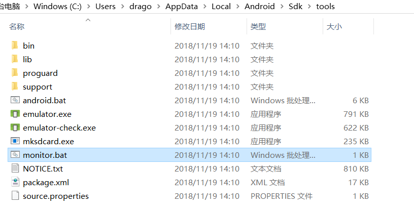

   可以通过自己写一个 DDMS.bat 放在桌面作为快捷启动：

   ```
@echo off
   rem  color 0A ：设置cmd背景颜色和字体颜色
color 0A
   rem title：设置cmd标题
title Start Android Studio Mointor 
   echo 请按任意键打开 Android Studio Mointor .....
   pause>nul
   rem “D:\AndroidSDK\tools\monitor.bat”是AndroidStudio配置SDK文件夹下monitor.bat的完整路径
   call D:\Android\Sdk\tools\monitor.bat
   ```
   
2. Monitor的界面如下：
   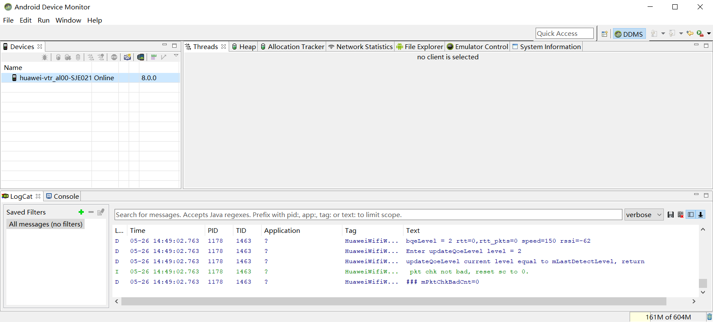

3. 点击Capture按钮并配置需要抓取信息：

   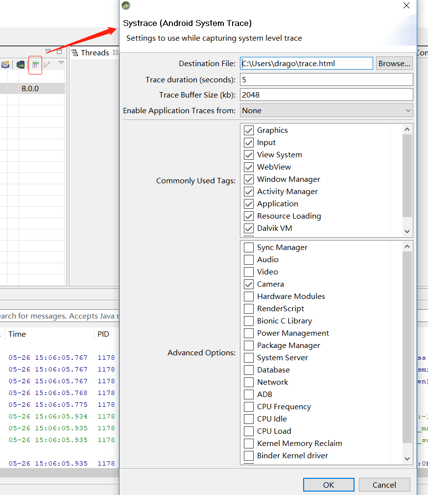

   **Destination File** :制定生成的trace.html文件的地址
   **Trace duration**：抓取时间，通常设置5秒，并在5秒内重现问题，时间太短会导致问题重现时没有被抓到，时间太长会导致JavaHeap不够而无法保存。因此在能抓到问题点的情况下，时间越小越好。
   **Trace Buffer Size**：存储Systrace的size，同样太小会导致信息丢失，太长会导致Java Heap不够而无法保存。如果检测结果有异常，请调整Buffer Size的大小试试。
   **Enable Application Traces from**：检测的应用，默认选择none，这里需选择自己需要检测的应用。
   **Commonly Used Tag**：常用标签，这部分TAG全部使能。只关注显示情况的话 ，只选取Graphics和View System即可。
   **Advanced Options**：高级选项。如果设备root了，可以看到更多的TAG，如eMMC commands、Synchonization、Kernel Workqueues。

   注：假如抓取过多次trace，为避免数据丢失，请及时清除缓存中的内容，清理地方在Android Device Monitor

   的右下角，如下图所示:

   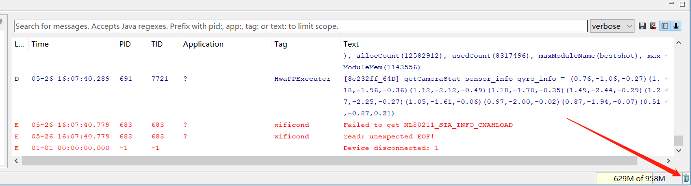

4. 配置完成（如抓取camera相关trace）点击确定后，开始操作手机，在时间到了后会自动生成报表（trace.html）文件。

**方法二：使用命令行抓取 Systrace**

1. 下载并安装Android SDK Tools(C:\Users\drago\AppData\Local\Android\Sdk\platform-tools\systrace\systrace.py)，安装Python。

   **注：**Python是没有自带访问windows系统API的库的，需要下载。库的名称叫pywin32，可以从网上直接下载：
   
   　　[https://github.com/mhammond/pywin32/releases ](https://github.com/mhammond/pywin32/releases)（下载适合你的Python版本）

2. 连接手机，打开开发者选项中的`USB Debug`选项，使用命令行抓取 `Systrace，`语法如下：
   
   ```
python systrace.py [options] [categories]
   例1: 调用systrace在10秒钟内记录设备进程，包括图形进程，并生成一个名为mynewtrace的HTML报告：

   　　　python systrace.py --time=10 -o mynewtrace.html gfx 
   
   例2: 检测UI性能：

   　　 python systrace.py view --time=10

   可通过 python systrace.py -l 显示所有支持的选项。

   如果不指定任何类别或选项，systrace将生成包含所有可用类别的报告，并使用默认设置。 可用的类别取决于您使用的连接设备。
   ```
   

　参数分为两个部分options和category：

　options可取值：

| options                                    | 解释                                                         |
| ------------------------------------------ | ------------------------------------------------------------ |
| -o <FILE>                                  | 指定trace数据文件的输出路径，如果不指定就是当前目录的trace.html |
| -t N, –time=N                              | 执行时间，默认5s。绝对不要把时间设的太短导致你操作没完Trace就跑完了，这样会出现Did not finish 的标签，分析数据就基本无效了 |
| -b N, –buf-size=N                          | buffer大小（单位kB),用于限制trace总大小，默认无上限          |
| -k <KFUNCS>，–ktrace=<KFUNCS>              | 追踪kernel函数，用逗号分隔                                   |
| -a <APP_NAME>,–app=<APP_NAME>              | 这个选项可以开启指定包名App中自定义Trace Label的Trace功能。也就是说，如果你在代码中使用了Trace.beginSection("tag"), Trace.endSection；默认情况下，你的这些代码是不会生效的，因此，这个选项一定要开启 |
| –from-file=<FROM_FILE>                     | 从文件中创建互动的systrace                                   |
| -e <DEVICE_SERIAL>,–serial=<DEVICE_SERIAL> | 指定设备，在特定连接设备上进行跟踪，由[设备序列号](https://developer.android.com/studio/command-line/adb.html#devicestatus)标识 。 |
| -l, –list-categories                       | 这个用来列出你分析的那个手机系统支持的Trace模块，一般来说，高版本的支持的模块更多 |

　category可取值：

| category      | 解释                                                         |
| ------------- | ------------------------------------------------------------ |
| gfx           | Graphic系统的相关信息，包括SerfaceFlinger，VSYNC消息，Texture，RenderThread等；分析卡顿非常依赖这个。 |
| input         | Input                                                        |
| view          | View绘制系统的相关信息，比如onMeasure，onLayout等。。        |
| webview       | WebView                                                      |
| wm            | Window Manager                                               |
| am            | ActivityManager调用的相关信息；用来分析Activity的启动过程比较有效。 |
| sm            | Sync Manager                                                 |
| audio         | Audio                                                        |
| video         | Video                                                        |
| camera        | Camera                                                       |
| hal           | Hardware Modules                                             |
| app           | Application                                                  |
| res           | Resource Loading                                             |
| dalvik        | 虚拟机相关信息，比如GC停顿等。                               |
| rs            | RenderScript                                                 |
| bionic        | Bionic C Library                                             |
| power         | Power Management                                             |
| sched         | CPU调度的信息，非常重要；你能看到CPU在每个时间段在运行什么线程；线程调度情况，比如锁信息。 |
| binder_driver | Binder驱动的相关信息，如果你怀疑是Binder IPC的问题，不妨打开这个。 |
| core_services | SystemServer中系统核心Service的相关信息，分析特定问题用。    |
| irq           | IRQ Events                                                   |
| freq          | CPU Frequency                                                |
| idle          | CPU Idle                                                     |
| disk          | Disk I/O                                                     |
| mmc           | eMMC commands                                                |
| load          | CPU Load                                                     |
| sync          | Synchronization                                              |
| workq         | Kernel Workqueues                                            |
| memreclaim    | Kernel Memory Reclaim                                        |
| regulators    | Voltage and Current Regulators                               |

[options] 是一些命令参数，[category] 是你感兴趣的系统模块，比如view代表view系统（包含绘制流程），am代表ActivityManager（包含Activity创建过程等）；分析不同问题的时候，可以选择不同你感兴趣的模块。需要重复的是，尽可能缩小需要Trace的模块，其一是数据量小易与分析；其二，虽然systrace本身开销很小，但是缩小需要Trace的模块也能减少运行时开销。比如你分析卡顿的时候，power, webview 就几乎是无用的。

**方法三：离线抓取 Systrace**

　　① 输入指令：adb root && adb remount

　　② 输入以下指令开始后台抓取systrace，此时可以断开usb连接线去复现问题：

```
adb shell "atrace -z -b 40000 gfx input view wm am camera hal res dalvik rs sched freq idle disk mmc -t 15 > /data/local/tmp/trace_output &"
```

　　参数说明：

​		-a appname enable app-level tracing for a comma separated list of cmdlines

​		-b N use a trace buffer size of N KB

​		-t N trace for N seconds [defualt 5]

​		-z compress the trace dump

​		--list_categories list the available tracing categories

​		The time and buffer size should be long enough to finished the systrace collecting.

　　③ 复现问题后，重新连接usb线输入如下指令，确认atrace进程是否结束抓取并退出：

```
adb shell ps -A | grep atrace
```

　　④ 抓取完成后，取出生成的trace文件，并转换成html格式：

```
adb pull /data/local/tmp/trace_output
systrace.py --from-file trace_output -o output.html
```

　　然后就可以用谷歌浏览器打开分析了~


## 三、trace.html文件分析：

使用Google Chrome(其他浏览器很可能打不开)将这个文件打开进行分析，界面如下：
在进程的上面有一条很细的进度条，包含了该线程的状态：
　　**灰色**： 睡眠。
　　**蓝色**： 可以运行（它可以运行，但还未被调度运行）。
　　**绿色**： 正在运行（调度程序认为它正在运行）。
　　**红色**： 不间断的睡眠（通常发生在内核锁上），指出I / O负载，对于性能问题的调试非常有用
　　**橙色**： 由于I / O负载导致的不间断睡眠。
　　要查看不间断睡眠的原因（可从sched_blocked_reason跟踪点获取），请选择红色不间断睡眠切片。

```
按键操作       作用
w             放大，[+shift]速度更快
s             缩小，[+shift]速度更快
a             左移，[+shift]速度更快
d             右移，[+shift]速度更快

f             放大当前选定区域
m             标记当前选定区域
v             高亮VSync
g             切换是否显示60hz的网格线
0             恢复trace到初始态，这里是数字0而非字母o

h             切换是否显示详情
/             搜索关键字
enter　　　　　　显示搜索结果，可通过← →定位搜索结果
`             显示/隐藏脚本控制台
?             显示帮助功能
```

　**（1）分析View性能**

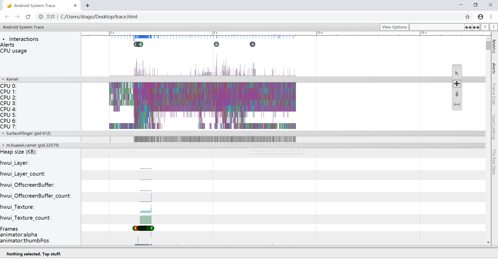
　　然后通过w放大，找F(即Frames)和F之间的间隔时间，如果间隔时间超过16ms的都是有问题的，16ms其实对应的就是60fps(1/60≈16ms)，因为人眼与大脑之间的协作无法感知超过60fps的画面更新。Android系统每隔16ms发出VSYNC信号，触发对UI进行渲染，那么整个过程如果保证在16ms以内就能达到一个流畅的画面。那么如果操作超过了16ms就会发生下面的情况，如果系统发生的VSYNC信号，而此时无法进行渲染，还在做别的操作，那么就会导致丢帧的现象，（察觉到APP卡顿的时候，可以看看logcat控制台，会有drop frames类似的警告）。其中F圆圈中`绿色`表示在16.6毫秒内呈现的帧，花费16.6毫秒以上渲染的帧用`黄色`或`红色`框圈表示。

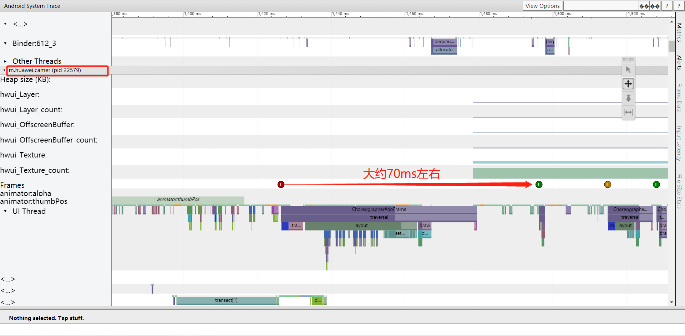

放大后可看到时间1420~1500ms中，两个F之间间隔70ms左右，明显是超过16ms的，然后继续放大可以看到具体的任务内容和占用时长：

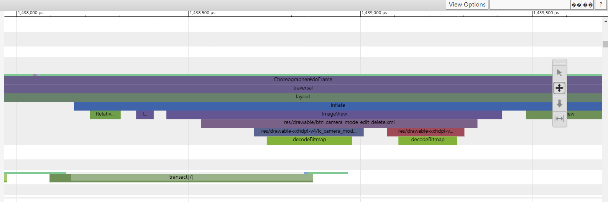

此时再点击“F”图标会在下栏提示相关内容如下：

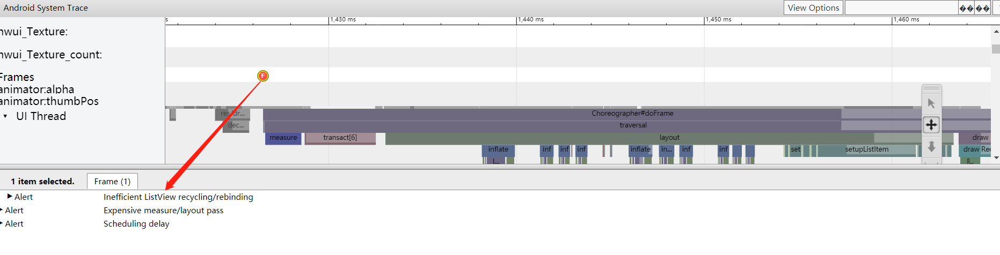

提示是listview在recycling/rebinding的时效率低，接着点击Alerts：

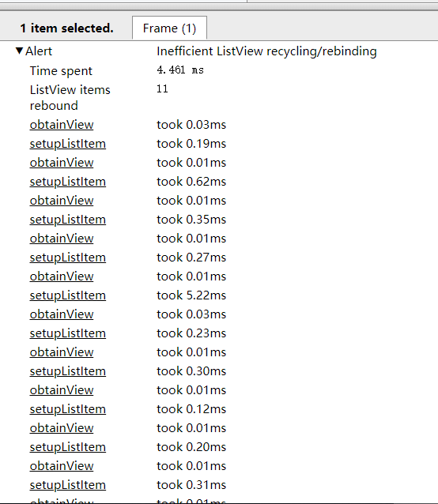

点击各项也会相应展开，并给出性能分析结果和优化建议：

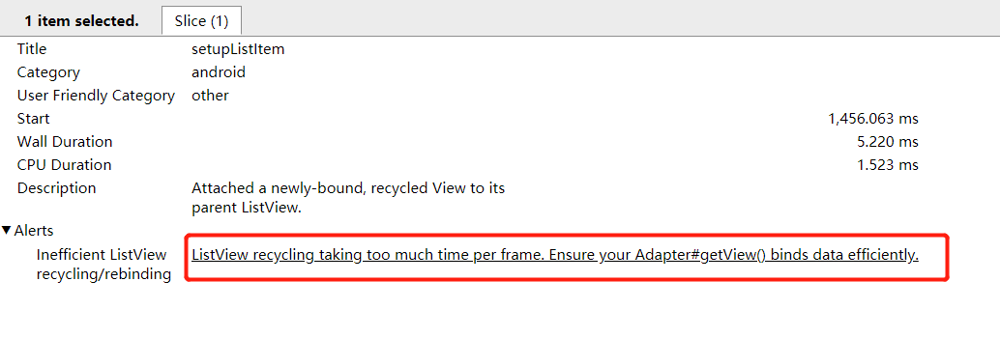

如果要查看工具在`trace`中发现的每个`Alert`以及设备触发`Alert`的次数，请单击窗口最右侧的`Alerts`选项卡，如下图所示：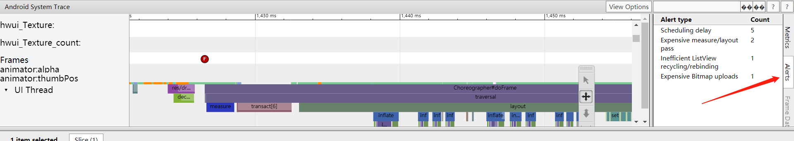

如果在`UI Thread`上做太多的工作，需要找出哪些方法消耗了太多的`CPU时间`。一种方法是添加跟踪标记到您认为会导致这些瓶颈的方法，以查看这些函数调用是否显示在`systrace`中。 如果您不确定哪些方法可能会在UI线程上造成瓶颈，请使用`Android Studio`的内置`CPU分析器，`或者生成跟踪日志并使用`Traceview`查看它们。

虽然Systrace无法定位到某一行需要优化的代码，但通过Alerts和Frames以根据TraceView分析具体函数花了多长时间来进一步优化代码提高性能。

**（2）分析HAL层线程处理性能**

​	①用chrome打开trace的html文件。
　　	②搜索trace关键字，然后按"m"键Mark一下，搜索的线程所处阶段会被高亮。

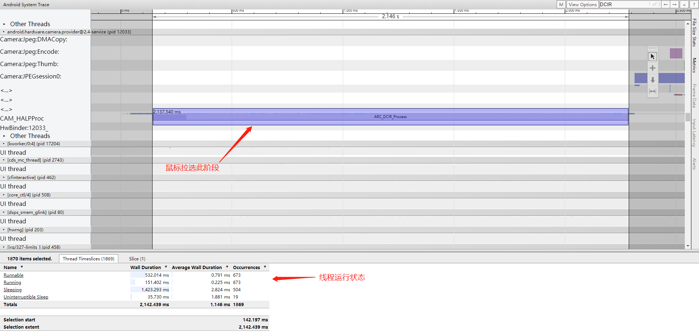

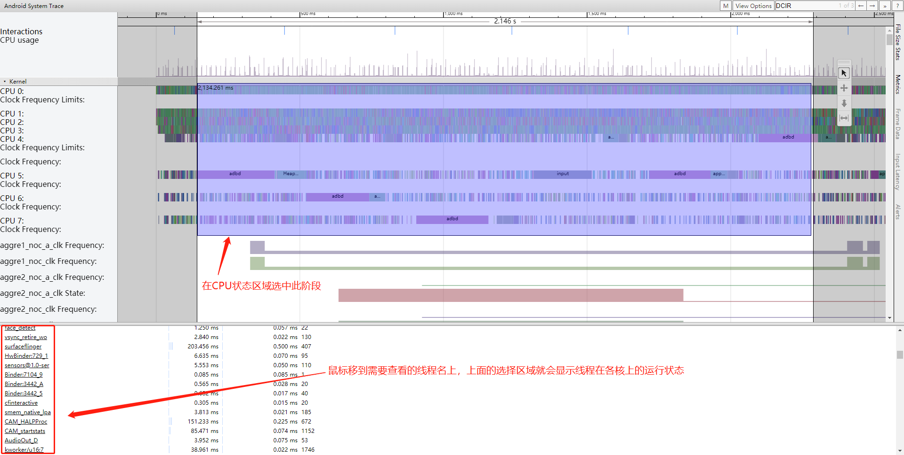

 

## 四**、**代码中添加标记生成 trace log

由于systrace是在系统级显示有关进程的信息，因此很难在HTML报告中的某个特定时间知道您的应用程序正在执行什么方法。在Android 4.3（API级别18）及更高版本中，您可以使用代码中的Trace类在HTML报告中标记执行事件。您不需要用代码来记录systrace的跟踪记录，但是这样做可以帮助您查看应用程序代码的哪些部分可能会导致线程挂起或UI断线。这种方法与使用Debug类不同，Trace类简单地将标志添加到systrace报告中，而Debug类可帮助您通过生成.trace文件来检查详细的app CPU使用情况。

（1）**Java**代码要生成包含已检测的跟踪事件的systrace HTML报告，如果使用指令方式抓取则需要使用-a或--app命令行选项运行systrace，并指定应用程序的包名称。

通常在怀疑引起jank代码地方的开始处添加 Trace.beginSection("defined by yourself"); 结束处添加Trace.endSection(); （注：这两个方法需要在同一个线程中成对出现，否则多次调用beginSection时，调用endSection只会结束最近的beginSection方法），添加方法参考如下：

```java
public class MyAdapter extends RecyclerView.Adapter<MyViewHolder> {
    @Override
    public MyViewHolder onCreateViewHolder(ViewGroup parent, int viewType) {
        Trace.beginSection("MyAdapter.onCreateViewHolder");
        MyViewHolder myViewHolder;
        try {
            myViewHolder = MyViewHolder.newInstance(parent);
        } finally {
            // In try and catch statements, always call "endSection()" in a
            // "finally" block. That way, the method is invoked even when an
            // exception occurs.
            Trace.endSection();
        }
        return myViewHolder;
    }

   @Override
    public void onBindViewHolder(MyViewHolder holder, int position) {
        Trace.beginSection("MyAdapter.onBindViewHolder");
        try {
            try {
                Trace.beginSection("MyAdapter.queryDatabase");
                RowItem rowItem = queryDatabase(position);
                dataset.add(rowItem);
            } finally {
                Trace.endSection();
            }
            holder.bind(dataset.get(position));
        } finally {
            Trace.endSection();
        }
    }
}
```

生成 trace.html 指令：

```
python systrace.py -a com.example.myapp -b 16384 -o my_systrace_report.html sched freq idle am wm gfx view binder_driver hal dalvik camera input res 
```

（2）**Native**层在Android 6.0 (API level 23)及以上版本支持添加trace，步骤如下:

​	①为ATrace函数定义函数指针，如下面的代码片段所示:

```c
#include <android/trace.h>
#include <dlfcn.h>

void *(*ATrace_beginSection) (const char* sectionName);
void *(*ATrace_endSection) (void);

typedef void *(*fp_ATrace_beginSection) (const char* sectionName);
typedef void *(*fp_ATrace_endSection) (void);
```

​	②加载ATrace_xxx符号，如下面的代码片段所示:

```c
// Retrieve a handle to libandroid.
void *lib = dlopen("libandroid.so", RTLD_NOW || RTLD_LOCAL);

// Access the native tracing functions.
if (lib != NULL) {
    // Use dlsym() to prevent crashes on devices running Android 5.1
    // (API level 22) or lower.
    ATrace_beginSection = reinterpret_cast<fp_ATrace_beginSection>(
        dlsym(lib, "ATrace_beginSection"));
    ATrace_endSEction = reinterpret_cast<fp_ATrace_endSection>(
        dlsym(lib, "ATrace_endSection"));
}
```

​	注：出于安全考虑，dlopen操作只在debug时使用，另外如果要在Android 4.3 (API级别18)使用trace功能，可以通过JNI调用如上接口。

​	③在需要分析的函数开始和结束处分别调用ATrace_beginSection()和ATrace_endSection():

```c
#include <android/trace.h>

char *customEventName = new char[32];
sprintf(customEventName, "User tapped %s button", buttonName);

ATrace_beginSection(customEventName);
// Your app or game's response to the button being pressed.
ATrace_endSection(); 
```

C++中可以进一步通过宏定义利用构造及析构函数进行封装，便于使用：

​	①宏定义：

```c
#define ATRACE_NAME(name) ScopedTrace ___tracer(name)

// ATRACE_CALL is an ATRACE_NAME that uses the current function name.
#define ATRACE_CALL() ATRACE_NAME(__FUNCTION__)

class ScopedTrace {
  public:
    inline ScopedTrace(const char *name) {
      ATrace_beginSection(name);
    }

    inline ~ScopedTrace() {
      ATrace_endSection();
    }
};
```

​	②在需要追踪的代码部分开头使用宏定义，即可给当前函数添加trace标记：

```c
void myExpensiveFunction() {
  ATRACE_CALL();
  // Code that you want to trace.
} 
```

**>>>补充：**

（1）集成好trace库的Android平台可以通过如下方法直接使用：

```c
    #include <utils/Trace.h>
    #define ATRACE_TAG ATRACE_TAG_ALWAYS
    ATRACE_CALL();

Android 4.3 以上也可以用如下方式：
    #include <cutils/trace.h>
    ATRACE_BEGIN("TEST");
    ATRACE_END();
```

（2）手动开启App的自定义Label的Trace功能要调用一个SDK @hide的函数，需要反射调用，把下面这段代码放在Application的`attachBaseContext`中即可，在非debuggable的版本中也适用！

```
Class<?> trace = Class.forName("android.os.Trace");
Method setAppTracingAllowed = trace.getDeclaredMethod("setAppTracingAllowed", boolean.class);
setAppTracingAllowed.invoke(null, true);
```

(3) 通过 `trace_marker` 模拟实现用户态函数跟踪，封装代码如下：

​	**Utils_Trace.cpp**

```c++
#include "Utils_Trace.h"
#include "stdio.h"

#define ATRACE_MESSAGE_LEN 256
#ifdef __cplusplus
extern "C" {
#endif
int trace_init(int * phHandle)
{
    int atrace_marker_fd = open("/sys/kernel/debug/tracing/trace_marker", O_WRONLY);
    if (atrace_marker_fd == -1) {
        return -1;
    }
    *phHandle = atrace_marker_fd;

    return 0;
}

void trace_uninit(int hHandle)
{
    if (-1 == hHandle) {
        return;
    }
    close(hHandle);
}

void trace_begin(int hHandle, const char *name)
{
    if (-1 == hHandle) {
        return;
    }
    char buf[ATRACE_MESSAGE_LEN] = { 0 };
    int len = snprintf(buf, ATRACE_MESSAGE_LEN, "B|%d|%s", getpid(), name);
    write(hHandle, buf, len);
}

void trace_end(int hHandle,const char *name)
{
    if (-1 == hHandle) {
        return;
    }
    char buf[ATRACE_MESSAGE_LEN] = { 0 };
    int len = snprintf(buf, ATRACE_MESSAGE_LEN, "E|%d|%s", getpid(), name);
    //char c = 'E';
    //write(hHandle, &c, 1);
    write(hHandle, buf, len);
}

void trace_async_begin(int hHandle, const char *name, const int32_t cookie)
{
    if (-1 == hHandle) {
        return;
    }
    char buf[ATRACE_MESSAGE_LEN] = { 0 };
    int len = snprintf(buf, ATRACE_MESSAGE_LEN, "S|%d|%s|%i", getpid(), name, cookie);
    write(hHandle, buf, len);
}

void trace_async_end(int hHandle, const char *name, const int32_t cookie)
{
    if (-1 == hHandle) {
        return;
    }
    char buf[ATRACE_MESSAGE_LEN] = { 0 };
    int len = snprintf(buf, ATRACE_MESSAGE_LEN, "F|%d|%s|%i", getpid(), name, cookie);
    write(hHandle, buf, len);
}

void trace_counter(int hHandle, const char *name, const int value)
{
    if (-1 == hHandle) {
        return;
    }
    char buf[ATRACE_MESSAGE_LEN] = { 0 };
    int len = snprintf(buf, ATRACE_MESSAGE_LEN, "C|%d|%s|%i", getpid(), name, value);
    write(hHandle, buf, len);
}
#ifdef __cplusplus
}
#endif
```

​	**Utils_Trace.h**

```c++
#ifndef __UTILS_TRACE___H___
#define __UTILS_TRACE___H___

#include <sys/types.h>
#include <sys/stat.h>
#include <fcntl.h>
#include <unistd.h>

#ifdef __cplusplus
extern "C" {
#endif

/** @brief open trace.
*
* @param[in/out]    phHandle      Handle of the trace.
*
* @return       -1 if fail, otherwise success.
*/
int trace_init(int * phHandle);

/** @brief close trace.
*
* @param[in]    hHandle        Handle of the trace.
*
*/
void trace_uninit(int hHandle);

/** @brief begin trace.
*
* @param[in]    hHandle        Handle of the trace.
* @param[in]    name        name of the trace.
*/
void trace_begin(int hHandle, const char *name);

/** @brief stop trace.
*
* @param[in]    hHandle        Handle of the trace.
*
*/
void trace_end(int hHandle, const char *name);

/** @brief begin asynchronous trace.
* Asynchronous traces produce non-nested (i.e. simply overlapping) intervals.
* They show up as grey segments above the thin thread-state bar in the systrace HTML output.
* They take an extra 32-bit integer argument that "distinguishes simultaneous events".
* The same name and integer must be used when ending traces
*
* @param[in]    hHandle        Handle of the trace.
* @param[in]    name        name of the trace.
*/
void trace_async_begin(int hHandle, const char *name, const int32_t cookie);

/** @brief stop asynchronous trace.
*
* @param[in]    hHandle        Handle of the trace.
* @param[in]    name        name of the trace.
*/
void trace_async_end(int hHandle, const char *name, const int32_t cookie);

/** @brief Counters track the value of an integer and draw a little graph in the systrace HTML output..
*
* @param[in]    hHandle        Handle of the trace.
* @param[in]    name        name of the trace.
* @param[in]    counter        counter of the trace.
*/
void trace_counter(int hHandle, const char *name, const int value);

#ifdef __cplusplus
}
#endif
#endif//__UTILS_TRACE___H___
```

使用方法：

​	①. 把Utils_Trace.h、Utils_Trace.cpp放在工作代码中，并编译。
​		②. 初始化trace_init。
​		③. Insert tracepoints。 注： 同一个线程里使用trace_begin和trace_end。 不同的线程里使用	trace_async_begin和trace_async_end （同一线程也可使用）。
​		④. 反初始化trace_uninit。

（4）修改线程名：

```c++
#include <pthread.h>

static void *render_scene(void *parm) {
    // Code for preparing your app or game's visual components.
}

static void *load_main_menu(void *parm) {
    // Code that executes your app or game's main logic.
}

void init_threads() {
    pthread_t render_thread, main_thread;

    pthread_create(&render_thread, NULL, render_scene, NULL);
    pthread_create(&main_thread, NULL, load_main_menu, NULL);

    pthread_setname_np(render_thread, "MyRenderer");
    pthread_setname_np(main_thread, "MyMainMenu");
}
```

（5）修改进程名：

```
prctl(PR_SET_NAME, “process_name”, NULL, NULL, NULL);
```

第一个参数是操作类型，指定PR_SET_NAME，即设置进程名。

第二个参数是进程名字符串，长度至多16字节。

 

## 五**、**TraceView的使用

`　　Traceview`是提供跟踪日志的图形工具。您可以通过使用`Debug`类来设置代码来生成日志。 这种跟踪方法非常精确，因为您可以准确指定要启动的代码中的哪个位置，并停止记录跟踪数据。 如果尚未生成这些跟踪日志并将其从连接的设备保存到本地计算机，请转至通过检测应用程序生成跟踪日志。 使用`Traceview`检查这些日志可帮助您调试您的应用程序并剖析其性能。如果您不需要查看通过使用`Debug`类检测应用程序来记录的跟踪日志，则可以使用`Android Studio 3.0`及更高版本中包含的`CPU`分析器来查看应用程序的线程和记录方法跟踪。使用`Android Device Monitor`可以查看trace Log内容。

Android SDK自带的Debug类使用方法如下：

```
在开始记录的点写上代码Debug.startMethodTracing("tracePath");
在终止记录的点写上代码Debug.stopMethodTracing();
通过adb pull /mnt/sdcard/tracePath.trace .将trace导出指定的文件夹中
通过Android studio打开trace文件，界面同CPU Profiler差不多。
```

提示：可以使用命令行中的`dmtracedump`来生成跟踪日志文件的图形调用堆栈图。

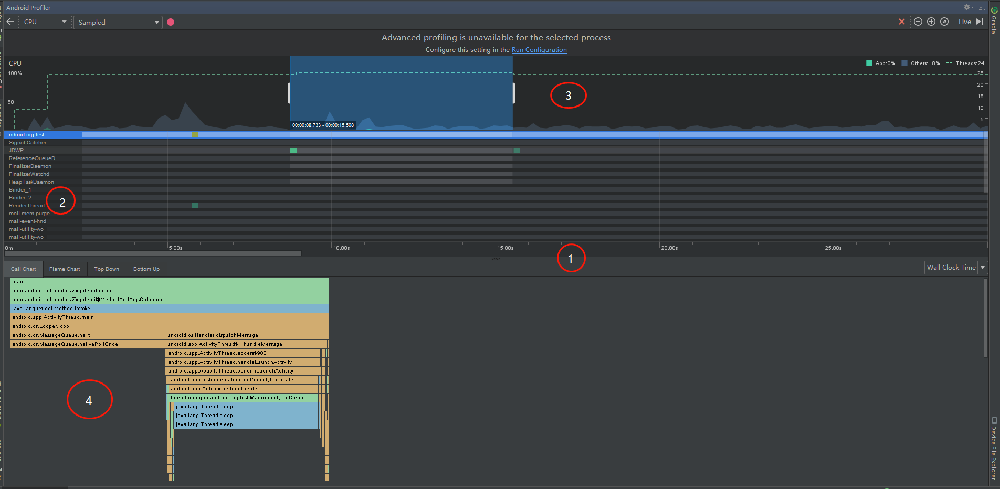

如上图所示，CPU Profiler的视图包括以下内容：
	①App timeline:显示CPU在执行过程中的时间轴。
	②线程 timeline:显示线程列表以及每个线程在某个时间段占用的CPU的资源情况。

```
绿色: 线程处于活动状态或准备好使用CPU。也就是说，它处于”运行”或”可运行”状态。
黄色：线程处于活动状态，但是在完成其工作之前，它正在等待I / O操作（如文件或网络I / O）。
灰色：线程正在睡眠，不会消耗任何CPU时间，当线程需要访问尚未可用的资源时，有时会发生这种情况。要么线程进入自愿性睡眠，要么内核使线程休眠，直到所需的资源可用。
```

③CPU timeline:列出CPU在App运行过程中CPU使用情况。
	④Method Trace:在指定线程中，执行的方法栈，横行表示执行的时间轴，纵向表示方法执行的调用轴。

```
橙色：系统方法
蓝色：第三方API（包括java语言的api）
绿色：App自身方法 
```

 

## 六、linux进程、线程与cpu的亲和性（affinity)

### 1、什么是cpu亲和性（affinity）

**软亲和性:**  就是进程要在指定的 CPU 上尽量长时间地运行而不被迁移到其他处理器，Linux 内核进程调度器天生就具有被称为 *软 CPU 亲和性（affinity）* 的特性，这意味着进程通常不会在处理器之间频繁迁移。这种状态正是我们希望的，因为进程迁移的频率小就意味着产生的负载小。

**硬亲和性：**简单来说就是利用linux内核提供给用户的API，强行将进程或者线程绑定到某一个指定的cpu核运行。

**解释**：在linux内核中，所有的进程都有一个相关的数据结构，称为 task_struct。这个结构非常重要，原因有很多；其中与亲和性（affinity）相关度最高的是 cpus_allowed 位掩码。这个位掩码由 n 位组成，与系统中的 n 个逻辑处理器一一对应。 具有 4 个物理 CPU 的系统可以有 4 位。如果这些 CPU 都启用了超线程，那么这个系统就有一个 8 位的位掩码。 如果为给定的进程设置了给定的位，那么这个进程就可以在相关的 CPU 上运行。因此，如果一个进程可以在任何 CPU 上运行，并且能够根据需要在处理器之间进行迁移，那么位掩码就全是 1。实际上，这就是 Linux 中进程的缺省状态； 

### 2、进程与cpu的绑定

sched_setaffinity可以将某个进程绑定到一个特定的CPU。你比操作系统更了解自己的程序，为了避免调度器愚蠢的调度你的程序，或是为了在多线程程序中避免缓存失效造成的开销，可以自行将当前进程绑定到期望运行的CPU核上。
　　以下示例将当前进程绑定到0、1、2、3号cpu上：

```java
#define _GNU_SOURCE
#include <sched.h>
#include <stdio.h>
#include <string.h>
#include <stdlib.h>
#include <unistd.h>
#include <errno.h>

/* sysconf( _SC_NPROCESSORS_CONF ) 查看cpu的个数；打印用%ld长整。
 * sysconf( _SC_NPROCESSORS_ONLN ) 查看在使用的cpu个数；打印用%ld长整 */
int main(int argc, char **argv)
{
    int cpus = 0;
    int  i = 0;
    cpu_set_t mask;
    cpu_set_t get;

    cpus = sysconf(_SC_NPROCESSORS_CONF);
    printf("cpus: %d\n", cpus);

    CPU_ZERO(&mask);    /* 初始化set集，将set置为空*/
    CPU_SET(0, &mask);  /* 依次将0、1、2、3号cpu加入到集合，前提是你的机器是多核处理器*/
    CPU_SET(1, &mask);
    CPU_SET(2, &mask);
    CPU_SET(3, &mask);

　　//void CPU_CLR (int cpu, cpu_set_t *set) //这个宏将 指定的 cpu 从 CPU 集 set 中删除
　　//int CPU_ISSET (int cpu, const cpu_set_t *set) //如果 cpu 是 CPU 集 set 的一员，这个宏就返回一个非零值（true），否则就返回零（false）

　　/*设置cpu 亲和性（affinity）*/

    /*sched_setaffinity函数设置进程为pid的这个进程,让它运行在mask所设定的CPU上.如果pid的值为0,
     *则表示指定的是当前进程,使当前进程运行在mask所设定的那些CPU上.
     *第二个参数cpusetsize是mask所指定的数的长度.通常设定为sizeof(cpu_set_t).
     *如果当前pid所指定的进程此时没有运行在mask所指定的任意一个CPU上,
     *则该指定的进程会从其它CPU上迁移到mask的指定的一个CPU上运行.*/
    if (sched_setaffinity(0, sizeof(mask), &mask) == -1) {
        printf("Set CPU affinity failue, ERROR:%s\n", strerror(errno));
        return -1; 
    }   
    usleep(1000); /* 让当前的设置有足够时间生效*/

    /*查看当前进程的cpu 亲和性*/
    CPU_ZERO(&get);
　　/*sched_getaffinity函数获得pid所指示的进程的CPU位掩码,并将该掩码返回到mask所指向的结构中.
 　　*即获得指定pid当前可以运行在哪些CPU上.
　　 *同样,如果pid的值为0.也表示的是当前进程*/
    if (sched_getaffinity(0, sizeof(get), &get) == -1) {
        printf("get CPU affinity failue, ERROR:%s\n", strerror(errno));
        return -1; 
    }
    
    /*查看当前进程的在哪个cpu核上运行*/
    for(i = 0; i < cpus; i++) {
        if (CPU_ISSET(i, &get)) { /*查看cpu i 是否在get 集合当中*/
            printf("this process %d of running processor: %d\n", getpid(), i); 
        }    
    }
    sleep(3); //让程序停在这儿，方便top命令查看
       
    return 0;
}
```

运行结果如下：

```
[root@localhost test]# ./test    
cpus: 24
this process 2848 of running processor: 0
this process 2848 of running processor: 1
this process 2848 of running processor: 2
this process 2848 of running processor: 3
```

其中**syscall**是一个系统调用，根据指定的参数number和所有系统调用的接口来确定调用哪个系统调用，用于用户空间跟内核之间的数据交换。下面是syscall函数原型及一些常用的number：

```c
//syscall - indirect system call
SYNOPSIS
       #define _GNU_SOURCE         /* See feature_test_macros(7) */
       #include <unistd.h>
       #include <sys/syscall.h>   /* For SYS_xxx definitions */

       int syscall(int number, ...);
       
/* sysconf( _SC_PAGESIZE );  此宏查看缓存内存页面的大小；打印用%ld长整型。
sysconf( _SC_PHYS_PAGES ) 此宏查看内存的总页数；打印用%ld长整型。
sysconf( _SC_AVPHYS_PAGES ) 此宏查看可以利用的总页数；打印用%ld长整型。
sysconf( _SC_NPROCESSORS_CONF ) 查看cpu的个数；打印用%ld长整。
sysconf( _SC_NPROCESSORS_ONLN ) 查看在使用的cpu个数；打印用%ld长整。
(long long)sysconf(_SC_PAGESIZE) * (long long)sysconf(_SC_PHYS_PAGES) 计算内存大小。
sysconf( _SC_LOGIN_NAME_MAX ) 查看最大登录名长度；打印用%ld长整。
sysconf( _SC_HOST_NAME_MAX ) 查看最大主机长度；打印用%ld长整。
sysconf( _SC_OPEN_MAX )  每个进程运行时打开的文件数目；打印用%ld长整。
sysconf(_SC_CLK_TCK) 查看每秒中跑过的运算速率；打印用%ld长整。*/
```

### 3、线程与cpu的绑定

线程于进程的绑定方法大体一致，需要注意的是线程绑定于进程的区别是所用函数不一样线程绑定用到下面两个函数，跟进程类似就不做详细说明，将当前线程绑定到0、1、2、3号cpu上示例如下：

```c++
#define _GNU_SOURCE
#include <stdio.h>
#include <stdlib.h>
#include <string.h>
#include <unistd.h>
#include <pthread.h>
#include <sched.h>

void *testfunc(void *arg)
{
    int i, cpus = 0;
    cpu_set_t mask;
    cpu_set_t get;

    cpus = sysconf(_SC_NPROCESSORS_CONF);
    printf("this system has %d processor(s)\n", cpus);
    
    CPU_ZERO(&mask);
    for (i = 0; i < 4; i++) { /*将0、1、2、3添加到集合中*/
        CPU_SET(i, &mask);
    }   

    /* 设置cpu 亲和性(affinity)*/
    if (pthread_setaffinity_np(pthread_self(), sizeof(mask), &mask) < 0) {
        fprintf(stderr, "set thread affinity failed\n");
    }   
    
    /* 查看cpu 亲和性(affinity)*/
    CPU_ZERO(&get);
    if (pthread_getaffinity_np(pthread_self(), sizeof(get), &get) < 0) {
        fprintf(stderr, "get thread affinity failed\n");
    }   

    /* 查看当前线程所运行的所有cpu*/
    for (i = 0; i < cpus; i++) {
        if (CPU_ISSET(i, &get)) {
            printf("this thread %d is running in processor %d\n", (int)pthread_self(), i); 
        }   
    }   
    sleep(3); //查看
    
    pthread_exit(NULL);
}
 
int main(int argc, char *argv[])
{
    pthread_t tid;
    if (pthread_create(&tid, NULL, (void *)testfunc, NULL) != 0) {
        fprintf(stderr, "thread create failed\n");
        return -1; 
    }   

    pthread_join(tid, NULL);
    return 0;
}
```

运行结果如下：

```
[root@localhost thread]# ./test                      
this system has 24 processor(s)
this thread 2812323584 is running in processor 0
this thread 2812323584 is running in processor 1
this thread 2812323584 is running in processor 2
this thread 2812323584 is running in processor 3 
```

## 参考

* [Android：通过systrace进行性能分析](https://www.cnblogs.com/blogs-of-lxl/p/10926824.html)

