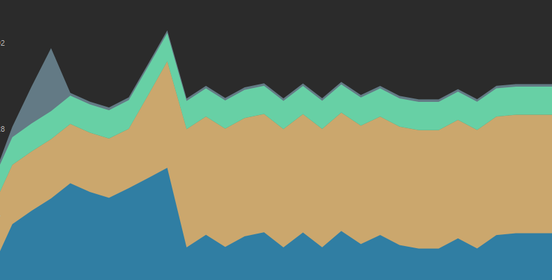
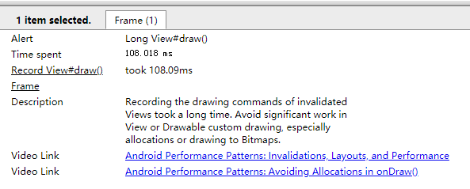
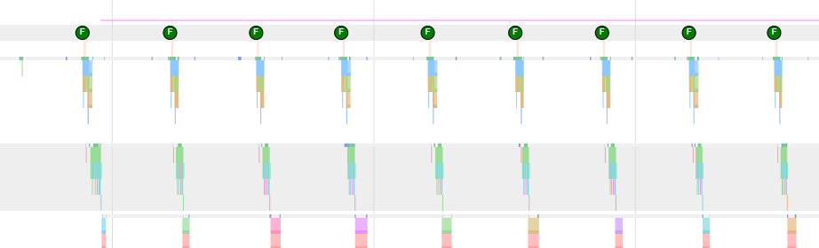
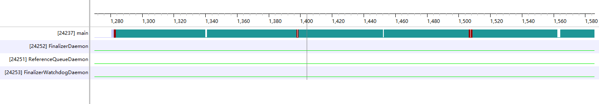
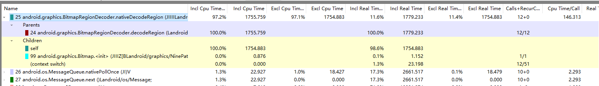
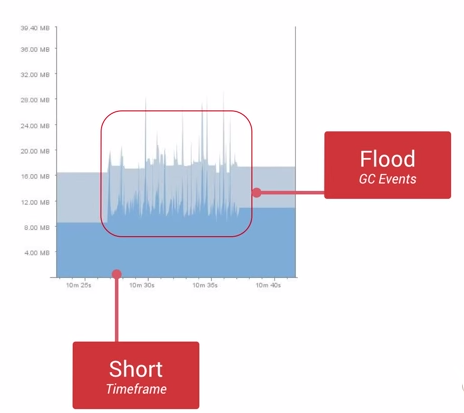

<h1 align="center">UI卡顿分析</h1>

[toc]

## 一、卡顿

### 1. 卡顿定义

在应用开发中如果留意到log的话有时候可能会发下下面的log信息：

```
I/Choreographer(1200): Skipped 60 frames!  The application may be doing too much work on its main thread.
```

在大部分Android平台的设备上，Android系统是16ms刷新一次，也就是一秒钟60帧。要达到这种刷新速度就要求在ui线程中处理的任务时间必须要小于16ms，如果ui线程中处理时间长，就会导致跳过帧的渲染，也就是导致界面看起来不流畅，卡顿。如果用户点击事件5s中没反应就会导致ANR。

### 2. 帧率

即 Frame Rate，单位 fps，是指 gpu 生成帧的速率，60fps，Android中更帧率相关的类是SurfaceFlinger。

**SurfaceFlinger**

surfaceflinger作用是接受多个来源的图形显示数据，将他们合成，然后发送到显示设备。比如打开应用，常见的有三层显示，顶部的statusbar底部或者侧面的导航栏以及应用的界面，每个层是单独更新和渲染，这些界面都是有surfaceflinger合成一个刷新到硬件显示。


在显示过程中使用到了bufferqueue，surfaceflinger作为consumer方，比如windowmanager管理的surface作为生产方产生页面，交由surfaceflinger进行合成。


**VSync**

Android系统每隔16ms发出VSYNC信号，触发对UI进行渲染，VSync是Vertical Synchronization(垂直同步)的缩写，是一种在PC上很早就广泛使用的技术，可以简单的把它认为是一种定时中断。而在Android 4.1(JB)中已经开始引入VSync机制，用来同步渲染，让UI和SurfaceFlinger可以按硬件产生的VSync节奏进行工作。

安卓系统中有 2 种 VSync 信号：

1、屏幕产生的硬件 VSync： 硬件 VSync 是一个脉冲信号，起到开关或触发某种操作的作用。

2、由 SurfaceFlinger 将其转成的软件 Vsync 信号：经由 Binder 传递给 Choreographer。

除了Vsync的机制，Android还使用了多级缓冲的手段以优化UI流程度，例如双缓冲(A+B)，在显示buffer A的数据时，CPU/GPU就开始在buffer B中准备下一帧数据：但是不能保证每一帧CPU、GPU都运行状态良好，可能由于资源抢占等性能问题导致某一帧GPU掉链子，vsync信号到来时buffer B的数据还没准备好，而此时Display又在显示buffer A的数据，导致后面CPU/GPU没有新的buffer着手准备数据，导致卡顿（jank）。


### 3. 卡顿原因

从系统层面上看主要以下几个方面的原因会导致卡顿：

#### 3.1 SurfaceFlinger 主线程耗时

SurfaceFlinger 负责 Surface 的合成，一旦 SurfaceFlinger 主线程调用超时，就会产生掉帧。

SurfaceFlinger 主线程耗时会也会导致 hwc service 和 crtc 不能及时完成，也会阻塞应用的 binder 调用， 如 dequeueBuffer \ queueBuffer 等。

#### 3.2 后台活动进程太多导致系统繁忙

后台进程活动太多,会导致系统非常繁忙，cpu \ io \ memory 等资源都会被占用，这时候很容易出现卡顿问题，这也是系统这边经常会碰到的问题。

**dumpsys cpuinfo 可以查看一段时间内 cpu 的使用情况：**


#### 3.3 主线程调度不到 , 处于 Runnable 状态

当线程为 Runnable 状态的时候，调度器如果迟迟不能对齐进行调度，那么就会产生长时间的 Runnable 线程状态， 导致错过 Vsync 而产生流畅性问题。

#### 3.4 System 锁

system_server 的 AMS 锁和 WMS 锁，在系统异常的情况下，会变得非常严重，如下图所示，许多系统的关键任务都被阻塞，等待锁的释放，这时候如果有 App 发来的 Binder 请求带锁，那么也会进入等待状态，这时候 App 就会产生性能问题；如果此时做 Window 动画，那么 system_server 的这些锁也会导致窗口动画卡顿


#### 3.5 Layer过多导致 SurfaceFlinger Layer Compute 耗时

Android P 修改了 Layer 的计算方法，把这部分放到了 SurfaceFlinger 主线程去执行，如果后台 Layer 过多，就会导致 SurfaceFlinger 在执行 rebuildLayerStacks 的时候耗时，导致 SurfaceFlinger 主线程执行时间过长。


从应用层来看以下会导致卡顿：

##### 3.5.1 主线程执行时间长

主线程执行 Input \ Animation \ Measure \ Layout \ Draw \ decodeBitmap 等操作超时都会导致卡顿 。

- 1、Measure \ Layout 耗时\超时


- 2、draw耗时


- 3、Animation回调耗时


- 4、View 初始化耗时


- 5、List Item 初始化耗时


- 6、主线程操作数据库

##### 3.5.2 主线程 Binder 耗时

Activity resume 的时候, 与 AMS 通信要持有 AMS 锁, 这时候如果碰到后台比较繁忙的时候, 等锁操作就会比较耗时, 导致部分场景因为这个卡顿, 比如多任务手势操作。


##### 3.5.3 WebView 性能不足

应用里面涉及到 WebView 的时候, 如果页面比较复杂, WebView 的性能就会比较差, 从而造成卡顿


##### 3.5.4 帧率与刷新率不匹配

如果屏幕帧率和系统的 fps 不相符 , 那么有可能会导致画面不是那么顺畅. 比如使用 90 Hz 的屏幕搭配 60 fps 的动画。


#### 3.6 其他原因

* 大图加载导致卡顿
* 内存抖动的问题
* 主线程做了阻塞 UI 的耗时操作（ANR）
* 同一时刻动画执行多次导致 GPU 和 CPU 过度绘制
* View 过度绘制（嵌套较多）导致 GPU 和 CPU 过度绘制
* 频繁地进行布局绘制、文本计算等操作导致 View 需要重新渲染
* 频繁的对象创建和销毁导致频繁GC
   * 内存抖动(Memory Churn), 即大量的对象被创建又在短时间内马上被释放.
   * 瞬间产生大量的对象会严重占用Young Generation的内存区域, 当达到阀值, 剩余空间不够的时候, 也会触发GC. 即使每次分配的对象需要占用很少的内存，但是他们叠加在一起会增加Heap的压力, 从而触发更多的GC.
* 过度复杂的业务逻辑，耗时函数（CPU占用）


## 二、检测方法

1. 利用UI线程Looper打印的日志
2. 利用Choreographer
3. 滑动后使用Profiler查看内存情况


## 三、分析方法或案例

### 3.1 大图加载导致卡顿

#### 3.1.1 内存分析

分别使用两种方式加载图片，滑动后使用Profiler查看内存情况

**方法1**

  

**方法2** 

可以看出方法一存在比较严重的内存抖动，方法二的内存较为平缓 其原因在于方法一在内存中创建了对象，导致对象频繁创建与回收，造成内存抖动

```java
protected void onDraw(Canvas canvas) {
    Bitmap bm = mDecoder.decodeRegion(mRect, options);
    canvas.drawBitmap(bm, 0, 0, null);
}
```

#### 3.1.2 systrace分析

**方法1**

  

 

**方法2**

 

可以看出，方法1存在掉帧情况，即无法在16ms内完成绘制工作，systraceView提示Long View#draw，即绘制时间过长 而方法2则不存在掉帧情况，绘制都可以在16ms内完成

方法一具体是什么问题导致了无法在16ms内绘制完成，我们需要在TraceView中详细定位一下

#### 3.1.3 TraceView分析

 

在TraceView中相同颜色的色块即代表一个方法的执行，可以清晰的看出图中主线程有个方法执行时间过长 点击后在下方会展示出详细的方法名，即BitmapRegionDecoder.decodeRegion方法 可以看出这是个耗时操作，在onDraw中反复调用decodeRegion方法即是掉帧的原因

#### 3.1.4 总结

* 在单纯使用BitmapRegionDecoder加载大图时，由于在onDraw中频繁创建对象会造成内存抖动，在onDraw中反复调用decodeRegion，这是个耗时操作，会导致掉帧
* 而在SubScaleSampleImageView中，将大图切片，再判断是否可见，如果可见则加入内存中，否则回收，减少了内存占用与抖动 同时根据不同的缩放比例选择合适的采样率，进一步减少内存占用 同时在子线程进行decodeRegion操作，解码成功后回调至主线程，减少UI卡顿.

### 3.2 利用loop()中打印的日志

#### 3.2.1 原理

大家都知道在Android UI线程中有个Looper，在其loop方法中会不断取出Message，调用其绑定的Handler在UI线程进行执行。

大致代码如下：

```java
public static void loop() {
    final Looper me = myLooper();

    final MessageQueue queue = me.mQueue;
    // ...
    for (;;) {
        Message msg = queue.next(); // might block
        // This must be in a local variable, in case a UI event sets the logger
        Printer logging = me.mLogging;
        if (logging != null) {
            logging.println(">>>>> Dispatching to " + msg.target + " " +
                    msg.callback + ": " + msg.what);
        }
        // focus
        msg.target.dispatchMessage(msg);

        if (logging != null) {
            logging.println("<<<<< Finished to " + msg.target + " " + msg.callback);
        }

        // ...
        }
        msg.recycleUnchecked();
    }
}
```

所以很多时候，我们只要有办法检测：

```
msg.target.dispatchMessage(msg);
```

此行代码的执行时间，就能够检测到部分UI线程是否有耗时操作了。可以看到在执行此代码前后，如果设置了logging，会分别打印出

````
>>> Dispatching to
````

和

```
<<<<< Finished to
```

这样的log。

我们可以通过计算两次log之间的时间差值，大致代码如下：

```java
public class BlockDetectByPrinter {

    public static void start() {

        Looper.getMainLooper().setMessageLogging(new Printer() {

            private static final String START = ">>>>> Dispatching";
            private static final String END = "<<<<< Finished";

            @Override
            public void println(String x) {
                if (x.startsWith(START)) {
                    LogMonitor.getInstance().startMonitor();
                }
                if (x.startsWith(END)) {
                    LogMonitor.getInstance().removeMonitor();
                }
            }
        });

    }
}
```

假设我们的阈值是1000ms，当我在匹配到`>>>>> Dispatching`时，我会在1000ms毫秒后执行一个任务（打印出UI线程的堆栈信息，会在非UI线程中进行）；正常情况下，肯定是低于1000ms执行完成的，所以当我匹配到`<<<<< Finished`，会移除该任务。

大概代码如下：

```java
public class LogMonitor {

    private static LogMonitor sInstance = new LogMonitor();
    private HandlerThread mLogThread = new HandlerThread("log");
    private Handler mIoHandler;
    private static final long TIME_BLOCK = 1000L;

    private LogMonitor() {
        mLogThread.start();
        mIoHandler = new Handler(mLogThread.getLooper());
    }

    private static Runnable mLogRunnable = new Runnable() {
        @Override
        public void run() {
            StringBuilder sb = new StringBuilder();
            StackTraceElement[] stackTrace = Looper.getMainLooper().getThread().getStackTrace();
            for (StackTraceElement s : stackTrace) {
                sb.append(s.toString() + "\n");
            }
            Log.e("TAG", sb.toString());
        }
    };

    public static LogMonitor getInstance() {
        return sInstance;
    }

    public boolean isMonitor() {
        return mIoHandler.hasCallbacks(mLogRunnable);
    }

    public void startMonitor() {
        mIoHandler.postDelayed(mLogRunnable, TIME_BLOCK);
    }

    public void removeMonitor() {
        mIoHandler.removeCallbacks(mLogRunnable);
    }

}
```

我们利用了HandlerThread这个类，同样利用了Looper机制，只不过在非UI线程中，如果执行耗时达到我们设置的阈值，则会执行`mLogRunnable`，打印出UI线程当前的堆栈信息；如果你阈值时间之内完成，则会remove掉该runnable。

#### 3.2.2 测试

用法很简单，在Application的onCreate中调用：

```
BlockDetectByPrinter.start();
```

即可。

然后我们在Activity里面，点击一个按钮，让睡眠2s，测试下：

```java
findViewById(R.id.id_btn02)
    .setOnClickListener(new View.OnClickListener() {
        @Override
        public void onClick(View v) {
            try {
                Thread.sleep(2000);
            } catch (InterruptedException e) {
            }
        }
    });
```

运行点击时，会打印出log：

```java
02-21 00:26:26.408 2999-3014/com.zhy.testlp E/TAG: 
java.lang.VMThread.sleep(Native Method)
java.lang.Thread.sleep(Thread.java:1013)
java.lang.Thread.sleep(Thread.java:995)
com.zhy.testlp.MainActivity$2.onClick(MainActivity.java:70)
android.view.View.performClick(View.java:4438)
android.view.View$PerformClick.run(View.java:18422)
android.os.Handler.handleCallback(Handler.java:733)
android.os.Handler.dispatchMessage(Handler.java:95)
```

会打印出耗时相关代码的信息，然后可以通过该log定位到耗时的地方。

### 3.3 利用Choreographer

Android 主线程运行的本质，其实就是 Message 的处理过程，我们的各种操作，包括每一帧的渲染操作 ，都是通过 Message 的形式发给主线程的 MessageQueue ，MessageQueue 处理完消息继续等下一个消息。


Choreographer 的引入，主要是配合 Vsync ，给上层 App 的渲染提供一个稳定的 Message 处理的时机，也就是 Vsync 到来的时候 ，系统通过对 Vsync 信号周期的调整，来控制每一帧绘制操作的时机. 目前大部分手机都是 60Hz 的刷新率，也就是 16.6ms 刷新一次，系统为了配合屏幕的刷新频率，将 Vsync 的周期也设置为 16.6 ms，每个 16.6 ms ， Vsync 信号唤醒 Choreographer 来做 App 的绘制操作 ，这就是引入 Choreographer 的主要作用。

**Choreographer 两个主要作用**

1、承上：负责接收和处理 App 的各种更新消息和回调，等到 Vsync 到来的时候统一处理。比如集中处理 Input(主要是 Input 事件的处理) 、Animation(动画相关)、Traversal(包括 measure、layout、draw 等操作) ，判断卡顿掉帧情况，记录 CallBack 耗时等。

2、启下：负责请求和接收 Vsync 信号。接收 Vsync 事件回调(通过 FrameDisplayEventReceiver.onVsync )；请求 Vsync(FrameDisplayEventReceiver.scheduleVsync) .

**使用Choreographer 计算帧率**

Choreographer 处理绘制的逻辑核心在 Choreographer.doFrame 函数中，从下图可以看到，FrameDisplayEventReceiver.onVsync post 了自己，其 run 方法直接调用了 doFrame 开始一帧的逻辑处理：


Choreographer周期性的在UI重绘时候触发，在代码中记录上一次和下一次绘制的时间间隔，如果超过16ms，就意味着一次UI线程重绘的“丢帧”。丢帧的数量为间隔时间除以16，如果超过3，就开始有卡顿的感知。

使用Choreographer检测帧的代码如下：

```java
public class MyFrameCallback implements Choreographer.FrameCallback {
    private String TAG = "性能检测";
    private long lastTime = 0;
    @Override
    public void doFrame(long frameTimeNanos) {
        if (lastTime == 0) {
            //代码第一次初始化。不做检测统计。
            lastTime = frameTimeNanos;
        } else {
            long times = (frameTimeNanos - lastTime) / 1000000;
            int frames = (int) (times / 16);
            if (times > 16) {
                Log.w(TAG, "UI线程超时(超过16ms):" + times + "ms" + " , 丢帧:" + frames);
            }
            lastTime = frameTimeNanos;
        }
        Choreographer.getInstance().postFrameCallback(mFrameCallback);
    }
}
```

Android系统每隔16ms发出VSYNC信号，触发对UI进行渲染。SDK中包含了一个相关类，以及相关回调。理论上来说两次回调的时间周期应该在16ms，如果超过了16ms我们则认为发生了卡顿，我们主要就是利用两次回调间的时间周期来判断：

大致代码如下：

```java
public class BlockDetectByChoreographer {
    public static void start() {
        Choreographer.getInstance()
            .postFrameCallback(new Choreographer.FrameCallback() {
                @Override
                public void doFrame(long l) {
                    if (LogMonitor.getInstance().isMonitor()) {
                        LogMonitor.getInstance().removeMonitor();                    
                    } 
                    LogMonitor.getInstance().startMonitor();
                    Choreographer.getInstance().postFrameCallback(this);
                }
        });
    }
}
```

第一次的时候开始检测，如果大于阈值则输出相关堆栈信息，否则则移除。

使用方式和上述一致。更详细信息参考：[Choreographer](../Framework/Choreographer.md)

### 3.4 利用Looper机制

先看一段代码：

```java
new Handler(Looper.getMainLooper())
       .post(new Runnable() {
            @Override
            public void run() {}
 }
```

该代码在UI线程中的MessageQueue中插入一个Message，最终会在loop()方法中取出并执行。

假设，我在run方法中，拿到MessageQueue，自己执行原本的`Looper.loop()`方法逻辑，那么后续的UI线程的Message就会将直接让我们处理，这样我们就可以做一些事情：

```java
public class BlockDetectByLooper {
    private static final String FIELD_mQueue = "mQueue";
    private static final String METHOD_next = "next";

    public static void start() {
        new Handler(Looper.getMainLooper()).post(new Runnable() {
            @Override
            public void run() {
                try {
                    Looper mainLooper = Looper.getMainLooper();
                    final Looper me = mainLooper;
                    final MessageQueue queue;
                    Field fieldQueue = me.getClass().getDeclaredField(FIELD_mQueue);
                    fieldQueue.setAccessible(true);
                    queue = (MessageQueue) fieldQueue.get(me);
                    Method methodNext = queue.getClass().getDeclaredMethod(METHOD_next);
                    methodNext.setAccessible(true);
                    Binder.clearCallingIdentity();
                    for (; ; ) {
                        Message msg = (Message) methodNext.invoke(queue);
                        if (msg == null) {
                            return;
                        }
                        LogMonitor.getInstance().startMonitor();
                        msg.getTarget().dispatchMessage(msg);
                        msg.recycle();
                        LogMonitor.getInstance().removeMonitor();
                    }
                } catch (Exception e) {
                    e.printStackTrace();
                }
            }
        });
    }
}
```

其实很简单，将Looper.loop里面本身的代码直接copy来了这里。当这个消息被处理后，后续的消息都将会在这里进行处理。

> 中间有变量和方法需要反射来调用，不过不影响查看`msg.getTarget().dispatchMessage(msg);`执行时间，但是就不要在线上使用这种方式了。

不过该方式和以上两个方案对比，并无优势，不过这个思路挺有意思的。

使用方式和上述一致。

最后，可以考虑将卡顿日志输出到文件，慢慢分析；可以结合上述原理以及自己需求开发做一个合适的方案，也可以参考已有开源方案。

### 3.5 内存抖动现象

Android有自动管理内存的机制，但是对内存的不恰当使用仍然容易引起严重的性能问题。在同一帧里面创建过多的对象是件需要特别引起注意的事情，在同一帧里创建大量对象可能引起GC的不停操作，执行GC操作的时候，所有线程的任何操作都会需要暂停，直到GC操作完成。大量不停的GC操作则会显著占用帧间隔时间。

- 一是内存抖动，所谓内存抖动就是短时间产生大量对象又在短时间内马上释放。
- 二是短时间产生大量对象超出阈值，内存不够，同样会触发GC操作。

观察内存抖动借助android studio中的工具，3.0以前android monitor,3.0以后被替换为android Profiler。

如果工具里面查看到短时间发生了多次内存的涨跌，这意味着很有可能发生了内存抖动，如图：



为了避免发生内存抖动，我们需要避免在for循环里面分配对象占用内存，需要尝试把对象的创建移到循环体之外。

自定义View中的onDraw方法也需要引起注意，每次屏幕发生绘制以及动画执行过程中，onDraw方法都会被调用到，避免在onDraw方法里面执行复杂的操作，避免创建对象。

对于那些无法避免需要创建对象的情况，我们可以考虑对象池模型，通过对象池来解决频繁创建与销毁的问题，但是这里需要注意结束使用之后，需要手动释放对象池中的对象。


### 3.6 使用dumpsys gfxinfo

在开发过程中发现有卡顿发生时可以使用下面的命令来获取卡顿相关的信息：

```java
adb shell dumpsys gfxinfo [PACKAGE_NAME]
```

输入这个命令后可能会打印下面的信息：

```java
Applications Graphics Acceleration Info:
Uptime: 102809662 Realtime: 196891968
** Graphics info for pid 31148 [com.android.settings] **
Stats since: 524615985046231ns
Total frames rendered: 8325
Janky frames: 729 (8.76%)
90th percentile: 13ms
95th percentile: 20ms
99th percentile: 73ms
Number Missed Vsync: 294
Number High input latency: 47
Number Slow UI thread: 502
Number Slow bitmap uploads: 44
Number Slow issue draw commands: 135
```

上面参数说明：

**Graphics info for pid 31148 [com.android.settings]**: 表明当前dump的为设置界面的帧信息，pid为31148
**Total frames rendered**: 8325 本次dump搜集了8325帧的信息

**Janky frames**: 729 (8.76%)出现卡顿的帧数有729帧，占8.76%

**Number Missed Vsync**: 294 垂直同步失败的帧

**Number Slow UI thread**: 502 因UI线程上的工作导致超时的帧数

**Number Slow bitmap uploads**: 44 因bitmap的加载耗时的帧数

**Number Slow issue draw commands**: 135 因绘制导致耗时的帧数

### 3.7 使用systrace

上面使用的dumpsys是能发现问题或者判断问题的严重性，但无法定位真正的原因。如果要定位原因，应当配合systrace工具使用。

**systrace使用**

Systrace可以帮助分析应用是如何设备上运行起来的，它将系统和应用程序线程集中在一个共同的时间轴上，分析systrace的第一步需要在程序运行的时间段中抓取trace log，在抓取到的trace文件中，包含了这段时间中想要的关键信息，交互情况。


图1显示的是当一个app在滑动时出现了卡顿的现象，默认的界面下，横轴是时间，纵向为trace event，trace event 先按进程分组，然后再按线程分组.从上到下的信息分别为Kernel，SurfaceFlinger，应用包名。通过配置trace的分类，可以根据配置情况记录每个应用程序的所有线程信息以及trace event的层次结构信息。

**Android studio中使用systrace**

1、在android设备的 设置 – 开发者选项 – 监控 – 开启traces。

2、选择要追中的类别，并且点击确定。

完成以上配置后，开始抓trace文件

```java
$ python systrace.py --cpu-freq --cpu-load --time=10 -o mytracefile.html
```

**分析trace文件**

抓到trace.html文件后，通过web浏览器打开

检查Frames

每个应用程序都有一排代表渲染帧的圆圈，通常为绿色，如果绘制的时间超过16.6毫秒则显示黄色或红色。通过“W”键查看帧。


**trace应用程序代码**

在framework中的trace marker并没有覆盖到所有代码，因此有些时候需要自己去定义trace marker。在Android4.3之后，可以通过Trace类在代码中添加标记，这样将能够看到在指定时间内应用的线程在做哪些工作，当然，trace 的begin和end操作也会增加一些额外的开销，但都只有几微秒左右。

通过下面的例子来说明Trace类的 用法。

```java
public class MyAdapter extends RecyclerView.Adapter<MyViewHolder> {

    ...

    @Override
    public MyViewHolder onCreateViewHolder(ViewGroup parent, int viewType) {
        Trace.beginSection("MyAdapter.onCreateViewHolder");
        MyViewHolder myViewHolder;
        try {
            myViewHolder = MyViewHolder.newInstance(parent);
        } finally {
            Trace.endSection();
        }
        return myViewHolder;
    }

   @Override
    public void onBindViewHolder(MyViewHolder holder, int position) {
        Trace.beginSection("MyAdapter.onBindViewHolder");
        try {
            try {
                Trace.beginSection("MyAdapter.queryDatabase");
                RowItem rowItem = queryDatabase(position);
                mDataset.add(rowItem);
            } finally {
                Trace.endSection();
            }
            holder.bind(mDataset.get(position));
        } finally {
            Trace.endSection();
        }
    }

…

}
```

### 3.8 使用BlockCanary

BlockCanary是国内开发者MarkZhai开发的一套性能监控组件，它对主线程操作进行了完全透明的监控，并能输出有效的信息，帮助开发分析、定位到问题所在，迅速优化应用。
其特点有：

**1、非侵入式，简单的两行就打开监控，不需要到处打点，破坏代码优雅性。**

**2、精准，输出的信息可以帮助定位到问题所在（精确到行），不需要像Logcat一样，慢慢去找。**

**3、目前包括了核心监控输出文件，以及UI显示卡顿信息功能**

**BlockCanary基本原理**

android应用程序只有一个主线程ActivityThread，这个主线程会创建一个Looper(Looper.prepare)，而Looper又会关联一个MessageQueue，主线程Looper会在应用的生命周期内不断轮询(Looper.loop)，从MessageQueue取出Message 更新UI。

```java
public static void loop() {
    ...
    for (;;) {
        ...
        // This must be in a local variable, in case a UI event sets the logger
        Printer logging = me.mLogging;
        if (logging != null) {
            logging.println(">>>>> Dispatching to " + msg.target + " " +
                    msg.callback + ": " + msg.what);
        }
        msg.target.dispatchMessage(msg);
        if (logging != null) {
            logging.println("<<<<< Finished to " + msg.target + " " + msg.callback);
        }
        ...
    }
}
```

BlockCanary主要是检测`msg.target.dispatchMessage(msg);`之前的`>>>>> Dispatching to` 和之后的`<<<<< Finished to`的间隔时间。

应用发生卡顿，一定是在dispatchMessage中执行了耗时操作。通过给主线程的Looper设置一个Printer，打点统计dispatchMessage方法执行的时间，如果超出阀值，表示发生卡顿，则dump出各种信息，提供开发者分析性能瓶颈。

## 四、优化

由上面的分析可知**对象分配**、**垃圾回收**(GC)、**线程调度**以及**Binder调用** 是Android系统中常见的卡顿原因，因此卡顿优化主要以下几种方法，更多的要结合具体的应用来进行：

### 4.1 布局优化

- 通过减少冗余或者嵌套布局来降低视图层次结构。比如使用约束布局代替线性布局和相对布局。
- 用 ViewStub 替代在启动过程中不需要显示的 UI 控件。
- 使用自定义 View 替代复杂的 View 叠加。

### 4.2 减少主线程耗时操作

- 主线程中不要直接操作数据库，数据库的操作应该放在数据库线程中完成。
- sharepreference尽量使用apply，少使用commit，可以使用MMKV框架来代替sharepreference。
- 网络请求回来的数据解析尽量放在子线程中，不要在主线程中进行复制的数据解析操作。
- 不要在activity的onResume和onCreate中进行耗时操作，比如大量的计算等。

### 4.3 减少过度绘制

过度绘制是同一个像素点上被多次绘制，减少过度绘制一般减少布局背景叠加等方式，如下图所示右边是过度绘制的图片。


### 4.4 列表优化

- RecyclerView使用优化，使用DiffUtil和notifyItemDataSetChanged进行局部更新等。

### 4.5 对象分配和回收优化

自从Android引入 ART 并且在Android 5.0上成为默认的运行时之后，对象分配和垃圾回收（GC）造成的卡顿已经显著降低了，但是由于对象分配和GC有额外的开销，它依然又可能使线程负载过重。 在一个调用不频繁的地方（比如按钮点击）分配对象是没有问题的，但如果在在一个被频繁调用的紧密的循环里，就需要避免对象分配来降低GC的压力。

- 减少小对象的频繁分配和回收操作。

## 五、解决方法

### 5.1 针对上面2.1大图加载卡顿的解决方案

#### 方法1

方法一是鸿洋大神多年前写的一种使用BitmapRegionDecoder分区域加载实现大图加载的方法，详情可见以下链接

[Android 高清加载巨图方案 拒绝压缩图片](https://blog.csdn.net/lmj623565791/article/details/49300989/)

源码地址可见：[自定义大图加载--LagouBitmap](https://github.com/McoyJiang/LagouAndroidShare/tree/master/course18_Bitmap/LagouBitmap)

#### 方法2

方法二基于SubsamplingScaleImageView这个库来实现大图加载，他主要利用了切片来实现大图加载，详细原理介绍可以见以下链接.

[Android超长图加载与subsampling scale image view实现分析](https://juejin.im/post/6844903910088392712) 使用SubSamplingScaleImageView实现加载

源码实例可见：[SubSamplingScaleImageView](https://github.com/davemorrissey/subsampling-scale-image-view)

### 5.2 **方法耗时（CPU占用）的问题**

以斐波那契数列为例进行模拟，粗略地通过Profiler工具可以看到CPU的占用突然提高了，但是内存的使用几乎不动。

解决办法

1. 修改方法（算法），使得方法不耗时。
2. 放到子线程中，例如网络访问、大文件操作等，防止ANR。


## 参考

* [Android性能优化之UI卡顿优化实例分析](https://juejin.cn/post/6870389004387385352)
* [Android卡顿检测及优化](https://blog.csdn.net/u013309870/article/details/106801022)
* https://github.com/markzhai/AndroidPerformanceMonitor
* https://github.com/wasabeef/Takt
* https://github.com/friendlyrobotnyc/TinyDancer