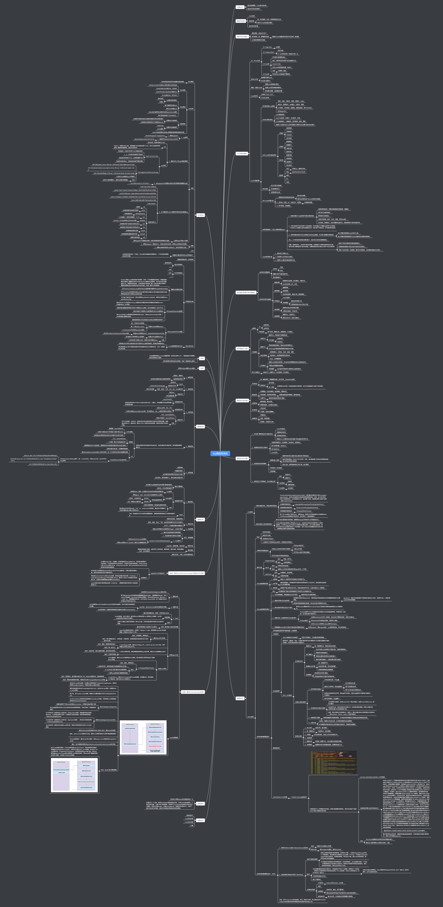
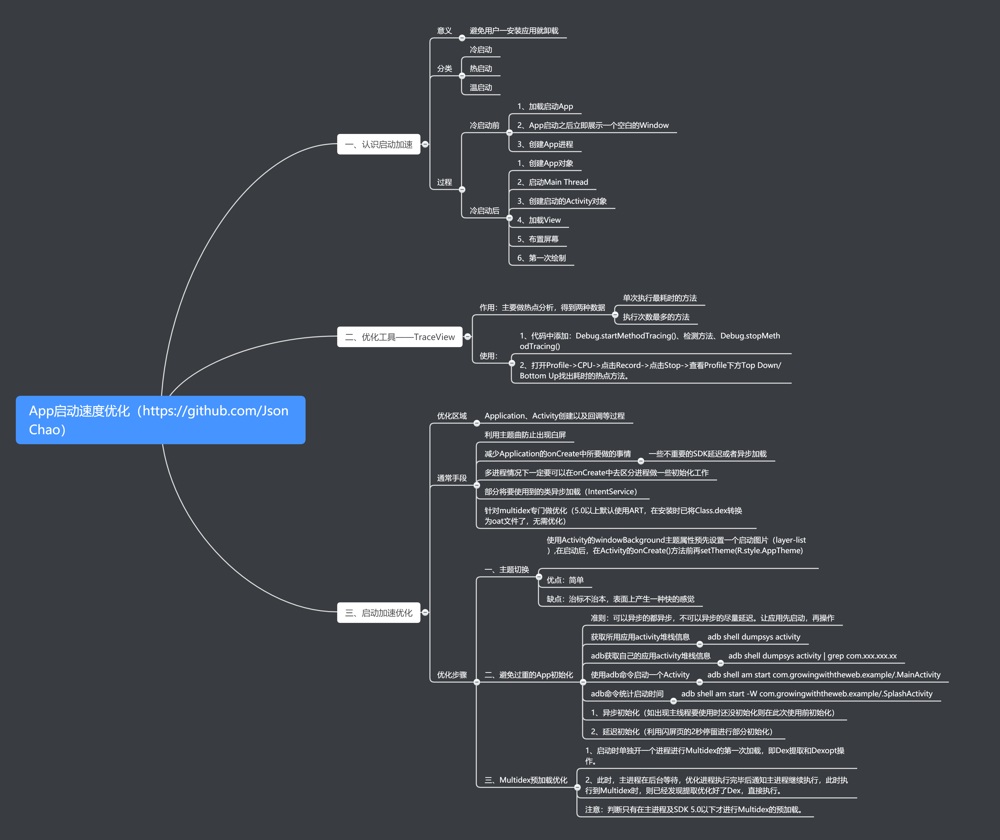
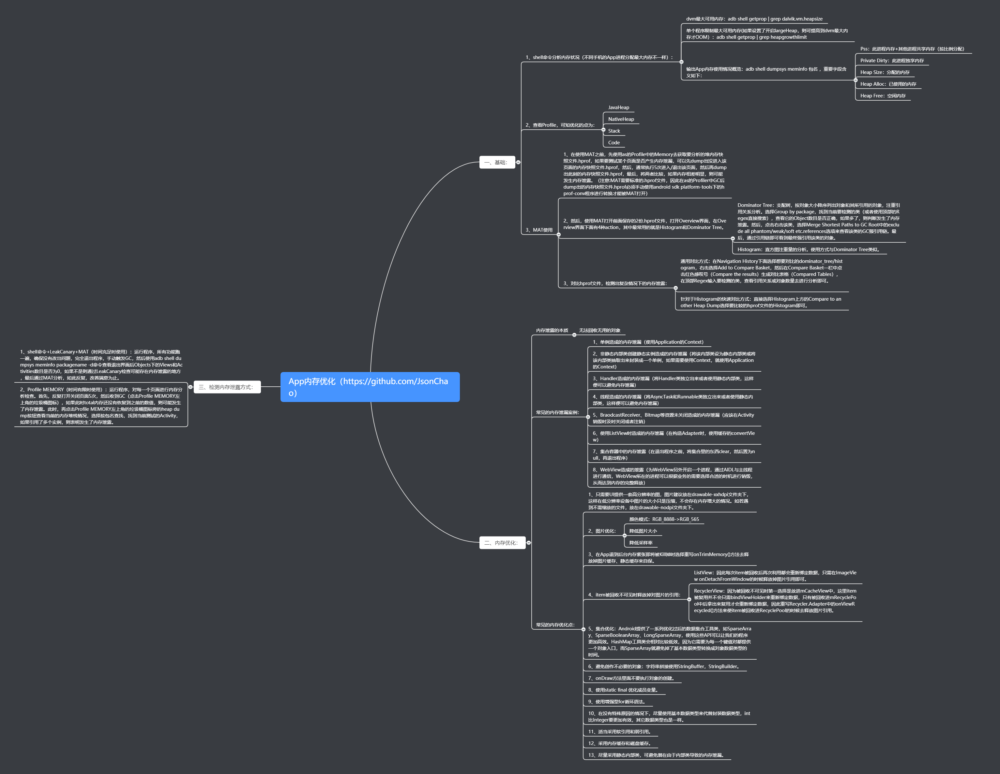
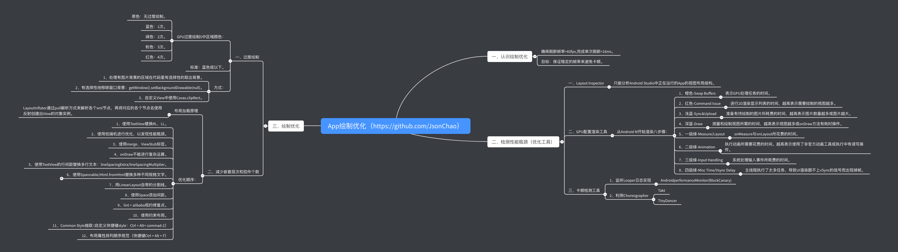
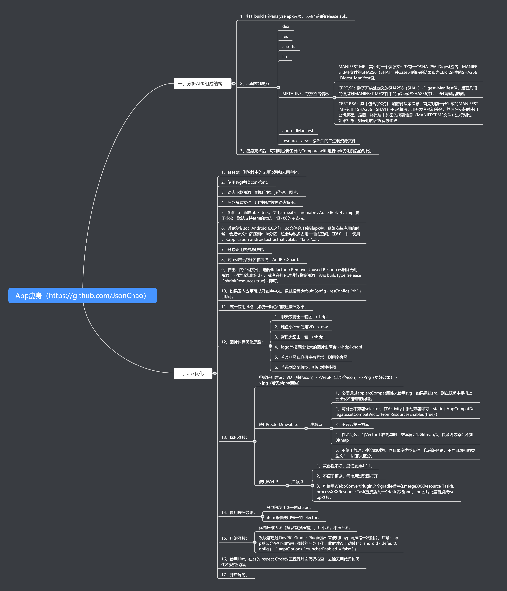
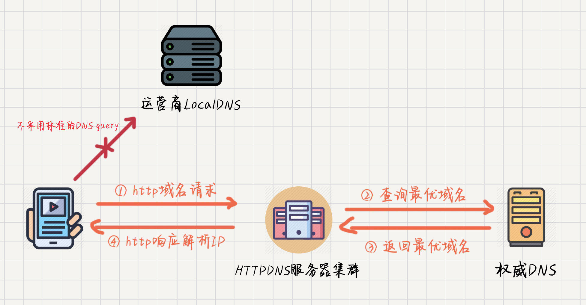
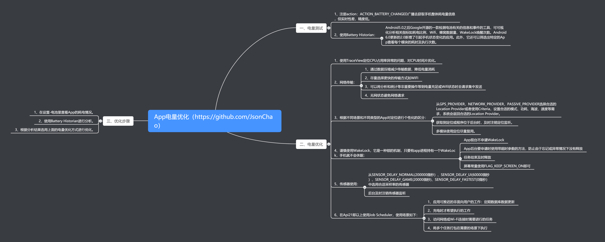

<h1 align="center">App稳定性优化</h1>

[TOC]

## 1、App稳定性优化

### 1、你们做了哪些稳定性方面的优化？

随着项目的逐渐成熟，用户基数逐渐增多，DAU持续升高，我们遇到了很多稳定性方面的问题，对于我们技术同学遇到了很多的挑战，用户经常使用我们的App卡顿或者是功能不可用，因此我们就针对稳定性开启了专项的优化，我们主要优化了三项：

- Crash专项优化（=>2)
- 性能稳定性优化（=>2)
- 业务稳定性优化（=>3)

通过这三方面的优化我们搭建了移动端的高可用平台。同时，也做了很多的措施来让App真正地实现了高可用。

### 2、性能稳定性是怎么做的？

- 全面的性能优化：启动速度、内存优化、绘制优化
- 线下发现问题、优化为主
- 线上监控为主
- Crash专项优化

我们针对启动速度，内存、布局加载、卡顿、瘦身、流量、电量等多个方面做了多维的优化。

我们的优化主要分为了两个层次，即线上和线下，针对于线下呢，我们侧重于发现问题，直接解决，将问题尽可能在上线之前解决为目的。而真正到了线上呢，我们最主要的目的就是为了监控，对于各个性能纬度的监控呢，可以让我们尽可能早地获取到异常情况的报警。

同时呢，对于线上最严重的性能问题性问题：Crash，我们做了专项的优化，不仅优化了Crash的具体指标，而且也尽可能地获取了Crash发生时的详细信息，结合后端的聚合、报警等功能，便于我们快速地定位问题。

### 3、业务稳定性如何保障？

- 数据采集 + 报警
- 需要对项目的主流程与核心路径进行埋点监控，
- 同时还需知道每一步发生了多少异常，这样，我们就知道了所有业务流程的转换率以及相应界面的转换率
- 结合大盘，如果转换率低于某个值，进行报警
- 异常监控 + 单点追查
- 兜底策略

移动端业务高可用它侧重于用户功能完整可用，主要是为了解决一些线上一些异常情况导致用户他虽然没有崩溃，也没有性能问题，但是呢，只是单纯的功能不可用的情况，我们需要对项目的主流程、核心路径进行埋点监控，来计算每一步它真实的转换率是多少，同时呢，还需要知道在每一步到底发生了多少异常。这样我们就知道了所有业务流程的转换率以及相应界面的转换率，有了大盘的数据呢，我们就知道了，如果转换率或者是某些监控的成功率低于某个值，那很有可能就是出现了线上异常，结合了相应的报警功能，我们就不需要等用户来反馈了，这个就是业务稳定性保障的基础。

同时呢，对于一些特殊情况，比如说，开发过程当中或代码中出现了一些catch代码块，捕获住了异常，让程序不崩溃，这其实是不合理的，程序虽然没有崩溃，当时程序的功能已经变得不可用，所以呢，这些被catch的异常我们也需要上报上来，这样我们才能知道用户到底出现了什么问题而导致的异常。此外，线上还有一些单点问题，比如说用户点击登录一直进不去，这种就属于单点问题，其实我们是无法找出其和其它问题的共性之处的，所以呢，我们就必须要找到它对应的详细信息。

最后，如果发生了异常情况，我们还采取了一系列措施进行快速止损。（=>4）

### 4、如果发生了异常情况，怎么快速止损？

- 功能开关
- 统跳中心
- 动态修复：热修复、资源包更新
- 自主修复：安全模式

首先，需要让App具备一些高级的能力，我们对于任何要上线的新功能，要加上一个功能的开关，通过配置中心下发的开关呢，来决定是否要显示新功能的入口。如果有异常情况，可以紧急关闭新功能的入口，那就可以让这个App处于可控的状态了。

然后，我们需要给App设立路由跳转，所有的界面跳转都需要通过路由来分发，如果我们匹配到需要跳转到有bug的这样一个新功能时，那我们就不跳转了，或者是跳转到统一的异常正处理中的界面。如果这两种方式都不可以，那就可以考虑通过热修复的方式来动态修复，目前热修复的方案其实已经比较成熟了，我们完全可以低成本地在我们的项目中添加热修复的能力，当然，如果有些功能是由RN或WeeX来实现就更好了，那就可以通过更新资源包的方式来实现动态更新。而这些如果都不可以的话呢，那就可以考虑自己去给应用加上一个自主修复的能力，如果App启动多次的话，那就可以考虑清空所有的缓存数据，将App重置到安装的状态，到了最严重的等级呢，可以阻塞主线程，此时一定要等App热修复成功之后才允许用户进入。

成功之后才允许用户进入。

需要更全面更深入的理解请查看[深入探索Android稳定性优化](https://juejin.im/post/5e69a4fd51882549003d2f0e)

## 2、App启动速度优化

### 1、启动优化是怎么做的？

- 分析现状、确认问题
- 针对性优化（先概括，引导其深入）
- 长期保持优化效果

在某一个版本之后呢，我们会发现这个启动速度变得特别慢，同时用户给我们的反馈也越来越多，所以，我们开始考虑对应用的启动速度来进行优化。然后，我们就对启动的代码进行了代码层面的梳理，我们发现应用的启动流程已经非常复杂，接着，我们通过一系列的工具来确认是否在主线程中执行了太多的耗时操作。

我们经过了细查代码之后，发现应用主线程中的任务太多，我们就想了一个方案去针对性地解决，也就是进行异步初始化。（引导=>第2题） 然后，我们还发现了另外一个问题，也可以进行针对性的优化，就是在我们的初始化代码当中有些的优先级并不是那么高，它可以不放在Application的onCreate中执行，而完全可以放在之后延迟执行的，因为我们对这些代码进行了延迟初始化，最后，我们还结合了idealHandler做了一个更优的延迟初始化的方案，利用它可以在主线程的空闲时间进行初始化，以减少启动耗时导致的卡顿现象。做完这些之后，我们的启动速度就变得很快了。

最后，我简单说下我们是怎么长期来保持启动优化的效果的。首先，我们做了我们的启动器，并且结合了我们的CI，在线上加上了很多方面的监控。（引导=> 第4题）

### 2、是怎么异步的，异步遇到问题没有？

- 体现演进过程
- 详细介绍启动器

我们最初是采用的普通的一个异步的方案，即new Thread + 设置线程优先级为后台线程的方式在Application的onCreate方法中进行异步初始化，后来，我们使用了线程池、IntentService的方式，但是，在我们应用的演进过程当中，发现代码会变得不够优雅，并且有些场景非常不好处理，比如说多个初始化任务直接的依赖关系，比如说某一个初始化任务需要在某一个特定的生命周期中初始化完成，这些都是使用线程池、IntentService无法实现的。所以说，我们就开始思考一个新的解决方案，它能够完美地解决我们刚刚所遇到的这些问题。

这个方案就是我们目前所使用的启动器，在启动器的概念中，我们将每一个初始化代码抽象成了一个Task，然后，对它们进行了一个排序，根据它们之间的依赖关系排了一个有向无环图，接着，使用一个异步队列进行执行，并且这个异步队列它和CPU的核心数是强烈相关的，它能够最大程度地保证我们的主线程和别的线程都能够执行我们的任务，也就是大家几乎都可以同时完成。

### 3、启动优化有哪些容易忽略的注意点？

- cpu time与wall time
- 注意延迟初始化的优化
- 介绍下黑科技

首先，在CPU Profiler和Systrace中有两个很重要的指标，即cpu time与wall time，我们必须清楚cpu time与wall time之间的区别，wall time指的是代码执行的时间，而cpu time指的是代码消耗CPU的时间，锁冲突会造成两者时间差距过大。我们需要以cpu time来作为我们优化的一个方向。

其次，我们不仅只追求启动速度上的一个提升，也需要注意延迟初始化的一个优化，对于延迟初始化，通常的做法是在界面显示之后才去进行加载，但是如果此时界面需要进行滑动等与用户交互的一系列操作，就会有很严重的卡顿现象，因此我们使用了idealHandler来实现cpu空闲时间来执行耗时任务，这极大地提升了用户的体验，避免了因启动耗时任务而导致的页面卡顿现象。

最后，对于启动优化，还有一些黑科技，首先，就是我们采用了类预先加载的方式，我们在MultiDex.install方法之后起了一个线程，然后用Class.forName的方式来预先触发类的加载，然后当我们这个类真正被使用的时候，就不用再进行类加载的过程了。同时，我们再看Systrace图的时候，有一部分手机其实并没有给我们应用去跑满cpu，比如说它有8核，但是却只给了我们4核等这些情况，然后，有些应用对此做了一些黑科技，它会将cpu的核心数以及cpu的频率在启动的时候去进行一个暴力的提升。

### 4、版本迭代导致的启动变慢有好的解决方式吗？

- 启动器
- 结合CI
- 监控完善

这种问题其实我们之前也遇到过，这的确非常难以解决。但是，我们后面对此进行了反复的思考与尝试，终于找到了一个比较好的解决方式。

首先，我们使用了启动器去管理每一个初始化任务，并且启动器中每一个任务的执行都是被其自动进行分配的，也就是说这些自动分配的task我们会尽量保证它会平均分配在我们每一个线程当中的，这和我们普通的异步是不一样的，它可以很好地缓解我们应用的启动变慢。

其次，我们还结合了CI，比如说，我们现在限制了一些类，如Application，如果有人修改了它，我们不会让这部分代码合并到主干分支或者是修改之后会有一些内部的工具如邮件的形式发送到我，然后，我就会和他确认他加的这些代码到底是耗时多少，能否异步初始化，不能异步的话就考虑延迟初始化，如果初始化时间太长，则可以考虑是否能进行懒加载，等用到的时候再去使用等等。

然后，我们会将问题尽可能地暴露在上线之前。同时，我们真正已经到了线上的一个环境下时，我们进行了监控的一个完善，我们不仅是监控了App的整个的启动时间，同时呢，我们也将每一个生命周期都进行了一个监控。比如说Application的onCreate与onAttachBaseContext方法的耗时，以及这两个生命周期之间间隔的时间，我们都进行了一个监控，如果说下一次我们发现了这个启动速度变慢了，我们就可以去查找到底是哪一个环节变慢了，我们会和以前的版本进行对比，对比完成之后呢，我们就可以来找这一段新加的代码。

### 5、[开放问题：如果提高启动速度，设计一个延迟加载框架或者sdk的方法和注意的问题](https://blog.csdn.net/dd864140130/article/details/53558011)

需要更全面更深入的理解请查看[深入探索Android启动速度优化](https://jsonchao.github.io/2019/11/10/深入探索Android启动速度优化/)

## 3、App内存优化

### 1、你们内存优化项目的过程是怎么做的？

**1、分析现状、确认问题**

我们发现我们的APP在内存方面可能存在很大的问题，第一方面的原因是我们的线上的OOM率比较高。第二点呢，我们经常会看到在我们的Android Studio的Profiler工具中内存的抖动比较频繁。这是我一个初步的现状，然后在我们知道了这个初步的现状之后，进行了问题的确认，我们经过一系列的调研以及深入研究，我们最终发现我们的项目中存在以下几点大问题，比如说：内存抖动、内存溢出、内存泄漏，还有我们的Bitmap使用非常粗犷。

**2、针对性优化**

比如内存抖动的解决 -> Memory Profiler工具的使用（呈现了锯齿张图形） -> 分析到具体代码存在的问题（频繁被调用的方法中出现了日志字符串的拼接），也可以说说内存泄漏或内存溢出的解决。

**3、效率提升**

为了不增加业务同学的工作量，我们使用了一些工具类或ARTHook这样的大图检测方案,没有任何的侵入性,同时,我们将这些技术教给了大家,然后让大家一起进行工作效率上的提升。

我们对内存优化工具Memory Profiler、MAT的使用比较熟悉，因此针对一系列不同问题的情况，我们写了一系列解决方案的文档，分享给大家。这样，我们整个团队成员的内存优化意识就变强了。

### 2、你做了内存优化最大的感受是什么？

**1、磨刀不误砍柴工**

我们一开始并没有直接去分析项目中代码哪些地方存在内存问题，而是先去学习了Google官方的一些文档，比如说学习了Memory Profiler工具的使用、学习了MAT工具的使用，在我们将这些工具学习熟练之后，当在我们的项目中遇到内存问题时，我们就能够很快地进行排查定位问题进行解决。

**2、技术优化必须结合业务代码**

一开始，我们做了整体APP运行阶段的一个内存上报，然后，我们在一些重点的内存消耗模块进行了一些监控，但是后面发现这些监控并没有紧密地结合我们的业务代码，比如说在梳理完项目之后，发现我们项目中存在使用多个图片库的情况，多个图片库的内存缓存肯定是不公用的，所以导致我们整个项目的内存使用量非常高。所以进行技术优化时必须结合我们的业务代码。

**3、系统化完善解决方案**

我们在做内存优化的过程中，不仅做了Android端的优化工作，还将我们Android端一些数据的采集上报到了我们的服务器，然后传到我们的后台，这样，方便我们的无论是Bug跟踪人员或者是Crash跟踪人员进行一系列问题的解决。

### 3、如何检测所有不合理的地方？

比如说大图片的检测，我们最初的一个方案是通过继承ImageView，重写它的onDraw方法来实现。但是，我们在推广它的过程中，发现很多开发人员并不接受，因为很多ImageView之前已经写过了，你现在让他去替换，工作成本是比较高的。所以说，后来我们就想，有没有一种方案可以免替换，最终我们就找到了ARTHook这样一个Hook的方案。

#### 如何避免内存抖动？（代码注意事项）

内存抖动是由于短时间内有大量对象进出新生区导致的，它伴随着频繁的GC，gc会大量占用ui线程和cpu资源，会导致app整体卡顿。

避免发生内存抖动的几点建议：

- 尽量避免在循环体内创建对象，应该把对象创建移到循环体外。
- 注意自定义View的onDraw()方法会被频繁调用，所以在这里面不应该频繁的创建对象。
- 当需要大量使用Bitmap的时候，试着把它们缓存在数组或容器中实现复用。
- 对于能够复用的对象，同理可以使用对象池将它们缓存起来。

需要更全面更深入的理解请查看[Android性能优化之内存优化](https://jsonchao.github.io/2019/08/18/Android性能优化之内存优化/)、[深入探索Android内存优化](https://jsonchao.github.io/2019/12/29/深入探索Android内存优化/)

## 4、App绘制优化

### 1、你在做布局优化的过程中用到了哪些工具？

我在做布局优化的过程中，用到了很多的工具，但是每一个工具都有它不同的使用场景，不同的场景应该使用不同的工具。下面我从线上和线下两个角度来进行分析。

比如说，我要统计线上的FPS，我使用的就是Choreographer这个类，它具有以下特性：

- 1、能够获取整体的帧率。
- 2、能够带到线上使用。
- 3、它获取的帧率几乎是实时的，能够满足我们的需求。

同时，在线下，如果要去优化布局加载带来的时间消耗，那就需要检测每一个布局的耗时，对此我使用的是AOP的方式，它没有侵入性，同时也不需要别的开发同学进行接入，就可以方便地获取每一个布局加载的耗时。如果还要更细粒度地去检测每一个控件的加载耗时，那么就需要使用LayoutInflaterCompat.setFactory2这个方法去进行Hook。

此外，我还使用了LayoutInspector和Systrace这两个工具，Systrace可以很方便地看到每帧的具体耗时以及这一帧在布局当中它真正做了什么。而LayoutInspector可以很方便地看到每一个界面的布局层级，帮助我们对层级进行优化。

### 2、布局为什么会导致卡顿，你又是如何优化的？

分析完布局的加载流程之后，我们发现有如下四点可能会导致布局卡顿：

- 1、首先，系统会将我们的Xml文件通过**IO**的方式映射的方式加载到我们的内存当中，而IO的过程可能会导致卡顿。
- 2、其次，布局加载的过程是一个反射的过程，而反射的过程也会可能会导致卡顿。
- 3、同时，这个布局的层级如果比较深，那么进行布局遍历的过程就会比较耗时。
- 4、最后，不合理的嵌套RelativeLayout布局也会导致重绘的次数过多。

对此，我们的优化方式有如下几种：

- 1、针对布局加载Xml文件的优化，我们使用了异步Inflate的方式，即AsyncLayoutInflater。它的核心原理是在子线程中对我们的Layout进行加载，而加载完成之后会将View通过Handler发送到主线程来使用。所以不会阻塞我们的主线程，加载的时间全部是在异步线程中进行消耗的。而这仅仅是一个从侧面缓解的思路。
- 2、后面，我们发现了一个从根源解决上述痛点的方式，即使用X2C框架。它的一个核心原理就是在开发过程我们还是使用的XML进行编写布局，但是在编译的时候它会使用APT的方式将XML布局转换为Java的方式进行布局，通过这样的方式去写布局，它有以下优点：1、它省去了使用IO的方式去加载XML布局的耗时过程。2、它是采用Java代码直接new的方式去创建控件对象，所以它也没有反射带来的性能损耗。这样就从根本上解决了布局加载过程中带来的问题。
- 3、然后，我们可以使用ConstraintLayout去减少我们界面布局的嵌套层级，如果原始布局层级越深，它能减少的层级就越多。而使用它也能避免嵌套RelativeLayout布局导致的重绘次数过多。
- 4、最后，我们可以使用AspectJ框架（即AOP）和LayoutInflaterCompat.setFactory2的方式分别去建立线下全局的布局加载速度和控件加载速度的监控体系。

### 3、做完布局优化有哪些成果产出？

- 1、首先，我们建立了一个体系化的监控手段，这里的体系还指的是线上加线下的一个综合方案，针对线下，我们使用AOP或者ARTHook，可以很方便地获取到每一个布局的加载耗时以及每一个控件的加载耗时。针对线上，我们通过Choreographer.getInstance().postFrameCallback的方式收集到了FPS，这样我们可以知道用户在哪些界面出现了丢帧的情况。
- 2、然后，对于布局监控方面，我们设立了FPS、布局加载时间、布局层级等一系列指标。
- 3、最后，在每一个版本上线之前，我们都会对我们的核心路径进行一次Review，确保我们的FPS、布局加载时间、布局层级等达到一个合理的状态。

### 4、你是怎么做卡顿优化的？

从项目的初期到壮大期，最后再到成熟期，每一个阶段都针对卡顿优化做了不同的处理。各个阶段所做的事情如下所示：

- 1、系统工具定位、解决
- 2、自动化卡顿方案及优化
- 3、线上监控及线下监测工具的建设

我做卡顿优化也是经历了一些阶段，最初我们的项目当中的一些模块出现了卡顿之后，我是通过系统工具进行了定位，我使用了Systrace，然后看了卡顿周期内的CPU状况，同时结合代码，对这个模块进行了重构，将部分代码进行了异步和延迟，在项目初期就是这样解决了问题。但是呢，随着我们项目的扩大，线下卡顿的问题也越来越多，同时，在线上，也有卡顿的反馈，但是线上的反馈卡顿，我们在线下难以复现，于是我们开始寻找自动化的卡顿监测方案，其思路是来自于Android的消息处理机制，主线程执行任何代码都会回到Looper.loop方法当中，而这个方法中有一个mLogging对象，它会在每个message的执行前后都会被调用，我们就是利用这个前后处理的时机来做到的自动化监测方案的。同时，在这个阶段，我们也完善了线上ANR的上报，我们采取的方式就是监控ANR的信息，同时结合了ANR-WatchDog，作为高版本没有文件权限的一个补充方案。在做完这个卡顿检测方案之后呢，我们还做了线上监控及线下检测工具的建设，最终实现了一整套完善，多维度的解决方案。

### 5、你是怎么样自动化的获取卡顿信息？

我们的思路是来自于Android的消息处理机制，主线程执行任何代码它都会走到Looper.loop方法当中，而这个函数当中有一个**mLogging**对象，它会在每个message处理前后都会被调用，而主线程发生了卡顿，那就一定会在dispatchMessage方法中执行了耗时的代码，那我们在这个message执行之前呢，我们可以在子线程当中去postDelayed一个任务，这个Delayed的时间就是我们设定的阈值，如果主线程的messaege在这个阈值之内完成了，那就取消掉这个子线程当中的任务，如果主线程的message在阈值之内没有被完成，那子线程当中的任务就会被执行，它会获取到当前主线程执行的一个堆栈，那我们就可以知道哪里发生了卡顿。

经过实践，我们发现这种方案获取的堆栈信息它不一定是准确的，因为获取到的堆栈信息它很可能是主线程最终执行的一个位置，而真正耗时的地方其实已经执行完成了，于是呢，我们就对这个方案做了一些优化，我们采取了**高频采集**的方案，也就是在一个周期内我们会多次采集主线程的堆栈信息，如果发生了卡顿，那我们就将这些卡顿信息压缩之后上报给APM后台，然后找出重复的堆栈信息，这些重复发生的堆栈大概率就是卡顿发生的一个位置，这样就提高了获取卡顿信息的一个准确性。

### 6、卡顿的一整套解决方案是怎么做的？

首先，针对卡顿，我们采用了**线上、线下工具相结合**的方式，线下工具我们册中医药尽可能早地去暴露问题，而针对于线上工具呢，我们侧重于监控的全面性、自动化以及异常感知的灵敏度。

同时呢，卡顿问题还有很多的难题。比如说**有的代码呢，它不到你卡顿的一个阈值，但是执行过多，或者它错误地执行了很多次，它也会导致用户感官上的一个卡顿**，所以我们在线下通过AOP的方式对常见的耗时代码进行了Hook，然后对一段时间内获取到的数据进行分析，我们就可以知道这些耗时的代码发生的时机和次数以及耗时情况。然后，看它是不是满足我们的一个预期，不满足预期的话，我们就可以直接到线下进行修改。同时，卡顿监控它还有很多容易被忽略的一个**盲区**，比如说生命周期的一个间隔，那对于这种特定的问题呢，我们就采用了编译时注解的方式修改了项目当中所有Handler的父类，对于其中的两个方法进行了监控，我们就可以知道主线程message的执行时间以及它们的调用堆栈。

对于**线上卡顿**，我们除了计算App的卡顿率、ANR率等常规指标之外呢，我们还计算了页面的秒开率、生命周期的执行时间等等。而且，在卡顿发生的时刻，我们也尽可能多地保存下来了当前的一个场景信息，这为我们之后解决或者复现这个卡顿留下了依据。

### 7、TextView setText耗时的原因，对TextView绘制层源码的理解？

### 8、开放问题：优化一个列表页面的打开速度和流畅性。

需要更全面更深入的理解请查看[Android性能优化之绘制优化](https://juejin.im/post/5e5f090de51d4526e4190980)、[深入探索Android布局优化（上）](https://juejin.im/post/5e1d15a851882536ca666a49)、[深入探索Android布局优化（下）](https://juejin.im/post/5e1e6cf66fb9a0301828ca0a)、[深入探索Android卡顿优化（上）](https://juejin.im/post/5e41fb7de51d4526c80e9108)、[深入探索Android卡顿优化（下）](https://juejin.im/post/5e49fc29e51d4526d326b056)

## 5、App瘦身

## 6、网络优化

### 1、移动端获取网络数据优化的几个点

- 1、连接复用：节省连接建立时间，如开启 keep-alive。于Android来说默认情况下HttpURLConnection和HttpClient都开启了keep-alive。只是2.2之前HttpURLConnection存在影响连接池的Bug。
- 2、请求合并：即将多个请求合并为一个进行请求，比较常见的就是网页中的CSS Image Sprites。如果某个页面内请求过多，也可以考虑做一定的请求合并。
- 3、减少请求数据的大小：对于post请求，body可以做gzip压缩的，header也可以做数据压缩(不过只支持http 2.0)。 返回数据的body也可以做gzip压缩，body数据体积可以缩小到原来的30%左右（也可以考虑压缩返回的json数据的key数据的体积，尤其是针对返回数据格式变化不大的情况，支付宝聊天返回的数据用到了）。
- 4、根据用户的当前的网络质量来判断下载什么质量的图片（电商用的比较多）。
- 5、使用HttpDNS优化DNS：DNS存在解析慢和DNS劫持等问题，DNS 不仅支持 UDP，它还支持 TCP，但是大部分标准的 DNS 都是基于 UDP 与 DNS 服务器的 53 端口进行交互。HTTPDNS 则不同，顾名思义它是利用 HTTP 协议与 DNS 服务器的 80 端口进行交互。不走传统的 DNS 解析，从而绕过运营商的 LocalDNS 服务器，有效的防止了域名劫持，提高域名解析的效率。

[参考文章](https://www.jianshu.com/p/940be2e758ee)

### 2、[客户端网络安全实现](http://mrpeak.cn/blog/encrypt/)

### 3、设计一个网络优化方案，针对移动端弱网环境。

## 7、App电量优化

## 8、安卓的安全优化

### 1、提高app安全性的方法？

### 2、安卓的app加固如何做？

### 3、安卓的混淆原理是什么？

### 4、谈谈你对安卓签名的理解。

## 参考

* [深入探索Android稳定性优化 (juejin.cn)](https://juejin.cn/post/6844903972587716621)
* [深入探索Android启动速度优化](https://jsonchao.github.io/2019/11/10/深入探索Android启动速度优化/)
* [Android性能优化之内存优化](https://jsonchao.github.io/2019/08/18/Android性能优化之内存优化/)
* [深入探索Android内存优化](https://jsonchao.github.io/2019/12/29/深入探索Android内存优化/)
* [Android性能优化之绘制优化](https://juejin.im/post/5e5f090de51d4526e4190980)
* [深入探索Android布局优化（上）](https://juejin.im/post/5e1d15a851882536ca666a49)
* [深入探索Android布局优化（下）](https://juejin.im/post/5e1e6cf66fb9a0301828ca0a)
* [深入探索Android卡顿优化（上）](https://juejin.im/post/5e41fb7de51d4526c80e9108)
* [深入探索Android卡顿优化（下）](https://juejin.im/post/5e49fc29e51d4526d326b056)
* 