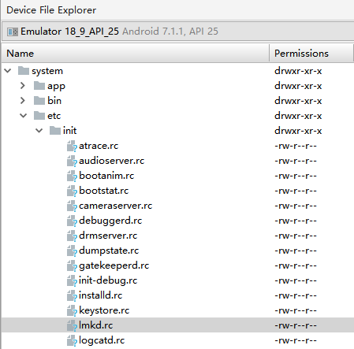
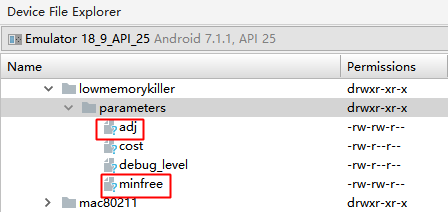
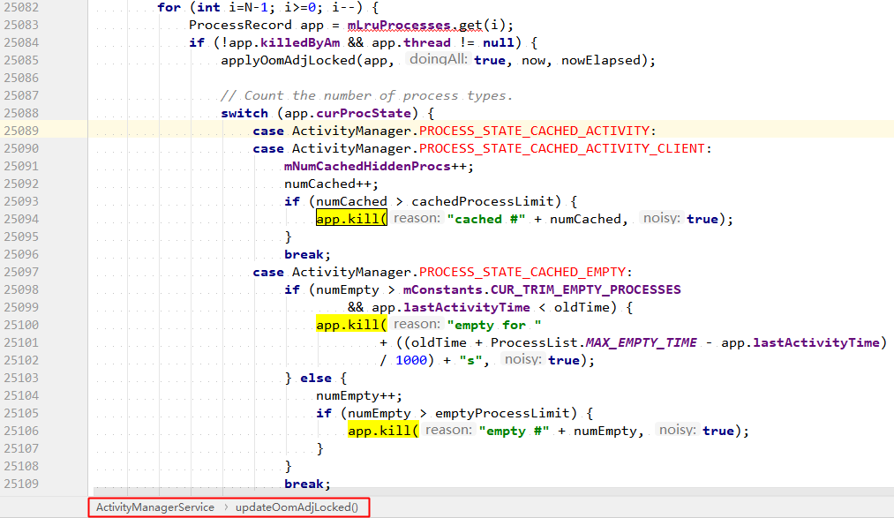

<h1 align="center">Low Memory Killer机制</h1>

[toc]

Andorid 的 Low Memory Killer 是在标准的 Linux Kernel 的 OOM Killer 基础上修改而来的一种内存管理机制。当系统内存不足时，杀死不重要的进程以释放其内存。LMK 的关键参数有 3 个：

- oom_adj：在 Framework 层使用，代表进程的优先级，数值越高，优先级越低，越容易被杀死。
- oom_adj threshold：在 Framework 层使用，代表 oom_adj 的内存阈值。Android Kernel 会定时检测当前剩余内存是否低于这个阀值，若低于则杀死 oom_adj ≥ 该阈值对应的 oom_adj 中，数值最大的进程，直到剩余内存恢复至高于该阀值的状态。
- oom_score_adj： 在 Kernel 层使用，由 oom_adj 换算而来，是杀死进程时实际使用的参数。

## 1. oom_adj

取值范围定义：

-> [ProcessList（AOSP, master 分支）](https://android.googlesource.com/platform/frameworks/base/+/master/services/core/java/com/android/server/am/ProcessList.java)

```java
    // These are the various interesting memory levels that we will give to
    // the OOM killer.  Note that the OOM killer only supports 6 slots, so we
    // can't give it a different value for every possible kind of process.
    private final int[] mOomAdj = new int[] {
            FOREGROUND_APP_ADJ, VISIBLE_APP_ADJ, PERCEPTIBLE_APP_ADJ,
            BACKUP_APP_ADJ, CACHED_APP_MIN_ADJ, CACHED_APP_MAX_ADJ
    };
```

以上仅是 LMK 杀死进程时使用的 adj，实际上该类中定义了更多的 adj：

| 常量定义               | 常量取值 | 含义                                               |
| :--------------------- | :------: | :------------------------------------------------- |
| NATIVE_ADJ             |  -1000   | native进程（不被系统管理）                         |
| SYSTEM_ADJ             |   -900   | 系统进程                                           |
| PERSISTENT_PROC_ADJ    |   -800   | 系统persistent进程，比如telephony                  |
| PERSISTENT_SERVICE_ADJ |   -700   | 关联着系统或persistent进程                         |
| FOREGROUND_APP_ADJ     |    0     | 前台进程                                           |
| VISIBLE_APP_ADJ        |   100    | 可见进程                                           |
| PERCEPTIBLE_APP_ADJ    |   200    | 可感知进程，比如后台音乐播放                       |
| BACKUP_APP_ADJ         |   300    | 备份进程                                           |
| HEAVY_WEIGHT_APP_ADJ   |   400    | 后台的重量级进程，system/rootdir/init.rc文件中设置 |
| SERVICE_ADJ            |   500    | 服务进程                                           |
| HOME_APP_ADJ           |   600    | Home进程                                           |
| PREVIOUS_APP_ADJ       |   700    | 上一个App的进程                                    |
| SERVICE_B_ADJ          |   800    | B List中的Service（较老的、使用可能性更小）        |
| CACHED_APP_MIN_ADJ     |   900    | 不可见进程的adj最小值                              |
| CACHED_APP_MAX_ADJ     |   906    | 不可见进程的adj最大值                              |
| UNKNOWN_ADJ            |   1001   | 一般指将要会缓存进程，无法获取确定值               |

以上常量在 Android 6.0（API23）及之前版本的取值范围为 [-17, 16]：[ProcessList（AOSP，marshmallow-release 分支）](https://android.googlesource.com/platform/frameworks/base/+/marshmallow-release/services/core/java/com/android/server/am/ProcessList.java)

规律：取值越大，重要性越低，进程越容易被杀死。

当触发 LowMemoryKiller 机制时，可根据日志中进程的 adj 值，具体分析进程是在什么状态下被杀死的。

## 2. oom_adj threshold

取值范围定义：

-> [ProcessList（AOSP, master 分支）](https://android.googlesource.com/platform/frameworks/base/+/master/services/core/java/com/android/server/am/ProcessList.java)

```java
    // The actual OOM killer memory levels we are using.
    private final int[] mOomMinFree = new int[mOomAdj.length];
```

具体取值由下面两个变量经过换算得到：

```java
    // These are the low-end OOM level limits.  This is appropriate for an
    // HVGA or smaller phone with less than 512MB.  Values are in KB.
    private final int[] mOomMinFreeLow = new int[] {
            12288, 18432, 24576,
            36864, 43008, 49152
    };
    // These are the high-end OOM level limits.  This is appropriate for a
    // 1280x800 or larger screen with around 1GB RAM.  Values are in KB.
    private final int[] mOomMinFreeHigh = new int[] {
            73728, 92160, 110592,
            129024, 147456, 184320
    };
```

数组初始化或更新的方法：

```java
    private void updateOomLevels(int displayWidth, int displayHeight, boolean write) {
        float scaleMem = ((float)(mTotalMemMb-350))/(700-350);
        int minSize = 480*800;  //  384000
        int maxSize = 1280*800; // 1024000  230400 870400  .264
        float scaleDisp = ((float)(displayWidth*displayHeight)-minSize)/(maxSize-minSize);
        float scale = scaleMem > scaleDisp ? scaleMem : scaleDisp;
        ...省略
        final boolean is64bit = Build.SUPPORTED_64_BIT_ABIS.length > 0;
        for (int i=0; i<mOomAdj.length; i++) {
            int low = mOomMinFreeLow[i];
            int high = mOomMinFreeHigh[i];
            if (is64bit) {
                // Increase the high min-free levels for cached processes for 64-bit
                if (i == 4) high = (high*3)/2;
                else if (i == 5) high = (high*7)/4;
            }
            mOomMinFree[i] = (int)(low + ((high-low)*scale));
        }
        ...省略
        if (write) {
            ByteBuffer buf = ByteBuffer.allocate(4 * (2*mOomAdj.length + 1));
            buf.putInt(LMK_TARGET);
            for (int i=0; i<mOomAdj.length; i++) {
                // 除以了 PAGE_SIZE，所以 minfree 中的单位为页，及 4KB
                buf.putInt((mOomMinFree[i]*1024)/PAGE_SIZE);
                buf.putInt(mOomAdj[i]);
            }
            // 向 lmkd 进程发送 LMK_TARGET 命令，
            // 将 oom_adj 阈值写入 "/sys/module/lowmemorykiller/parameters/minfree" 
            // 将 oom_adj 写入 "/sys/module/lowmemorykiller/parameters/adj"
            writeLmkd(buf);
            SystemProperties.set("sys.sysctl.extra_free_kbytes", Integer.toString(reserve));
        }
        // GB: 2048,3072,4096,6144,7168,8192
        // HC: 8192,10240,12288,14336,16384,20480
    }
```

在 ActivityManagerService 调用 updateConfiguration() 的过程中会调用该方法，根据设备的分辨率初始化或更新阈值的大小。

## 3. oom_score_adj

取值范围定义在 Linux Kernel 中：

-> [oom.h](https://elixir.bootlin.com/linux/v4.8/source/include/uapi/linux/oom.h#L9)

```c
#ifndef _UAPI__INCLUDE_LINUX_OOM_H
#define _UAPI__INCLUDE_LINUX_OOM_H

/*
 * /proc/<pid>/oom_score_adj set to OOM_SCORE_ADJ_MIN disables oom killing for
 * pid.
 */
#define OOM_SCORE_ADJ_MIN	(-1000)
#define OOM_SCORE_ADJ_MAX	1000

/*
 * /proc/<pid>/oom_adj set to -17 protects from the oom killer for legacy
 * purposes.
 */
#define OOM_DISABLE (-17)
/* inclusive */
#define OOM_ADJUST_MIN (-16)
#define OOM_ADJUST_MAX 15

#endif /* _UAPI__INCLUDE_LINUX_OOM_H */
```

oom_adj 到 oom_score_adj 的换算方法定义在 Linux Driver 中：

-> [lowmemorykiller.c](https://android.googlesource.com/kernel/msm/+/7ec9487de45c9faa7050ef0a2035951ec35974ac/drivers/staging/android/lowmemorykiller.c)

```c
static int lowmem_oom_adj_to_oom_score_adj(int oom_adj)
{
	if (oom_adj == OOM_ADJUST_MAX)
		return OOM_SCORE_ADJ_MAX;
	else
		return (oom_adj * OOM_SCORE_ADJ_MAX) / -OOM_DISABLE;
}
```

## 4. 工作流程

简述 LMK 的工作流程

### 4.1 启动 lmkd

lmkd 是由 init进程通过解析 init.rc 文件来启动的守护进程。lmkd 会创建名为 lmkd 的 socket，节点位于 /dev/socket/lmkd，该 socket 用于跟上层 framework 交互：




```
service lmkd /system/bin/lmkd
    class core
    group root readproc
    critical
    socket lmkd seqpacket 0660 system system
    writepid /dev/cpuset/system-background/tasks
```

lmkd 启动后，便会进入循环等待状态，接受来自 ProcessList 的三个命令：

| 命令           | 功能                 | 方法                           |
| :------------- | :------------------- | :----------------------------- |
| LMK_TARGET     | 初始化 oom_adj       | ProcessList::setOomAdj()       |
| LMK_PROCPRIO   | 更新 oom_adj         | ProcessList::updateOomLevels() |
| LMK_PROCREMOVE | 移除进程（暂时无用） | ProcessList::remove()          |

### 4.2 初始化 oom_adj

在 ActivityManagerService 调用 updateConfiguration() 的过程中会调用 ProcessList::updateOomLevels() 方法，根据设备的分辨率调整阈值的大小，通过 LMK_TARGET 命令，通知 lmkd（low memory killer deamon）分别向 /sys/module/lowmemorykiller/parameters 目录下的 minfree 和 adj 节点写入相应信息：



### 4.3 更新 oom_adj

在 ActivityManagerService 调用 applyOomAdjLocked() 的过程中会调用 ProcessList::setOomAdj() 方法，通过 LMK_PROCPRIO 命令，通知 lmkd 向 /proc/进程号/oom_score_adj 写入 oomadj：

```
D:\Android\projects\wanandroid_java>adb shell ps | findstr wanandroid
u0_a71    6461  1285  1177696 84024 SyS_epoll_ b131e424 S com.yuloran.wanandroid_java

D:\Android\projects\wanandroid_java>adb shell ls /proc/6461/
...省略
oom_adj
oom_score
oom_score_adj
...
```

ActivityManagerService 会根据当前应用进程托管组件（即四大组件）生命周期的变化，及时的调用 applyOomAdjLocked()，更新进程状态及该状态对应的 oom_adj。

进程状态表：

-> [ActivityManager.java（AOSP，branch：master）](https://android.googlesource.com/platform/frameworks/base/+/master/core/java/android/app/ActivityManager.java?autodive=0%2F%2F%2F%2F)

| 常量定义                               | 常量取值 | 含义                                                         |
| :------------------------------------- | :------: | :----------------------------------------------------------- |
| PROCESS_STATE_UNKNOWN                  |    -1    | 非真实的进程状态                                             |
| PROCESS_STATE_PERSISTENT               |    0     | persistent 系统进程                                          |
| PROCESS_STATE_PERSISTENT_UI            |    1     | persistent 系统进程，并正在执行UI操作                        |
| PROCESS_STATE_TOP                      |    2     | 拥有当前用户可见的 top Activity                              |
| PROCESS_STATE_FOREGROUND_SERVICE       |    3     | 托管一个前台 Service 的进程                                  |
| PROCESS_STATE_BOUND_FOREGROUND_SERVICE |    4     | 托管一个由系统绑定的前台 Service 的进程                      |
| PROCESS_STATE_IMPORTANT_FOREGROUND     |    5     | 对用户很重要的进程，用户可感知其存在                         |
| PROCESS_STATE_IMPORTANT_BACKGROUND     |    6     | 对用户很重要的进程，用户不可感知其存在                       |
| PROCESS_STATE_TRANSIENT_BACKGROUND     |    7     | Process is in the background transient so we will try to keep running. |
| PROCESS_STATE_BACKUP                   |    8     | 后台进程，正在运行backup/restore操作                         |
| PROCESS_STATE_SERVICE                  |    9     | 后台进程，且正在运行service                                  |
| PROCESS_STATE_RECEIVER                 |    10    | 后台进程，且正在运行receiver                                 |
| PROCESS_STATE_TOP_SLEEPING             |    11    | 与 PROCESS_STATE_TOP 一样，但此时设备正处于休眠状态          |
| PROCESS_STATE_HEAVY_WEIGHT             |    12    | 后台进程，但无法执行restore，因此尽量避免kill该进程          |
| PROCESS_STATE_HOME                     |    13    | 后台进程，且拥有 home Activity                               |
| PROCESS_STATE_LAST_ACTIVITY            |    14    | 后台进程，且拥有上一次显示的 Activity                        |
| PROCESS_STATE_CACHED_ACTIVITY          |    15    | 进程处于 cached 状态，且内含 Activity                        |
| PROCESS_STATE_CACHED_ACTIVITY_CLIENT   |    16    | 进程处于 cached 状态，且为另一个 cached 进程(内含 Activity)的 client 进程 |
| PROCESS_STATE_CACHED_RECENT            |    17    | 进程处于 cached 状态，且内含与当前最近任务相对应的 Activity  |
| PROCESS_STATE_CACHED_EMPTY             |    18    | 进程处于 cached 状态，且为空进程                             |
| PROCESS_STATE_NONEXISTENT              |    19    | 不存在的进程                                                 |

同一个进程，在不同状态下，其 oom_adj 是不一样的。

### 4.4 kill 并移除进程

在 ActivityManagerService 调用 updateOomAdjLocked() 时，会判断进程是否需要被杀死，若是，则调用 ProceeRecord::kill() 方法杀死该进程：



**注**: 目前 LMK_PROCREMOVE 命令暂时无用，即未执行有意义的代码。

## 参考

* [Android LowMemoryKiller原理分析](http://gityuan.com/2016/09/17/android-lowmemorykiller/)
* [Android LowMemoryKiller 简介](https://juejin.im/post/6844903750474137613)