<h1 align="center">内存问题及解决方案</h1>

[toc]

## 一、内存抖动

### 1. 定义：

>内存抖动是指内存忽高忽低，有短时间内快速的上升和下落的趋势，内存呈锯齿状。此时会频繁的GC，造成卡顿，甚至有OOM的可能.

- 频繁GC，内存曲线呈现锯齿状，会导致卡顿
- 频繁的创建对象会导致内存不足及碎片
- 不连续的内存碎片无法被释放，导致OOM

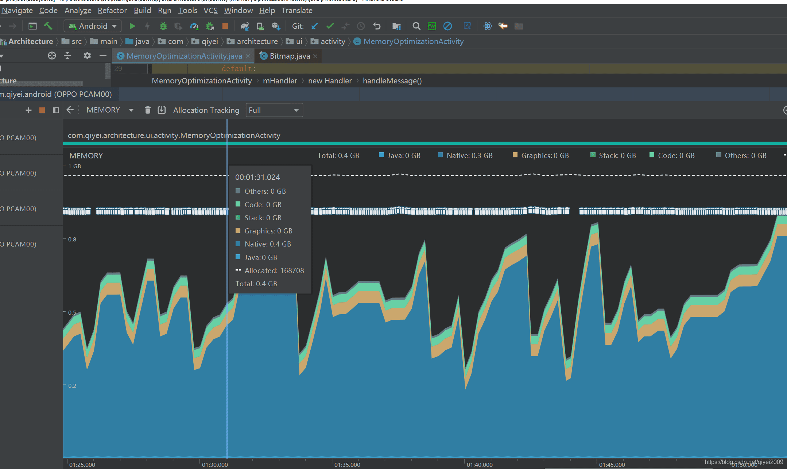
内存抖动越剧烈，说明单次分配的内存更大。

### 2. 内存抖动的定位

对于内存抖动的定位可直接使用Memory Profiler，原因是Memory Profiler可直接反应APP的内存占用，方便进行跟踪
发生内存抖动时，我们选择内存变化锯齿状的区域，然后在Memory Profiler可显示下面的图示
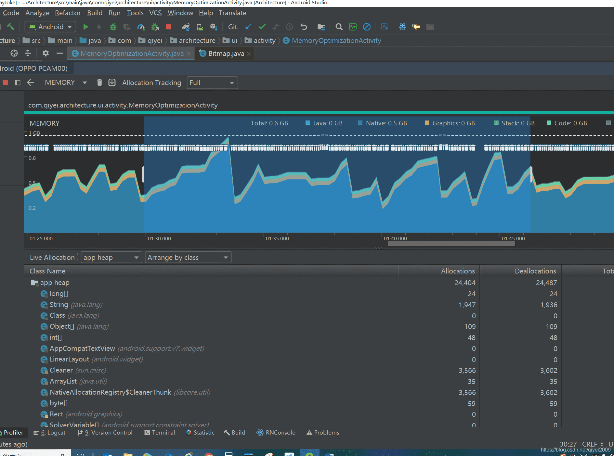
接着我们点击Allocations进行对象分配数量排序，之所以点击这个是因为一般在循环，频繁调用的地方可能发生内存抖动
例如普通循环中，Adapter的get View或者onBinderView等方法中可能会发生内存抖动
所以如果发生了内存抖动，大概率的是在对象数量多的地方出现了问题，因此先进行对象数量排序
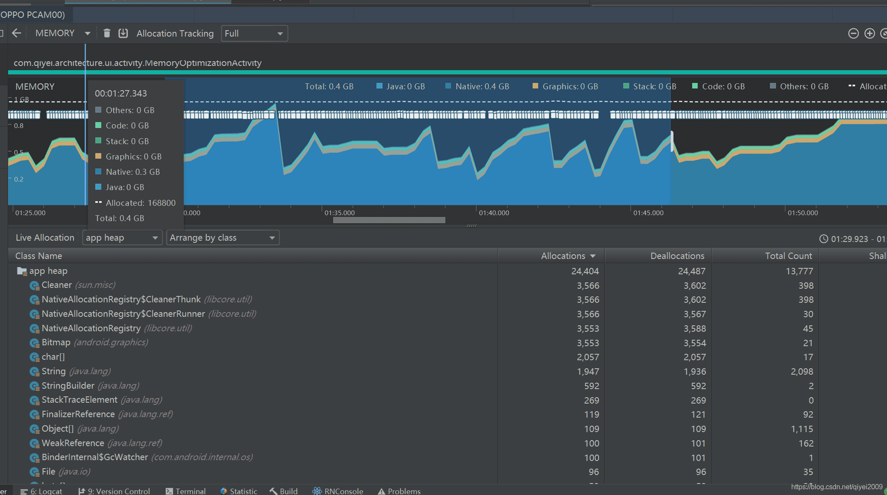
到这里我们看到排在前几位的对象分别是Cleaner，NativeAllocationRegistry，Bitmap，Chat[]，String等这几个对象。
Cleaner 是垃圾回收相关的对象，NativeAllocationRegistry 是内存分配相关的对象，我们查看其调用栈如下：
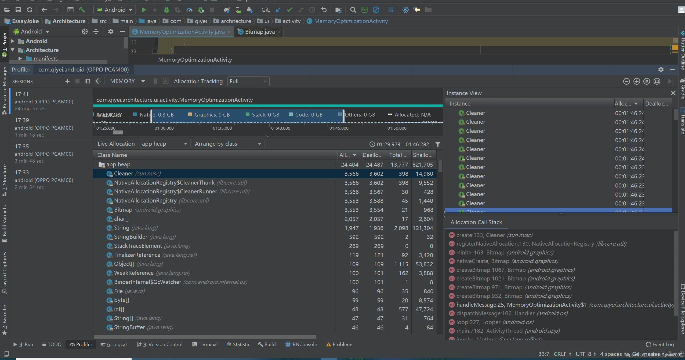

我们看到都和Bitmap创建相关，我们直接看Bitmap对象
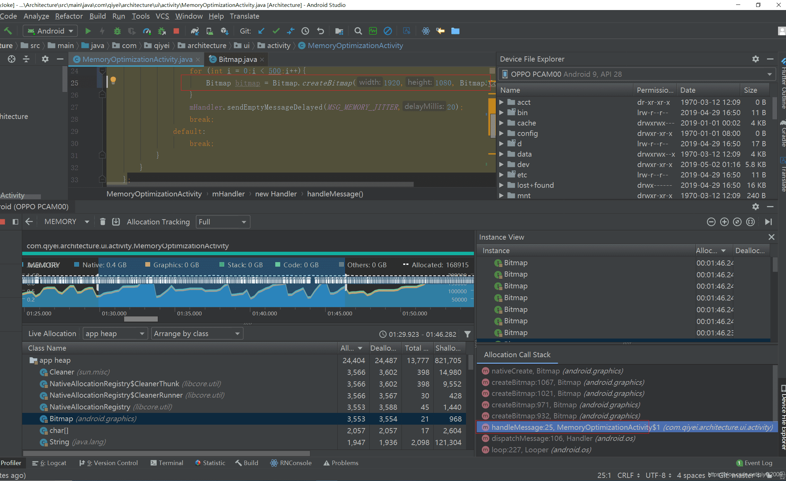

点击直接跳到Bitmap创建的地方，如下：

```java
    private Handler mHandler = new Handler() {
        @Override
        public void handleMessage(Message msg) {
            super.handleMessage(msg);
            switch (msg.what) {
                case MSG_MEMORY_JITTER:
                    for (int i = 0;i < 500;i++){
                        Bitmap bitmap = Bitmap.createBitmap(1920,1080, Bitmap.Config.ARGB_8888);
                    }
                    mHandler.sendEmptyMessageDelayed(MSG_MEMORY_JITTER,20);
                    break;
                default:
                    break;
            }
        }
    };
```

这里看到是一个循环，并且会重复调用，因此会产生内存抖动，这样就定位到了内存抖动的地方

### 3. 内存抖动的优化

前面的例子为了看到效果，所以举了一个Bitmap的例子，并且分配的内存也比较大。在实际的开发中内存抖动的幅度可能比较小，也可能由于项目复杂，对象数量很多，所以定位起来不是那么的迅速，不过定位的思路应该是一致的，那就是内存抖动时APP中对象的数量一定分配的比较多。当然还有一种内存抖动只有一个锯齿，这种情况可能是内存只分配了一个或者几个大的对象，这种情况通过对比锯齿前合锯齿上的内存分配也能对比出来

找到了内存抖动进行优化，一般来说就是避免在循环中创建内存抖动，可以使用对象复用等方式

### 4. 模拟内存抖动

```java
private static Handler mShakeHandler = new Handler() {
    @Override public void handleMessage(Message msg) {
        super.handleMessage(msg);
        // 频繁创建对象，模拟内存抖动
        for(int index = 0;index <= 100;index ++) {
            String strArray[] = new String[100000];
        }
        mShakeHandler.sendEmptyMessageDelayed(0,30);
    }
};
```

## 二、内存泄漏

### 1. 定义：

> 如果一个对象从根节点开始是可达的有引用的，但实际上它已经没有再使用了，是无用的，这样的对象就是内存泄漏的对象。

### 2. 原因：

> 在内存回收的时候，应该被回收的对象，还存在引用指向该对象导致系统对该对象回收失败。

### 3. 分类：

- 非静态内部类默认持有外部类的引用会导致内存泄漏
- Handler持有当前类的Context对象，导致对象无法释放
- 静态对象引用，无法释放对象导致内存泄漏
- 线程内引用有生命周期的外部对象
- 资源未关闭造成的内存泄漏
- 单例引用Context导致内存泄漏
- 广播未及时注销造成内存泄漏
- 集合类泄漏
- WebView内存泄漏

### 4. 内存泄漏举例及解决办法：

#### 4.1 非静态内部类默认持有外部类的引用会导致内存泄漏

静态内部类与非静态内部类之间存在一个最大的区别，就是非静态内部类在编译完成之后会隐含地保存着一个引用，该引用是指向创建它的外围类，但是静态内部类却没有。

代码：

```java
public class Outer {
    
    private void outerDo() {}
    
    class Inter {
        
        private void innerDo() {
            // 内部类可以直接访问外部类成员，原因在于隐式持有了一个外部类引用
            outerDo();
            // Outer.this 就是内部类隐式持有的外部类引用
            Outer.this.outerDo();
        }
    }
}
```

如果Inter的实例为静态的会导致内存泄漏。

解决方法：将Inter改成静态内部类

#### 4.2 Handler持有当前类的Context对象，导致对象无法释放

引用自：[Android内存优化：常见内存泄露及优化方案](https://www.jianshu.com/p/8fac127433ce)

例如：

```java
public class MainActivity extends AppCompatActivity {

    @Override
    protected void onCreate(Bundle savedInstanceState) {
        super.onCreate(savedInstanceState);
        setContentView(R.layout.activity_main);
        start();
    }

    private void start() {
        Message msg = Message.obtain();
        msg.what = 1;
        mHandler.sendMessage(msg);
    }

    private Handler mHandler = new Handler() {
        @Override
        public void handleMessage(Message msg) {
            if (msg.what == 1) {
                // 做相应逻辑
            }
        }
    };
}
```

熟悉Handler消息机制的都知道，mHandler会作为成员变量保存在发送的消息msg中，即msg持有mHandler的引用，而mHandler是Activity的非静态内部类实例，即mHandler持有Activity的引用，那么我们就可以理解为msg间接持有Activity的引用。msg被发送后先放到消息队列MessageQueue中，然后等待Looper的轮询处理（MessageQueue和Looper都是与线程相关联的，MessageQueue是Looper引用的成员变量，而Looper是保存在ThreadLocal中的）。那么当Activity退出后，msg可能仍然存在于消息对列MessageQueue中未处理或者正在处理，那么这样就会导致Activity无法被回收，以致发生Activity的内存泄露。

解决办法：静态内部类+弱引用

例如：

```java
public class MainActivity extends AppCompatActivity {

    private static class ParseHandler extends XyHandler<MainActivity> {

        private ParseHandler(MainActivity activity) {
            super(activity);
        }

        @Override
        protected void handleMessage(Message msg, MainActivity activity) {
            switch (msg.what) {
                case 0:
                    activity.doSomething();
                    break;
                default:
                    break;
            }
        }
    }

    private Handler mHandler;

    @Override
    protected void onCreate(Bundle savedInstanceState) {
        super.onCreate(savedInstanceState);
        setContentView(R.layout.activity_main);
        mHandler = new ParseHandler(this);
        start();
    }

    private void start() {
        Message msg = Message.obtain();
        msg.what = 1;
        mHandler.sendMessage(msg);
    }
    
    public void doSomething(){
        
    }
}

public abstract class XyHandler<T> extends Handler {

    private WeakReference<T> mWeak;

    public XyHandler(T t) {
        mWeak = new WeakReference<>(t);
    }

    @Override
    public void handleMessage(Message msg) {
        if (mWeak == null || mWeak.get() == null) {
            return;
        }
        handleMessage(msg, mWeak.get());
        super.handleMessage(msg);
    }

    protected abstract void handleMessage(Message msg, T t);

}

```

mHandler通过弱引用持有Activity时，在GC操作时，Activity就会被正常回收。

关于消息发送机制看博客：[Android系统源码分析--消息循环机制](http://codemx.cn/2017/07/13/AndroidOS004-HandleMessageLooper/)，上面的解决办法也可以在进一步封装，可以看博客最后的Handler正确使用方法。

关于强引用、软引用、弱引用、虚引用可以看文章：[内存泄漏：使用弱应用处理外部类引用](https://www.jianshu.com/p/26ca58b490f0)

#### 4.3 静态对象引用，无法释放对象导致内存泄漏

这种情况不常遇到，一般有些新手会犯这个错误。这种就是一些对象的引用是静态的，导致无法回收。

例如：

```java
public class MainActivity extends AppCompatActivity {

    privite static MainActivity mMainActivity;

    @Override
    protected void onCreate(Bundle savedInstanceState) {
        super.onCreate(savedInstanceState);
        setContentView(R.layout.activity_main);
        mMainActivity = this;
    }
}
```

还有自定义View或者ViewGroup中也是出现这种状况，导致内存无法释放，出现内存溢出。对于这种Context不能用静态引用，如果需要调用这些对象内的方法可以将对应方法代码提取出来。

#### 4.4 线程内引用有生命周期的外部对象

线程一般是指Thread和AsyncTask

Thread，例如：

```java
public class MainActivity extends AppCompatActivity {

    @Override
    protected void onCreate(Bundle savedInstanceState) {
        super.onCreate(savedInstanceState);
        setContentView(R.layout.activity_main);
        new Thread(new Runnable() {
            @Override
            public void run() {
                // 模拟相应耗时逻辑
                try {
                    Thread.sleep(2000);
                } catch (InterruptedException e) {
                    e.printStackTrace();
                }
            }
        }).start();
    }
}
```

AsyncTask，例如：

```java
public class MainActivity extends AppCompatActivity {

    @Override
    protected void onCreate(Bundle savedInstanceState) {
        super.onCreate(savedInstanceState);
        setContentView(R.layout.activity_main);
        new AsyncTask<Void, Void, Void>() {
            @Override
            protected Void doInBackground(Void... params) {
                // 模拟相应耗时逻辑
                try {
                    Thread.sleep(2000);
                } catch (InterruptedException e) {
                    e.printStackTrace();
                }
                return null;
            }
        }.execute();
    }
}
```

我们在刚开始写代码的时候都是像上面一样写线程和异步任务，但是这种方式使用Thread和AsyncTask都是匿名内部类对象，默认持有外部类Activity的引用，在Activity回收时可能会有Thread和AsyncTask没有执行完的情况，所以可能会造成内存泄漏。

#### 4.5 资源未关闭或者未释放造成的内存泄漏

IO流、File流或者数据库、Cursor等资源在使用完成后要及时关闭，如果没有及时关闭，会导致缓冲对象一直被占用，不能得到释放，发生内存泄漏。Bitmap未回收。

#### 4.6 单例引用Context导致内存泄漏

例如：

```java
public class AppSettings {

    private static AppSettings sInstance;
    private Context mContext;

    private AppSettings(Context context) {
        this.mContext = context;
    }

    public static AppSettings getInstance(Context context) {
        if (sInstance == null) {
            sInstance = new AppSettings(context);
        }
        return sInstance;
    }
}
```

单例模式的生命周期会和整个应用的生命周期一样，如果在使用单例模式时传入的是Activity或者Service等声明周期短于Application的声明周期时，都会造成内存泄漏。因此我们传入的Context应该是Application的Context，这样生命周期就和Application的声明周期一样，避免造成内存泄漏

#### 4.7 广播未及时注销造成内存泄漏

```java
public class MainActivity extends AppCompatActivity {

    @Override
    protected void onCreate(Bundle savedInstanceState) {
        super.onCreate(savedInstanceState);
        setContentView(R.layout.activity_main);
        this.registerReceiver(mReceiver, new IntentFilter());
    }

    private BroadcastReceiver mReceiver = new BroadcastReceiver() {
        @Override
        public void onReceive(Context context, Intent intent) {
            // 接收到广播需要做的逻辑
        }
    };

    @Override
    protected void onDestroy() {
        super.onDestroy();
        this.unregisterReceiver(mReceiver);
    }
}
```

广播是非静态内部类，会持有Activity引用，而广播注册会将广播对象注册到系统内部，如果没有取消注册，那么系统中会存在Activity的应用，因此不能释放Activity，造成内存泄漏。

解决办法：就是在OnDestroy方法中取消注册广播。

#### 4.8 集合类泄漏

集合类如果仅仅有添加元素的方法，而没有相应的删除机制，导致内存被占用。如果这个集合类是全局性的变量 (比如类中的静态属性，全局性的 map 等即有静态引用或 final 一直指向它)，那么没有相应的删除机制，很可能导致集合所占用的内存只增不减。

#### 4.9 WebView内存泄漏

原文里说的webview引起的内存泄漏主要是因为org.chromium.android_webview.AwContents 类中注册了component callbacks，但是未正常反注册而导致的。

org.chromium.android_webview.AwContents 类中有这两个方法 onAttachedToWindow 和 onDetachedFromWindow；系统会在attach和detach处进行注册和反注册component callback；
 在onDetachedFromWindow() 方法的第一行中：

```kotlin
if (isDestroyed()) return;， 
```

如果 isDestroyed() 返回 true 的话，那么后续的逻辑就不能正常走到，所以就不会执行unregister的操作；我们的activity退出的时候，都会主动调用 WebView.destroy() 方法，这会导致 isDestroyed() 返回 true；destroy()的执行时间又在onDetachedFromWindow之前，所以就会导致不能正常进行unregister()。
 然后解决方法就是：**让onDetachedFromWindow先走，在主动调用destroy()之前，把webview从它的parent上面移除掉。**

```php
ViewParent parent = mWebView.getParent();
if (parent != null) {
    ((ViewGroup) parent).removeView(mWebView);
}
mWebView.destroy();
```

完整的activity的onDestroy()方法：

```java
@Override
protected void onDestroy() {
    if( mWebView!=null) {
        // 如果先调用destroy()方法，则会命中if (isDestroyed()) return;这一行代码，需要先onDetachedFromWindow()，再
        // destory()
        ViewParent parent = mWebView.getParent();
        if (parent != null) {
            ((ViewGroup) parent).removeView(mWebView);
        }
        mWebView.stopLoading();
        // 退出时调用此方法，移除绑定的服务，否则某些特定系统会报错
        mWebView.getSettings().setJavaScriptEnabled(false);
        mWebView.clearHistory();
        mWebView.clearView();
        mWebView.removeAllViews();
        mWebView.destroy();
    }
    super.on Destroy();
}
```

####  4.10 内存泄漏检测工具

LeakCanary，TraceView，Systrace，Android Lint和Memory Monitor+mat

详见：[内存优化工具](./7.内存优化工具.md)

### 5. 定位分析

通过Memory Profiler工具查看内存曲线，发现内存在不断的上升


如果想分析定位具体发生内存泄露位置需要借助MAT工具

首先生成hprof文件

点击dump将当前内存信息转成hprof文件，需要对生成的文件转换成MAT可读取文件

执行一下转换命令（Android/sdk/platorm-tools路径下）

hprof-conv 刚刚生成的hprof文件 memory-mat.hprof

使用mat打开刚刚转换的hprof文件


点击Historygram，搜索MemoryLeakActivity


可以看到有8个MemoryLeakActivity未释放


查看所有引用对象


查看到GC Roots的引用链


可以看到GC Roots是CallBackManager


解决问题，当Activity销毁时将当前引用移除

```java
@Override
protected void onDestroy() {
    super.onDestroy();
    CallBackManager.removeCallBack(this);
}
```

#### 5.1 MAT分析工具

##### 5.1.1 Overview

当前内存整体信息


##### 5.1.2 Histogram

列举对象所有的实例及实例所占大小，可按package排序


可以查看应用包名下Activity存在实例个数，可以查看是否存在内存泄露，这里发现内存中有8个Activity实例未释放


查看未被释放的Activity的引用链


##### 5.1.3 Dominator_tree

当前所有实例的支配树，和Histogram区别时Histogram是类维度，dominator_tree是实例维度，可以查看所有实例的所占百分比和引用链


##### 5.1.4 SQL

通过sql语句查询相关类信息


##### 5.1.5 Thread_overview

查看当前所有线程信息


##### 5.1.6 Top Consumers

通过图形方式展示占用内存较高的对象，对降低内存栈优化可用内存比较有帮助


##### 5.1.7 Leak Suspects

内存泄露分析页面


直接定位到内存泄露位置


#### 5.2 通过ARTHook检测不合理图片

##### 5.2.1 获取Bitmap占用内存

- 通过getByteCount方法，但是需要在运行时获取
- width * height * 一个像素所占内存 * 图片所在资源目录压缩比

##### 5.2.2 检测大图

当图片控件load图片大小超过控件自身大小时会造成内存浪费，所以检测出不合理图片对内存优化是很重要的。

**ARTHook方式检测不合理图片**

通过ARTHook方法可以优雅的获取不合理图片，侵入性低，但是因为兼容性问题一般在线下使用。

引入epic开源库

```
implementation 'me.weishu:epic:0.3.6'
```

实现Hook方法

```java
public class CheckBitmapHook extends XC_MethodHook {
    @Override protected void afterHookedMethod(MethodHookParam param) throws Throwable {
        super.afterHookedMethod(param);
        ImageView imageView = (ImageView)param.thisObject;
        checkBitmap(imageView,imageView.getDrawable());
    }
    private static void checkBitmap(Object o,Drawable drawable) {
        if(drawable instanceof BitmapDrawable && o instanceof View) {
            final Bitmap bitmap = ((BitmapDrawable) drawable).getBitmap();
            if(bitmap != null) {
                final View view = (View)o;
                int width = view.getWidth();
                int height = view.getHeight();
                if(width > 0 && height > 0) {
                    if(bitmap.getWidth() > (width <<1) && bitmap.getHeight() > (height << 1)) {
                        warn(bitmap.getWidth(),bitmap.getHeight(),width,height,
                                new RuntimeException("Bitmap size is too large"));
                    }
                } else {
                    final Throwable stacktrace = new RuntimeException();
                    view.getViewTreeObserver().addOnPreDrawListener(
                            new ViewTreeObserver.OnPreDrawListener() {
                                @Override public boolean onPreDraw() {
                                    int w = view.getWidth();
                                    int h = view.getHeight();
                                    if(w > 0 && h > 0) {
                                        if (bitmap.getWidth() >= (w << 1)
                                                && bitmap.getHeight() >= (h << 1)) {
                                            warn(bitmap.getWidth(), bitmap.getHeight(), w, h, stacktrace);
                                        }
                                        view.getViewTreeObserver().removeOnPreDrawListener(this);
                                    }
                                    return true;
                                }
                            });
                }
            }
        }
    }
    private static void warn(int bitmapWidth, int bitmapHeight, int viewWidth, int viewHeight, Throwable t) {
        String warnInfo = new StringBuilder("Bitmap size too large: ")
                .append("\n real size: (").append(bitmapWidth).append(',').append(bitmapHeight).append(')')
                .append("\n desired size: (").append(viewWidth).append(',').append(viewHeight).append(')')
                .append("\n call stack trace: \n").append(Log.getStackTraceString(t)).append('\n')
                .toString();
        LogUtils.i(warnInfo);
```

Application初始化时注入Hook

   ```java
DexposedBridge.hookAllConstructors(ImageView.class, new XC_MethodHook() {
    @Override protected void afterHookedMethod(MethodHookParam param) throws Throwable {
        super.afterHookedMethod(param);
        DexposedBridge.findAndHookMethod(ImageView.class,"setImageBitmap", Bitmap.class,
                new CheckBitmapHook());
    }
});
   ```

#### 5.3 线上内存监控

##### 5.3.1 常规方案

**常规方案一**

在特定场景中获取当前占用内存大小，如果当前内存大小超过系统最大内存80%，对当前内存进行一次Dump（Debug.dumpHprofData()），选择合适时间将hprof文件进行上传，然后通过MAT工具手动分析该文件。

缺点：

- Dump文件比较大，和用户使用时间、对象树正相关
- 文件较大导致上传失败率较高，分析困难

**常规方案二**

将LeakCannary带到线上，添加预设怀疑点，对怀疑点进行内存泄露监控，发现内存泄露回传到server。

缺点：

- 通用性较低，需要预设怀疑点，对没有预设怀疑点的地方监控不到
- LeakCanary分析比较耗时、耗内存，有可能会发生OOM

##### 5.3.2 LeakCannary定制改造

1. 将需要预设怀疑点改为自动寻找怀疑点，自动将前内存中所占内存较大的对象类中设置怀疑点。
2. LeakCanary分析泄露链路比较慢，改造为只分析Retain size大的对象。
3. 分析过程会OOM，是因为LeakCannary分析时会将分析对象全部加载到内存当中，我们可以记录下分析对象的个数和占用大小，对分析对象进行裁剪，不全部加载到内存当中。

##### 5.3.4 完整方案

1. 监控常规指标：待机内存、重点模块占用内存、OOM率
2. 监控APP一个生命周期内和重点模块界面的生命周期内的GC次数、GC时间等
3. 将定制的LeakCanary带到线上，自动化分析线上的内存泄露

## 三、内存溢出

### 1. 原因：

> 内存占用不断增大不能及时释放，导致内存值大于系统给与单个程序的内存极限从而导致内存溢出

### 2. 导致内存溢出常见情况

* 上面内存泄漏问题导致内存不能释放从而导致内存溢出
* Android系统内存杀手Bitmap
* 多次重复创建对象
* 无限循环创建对象

### 3. 内存溢出解决办法

* 上面内存泄漏问题导致内存不能释放从而导致内存溢出：这个主要针对上面内存泄漏的解决办法进行处理。
* Android系统内存杀手Bitmap：第一：及时销毁；第二：采用小分辨率加载图片，减小内存占用；第三：采用软引用，可以在内存不足时被系统回收。
* 多次创建对象：在onDraw或者dispatchDraw方法中创建对象，导致对象多次创建，大量占用内存。解决办法：将对象的创建放到构造函数中进行或者只在对象为空时创建，非空时复用对象
* 无限循环创建对象：方法嵌套导致无限循环；刷新View视图导致无限刷新；在无限循环过程中创建对象导致内存溢出。

### 4. OutOfMemoryError异常

* 详细内容参考：[OutOfMemoryError异常](./23.异常.md)

### 5. OOM案例分析

在Android（Java）开发中，基本都会遇到`java.lang.OutOfMemoryError`（本文简称OOM），这种错误解决起来相对于一般的Exception或者Error都要难一些，主要是由于错误产生的root cause不是很显而易见。由于没有办法能够直接拿到用户的内存dump文件，如果错误发生在线上的版本，分析起来就会更加困难。本文从一个具体的案例切入，介绍OOM分析的思路及相关工具的使用。

#### 案例背景

在美团App 7.4~7.7版本期间，美食业务的OOM数量居高不下，远高于历史水平，主要都是DECODE本地的资源出错。

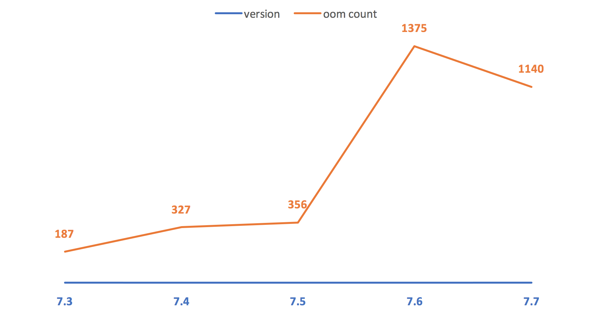

图中OOM数量为各版本发版后第一个月的统计量，包含新发版本及历史版本。对比了同时期其他业务的情况，也有类似OOM。由于美食业务的访问量占美团App的比重较大，因此，OOM的数量相对其他业务也多一些。

#### 思路方案

在问题较为严重的7.6~7.7版本期间，团队对OOM频现的原因有过各种猜测。笔者怀疑过是否是业务上某些修改引起的，例如上图尺寸变大，或者是由页面模块加载方式引起的等等。但这些与OOM问题出现的时间并不吻合。其次也怀疑过是否由某些ROM的Bug导致，但此推断缺乏有力的证据支撑。因此，要找到OOM的root cause，根本途径还是找到谁占的内存最多，然后再根据具体case具体分析，为什么占了这么多。

##### 采集用户手机内存信息

要分析内存的占用，需要内存的dump文件，但是dump文件一般都比较大，让用户配合上传dump文件不合适。所以希望能够运行时采集一些内存的特征然后随着crash日志上报上来。当用户发生OOM时，dump出用户的内存，然后基于`com.squareup.haha:haha:2.0.3`分析，得到一些关键数据（内存占用最多的实例及所占比例等）。但这个方案很快就被证明是不可行的。主要基于下面几个原因：

- 需要引入新的库。
- dump和分析内存都很耗时，效率难以接受。 
- OOM时内存已经几乎耗尽，再加载内存dump文件并分析会导致二次OOM，得不偿失。

##### 模拟复现OOM

采集用户手机内存信息的方案不可行，那么只能采取复现用户场景的方式。由于发生OOM时，用户操作路径的不确定性，无法精确复现线上的OOM，因此采取模拟复现的方式，最终发生OOM时的栈信息基本一致即可。为了能够尽量模拟用户发生OOM的场景，需要基本条件基本一致，即用户使用的手机的各种相关参数。

###### 挖掘OOM特征

分析7.4以来的OOM，列出发生OOM的机器的特征，主要是内存和分辨率，适当考虑其它因素例如系统版本。

| 机型         | 内存 | 分辨率    | OS    | stack log                                                    |
| ------------ | ---- | --------- | ----- | ------------------------------------------------------------ |
| OPPO N1(T/W) | 2G   | 1920*1080 | 4.2.2 | java.lang.OutOfMemoryError<br>at android.graphics.BitmapFactory.nativeDecodeAsset(Native Method) |
| HM 2LTE-CMCC | 1G   | 1280*720  | 4.4.4 | java.lang.OutOfMemoryError<br>at android.graphics.BitmapFactory.nativeDecodeAsset(Native Method) |
| Newman CM810 | 2G   | 1920*1080 | 4.4.4 | java.lang.OutOfMemoryError<br>at android.graphics.BitmapFactory.nativeDecodeAsset(Native Method) |
| LGL22        | 2G   | 1830*1080 | 4.2.2 | java.lang.OutOfMemoryError<br>at android.graphics.BitmapFactory.nativeDecodeAsset(Native Method) |
| OPPO X909    | 2G   | 1920*1080 | 4.2.2 | java.lang.OutOfMemoryError<br>at android.graphics.BitmapFactory.nativeDecodeAsset(Native Method) |
| Lenovo K900  | 2G   | 1920*1080 | 4.2.2 | java.lang.OutOfMemoryError<br>at android.graphics.BitmapFactory.nativeDecodeAsset(Native Method) |
| GiONEE E6    | 2G   | 1920*1080 | 4.2.1 | java.lang.OutOfMemoryError<br>at android.graphics.BitmapFactory.nativeDecodeAsset(Native Method) |
这些特征可以总结为：内存一般，分辨率偏高，OOM的堆栈log基本一致。其中，OPPO N1(T/W)上所发生的OOM比重较高，约为65%，因此选定这款机器作为复现OOM的机器。

###### 关键数据（内存dump文件）

需要复现OOM然后获取内存dump。思路是采取内存压力测试，让问题暴露的快速且充分。具体方案为： 

- 选取图片资源多且较为复杂的页面，比如美食的POI详情页。 
- 加载30次该页面，为了增加OOM的几率，30个POI页面的ID是不同的。

OOM发生后，使用Android Studio自带的Android Monitor dump出HPROF文件，然后使用SDK中的hprof-conv（位于sdk_root/platform-tools）工具转换为标准的Java堆转储文件格式，这样可以使用MAT（Eclipse Memory Analyzer）继续分析。

切到histogram视图，按shadow heap降序排列。

选取byte数组，右击->list objects->with incoming references，降序排列可以看到有很多大小一致的byte[]实例。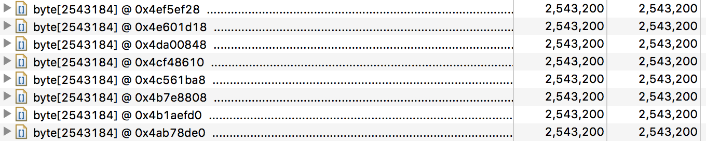

右击其中一个数组->Path to GC Roots-> exclude xxx references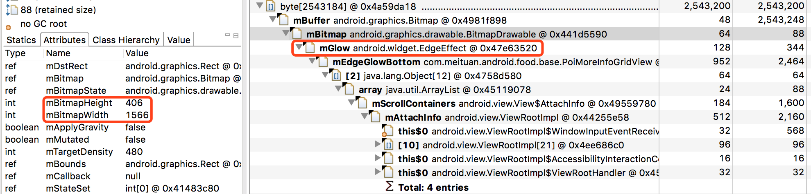

如上图所示，这些byte[]都是系统的EdgeEffect的drawable所持有，drawable对应的bitmap占用的空间为1566 * 406 * 4 = 2543184，与byte数组的大小一致。

再看另外一个：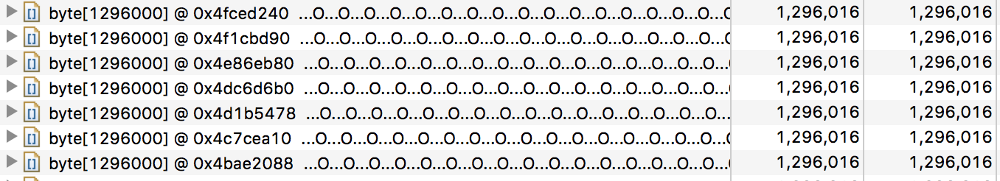

这些byte[]是被App的一个背景图所持有，如下图：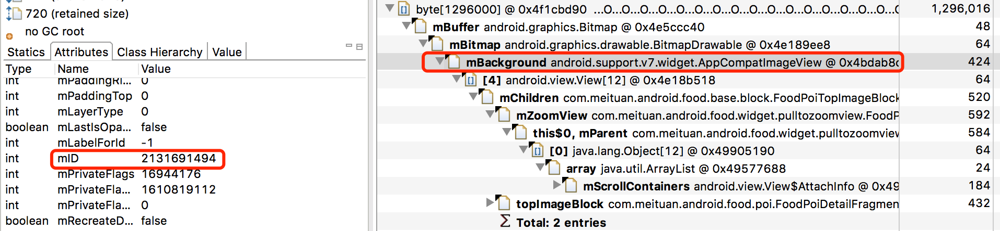

通过ImageView的ID（如图）及build目录下的R.txt反查可知该ImageView的ID名称，即可知其设置的背景图的大小为720 * 200（xhdpi），加载到内存并考虑density，size刚好是1080 * 300 * 4 = 1296000，与byte数组大小一致。

###### 数据分析

为什么会出现这些大小一致的byte数组，或者说，为什么会创建多份EdgeEffect的drawable？查看EdgeEffect的源码（4.2.2）可知，其drawable成员也是通过`Resources.getDrawable`系统调用获取的。

```java
/**
 * Construct a new EdgeEffect with a theme appropriate for the provided context.
 * @param context Context used to provide theming and resource information for the EdgeEffect
 */
public EdgeEffect(Context context) {
    final Resources res = context.getResources();
    mEdge = res.getDrawable(R.drawable.overscroll_edge);
    mGlow = res.getDrawable(R.drawable.overscroll_glow);

        ******

    mMinWidth = (int) (res.getDisplayMetrics().density * MIN_WIDTH + 0.5f);
    mInterpolator = new DecelerateInterpolator();
}
```

ImageView(View)获取background对应的drawable的过程类似。

```java
for (int i = 0; i < N; i++) {
    int attr = a.getIndex(i);
    switch (attr) {
        case com.android.internal.R.styleable.View_background:
            background = a.getDrawable(attr); // TypedArray.getDrawable
            break;
        ******
    }
}
```

不论是Resources.getDrawable还是TypedArray.getDrawable，最终都会调用Resources.loadDrawable。继续看`Resources.loadDrawable`的源码，发现的确是使用了缓存。对于同一个drawable资源，系统只会加载一次，之后都会从缓存去取。

既然drawable的加载机制并没有问题，那么drawable所在的缓存实例或者获取drawable的Resources实例是否是同一个呢？通过下面的代码，打印出每个Activity的Resources实例及Resources实例的drawable cache。

```java
//noinspection unchecked
LongSparseArray<WeakReference<Drawable.ConstantState>> cache = (LongSparseArray<WeakReference<Drawable.ConstantState>>) Hack.into(Resources.class).field("mDrawableCache").get(getResources());
Object appCache = Hack.into(Resources.class).field("mDrawableCache").get(getApplication().getResources());
Log.e("oom", "Resources: {application=" + getApplication().getResources() + ", activity=" + getResources() + "}");
Log.e("oom", "Resources.mDrawableCache: {application=" + appCache + ", activity=" + cache + "}"); 
```

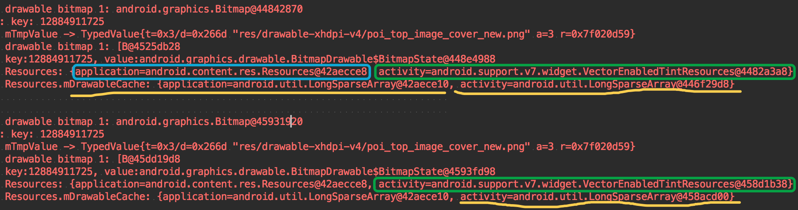

这也进一步解释了另外一个现象，即这些大小相同的数组的个数基本和启动Activity的数量成正比。

通过数据分析可知，这些drawable之所以存在多份，是因为其所在的Resources实例并不是同一个。进一步debug可知，Resources实例存在多个的原因是开启了标志位[sCompatVectorFromResourcesEnabled](https://developer.android.com/reference/android/support/v7/app/AppCompatDelegate.html#setCompatVectorFromResourcesEnabled(boolean))。 虽然最终造成OOM突然增多的原因只是开启一个标志位，但是这也告诫大家阅读API文档的重要性，其实很多时候API的使用说明已经明确告知了使用的限制条件甚至风险。

7.8版本关闭了此标志，发版后第一个月的OOM数量（包含历史版本）为153，如下图。

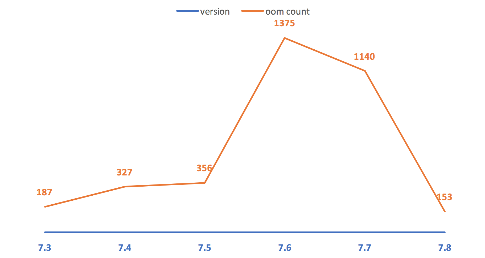

其中新版本发生的OOM数量为22。

#### 总结

对于线上出现的OOM，如何分析和解决可以大致分为三个步骤：

1. 充分挖掘特征。在挖掘特征时，需要多方面考虑，此过程更多的是猜测怀疑，所以可能的方面都要考虑到，包括但不限于代码改动、机器特征、时间特征等，必要时还需要做一定的统计分析。
2. 根据掌握的特征寻找稳定的复现的途径。一般需要做内存压力测试，这样比较容易达到OOM的临界值，只是简单的一些正常操作难以触发OOM。
3. 获取可分析的数据（内存dump文件）。利用MAT分析dump文件，MAT可以方便的按照大小排序实例，可以查看某些实例到GC ROOT的路径。

## 参考

* [Android App解决卡顿慢之内存抖动及内存泄漏（发现和定位）](https://www.cnblogs.com/xgjblog/p/9042458.html)
* [性能优化1 - 内存抖动](https://myliupengcheng.github.io/2019/01/09/android-Performance-optimization-Memory-jitter-md/)
* [Android 内存优化一 内存抖动的定位及优化](https://blog.csdn.net/qiyei2009/article/details/89789585)
* [Android OOM案例分析](https://tech.meituan.com/2017/04/14/oom-analysis.html)
* [OOM分析之问题定位（一）](https://zhuanlan.zhihu.com/p/58919881)
* [OOM分析之ThreadPoolExecutor（二）](https://zhuanlan.zhihu.com/p/58920682)

