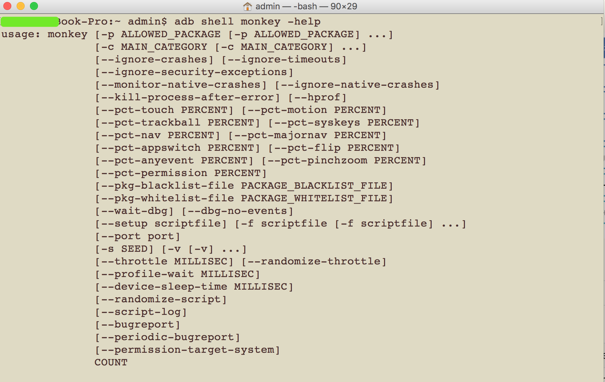
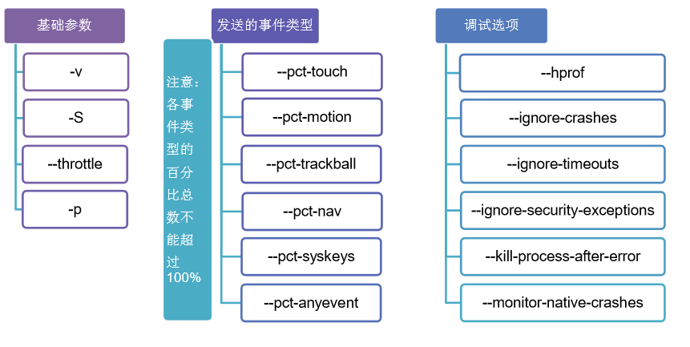
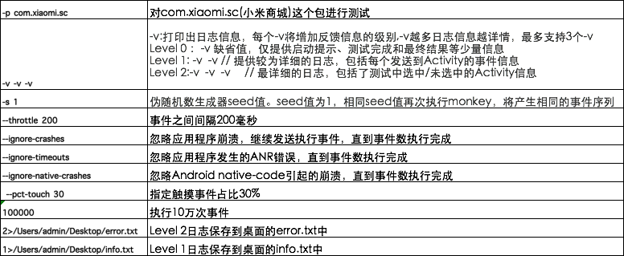

<h1 align="center">adb monkey</h1>

[toc]

## 一、monkey命令

---



monkey所有命令



## 二、monkey常用命令参数说明

---

| 基本参数                  | 说明                                           |
| ------------------------- | ---------------------------------------------- |
| -p <allowed-package-name> | 指定一个或多个包                               |
| -s <seed>                 | 指定一个随机数生成器的seed值                   |
| --throttle <milliseconds> | 指定事件之间的固定延迟（ms）                   |
| -v                        | 指定反馈信息级别（信息级别就是日志的详细程度） |
| -c <main-category>        | 指定一个或多个类别名                           |
| -f <scriptfile>           | 运行指定的monkey脚本                           |

| 事件参数                   | 说明                     |
| -------------------------- | ------------------------ |
| --pct-touch <percent>      | 指定触摸事件百分比       |
| --pct-motion <percent>     | 指定动作事件百分比       |
| --pct-trackball <percent>  | 指定轨迹事件百分比       |
| --pct-syskeys <percent>    | 指定系统按键事件百分比   |
| --pct-nav <percent>        | 指定基本导航事件百分比   |
| --pct-majornav <percent>   | 指定主要导航事件百分比   |
| --pct-appswitch <percent>  | 指定应用启动事件百分比   |
| --pct-flip <percent>       | 指定flip(弹)事件的百分比 |
| --pct-anyevent <percent>   | 指定其他类型事件百分比   |
| --pct-pinchzoom <percent>  | 指定缩放(捏)事件百分比   |
| --pct-permission <percent> | 指定                     |

| 调试参数                     | 说明                                        |
| ---------------------------- | ------------------------------------------- |
| --ignore-crashes             | 忽略因崩溃或异常引起的停止运行              |
| --ignore-timeouts            | 忽略应用发生超时错误（ANR)                  |
| --ignore-security-exceptions | 忽略应用发生任何权限错误                    |
| --monitor-native-crashes     | 监视并报告monkey运行时native code的崩溃事件 |
| --ignore-native-crashes      | 忽略因native code的崩溃事件                 |
| --kill-process-after-error   | 在应用出错后通知系统杀死发生错误的进程      |
| --hprof                      | 在事件序列前后立即生成profilfing report     |
| --dbg-no-events              | 监视应用程序所调用的包之间的转换            |
| --wait-dbg                   | 暂停执行中的monkey，直到有调试器与它连接    |

## 三、对小米商城APP跑monkey及其说明

---

```
adb shell monkey -p com.xiaomi.sc -v -v -v --throttle 200 -s 1 --ignore-crashes --ignore-timeouts --ignore-native-crashes --pct-touch 30 100000 2>/error.txt 1>/info.txt
```



| 命令                    | 说明                                                         |      |
| ----------------------- | ------------------------------------------------------------ | ---- |
| -v -v -v                | -v：打印出日志信息，每一个-v将增加反馈信息的级别，-v越多日志信息越详细，最多支持3个-v <br>Level 0：-v缺省值，仅提供启动提示、测试完成和最终结果等少量信息<br>Level 1：-v -v // 提供较为详细的日志，包含每个发送到Activity的事件信息<br>Level 2：-v -v -v // 最详细的日志，包括了测试中选中/未选中的Activity信息 |      |
| -s l                    | 伪随机数生成器seed值。seed值为1，相同seed值再次执行monkey，将产生相同的事件序列 |      |
| --throttle 200          | 事件之间间隔200毫秒                                          |      |
| --ignore-crashes        | 忽略应用程序崩溃，继续发送执行事件，知道事件数执行完成       |      |
| --ignore-timeouts       | 忽略应用程序发生ANR错误，知道事件数执行完成                  |      |
| --ignore-native-crashes | 忽略Android native-code引起的崩溃，知道事件数执行完成        |      |
| --pct-touch 30          | 指定触摸事件的占比30%                                        |      |
| 100000                  | 执行10w次                                                    |      |
| 2>/error.txt            | Level 2 日志保存到当前路径下error.txt中                      |      |
| 1>/info.txt             | Level 1 日志保存到桌面的info.txt中                           |      |


> `--pct-touch 70 --pct-motion 30`这两个命令是后面增加的，一个代表点击，一个代表滑动，两个加起来是100，代表不会进行其他事件操作，如轨迹事件，导航事件等等，指定这两种操作后，就极大的降低了monkey点到被测app外面的概率(触发到音量键等系统按键)

> 在执行向下滑动的命令时，打开了通知栏，然后又开始了瞎点的操作。这时可在执行monkey命令之前，先执行禁用通知栏的命令

```
adb shell settings put global policy_control immersive.full=*`
 解禁命令：`adb shell settings put global policy_control null
```


## 参考

---

链接：https://www.jianshu.com/p/92604b6527d6
