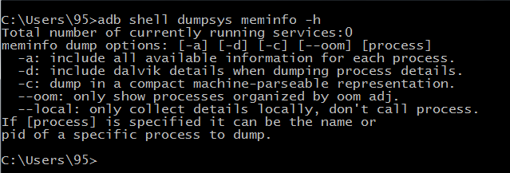

### 一、dumpsys命令介绍

#### 1.命令说明：

Dumpsys用户系统诊断，它运行在设备上，并提供系统服务状态信息

```
命令格式： adb shell dumpsys [system serbices]
```

#### 2.系统服务查询：

如果直接运行adb shell dumpsys，将会获得所有的系统服务信息，那是非常多的，为了更容易管理输出，可以指定你想要检查的服务，例如：

```
adb shell dumpsys –l

adb shell serverce list

#都是查看有哪些系统服务（需要哪些服务就指定哪些服务）
```

命令行参数：

```
不同的服务有不同的选项，一下两个是常见的参数：

-h：对于大多数的服务，可以添加-h看到文本的帮助

-c：对于一些服务，可以添加-c查看数据会更友好
```

例如：

adb shell dumpsys meminfo –h



 

### 二、包信息查询

子命令格式：

```
adb shell dumpsys package [-h] [-f] [—checkin] [cmd]…
```


| 参数      | 说明                                         |
| --------- | :------------------------------------------- |
| -h        | 打印帮助信息                                 |
| -f        | 打印intent filter的信息                      |
| --checkin | 打印出已经登记的库、系统功能、安装包         |
| cmd       | 子命令（可以在-h帮助文档中查看有哪些子命令） |


| cmd子命令             | 说明                        |
| --------------------- | :-------------------------- |
| prov[iders]           | 获取content providers       |
| p[ackages]            | 获取安装包基本信息          |
| s[hared-user]         | 获取共享用户ID的应用        |
| m[essages]            | 打印运行时收集的信息        |
| v[erifiers]           | 打印包校验信息              |
| version               | 打印数据库版本信息          |
| write                 | 写当前位置                  |
| < package.name >      | 输出给定包的信息            |
| installs              | 安装会话的详细信息          |
| l[ibraries]           | 列出已知的共享库            |
| f[ibraries]           | 列出手机的功能              |
| k[eysets]             | 列出各个包的Signing KeySets |
| r[esolvers]           | 获取intent filter           |
| perm[issions]         | 获取权限                    |
| pref[erred]           | 打印包首选项                |
| preferred-xml [—full] | 打印包首选项，xml格式打印   |


### 三、activity信息查询

子命令格式：

```
adb shell dumpsys activity [-a] [-c]…
```

| 参数 | 说明                                                         |
| ---- | :----------------------------------------------------------- |
| -a   | 包括所有可用的服务器状态                                     |
| -c   | 包括客户端状态                                               |
| -p   | 限制输出为给定的包，例如： adb shell dumpsys activity -p com.android.browser |
| -h   | 打印帮助信息                                                 |
| cmd  | 子命令                                                       |


| cmd子命令                                  | 说明                                                         |
| ------------------------------------------ | :----------------------------------------------------------- |
| a[ctivities]                               | activity堆栈状态                                             |
| r[recents]                                 | 最近activity的状态                                           |
| b[rodacasts] [package_name] [histpry [-s]] | 广播状态                                                     |
| i[ntents] [package_name]                   | 挂起的intent状态                                             |
| p[rocesses] [package_name]                 | 进程状态                                                     |
| o[om]                                      | oom管理                                                      |
| perm[issions]                              | url权限授权状态                                              |
| prov[iders] [comp_spec…]                   | content provider状态                                         |
| provider [comp_spec]                       | provider客户端状态                                           |
| s[ervices] [comp_spec…]                    | 服务状态                                                     |
| as[sociations]                             | 跟踪应用程序的关联                                           |
| service [comp_spec]                        | 服务客户端状态                                               |
| package [package_name]                     | 给的包的所有状态                                             |
| all                                        | 转储所有的activityes                                         |
| top                                        | 转储栈顶的activity                                           |
| write                                      | 写入所有挂起状态存储                                         |
| track-associations                         | 允许会话跟踪                                                 |
| untrack-associations                       | 禁用和明确会话跟踪，命令参数可能也是一个comp_spec 转储的activity |


### 四、网络信息查询

| 子命令             | 说明     | 命令格式                             |
| ------------------ | :------- | :----------------------------------- |
| connectivity       | 网络连接 | adb shell dumpsys connectivity       |
| netpolicy          | 网络策略 | adb shell dumpsys netpolicy          |
| netstats           | 网络状态 | adb shell dumpsys netstats           |
| network_management | 网络管理 | adb shell dumpsys network_management |


### 五、其他常用服务信息查询
| 子命令       | 说明     | 命令格式                       |
| ------------ | :------- | :----------------------------- |
| meminfo      | 内存     | adn shell dumpsys meminfo      |
| cpuinfo      | CPU      | adn shell dumpsys cpuinfo      |
| gfxinfo      | 帧率     | adn shell dumpsys gfxinfo      |
| display      | 显示     | adn shell dumpsys display      |
| power        | 电源     | adn shell dumpsys power        |
| batterystats | 电池状态 | adn shell dumpsys batterystats |
| battery      | 电池     | adn shell dumpsys battery      |
| alarm        | 闹钟     | adn shell dumpsys alarm        |
| location     | 位置     | adn shell dumpsys location     |

原文：[https://www.cnblogs.com/JianXu/category/782865.html](https://www.cnblogs.com/JianXu/category/782865.html)