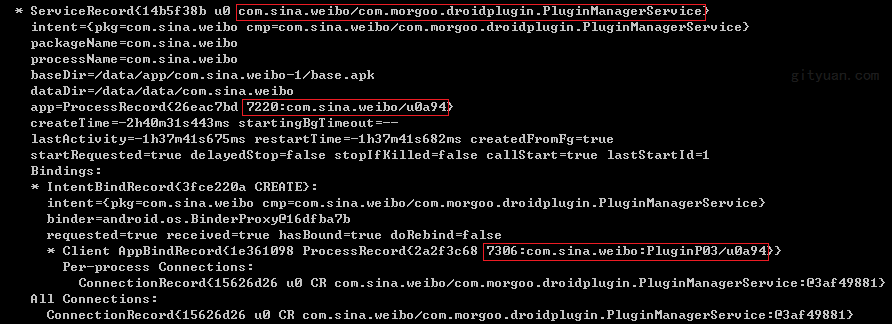
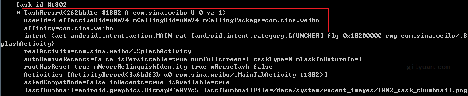
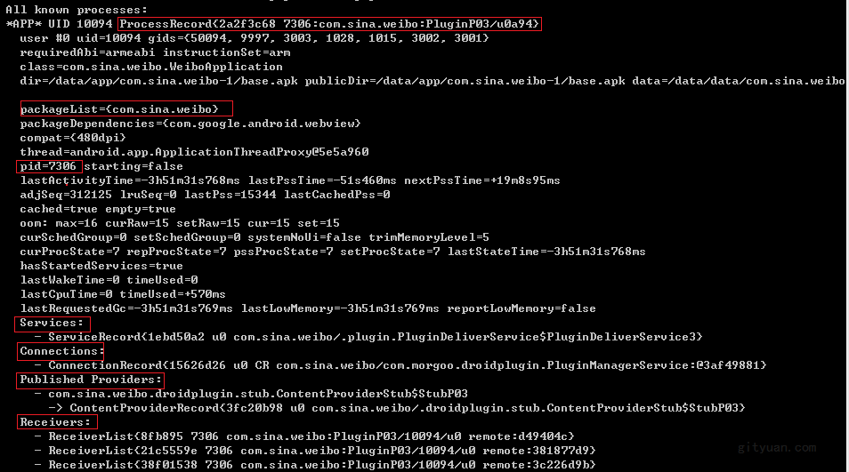

<h1 align="center">dumpsys命令用法</h1>

> dumpsys命令功能很强大，能dump系统服务的各种状态，非常有必要熟悉该命令的用法以及含义。

## 一、 概述

#### 1.1 dumpsys命令用法

可通过dumpsys命令查询系统服务的运行状态(对象的成员变量属性值)，命令格式：`dumpsys 服务名`， 例如：

```
dumpsys activity //查询AMS服务相关信息
dumpsys window //查询WMS服务相关信息
dumpsys cpuinfo //查询CPU情况
dumpsys meminfo //查询内存情况
```

可查询的服务有很多，可通过下面任一命令查看当前系统所支持的dump服务：

```
adb shell dumpsys -l
adb shell service list
```

#### 1.2 系统服务

表一：

| 服务名       | 类名                   | 功能         |
| :----------- | :--------------------- | :----------- |
| activity     | ActivityManagerService | AMS相关信息  |
| package      | PackageManagerService  | PMS相关信息  |
| window       | WindowManagerService   | WMS相关信息  |
| input        | InputManagerService    | IMS相关信息  |
| power        | PowerManagerService    | PMS相关信息  |
| batterystats | BatterystatsService    | 电池统计信息 |
| battery      | BatteryService         | 电池信息     |
| alarm        | AlarmManagerService    | 闹钟信息     |
| dropbox      | DropboxManagerService  | 调试相关     |
| procstats    | ProcessStatsService    | 进程统计     |
| cpuinfo      | CpuBinder              | CPU          |
| meminfo      | MemBinder              | 内存         |
| gfxinfo      | GraphicsBinder         | 图像         |
| dbinfo       | DbBinder               | 数据库       |

表二：

| 服务名               | 功能             |
| :------------------- | :--------------- |
| SurfaceFlinger       | 图像相关         |
| appops               | app使用情况      |
| permission           | 权限             |
| processinfo          | 进程服务         |
| batteryproperties    | 电池相关         |
| audio                | 查看声音信息     |
| netstats             | 查看网络统计信息 |
| diskstats            | 查看空间free状态 |
| jobscheduler         | 查看任务计划     |
| wifi                 | wifi信息         |
| diskstats            | 磁盘情况         |
| usagestats           | 用户使用情况     |
| devicestoragemonitor | 设备信息         |
| …                    | …                |

## 二、Activity场景

`dumpsys activity`，用于查询AMS服务相关信息，可跟不同的参数，更多信息见文章[AMS之dumpsys篇](http://www.gityuan.com/2017/07/04/ams_dumpsys/)

下面以新浪微博App作为实例，由于输出结果较多，每个场景截图只挑选部分重要的信息。

**场景1：查询某个App所有的Service状态**

```
dumpsys activity s com.sina.weibo
```



解读：

- Service类名为`com.morgoo.droidplugin.PluginManagerService`；
- 运行在进程pid=`7220`，进程名为`com.sina.weibo`，uid=`10094`；
- 通过bindService连接该服务的进程pid=`7306`，进程名为`com.sina.weibo:PluginP03`。

当然还有packageName，baseDir(apk路径)，dataDir(apk数据路径)，createTime等各种信息。另外，新浪微博采用的是360开源的Android插件机制(`com.morgoo.droidplugin`)，主要用于hotfix等功能。

**场景2：查询某个App所有的广播状态**

```
 dumpsys activity b com.sina.weibo
```


解读：

- android.intent.action.SCREEN_ON代表手机亮屏广播；
- 接收该广播的receiver有很多个，其中一个所在进程为pid=`7220`，进程名为`com.sina.weibo`

**场景3：查询某个App所有的Activity状态**

输出结果较多，尤其是`View Hierarchy`，下面截取部分：

```
dumpsys activity a com.sina.weibo
```



解读：

- 格式：TaskRecord{Hashcode #TaskId Affinity UserId=0 Activity个数=1}；所以上图信息解析后就是TaskId=`1802`，Affinity=`com.sina.weibo`，当前Task中Activity个数为1。
- effectiveUid为当前task所属Uid，mCallingUid为调用者Uid=u0a94，mCallingPackage为调用者包名，这里是`com.sina.weibo`；
- realActivity:task中的已启动的Activity组件名`com.sina.weibo/.SplashActivity`。

**场景4：查询某个App的进程状态**

```
dumpsys activity p com.sina.weibo
```



- 格式：ProcessRecord{Hashcode pid:进程名/uid}，进程pid=7306，进程名为`com.sina.weibo:PluginP03`，uid=10094.
- 该进程中还有Services，Connections, Providers, Receivers，可以看出该进程是没有Activity的进程。

**其他**

还有很多场景，会用到不同的参数，这里就不再一一列举，建议大家多去尝试，慢慢地就更加熟练，再比如：

```
dumpsys activity top //当前界面app状态
dumpsys activity oom //查看进程状态
```

来源：http://gityuan.com/2016/05/14/dumpsys-command/