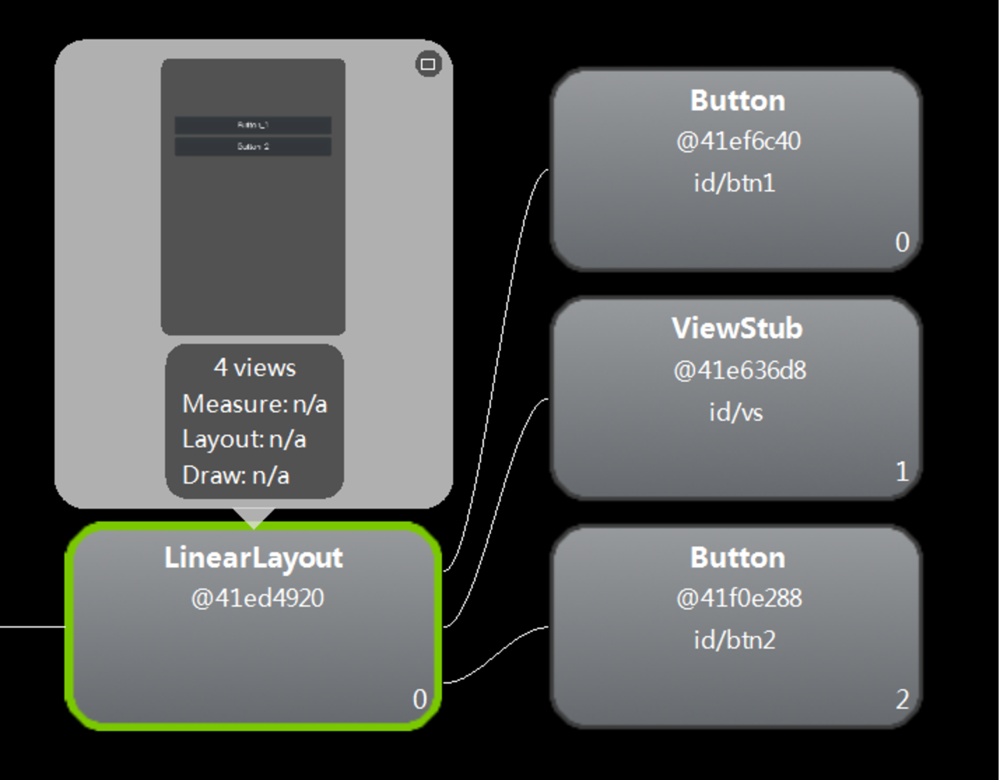
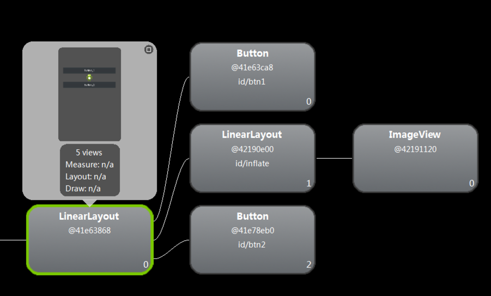
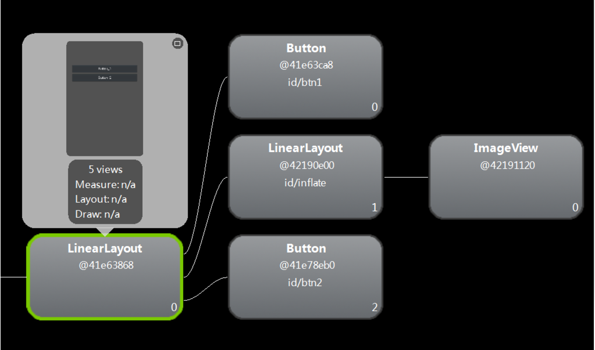

# ViewStubs使用方法
## 1.含义解释：
ViewStub默认是不显示的，也不占用内存，加载时会被其他的布局所替代才占用内存并且才显示出来，加载后如果只是隐藏用ViewStub.setVisiblitiy(View.GONE)就可以正常隐藏，但是不能释放内存。

ViewStub和include的区别是：ViewStub中的布局不会随着它所在布局的渲染而渲染，而<include>标签中的布局会随着它所在布局的渲染而渲染，ViewStub中的布局只有在你需要的时候才会渲染到主界面中。

ViewStub只能在Activity中加载一次（除非重新创建Activity或者其他寄存器），加载后ViewStub就被ViewStub里的layout布局替换了最初的ViewStub,也就是加载后ViewStub就是相应的layout布局，因此ViewStub只能加载一次，不能重复加载否则报错。因此要做判断，ViewStub.getParent()是否为空，如果不为空则加载，为空则不加载，详情看下面代码。

## 2.java代码：
第一种写法：判断ViewStub是否为空
```java
public class MyActivity extends Activity {

    private static final String TAG = "MyActivity";
    private Button mBtn1, mBtn2;
    private ViewStub mVs;
    private boolean isVisibility = false;

    @Override
    public void onCreate(Bundle savedInstanceState) {
        super.onCreate(savedInstanceState);
        setContentView(R.layout.main);

        mBtn1 = (Button) findViewById(R.id.btn1);
        mBtn2 = (Button) findViewById(R.id.btn2);
        mVs = (ViewStub) findViewById(R.id.vs);
        mBtn2.setOnClickListener(new View.OnClickListener() {
            @Override
            public void onClick(View v) {
                //要判断mVs是否为空，为空则说明已经加载过，不为空说明是第一次加载
                if (mVs.getParent() != null) {
                    Log.e(TAG, "vs is not null");
                    mVs.setInflatedId(R.id.inflate);
                    mVs.setLayoutResource(R.layout.myinflate);
                    mVs.inflate();
                } else {
                    Log.e(TAG, "vs is null");
                    if (!isVisibility) {
                        Log.e(TAG, "ViewStub is visible");
                        mVs.setVisibility(View.VISIBLE);
                    } else {
                        Log.e(TAG, "ViewStub is gone ");
                        mVs.setVisibility(View.GONE);
                    }
                }
                isVisibility = !isVisibility;
            }
        });
    }
}
```

第二种写法：直接作出判断第二次就不再加载

```java
public class MyActivity extends Activity {

    private static final String TAG = "MyActivity";
    private Button mBtn1, mBtn2;
    private ViewStub mVs;
    private boolean isStub = false;
    private boolean isVisibility = false;

    @Override
    public void onCreate(Bundle savedInstanceState) {
        super.onCreate(savedInstanceState);
        setContentView(R.layout.main);

        mBtn1 = (Button) findViewById(R.id.btn1);
        mBtn2 = (Button) findViewById(R.id.btn2);
        mBtn2.setOnClickListener(new View.OnClickListener() {
            @Override
            public void onClick(View v) {
                if (!isStub) {
                    Log.e(TAG, "inflate ViewStub");
                    mVs = (ViewStub) findViewById(R.id.vs);
                    mVs.setInflatedId(R.id.inflate);
                    mVs.setLayoutResource(R.layout.myinflate);
                    mVs.inflate();
                } else {
                    if (!isVisibility) {
                        Log.e(TAG, "ViewStub is visible");
                        mVs.setVisibility(View.VISIBLE);
                    } else {
                        Log.e(TAG, "ViewStub is gone ");
                        mVs.setVisibility(View.GONE);
                    }
                }
                isVisibility = !isVisibility;
                isStub = true;
            }
        });
    }
}
```

## 3.xml代码：
main.layout代码：

```xml
<?xml version="1.0" encoding="utf-8"?>
<LinearLayout xmlns:android="http://schemas.android.com/apk/res/android"
    android:orientation="vertical"
    android:layout_width="fill_parent"
    android:layout_height="fill_parent">

    <Button
        android:id="@+id/btn1"
        android:layout_width="match_parent"
        android:layout_height="wrap_content"
        android:layout_marginTop="100dp"
        android:text="Button_1" />

    <ViewStub
        android:id="@+id/vs"
        android:layout_width="match_parent"
        android:layout_height="wrap_content"
        android:inflatedId="@+id/inflate"
        android:layout="@layout/myinflate" />

    <Button
        android:id="@+id/btn2"
        android:layout_width="match_parent"
        android:layout_height="wrap_content"
        android:text="Button_2" />
</LinearLayout>
```

解释：我之前看别人讲解一直不明白android:inflatedId="@+id/inflate"这个是什么意思，后来看java代码才知道里面有个setInflate函数中的id就是这个id，这个id是随便设置的，尽量和你的layout的id相近，为了布局多时好辨认，layout的id是你要加载的布局的id及下面的myinflate。

myinflate代码：这里为了显示清晰特意用LinearLayout嵌套了一个ImageView

```xml
<?xml version="1.0" encoding="utf-8"?>

<LinearLayout xmlns:android="http://schemas.android.com/apk/res/android"
    android:orientation="vertical"
    android:layout_width="match_parent"
    android:layout_height="match_parent">

    <ImageView
        android:layout_width="wrap_content"
        android:layout_height="wrap_content"
        android:layout_gravity="center_horizontal"
        android:background="@drawable/ic_launcher" />
</LinearLayout>
```

## 4.看看结构层次图：
（1）未点击加载布局是的结构图：可以看到两个按钮中间没有其他组件，结构为两层，ViewStub和Button在一层上。




（2）第一次加载后：可以看到两个按钮之间多出一个图片组件，结构图也变成了三层，与上图相比LinearLayout是后即在出来的，而ViewStub组件也不见了，说明是被替换了。




（3）隐藏mVs（即后加载进来的LinearLayout布局）后的图：层次和结构未变只是中间的图片消失了。




## 5.结尾：
ViewSub对于我们组件较多但又不需要一次性加载的应用优化是非常好的工具，希望大家熟练该组件的用法。


**节约内存从优化开始。**

详细内容可参考：[Android系统源码分析--View绘制流程之-inflate](http://codemx.cn/2018/11/20/AndroidOS013-View-inflate/)
