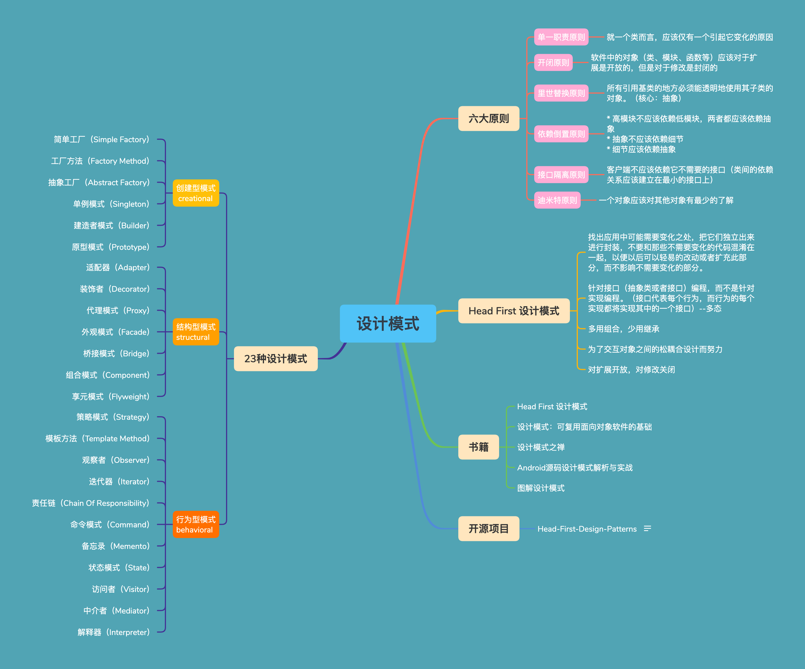

<h1 align="center">设计模式</h1>

[TOC]

## 设计模式

|    类型    | 中文名称                                                     | 英文名称                                                     |
| :--------: | ------------------------------------------------------------ | ------------------------------------------------------------ |
| 创建型模式 | 工厂方法模式 抽象工厂模式 简单工厂模式 单例模式 建造者模式 原型模式 | Factory Method Abstract Factory Simple Factory Singleton Builder Prototype |
| 结构型模式 | 适配器模式 装饰者模式 代理模式 外观模式 桥接模式 组合模式 享元模式 | Adapter Decorator Proxy Facade Bridge Composite Flyweight |
| 行为型模式 | 策略模式 模板方法模式 观察者模式 迭代器模式 责任链模式 命令模式 备忘录模式 状态模式 访问者模式 中介者模式 解释器模式 | Strategy Template Methed Observer Iterator Chain Of Responsibility Command Memento State Visitor Mediator Interpreter |

* **创建型模式**：提供创建对象的机制，增加已有代码的灵活性和可复用性。
* **结构型模式**：介绍如何将对象和类组装成较大的结构，并同时保持结构的灵活和高效。
* **行为模式**：负责对象间的高效沟通和职责委派。

## 参考

