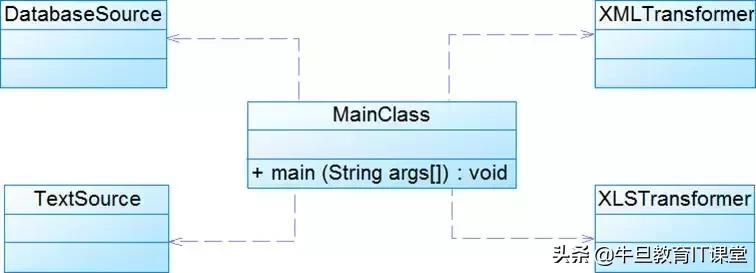
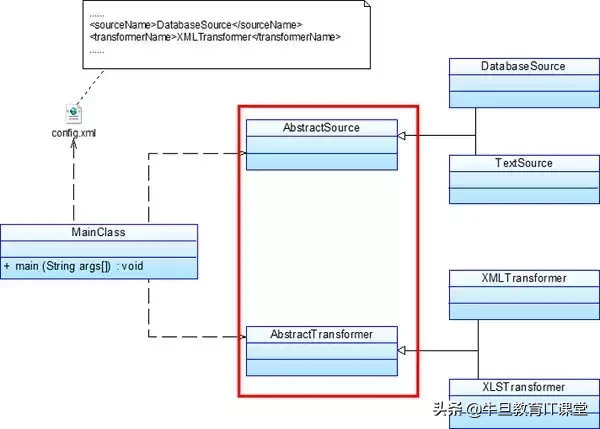

<h1 align="center">六大设计原则</h1>

[TOC]

## 六大设计原则

### **S单一职责SRP**

> Single-Responsibility Principle, 一个类,最好只做一件事,只有一个引起它的变化。单一职责原则可以看做是低耦合,高内聚在面向对象原则的引申,将职责定义为引起变化的原因,以提高内聚性减少引起变化的原因。

**定义**

一个对象应该只包含单一的职责，并且该职责被完整地封装在一个类中。（Every object should have a single responsibility, and that responsibility should be entirely encapsulated by the class.），即又定义有且仅有一个原因使类变更。点击这里查看高可用架构设计9种方案详解。

**原则分析**

- 一个类（或者大到模块，小到方法）承担的职责越多，它被复用的可能性越小，而且如果一个类承担的职责过多，就相当于将这些职责耦合在一起，当其中一个职责变化时，可能会影响其他职责的运作。

- 类的职责主要包括两个方面：数据职责和行为职责，数据职责通过其属性来体现，而行为职责通过其方法来体现。

- 单一职责原则是实现高内聚、低耦合的指导方针，在很多代码重构手法中都能找到它的存在，它是最简单但又最难运用的原则，需要设计人员发现类的不同职责并将其分离，而发现类的多重职责需要设计人员具有较强的分析设计能力和相关重构经验。

**优点**

- 降低类的复杂性，类的职责清晰明确。比如数据职责和行为职责清晰明确。
- 提高类的可读性和维护性，
- 变更引起的风险减低，变更是必不可少的，如果接口的单一职责做得好，一个接口修改只对相应的类有影响，对其他接口无影响，这对系统的扩展性、维护性都有非常大的帮助。


> 注意：单一职责原则提出了一个编写程序的标准，用“职责”或“变化原因”来衡量接口或类设计得是否合理，但是“职责”和“变化原因”都是没有具体标准的，一个类到底要负责那些职责？这些职责怎么细化？细化后是否都要有一个接口或类？这些都需从实际的情况考虑。因项目而异，因环境而异。


### **O开放封闭原则OCP**

> Open - ClosedPrinciple, OCP, 对扩展开放，对修改关闭(设计模式的核心原则)

**定义**

> 一个软件实体(如类、模块和函数)应该对扩展开放，对修改关闭。意思是，在一个系统或者模块中，对于扩展是开放的，对于修改是关闭的，一个 好的系统是在不修改源代码的情况下，可以扩展你的功能。而实现开闭原则的关键就是抽象化。

**原则分析**

- 当软件实体因需求要变化时, 尽量通过扩展已有软件实体，可以提供新的行为，以满足对软件的新的需求，而不是修改已有的代码，使变化中的软件有一定的适应性和灵活性 。已有软件模块，特别是最重要的抽象层模块不能再修改，这使变化中的软件系统有一定的稳定性和延续性。

- 实现开闭原则的关键就是抽象化 :在"开-闭"原则中,不允许修改的是抽象的类或者接口,允许扩展的是具体的实现类,抽象类和接口在"开-闭"原则中扮演着极其重要的角色..即要预知可能变化的需求.又预见所有可能已知的扩展..所以在这里"抽象化"是关键!

- 可变性的封闭原则:找到系统的可变因素,将它封装起来. 这是对"开-闭"原则最好的实现. 不要把你的可变因素放在多个类中,或者散落在程序的各个角落. 你应该将可变的因素,封套起来..并且切忌不要把所用的可变因素封套在一起. 最好的解决办法是,分块封套你的可变因素!避免超大类,超长类,超长方法的出现!!给你的程序增加艺术气息,将程序艺术化是我们的目标!


**例子**

设计模式中模板方法模式和观察者模式都是开闭原则的极好体现。点击这里查看高可用架构设计9种方案详解。


### **L里氏替换原则LSP**

> Liskov Substitution Principle，LSP：任何基类可以出现的地方，子类也可以出现；这一思想表现为对继承机制的约束规范，只有子类能够替换其基类时，才能够保证系统在运行期内识别子类，这是保证继承复用的基础。

**定义**

第一种定义方式相对严格：如果对每一个类型为S的对象o1，都有类型为T的对象o2，使得以T定义的所有程序P在所有的对象o1都代换成o2时，程序P的行为没有变化，那么类型S是类型T的子类型。

第二种更容易理解的定义方式：所有引用基类（父类）的地方必须能透明地使用其子类的对象。即子类能够必须能够替换基类能够从出现的地方。子类也能在基类 的基础上新增行为。

（里氏代换原则由2008年图灵奖得主、美国第一位计算机科学女博士、麻省理工学院教授BarbaraLiskov和卡内基.梅隆大学Jeannette Wing教授于1994年提出。其原文如下：Let q(x) be a property provableabout objects x of type T. Then q(y) should be true for objects y of type Swhere S is a subtype of T. ）

**原则分析**

- 讲的是基类和子类的关系，只有这种关系存在时，里氏代换原则才存在。正方形是长方形是理解里氏代换原则的经典例子。

- 里氏代换原则可以通俗表述为：在软件中如果能够使用基类对象，那么一定能够使用其子类对象。把基类都替换成它的子类，程序将不会产生任何错误和异常，反过来则不成立，如果一个软件实体使用的是一个子类的话，那么它不一定能够使用基类。

- 里氏代换原则是实现开闭原则的重要方式之一，由于使用基类对象的地方都可以使用子类对象，因此在程序中尽量使用基类类型来对对象进行定义，而在运行时再确定其子类类型，用子类对象来替换父类对象。


### **I接口隔离法则**

> (Interface Segregation Principle，ISL）：客户端不应该依赖那些它不需要的接口。（这个法则与迪米特法则是相通的）

**定义**

客户端不应该依赖那些它不需要的接口。

另一种定义方法：一旦一个接口太大，则需要将它分割成一些更细小的接口，使用该接口的客户端仅需知道与之相关的方法即可。

注意，在该定义中的接口指的是所定义的方法。例如外面调用某个类的public方法。这个方法对外就是接口。

**原则分析**

1）接口隔离原则是指使用多个专门的接口，而不使用单一的总接口。每一个接口应该承担一种相对独立的角色，不多不少，不干不该干的事，该干的事都要干。

- 一个接口就只代表一个角色，每个角色都有它特定的一个接口，此时这个原则可以叫做“角色隔离原则”。
- 接口仅仅提供客户端需要的行为，即所需的方法，客户端不需要的行为则隐藏起来，应当为客户端提供尽可能小的单独的接口，而不要提供大的总接口。


2）使用接口隔离原则拆分接口时，首先必须满足单一职责原则，将一组相关的操作定义在一个接口中，且在满足高内聚的前提下，接口中的方法越少越好。

3）可以在进行系统设计时采用定制服务的方式，即为不同的客户端提供宽窄不同的接口，只提供用户需要的行为，而隐藏用户不需要的行为。


### **D依赖倒置原则DIP**

> Dependency-Inversion Principle 要依赖抽象，而不要依赖具体的实现，具体而言就是高层模块不依赖于底层模块，二者共同依赖于抽象。抽象不依赖于具体，具体依赖于抽象。


**定义**

高层模块不应该依赖低层模块，它们都应该依赖抽象。抽象不应该依赖于细节，细节应该依赖于抽象。简单的说，依赖倒置原则要求客户端依赖于抽象耦合。原则表述：

1）抽象不应当依赖于细节；细节应当依赖于抽象；

2）要针对接口编程，不针对实现编程。

**原则分析**

1）如果说开闭原则是面向对象设计的目标，依赖倒转原则是到达面向设计"开闭"原则的手段。如果要达到最好的"开闭"原则，就要尽量的遵守依赖倒转原则。可以说依赖倒转原则是对“抽象化”的最好规范！我个人感觉，依赖倒转原则也是里氏代换原则的补充。你理解了里氏代换原则，再来理解依赖倒转原则应该是很容易的。

2）依赖倒转原则的常用实现方式之一是在代码中使用抽象类，而将具体类放在配置文件中。

3）类之间的耦合：零耦合关系，具体耦合关系，抽象耦合关系。依赖倒转原则要求客户端依赖于抽象耦合，以抽象方式耦合是依赖倒转原则的关键。

**例子**

理解这个依赖倒置，首先我们需要明白依赖在面向对象设计的概念：

依赖关系(Dependency)：是一种使用关系，特定事物的改变有可能会影响到使用该事物的其他事物，在需要表示一个事物使用另一个事物时使用依赖关系。（假设A类的变化引起了B类的变化，则说名B类依赖于A类。）大多数情况下，依赖关系体现在某个类的方法使用另一个类的对象作为参数。在UML中，依赖关系用带箭头的虚线表示，由依赖的一方指向被依赖的一方。

例子：某系统提供一个数据转换模块，可以将来自不同数据源的数据转换成多种格式，如可以转换来自数据库的数据(DatabaseSource)、也可以转换来自文本文件的数据(TextSource)，转换后的格式可以是XML文件(XMLTransformer)、也可以是XLS文件(XLSTransformer)等。




由于需求的变化，该系统可能需要增加新的数据源或者新的文件格式，每增加一个新的类型的数据源或者新的类型的文件格式，客户类MainClass都需要修改源代码，以便使用新的类，但违背了开闭原则。现使用依赖倒转原则对其进行重构。点击这里查看高可用架构设计9种方案详解。




- 当然根据具体的情况，也可以将AbstractSource注入到AbstractStransformer，依赖注入的方式有以下三种：

```java
/** 
 * 依赖注入是依赖AbstractSource抽象注入的，而不是具体 
 * DatabaseSource 
 * 
 */ 
abstract class AbstractStransformer { 
 private AbstractSource source; 
 /** 
 * 构造注入(Constructor Injection)：通过构造函数注入实例变量。 
 */ 
 public void AbstractStransformer(AbstractSource source){ 
 this.source = source; 
 } 
 /** 
 * 设值注入(Setter Injection)：通过Setter方法注入实例变量。 
 * @param source : the sourceto set 
 */ 
 public void setSource(AbstractSource source) { 
 this.source = source; 
 } 
 /** 
 * 接口注入(Interface Injection)：通过接口方法注入实例变量。 
 * @param source 
 */ 
 public void transform(AbstractSource source ) { 
 source.getSource(); 
 System.out.println("Stransforming ..."); 
 } 
}
```

### **迪米特法则**

> (Law of Demeter，LoD：系统中的类，尽量不要与其他类互相作用，减少类之间的耦合度

**定义**

又叫最少知识原则（Least Knowledge Principle或简写为LKP）几种形式定义：

- 不要和“陌生人”说话。英文定义为：Don't talk to strangers.
- 只与你的直接朋友通信。英文定义为：Talk only to your immediate friends.
- 每一个软件单位对其他的单位都只有最少的知识，而且局限于那些与本单位密切相关的软件单位。


简单地说，也就是，一个对象应当对其它对象有尽可能少的了解。一个类应该对自己需要耦合或调用的类知道得最少，你（被耦合或调用的类）的内部是如何复杂都和我没关系，那是你的事情，我就知道你提供的public方法，我就调用这么多，其他的一概不关心。

**法则分析**

- 朋友类：在迪米特法则中，对于一个对象，其朋友包括以下几类： (1) 当前对象本身(this)； (2) 以参数形式传入到当前对象方法中的对象； (3) 当前对象的成员对象； (4) 如果当前对象的成员对象是一个集合，那么集合中的元素也都是朋友；(5) 当前对象所创建的对象。

  任何一个对象，如果满足上面的条件之一，就是当前对象的“朋友”，否则就是“陌生人”。

- 狭义法则和广义法则：


在狭义的迪米特法则中，如果两个类之间不必彼此直接通信，那么这两个类就不应当发生直接的相互作用，如果其中的一个类需要调用另一个类的某一个方法的话，可以通过第三者转发这个调用。

狭义的迪米特法则：可以降低类之间的耦合，但是会在系统中增加大量的小方法并散落在系统的各个角落，它可以使一个系统的局部设计简化，因为每一个局部都不会和远距离的对象有直接的关联，但是也会造成系统的不同模块之间的通信效率降低，使得系统的不同模块之间不容易协调。点击这里查看高可用架构设计9种方案详解。

广义的迪米特法则：指对对象之间的信息流量、流向以及信息的影响的控制，主要是对信息隐藏的控制。信息的隐藏可以使各个子系统之间脱耦，从而允许它们独立地被开发、优化、使用和修改，同时可以促进软件的复用，由于每一个模块都不依赖于其他模块而存在，因此每一个模块都可以独立地在其他的地方使用。一个系统的规模越大，信息的隐藏就越重要，而信息隐藏的重要性也就越明显。

- 迪米特法则的主要用途：在于控制信息的过载。
- 在类的划分上，应当尽量创建松耦合的类，类之间的耦合度越低，就越有利于复用，一个处在松耦合中的类一旦被修改，不会对关联的类造成太大波及；
- 在类的结构设计上，每一个类都应当尽量降低其成员变量和成员函数的访问权限；
- 在类的设计上，只要有可能，一个类型应当设计成不变类；
- 在对其他类的引用上，一个对象对其他对象的引用应当降到最低。


**例子**

外观模式Facade（结构型）

迪米特法则与设计模式Facade模式、Mediator模式

> 系统中的类，尽量不要与其他类互相作用，减少类之间的耦合度，因为在你的系统中，扩展的时候，你可能需要修改这些类，而类与类之间的关系，决定了修改的复杂度，相互作用越多，则修改难度就越大，反之，如果相互作用的越小，则修改起来的难度就越小。例如A类依赖B类，则B类依赖C类，当你在修改A类的时候，你要考虑B类是否会受到影响，而B类的影响是否又会影响到C类。 如果此时C类再依赖D类的话，呵呵，我想这样的修改有的受了。


### **合成/聚合复用原则**

> (Composite/Aggregate ReusePrinciple ，CARP)：要尽量使用对象组合,而不是继承关系达到软件复用的目的

**定义**

经常又叫做合成复用原则（Composite ReusePrinciple或CRP），尽量使用对象组合，而不是继承来达到复用的目的。

就是在一个新的对象里面使用一些已有的对象，使之成为新对象的一部分；新对象通过向这些对象的委派达到复用已有功能的目的。简而言之，要尽量使用合成/聚合，尽量不要使用继承。

**原则分析**

1）在面向对象设计中，可以通过两种基本方法在不同的环境中复用已有的设计和实现，即通过组合/聚合关系或通过继承。

继承复用：实现简单，易于扩展。破坏系统的封装性；从基类继承而来的实现是静态的，不可能在运行时发生改变，没有足够的灵活性；只能在有限的环境中使用。（“白箱”复用）

组合/聚合复用：耦合度相对较低，选择性地调用成员对象的操作；可以在运行时动态进行。（“黑箱”复用）

2）组合/聚合可以使系统更加灵活，类与类之间的耦合度降低，一个类的变化对其他类造成的影响相对较少，因此一般首选使用组合/聚合来实现复用；其次才考虑继承，在使用继承时，需要严格遵循里氏代换原则，有效使用继承会有助于对问题的理解，降低复杂度，而滥用继承反而会增加系统构建和维护的难度以及系统的复杂度，因此需要慎重使用继承复用。

3）此原则和里氏代换原则氏相辅相成的,两者都是具体实现"开-闭"原则的规范。违反这一原则，就无法实现"开-闭"原则，首先我们要明白合成和聚合的概念：

> 注意：聚合和组合的区别是什么？合成（组合）：表示一个整体与部分的关系，指一个依托整体而存在的关系（整体与部分不可以分开）；比如眼睛和嘴对于头来说就是组合关系，没有了头就没有眼睛和嘴，它们是不可分割的。在UML中，组合关系用带实心菱形的直线表示。聚合：聚合是比合成关系的一种更强的依赖关系，也表示整体与部分的关系（整体与部分可以分开）；比如螺丝和汽车玩具的关系，螺丝脱离玩具依然可以用在其它设备之上。在UML中，聚合关系用带空心菱形的直线表示。


## Head First设计原则

* 找出应用中可能需要变化之处，把它们独立出来进行封装，不要和那些不需要变化的代码混在一起，以便以后可以轻易的改动或者扩充此部分，而不影响不需要变化的部分。
* 针对接口（抽象类或者接口）编程，而不是针对实现编程。（接口代表每个行为，而行为的每个实现都将实现其中的一个接口）--多态
* 多用组合，少用继承。
* 为了交互对象之间的松耦合设计而努力。
* 对扩展开放，对修改关闭--开闭原则

## 参考

* [深入浅出详解软件开发中的 6 大设计原则 (toutiao.com)](https://www.toutiao.com/i6739056710205309452/?tt_from=weixin&utm_campaign=client_share&wxshare_count=1&timestamp=1619654529&app=news_article&utm_source=weixin&utm_medium=toutiao_android&use_new_style=1&req_id=202104290802080101512030353517C921&share_token=45aa5e99-9cd7-474a-9ff8-c4ba0f429abc&group_id=6739056710205309452)