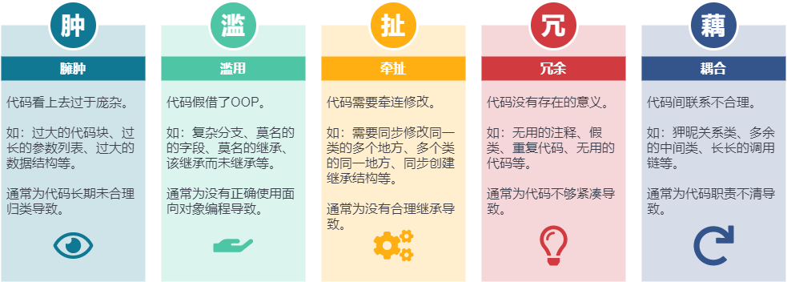
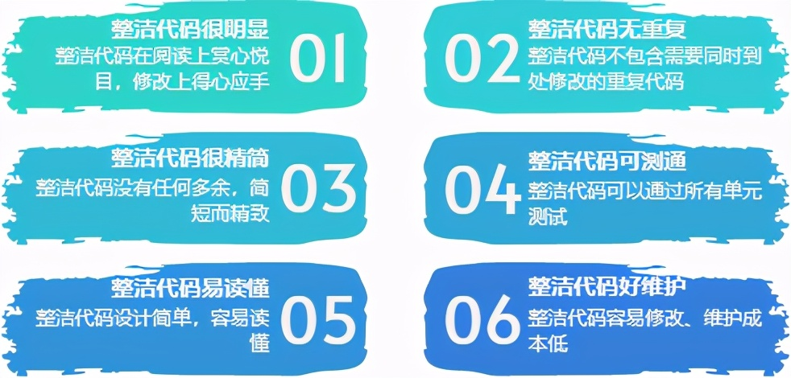
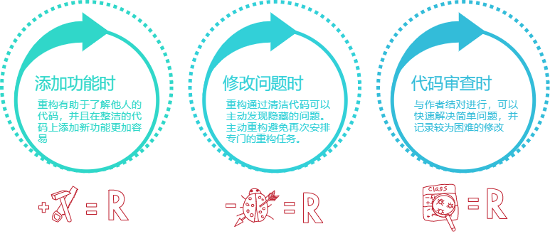
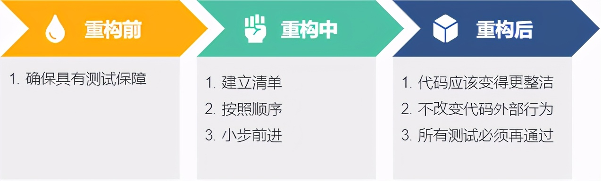
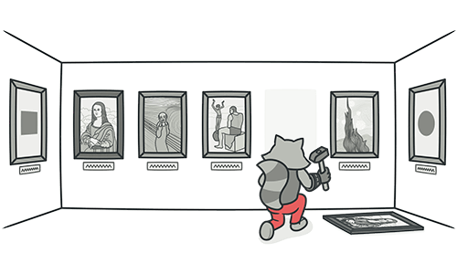
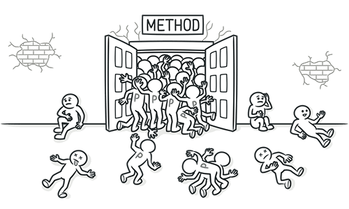
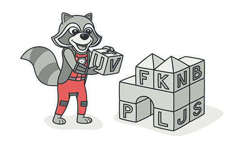
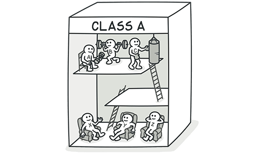
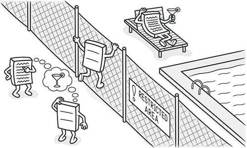
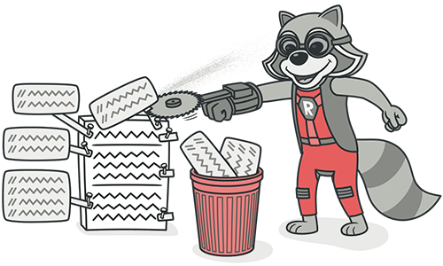

<h1 align="center">代码的坏味道与重构技术</h1>

[TOC]

## 前言

本文大部分内容、图片来自Martin Flower的《Refactoring》一书以及[refactoringguru.cn](https://refactoringguru.cn/)网站（一个很棒的网站），之前在博客发表过，这次属于整理后重新发表，以重温经典。

## 什么是代码的坏味道

通过发霉腐坏的气味隐喻那些在设计上别扭、理解上费劲、维护上困难的问题代码。



<center>代码的各种坏味道</center>

## 什么是重构

重构是指在不改变代码外部行为的前提下，使代码变得设计简单、干净整洁的方法。

## 什么是整洁代码

整洁代码设计简单、干净精简、易理解、可测通、好维护。



<center>整洁代码的特征</center>

## 关于技术债务

重构可以消除技术债务，但重构之前要避免产生技术债务。


<center>技术债务产生的原因</center>

## 重构的时机

重构遵循“事不过三”原则，代码呼唤你重构的时候，就立即开始吧。



<center>重构的时机</center>

## 重构的守则

重构需要：目标导向、做好防护、循规蹈矩、小步前进、稳扎稳打。



<center>重构守则</center>

## 重构的手法

```
1. 整理
        a. 删除 Delete（无用注释、废弃代码）
        b. 移动 Move（上下左右，代码片段、方法、类、包）
        c. 重命名 Rename（包、类、方法、变量等）
2. 变换
        a. 封装 Encapsulate （变量 -> 成员变量）
        b. 变量改为方法 Replace Temp with Query（缩短方法）
        c. 表达式改为变量 Introduce Explaining Variable（易懂）
        d. 抽取 Extract（变量 -> 参 数，变量 -> 常量，代码片段 -> 方法， 参数 -> 类）
        e. 内联 Inline （方法 -> 表达式，变量 -> 表达式）
3. 易构
        a. 提取类 Extract Class、Extract SubClass
        b. 提升 Pull Up
        c. 下放 Push Down
        d. 代理 Extract Delegat
```

## 消除各种坏味道

- **重复代码**

重复代码是首当其冲的坏味道。



<center>消除重复</center>

| **特征**                       | 1.重复的表达式 2.不同的算法做相同的事 3.代码相似   |
| ------------------------------ | -------------------------------------------------- |
| **目标**                       | 相同表达式只在一个类的一个方法出现，供其他方法调用 |
| **情况**                       | **处理方式**                                       |
| 同一个类的两个函数有相同表达式 | 重复代码提取为方法                                 |
| 兄弟类含有相同的表达式         | ① 重复代码提取为方法② 提升方法到父类               |
| 不相干的类含有相同代码         | 提取为独立类供调用                                 |

- **过长函数**

代码越长越难以理解。

如果函数有个好名字，就可以省去关注它的时间。


<center>重构过长函数</center>

| **特征** | 1.代码前面有注释2.代码中有条件表达式3.代码中有循环 |
| -------- | -------------------------------------------------- |
| **目标** | 每个函数只做一件事函数要职责单一、命名准确         |
| **情况** | **处理方式**                                       |
|          | 将步骤块、分支块分别提取为具备独立职责的方法       |

- **过大的类**

一个类应该是一个清楚的抽象，处理一些明确的职责，只响应一种变化。

在不同的环境扮演不同角色的类，使用接口就是好主意。


<center>重构过大的类</center>

| **特征**                       | 1.一个类中有太多实例变量2.一个类中有太多代码 |
| ------------------------------ | -------------------------------------------- |
| **目标**                       | 每个类负责一组具有内在的相互关联的任务       |
| **情况**                       | **处理方式**                                 |
| 部分字段之间相关性高           | 相关的字段和方法提取到新类                   |
| 某些字段和方法只被某些实例用到 | 这些字段和方法都下放到子类中                 |

- **过多参数**

太长的参数列导致难以理解、不易使用、被迫修改。

方法需要的参数，多数应当从类中获得。



<center>过长的参数列表</center>

| **特征**                             | 1.参数列表过长2.参数列表变化频繁                           |
| ------------------------------------ | ---------------------------------------------------------- |
| **目标**                             | 只需要传给函数足够的、让其可以从中获取自己需要的东西就行了 |
| **情况**                             | **处理方式**                                               |
| 方法可以通过其他方式获取该参数       | 让参数接受者自行获取该参数                                 |
| 同一对象的若干属性作为参数           | 在不使依赖恶化的前提下，使用整个对象作为参数               |
| 被调用函数使用了另一个对象的很多属性 | 将方法移动到该对象中                                       |
| 某些数据缺乏归属对象                 | 首先创建对象                                               |

- **变化集中**

在理想境地下，外界变化与类应该是一对一关系。


<center>重新封装变化</center>

| **特征**                                   | 一个类受多种变化的影响                                       |
| ------------------------------------------ | ------------------------------------------------------------ |
| **目标**                                   | 针对某一外界变化的所有修改，只应发生在单一类中，而这个类中所有的内容都应反映此变化 |
| **情况**                                   | **处理方式**                                                 |
| 类经常因为不同的原因在不同的方向上发生变化 | 将特定原因造成的所有变化提取为一个新类                       |

- **修改发散**

需要修改的代码散布四处，就难以找到、容易忘记。


<center>散弹式修改</center>

| **特征**                               | 一种变化引发多个类的修改                                     |
| -------------------------------------- | ------------------------------------------------------------ |
| **目标**                               | 针对某一外界变化的所有修改，只应发生在单一类中，而这个类中所有的内容都应反映此变化 |
| **情况**                               | **处理方式**                                                 |
| 某种变化需要在许多不同的类中做出小修改 | 把所有需要修改的代码放进同一个类中                           |

- **错误依恋**

面向对象的精髓：将数据和相关行为封装在一起、将总是一起变化的东西放在一起。


<center>你知道的太多了</center>

| **特征**                                     | 一个函数使用其他类属性比使用自身类属性还要多 |
| -------------------------------------------- | -------------------------------------------- |
| **目标**                                     | 将数据和对数据的操作行为包装在一起           |
| **情况**                                     | **处理方式**                                 |
| 某个函数从另一个对象调用了几乎半打的取值函数 | 将依恋代码提取为单独方法，移动到另一对象     |

- **数据泥团**

数据项就像小孩子，喜欢成群结队地待在一块儿。

总是结队出现的数据项，应放进属于自己的对象中。


<center>重新组织</center>

| **特征** | 同时使用的相关数据并未以类的方式组织1.两个类中相同的字段2.许多函数中相同的参数 |
| -------- | ------------------------------------------------------------ |
| **目标** | 总是绑在一起的数据应该拥有属于它们自己的对象                 |
| **情况** | **处理方式**                                                 |
|          | 先将字段提取为类，再缩减函数签名中的参数                     |

- **基本类型**

对象技术的新手通常不愿意在小任务上运用小对象。

类型码终究是数值，无法强校验，可读性差。



<center>使用真正的面向对象编程</center>

| **特征**                                     | 过多使用基本类型             |
| -------------------------------------------- | ---------------------------- |
| **目标**                                     | 将单独存在的数据值转换为对象 |
| **情况**                                     | **处理方式**                 |
| 总是被放在一起的基本类型字段                 | 提取类                       |
| 参数列中有基本类型                           | 提取参数对象                 |
| 数组中容纳了不同的对象，需要从数组中挑选数据 | 用对象取代数组               |
| 基本数据是类型码                             | 使用类替换类型码             |
| 带条件表达式的类型码                         | 使用继承类替换类型码         |

- **重复分支**

面向对象一个最明显的特征就是：少用Switch语句。

Switch语句的问题在于到处重复、可读性差。


<center>重复的分支结构</center>

| **特征**                   | 相同的switch、case语句散布于不同地方 |
| -------------------------- | ------------------------------------ |
| **目标**                   | 避免到处做相同的修改                 |
| **情况**                   | **处理方式**                         |
| 根据类型码进行选择的switch | 使用多态替代switch                   |
| 单一函数中有switch         | 使用显式的方法取代参数               |

- **平行继承**

平行继承体系是散弹式修改的一种。


<center>需要同步修改的继承体系</center>

| **特征** | 1.为某个类增加子类时，必须为另一个类增加子类2.某个继承体系类名前缀和另一个继承体系类名前缀相同 |
| -------- | ------------------------------------------------------------ |
| **目标** | 避免到处做相同的修改                                         |
| **情况** | **处理方式**                                                 |
|          | 一个继承体系中的实例引用另一个继承体系中的实例，然后迁移成员，合并为一个继承体系 |

- **无所事事**

如果一个类不值其身价，就消除它。


<center>无所事事的类</center>

| **特征**             | 类无所事事                                 |
| -------------------- | ------------------------------------------ |
| **目标**             |                                            |
| **情况**             | **处理方式**                               |
| 父类和子类无太大差别 | 将它们合为一体                             |
| 某个类没有做太多事情 | 将这个类所有成员移到另一个类中，然后删除它 |

- **夸夸其谈**

杜绝以“未来”为幌子、挡箭牌的过度设计。


<center>为未来设计的无用代码</center>

| **特征**                   | 过度设计为未来预留                     |
| -------------------------- | -------------------------------------- |
| **目标**                   | 避免过度设计、超前设计                 |
| **情况**                   | **处理方式**                           |
| 某个抽象类没有太大作用     | 将父子类合并                           |
| 不必要的委托               | 将这个类所有成员移到另一个类中，删除它 |
| 函数的某些参数未用上       | 移除参数                               |
| 函数名称带有多余的抽象意味 | 重命名函数名                           |
| 函数只被测试方法调用       | 连同测试代码一并删除                   |

- **临时字段**

猜测未使用变量当初的设置目的，会让人发疯



<center>字段变化规律不同</center>

| **特征** | 1.某个实例字段仅为某种情况而设2.某些实例字段仅为某个函数的复杂算法少传参数而设 |
| -------- | ------------------------------------------------------------ |
| **目标** | 封装变化，确保每一个类只因一种原因变化                       |
| **情况** | **处理方式**                                                 |
|          | 提取单独的类，封装相关代码                                   |

- **长串委托**

一旦消息链结构发生变化，就不得不修改调用方。

每个对象都应该尽可能少了解系统的其他部分。


<center>消息链</center>

| **特征**                             | 一长串的getThis或临时变量 |
| ------------------------------------ | ------------------------- |
| **目标**                             | 消除耦合                  |
| **情况**                             | **处理方式**              |
| 客户类通过一个委托类来取得另一个对象 | 隐藏委托                  |

- **莫名中介**

封装需要委托，但是不要过度委托。


<center>无用的中间人</center>

| **特征**           | 某个类接口有大量的函数都委托给其他类，过度使用委托 |
| ------------------ | -------------------------------------------------- |
| **目标**           |                                                    |
| **情况**           | **处理方式**                                       |
| 有一半的函数       | 移除中间人                                         |
| 少数几个函数       | 直接调用                                           |
| 中间人还有其他行为 | 让委托类继承受托类                                 |

- **窥探隐私**

过分的相互了解就是一种耦合。



<center>狎昵关系</center>

| **特征**         | 某个类需要了解另一个类的私有成员     |
| ---------------- | ------------------------------------ |
| **目标**         | 重新封装                             |
| **情况**         | **处理方式**                         |
| 子类过分了解超类 | 将继承改为委托，把子类从继承体系移出 |
| 类之间双向关联   | 去掉不必要的关联                     |
| 类之间有共同点   | 提取新类                             |

- **异曲同工**


<center>签名不同的功能相同类</center>

| **特征** | 两个函数做同一件事，但是签名不同 |
| -------- | -------------------------------- |
| **目标** | 合并、消除重复                   |
| **情况** | **处理方式**                     |
|          | 合并                             |

- **问题组件**


| **特征**             | 类库函数构造得不够好，又不能修改它们 |
| -------------------- | ------------------------------------ |
| **目标**             |                                      |
| **情况**             | **处理方式**                         |
| 想修改一两个函数     | 在调用类增加函数                     |
| 想添加一大堆额外行为 | 使用子类或包装类                     |

- **幼稚类型**

成熟的对象应承担职责，包含对其数据操作的方法。


| **特征** | 某个类除了字段，就是字段访问器、设置器                       |
| -------- | ------------------------------------------------------------ |
| **目标** | 封装                                                         |
| **情况** | **处理方式**                                                 |
|          | 1.用访问器取代public字段2.恰当封装集合3.移除不需要的设置器4.搬移对访问器、设置器调用方法到此类5.隐藏访问器、设置器 |

- **爱心泛滥**


<center>不合适的继承</center>

| **特征**             | 派生类仅使用了基类很少一部分成员函数 |
| -------------------- | ------------------------------------ |
| **目标**             | 封装                                 |
| **情况**             | **处理方式**                         |
| 子类拒绝继承超类接口 | 使用委托替代继承                     |

- **注释泛滥**

注释可以记述将来、标记风险、解释来由。

要杜绝喃喃自语的注释。



<center>消除注释泛滥问题</center>

| **特征** | 一段代码有着长长的注释 |
| -------- | ---------------------- |
| **目标** |                        |
| **情况** | **处理方式**           |
|          | 根据情况消除各种坏味道 |

## 结束语

代码如水，顺势而为，成为编码高手后，就很容易看出代码的“势”，很容易感知代码的“坏味道”，重构多了，重构的手法也会纯熟很多。

我们可以多学习和应用设计模式，多读优秀的代码，经常练习重构，一定会成为个中高手。

时代在进步，目前很多IDE都有内置了代码重构的功能，甚至还有一些检测代码坏味道的工具或插件可以使用，重构代码变得越来越方便和安全了。


## 来源

[代码的坏味道与重构技术 (toutiao.com)](https://www.toutiao.com/i6961294514677907999/?tt_from=weixin&utm_campaign=client_share&wxshare_count=1&timestamp=1620987187&app=news_article&utm_source=weixin&utm_medium=toutiao_android&use_new_style=1&req_id=202105141813070101502180200203E2FA&share_token=82617c9c-54e3-4897-b2dd-3c32c7709382&group_id=6961294514677907999)