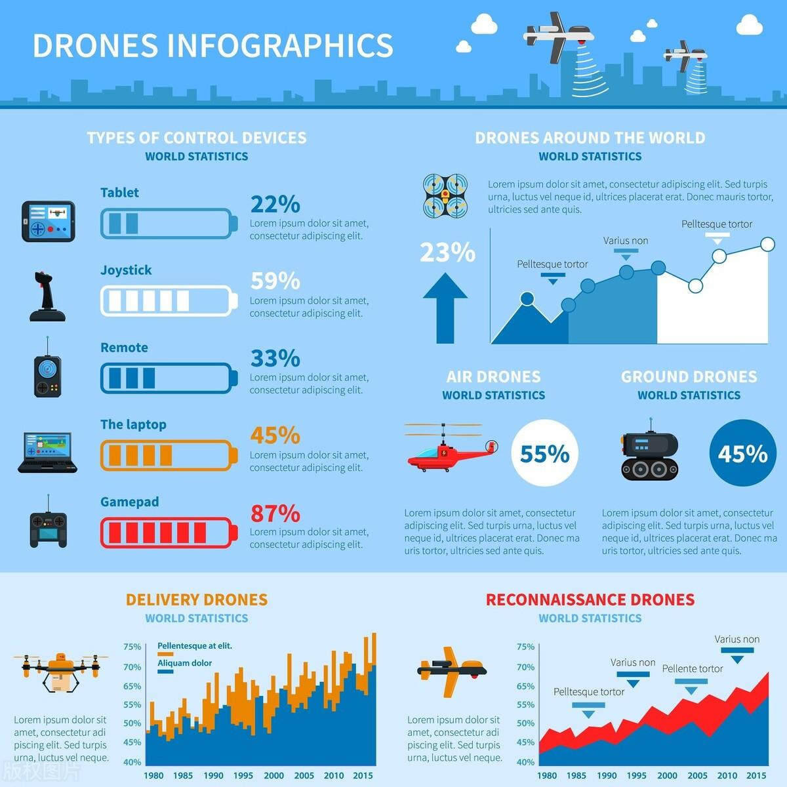

<h1 align="center">架构设计</h1>

[toc]

## 目的

架构设计的主要目的是为了解决软件系统复杂度带来的问题。

通过合理的架构设计提升性能、可用性、扩展性，使得引入变化时可以尽可能抑制成本。

## 设计图

- 功能图
- 架构图
- 流程图
- 类图
- 接口图

画图的优点：

## 结构设计

- 模块化
- 组件化
- 结构分层
- 网络框架选择：优缺点
- 图片加载框架选择：优缺点
- 数据库框架选择：优缺点
- 

## 监控

## 优秀架构文章

- [Software Architecture and Design. It’s the decisions you wish you could… | by D. Husni Fahri Rizal | The Legend | Medium](https://medium.com/the-legend/software-arsitektur-dan-design-90f76288078e)
- [一文教会你如何画好架构图-今日头条 (toutiao.com)](https://www.toutiao.com/article/7223195075596141113/?app=news_article&timestamp=1681948398&use_new_style=1&req_id=20230420075318A13197BACBC10123B3CE&group_id=7223195075596141113&wxshare_count=1&tt_from=weixin&utm_source=weixin&utm_medium=toutiao_android&utm_campaign=client_share&share_token=f79a4fb8-48b9-488a-8c93-d44700204a9f&source=m_redirect)