<h1 align="center">c语言入门这一篇就够了-学习笔记(一万字)</h1>

[toc]

## c语言入门

C语言一经出现就以其功能丰富、表达能力强、灵活方便、应用面广等特点迅速在全世界普及和推广。C语言不但执行效率高而且可移植性好，可以用来开发应用软件、驱动、操作系统等。C语言也是其它众多高级语言的鼻祖语言，所以说学习C语言是进入编程世界的必修课。

## hello,world

```c
#include<stdio.h> 
int main()
{
    /*在双引号中间输入Hello World*/ 
    printf("Hello World");
    return 0; 
}
```

注：在最新的C标准中，main函数前的类型为`int`而不是`void`

## c语言的具体结构

简单来说，一个C程序就是由若干`头文件`和`函数`组成。

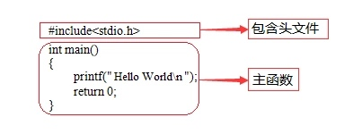

<center>结构</center>


- `#include `就是一条预处理命令, 它的作用是通知C语言编译系统在对C程序进行正式编译之前需做一些预处理工作。
- `函数`就是实现代码逻辑的一个小的**单元**。

## 必不可少之主函数

一个C程序有且只有一个主函数，即`main`函数。


- C程序就是执行主函数里的代码，也可以说这个**主函数**就是C语言中的**唯一入口**。
- 而**main**前面的**int**就是主函数的类型.
- `printf()`是**格式输出**函数，这里就记住它的功能就是在**屏幕上输出指定的信息**
- **return**是函数的返回值，根据函数类型的不同，返回的值也是不同的。
- `\n`是转义字符中的换行符。(注意：C程序一定是从主函数开始执行的)

## 良好习惯之规范

1. **一个说明或一个语句占一行**，例如：包含头文件、一个可执行语句结束都需要**换行**。
2. 函数体内的语句要有明显**缩进**，**通常以按一下Tab键为一个缩进**。
3. 括号要**成对写**，如果需要删除的话也要**成对删除**。
4. 当一句可执行语句结束的时候末尾需要有**分号**。
5. 代码中所有符号均为**英文半角符号**。

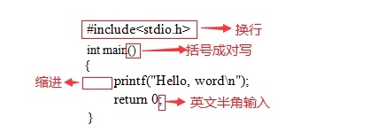

## 程序解释——注释

注释是写给程序员看的，不是写给电脑看的。

C语言注释方法有两种：

> 多行注释： ``` /* 注释内容 */ ```
>
> 单行注释： `//注释一行`

## 有名有姓的C(标识符)

C语言规定，标识符可以是字母`(A～Z，a～z)`、数字`(0～9)`、下划线`_`组成的字符串，并且第一个字符必须是**字母或下划线**。在使用标识符时还有注意以下几点：

1. 标识符的长度最好不要超过8位，因为在某些版本的C中规定标识符前8位有效，当两个标识符前8位相同时，则被认为是同一个标识符。
2. 标识符是严格区分大小写的。例如`Imooc`和`imooc` 是两个不同的标识符。
3. 标识符最好选择有意义的英文单词组成做到"见名知意"，不要使用中文。
4. 标识符不能是C语言的关键字。想了解更多C语言关键字的知识。

## 变量及赋值

变量就是可以变化的量，而每个变量都会有一个名字（标识符）。变量占据内存中一定的存储单元。**使用变量之前必须先定义变量**，要区分**变量名**和**变量值**是两个不同的概念。

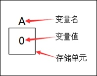


> 变量定义的一般形式为：数据类型 变量名;
>
> 多个类型相同的变量：数据类型 变量名, 变量名, 变量名...;

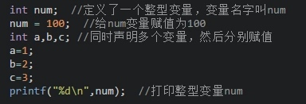

**注意:在定义中不允许连续赋值，如`int a=b=c=5;`是不合法的。**

变量的赋值分为两种方式:

1. 先声明再赋值
2. 声明的同时赋值

## 基本数据类型

C语言中，数据类型可分为：

1. 基本数据类型
2. 构造数据类型
3. 指针类型
4. 空类型四大类

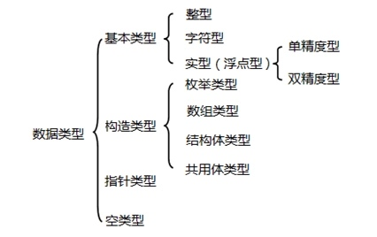


最常用的**整型, 实型与字符型**(char, int, float, double):


**整型数据**是指不带小数的数字(int, short int, long int, unsigned int, unsigned short int, unsigned long int):

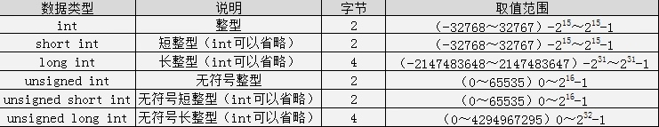


**注：**

- `int` `short int` `long int`是**根据编译环境的不同，所取范围不同。**
- 而其中`short int`和`long int`至少是表中所写范围, 但是`int`在表中是以16位编译环境写的取值范围。
- 另外 c语言`int`的取值范围在于他占用的字节数 ，不同的编译器，规定是不一样。
- ANSI标准定义`int`是占2个字节，TC是按ANSI标准的，它的`int`是占2个字节的。但是在VC里，一个`int`是占4个字节的。

浮点数据是指带小数的数字。

> 生活中有很多信息适合使用浮点型数据来表示，比如：人的体重(单位：公斤)、商品价格、圆周率等等。

因为精度的不同又分为3种(float,double,long double)：

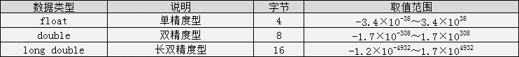


注：**C语言中不存在字符串变量，字符串只能存在字符数组中,**这个后面会讲。

## 格式化输出语句

格式化输出语句，也可以说是**占位输出**，是将各种类型的数据按照**格式化后的类型及指定的位置**从计算机上显示。

其格式为：`printf("输出格式符"，输出项)`;

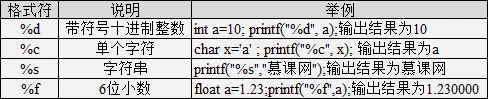


当输出语句中包含普通字符时，可以采用一下格式：

```c
printf("普通字符输出格式符", 输出项);
```

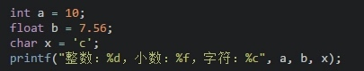


注意：**格式符**的**个数**要与**变量、常量或者表达式的个数一**一对应

## 不可改变的常量

在程序执行过程中，值不发生改变的量称为**常量**。

mtianyan: C语言的常量可以分为**直接常量和符号常量。**

- 直接常量也称为**字面量**，是可以直接拿来使用，无需说明的量，比如：
  - 整型常量：13、0、-13；
  - 实型常量：13.33、-24.4；
  - 字符常量：‘a’、‘M’
  - 字符串常量：”I love imooc!”

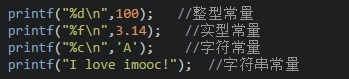


在C语言中，可以**用一个标识符来表示一个常量，称之为符号常量。**符号常量在**使用之前必须先定义**，其一般形式为：

```c
#define 标识符 常量值
```

```c
#include <stdio.h>
#define POCKETMONEY 10    //定义常量及常量值
int main()
{
    // POCKETMONEY = 12;  //小明私自增加零花钱对吗？
    printf("小明今天又得到%d元零花钱\n", POCKETMONEY);
    return 0;  
}
```

符号常量不可以被改变。

## 自动类型转换

数据类型存在自动转换的情况.
自动转换发生在**不同数据类型**运算时，在编译的时候**自动完成**。

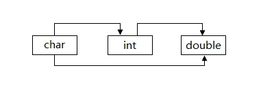


`char`类型数据转换为`int`类型数据遵循`ASCII`码中的对应值.

**注:**

> 字节小的可以向字节大的自动转换，但字节大的不能向字节小的自动转换
>
> char可以转换为int，int可以转换为double，char可以转换为double。但是不可以反向。

## 强制类型转换

强制类型转换是通过**定义类型转换运算**来实现的。其一般形式为：

```
(数据类型) (表达式)
```

其作用是把表达式的运算结果强制转换成**类型说明符所表示的类型**

**在使用强制转换时应注意以下问题：**

1. 数据类型和表达式都必须加括号, 如把`(int)(x/2+y)`写成`(int)x/2+y`则成了把`x`转换成`int`型之后再除`2`再与`y`相加了。
2. **转换后不会改变原数据的类型及变量值，只在本次运算中临时性转换**。
3. 强制转换后的运算结果**不遵循四舍五入**原则。

## 运算符号

C语言中运算符:

```
※ 算术运算符
※ 赋值运算符
※ 关系运算符
※ 逻辑运算符
※ 三目运算符
```

### 算术运算符

c语言**基本运算符:**

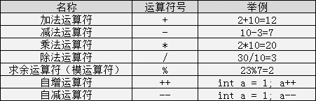

**除法**运算中**注意**：

> 如果相除的两个数都是整数的话，则结果也为整数，小数部分省略，如 ```8/3 = 2``` ;
>
> 而两数中有一个为小数，结果则为小数，如：`9.0/2 = 4.500000`。

mtianyan: **取余**运算中**注意**：

> 该运算只适合用**两个整数**进行取余运算，如：```10%3 = 1``` ；
>
> mtianyan: notes: 而10.0%3则是错误的；**运算后的符号取决于被模数的符号**，如`(-10)%3 = -1;`而`10%(-3) = 1;`

mtianyan: `%%`表示这里就是一个`%`符.

注：**C语言中没有乘方这个运算符**，也不能用`×, ÷`等算术符号。

### 自增与自减运算符

- 自增运算符为`++`，其功能是使变量的值自增1
- 自减运算符为`--`，其功能是使变量值自减1。

它们经常使用在循环中。自增自减运算符有以下几种形式：

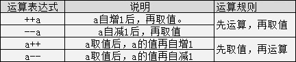

### 赋值运算符

C语言中赋值运算符分为**简单赋值运算符**和**复合赋值运算符**

简单赋值运算符`=`号了，下面讲一下复合赋值运算符：

复合赋值运算符就是在简单赋值符`=`之前加上其它运算符构成.

> 例如`+=、-=、*=、/=、%=`

分析：定义整型变量a并赋值为3，`a += 5;`这个算式就等价于`a = a+5;` 将变量a和5相加之后再赋值给a

注意：复合运算符中**运算符和等号**之间是**不存在空格**的。

### 关系运算符

C语言中的**关系运算符**:

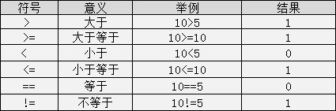


关系表达式的值是`真`和`假`，在C程序用整数`1`和`0`表示。

注意：`>=, <=, ==, !=`这种符号之间**不能存在空格**。

### 逻辑运算符

C语言中的逻辑运算符:

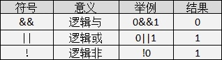


逻辑运算的值也是有两种分别为`真`和`假`，C语言中用整型的 1 和 0 来表示。其求值规则如下：

- 与运算 `&&`

> 参与运算的两个变量都为真时，结果才为真，否则为假。例如：5 >= 5 && 7 > 5 ，运算结果为真；

- 或运算 `||`

> 参与运算的两个变量只要有一个为真，结果就为真。 两个量都为假时，结果为假。例如：5 >= 5 || 5 > 8，运算结果为真；

- 非运算`!`

> 参与运算的变量为真时，结果为假；参与运算量为假时，结果为真。例如：!(5>8)，运算结果为真。

### 三目运算符

C语言中的三目运算符：`?:`，其格式为：

```
表达式1 ? 表达式2 : 表达式3;
```

执行过程是：

> 先判断表达式1的值是否为真，如果是真的话执行表达式2；如果是假的话执行表达式3。

```c
#include <stdio.h>
int main()
{
    //定义小编兜里的钱
    double money =12.0; 
    //定义打车回家的费用
    double cost =11.5;  
    printf("小编能不能打车回家呢："); 
    //输出y小编就打车回家了，输出n小编就不能打车回家
    printf("%c\n",money >= cost ? 'y' : 'n');
    return 0;
}
```

### 运算符大比拼之优先级比较

各种运算符号的顺序:

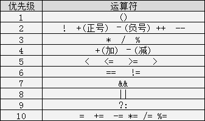

**优先级别为1的优先级最高**，优先级别为10的优先级别最低。

## 分支结构之简单if语句

C语言中的分支结构语句中的`if条件`语句。

简单if语句的基本结构如下：

```c
if(表达式)
{
	执行代码块;
}
```

其语义是：如果表达式的值为真，则执行其后的语句，否则不执行该语句。

注意：`if()`后面没有分号，直接写`{}`

**C 语言把任何非零和非空的值假定为 true，把零或 null 假定为 false**

## 分支结构之简单if-else语句

简单的`if-else`语句的基本结构:

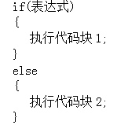


语义是: 如果表达式的值为真，则执行代码块1，否则执行代码块2。

**注意：**

> `if()`后面没有分号，直接写{},else后面也没有分号，直接写{}

## 分支结构之多重if-else语句

C语言中多重`if-else`语句，其结构如下：

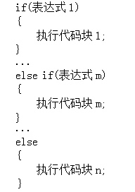


语义是：依次判断表达式的值，当出现某个值为真时，则执行对应代码块，否则执行代码块n。

注意：**当某一条件为真的时候，则不会向下执行该分支结构的其他语句。**

## 分支结构之嵌套if-else语句

C语言中嵌套`if-else`语句。嵌套`if-else`语句的意思，就是在`if-else`语句中，再写`if-else`语句。其一般形式为：

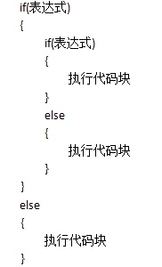

## 循环结构之while循环

反复不停的执行某个动作就是江湖人称的**循环** 。

C语言中有**三种**循环结构,先看一下C语言while循环的结构

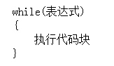


其中表达式表示**循环条件**，执行代码块为**循环体**。

> while语句的语义是：计算表达式的值，当值为`真(非0)`时， 执行循环体代码块。

1. while语句中的表达式一般是关系表达或逻辑表达式，当表达式的值为假时不执行循环体，反之则循环体一直执行。
2. 一定要记着在循环体中改变循环变量的值，否则会出现死循环（无休止的执行）。
3. 循环体如果包括有一个以上的语句，则必须用`{}`括起来，组成复合语句。

## 循环结构之do-while循环

C语言中的`do-while`循环，一般形式如下：

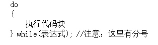


do-while循环语句的语义是:

> 它先执行循环中的执行代码块，然后再判断while中表达式是否为真，如果为真则继续循环；如果为假，则终止循环。因此，**do-while循环至少要执行一次循环语句**。

注意：mtianyan: 使用`do-while`结构语句时，**while括号后必须有分号。**

## 循环结构之for循环(一)

c语言中**for循环**一般形式：

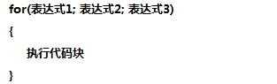


它的执行过程如下：

1. 执行表达式1，对循环变量做初始化；
2. 判断表达式2，若其值为**真(非0)**，则执行for循环体中执行代码块，然后向下执行；若其值为**假(0)**，则结束循环;
3. 执行表达式3，(i++)等对于循环变量进行操作的语句;
4. 执行for循环中执行代码块后执行第二步;第一步初始化只会执行一次。
5. 循环结束，程序继续向下执行。

注意：for循环中的**两个分号**一定要写

## 循环结构之for循环(二)

在for循环中:

- 表达式1是一个或多个**赋值语句**，它用来控制变量的**初始值**；
- 表达式2是一个**关系表达式**，它决定什么时候退出循环；
- 表达式3是**循环变量的步进值**，定义控制循环变量每循环一次后按什么方式变化。
- 这三部分之间用分号 `;` 分开。

使用for语句应该**注意**：

1. for循环中的“表达式1、2、3”均可不写为空，但两个分号`(;;)`不能缺省。
2. 省略“表达式1（循环变量赋初值）”，表示**不对循环变量赋初始值。**
3. 省略“表达式2(循环条件)”，不做其它处理，循环一直执行（**死循环**）。
4. 省略“表达式3(**循环变量增减量**)”，不做其他处理，循环一直执行（死循环）。
5. 表达式1可以是设置循环变量的初值的赋值表达式，**也可以是其他表达式**。
6. 表达式1和表达式3可以是一个简单表达式也可以是多个表达式以逗号分割。

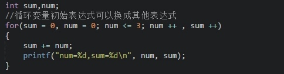

7. 表达式2一般是**关系表达式**或**逻辑表达式**，但也可是数值表达式或字符表达式，**只要其值非零**，就执行循环体。
8. 各表达式中的变量一定要在for循环**之前定义**。

## 怎么获得一个数的百位，十位和个位

- 百位数：`num/100` 可以获得，因为 `int` 是整数型，小数部分会省略。比如 `765/100` 的结果是`7`
- 十位数：`num%100/10` 。比如`765%100`先得到`65`，`65/10`得到`6`
- 个位数：`num%10`。`765%10`得到`5`

## 循环结构之三种循环比较

while, do-while和for三种循环在具体的使用场合上是有区别的，如下：

1. 在**知道循环次数**的情况下更适合使用for循环;
2. 在不知道循环次数的情况下适合使用while或者do-while循环:
   - 如果有可能一次都不循环应考虑使用while循环
   - 如果至少循环一次应考虑使用do-while循环。

但是从本质上讲，while,do-while和for循环之间是可以相互转换的。

## 循环结构之多重循环

**多重循环**就是在**循环结构的循环体中又出现循环结构。**

在实际开发中一般最多用到**三层重循环**。

> 因为循环层数越多，运行时间越长，程序越复杂，所以一般用2-3层多重循环就可以了。另外不同循环之间也是可以嵌套的。

多重循环在执行的过程中，外层循环为**父循环**，内层循环为**子循环**，

> **父循环一次，子循环需要全部执行完，直到跳出循环。**父循环再进入下一次，子循环继续执行...

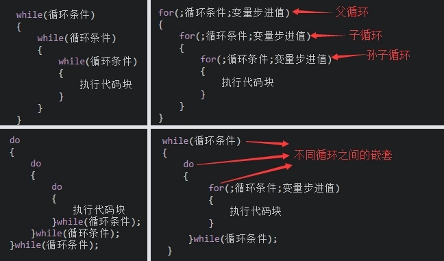


mtianyan: 打印三角形星星堆

```c
#include <stdio.h>
int main()
{
    int i, j, k;
    for(i=1; i<5; i++)
    {
        /* 观察每行的空格数量，补全循环条件 */
        for(j=i; j<5; j++)  
        {
            printf(" ");    //输出空格
        }
        /* 观察每行*号的数量，补全循环条件 */
        for( k=0;k<2*i-1;k++) 
        {
            printf("*");   //每行输出的*号
        }
        printf("\n");     //每次循环换行
    }
    return 0;
}
```

## 使用for循环打印9×9乘法表

```c
#include <stdio.h>
int main() 
{ 
    // 定义相乘数字i,j以及结果result
    int i, j, result;
     for(i = 9; i >= 1; i--)
     {
        for(j = 1; j <= i; j++)
        {
            printf("%d*%d=%d ", i, j, result = i * j);
        }
        printf("\n");
     }
    return 0;
}
```

## 结束语句之break语句

那么循环5次的时候，需要中断不继续训练。在C语言中，可以使用`break`语句进行该操作.

使用`break`语句时注意以下几点：

1. 在没有循环结构的情况下，break不能用在单独的if-else语句中。
2. 在多层循环中，一个break语句只跳出当前循环。

## 结束语句之continue语句

那么循环5次的时候，需要中断后继续训练。在C语言中，可以使用`continue`语句进行该操作

> continue语句的作用是结束本次循环开始执行下一次循环。

break语句与continue语句的区别是:

> break是跳出当前整个循环，continue是结束本次循环开始下一次循环。

## 分支结构之switch语句

switch语句结构如下:

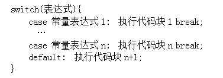


mtianyan: `switch`语句时还应**注意**以下几点：

1. 在case后的各**常量表达式**的值不能相同，否则会出现错误。
2. 在case子句后如果没有**break**;会一直往后执行**一直到遇到break;**才会跳出switch语句。
3. switch后面的表达式语句只能是**整型**或者**字符类型**。
4. 在case后，允许有多个语句，**可以不用{}**括起来。
5. 各case和default子句的先后顺序可以变动，而不会影响程序执行结果。
6. `default`子句可以省略不用。

## mtianyan: switch与if语句的应用(计算是该年的第几天)

```c
#include <stdio.h>

int main() 
{ 
    /* 定义需要计算的日期 */
    int date = 0;
    int year = 2008;
    int month = 8;
    int day = 8;
    switch(month)
    {
        case 12: date += 30;
        case 11: date += 31;
        case 10: date += 30;
        case 9: date += 31;
        case 8: date += 31;
        case 7: date += 30;
        case 6: date += 31;
        case 5: date += 30;
        case 4: date += 31;
        case 3:
            if((year % 4 == 0 && year % 100 != 0) || year % 400 == 0)
            {
                date += 29;
            }
            else
            {
                date += 28;
            }
        case 2:
            date += 31;
        case 1:
            date += day;
            printf("%d年%d月%d日是该年的第%d天", year, month, day, date);
            break;
        default:
            printf("error");
            break;
    }
    return 0;
}
```

正确: continue只能用在循环体内

## 臭名远扬之goto语句

C语言中也有这样的语句，就是`goto`语句，goto语句是一种**无条件分支**语句.

> goto 语句的使用格式为：

```
goto 语句标号;
```

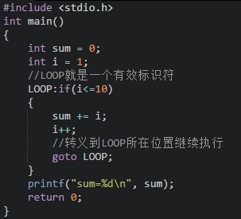

## 自创函数

C语言提供了大量的库函数: 比如`stdio.h`提供输出函数

自定义函数的一般形式：

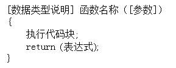

**注意：**

1. `[]` 包含的内容可以省略，数据类型说明省略，默认是 `int` 类型函数; 参数省略表示该函数是**无参函数**，参数不省略表示该函数是**有参函数**;
2. 函数名称遵循**标识符命名规范；**
3. C不支持在函数外返回局部变量的地址，除非定义局部变量为 static 变量。
4. 自定义函数尽量放在 `main` 函数之前，如果要**放在main函数后面的话**, 需要在main函数之前**先声明**自定义函数，声明格式为：

```c
[数据类型说明] 函数名称([参数]);
```

## 函数调用

我们需要用到自定义的函数的时候，就得调用它，那么在调用的时候就称之为**函数调用**。

在C语言中，函数调用的一般形式为：

```c
函数名([参数]);
```

注意：

1. 对无参函数调用的时候可以将`[]`包含的省略。
2. `[]`中可以是**常数，变量或其它构造类型数据及表达式,**多个参数之间用逗号分隔。

## 有参与无参

在函数中不需要函数参数的称之为**无参函数**，在函数中需要函数参数的称之为**有参函数。**

有参和无参函数的一般形式如下：


有参函数和无参函数的**唯一区别**在于：函数 `()` 中多了一个参数列表。

- 有参函数更为灵活，输出的内容可以随着n的改变而随意变动，只要在main函数中传递一个参数就可以了
- 而在无参函数中输出的相对就比较固定，当需要改动的时候还需要到自定义的方法内改变循环变量的值。

## 形参与实参

函数的参数分为**形参**和**实参**两种。

- **形参**是在定义函数名和函数体的时候使用的参数，目的是用来接收调用该函数时传入的参数。

> 就类似小明，说了的话而不实际行动；

- **实参**是在调用时传递该函数的参数。

> 就如小刚能实际行动起来。

函数的**形参和实参**具有以下特点：

- 形参只有在被调用时才分配内存单元，在调用结束时，即刻释放所分配的内存单元。因此，形参只有在函数内部有效。

> 函数调用结束返回主调函数后则不能再使用该形参变量。

- 实参可以是常量、变量、表达式、函数等。

> 无论实参是何种类型的量，在进行函数调用时，它们都必须具有**确定的值**，以便把这些值传送给形参。因此应预先用赋值等办法使实参获得确定值。

- 在参数传递时，实参和形参在数量上，类型上，顺序上应严格一致，否则会发生**类型不匹配**的错误。

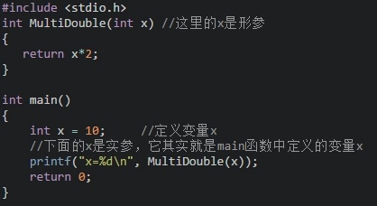

## 函数的返回值

函数的**返回值**是指函数被调用之后，**执行函数体中的程序段所取得的并返回给主调函数的值。**

函数的返回值要注意以下几点：

- 函数的值只能通过`return`语句返回主调函数。

> return语句的一般形式为:

```
return 表达式 或者为： return (表达式);
```

- 函数值的**类型**和函数定义中**函数的类型**应保持一致。

> notes: 如果两者不一致，则以函数返回类型为准，自动进行类型转换。

- **没有返回值**的函数，**返回类型**为 `void`。

**注意：**

> `void`函数中可以有执行代码块，但是不能有返回值.
>
> `void`函数中如果有`return`语句，该语句**只能起到结束函数运行的功能。**其格式为: `return;`

## 递归函数（一）

递归就是一个函数在它的**函数体内调用它自身。**

执行递归函数将反复调用其自身，每调用一次就进入新的一层。

> 注意递归函数必须有结束条件

## 递归函数（二）

5的阶乘这个例子进行一下剖析，看一看他的运算过程：

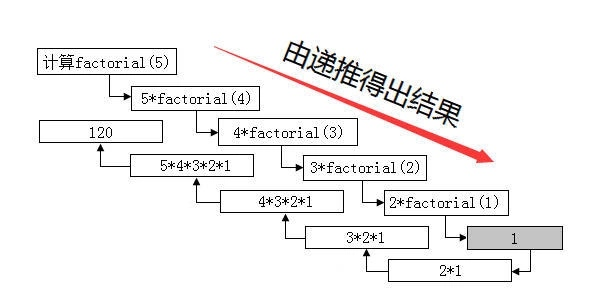


程序在计算5的阶乘的时候，先执行递推，当n=1或者n=0的时候返回1，再回推将计算并返回。由此可以看出递归函数必须有结束条件。

递归函数特点：

1. 每一级函数调用时都有自己的变量，但是函数代码并不会得到复制，如计算5的阶乘时每递推一次变量都不同；
2. 每次调用都会有一次返回，如计算5的阶乘时每递推一次都返回进行下一次；
3. 递归函数中，位于递归调用前的语句和各级被调用函数具有相同的执行顺序；
4. 递归函数中，位于递归调用后的语句的执行顺序和各个被调用函数的顺序相反；
5. 递归函数中必须有终止语句。

一句话总结递归：自我调用且有完成状态

> 任务
> 猴子第一天摘下N个桃子，当时就吃了一半，还不过瘾，就又多吃了一个。第二天又将剩下的桃子吃掉一半，又多吃了一个。以后每天都吃前一天剩下的一半零一个。到第10天在想吃的时候就剩一个桃子了,问第一天共摘下来多少个桃子？并反向打印每天所剩桃子数。

```c
#include <stdio.h>
int getPeachNumber(int n)  
{
    int num;    
    if(n==10)
    {
       return 1;      
    } 
    else
    {
        num = (getPeachNumber(n+1)+1)*2;  
        printf("第%d天所剩桃子%d个\n", n, num); 
    }
    return num;
}
int main()
{
    int num = getPeachNumber(1);
    printf("猴子第一天摘了:%d个桃子。\n", num);
    return 0;
}
```

## 递归demo。

有5个人坐在一起，问第5个人多少岁？他说比第4个人大2岁。问第4个人岁数，他说比第3个人大2岁。问第3个人，又说比第2人大两岁。问第2个人，说比第1个人大两岁。最后 问第1个人，他说是10岁。请问第5个人多大？

> 程序分析：
> 利用递归的方法，递归分为回推和递推两个阶段。要想知道第5个人岁数，需知道第4人的岁数，依次类推，推到第1人（10岁），再往回推。

```c
#include <stdio.h> 
int dfs(int n) {
    return n == 1 ? 10 : dfs(n - 1) + 2;
}
int main() 
{
    
    printf("第5个人的年龄是%d岁", dfs(5)); 
    return 0;
} 
```

## 局部与全局

C语言中的变量，按作用域范围可分为两种，即局部变量和全局变量。

- 局部变量也称为内部变量。局部变量是在函数内作定义说明的。其作用域仅限于函数内， 离开该函数后再使用这种变量是非法的。在复合语句中也可定义变量，其作用域只在复合语句范围内。
- 全局变量也称为外部变量，它是在函数外部定义的变量。它不属于哪一个函数，它属于一个源程序文件。其作用域是整个源程序。

## 变量存储类别

 C语言根据变量的生存周期来划分，可以分为静态存储方式和动态存储方式。

- 静态存储方式：是指在程序运行期间分配固定的存储空间的方式。静态存储区中存放了在整个程序执行过程中都存在的变量，如全局变量。
- 动态存储方式：是指在程序运行期间根据需要进行动态的分配存储空间的方式。动态存储区中存放的变量是根据程序运行的需要而建立和释放的，通常包括：函数形式参数；自动变量；函数调用时的现场保护和返回地址等。

C语言中存储类别又分为四类：

- 自动（auto）、
- 静态（static）、
- 寄存器的（register）
- 外部的（extern）。

1、用关键字auto定义的变量为自动变量，auto可以省略，auto不写则隐含定为“自动存储类别”，属于动态存储方式。如：

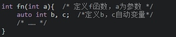

2、用static修饰的为静态变量，如果定义在函数内部的，称之为静态局部变量；如果定义在函数外部，称之为静态外部变量。如下为静态局部变量：

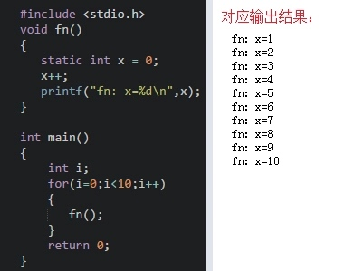


注意：静态局部变量属于静态存储类别，在静态存储区内分配存储单元，在程序整个运行期间都不释放；静态局部变量在编译时赋初值，即只赋初值一次；如果在定义局部变量时不赋初值的话，则对静态局部变量来说，编译时自动赋初值0（对数值型变量）或空字符（对字符变量）。

3、为了提高效率，C语言允许将局部变量得值放在CPU中的寄存器中，这种变量叫“寄存器变量”，用关键字register作声明。例如：

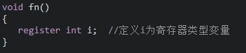


 注意：只有局部自动变量和形式参数可以作为寄存器变量；一个计算机系统中的寄存器数目有限，不能定义任意多个寄存器变量；**局部静态变量不能定义为寄存器变量。**

4、用extern声明的的变量是外部变量，外部变量的意义是某函数可以调用在该函数之后定义的变量。如：

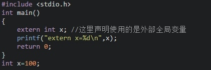

## 内部函数与外部函数

- 在C语言中不能被其他源文件调用的函数称谓内部函数 ，内部函数由static关键字来定义，因此又被称谓静态函数，形式为：
  
  ```c
  static [数据类型] 函数名([参数])
  ```
  
- 这里的static是对函数的作用范围的一个限定，限定该函数只能在其所处的源文件中使用，因此在不同文件中出现相同的函数名称的内部函数是没有问题的。

- 在C语言中能被其他源文件调用的函数称谓外部函数 ，外部函数由extern关键字来定义，形式为：
  
  ```c
  extern [数据类型] 函数名([参数])
  ```
  
- C语言规定，在没有指定函数的作用范围时，系统会默认认为是外部函数，因此当需要定义外部函数时extern也可以省略。

静态变量只赋值一次

## 外部函数练习

hello.c

```c
#include <stdio.h>
#include "test.c"   //引用test.c文件
extern void printLine()     //这里定义的方法对吗？
{
   printf("**************\n");   
}
int main()
{
    say();
    return 0;
}
```

test.c

```c
#include <stdio.h>
void printLine();
static void say(){
	printLine();
	printf("I love imooc\n");
	printf("good good study!\n");
	printf("day day up!\n");
	printLine();
}
```

对于hello.c来说，直接引入了test.c文件。那么就可以调用testc中的static方法say()
而对于test.c并没有引入，可以通过声明来调用另一个源文件中暴露出来的方法。

## 综合练习

> 北京市出租车打车计费规则如下：

1. 每公里单价计费2.3元
2. 起步价13元(包含3公里)
3. 晚上23点(含)至次日凌晨5点(不含)打车，每公里单价计费加收20%。
4. 每次乘车加收1元钱的燃油附加税。

小明每天上下班都要打车，公司和家的距离为12公里，上午上班时间为9点，下午下班时间为6点。
请编写一个小程序计算小明每天打车的总费用。

```c
#include <stdio.h>

float taxifee(int clock,int miles)
{
    float money;
    if(miles<=3)
    {
        money=14;
        printf("费用为14\n");
    }
    else
    {
        if(clock>=23 || clock<5)
        {
            money=13+1+2.3*(miles-3)*1.2;
            printf("夜间车费为：%f\n",money);
        }
        else
        {
            money=13+1+2.3*(miles-3);
            printf("日间车费为：%f\n",money);
        }
    }
    
    return money;    
}
int main()
{
    printf("打的总费用：%.1f\n",taxifee(9,12)+taxifee(18,12));
    return 0;
}
```

## 数组初体验

程序中也需要容器，只不过该容器有点特殊，它在程序中是一块**连续的，大小固定并且里面的数据类型一致的内存空间**，它还有个好听的名字叫数组。可以将数组理解为大小固定，所放物品为同类的一个购物袋，在该购
物袋中的物品是按一定顺序放置的。

我们来看一下如何声明一个数组：

```c
数据类型 数组名称[长度];
```

数组只声明也不行啊，看一下数组是如何初始化的。说到初始化，C语言中的数组初始化是有三种形式的，分别是：

1. 数据类型 数组名称[长度n] = {元素1,元素2…元素n};
2. 数据类型 数组名称[] = {元素1,元素2…元素n};
3. 数据类型 数组名称[长度n]; 数组名称[0] = 元素1; 数组名称[1] = 元素2; 数组名称[n-1] = 元素n;

我们将数据放到数组中之后又如何获取数组中的元素呢？

> 获取数组元素时： 数组名称[元素所对应下标];

如：初始化一个数组 `int arr[3] = {1,2,3};` 那么arr[0]就是元素1。

注意：

1. 数组的下标均以**0开始**；
2. 数组在初始化的时候，数组内元素的个数不能大于声明的数组长度；
3. mtianyan: 如果采用第一种初始化方式，**元素个数小于数组的长度时，多余的数组元素初始化为0；**
4. 在声明数组后没有进行初始化的时候，**静态（static）和外部（extern）类型的数组元素初始化元素为0**，自动（auto）类型的数组的元素初始化值不确定。

## 数组的遍历

数组就可以采用循环的方式将每个元素遍历出来，而不用人为的每次获取指定某个位置上的元素，例如我们用for循环遍历一个数组：

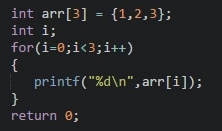


注意以下几点：

1. 最好**避免出现数组越界访问**，循环变量最好不要超出数组的长度.
2. **C语言的数组长度一经声明，长度就是固定，无法改变**，并且**C语言并不提供计算数组长度的方法**。

由于C语言是没有检查数组长度改变或者数组越界的这个机制，可能会在编辑器中编译并通过，但是结果就不能肯定了，因此还是不要越界或者改变数组的长度

c语言获取数组长度

```c
int length = sizeof(arr) / sizeof(arr[0]);
```

## 数组作为函数参数

数组可以由整个数组当作函数的参数，也可以由数组中的某个元素当作函数的参数：

1. 整个数组当作函数参数，即把**数组名称传入函数**中，例如：

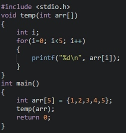

2. 数组中的元素当作函数参数，即把数组中的参数传入函数中，例如：

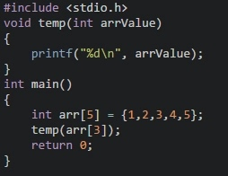


数组作为函数参数时注意以下事项：

1. 数组名作为函数实参传递时，函数定义处作为接收参数的数组类型形参既可以指定长度也可以不指定长度。
2. 数组元素作为函数实参传递时，数组元素类型必须与形参数据类型一致。

## 数组的应用（一）[冒泡排序]

以升序排序为例冒泡排序的思想：相邻元素两两比较，将较大的数字放在后面，直到将所有数字全部排序。就像小学排队时按大小个排一样，将一个同学拉出来和后面的比比，如果高就放后面，一直把队伍排好。

```c
#include <stdio.h>
int main()
{
    double arr[]={1.78, 1.77, 1.82, 1.79, 1.85, 1.75, 1.86, 1.77, 1.81, 1.80};
    int i,j;
    printf("\n************排队前*************\n");
    for(i=0;i<10;i++)
    {
        if(i != 9)   
            printf("%1.2f, ", arr[i]);  //%1.2f表示小数点前一位，小数点后精确到两位
        else
            printf("%1.2f", arr[i]);    //%1.2f表示小数点前一位，小数点后精确到两位
    }
    for(i=8; i>=0; i--)
    {
        for(j=0;j<=i;j++)
        {
            if( arr[j]>arr[j+1])      //当前面的数比后面的数大时
            {
                double temp;    //定义临时变量temp
                temp=arr[j];//将前面的数赋值给temp
                arr[j]=arr[j+1];             //前后之数颠倒位置
                arr[j+1]=temp;//将较大的数放在后面    
            }                 
        }                
    }
    printf("\n************排队后*************\n");
    for(i=0;i<10;i++)
    {
        if(i != 9)   
            printf("%1.2f, ", arr[i]);  //%1.2f表示小数点前一位，小数点后精确到两位     
        else
            printf("%1.2f", arr[i]);    //%1.2f表示小数点前一位，小数点后精确到两位
    }
    return 0;    
}
```

## 数组的应用（二）[数组查找功能]

当我们购物之后，拎着购物袋回到家，会一一检查购物袋中的物品看是否缺少或者都是想购之物。

那么应用到程序中，可以使用数组查找功能，看看是否存在该数据，如果存在并返回该元素的下标。

```c
#include <stdio.h>
int getIndex(int arr[5],int value)
{
    int i;
    int index;
    for(i=0;i<5;i++)
    {
       /* 请完善数组查询功能 */
       if(arr[i]==value)
        {
            index=i;
            break;
        }  
       index=-1;
    }
    return index;
}

int main()
{
    int arr[5]={3,12,9,8,6};
    int value = 8;
    int index = getIndex(arr,value);      //这里应该传什么参数呢？
    if(index!=-1)
    {
        printf("%d在数组中存在，下标为：%d\n",value,index);             
    }
    else
    {
        printf("%d在数组中不存在。\n",value);    
    }
    return 0;    
}
```

## 字符串与数组

C语言中，是没有办法直接定义字符串数据类型的，但是我们可以使用数组来定义我们所要的字符串。一般有以下两种格式：

1. char 字符串名称[长度] = "字符串值";
2. char 字符串名称[长度] = {'字符1','字符2',...,'字符n','0'};

注意：

1. []中的长度是可以省略不写的；
2. 采用第2种方式的时候最后一个元素必须是'0'，'0'表示字符串的结束标志；
3. 采用第2种方式的时候在数组中不能写中文。

在输出字符串的时候要使用：`printf(“%s”,字符数组名字);`或者`puts(字符数组名字)`;。

## 字符串函数

常用的字符串函数如下(strlen,strcmp,strcpy,strcat,atoi):

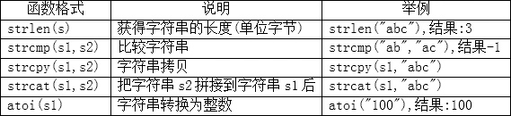


使用字符串函数注意以下事项：

1. strlen()获取字符串的长度，在字符串长度中是不包括‘0’而且汉字和字母的长度是不一样的。比如：

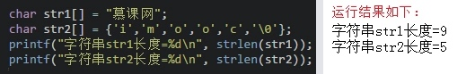


2. strcmp()在比较的时候会把字符串先转换成ASCII码再进行比较,返回的结果为0表示s1和s2的ASCII码相等,返回结果为1表示s1比s2的ASCII码大,返回结果为-1表示s1比s2的ASCII码小，例如：

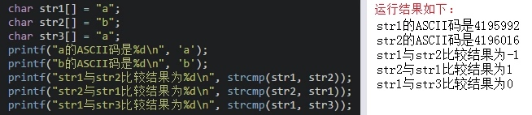


3. strcpy()拷贝之后会覆盖原来字符串且不能对字符串常量进行拷贝，比如：

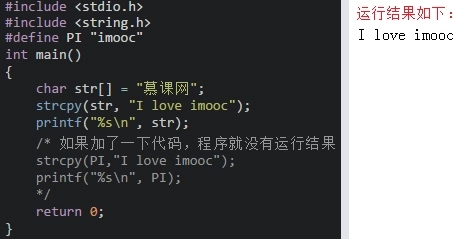


4. strcat在使用时s1与s2指的内存空间不能重叠，且s1要有足够的空间来容纳要复制的字符串，如：


## 多维数组

多维数组的定义格式是：
数据类型 数组名称常量表达式1...[常量表达式n];


定义了一个名称为num，数据类型为int的二维数组。其中第一个[3]表示第一维下标的长度，就像购物时分类存放的购物；第二个[3]表示第二维下标的长度，就像每个购物袋中的元素。

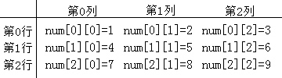


多维数组的初始化与一维数组的初始化类似也是分两种：

1. 数据类型 数组名称常量表达式1...[常量表达式n] = {{值1,..,值n},{值1,..,值n},...,{值1,..,值n}};
2. 数据类型 数组名称常量表达式1...[常量表达式n]; 数组名称下标1...[下标n] = 值;

多维数组初始化要注意以下事项：

1. 采用第一种始化时数组声明必须指定列的维数。**mtianyan: 因为系统会根据数组中元素的总个数来分配空间，当知道元素总个数以及列的维数后，会直接计算出行的维数；**
2. 采用第二种初始化时数组声明必须同时指定行和列的维数。

**二维数组定义的时候，可以不指定行的数量，但是必须指定列的数量**

> 二维数组定义的时候，可以不指定行的数量，但是必须指定列的数量。

## 多维数组的遍历

多维数组也是存在遍历的，和一维数组遍历一样，也是需要用到循环。不一样的就是多维数组需要采用嵌套循环

注意：多维数组的每一维下标均不能越界

## 综合练习：

```c
#include <stdio.h>
#define N 10
//打印分数 
void printScore(int score[])
{
    int i;
    printf("\n");
    for(i=0;i<N;i++)
    {
        printf("%d ",score[i]);               
    }
    printf("\n");     
}
//计算考试总分 
int getTotalScore(int score[])
{
    int sum = 0;
    int i;
    for(i=0;i<N;i++)
    {
        sum+=score[i];                
    } 
    return sum;
}
//计算平均分 
int getAvgScore(int score[])
{
    return getTotalScore(score)/N;   
}
//计算最高分 
int getMax(int score[])
{
    int max = -1;
    int i;
    for(i=0;i<N;i++)
    {
        if(score[i]>max)
        {
            max = score[i];              
        }                
    } 
    return max;
}
//计算最低分 
int getMin(int score[])
{
    int min =100;
    int i;
    for(i=0;i<N;i++)
    {
        if(score[i]< min)
        {
            min = score[i];              
        }                
    } 
    return min;
}
//分数降序排序 
void sort(int score[])
{
    int i,j;
    for(i=N-2;i>=0;i--)
    {
        for(j=0;j<=i;j++)
        {
            if(score[j]<score[j+1])
            {
                int temp;
                temp = score[j];
                score[j] = score[j+1]; 
                score[j+1]=temp;                  
            }                 
        }                   
    }
    printScore(score);     
}

int main()
{
    int score[N]={67,98,75,63,82,79,81,91,66,84};
    int sum,avg,max,min;
    sum = getTotalScore(score);
    avg = getAvgScore(score);
    max = getMax(score);
    min = getMin(score);
    printf("总分是：%d\n",sum);
    printf("平均分是：%d\n",avg);
    printf("最高分是：%d\n",max);
    printf("最低分是：%d\n",min);
    printf("----------成绩排名---------\n");
    sort(score);
    return 0;    
}
```

来源：https://segmentfault.com/a/1190000015699060