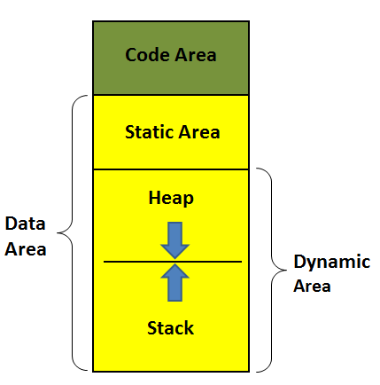
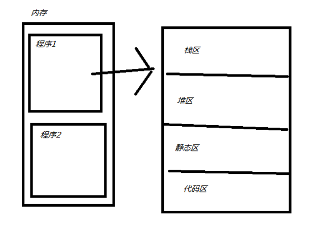
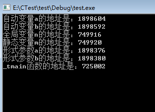
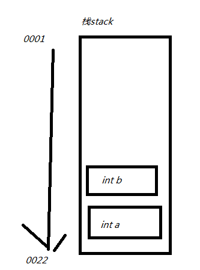
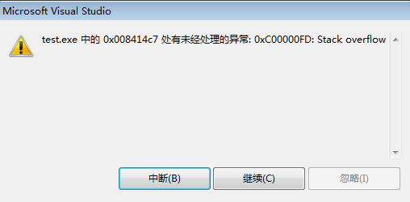
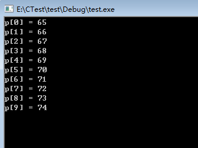
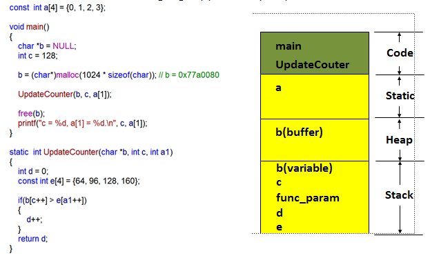
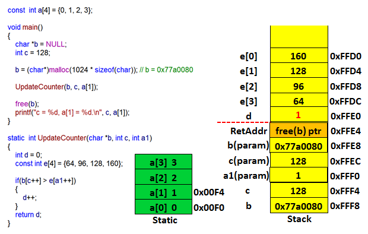
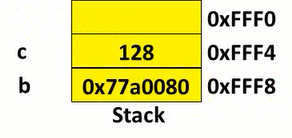

<h1 align="center">C语言：内存管理</h1>

[toc]

在计算机系统，特别是嵌入式系统中，内存资源是非常有限的。尤其对于移动端开发者来说，硬件资源的限制使得其在程序设计中首要考虑的问题就是如何有效地管理内存资源。本文是作者在学习C语言内存管理的过程中做的一个总结，如有不妥之处，望读者不吝指正。

## 一、几个基本概念

　　在C语言中，关于内存管理的知识点比较多，如函数、变量、作用域、指针等，在探究C语言内存管理机制时，先简单复习下这几个基本概念：

1.变量：不解释。但需要搞清楚这几种变量类型：

- 全局变量（外部变量）：出现在代码块{}之外的变量就是全局变量。
- 局部变量（自动变量）：一般情况下，代码块{}内部定义的变量就是自动变量，也可使用auto显示定义。
- 静态变量：是指内存位置在程序执行期间一直不改变的变量，用关键字static修饰。代码块内部的静态变量只能被这个代码块内部访问，代码块外部的静态变量只能被定义这个变量的文件访问。

注意：extern修饰变量时，根据具体情况，既可以看作是定义也可以看作是声明；但extern修饰函数时只能是定义，没有二义性。

2.作用域：通常指的是变量的作用域，广义上讲，也有函数作用域及文件作用域等。我理解的作用域就是指某个事物能够存在的区域或范围，比如一滴水只有在0-100摄氏度之间才能存在，超出这个范围，广义上讲的“水”就不存在了，它就变成了冰或气体。

3.函数：不解释。

注意：C语言中函数默认都是全局的，可以使用static关键字将函数声明为静态函数（只能被定义这个函数的文件访问的函数）。

## 二、内存四区

　　计算机中的内存是分区来管理的，程序和程序之间的内存是独立的，不能互相访问，比如QQ和浏览器分别所占的内存区域是不能相互访问的。而每个程序的内存也是分区管理的，一个应用程序所占的内存可以分为很多个区域，我们需要了解的主要有四个区域，通常叫内存四区，如下图：

### 1.代码区

　　程序被操作系统加载到内存的时候，所有的可执行代码（程序代码指令、常量字符串等）都加载到代码区，这块内存在程序运行期间是不变的。代码区是平行的，里面装的就是一堆指令，在程序运行期间是不能改变的。函数也是代码的一部分，故函数都被放在代码区，包括main函数。

　　注意："int a = 0;"语句可拆分成"int a;"和"a = 0"，定义变量a的"int a;"语句并不是代码，它在程序编译时就执行了，并没有放到代码区，放到代码区的只有"a = 0"这句。

### 2.静态区

　　静态区存放程序中所有的全局变量和静态变量。

### 3.栈区

　　栈（stack）是一种先进后出的内存结构，所有的自动变量、函数形参都存储在栈中，这个动作由编译器自动完成，我们写程序时不需要考虑。栈区在程序运行期间是可以随时修改的。当一个自动变量超出其作用域时，自动从栈中弹出。

- 每个线程都有自己专属的栈；
- 栈的最大尺寸固定，超出则引起栈溢出；
- 变量离开作用域后栈上的内存会自动释放。

　　Talk is cheap, show you the code：

```c
//实验一：观察代码区、静态区、栈区的内存地址

#include "stdafx.h"
int n = 0;
void test(int a, int b)
{
printf("形式参数a的地址是：%d\n形式参数b的地址是：%d\n",&a, &b);
}
int _tmain(int argc, _TCHAR* argv[])
{
static int m = 0;
int a = 0;
int b = 0;
printf("自动变量a的地址是：%d\n自动变量b的地址是：%d\n", &a, &b);
printf("全局变量n的地址是：%d\n静态变量m的地址是：%d\n", &n, &m);
test(a, b);
printf("_tmain函数的地址是：%d", &_tmain);
getchar();
}
```

运行结果如下：

                          

　　结果分析：自动变量a和b依次被定义和赋值，都在栈区存放，内存地址只相差12，需要注意的是a的地址比b要大，这是因为栈是一种先进后出的数据存储结构，先存放的a,后存放的b,形象化表示如上图（注意地址编号顺序）。一旦超出作用域，那么变量b将先于变量a被销毁。这很像往箱子里放衣服，最先放的最后才能被拿出，最后放的最先被拿出。

```c
//实验二：栈变量与作用域
#include "stdafx.h"
//函数的返回值是一个指针，尽管这样可以运行程序，但这样做是不合法的，因为
//非要这样做需在x变量前加static关键字修饰，即static int a = 0;
int *getx()
{
    int x = 10;
    return &x;
}

int _tmain(int argc, _TCHAR* argv[])
{
    int *p = getx();
    *p = 20;
    printf("%d", *p);
    getchar();
}
```

​	这段代码没有任何语法错误，也能得到预期的结果：20。但是这么写是有问题的：因为int *p = getx()中变量x的作用域为getx()函数体内部，这里得到一个临时栈变量x的地址，getx()函数调用结束后这个地址就无效了，但是后面的*p = 20仍然在对其进行访问并修改，结果可能对也可能错，实际工作中应避免这种做法，不然怎么死的都不知道。**不能将一个栈变量的地址通过函数的返回值返回，切记！**

　　另外，栈不会很大，一般都是以K为单位。如果在程序中直接将较大的数组保存在函数内的栈变量中，很可能会内存溢出，导致程序崩溃（如下实验三），严格来说应该叫栈溢出（当栈空间以满，但还往栈内存压变量，这个就叫栈溢出）。

```c
//实验三：看看什么是栈溢出
int _tmain(int argc, _TCHAR* argv[])
{
    char array_char[1024*1024*1024] = {0};
    array_char[0] = 'a';
    printf("%s", array_char);
    getchar();
}
```



怎么办？这个时候就该堆出场了。

### 4.堆区

　　堆（heap）和栈一样，也是一种在程序运行过程中可以随时修改的内存区域，但没有栈那样先进后出的顺序。更重要的是堆是一个大容器，它的容量要远远大于栈，这可以解决上面实验三造成的内存溢出困难。一般比较复杂的数据类型都是放在堆中。但是在C语言中，堆内存空间的申请和释放需要手动通过代码来完成。对于一个32位操作系统，最大管理管理4G内存，其中1G是给操作系统自己用的，剩下的3G都是给用户程序，一个用户程序理论上可以使用3G的内存空间。堆上的内存必须手动释放（C/C++），除非语言执行环境支持GC（如C#在.NET上运行就有垃圾回收机制）。那堆内存如何使用？

　　接下来看堆内存的分配和释放：

**malloc与free**

　　malloc函数用来在堆中分配指定大小的内存，单位为字节（Byte），函数返回void *指针；free负责在堆中释放malloc分配的内存。**malloc与free一定成对使用**。看下面的例子：

```c
//实验四：解决栈溢出的问题
#include "stdafx.h"
#include "stdlib.h"
#include "string.h"

void print_array(char *p, char n)
{
    int i = 0;
    for (i = 0; i < n; i++)
    {
        printf("p[%d] = %d\n", i, p[i]);
    }
}

int _tmain(int argc, _TCHAR* argv[])
{
    char *p = (char *)malloc(1024*1024*1024);//在堆中申请了内存
    memset(p, 'a', sizeof(int) * 10);//初始化内存
    int i = 0;
    for (i = 0; i < 10; i++)
    {
        p[i] = i + 65;
    }
    print_array(p, 10);
    free(p);//释放申请的堆内存
    getchar();
}
```

运行结果为：



 　程序可以正常运行，这样就解决了刚才实验三的栈溢出问题。堆的容量有多大?理论上讲，它可以使用除了系统占用内存空间之外的所有空间。实际上比这要小些，比如我们平时会打开诸如QQ、浏览器之类的软件，但这在一般情况下足够用了。实验二中说到，不能将一个栈变量的地址通过函数的返回值返回，如果我们需要返回一个函数内定义的变量的地址该怎么办？可以这样做：

```c
//实验五：
#include "stdafx.h"
#include "stdlib.h"

int *getx()
{
    int *p = (int *)malloc(sizeof(int));//申请了一个堆空间
    return p;
}

int _tmain(int argc, _TCHAR* argv[])
{
    int *pp = getx();
    *pp = 10;
    free(pp);
}
```

　　这样写是没有问题的，**可以通过函数返回一个堆地址，但记得一定用通过free函数释放申请的堆内存空间**。"int *p = (int *)malloc(sizeof(int));"换成"static int a = 0"也是合法的。因为静态区的内存在程序运行的整个期间都有效，但是后面的free函数就不能用了！

　　用来在堆中申请内存空间的函数还有calloc和realloc，用法与malloc类似。

##  三、案例分析

### 案例一



 部分分析如下：

　　main函数和UpdateCounter为代码的一部分，故存放在代码区

　　数组a默认为全局变量，故存放在静态区

　　main函数中的"char *b = NULL"定义了自动变量b(variable)，故其存放在栈区

　　接着"b = (char *)malloc(1024*sizeof(char));"向堆申请了部分内存空间，故这段空间在堆区

### 案例二



　　需要注意以下几点：

- **栈是从高地址向低地址方向增长；**
- ***\*在C语言中，函数参数的入栈顺序是从右到左，\****因此UpdateCounter函数的3个参数入栈顺序是a1、c、b***\*；\****
- ***\**\*C语言中形参和实参之间是值传递，\*\**\***UpdateCounter函数里的参数a[1]、c、b与静态区的a[1]、c、b不是同一个***\**\*\*\*\*\*\*\*；\*\*\*\*\*\*\*\*\****

　　"char *b = NULL"定义一个指针变量b，b的地址是0xFFF8，值为空-->运行到"b = (char*)malloc(1024*sizeof(char))"时才在堆中申请了一块内存（假设这块内存地址为0x77a0080）给了b，此时b的地址并没有变化，但其值变为了0x77a0080，这个值指向了一个堆空间的地址（栈变量的值指向了堆空间），这个过程b的内存变化如下：

​                   ---------->

## 四、学习内存管理的目的

　　学习内存管理就是为了知道日后怎么样在合适的时候管理我们的内存。那么问题来了？什么时候用堆什么时候用栈呢？一般遵循以下三个原则：

- 如果明确知道数据占用多少内存，那么数据量较小时用栈，较大时用堆；
- 如果不知道数据量大小（可能需要占用较大内存），最好用堆（因为这样保险些）；
- 如果需要动态创建数组，则用堆。

```c
//实验六：动态创建数组
int _tmain(int argc, _TCHAR* argv[])
{
    int i;
    scanf("%d", &i);
    int *array = (int *)malloc(sizeof(int) * i);
    //...//这里对动态创建的数组做其他操作
    free(array);
}
```

## 最后的最后 

　　操作系统在管理内存时，最小单位不是字节，而是内存页（32位操作系统的内存页一般是4K）。比如，初次申请1K内存，操作系统会分配1个内存页，也就是4K内存。4K是一个折中的选择，因为：**内存页越大，内存浪费越多，但操作系统内存调度效率高，不用频繁分配和释放内存；内存页越小，内存浪费越少，但操作系统内存调度效率低，需要频繁分配和释放内存**。嵌入式系统的内存内存资源很稀缺，其内存页会更小，因此在嵌入式开发当中需要特别注意。


## 参考

* [C语言知识整理（3）：内存管理（详细版） - mattran - 博客园 (cnblogs.com)](https://www.cnblogs.com/yif1991/p/5049638.html)