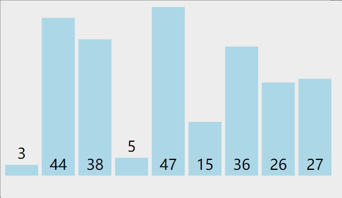
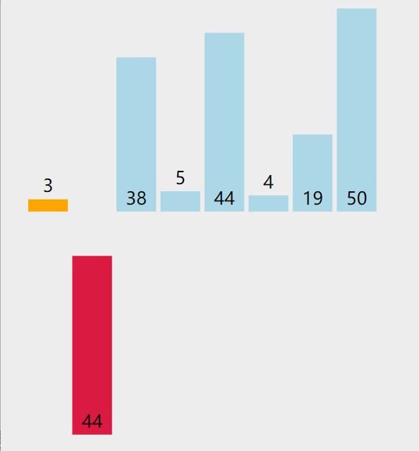

<h1 align="center">C语言十大经典排序算法（动态演示+代码，值得收藏）</h1>

以前也零零碎碎发过一些排序算法，但排版都不太好，又重新整理一次，排序算法是数据结构的重要部分，系统地学习很有必要。

## 时间、空间复杂度比较

| 排序算法 | 平均时间复杂度 | 最差时间复杂度 | 空间复杂度 | 数据对象稳定性       |
| :------- | :------------- | :------------- | :--------- | :------------------- |
| 冒泡排序 | O(n2)          | O(n2)          | O(1)       | 稳定                 |
| 选择排序 | O(n2)          | O(n2)          | O(1)       | 数组不稳定、链表稳定 |
| 插入排序 | O(n2)          | O(n2)          | O(1)       | 稳定                 |
| 快速排序 | O(n*log2n)     | O(n2)          | O(log2n)   | 不稳定               |
| 堆排序   | O(n*log2n)     | O(n*log2n)     | O(1)       | 不稳定               |
| 归并排序 | O(n*log2n)     | O(n*log2n)     | O(n)       | 稳定                 |
| 希尔排序 | O(n*log2n)     | O(n2)          | O(1)       | 不稳定               |
| 计数排序 | O(n+m)         | O(n+m)         | O(n+m)     | 稳定                 |
| 桶排序   | O(n)           | O(n)           | O(m)       | 稳定                 |
| 基数排序 | O(k*n)         | O(n2)          |            | 稳定                 |

## 1 冒泡排序

**算法思想**：

1. 比较相邻的元素。如果第一个比第二个大，就交换他们两个。

2. 对每一对相邻元素作同样的工作，从开始第一对到结尾的最后一对。这步做完后，最后的元素会是最大的数。

3. 针对所有的元素重复以上的步骤，除了最后一个。

4. 持续每次对越来越少的元素重复上面的步骤，直到没有任何一对数字需要比较。

   

<center>冒泡排序动图演示</center>

### 代码：

```c
void bubbleSort(int a[], int n)
{
  for(int i =0 ; i< n-1; ++i)
  {
    for(int j = 0; j < n-i-1; ++j)
    {
      if(a[j] > a[j+1])
      {
        int tmp = a[j] ;  //交换
        a[j] = a[j+1] ;
        a[j+1] = tmp;
      }
    }
  }
}
```

## 2 选择排序

**算法思想**：

1. 在未排序序列中找到最小（大）元素，存放到排序序列的起始位置
2. 从剩余未排序元素中继续寻找最小（大）元素，然后放到已排序序列的末尾
3. 以此类推，直到所有元素均排序完毕


<center>选择排序动图演示</center>

### 代码：

```c
function selectionSort(arr) {
    var len = arr.length;
    var minIndex, temp;
    for (var i = 0; i < len - 1; i++) {
        minIndex = i;
        for (var j = i + 1; j < len; j++) {
            if (arr[j] < arr[minIndex]) {     // 寻找最小的数
                minIndex = j;                 // 将最小数的索引保存
            }
        }
        temp = arr[i];
        arr[i] = arr[minIndex];
        arr[minIndex] = temp;
    }
    return arr;
}
```

## 3 插入排序

**算法思想**：

1. 从第一个元素开始，该元素可以认为已经被排序
2. 取出下一个元素，在已经排序的元素序列中从后向前扫描
3. 如果该元素（已排序）大于新元素，将该元素移到下一位置
4. 重复步骤3，直到找到已排序的元素小于或者等于新元素的位置
5. 将新元素插入到该位置后
6. 重复步骤2~5



<center>插入排序动图演示</center>

### 代码：

```c
void print(int a[], int n ,int i){
  cout<<i <<":";
  for(int j= 0; j<8; j++){
    cout<<a[j] <<" ";
  }
  cout<<endl;
}
void InsertSort(int a[], int n)
{
  for(int i= 1; i<n; i++){
    if(a[i] < a[i-1]){   //若第i个元素大于i-1元素，直接插入。小于的话，移动有序表后插入
      int j= i-1;
      int x = a[i];     //复制为哨兵，即存储待排序元素
      a[i] = a[i-1];           //先后移一个元素
      while(x < a[j]){   //查找在有序表的插入位置
        a[j+1] = a[j];
        j--;     //元素后移
      }
      a[j+1] = x;     //插入到正确位置
    }
    print(a,n,i);      //打印每趟排序的结果
  }

}

int main(){
  int a[15] = {2，3,4,5,15，19，16，27，36，38，44，46，47，48，50};
  InsertSort(a,15);
  print(a,15,15);
}
```

## 4 快速排序

**算法思想**：

1. 选取第一个数为基准
2. 将比基准小的数交换到前面，比基准大的数交换到后面
3. 对左右区间重复第二步，直到各区间只有一个数


<center>快速排序动图演示</center>

### 代码：

```c
void QuickSort(vector<int>& v, int low, int high) {
if (low >= high)// 结束标志
return;
int first = low;// 低位下标
int last = high;// 高位下标
int key = v[first];// 设第一个为基准

while (first < last)
{
// 将比第一个小的移到前面
while (first < last && v[last] >= key)
last--;
if (first < last)
v[first++] = v[last];

// 将比第一个大的移到后面
while (first < last && v[first] <= key)
first++;
if (first < last)
v[last--] = v[first];
}
//
v[first] = key;
// 前半递归
QuickSort(v, low, first - 1);
// 后半递归
QuickSort(v, first + 1, high);
}
```

## 5 堆排序

堆排序（Heapsort）是指利用堆这种数据结构所设计的一种排序算法。堆积是一个近似完全二叉树的结构，并同时满足堆积的性质：即子结点的键值或索引总是小于（或者大于）它的父节点。

**算法思想**：

1. 将初始待排序关键字序列(R1,R2….Rn)构建成大顶堆，此堆为初始的无序区；
2. 将堆顶元素R[1]与最后一个元素R[n]交换，此时得到新的无序区(R1,R2,……Rn-1)和新的有序区(Rn),且满足R[1,2…n-1]<=R[n]；
3. 由于交换后新的堆顶R[1]可能违反堆的性质，因此需要对当前无序区(R1,R2,……Rn-1)调整为新堆，然后再次将R[1]与无序区最后一个元素交换，得到新的无序区(R1,R2….Rn-2)和新的有序区(Rn-1,Rn)。不断重复此过程直到有序区的元素个数为n-1，则整个排序过程完成。

### 代码：

```c
#include <iostream>
#include <algorithm>
using namespace std;

// 堆排序：（最大堆，有序区）。从堆顶把根卸出来放在有序区之前，再恢复堆。

void max_heapify(int arr[], int start, int end) {
//建立父节点指标和子节点指标
int dad = start;
int son = dad * 2 + 1;
while (son <= end) { //若子节点在范围内才做比较
if (son + 1 <= end && arr[son] < arr[son + 1]) //先比较两个子节点指标，选择最大的
son++;
if (arr[dad] > arr[son]) //如果父节点大于子节点代表调整完成，直接跳出函数
return;
else { //否则交换父子內容再继续子节点与孙节点比較
swap(arr[dad], arr[son]);
dad = son;
son = dad * 2 + 1;
}
}
}

void heap_sort(int arr[], int len) {
//初始化，i从最后一个父节点开始调整
for (int i = len / 2 - 1; i >= 0; i--)
max_heapify(arr, i, len - 1);
//先将第一个元素和已经排好的元素前一位做交换，再从新调整(刚调整的元素之前的元素)，直到排序完成
for (int i = len - 1; i > 0; i--) {
swap(arr[0], arr[i]);
max_heapify(arr, 0, i - 1);
}
}

int main() {
int arr[] = { 3, 5, 3, 0, 8, 6, 1, 5, 8, 6, 2, 4, 9, 4, 7, 0, 1, 8, 9, 7, 3, 1, 2, 5, 9, 7, 4, 0, 2, 6 };
int len = (int) sizeof(arr) / sizeof(*arr);
heap_sort(arr, len);
for (int i = 0; i < len; i++)
cout << arr[i] << ' ';
cout << endl;
return 0;
}
```

## 6 归并排序

归并排序是建立在归并操作上的一种有效的排序算法。该算法是采用分治法（Divide and Conquer）的一个非常典型的应用。将已有序的子序列合并，得到完全有序的序列；即先使每个子序列有序，再使子序列段间有序。若将两个有序表合并成一个有序表，称为2-路归并。

**算法思想**：1.把长度为n的输入序列分成两个长度为n/2的子序列；2. 对这两个子序列分别采用归并排序；3. 将两个排序好的子序列合并成一个最终的排序序列。


<center>归并排序动图演示</center>

### 代码：

```c
void print(int a[], int n){
  for(int j= 0; j<n; j++){
    cout<<a[j] <<"  ";
  }
  cout<<endl;
}

//将r[i…m]和r[m +1 …n]归并到辅助数组rf[i…n]
void Merge(ElemType *r,ElemType *rf, int i, int m, int n)
{
  int j,k;
  for(j=m+1,k=i; i<=m && j <=n ; ++k){
    if(r[j] < r[i]) rf[k] = r[j++];
    else rf[k] = r[i++];
  }
  while(i <= m)  rf[k++] = r[i++];
  while(j <= n)  rf[k++] = r[j++];
  print(rf,n+1);
}

void MergeSort(ElemType *r, ElemType *rf, int lenght)
{
  int len = 1;
  ElemType *q = r ;
  ElemType *tmp ;
  while(len < lenght) {
    int s = len;
    len = 2 * s ;
    int i = 0;
    while(i+ len <lenght){
      Merge(q, rf,  i, i+ s-1, i+ len-1 ); //对等长的两个子表合并
      i = i+ len;
    }
    if(i + s < lenght){
      Merge(q, rf,  i, i+ s -1, lenght -1); //对不等长的两个子表合并
    }
    tmp = q; q = rf; rf = tmp; //交换q,rf，以保证下一趟归并时，仍从q 归并到rf
  }
}


int main(){
  int a[10] = {2，3,4，5,15,19,26,27,36,38,44,46,47,48,50};
  int b[10];
  MergeSort(a, b, 15);
  print(b,15);
  cout<<"结果：";
  print(a,10);
}
```

## 7 希尔排序

希尔排序，也称递减增量排序算法，是插入排序的一种更高效的改进版本。但希尔排序是非稳定排序算法。先将整个待排序的记录序列分割成为若干子序列分别进行直接插入排序.

**算法思想**：

1. 选择一个增量序列t1，t2，…，tk，其中ti>tj，tk=1；
2. 按增量序列个数k，对序列进行k 趟排序；
3. 每趟排序，根据对应的增量ti，将待排序列分割成若干长度为m 的子序列，分别对各子表进行直接插入排序。仅增量因子为1 时，整个序列作为一个表来处理，表长度即为整个序列的长度。


<center>希尔排序动图演示</center>

### 代码：

```c
void shell_sort(T array[], int length) {
    int h = 1;
    while (h < length / 3) {
        h = 3 * h + 1;
    }
    while (h >= 1) {
        for (int i = h; i < length; i++) {
            for (int j = i; j >= h && array[j] < array[j - h]; j -= h) {
                std::swap(array[j], array[j - h]);
            }
        }
        h = h / 3;
    }
}
```

## 8 计数排序

计数排序统计小于等于该元素值的元素的个数i，于是该元素就放在目标数组的索引i位（i≥0）。

- 计数排序基于一个假设，待排序数列的所有数均为整数，且出现在（0，k）的区间之内。
- 如果 k（待排数组的最大值） 过大则会引起较大的空间复杂度，一般是用来排序 0 到 100 之间的数字的最好的算法，但是它不适合按字母顺序排序人名。
- 计数排序不是比较排序，排序的速度快于任何比较排序算法。

**算法思想**：

1. 找出待排序的数组中最大和最小的元素；
2. 统计数组中每个值为 i 的元素出现的次数，存入数组 C 的第 i 项；
3. 对所有的计数累加（从 C 中的第一个元素开始，每一项和前一项相加）；
4. 向填充目标数组：将每个元素 i 放在新数组的第 C[i] 项，每放一个元素就将 C[i] 减去 1；


<center>计数排序动图演示</center>

### 代码：

```c
#include <iostream>
#include <vector>
#include <algorithm>

using namespace std;

// 计数排序
void CountSort(vector<int>& vecRaw, vector<int>& vecObj)
{
// 确保待排序容器非空
if (vecRaw.size() == 0)
return;

// 使用 vecRaw 的最大值 + 1 作为计数容器 countVec 的大小
int vecCountLength = (*max_element(begin(vecRaw), end(vecRaw))) + 1;
vector<int> vecCount(vecCountLength, 0);

// 统计每个键值出现的次数
for (int i = 0; i < vecRaw.size(); i++)
vecCount[vecRaw[i]]++;

// 后面的键值出现的位置为前面所有键值出现的次数之和
for (int i = 1; i < vecCountLength; i++)
vecCount[i] += vecCount[i - 1];

// 将键值放到目标位置
for (int i = vecRaw.size(); i > 0; i--)// 此处逆序是为了保持相同键值的稳定性
vecObj[--vecCount[vecRaw[i - 1]]] = vecRaw[i - 1];
}

int main()
{
vector<int> vecRaw = { 0,5,7,9,6,3,4,5,2,8,6,9,2,1 };
vector<int> vecObj(vecRaw.size(), 0);

CountSort(vecRaw, vecObj);

for (int i = 0; i < vecObj.size(); ++i)
cout << vecObj[i] << "  ";
cout << endl;

return 0;
}
```

## 9 桶排序

将值为i的元素放入i号桶，最后依次把桶里的元素倒出来。

**算法思想**：

1. 设置一个定量的数组当作空桶子。
2. 寻访序列，并且把项目一个一个放到对应的桶子去。
3. 对每个不是空的桶子进行排序。
4. 从不是空的桶子里把项目再放回原来的序列中。


<center>桶排序动图演示</center>

### 代码：

```c
function bucketSort(arr, bucketSize) {
    if (arr.length === 0) {
      return arr;
    }
 
    var i;
    var minValue = arr[0];
    var maxValue = arr[0];
    for (i = 1; i < arr.length; i++) {
      if (arr[i] < minValue) {
          minValue = arr[i];                // 输入数据的最小值
      } else if (arr[i] > maxValue) {
          maxValue = arr[i];                // 输入数据的最大值
      }
    }
 
    // 桶的初始化
    var DEFAULT_BUCKET_SIZE = 5;            // 设置桶的默认数量为5
    bucketSize = bucketSize || DEFAULT_BUCKET_SIZE;
    var bucketCount = Math.floor((maxValue - minValue) / bucketSize) + 1;
    var buckets = new Array(bucketCount);
    for (i = 0; i < buckets.length; i++) {
        buckets[i] = [];
    }
 
    // 利用映射函数将数据分配到各个桶中
    for (i = 0; i < arr.length; i++) {
        buckets[Math.floor((arr[i] - minValue) / bucketSize)].push(arr[i]);
    }
 
    arr.length = 0;
    for (i = 0; i < buckets.length; i++) {
        insertionSort(buckets[i]);                      // 对每个桶进行排序，这里使用了插入排序
        for (var j = 0; j < buckets[i].length; j++) {
            arr.push(buckets[i][j]);
        }
    }
 
    return arr;
}
```

## 10 基数排序

一种多关键字的排序算法，可用桶排序实现。

**算法思想**：

1. 取得数组中的最大数，并取得位数；
2. arr为原始数组，从最低位开始取每个位组成radix数组；
3. 对radix进行计数排序（利用计数排序适用于小范围数的特点）


<center>基数排序动图演示</center>

### 代码：

```c
int maxbit(int data[], int n) //辅助函数，求数据的最大位数
{
    int maxData = data[0];///< 最大数
    /// 先求出最大数，再求其位数，这样有原先依次每个数判断其位数，稍微优化点。
    for (int i = 1; i < n; ++i)
    {
        if (maxData < data[i])
            maxData = data[i];
    }
    int d = 1;
    int p = 10;
    while (maxData >= p)
    {
        //p *= 10; // Maybe overflow
        maxData /= 10;
        ++d;
    }
    return d;
/*    int d = 1; //保存最大的位数
    int p = 10;
    for(int i = 0; i < n; ++i)
    {
        while(data[i] >= p)
        {
            p *= 10;
            ++d;
        }
    }
    return d;*/
}
void radixsort(int data[], int n) //基数排序
{
    int d = maxbit(data, n);
    int *tmp = new int[n];
    int *count = new int[10]; //计数器
    int i, j, k;
    int radix = 1;
    for(i = 1; i <= d; i++) //进行d次排序
    {
        for(j = 0; j < 10; j++)
            count[j] = 0; //每次分配前清空计数器
        for(j = 0; j < n; j++)
        {
            k = (data[j] / radix) % 10; //统计每个桶中的记录数
            count[k]++;
        }
        for(j = 1; j < 10; j++)
            count[j] = count[j - 1] + count[j]; //将tmp中的位置依次分配给每个桶
        for(j = n - 1; j >= 0; j--) //将所有桶中记录依次收集到tmp中
        {
            k = (data[j] / radix) % 10;
            tmp[count[k] - 1] = data[j];
            count[k]--;
        }
        for(j = 0; j < n; j++) //将临时数组的内容复制到data中
            data[j] = tmp[j];
        radix = radix * 10;
    }
    delete []tmp;
    delete []count;
}
© 2020 GitHub, Inc.
```

source:https://mp.weixin.qq.com/s/vJWYwPG1Kul-BlzyqivZOA

