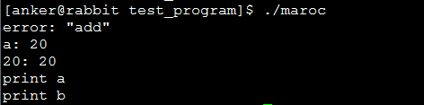

<h1 align="center">C语言：宏</h1>

[toc]

## 宏

**宏** 定义是C语言提供的三种预处理功能的其中一种，这三种预处理包括：**宏定义、文件包含、条件编译**。

宏定义和操作符的区别是：宏定义是替换，不做计算，也不做表达式求解。

“宏定义”也称“宏替换”，“宏”

```c
define PI 3.14159261
```

这就是一个简单的宏，在程序的预处理阶段宏名会被替换为后面的字符串

### 传入参数的宏

1. **#：字符串化操作**，即将宏定义中的传入参数名转换成用一对双引号括起来参数名字符串，使用时置于宏定义体中的参数名前，如：

```c
#define func(para)  #para
...
char str[] = func(hello); //被展开为：char str[] = "hello"
```

​	**说明：如果传入的参数之前有空格则忽略之，如果参数之间有多个空格则在连成字符串时只算一个**

2. **#@：字符化操作**，即将宏定义传入的参数名转换为用一对单引号扩起来的参数名字符串，使用时置于参数名前，如：

```c
#define fun(pa) #@pa
char a = fun(a); //被展开为char a='a';
```

3. **##：参数连接操作**，即将宏定义的多个形参连接成一个实际参数，如：

```c
#define COMMAND(a,b) a##b
...
COMMAND(1,2); //相当于12
CMOOAND(ac,b); //相当于acb
```

​	假定 class_name 是 CMyClass，那么 #class_name = “CMyClass”, **#** 就是将参数变成字符串。

​	而 **##** 则是连接作用，是省略：ms_Info##class_name = ms_infoCMyClass

​	Stackoverflow上的例子：

```c
#include <stdio.h>
#define f(a,b) a##b
#define g(a)  #a
#define h(a) g(a)

int main()
{
  printf("%s\n",h(f(1,2)));
  printf("%s\n",g(f(1,2)));
  return 0;
}
```

运行结果：

```
12
f(1,2)
// 过程
h(f(1, 2)) -> h(12) -> g(12) -> "12"
g(f(1, 2)) -> "f(1, 2)"
```

在 function-like 宏里出现的参数, 除非它是 # 或 ## 的操作数, 在替换之前先进行扩展， 然后重新扫描整个表达式进行下一步扩展。 因为 g 的参数 是 # 的操作数, 参数不扩展而是立即字符串化 ("f(1,2)"). 因为 h 的参数既不是 # 也不是 ## 的操作数， the 参数首先扩展为(12), 然后进行替换 (g(12)), 然后重新扫描得到表达式 ("12").

4. \：当前行继续操作，实际上是对换行符转义，如：

```c
#define LOOP(FROM, TO, CONTENT)\
for(int i=FROM; i<TO; i++){\
	CONTENT\
}
```

5. _VA_ARGS_：变长参数操作，即可以接受不定个数的参数，如：

```c
#define eprintf(...) fprintf (stderr, __VA_ARGS__)
eprintf ("%s:%d: ", input_file, lineno)
//==>  fprintf (stderr, "%s:%d: ", input_file, lineno)
```

6. **宏定义中do{ }while(0)**

   第一眼看到这样的宏时，觉得非常奇怪，为什么要用do……while(0)把宏定义的多条语句括起来？非常想知道这样定义宏的好处是什么，于是google、百度一下了。

   采用这种方式是为了防范在使用宏过程中出现错误，主要有如下几点：

   **（1）空的宏定义避免warning:**

   ```c
   #define foo() do{}while(0)
   ```

   **（2）存在一个独立的block，可以用来进行变量定义，进行比较复杂的实现。**
   **（3）如果出现在判断语句过后的宏，这样可以保证作为一个整体来是实现：**

   ```c
   #define foo(x) \
   　　　　action1(); \
   　　　　action2();
   ```

   　　　　在以下情况下：

   ```c
   if(NULL == pPointer)
    　foo();
   ```

   　　　就会出现action1和action2不会同时被执行的情况，而这显然不是程序设计的目的。
   **（4）以上的第3种情况用单独的{}也可以实现，但是为什么一定要一个do{}while(0)呢，看以下代码：**

   ```c
   #define switch(x,y) {
   	int tmp; 
   	tmp="x";
   	x=y;
   	y=tmp;
   }
   if(x>y)
   　　switch(x,y);
   else    //error, parse error before else
   　　otheraction();
   ```

   **在把宏引入代码中，会多出一个分号，从而会报错。这对这一点，可以将if和else语句用{}括起来，可以避免分号错误。**
   使用do{….}while(0) 把它包裹起来，成为一个独立的语法单元，从而不会与上下文发生混淆。同时因为绝大多数的编译器都能够识别do{…}while(0)这种无用的循环并进行优化，所以使用这种方法也不会导致程序的性能降低

7. **测试程序**

   简单写个测试程序，加强练习，熟悉一下宏的高级用法。

   ```c
   #include <stdio.h>
   
   #define PRINT1(a,b)        \
       {                  \
         printf("print a\n"); \
         printf("print b\n"); \
       }
   
   #define PRINT2(a, b)      \
     	do{               \
         printf("print a\n"); \
         printf("print b\n"); \
     	}while(0)
   
   #define PRINT(a) \
       do{\
       	printf("%s: %d\n",#a,a);\
       	printf("%d: %d\n",a,a);\
       }while(0)
   
   #define TYPE1(type,name)   type name_##type##_type
   #define TYPE2(type,name)   type name##_##type##_type
   
   #define ERROR_LOG(module)   fprintf(stderr,"error: "#module"\n")
   
    main()
   {
       int a = 20;
       int b = 19;
       TYPE1(int, c);
       ERROR_LOG("add");
       name_int_type = a;
       TYPE2(int, d);
       d_int_type = a;
   
       PRINT(a);
       if (a > b)
       {
       	PRINT1(a, b);
       }
       else
       {
       	PRINT2(a, b);
       }
       return 0;
   }
   ```

   测试结果如下：

   

### 为什么要使用宏定义

简而言之，使用宏定义可以提高代码的可读性
具体的说，可以减少magic number的使用，并且可以做一些方便的替换，如下面的代码：

```c
#define MALLOC(n, type) (type*)malloc((n)*sizeof(type))1
```

使用时，`int \*p = MALLOC(10, int);` 即可

**宏的规范写法**

1. 宏名大写
2. 宏定义语句末尾不加分号
3. 宏函数的形式参数不加类型

**另外宏定义需要注意的**

1. 宏定义可以嵌套
2. 宏定义不能出现在字符串的“”中
3. 宏定义不分配内存，变量定义才分配内存
4. 宏定义只是简单的替换，而且是直接对源码的字符串替换，如下面的宏定义就不能很好的表达求平方函数：

```c
#define sqrt(x) x*x
...
int y=sqrt(1+2); //y = 1+2*1+2 = 5 ≠9123
```

这时候加上括号就好了：

```c
#define sqrt(x) (x)*(x)
...
int y=sqrt(1+2); //y = (1+2)*(1+2) = 9123
```

5. 宏函数和自定义函数相比，效率更高但是安全性低且会使编译生成的目标文件变大；宏函数没有分配和释放栈帧、传参、传返回值等一系列工作，适合那些简短并且频繁调用的函数，但是对于递归则不推荐使用宏

## 宏定义

写好C语言，漂亮的宏定义很重要，使用宏定义可以防止出错，提高可移植性，可读性，方便性等等。

**下面列举一些成熟软件中常用的宏定义：**

### **1、**防止一个头文件被重复包含

```c
#ifndef COMDEF_H
#define COMDEF_H
//头文件内容
#endif
```

**#ifndef** 是 **if not defined **的缩写

```c
#define x //定义一个宏
...
#endif
//C语言在对程序进行编译时，会先根据预处理命令进行“预处理”。C语言编译系统包括预处理，编译和链接等部分。
#ifndef x //先测试x是否被宏定义过
#define x
程序段1 //如果x没有被宏定义过，定义x，并编译程序段 1
#else
程序段2 //如果x已经定义过了则编译程序段2的语句，“忽视”程序段 1
#endif//终止if
```


### **2、**重新定义一些类型，防止由于各种平台和编译器的不同，而产生的类型字节数差异，方便移植。

```c
typedef unsigned char boolean; /* Boolean value type. */
typedef unsigned long int uint32; /* Unsigned 32 bit value */
typedef unsigned short uint16; /* Unsigned 16 bit value */
typedef unsigned char uint8; /* Unsigned 8 bit value */
typedef signed long int int32; /* Signed 32 bit value */
typedef signed short int16; /* Signed 16 bit value */
typedef signed char int8; /* Signed 8 bit value */
```

**下面的不建议使用：**

```c
typedef unsigned char byte; /* Unsigned 8 bit value type. */
typedef unsigned short word; /* Unsinged 16 bit value type. */
typedef unsigned long dword; /* Unsigned 32 bit value type. */
typedef unsigned char uint1; /* Unsigned 8 bit value type. */
typedef unsigned short uint2; /* Unsigned 16 bit value type. */
typedef unsigned long uint4; /* Unsigned 32 bit value type. */
typedef signed char int1; /* Signed 8 bit value type. */
typedef signed short int2; /* Signed 16 bit value type. */
typedef long int int4; /* Signed 32 bit value type. */
typedef signed long sint31; /* Signed 32 bit value */
typedef signed short sint15; /* Signed 16 bit value */
typedef signed char sint7; /* Signed 8 bit value */
```

### **3、**得到指定地址上的一个字节或字

```c
#define MEM_B( x ) ( *( (byte *) (x) ) )
#define MEM_W( x ) ( *( (word *) (x) ) )
```

### **4、**求最大值和最小值

```c
#define MAX( x, y ) ( ((x) > (y)) ? (x) : (y) )
#define MIN( x, y ) ( ((x) < (y)) ? (x) : (y) )
```

### **5、**得到一个field在结构体(struct)中的偏移量

```c
#define FPOS( type, field )
/*lint -e545 */ ( (dword) &(( type *) 0)-> field ) /*lint +e545 */
```

### **6、**得到一个结构体中field所占用的字节数

```c
#define FSIZ( type, field ) sizeof( ((type *) 0)->field )
```

### **7、**按照LSB格式把两个字节转化为一个Word

```c
#define FLIPW( ray ) ( (((word) (ray)[0]) * 256) + (ray)[1] )
```

### **8、**按照LSB格式把一个Word转化为两个字节

```c
#define FLOPW( ray, val )
(ray)[0] = ((val) / 256);
(ray)[1] = ((val) & 0xFF)
```

### **9、**得到一个变量的地址(word宽度)

```c
#define B_PTR( var ) ( (byte *) (void *) &(var) )
#define W_PTR( var ) ( (word *) (void *) &(var) )
```

### **10、**得到一个字的高位和低位字节

```c
#define WORD_LO(xxx) ((byte) ((word)(xxx) & 255))
#define WORD_HI(xxx) ((byte) ((word)(xxx) >> 8))
```

### **11、**返回一个比X大的最接近的8的倍数

```c
#define RND8( x ) ((((x) + 7) / 8 ) * 8 )
```

### **12、**将一个字母转换为大写

```c
#define UPCASE( c ) ( ((c) >= 'a' && (c) <= 'z') ? ((c) - 0x20) : (c) )
```

### **13、**判断字符是不是10进制的数字

```c
#define DECCHK( c ) ((c) >= '0' && (c) <= '9')
```

### **14、**判断字符是不是16进制的数字

```c
#define HEXCHK( c ) ( ((c) >= '0' && (c) <= '9') ||
((c) >= 'A' && (c) <= 'F') ||
((c) >= 'a' && (c) <= 'f') )
```

### **15、**防止溢出的一个方法

```c
#define INC_SAT( val ) (val = ((val)+1 > (val)) ? (val)+1 : (val))
```

### **16、**返回数组元素的个数

```c
#define ARR_SIZE( a ) ( sizeof( (a) ) / sizeof( (a[0]) ) )
```

### **17、**返回一个无符号数n尾的值MOD_BY_POWER_OF_TWO(X,n)=X%(2^n)

```c
#define MOD_BY_POWER_OF_TWO( val, mod_by )
( (dword)(val) & (dword)((mod_by)-1) )
```

### **18、**对于IO空间映射在存储空间的结构，输入输出处理

```c
#define inp(port) (*((volatile byte *) (port)))
#define inpw(port) (*((volatile word *) (port)))
#define inpdw(port) (*((volatile dword *)(port)))
#define outp(port, val) (*((volatile byte *) (port)) = ((byte) (val)))
#define outpw(port, val) (*((volatile word *) (port)) = ((word) (val)))
#define outpdw(port, val) (*((volatile dword *) (port)) = ((dword) (val)))
```

### **19、**使用一些宏跟踪调试

**A N S I标准说明了五个预定义的宏名**。它们是：

_ L I N E _

_ F I L E _

_ D A T E _

_ T I M E _

_ S T D C _

如果编译不是标准的，则可能仅支持以上宏名中的几个，或根本不支持。记住编译程序也许还提供其它预定义的宏名。

_ L I N E _ 及 _ F I L E _ 宏指令在有关# l i n e的部分中已讨论，这里讨论其余的宏名。

_ D AT E _ 宏指令含有形式为月/日/年的串，表示源文件被翻译到代码时的日期。

源代码翻译到目标代码的时间作为串包含在_ T I M E _中。串形式为时：分：秒。

如果实现是标准的，则宏_ S T D C _含有十进制常量1。如果它含有任何其它数，则实现是非标准的。

可以定义宏，**例如: 当定义了_DEBUG，输出数据信息和所在文件所在行：**

```c
#ifdef _DEBUG
#define DEBUGMSG(msg,date) printf(msg);printf(“%d%d%d”,date,_LINE_,_FILE_)
#else
#define DEBUGMSG(msg,date)
#endif
```

### **20、**宏定义防止使用时错误用小括号包含。

**例如：**

```c
#define ADD(a,b) (a+b)
```

用do{}while(0)语句包含多语句防止错误

**例如：**

```c
#difne DO(a,b) a+b;
a++;
```

**应用时：**

if(….)

DO(a,b); //产生错误

else

**解决方法：**

```c
#difne DO(a,b) do{a+b;
a++;}while(0)
```


## #define宏的高级用法

### 一 、宏的定义与撤销

```cpp
#普通宏定义
#define PI 3.14    //编译阶段替换掉宏
#define T1 3+4     //容易产生歧义
#define T2 (3+4)   //添加括号后，语义清楚

float r = 1.0;
float area = PI * r * r;    
int a = 2* T1    #宏替换后变成   int a = 2*3+4     不符合本意    
ing a = 2* T2    #红替换后变成   int a = 2*(3+4)   符合本意   
#undef PI

float area = PI * r * r;     #error: ‘PI’ was not declared in this scope
//引号中的宏定义不会被替换

printf("%s:%f\n", "PI", PI);    //输出 PI：3.14
//宏定义的名字必须是合法标识符

#define 0x abcd    //error 不能以数字开始

//宏定义中双引号和单引号必须成对出现
#define TEST11 "Z    //error
#define TEST2 'Z     //error
```

### 二、带有参数的宏定义

```cpp
//max和min的宏定义带参数
#define MAX(a,b) (a>b ? a:b)
#define MIN(a,b) (a<b ? a:b)
//使用带参数的宏定义
int sum= MAX(1,2) + MIN(1,2);    //替换后语句为：int sum = (1>2 ? 1:2) + (1<2 ? 1:2)

//参数个数必须宏定义时形参的个数相同
MAX(1,2,3);    //会报错
#undef MAX    //撤销MAX的宏定义
MAX(1,2);    //error: ‘MAX’ was not declared in this scope
```

### 三、跨行的宏定义 使用反引号\连接

```c
// 定义一个交换数值的多行宏，使用反斜杠连接不同行
#define SWAP(a,b) do { \
    int t = 0;\
    t = a; \
    a = b; \
    b = t; \
} while(0)
```

四、三个特殊符号：#，##，#@

```cpp
#define CONNECT(a,b) a##b
#define TOCHAR(a) #@a
#define TOSTRING(a) #a
//a##b表示连接
int n = CONNECT(123, 456);                //结果  n = 123456
char *str = CONNECT("abcd", "efg");       //结果  str = "abcdefg"
//@#a 表示用单引号包括参数a，返回的是一个字符
char * ch1 = TOCHAR(1);        //结果  ch = '1'
char * ch2 = TOCHAR(123);      //报错，单引号只用在单个字符里
//#a 表示用双引号包括参数a，返回一个字符串
char * str1 = TOSTRING(123);    // str = "123"
```

### 五、常见的宏定义

- 防止头文件被重复包含

```cpp
#ifndef BODYDEF_H 
#define BODYDEF_H 
//头文件内容 
#endif
```

- 得到指定地址上的一个字节值或字值

```cpp
#include "stdio.h"
//B表示字节byte
#define MEM_B( x )  ( *( (byte *) (x) ) )
//B表示字word，可以理解为int
#define MEM_W( x )  ( *( (word *) (x) ) )
int main()
{
    int bTest = 0x123456;
    byte m = MEM_B((&bTest));    /*m=0x56*/
    int n = MEM_W((&bTest));     /*n=0x3456*/
    return 0;
}
```

- 得到一个field在结构体(struct)中的偏移量

```cpp
#define OFFSETOF( type, field ) ( (size_t) &(( type *) 0)-> field )
```

- 得到一个结构体中field所占用的字节数 

```cpp
#define FSIZ( type, field ) sizeof( ((type *) 0)->field )
```

- 得到一个变量的地址（word宽度） 

```cpp
#define B_PTR( var ) ( (byte *) (void *) &(var) ) 
#define W_PTR( var ) ( (word *) (void *) &(var) )
```

- 将一个字母转换为大写

```cpp
#define UPCASE( c ) ( ((c) >= 'a' && (c) <= 'z') ? ((c) - 0x20) : (c) )
```

-  判断字符是不是10进值的数字

```cpp
#define DECCHK( c ) ((c) >= '0' && (c) <= '9')
```

- 判断字符是不是16进值的数字 

```cpp
#define HEXCHK( c ) ( ((c) >= '0' && (c) <= '9') ||((c) >= 'A' && (c) <= 'F') ||((c) >= 'a' && (c) <= 'f') )
```

- 防止溢出的一个方法

```cpp
#define INC_SAT( val ) (val = ((val)+1 > (val)) ? (val)+1 : (val))
```

- 返回数组元素的个数 

```c
#define ARR_SIZE( a ) ( sizeof( (a) ) / sizeof( (a[0]) ) )
```


 

## 参考

* [【C语言宏定义】来，看看这20个常用的宏定义！ - 知乎 (zhihu.com)](https://zhuanlan.zhihu.com/p/386794142)
* [#define宏的高级用法_杨树的博客-CSDN博客](https://blog.csdn.net/xiaoxu2050/article/details/82893476)
* [C语言宏定义详解](https://blog.csdn.net/abc_12366/article/details/79155540?utm_medium=distribute.pc_relevant_t0.none-task-blog-BlogCommendFromMachineLearnPai2-1.baidujs&dist_request_id=4529df1b-70d6-4ed4-98a0-98fa2e284b34&depth_1-utm_source=distribute.pc_relevant_t0.none-task-blog-BlogCommendFromMachineLearnPai2-1.baidujs)
* [C语言宏的定义和宏的使用方法（#define）](http://c.biancheng.net/view/446.html)
* [C语言宏高级用法](https://www.cnblogs.com/Anker/p/3418792.html)

