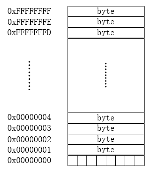
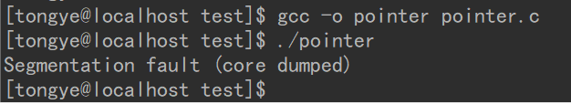
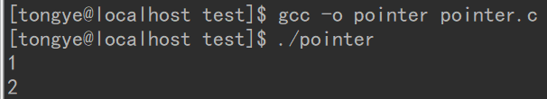
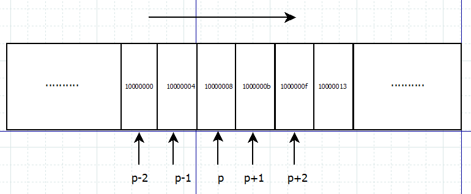
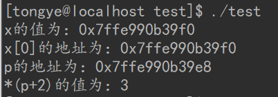

<h1 align="center">**C语言--指针详解**</h1>

[toc]

## 一、什么是指针

C语言里，变量存放在内存中，而内存其实就是一组有序字节组成的数组，每个字节有唯一的内存地址。CPU 通过内存寻址对存储在内存中的某个指定数据对象的地址进行定位。这里，数据对象是指存储在内存中的一个指定数据类型的数值或字符串，它们都有一个自己的地址，而指针便是保存这个地址的变量。也就是说：指针是一种保存变量地址的变量。

前面已经提到内存其实就是一组有序字节组成的数组，数组中，每个字节大大小固定，都是 8bit。对这些连续的字节从 0 开始进行编号，每个字节都有唯一的一个编号，这个编号就是内存地址。示意如下图：



这是一个 4GB 的内存，可以存放 2^32 个字节的数据。左侧的连续的十六进制编号就是内存地址，每个内存地址对应一个字节的内存空间。而指针变量保存的就是这个编号，也即内存地址。

## 二、为什么要使用指针

在C语言中，指针的使用非常广泛，因为使用指针往往可以生成更高效、更紧凑的代码。总的来说，使用指针有如下好处：

1）指针的使用使得不同区域的代码可以轻易的共享内存数据，这样可以使程序更为快速高效；

2）C语言中一些复杂的数据结构往往需要使用指针来构建，如链表、二叉树等；

3）C语言是传值调用，而有些操作传值调用是无法完成的，如通过被调函数修改调用函数的对象，但是这种操作可以由指针来完成，而且并不违背传值调用。


## 三、如何声明一个指针

### 3.1 声明并初始化一个指针

指针其实就是一个变量，指针的声明方式与一般的变量声明方式没太大区别：

```c
int *p; // 声明一个 int 类型的指针 p
char *p // 声明一个 char 类型的指针 p
int *arr[10] // 声明一个指针数组，该数组有10个元素，其中每个元素都是一个指向 int 类型对象的指针
int (*arr)[10] // 声明一个数组指针，该指针指向一个 int 类型的一维数组
int **p; // 声明一个指针 p ，该指针指向一个 int 类型的指针
```

指针的声明比普通变量的声明多了一个一元运算符 “*”。运算符 “*” 是间接寻址或者间接引用运算符。当它作用于指针时，将访问指针所指向的对象。在上述的声明中： p 是一个指针，保存着一个地址，该地址指向内存中的一个变量； *p 则会访问这个地址所指向的变量。

声明一个指针变量并不会自动分配任何内存。在对指针进行间接访问之前，指针必须进行初始化：或是使他指向现有的内存，或者给他动态分配内存，否则我们并不知道指针指向哪儿，这将是一个很严重的问题，稍后会讨论这个问题。初始化操作如下：

```c
/* 方法1：使指针指向现有的内存 */
int x = 1;
int *p = &x;　　// 指针 p 被初始化，指向变量 x ，其中取地址符 & 用于产生操作数内存地址
/* 方法2：动态分配内存给指针 */
int *p;
p = (int *)malloc(sizeof(int) * 10);　　　　// malloc 函数用于动态分配内存
free(p);　　　　// free 函数用于释放一块已经分配的内存，常与 malloc 函数一起使用，要使用这两个函数需要头文件 stdlib.h
```

指针的初始化实际上就是给指针一个合法的地址，让程序能够清楚地知道指针指向哪儿。

### 3.2 未初始化和非法的指针

如果一个指针没有被初始化，那么程序就不知道它指向哪里。它可能指向一个非法地址，这时，程序会报错，在 Linux 上，错误类型是 Segmentation fault（core dumped），提醒我们段违例或内存错误。它也可能指向一个合法地址，实际上，这种情况更严重，你的程序或许能正常运行，但是这个没有被初始化的指针所指向的那个位置的值将会被修改，而你并无意去修改它。用一个例子简单的演示一下：

```c
#include "stdio.h"
int main(){
	int *p;
	*p = 1;
	printf("%d\n",*p);
	return 0;
}
```


这个程序可以编译通过，但是运行的话会报错，报错信息如下：




要想使这个程序运行起来，需要先对指针 p 进行初始化：

```c
#include "stdio.h"
int main(){
  int x = 1;
  int *p = &x;
  printf("%d\n",*p);
  *p = 2;
  printf("%d\n",*p);
  return 0;
}
```

这段代码的输出结果如下：




可以看到，对指针进行初始化后，便可以正常对指针进行赋值了。

### 3.3 NULL指针

NULL 指针是一个特殊的指针变量，表示不指向任何东西。可以通过给一个指针赋一个零值来生成一个 NULL 指针。

```c
#include "stdio.h"
int main(){
  int *p = NULL;
  printf("p的地址为%d\n",p);
  return 0;
}
/***************
* 程序输出：
* p的地址为0
***************/
```

可以看到指针指向内存地址0。在大多数的操作系统上，程序不允许访问地址为 0 的内存，因为该内存是为操作系统保留的。但是，内存地址 0 有一个特别重要的意义，它表明改指针不指向一个可访问的内存位置。

## 四、指针的运算

C 指针的算术运算只限于两种形式：

**1） 指针 +/- 整数 ：**

可以对指针变量 p 进行 p++、p--、p + i 等操作，所得结果也是一个指针，只是指针所指向的内存地址相比于 p 所指的内存地址前进或者后退了 i 个操作数。用一张图来说明一下：



在上图中，10000000等是内存地址的十六进制表示（数值是假定的），p 是一个 int 类型的指针，指向内存地址 0x10000008 处。则 p++ 将指向与 p 相邻的下一个内存地址，由于 int 型数据占 4 个字节，因此 p++ 所指的内存地址为 1000000b。其余类推。不过要注意的是，这种运算并不会改变指针变量 p 自身的地址，只是改变了它所指向的地址。举个例子：

**2）指针 - 指针**

只有当两个指针都指向同一个数组中的元素时，才允许从一个指针减去另一个指针。两个指针相减的结果的类型是 ptrdiff_t，它是一种有符号整数类型。减法运算的值是两个指针在内存中的距离（以数组元素的长度为单位，而不是以字节为单位），因为减法运算的结果将除以数组元素类型的长度。举个例子：

```c
#include "stdio.h"
int main(){
  int a[10] = {1,2,3,4,5,6,7,8,9,0};
  int sub;
  int *p1 = &a[2];
  int *p2 = &a[8];
  sub = p2-p1;
  printf("%d\n",sub);　　　　// 输出结果为 6
  return 0;
}
```

## 五、指针与数组

在C语言中，指针与数组之间的关系十分密切。实际上，许多可以用数组完成的工作都可以使用指针来完成。一般来说，用指针编写的程序比用数组编写的程序执行速度快，但另一方面，用指针实现的程序理解起来稍微困难一些。

### 5.1 指针与数组的关系

我们先声明一个数组：

```c
int a[10]; // 声明一个int类型的数组，这个数组有10个元素
```

我们可以用 a[0]、a[1]、...、a[9] 来表示这个数组中的10个元素，这10个元素是存储在一段连续相邻的内存区域中的。

接下来，我们再声明一个指针：

```c
int *p; // 声明一个int类型的指针变量
```

p 是一个指针变量，指向内存中的一个区域。如果我们对指针 p 做如下的初始化：

```c
p = &a[0]; // 对指针进行初始化，p将指向数组 a 的第 1 个元素 a[0]
```

我们知道，对指针进行自增操作会让指针指向与当前元素相邻的下一个元素，即 *(p + 1) 将指向 a[1] ；同样的， *(p + i) 将指向 a[i] 。因此，我们可以使用该指针来遍历数组 a[10] 的所有元素。可以看到，数组下标与指针运算之间的关系是一一对应的。而根据定义，数组类型的变量或表达式的值是该数组第 1 个元素的地址，且数组名所代表的的就是该数组第 1 个元素的地址，故，上述赋值语句可以直接写成：

```c
p = a; // a 为数组名，代表该数组最开始的一个元素的地址
```

很显然，一个通过数组和下标实现的表达式可以等价地通过指针及其偏移量来实现，这就是数组和指针的互通之处。但有一点要明确的是，数组和指针并不是完全等价，指针是一个变量，而数组名不是变量，它数组中第 1 个元素的地址，数组可以看做是一个用于保存变量的容器。更直接的方法，我们可以直接看二者的地址，并不一样：

```c
#include "stdio.h"
int main(){
  int x[10] = {1,2,3,4,5,6,7,8,9,0};
  int *p = x;
  printf("x的地址为：%p\n",x);
  printf("x[0]的地址为：%p\n",&x[0]);
  printf("p的地址为：%p\n",&p);　　　　　　// 打印指针 p 的地址，并不是指针所指向的地方的地址
  p += 2;
  printf("*(p+2)的值为：%d\n",*p);　　　　// 输出结果为 3，*(p+2)指向了 x[2]
  return 0;
}
```

结果如下：




可以看到， x 的值与 x[0] 的地址是一样的，也就是说数组名即为数组中第 1 个元素的地址。实际上，打印 &x 后发现，x 的地址也是这个值。而 x 的地址与指针变量 p 的地址是不一样的。故而数组和指针并不能完全等价。

（笔者注：上述输出结果是在 centos7 64bit 的环境下使用 gcc 编译器得到的，可以看到地址是一个12位的十六进制数，转换成二进制是48位，也就是说寻址空间有 256TB，但是笔者的电脑只有 8GB 内存，猜测是不是由于 linux 系统开启了内存分页机制，这里寻址的是虚拟地址？另外，在Windows下使用 vs2015 编译运行的话，则输出结果是一个 8位的十六进制数，也就是32位二进制，寻址空间为 4GB）

### 5.2 指针数组

指针是一个变量，而数组是用于存储变量的容器，因此，指针也可以像其他变量一样存储在数组中，也就是指针数组。 指针数组是一个数组，数组中的每一个元素都是指针。声明一个指针数组的方法如下：

```c
int *p[10]; // 声明一个指针数组，该数组有10个元素，其中每个元素都是一个指向int类型的指针
```

在上述声明中，由于 [] 的优先级比 * 高，故 p 先与 [] 结合，成为一个数组 p[]；再由 int * 指明这是一个 int 类型的指针数组，数组中的元素都是 int 类型的指针。数组的第 i 个元素是 *p[i]，而 p[i] 是一个指针。由于指针数组中存放着多个指针，操作灵活，在一些需要操作大量数据的程序中使用，可以使程序更灵活快速。

### 5.3 数组指针

数组指针是一个指针，它指向一个数组。声明一个数组指针的方法如下：

```c
int (*p)[10]; // 声明一个数组指针 p ，该指针指向一个数组
```

由于 () 的优先级最高，所以 p 是一个指针，指向一个 int 类型的一维数组，这个一维数组的长度是 10，这也是指针 p 的步长。也就是说，执行 p+1 时，p 要跨过 n 个 int 型数据的长度。数组指针与二维数组联系密切，可以用数组指针来指向一个二维数组，如下：

```c
#include "stdio.h"

int main(){
  int arr[2][3] = {1,2,3,4,5,6}; // 定义一个二维数组并初始化
  int (*p)[3]; // 定义一个数组指针，指针指向一个含有3个元素的一维数组

  p = arr; // 将二维数组的首地址赋给 p，此时 p 指向 arr[0] 或 &arr[0][0]
  printf("%d\n",(*p)[0]);　　　　　　　　　　　　 // 输出结果为 1
  p++;　　　　　　　　　　　　　　　　　　　　　　　　 // 对 p 进行算术运算，此时 p 将指向二维数组的下一行的首地址，即 &arr[1][0]
  printf("%d\n",(*p)[1]); // 输出结果为5

  return 0;
}
```

 

## 六、指针与结构

### 6.1 简单介绍一下结构

结构是一个或多个变量的集合，这些变量可能为不同的类型，为了处理的方便而将这些变量组织在一个名字之下。由于结构将一组相关的变量看做一个单元而不是各自独立的实体，因此结构有助于组织复杂的数据，特别是在大型的程序中。声明一个结构的方式如下：

```c

struct message{　　　　　　 // 声明一个结构 message
char name[10]; // 成员
int age;
int score;
};
typedef struct message s_message;　　　　 // 类型定义符 typedef
s_message mess = {"tongye",23,83};　　　　// 声明一个 struct message 类型的变量 mess,并对其进行初始化　
-------------------------------
/* 另一种更简便的声明方法 */
typedef struct{
　　char name[10];
　　int age;
　　int score;
}message;
```

可以使用 结构名.成员 的方式来访问结构中的成员，如下：

```c
#include "stdio.h"
int main(){
　　printf("%s\n",mess.name);　　　　// 输出结果：tongye
　　printf("%d\n",mess.age);　　　　 // 输出结果：23
　return 0;
}
```


### 6.2 结构指针　

结构指针是指向结构的指针，以上面的结构为例，可以这样定义一个结构指针：

```c
s_message *p; // 声明一个结构指针 p ，该指针指向一个 s_message 类型的结构
*p = &mess;　　　　　　// 对结构指针的初始化与普通指针一样，也是使用取地址符 &
```

C语言中使用 -> 操作符来访问结构指针的成员，举个例子：

```c
#include "stdio.h"
typedef struct{
  char name[10];
  int age;
  int score;
}message;
int main(){
  message mess = {"tongye",23,83};
  message *p = &mess;
  printf("%s\n",p->mess);　　　　　　// 输出结果为：tongye
  printf("%d\n",p->score); // 输出结果为：83
  return 0;
}
```


## 七、指针与函数

C语言的所有参数均是以“传值调用”的方式进行传递的，这意味着函数将获得参数值的一份拷贝。这样，函数可以放心修改这个拷贝值，而不必担心会修改调用程序实际传递给它的参数。

### 7.1 指针作为函数的参数

传值调用的好处是是被调函数不会改变调用函数传过来的值，可以放心修改。但是有时候需要被调函数回传一个值给调用函数，这样的话，传值调用就无法做到。为了解决这个问题，可以使用传指针调用。指针参数使得被调函数能够访问和修改主调函数中对象的值。用一个例子来说明：

```c
#include "stdio.h"
void swap1(int a,int b)　　　　　　 // 参数为普通的 int 变量
{
　　int temp;
　　temp = a;
　　a = b;
　　b = temp;
}
void swap2(int *a,int *b)　　　　　　// 参数为指针，接受调用函数传递过来的变量地址作为参数，对所指地址处的内容进行操作
{
　　int temp;　　　　 // 最终结果是，地址本身并没有改变，但是这一地址所对应的内存段中的内容发生了变化，即x,y的值发生了变化
　　temp = *a;
　　*a = *b;
　　*b = temp;
}
int main()
{
　　int x = 1,y = 2;
　　swap1(x,y); // 将 x,y 的值本身作为参数传递给了被调函数
　　printf("%d %5d\n",x,y); // 输出结果为：1 2
　　swap(&x,&y); // 将 x,y 的地址作为参数传递给了被调函数，传递过去的也是一个值，与传值调用不冲突
　　printf("%d %5d\n",x,y); // 输出结果为：2 1
　　return 0;
}
```

### 7.2 指向函数的指针

在C语言中，函数本身不是变量，但是可以定义指向函数的指针，也称作函数指针，函数指针指向函数的入口地址。这种类型的指针可以被赋值、存放在数组中、传递给函数以及作为函数的返回值等等。 声明一个函数指针的方法如下：

```c
返回值类型 （* 指针变量名）（[形参列表]）;
int (*pointer)(int *,int *); // 声明一个函数指针
```

上述代码声明了一个函数指针 pointer ，该指针指向一个函数，函数具有两个 int * 类型的参数，且返回值类型为 int。下面的代码演示了函数指针的用法：

```c
#include "stdio.h"
#include "string.h"
int str_comp(const char *m,const char *n); // 声明一个函数 str_comp，该函数有两个 const char 类型的指针，函数的返回值为 int 类型
void comp(char *a,char *b,int (*prr)(const char *,const char*)); // 声明一个函数 comp ,注意该函数的第三个参数，是一个函数指针
int main()
{
  char str1[20]; // 声明一个字符数组
  char str2[20];
  int (*p)(const char *,const char *) = str_comp;　// 声明并初始化一个函数指针，该指针所指向的函数有两个 const char 类型的指针，且返回值为 int 类型
  gets(str1); // 使用 gets() 函数从 I/O 读取一行字符串
  gets(str2);
  comp(str1,str2,p); // 函数指针 p 作为参数传给 comp 函数
  return 0;
}
int str_comp(const char *m,const char *n)
{
　　 // 库函数 strcmp 用于比较两个字符串，其原型是： int strcmp(const char *s1,const char *s2);
  if(strcmp(m,n) == 0)
  	return 0;
  else
  	return 1;
}
/* 函数 comp 接受一个函数指针作为它的第三个参数 */
void comp(char *a,char *b,int (*prr)(const char *,const char*))
{
  if((*prr)(a,b) == 0)
  	printf("str1 = str2\n");
  else
  	printf("str1 != str2\n");
}
```

这段代码的功能是从键盘读取两行字符串（长度不超过20），判断二者是否相等。

注意，声明一个函数指针时，() 不能漏掉，否则：

```c
int *p(void *,void*);
```

这表明 p 是一个函数，该函数返回一个指向 int 类型的指针。

## 来源

[C语言--指针详解-c/c++ (uml.org.cn)](http://www.uml.org.cn/c++/201910232.asp)

