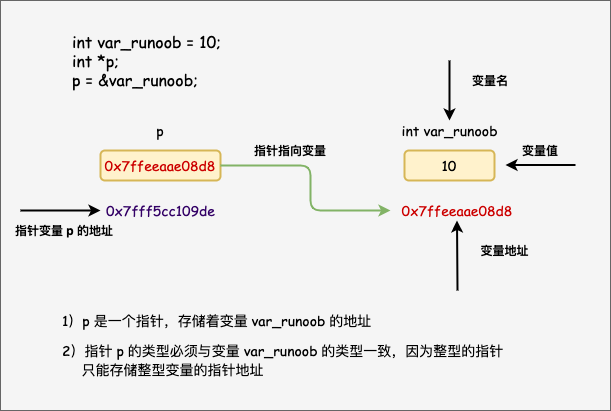

<h1 align="center">[C语言必知必会] 指针</h1>

[toc]

## 一：指针变量的声明



我们知道指针变量是这样声明的：

```c
int* p
int* p = &p
```

思考：*挨着变量类型int 与 *挨着变量p有区别吗？

```c
int* p, q
int *p, q
```

是否第一种写法是 p， q都是指针变量 而 第二种只有 p是指针变量？

这样想是错误的，两种声明方式都是只声明 p 为指针表变量，**与\*的位置无关**


## 二：` * `与` & `：相反的作用

> `*` 解引用操作符，拿到一个指针所指地址的内容
>
> `&` 取地址操作符，获取变量的内存地址

例如：

`int *p`-->`*p`指向变量-->`p`指向地址

`*&var`-->`*(&var)`-->`var`(变量)
`&*var`-->`&(*var)`-->`var`(地址)


## 三：int var；scanf("%d", var)为何不报错？

在32位编译器下，指针的大小是 4 个字节，而 int 类型的大小也是 4 个字节

地址是用 16进制 存储的，因为它俩大小相同，表示为 16进制数 时十分相似，所以编译器可能会认为你给我的var变量就是我要的地址，因此不会报错。


## 四：指针与数组

### 1.数组参数

以下四种函数原型是等价的：

```c
int sum(int* arr, int n)
int sum(int arr[], int n)
int sum(int*, int)
int sum(int [], int)
```


### 2.数组名 与 数组单元

> 数组变量本身表达地址， 所以：
>
> int a[10];
>
> `int *p = a;` //无需用取地址操作符&
>
> 数组单元表示变量
>
> `int *_p = &a[1];` //需要用 & 取地址

### 3.[ ] 操作符可以对 数组 使用，也可以对 指针 使用

```c
int arr[10];
int* p = &arr[9];
arr[9] = 10;
p[0] = 10; // p[0] 等同于 *p
```

### 4. * 操作符可以对 `指针` 使用， 也可以对 `数组` 使用

```c
int arr[10];
*(arr + 1) = 10; // 等同于 arr[1]
```

### 5.数组变量 是const的指针， 所以不能被赋值

```c
int a[] --> int* const a
```


## 五：指针 与 const

### 1.const的位置

下面的 const 有什么作用？

```c
int i;
const int* p1 = &i;
int const* p2 = &i;
int *const p3 = &i;
```

> 判断 const 的作用对象：只需要看 const 在 * 的前面还是后面:
>
> `const *`：（上例1， 2。） 修饰 `*p` `*p`不能被更改
>
> p++ // OK
>
> i++ // OK
>
> *p = 10; // error
>
> `* const`：(上例3) 修饰`p` `p`不能被更改
>
> i++;//OK
>
> *p = 10;//Ok
>
> p = &var(另一个变量)//error

### 2.将非 const 转换为 const

```c
void f(const int* x);
int a = 10;
f(&a);
```

### 3.const 的作用

> 保护参数：当我们将变量地址传给其他函数时，其实这是一种危险的操作， 因为外部函数就有了更改变量值的权限。而我们在很多情况下并不希望变量的值被更改，那么我们只需要在函数参数中变量的前面加上const（如上面的例子），这样在这个函数内部，这个变量的值就不会被改变了

### 4.const 数组

```c
const int a[] = {1, 2, 3};
```

> 数组变量已经是 const 的指针了，所以 这里的 const 表示**数组的每个单元都是 const int**
> 
> 因为数组元素都是const类型，初始化后无法更改。所以，**const数组必须初始化赋值**


## 六：指针的运算 详解

### 指针加减 常量

请看下面的程序，猜测一下结果：

```c
int main() {

    int arr[10] = { 1, 2, 3, 4, 5, 6, 7, 8, 9, 10 };
    int* a = &arr;

    printf("a     = %p\n", a);
    printf("a + 1 = %p\n", a + 1);
    printf("a - 1 = %p\n", a - 1);

}
```

运行结果：

```c
a     = 00AFF82C
a + 1 = 00AFF830
a - 1 = 00AFF828
```

可以看到， a 与 a + 1 和 a - 1 都差了四个字节

> **指针加减常量** 加减的大小为 **`sizeof(类型) \* 常量`**

再试试 char 类型？

```c
int main() {

    char arr[10] = { ' 1', '2', '3', '4', '5', '6', '7', '8', '9', '10',};
    char* a = &arr;

    printf("a     = %p\n", a);
    printf("a + 1 = %p\n", a + 1);
    printf("a - 1 = %p\n", a - 1);

}
```

结果如我们所料：

```c
a     = 0095F9E0
a + 1 = 0095F9E1
a - 1 = 0095F9DF
```

相差大小 为 1

### 指针 - 指针

先来看一段程序吧：

```c
int main() {

    char arr1[10] = {' 1', '2', '3', '4', '5', '6', '7', '8', '9', '10'};
    int  arr2[5] = {1, 2, 3, 4, 5};

    char* ch1 = &arr1[4];
    char* ch2 = &arr1;
    int* i1 = &arr2[4];
    int* i2 = &arr2;

    printf("ch1 - ch2 = %d\n", ch1 - ch2);
    printf("ch2 - ch1 = %d\n", ch2 - ch1);
    printf("\ni1 - i2 = %d\n", i1 - i2);
    printf("i2 - i1 = %d\n", i2 - i1);

}
```

指针相减 结果会是 指针相差的大小吗？看结果：

```c
ch1 - ch2 = 4
ch2 - ch1 = -4

i1 - i2 = 4
i2 - i1 = -4
```

> 指针 减 指针 意义是 **两个地址之间相隔的单元格数**
>
> 也可以理解为：指针相差的大小 / sizeof（类型）

如果想输出两个指针 相差的距离（大小）只需要将变量类型 更改成普通类型，如下：

```c
int main() {

    char arr1[10] = { ' 1', '2', '3', '4', '5', '6', '7', '8', '9', '10', };
    int  arr2[5] = { 1, 2, 3, 4, 5 };

    //变量不再是指针变量
    char ch1 = &arr1[4];
    char ch2 = &arr1;
    int i1 = &arr2[4];
    int i2 = &arr2;

    printf("ch1 - ch2 = %d\n", ch1 - ch2);
    printf("ch2 - ch1 = %d\n", ch2 - ch1);
    printf("\n");
    printf("i1 - i2 = %d\n", i1 - i2);
    printf("i2 - i1 = %d\n", i2 - i1);

}
```

输出结果：

```c
ch1 - ch2 = 4
ch2 - ch1 = -4

i1 - i2 = 16
i2 - i1 = -16
```

**普通类型是无法进行解引用操作的**

### **总结一下**

> 指针 可以 加减常数，指针之间可以相减，可以比较（如：> == < >=等）
>
> 但是指针不能乘除，相加 **这是没有意义的**
>
> 举个很简单的例子，时间可以相减，但是时间乘除或者相加有什么意义呢？

### NULL

> 通过前面的学习，我们知道：内存中的地址有很多编号。如果你的机器是 32 位，那么内存范围是：`0 ~ 2^32 -1`(32位2进制数全1) 最大值大约为 4GB
>
> **NULL其实就表示 0地址**
>
> 补充个小知识点：
>
> 1kB=1024B =2^10(次方是二进制形式)
>
> 1MB=1024kB =2^20
>
> 1GB=1024MB =2^30
>
> 1TB=1024GB =2^40

### **NULL有什么用？**

0地址规定为我们不能写入的地址，你的指针不指向 0地址，如果你的指针指向了 0地址 那么程序运行时会崩溃。基于这个特点，0地址 也就是NULL有了很重要的功能：

- 函数返回 NULL指示错误
- 防止野指针（什么是野指针？参考 [C语言复习巩固（五） 指针（初阶）](https://link.zhihu.com/?target=https%3A//blog.csdn.net/qq_44954010/article/details/103742120)）。用NULL初始化指针，如果指针使用时没有指向任何实际地址，程序崩溃。

**NULL类型时 void \* 可以设置任何类型为NULL**
下面的程序是官网上讲NULL时给出的例子：

```c
#include <stdlib.h>
#include <stdio.h>
int main(void)
{
    // 能设置任何类型指针为 NULL
    int* p = NULL;
    struct S* s = NULL;
    void(*f)(int, double) = NULL;

    // 多数返回指针的函数用空指针指示错误
    char* ptr = malloc(10);
    if (ptr == NULL) printf("Out of memory");
    free(ptr);
}
```

### void*

void* 表示 不知道指向什么类型的 指针
比如：

```c
int i = 1;
int* p = &i;
void* q = (void*)p;
```

这么写并没有改变 p 所指向的变量的类型， 而是可以让程序用不同的眼光通过 p看它所指的变量。

### 指针类型的作用

> 1. 指针的类型决定了指针向前或者向后走一步有多大
> 2. 指针的类型决定了，对指针解引用的时候有多大的权限（能操作几个字节

## 参考

* [来源](https://zhuanlan.zhihu.com/p/104599832)
* [C语言重点——指针篇（一文让你完全搞懂指针）| 从内存理解指针 | 指针完全解析](https://segmentfault.com/a/1190000037754440)
* [内存的分配与释放，内存泄漏](https://segmentfault.com/a/1190000003697054)
* [**C语言--指针详解**](http://www.uml.org.cn/c++/201910232.asp)

  

