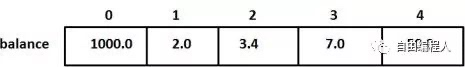
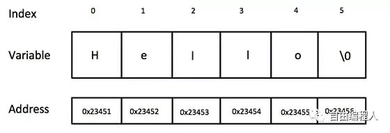
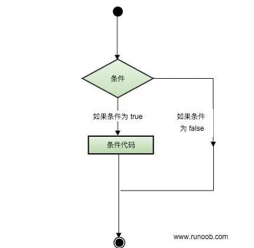

<h1 align="center">一文让你学完C++，干货收藏！！！</h1>

[toc]


> 大家好，应粉丝要求，我们今天带来了C++的基础知识大汇总，当然这是精简版的，但是篇幅也不少，应该说该有的也都有了，建议大家收藏慢慢学习，同时希望对大家的C++学习有所帮助。 

## **一 、从”hello world“ 入门C++！**

#### C++总览简介

C++ 是一种静态类型的、编译式的、通用的、大小写敏感的、不规则的编程语言，**支持过程化编程、面向对象编程和泛型编程。**

C++ 被认为是一种中级语言，它综合了高级语言和低级语言的特点。

C++ 是由 Bjarne Stroustrup 于 1979 年在新泽西州美利山贝尔实验室开始设计开发的。C++ 进一步扩充和完善了 C 语言，最初命名为带类的C，后来在 1983 年更名为 C++。

**C++ 是 C 的一个超集**，事实上，任何合法的 C 程序都是合法的 C++ 程序。

注意：使用静态类型的编程语言是在编译时执行类型检查，而不是在运行时执行类型检查。

#### 面向对象程序设计

**c++最大的亮点就是面向对象程序设计理念的运用**。包括面向对象开发的四大特性：

-   封装
-   抽象
-   继承
-   多态


#### C++的组成部分

标准的 C++ 由三个重要部分组成：

-   核心语言，提供了所有构件块，包括变量、数据类型和常量等等。
-   C++ 标准库，提供了大量的函数，用于操作文件、字符串等。
-   标准模板库（STL），提供了大量的方法，用于操作数据结构等。


#### C++的标准

对一门编程语言来说，遵循统一的标准是必需的。下面的表格列出了c++标准的发展历史。


| 发布时间 | 文档                  | 通称   | 备注                |
| :------- | :-------------------- | :----- | :------------------ |
| 2015     | ISO/IEC TS 19570:2015 | -      | 用于并行计算的扩展  |
| 2015     | ISO/IEC TS 18822:2015 | -      | 文件系统            |
| 2014     | ISO/IEC 14882:2014    | C++14  | 第四个C++标准       |
| 2011     | ISO/IEC TR 24733:2011 | -      | 十进制浮点数扩展    |
| 2011     | ISO/IEC 14882:2011    | C++11  | 第三个C++标准       |
| 2010     | ISO/IEC TR 29124:2010 | -      | 数学函数扩展        |
| 2007     | ISO/IEC TR 19768:2007 | C++TR1 | C++技术报告：库扩展 |
| 2006     | ISO/IEC TR 18015:2006 | -      | C++性能技术报告     |
| 2003     | ISO/IEC 14882:2003    | C++03  | 第二个C++标准       |


#### C++ 程序结构

让我们看一段简单的代码，可以输出单词 Hello World。

```C++
#include <iostream>
using namespace std;
// main() 是程序开始执行的地方
int main()
{
    cout << "Hello World"; // 输出 Hello World
    return 0;
}
```

让我们一起来研究一下上面的代码结构：

C++ 语言定义了一些头文件，这些头文件包含了程序中必需的或有用的信息。上面这段程序中，包含了头文件 <iostream>。

下一行 using namespace std; 告诉编译器使用 std 命名空间。命名空间是 C++ 中一个相对新的概念。

下一行 // main() 是程序开始执行的地方 是一个单行注释。单行注释以 // 开头，在行末结束。

下一行 int main() 是主函数，程序从这里开始执行。

下一行 cout << "Hello World"; 会在屏幕上显示消息 "Hello World"。

下一行 return 0; 终止 main( )函数，并向调用进程返回值 0。


#### C++ 中的分号 & 语句块

在 C++ 中，分号是语句结束符。也就是说，每个语句必须以分号结束。它表明一个逻辑实体的结束。


例如：下面就一共有两条语句。

```C++
x = y;
y = x+1;
```

语句块是一组使用大括号括起来的按逻辑连接的语句。例如：

```C++
{
    cout << "Hello World"; // 输出 Hello World
    return 0;
}
```

#### C++ 关键字

下表列出了 C++ 中的保留字。**这些保留字不能作为常量名、变量名或其他标识符名称。**


| asm          | else      | new              | this     |
| :----------- | :-------- | :--------------- | :------- |
| auto         | enum      | operator         | throw    |
| bool         | explicit  | private          | true     |
| break        | export    | protected        | try      |
| case         | extern    | public           | typedef  |
| catch        | false     | register         | typeid   |
| char         | float     | reinterpret_cast | typename |
| class        | for       | return           | union    |
| const        | friend    | short            | unsigned |
| const_cast   | goto      | signed           | using    |
| continue     | if        | sizeof           | virtual  |
| default      | inline    | static           | void     |
| delete       | int       | static_cast      | volatile |
| do           | long      | struct           | wchar_t  |
| double       | mutable   | switch           | while    |
| dynamic_cast | namespace | template         |          |


#### C++ 标识符

C++ 标识符是用来标识变量、函数、类、模块，或任何其他用户自定义项目的名称。**一个标识符以字母 A-Z 或 a-z 或下划线 _ 开始，后跟零个或多个字母、下划线和数字（0-9），不允许改变标识符组成规则。**

下面列出几个有效的标识符：

```C++
test
_temp
```

## **二 、 c++基本数据类型及流控制语句详解**

<center>**C++ 数组**</center>

C++ 支持数组数据结构，它可以存储一个固定大小的相同类型元素的顺序集合。**数组是用来存储一系列数据，但它往往被认为是一系列相同类型的变量。**

数组的声明并不是声明一个个单独的变量，比如 number0、number1、...、number99，而是声明一个数组变量，比如 numbers，然后使用 numbers[0]、numbers[1]、...、numbers[99] 来代表一个个单独的变量。数组中的特定元素可以通过索引访问。

所有的数组都是由连续的内存位置组成。最低的地址对应第一个元素，最高的地址对应最后一个元素。

#### 声明数组

在 C++ 中要声明一个数组，需要指定元素的类型和元素的数量，如下所示：

```C++
type arrayName [ arraySize ];
```

这叫做一维数组。arraySize 必须是一个大于零的整数常量，type 可以是任意有效的 C++ 数据类型。例如，要声明一个类型为 double 的包含 10 个元素的数组 balance，声明语句如下：

```C++
double balance[10];
```

现在 balance 是一个可用的数组，可以容纳 10 个类型为 double 的数字。

#### 初始化数组

在 C++ 中，可以逐个初始化数组，也可以使用一个初始化语句，如下所示：

```C++
double balance[5] = {1000.0, 2.0, 3.4, 7.0, 50.0};
```

大括号 { } 之间的值的数目不能大于我们在数组声明时在方括号 [ ] 中指定的元素数目。

如果省略掉了数组的大小，数组的大小则为初始化时元素的个数。因此，如果：

```C++
double balance[] = {1000.0, 2.0, 3.4, 7.0, 50.0};
```

将创建一个数组，它与前一个实例中所创建的数组是完全相同的。

下面是一个为数组中某个元素赋值的实例：

```C++
balance[4] = 50.0;
```

上述的语句把数组中第五个元素的值赋为 50.0。所有的数组都是以 0 作为它们第一个元素的索引，也被称为基索引，数组的最后一个索引是数组的总大小减去 1。以下是上面所讨论的数组的的图形表示：




#### 访问数组元素

数组元素可以通过数组名称加索引进行访问。元素的索引是放在方括号内，跟在数组名称的后边。例如：

```C++
double salary = balance[9];
```

上面的语句将把数组中第 10 个元素的值赋给 salary 变量。下面的实例使用了上述的三个概念，即，声明数组、数组赋值、访问数组：

```C++
#include <iostream>
using namespace std;
 
#include <iomanip>
using std::setw;
 
int main ()
{
   int n[ 10 ]; // n 是一个包含 10 个整数的数组
 
   // 初始化数组元素          
   for ( int i = 0; i < 10; i++ )
   {
      n[ i ] = i + 100; // 设置元素 i 为 i + 100
   }
   cout << "Element" << setw( 13 ) << "Value" << endl;
 
   // 输出数组中每个元素的值                     
   for ( int j = 0; j < 10; j++ )
   {
      cout << setw( 7 )<< j << setw( 13 ) << n[ j ] << endl;
   }
 
   return 0;
}
```


<center>**C++ 字符串**</center>

C++ 提供了以下两种类型的字符串表示形式：

- C 风格字符串
- C++ 引入的 string 类类型


#### C 风格字符串

C 风格的字符串起源于 C 语言，并在 C++ 中继续得到支持。字符串实际上是使用 null 字符 '\0' 终止的一维字符数组。因此，一个以 null 结尾的字符串，包含了组成字符串的字符。

下面的声明和初始化创建了一个 "Hello" 字符串。**由于在数组的末尾存储了空字符，所以字符数组的大小比单词 "Hello" 的字符数多一个。**

```C++
char greeting[6] = {'H', 'e', 'l', 'l', 'o', '\0'};
```

依据数组初始化规则，可以把上面的语句写成以下语句：

```C++
char greeting[] = "Hello";
```

以下是 C/C++ 中定义的字符串的内存表示：




其实，不需要把 null 字符放在字符串常量的末尾。**C++ 编译器会在初始化数组时，自动把 '\0' 放在字符串的末尾。**让我们尝试输出上面的字符串：

实例

```C++
#include <iostream> 
using namespace std;
 int main (){ 
   char greeting[6] = {'H', 'e', 'l', 'l', 'o', '\0'};   
    cout << "Greeting message: ";  
     cout << greeting << endl;  
       return 0;
 }
```

当上面的代码被编译和执行时，它会产生下列结果：

```C++
Greeting message: Hello
```


C++ 中有大量的函数用来操作以 null 结尾的字符串：supports a wide range of functions that manipulate null-terminated strings:

| 序号 | 函数 & 目的                                                  |
| ---- | ------------------------------------------------------------ |
| 1    | strcpy(s1, s2); 复制字符串 s2 到字符串 s1。                  |
| 2    | strcat(s1, s2); 连接字符串 s2 到字符串 s1 的末尾。           |
| 3    | strlen(s1); 返回字符串 s1 的长度。                           |
| 4    | strcmp(s1, s2); 如果 s1 和 s2 是相同的，则返回 0；如果 s1<s2 则返回值小于 0；如果 s1>s2 则返回值大于 0。 |
| 5    | strchr(s1, ch); 返回一个指针，指向字符串 s1 中字符 ch 的第一次出现的位置。 |
| 6    | strstr(s1, s2); 返回一个指针，指向字符串 s1 中字符串 s2 的第一次出现的位置。 |


下面的实例使用了上述的一些函数：

实例

```C++
#include <iostream>
#include <cstring>
 
using namespace std;
 
int main ()
{
   char str1[11] = "Hello";
   char str2[11] = "World";
   char str3[11];
   int  len ;
 
   // 复制 str1 到 str3
   strcpy( str3, str1);
   cout << "strcpy( str3, str1) : " << str3 << endl;
 
   // 连接 str1 和 str2
   strcat( str1, str2);
   cout << "strcat( str1, str2): " << str1 << endl;
 
   // 连接后，str1 的总长度
   len = strlen(str1);
   cout << "strlen(str1) : " << len << endl;
 
   return 0;
}
```

当上面的代码被编译和执行时，它会产生下列结果：

```C++
strcpy( str3, str1) : Hellostrcat( str1, str2): HelloWorldstrlen(str1) : 10C++ 中的 String 类
```

#### C++ 中的 string 类

C++ 标准库提供了 string 类类型，支持上述所有的操作，另外还增加了其他更多的功能。现在让我们先来看看下面这个实例：

实例

```C++
#include <iostream>
#include <string>
 
using namespace std;
 
int main ()
{
   string str1 = "Hello";
   string str2 = "World";
   string str3;
   int  len ;
 
   // 复制 str1 到 str3
   str3 = str1;
   cout << "str3 : " << str3 << endl;
 
   // 连接 str1 和 str2
   str3 = str1 + str2;
   cout << "str1 + str2 : " << str3 << endl;
 
   // 连接后，str3 的总长度
   len = str3.size();
   cout << "str3.size() :  " << len << endl;
 
   return 0;
}
```

当上面的代码被编译和执行时，它会产生下列结果：

```C++
str3 : Hello
str1 + str2 : HelloWorld
str3.size() : 10
```


<center>**C++ 循环**</center>

有的时候，可能需要多次执行同一块代码。一般情况下，语句是顺序执行的：函数中的第一个语句先执行，接着是第二个语句，依此类推。

编程语言提供了允许更为复杂的执行路径的多种控制结构。

循环语句允许我们多次执行一个语句或语句组，下面是大多数编程语言中循环语句的一般形式：


#### 循环类型

C++ 编程语言提供了以下几种循环类型。

| 循环类型        | 描述                                                         |
| --------------- | ------------------------------------------------------------ |
| while 循环      | 当给定条件为真时，重复语句或语句组。它会在执行循环主体之前测试条件。 |
| for 循环        | 多次执行一个语句序列，简化管理循环变量的代码。               |
| do...while 循环 | 除了它是在循环主体结尾测试条件外，其他与 while 语句类似。    |
| 嵌套循环        | 可以在 while、for 或 do..while 循环内使用一个或多个循环。    |


#### 循环控制语句

循环控制语句更改执行的正常序列。当执行离开一个范围时，所有在该范围中创建的自动对象都会被销毁。

C++ 提供了下列的控制语句。

| 控制语句      | 描述                                                         |
| ------------- | ------------------------------------------------------------ |
| break 语句    | 终止 loop 或 switch 语句，程序流将继续执行紧接着 loop 或 switch 的下一条语句。 |
| continue 语句 | 引起循环跳过主体的剩余部分，立即重新开始测试条件。           |
| goto 语句     | 将控制转移到被标记的语句。但是不建议在程序中使用 goto 语句。 |

#### 无限循环

如果条件永远不为假，则循环将变成无限循环。for 循环在传统意义上可用于实现无限循环。由于构成循环的三个表达式中任何一个都不是必需的，可以将某些条件表达式留空来构成一个无限循环。

实例

```C++
#include <iostream>
using namespace std;
 
int main ()
{
 
   for( ; ; )
   {
      printf("This loop will run forever.\n");
   }
 
   return 0;
}
```

当条件表达式不存在时，它被假设为真。也可以设置一个初始值和增量表达式，但是一般情况下，C++ 程序员偏向于使用 for(;;) 结构来表示一个无限循环。

**注意：可以按 Ctrl + C 键终止一个无限循环。**

**
**

<center>**C++ 判断**</center>

判断结构要求程序员指定一个或多个要评估或测试的条件，以及条件为真时要执行的语句（必需的）和条件为假时要执行的语句（可选的）。

下面是大多数编程语言中典型的判断结构的一般形式：




#### 判断语句

C++ 编程语言提供了以下类型的判断语句。

| 语句             | 描述                                                         |
| ---------------- | ------------------------------------------------------------ |
| if 语句          | 一个 if 语句 由一个布尔表达式后跟一个或多个语句组成。        |
| if...else 语句   | 一个 if 语句 后可跟一个可选的 else 语句，else 语句在布尔表达式为假时执行。 |
| 嵌套 if 语句     | 可以在一个 if 或 else if 语句内使用另一个 if 或 else if 语句。 |
| switch 语句      | 一个 switch 语句允许测试一个变量等于多个值时的情况。         |
| 嵌套 switch 语句 | 可以在一个 switch 语句内使用另一个 switch 语句。             |


## **三 、 c++进阶 基本输入输出、指针、引用**

<center>**C++ 基本的输入输出**</center>

今天我们来熟悉一下C++ 编程中最基本和最常见的 I/O 操作。

C++ 的 I/O 发生在流中，流是字节序列。如果字节流是从设备（如键盘、磁盘驱动器、网络连接等）流向内存，这叫做输入操作。如果字节流是从内存流向设备（如显示屏、打印机、磁盘驱动器、网络连接等），这叫做输出操作。


#### I/O 库头文件

下列的头文件在 C++ 编程中很重要。

| 头文件     | 函数和描述                                                   |
| ---------- | ------------------------------------------------------------ |
| <iostream> | 该文件定义了 cin、cout、cerr 和 clog 对象，分别对应于标准输入流、标准输出流、非缓冲标准错误流和缓冲标准错误流。 |
| <iomanip>  | 该文件通过所谓的参数化的流操纵器（比如 setw 和 setprecision），来声明对执行标准化 I/O 有用的服务。 |
| <fstream>  | 该文件为用户控制的文件处理声明服务。我们将在文件和流的相关章节讨论它的细节。 |

#### 标准输出流（cout）

预定义的对象 cout 是 iostream 类的一个实例。cout 对象"连接"到标准输出设备，通常是显示屏。cout 是与流插入运算符 << 结合使用的，如下所示：

实例

```C++
#include <iostream>
 
using namespace std;
 
int main( )
{
   char str[] = "Hello C++";
   cout << "Value of str is : " << str << endl;
}
```

当上面的代码被编译和执行时，它会产生下列结果：

```C++
Value of str is : Hello C++
```

C++ 编译器根据要输出变量的数据类型，选择合适的流插入运算符来显示值。<< 运算符被重载来输出内置类型（整型、浮点型、double 型、字符串和指针）的数据项。

**流插入运算符 << 在一个语句中可以多次使用，如上面实例中所示，endl 用于在行末添加一个换行符。**


#### 标准输入流（cin）

**预定义的对象 cin 是 iostream 类的一个实例**。cin 对象附属到标准输入设备，通常是键盘。cin 是与流提取运算符 >> 结合使用的，如下所示：

实例

```C++
#include <iostream>
 
using namespace std;
 
int main( )
{
   char name[50];
 
   cout << "请输入您的名称：";
   cin >> name;
   cout << "您的名称是：" << name << endl;
 
}
```

当上面的代码被编译和执行时，它会提示用户输入名称。当用户输入一个值，并按回车键，就会看到下列结果：

```C++
请输入您的名称：cplusplus
您的名称是：cplusplus
```

C++ 编译器根据要输入值的数据类型，选择合适的流提取运算符来提取值，并把它存储在给定的变量中。

**流提取运算符 >> 在一个语句中可以多次使用**，如果要求输入多个数据，可以使用如下语句：

```C++
cin >> name >> age;
```

这相当于下面两个语句：

```C++
cin >> name;
cin >> age;
```


#### 标准错误流（cerr）

预定义的对象 cerr 是 iostream 类的一个实例。cerr 对象附属到标准错误设备，通常也是显示屏，但是 cerr 对象是非缓冲的，且每个流插入到 cerr 都会立即输出。

cerr 也是与流插入运算符 << 结合使用的，如下所示：

实例

```C++
#include <iostream>
 
using namespace std;
 
int main( )
{
   char str[] = "Unable to read....";
 
   cerr << "Error message : " << str << endl;
}
```

当上面的代码被编译和执行时，它会产生下列结果：

```C++
Error message : Unable to read....
```


#### 标准日志流（clog）

预定义的对象 clog 是 iostream 类的一个实例。clog 对象附属到标准错误设备，通常也是显示屏，但是 clog 对象是缓冲的。这意味着每个流插入到 clog 都会先存储在缓冲在，直到缓冲填满或者缓冲区刷新时才会输出。

clog 也是与流插入运算符 << 结合使用的，如下所示：

实例

```C++
#include <iostream>
 
using namespace std;
 
int main( )
{
   char str[] = "Unable to read....";
 
   clog << "Error message : " << str << endl;
}
```

当上面的代码被编译和执行时，它会产生下列结果：

```C++
Error message : Unable to read....
```

**通过这些小实例，我们无法区分 cout、cerr 和 clog 的差异，但在编写和执行大型程序时，它们之间的差异就变得非常明显。所以良好的编程实践告诉我们，使用 cerr 流来显示错误消息，而其他的日志消息则使用 clog 流来输出。**


<center>**C++ 指针**</center>

学习 C++ 的指针既简单又有趣。通过指针，可以简化一些 C++ 编程任务的执行，还有一些任务，如动态内存分配，没有指针是无法执行的。所以，想要成为一名优秀的 C++ 程序员，学习指针是很有必要的。

每一个变量都有一个内存位置，每一个内存位置都定义了可使用连字号（&）运算符访问的地址，它表示了在内存中的一个地址。请看下面的实例，它将输出定义的变量地址：

实例

```C++
#include <iostream>
 
using namespace std;
 
int main ()
{
   int  var1;
   char var2[10];
 
   cout << "var1 变量的地址：";
   cout << &var1 << endl;
 
   cout << "var2 变量的地址：";
   cout << &var2 << endl;
 
   return 0;
}
```

当上面的代码被编译和执行时，它会产生下列结果：

```C++
var1 变量的地址：0xbfebd5c0
var2 变量的地址：0xbfebd5b6
```

通过上面的实例，我们了解了什么是内存地址以及如何访问它。接下来让我们看看什么是指针。


#### 什么是指针？

指针是一个变量，其值为另一个变量的地址，即，内存位置的直接地址。就像其他变量或常量一样，必须在使用指针存储其他变量地址之前，对其进行声明。指针变量声明的一般形式为：

```C++
type *var-name;
```

在这里，type 是指针的基类型，它必须是一个有效的 C++ 数据类型，var-name 是指针变量的名称。用来声明指针的星号 * 与乘法中使用的星号是相同的。但是，在这个语句中，星号是用来指定一个变量是指针。以下是有效的指针声明：

```C++
int *ip; /* 一个整型的指针 */
double *dp; /* 一个 double 型的指针 */
float *fp; /* 一个浮点型的指针 */
char *ch; /* 一个字符型的指针 */
```

**所有指针的值的实际数据类型，不管是整型、浮点型、字符型，还是其他的数据类型，都是一样的，都是一个代表内存地址的长的十六进制数。不同数据类型的指针之间唯一的不同是，指针所指向的变量或常量的数据类型不同。**


#### C++ 中使用指针

使用指针时会频繁进行以下几个操作：定义一个指针变量、把变量地址赋值给指针、访问指针变量中可用地址的值。这些是通过使用一元运算符 *来返回位于操作数所指定地址的变量的值。下面的实例涉及到了这些操作：

```C++
#include <iostream>
 
using namespace std;
 
int main ()
{
   int  var = 20;   // 实际变量的声明
   int  *ip;        // 指针变量的声明
 
   ip = &var;       // 在指针变量中存储 var 的地址
 
   cout << "Value of var variable: ";
   cout << var << endl;
 
   // 输出在指针变量中存储的地址
   cout << "Address stored in ip variable: ";
   cout << ip << endl;
 
   // 访问指针中地址的值
   cout << "Value of *ip variable: ";
   cout << *ip << endl;
 
   return 0;
}
```

当上面的代码被编译和执行时，它会产生下列结果：

```C++
Value of var variable: 20
Address stored in ip variable: 0xbfc601ac
Value of *ip variable: 20
```


<center>**C++ 引用**</center>

引用变量是一个别名，也就是说，它是某个已存在变量的另一个名字。一旦把引用初始化为某个变量，就可以使用该引用名称或变量名称来指向变量。


#### C++ 引用 vs 指针

**引用很容易与指针混淆，它们之间有三个主要的不同：**

- 不存在空引用。引用必须连接到一块合法的内存。
- 一旦引用被初始化为一个对象，就不能被指向到另一个对象。指针可以在任何时候指向到另一个对象。
- 引用必须在创建时被初始化。指针可以在任何时间被初始。


#### C++ 中创建引用

试想变量名称是变量附属在内存位置中的标签，可以把引用当成是变量附属在内存位置中的第二个标签。因此，可以通过原始变量名称或引用来访问变量的内容。例如：

```C++
int i = 17;
```

我们可以为 i 声明引用变量，如下所示：

```C++
int& r = i;
double& s = d;
```

在这些声明中，& 读作引用。因此，第一个声明可以读作 "r 是一个初始化为 i 的整型引用"，第二个声明可以读作 "s 是一个初始化为 d 的 double 型引用"。下面的实例使用了 int 和 double 引用：

实例

```C++
#include <iostream>
 
using namespace std;
 
int main ()
{
   // 声明简单的变量
   int    i;
   double d;
 
   // 声明引用变量
   int&    r = i;
   double& s = d;
   
   i = 5;
   cout << "Value of i : " << i << endl;
   cout << "Value of i reference : " << r  << endl;
 
   d = 11.7;
   cout << "Value of d : " << d << endl;
   cout << "Value of d reference : " << s  << endl;
   
   return 0;
}
```

当上面的代码被编译和执行时，它会产生下列结果：

```C++
Value of i : 5
Value of i reference : 5
Value of d : 11.7
Value of d reference : 11.7
```

引用通常用于函数参数列表和函数返回值。**下面列出了 C++ 程序员必须清楚的两个与 C++ 引用相关的重要概念：**

| 概念             | 描述                                                     |
| ---------------- | -------------------------------------------------------- |
| 把引用作为参数   | C++ 支持把引用作为参数传给函数，这比传一般的参数更安全。 |
| 把引用作为返回值 | 可以从 C++ 函数中返回引用，就像返回其他数据类型一样。    |


## **四、 C++ 类与对象初探：****继承和重载**

 <center>**C++ 类 & 对象**</center>

C++ 在 C 语言的基础上增加了面向对象编程，C++ 支持面向对象程序设计。类是 C++ 的核心特性，通常被称为用户定义的类型。

类用于指定对象的形式，它包含了数据表示法和用于处理数据的方法。类中的数据和方法称为类的成员。函数在一个类中被称为类的成员。


#### C++ 类定义

定义一个类，本质上是定义一个数据类型的蓝图。这实际上并没有定义任何数据，但它定义了类的名称意味着什么，也就是说，它定义了类的对象包括了什么，以及可以在这个对象上执行哪些操作。

类定义是以关键字 class 开头，后跟类的名称。类的主体是包含在一对花括号中。类定义后必须跟着一个分号或一个声明列表。例如，我们使用关键字 class 定义 Box 数据类型，如下所示：

```C++
class Box
{
   public:
      double length;   // 盒子的长度
      double breadth;  // 盒子的宽度
      double height;   // 盒子的高度
};
```

关键字 public 确定了类成员的访问属性。在类对象作用域内，公共成员在类的外部是可访问的。也可以指定类的成员为 private 或 protected。


#### 定义 C++ 对象

类提供了对象的蓝图，所以基本上，对象是根据类来创建的。声明类的对象，就像声明基本类型的变量一样。下面的语句声明了类 Box 的两个对象：

```C++
Box Box1; // 声明 Box1，类型为 Box Box Box2; // 声明 Box2，类型为 Box
对象 Box1 和 Box2 都有它们各自的数据成员。
```


#### 访问数据成员

类的对象的公共数据成员可以使用直接成员访问运算符 (.) 来访问。为了更好地理解这些概念，让我们尝试一下下面的实例：

实例

```C++
#include <iostream>
 
using namespace std;
 
class Box
{
   public:
      double length;   // 长度
      double breadth;  // 宽度
      double height;   // 高度
};
 
int main( )
{
   Box Box1;        // 声明 Box1，类型为 Box
   Box Box2;        // 声明 Box2，类型为 Box
   double volume = 0.0;     // 用于存储体积
 
   // box 1 详述
   Box1.height = 5.0; 
   Box1.length = 6.0; 
   Box1.breadth = 7.0;
 
   // box 2 详述
   Box2.height = 10.0;
   Box2.length = 12.0;
   Box2.breadth = 13.0;
 
   // box 1 的体积
   volume = Box1.height * Box1.length * Box1.breadth;
   cout << "Box1 的体积：" << volume <<endl;
 
   // box 2 的体积
   volume = Box2.height * Box2.length * Box2.breadth;
   cout << "Box2 的体积：" << volume <<endl;
   return 0;
}
```

当上面的代码被编译和执行时，它会产生下列结果：

```C++
Box1 的体积：210B
ox2 的体积：1560
```

需要注意的是，私有的成员和受保护的成员不能使用直接成员访问运算符 (.) 来直接访问。


<center>**C++ 继承**</center>


面向对象程序设计中最重要的一个概念是继承。继承允许我们依据另一个类来定义一个类，这使得创建和维护一个应用程序变得更容易。这样做，也达到了重用代码功能和提高执行时间的效果。

当创建一个类时，您不需要重新编写新的数据成员和成员函数，只需指定新建的类继承了一个已有的类的成员即可。这个已有的类称为基类，新建的类称为派生类。

**继承代表了 is a 关系**。例如，哺乳动物是动物，狗是哺乳动物，因此，狗是动物，等等。


#### 基类 & 派生类

一个类可以派生自多个类，这意味着，它可以从多个基类继承数据和函数。定义一个派生类，我们使用一个类派生列表来指定基类。类派生列表以一个或多个基类命名，形式如下：

```C++
class derived-class: access-specifier base-class
```

其中，访问修饰符 access-specifier 是 public、protected 或 private 其中的一个，base-class 是之前定义过的某个类的名称。如果未使用访问修饰符 access-specifier，则默认为 private。

假设有一个基类 **Shape，Rectangle** 是它的派生类，如下所示：

实例

```C++
#include <iostream>
 
using namespace std;
 
// 基类
class Shape 
{
   public:
      void setWidth(int w)
{
         width = w;
      }
      void setHeight(int h)
{
         height = h;
      }
   protected:
      int width;
      int height;
};
 
// 派生类
class Rectangle: public Shape
{
   public:
      int getArea()
{ 
         return (width * height); 
      }
};
 
int main(void)
{
   Rectangle Rect;
 
   Rect.setWidth(5);
   Rect.setHeight(7);
 
   // 输出对象的面积
   cout << "Total area: " << Rect.getArea() << endl;
 
   return 0;
}
```

当上面的代码被编译和执行时，它会产生下列结果：

```C++
Total area: 35
```


<center>**访问控制和继承**</center>

派生类可以访问基类中所有的非私有成员。因此基类成员如果不想被派生类的成员函数访问，则应在基类中声明为 private。

我们可以根据访问权限总结出不同的访问类型，如下所示：

| 访问     | public | protected | private |
| -------- | ------ | --------- | ------- |
| 同一个类 | yes    | yes       | yes     |
| 派生类   | yes    | yes       | no      |
| 外部的类 | yes    | no        | no      |

一个派生类继承了所有的基类方法，但下列情况除外：

- 基类的构造函数、析构函数和拷贝构造函数。
- 基类的重载运算符。
- 基类的友元函数。


#### 继承类型

当一个类派生自基类，该基类可以被继承为 public、protected 或 private 几种类型。继承类型是通过上面讲解的访问修饰符 access-specifier 来指定的。

我们几乎不使用 **protected** 或 **private** 继承，通常使用 public 继承。当使用不同类型的继承时，遵循以下几个规则：

- **公有继承（public）**：当一个类派生自公有基类时，基类的公有成员也是派生类的公有成员，基类的保护成员也是派生类的保护成员，基类的私有成员不能直接被派生类访问，但是可以通过调用基类的公有和保护成员来访问。
- **保护继承（protected）**：当一个类派生自保护基类时，基类的公有和保护成员将成为派生类的保护成员。
- **私有继承（private）**：当一个类派生自私有基类时，基类的公有和保护成员将成为派生类的私有成员。


#### 多继承

多继承即一个子类可以有多个父类，它继承了多个父类的特性。

C++ 类可以从多个类继承成员，语法如下：

```C++
class <派生类名>:<继承方式1><基类名1>,<继承方式2><基类名2>,…
{
<派生类类体>
};
```

其中，访问修饰符继承方式是 public、protected 或 private 其中的一个，用来修饰每个基类，各个基类之间用逗号分隔，如上所示。现在让我们一起看看下面的实例：

实例

```C++
#include <iostream>
 
using namespace std;
 
// 基类 Shape
class Shape 
{
   public:
      void setWidth(int w)
{
         width = w;
      }
      void setHeight(int h)
{
         height = h;
      }
   protected:
      int width;
      int height;
};
 
// 基类 PaintCost
class PaintCost 
{
   public:
      int getCost(int area)
{
         return area * 70;
      }
};
 
// 派生类
class Rectangle: public Shape, public PaintCost
{
   public:
      int getArea()
{ 
         return (width * height); 
      }
};
 
int main(void)
{
   Rectangle Rect;
   int area;
 
   Rect.setWidth(5);
   Rect.setHeight(7);
 
   area = Rect.getArea();
   
   // 输出对象的面积
   cout << "Total area: " << Rect.getArea() << endl;
 
   // 输出总花费
   cout << "Total paint cost: $" << Rect.getCost(area) << endl;
 
   return 0;
}
```

当上面的代码被编译和执行时，它会产生下列结果：

```C++
Total area: 35
Total paint cost: $2450
```


<center>**C++ 重载运算符和重载函数**</center>

C++ 允许在同一作用域中的某个**函数**和**运算符**指定多个定义，**分别称为函数重载和运算符重载。**

重载声明是指一个与之前已经在该作用域内声明过的函数或方法具有相同名称的声明，但是它们的参数列表和定义（实现）不相同。

**当您调用一个重载函数或重载运算符时**，编译器通过把您所使用的参数类型与定义中的参数类型进行比较，决定选用最合适的定义。选择最合适的重载函数或重载运算符的过程，称为重载决策。


#### C++ 中的函数重载

在同一个作用域内，可以声明几个功能类似的同名函数，但是这些同名函数的形式参数（指参数的个数、类型或者顺序）必须不同。您不能仅通过返回类型的不同来重载函数。

下面的实例中，同名函数 print() 被用于输出不同的数据类型：

实例

```C++
#include <iostream>
using namespace std;
 
class printData
{
   public:
      void print(int i) {
        cout << "整数为: " << i << endl;
      }
 
      void print(double  f) {
        cout << "浮点数为: " << f << endl;
      }
 
      void print(char c[]) {
        cout << "字符串为: " << c << endl;
      }
};
 
int main(void)
{
   printData pd;
 
   // 输出整数
   pd.print(5);
   // 输出浮点数
   pd.print(500.263);
   // 输出字符串
   char c[] = "Hello C++";
   pd.print(c);
 
   return 0;
}
```

当上面的代码被编译和执行时，它会产生下列结果：

```C++
整数为: 5
浮点数为: 500.263
字符串为: Hello C++
```


#### C++ 中的运算符重载

您可以重定义或重载大部分 C++ 内置的运算符。这样，您就能使用自定义类型的运算符。

重载的运算符是带有特殊名称的函数，函数名是由关键字 operator 和其后要重载的运算符符号构成的。与其他函数一样，重载运算符有一个返回类型和一个参数列表。

```C++
Box operator+(const Box&);
```

声明加法运算符用于把两个 Box 对象相加，返回最终的 Box 对象。大多数的重载运算符可被定义为普通的非成员函数或者被定义为类成员函数。如果我们定义上面的函数为类的非成员函数，那么我们需要为每次操作传递两个参数，如下所示：

```C++
Box operator+(const Box&, const Box&);
```

下面的实例使用成员函数演示了运算符重载的概念。在这里，对象作为参数进行传递，对象的属性使用 this 运算符进行访问，如下所示：

实例

```C++
#include <iostream>
using namespace std;
 
class Box
{
   public:
 
      double getVolume(void)
{
         return length * breadth * height;
      }
      void setLength( double len )
{
          length = len;
      }
 
      void setBreadth( double bre )
{
          breadth = bre;
      }
 
      void setHeight( double hei )
{
          height = hei;
      }
      // 重载 + 运算符，用于把两个 Box 对象相加
      Box operator+(const Box& b)
      {
         Box box;
         box.length = this->length + b.length;
         box.breadth = this->breadth + b.breadth;
         box.height = this->height + b.height;
         return box;
      }
   private:
      double length;      // 长度
      double breadth;     // 宽度
      double height;      // 高度
};
// 程序的主函数
int main( )
{
   Box Box1;                // 声明 Box1，类型为 Box
   Box Box2;                // 声明 Box2，类型为 Box
   Box Box3;                // 声明 Box3，类型为 Box
   double volume = 0.0;     // 把体积存储在该变量中
 
   // Box1 详述
   Box1.setLength(6.0); 
   Box1.setBreadth(7.0); 
   Box1.setHeight(5.0);
 
   // Box2 详述
   Box2.setLength(12.0); 
   Box2.setBreadth(13.0); 
   Box2.setHeight(10.0);
 
   // Box1 的体积
   volume = Box1.getVolume();
   cout << "Volume of Box1 : " << volume <<endl;
 
   // Box2 的体积
   volume = Box2.getVolume();
   cout << "Volume of Box2 : " << volume <<endl;
 
   // 把两个对象相加，得到 Box3
   Box3 = Box1 + Box2;
 
   // Box3 的体积
   volume = Box3.getVolume();
   cout << "Volume of Box3 : " << volume <<endl;
 
   return 0;
}
```

当上面的代码被编译和执行时，它会产生下列结果：

```
Volume of Box1 : 210
Volume of Box2 : 1560
Volume of Box3 : 5400
```


## **五 、C++进阶 多态和数据抽象**

<cneter>**C++ 多态**</center>

多态按字面的意思就是多种形态。当类之间存在层次结构，并且类之间是通过继承关联时，就会用到多态。

C++ 多态意味着调用成员函数时，会根据调用函数的对象的类型来执行不同的函数。

下面的实例中，基类 Shape 被派生为两个类，如下所示：

实例

```C++
#include <iostream> 
using namespace std;
 
class Shape {
   protected:
      int width, height;
   public:
      Shape( int a=0, int b=0)
      {
         width = a;
         height = b;
      }
      int area()
{
         cout << "Parent class area :" <<endl;
         return 0;
      }
};
class Rectangle: public Shape{
   public:
      Rectangle( int a=0, int b=0):Shape(a, b) { }
      int area ()
{ 
         cout << "Rectangle class area :" <<endl;
         return (width * height); 
      }
};
class Triangle: public Shape{
   public:
      Triangle( int a=0, int b=0):Shape(a, b) { }
      int area ()
{ 
         cout << "Triangle class area :" <<endl;
         return (width * height / 2); 
      }
};
// 程序的主函数
int main( )
{
   Shape *shape;
   Rectangle rec(10,7);
   Triangle  tri(10,5);
 
   // 存储矩形的地址
   shape = &rec;
   // 调用矩形的求面积函数 area
   shape->area();
 
   // 存储三角形的地址
   shape = &tri;
   // 调用三角形的求面积函数 area
   shape->area();
   
   return 0;
}
```

当上面的代码被编译和执行时，它会产生下列结果：

```C++
Parent class areaParent class area
```

导致错误输出的原因是，调用函数 area() 被编译器设置为基类中的版本，**这就是所谓的静态多态，或静态链接** - 函数调用在程序执行前就准备好了。有时候这也被称为**早绑定**，因为 area() 函数在程序编译期间就已经设置好了。

但现在，让我们对程序稍作修改，在 Shape 类中，area() 的声明前放置关键字 virtual，如下所示：

```C++
class Shape {
   protected:
      int width, height;
   public:
      Shape( int a=0, int b=0)
      {
         width = a;
         height = b;
      }
      virtual int area()
{
         cout << "Parent class area :" <<endl;
         return 0;
      }
};
```

修改后，当编译和执行前面的实例代码时，它会产生以下结果：

```C++
Rectangle class area
Triangle class area
```

此时，编译器看的是指针的内容，而不是它的类型。因此，由于 tri 和 rec 类的对象的地址存储在 *shape 中，所以会调用各自的 area() 函数。

正如大家所看到的，每个子类都有一个函数 area() 的独立实现。这就是多态的一般使用方式。**有了多态，就可以有多个不同的类，都带有同一个名称但具有不同实现的函数，函数的参数甚至可以是相同的。**


#### 虚函数

虚函数 是在基类中使用关键字 virtual 声明的函数。在派生类中重新定义基类中定义的虚函数时，会告诉编译器不要静态链接到该函数。

我们想要的是在程序中任意点可以根据所调用的对象类型来选择调用的函数，**这种操作被称为动态链接，或后期绑定。**


<center>**纯虚函数**</center>

大家可能想要在基类中定义虚函数，以便在派生类中重新定义该函数更好地适用于对象，但是大家在基类中又不能对虚函数给出有意义的实现，这个时候就会用到纯虚函数。

我们可以把基类中的虚函数 area() 改写如下：

```C++
class Shape {
   protected:
      int width, height;
   public:
      Shape( int a=0, int b=0)
      {
         width = a;
         height = b;
      }
      // pure virtual function
      virtual int area() = 0;
};
```

= 0 告诉编译器，函数没有主体，上面的虚函数是纯虚函数。


<center>**C++ 数据抽象**</center>

**数据抽象是指，只向外界提供关键信息，并隐藏其后台的实现细节，即只表现必要的信息而不呈现细节。**

数据抽象是一种依赖于接口和实现分离的编程（设计）技术。

让我们举一个现实生活中的真实例子，比如一台电视机，可以打开和关闭、切换频道、调整音量、添加外部组件（如喇叭、录像机、DVD 播放器），但是我们不知道它的内部实现细节，也就是说，我们并不知道它是如何通过缆线接收信号，如何转换信号，并最终显示在屏幕上。

因此，我们可以说电视把它的内部实现和外部接口分离开了，我们无需知道它的内部实现原理，直接通过它的外部接口（比如电源按钮、遥控器、声量控制器）就可以操控电视。

现在，让我们言归正传，就 C++ 编程而言，C++ 类为数据抽象提供了可能。它们向外界提供了大量用于操作对象数据的公共方法，也就是说，外界实际上并不清楚类的内部实现。

例如，程序可以调用 sort() 函数，而不需要知道函数中排序数据所用到的算法。实际上，函数排序的底层实现会因库的版本不同而有所差异，只要接口不变，函数调用就可以照常工作。

在 C++ 中，我们使用类来定义我们自己的抽象数据类型（ADT）。可以使用类 iostream 的 cout 对象来输出数据到标准输出，如下所示：

实例

```C++
#include <iostream>
using namespace std; 
int main( )
{
   cout << "Hello C++" <<endl;
   return 0;
}
```

在这里，暂时不需要理解 cout 是如何在用户的屏幕上显示文本。只需要知道公共接口即可，cout 的底层实现可以自由改变。


#### 访问标签强制抽象

在 C++ 中，我们使用访问标签来定义类的抽象接口。一个类可以包含零个或多个访问标签：

- 使用公共标签定义的成员都可以访问该程序的所有部分。一个类型的数据抽象视图是由它的公共成员来定义的。
- 使用私有标签定义的成员无法访问到使用类的代码。私有部分对使用类型的代码隐藏了实现细节。

访问标签出现的频率没有限制。每个访问标签指定了紧随其后的成员定义的访问级别。指定的访问级别会一直有效，直到遇到下一个访问标签或者遇到类主体的关闭右括号为止。


#### 数据抽象的好处

数据抽象有两个重要的优势：

- 类的内部受到保护，不会因无意的用户级错误导致对象状态受损。
- 类实现可能随着时间的推移而发生变化，以便应对不断变化的需求，或者应对那些要求不改变用户级代码的错误报告。

如果只在类的私有部分定义数据成员，编写该类的作者就可以随意更改数据。如果实现发生改变，则只需要检查类的代码，看看这个改变会导致哪些影响。

如果数据是公有的，则任何直接访问旧表示形式的数据成员的函数都可能受到影响。

#### 数据抽象的实例

C++ 程序中，任何带有公有和私有成员的类都可以作为数据抽象的实例。请看下面的实例：

实例

```C++
#include <iostream>
using namespace std;
 
class Adder{
   public:
      // 构造函数
      Adder(int i = 0)
      {
        total = i;
      }
      // 对外的接口
      void addNum(int number)
{
          total += number;
      }
      // 对外的接口
      int getTotal()
{
          return total;
      };
   private:
      // 对外隐藏的数据
      int total;
};
int main( )
{
   Adder a;
   
   a.addNum(10);
   a.addNum(20);
   a.addNum(30);
 
   cout << "Total " << a.getTotal() <<endl;
   return 0;
}
```

当上面的代码被编译和执行时，它会产生下列结果：

```C++
Total 60
```

上面的类把数字相加，并返回总和。**公有成员 addNum 和 getTotal 是对外的接口**，用户需要知道它们以便使用类。**私有成员 total** 是用户不需要了解的，但又是类能正常工作所必需的。


<center>**C++ 数据封装**</center>

所有的 C++ 程序都有以下两个基本要素：

- 程序语句（代码）：这是程序中执行动作的部分，它们被称为函数。
- 程序数据：数据是程序的信息，会受到程序函数的影响。

封装是面向对象编程中的把数据和操作数据的函数绑定在一起的一个概念，这样能避免受到外界的干扰和误用，从而确保了安全。数据封装引申出了另一个重要的 OOP 概念**，即数据隐藏。**

**数据封装是一种把数据和操作数据的函数捆绑在一起的机制，数据抽象是一种仅向用户暴露接口而把具体的实现细节隐藏起来的机制。**

C++ 通过创建类来支持封装和数据隐藏（public、protected、private）。我们已经知道，类包含私有成员（private）、保护成员（protected）和公有成员（public）成员。默认情况下，在类中定义的所有项目都是私有的。例如：

```C++
class Box
{
   public:
      double getVolume(void)
      {
         return length * breadth * height;
      }
   private:
      double length;      // 长度
      double breadth;     // 宽度
      double height;      // 高度
};
```

变量 length、breadth 和 height 都是私有的（private）。这意味着它们只能被 Box 类中的其他成员访问，而不能被程序中其他部分访问。这是实现封装的一种方式。

为了使类中的成员变成公有的（即，程序中的其他部分也能访问），必须在这些成员前使用 public 关键字进行声明。所有定义在 public 标识符后边的变量或函数可以被程序中所有其他的函数访问。

把一个类定义为另一个类的友元类，会暴露实现细节，从而降低了封装性。理想的做法是尽可能地对外隐藏每个类的实现细节。


#### 数据封装的实例

C++ 程序中，任何带有公有和私有成员的类都可以作为数据封装和数据抽象的实例。请看下面的实例：

实例

```C++
#include <iostream>
using namespace std;
 
class Adder{
   public:
      // 构造函数
      Adder(int i = 0)
      {
        total = i;
      }
      // 对外的接口
      void addNum(int number)
{
          total += number;
      }
      // 对外的接口
      int getTotal()
{
          return total;
      };
   private:
      // 对外隐藏的数据
      int total;
};
int main( )
{
   Adder a;
   
   a.addNum(10);
   a.addNum(20);
   a.addNum(30);
 
   cout << "Total " << a.getTotal() <<endl;
   return 0;
}
```

当上面的代码被编译和执行时，它会产生下列结果：

```C++
Total 60
```

上面的类把数字相加，并返回总和。公有成员 addNum 和 getTotal 是对外的接口，用户需要知道它们以便使用类。私有成员 total 是对外隐藏的，用户不需要了解它，但它又是类能正常工作所必需的。


## **六、c++进阶 模板和stl入门**

<center>**C++ 模板**</center>

模板是泛型编程的基础，泛型编程即以一种独立于任何特定类型的方式编写代码。

模板是创建泛型类或函数的蓝图或公式。库容器，比如迭代器和算法，都是泛型编程的例子，它们都使用了模板的概念。

每个容器都有一个单一的定义，比如 **向量**，我们可以定义许多不同类型的向量，**比如 vector  或 vector 。**

您可以使用模板来定义函数和类，接下来让我们一起来看看如何使用。


#### 函数模板

模板函数定义的一般形式如下所示：

```C++
template <class type> ret-type func-name(parameter list) 
{
 // 函数的主体 
}
```

在这里，type 是函数所使用的数据类型的占位符名称。这个名称可以在函数定义中使用。

下面是函数模板的实例，返回两个数中的最大值：

实例

```C++
#include <iostream>
#include <string>
 
using namespace std;
 
template <typename T>
inline T const& Max (T const& a, T const& b) 
{ 
    return a < b ? b:a; 
} 
int main ()
{
 
    int i = 39;
    int j = 20;
    cout << "Max(i, j): " << Max(i, j) << endl; 
 
    double f1 = 13.5; 
    double f2 = 20.7; 
    cout << "Max(f1, f2): " << Max(f1, f2) << endl; 
 
    string s1 = "Hello"; 
    string s2 = "World"; 
    cout << "Max(s1, s2): " << Max(s1, s2) << endl; 
 
   return 0;
}
```

当上面的代码被编译和执行时，它会产生下列结果：

```C++
Max(i, j): 39
Max(f1, f2): 20.7
Max(s1, s2): World类模板
```

正如我们定义函数模板一样，我们也可以定义类模板。泛型类声明的一般形式如下所示： 

```C++
template <class type> class class-name {
.
.
.
}
```

在这里，**type 是占位符类型名称，**可以在类被实例化的时候进行指定。您可以使用一个逗号分隔的列表来定义多个泛型数据类型。

下面的实例定义了类 Stack<>，并实现了泛型方法来对元素进行入栈出栈操作：

实例

```C++
#include <iostream>
#include <vector>
#include <cstdlib>
#include <string>
#include <stdexcept>
 
using namespace std;
 
template <class T>
class Stack { 
  private: 
    vector<T> elems;     // 元素 
 
  public: 
    void push(T const&);  // 入栈
    void pop();               // 出栈
    T top() const;            // 返回栈顶元素
    bool empty() const{       // 如果为空则返回真。
        return elems.empty(); 
    } 
}; 
 
template <class T>
void Stack<T>::push (T const& elem) 
{ 
    // 追加传入元素的副本
    elems.push_back(elem);    
} 
 
template <class T>
void Stack<T>::pop () 
{ 
    if (elems.empty()) { 
        throw out_of_range("Stack<>::pop(): empty stack"); 
    }
    // 删除最后一个元素
    elems.pop_back();         
} 
 
template <class T>
T Stack<T>::top () const 
{ 
    if (elems.empty()) { 
        throw out_of_range("Stack<>::top(): empty stack"); 
    }
    // 返回最后一个元素的副本 
    return elems.back();      
} 
 
int main() 
{ 
    try { 
        Stack<int>         intStack;  // int 类型的栈 
        Stack<string> stringStack;    // string 类型的栈 
 
        // 操作 int 类型的栈 
        intStack.push(7); 
        cout << intStack.top() <<endl; 
 
        // 操作 string 类型的栈 
        stringStack.push("hello"); 
        cout << stringStack.top() << std::endl; 
        stringStack.pop(); 
        stringStack.pop(); 
    } 
    catch (exception const& ex) { 
        cerr << "Exception: " << ex.what() <<endl; 
        return -1;
    } 
}
```

当上面的代码被编译和执行时，它会产生下列结果：

```C++
7
hello
Exception: Stack<>::pop(): empty stack
```


<center>**C++ STL 入门**</center>

上面我们已经了解了 C++ 模板的概念。**C++ STL（标准模板库）是一套功能强大的 C++ 模板类，提供了通用的模板类和函数，这些模板类和函数可以实现多种流行和常用的算法和数据结构，如向量、链表、队列、栈。**

C++ 标准模板库的核心包括以下三个组件：

组件

| 描述                |                                                              |
| ------------------- | ------------------------------------------------------------ |
| 容器（Containers）  | 容器是用来管理某一类对象的集合。C++ 提供了各种不同类型的容器，比如 deque、list、vector、map 等。 |
| 算法（Algorithms）  | 算法作用于容器。它们提供了执行各种操作的方式，包括对容器内容执行初始化、排序、搜索和转换等操作。 |
| 迭代器（iterators） | 迭代器用于遍历对象集合的元素。这些集合可能是容器，也可能是容器的子集。 |

这三个组件都带有丰富的预定义函数，帮助我们通过简单的方式处理复杂的任务。

下面的程序演示了向量容器（一个 C++ 标准的模板），它与数组十分相似，唯一不同的是，向量在需要扩展大小的时候，会自动处理它自己的存储需求：

实例

```C++
#include <iostream>
#include <vector>
using namespace std;
 
int main()
{
   // 创建一个向量存储 int
   vector<int> vec; 
   int i;
 
   // 显示 vec 的原始大小
   cout << "vector size = " << vec.size() << endl;
 
   // 推入 5 个值到向量中
   for(i = 0; i < 5; i++){
      vec.push_back(i);
   }
 
   // 显示 vec 扩展后的大小
   cout << "extended vector size = " << vec.size() << endl;
 
   // 访问向量中的 5 个值
   for(i = 0; i < 5; i++){
      cout << "value of vec [" << i << "] = " << vec[i] << endl;
   }
 
   // 使用迭代器 iterator 访问值
   vector<int>::iterator v = vec.begin();
   while( v != vec.end()) {
      cout << "value of v = " << *v << endl;
      v++;
   }
 
   return 0;
}
```

当上面的代码被编译和执行时，它会产生下列结果：

```C++
vector size = 0
extended vector size = 5
value of vec [0] = 0
value of vec [1] = 1
value of vec [2] = 2
value of vec [3] = 3
value of vec [4] = 4
value of v = 0
value of v = 1
value of v = 2
value of v = 3
value of v = 4
```

关于上面实例中所使用的各种函数，有几点要注意：

- push_back( ) 成员函数在向量的末尾插入值，如果有必要会扩展向量的大小。
- size( ) 函数显示向量的大小。
- begin( ) 函数返回一个指向向量开头的迭代器。
- end( ) 函数返回一个指向向量末尾的迭代器。
