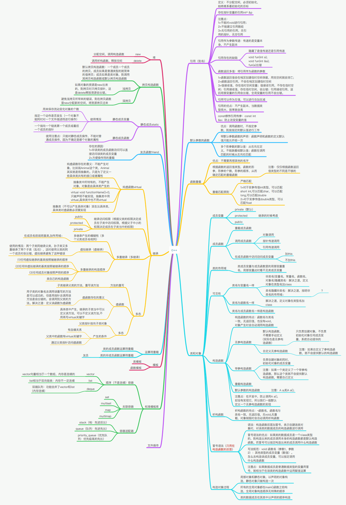

<h1 align="center">C++知识</h1>

[toc]

## CPP文档和社区

* [官方文档](https://zh.cppreference.com/w/cpp)
* [“libc++” C++ Standard Library — 13.0 documentation](https://libcxx.llvm.org/)：libc文档
* [极客光城](https://light-city.club)：优秀的C++博客
* [轮子哥（陈梓瀚）](http://www.cppblog.com/vczh/)

## CPP书籍

### 入门

* 《C++ Primer》
* 《C++标准程序库》

### 进阶篇

* 《(More)Effective C++》
* 《(More)Exceptional C++》
* 《Effective STL》
* 《C++编程规范》

### 高手篇

* 《深入探索C++对象模型》
* 《Imperfect C++》
* 《STL源码剖析》
* 《C++ Templates》
* 《C++设计新思维》
* 《C++模版元编程》

### 神篇（请允许我假装知道自己在说什么）

* 《C++语言的设计和演化》
* 《编程的本质》
* 《C++标准文件》

## CPP开源项目

* [C++版2048游戏](https://github.com/plibither8/2048.cpp)
* [yuzu](https://github.com/yuzu-emu/yuzu)：Nintendo Switch Emulator
* [awesome-cpp](https://github.com/fffaraz/awesome-cpp)
* [C++那些事](https://github.com/Light-City/CPlusPlusThings)：入门资料
* [微软-计算器](https://github.com/Microsoft/calculator)
* [值得推荐的C/C++框架和库 | EZLippi-浮生志](https://ezlippi.com/blog/2014/12/c-open-project.html)

## C++ 知识架构

