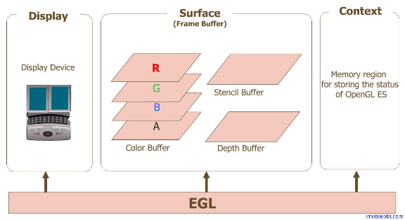
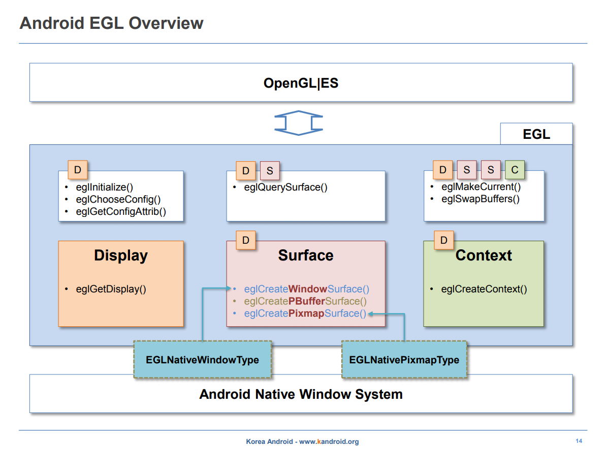
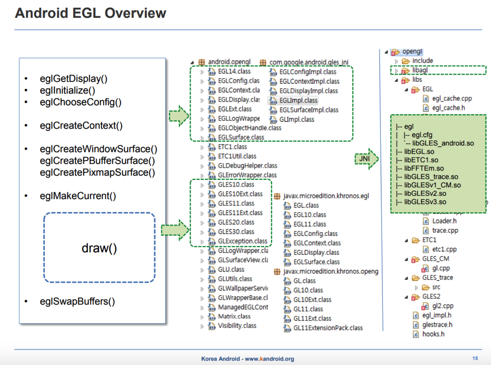
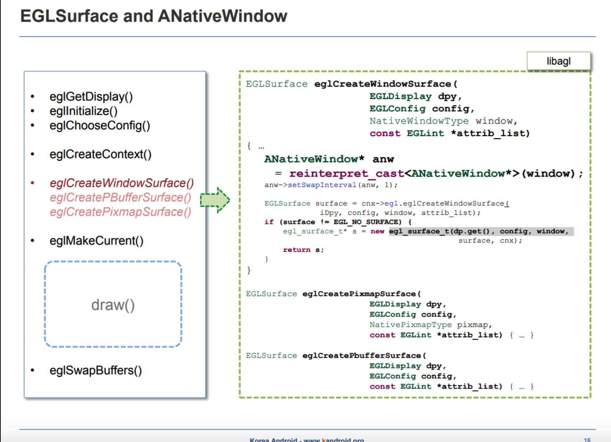
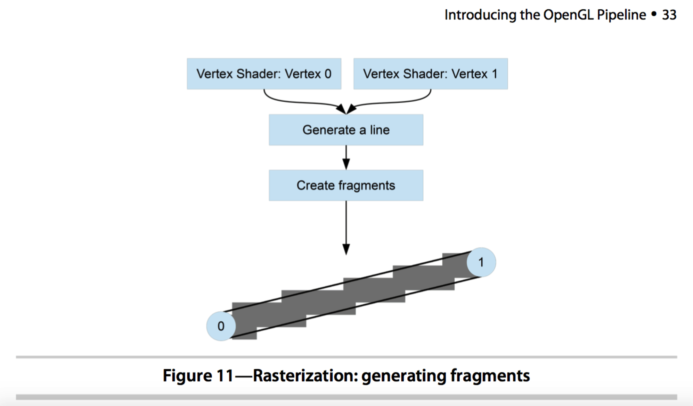
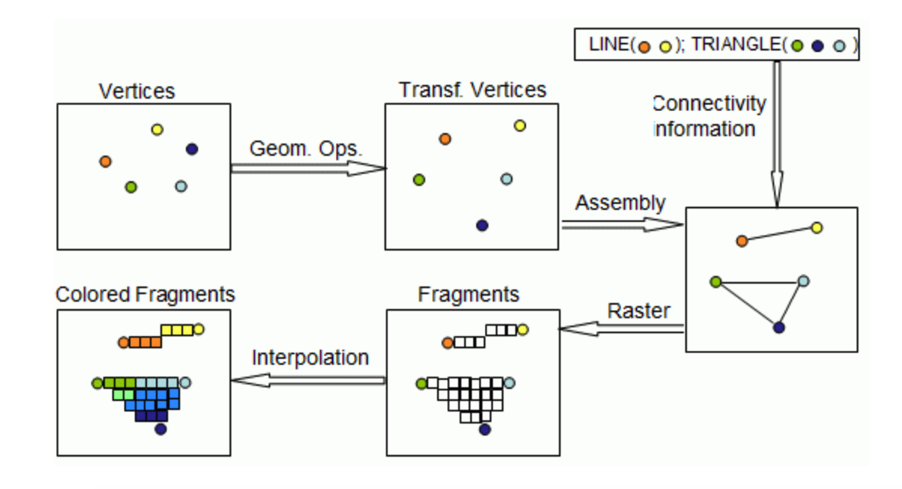
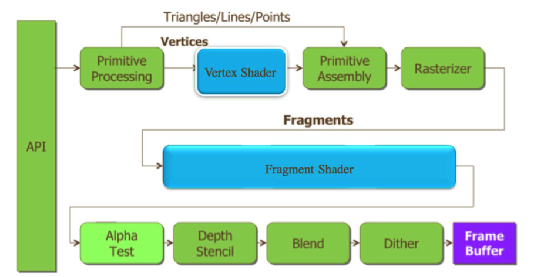

<h1 align="center">OpenGL SE</h1>

[toc]

## EGL简介

### 1. EGL概述

EGL 是 OpenGL ES 渲染 API 和本地窗口系统(native platform window system)之间的一个中间接口层，它主要由系统制造商实现。



EGL提供如下机制：

- 与设备的原生窗口系统通信
- 查询绘图表面的可用类型和配置
- 创建绘图表面
- 在OpenGL ES 和其他图形渲染API之间同步渲染
- 管理纹理贴图等渲染资源
- 为了让OpenGL ES能够绘制在当前设备上，我们需要EGL作为OpenGL ES与设备的桥梁。



### 2. 使用EGL绘图的基本步骤



Display(EGLDisplay) 是对实际显示设备的抽象。

Surface（EGLSurface）是对用来存储图像的内存区域。

FrameBuffer 的抽象，包括 Color Buffer， Stencil Buffer ，Depth Buffer。Context (EGLContext) 存储 OpenGL ES绘图的一些状态信息。

使用EGL的绘图的一般步骤：

```
1、获取 EGL Display 对象：eglGetDisplay()
2、初始化与 EGLDisplay 之间的连接：eglInitialize()
3、获取 EGLConfig 对象：eglChooseConfig()
4、创建 EGLContext 实例：eglCreateContext()
5、创建 EGLSurface 实例：eglCreateWindowSurface()
6、连接 EGLContext 和 EGLSurface：eglMakeCurrent()
7、使用 OpenGL ES API 绘制图形：gl_*()
8、切换 front buffer 和 back buffer 送显：eglSwapBuffer()
9、断开并释放与 EGLSurface 关联的 EGLContext 对象：eglRelease()
10、删除 EGLSurface 对象
11、删除 EGLContext 对象
12、终止与 EGLDisplay 之间的连接
```

标准 EGL 数据类型如下所示：

EGLBoolean —— EGL_TRUE =1, EGL_FALSE=0
EGLint —— int 数据类型
EGLDisplay —— 系统显示 ID 或句柄，可以理解为一个前端的显示窗口
EGLConfig —— Surface的EGL配置，可以理解为绘制目标framebuffer的配置属性
EGLSurface —— 系统窗口或 frame buffer 句柄 ，可以理解为一个后端的渲染目标窗口。
EGLContext —— OpenGL ES 图形上下文，它代表了OpenGL状态机；如果没有它，OpenGL指令就没有执行的环境。

下面几个类型比较复杂，通过例子可以更深入的理解。这里要说明的是这几个类型在不同平台其实现是不同的，EGL只提供抽象标准。

NativeDisplayType—— Native 系统显示类型，标识你所开发设备的物理屏幕

NativeWindowType —— Native 系统窗口缓存类型，标识系统窗口

NativePixmapType —— Native 系统 frame buffer，可以作为 Framebuffer 的系统图像（内存）数据类型，该类型只用于离屏渲染。

### 3. EGLSurface



EGLSurface 可以是由 EGL 分配的离屏缓冲区（称为“pbuffer”），或由操作系统分配的窗口。EGL 窗口 Surface 通过 eglCreateWindowSurface() 调用被创建。该调用将“窗口对象”作为参数，在 Android 上，该对象可以是 SurfaceView、SurfaceTexture、SurfaceHolder 或 Surface，所有这些对象下面都有一个 BufferQueue。当您进行此调用时，EGL 将创建一个新的 EGLSurface 对象，并将其连接到窗口对象的 BufferQueue 的生产方接口。此后，渲染到该 EGLSurface 会导致一个缓冲区离开队列、进行渲染，然后排队等待消耗方使用。（术语“窗口”表示预期用途，但请注意，输出内容不一定会显示在显示屏上。）

EGL 不提供锁定/解锁调用，而是由您发出绘制命令，然后调用 eglSwapBuffers() 来提交当前帧。方法名称来自传统的前后缓冲区交换，但实际实现可能会有很大的不同。

一个 Surface 一次只能与一个 EGLSurface 关联（您只能将一个生产方连接到一个 BufferQueue），但是如果您销毁该 EGLSurface，它将与该 BufferQueue 断开连接，并允许其他内容连接到该 BufferQueue。

通过更改“当前”EGLSurface，指定线程可在多个 EGLSurface 之间进行切换。一个 EGLSurface 一次只能在一个线程上处于当前状态。

关于 EGLSurface 最常见的一个错误理解就是假设它只是 Surface 的另一方面（如 SurfaceHolder）。它是一个相关但独立的概念。您可以在没有 Surface 作为支持的 EGLSurface 上绘制，也可以在没有 EGL 的情况下使用 Surface。EGLSurface 仅为 GLES 提供一个绘制的地方。

### 4. ANativeWindow

公开的 Surface 类以 Java 编程语言实现。C/C++ 中的同等项是 ANativeWindow 类，由 Android NDK 半公开。您可以使用 ANativeWindow_fromSurface() 调用从 Surface 获取 ANativeWindow。就像它的 Java 语言同等项一样，您可以对 ANativeWindow 进行锁定、在软件中进行渲染，以及解锁并发布。

要从原生代码创建 EGL 窗口 Surface，可将 EGLNativeWindowType 的实例传递到 eglCreateWindowSurface()。EGLNativeWindowType 是 ANativeWindow 的同义词，您可以自由地在它们之间转换。

基本的“原生窗口”类型只是封装 BufferQueue 的生产方，这一点并不足为奇。

### 5. EGLSurface与ANativeWindow之间的关系

OpenGL ES 定义了一个渲染图形的 API，但没有定义窗口系统。为了让 GLES 能够适合各种平台，GLES 将与知道如何通过操作系统创建和访问窗口的库结合使用。用于 Android 的库称为 EGL。如果要绘制纹理多边形，应使用 GLES 调用；如果要在屏幕上进行渲染，应使用 EGL 调用。

在使用 GLES 进行任何操作之前，需要创建一个 GL 上下文。在 EGL 中，这意味着要创建一个 EGLContext 和一个 EGLSurface。GLES 操作适用于当前上下文，该上下文通过线程局部存储访问，而不是作为参数进行传递。这意味着您必须注意渲染代码在哪个线程上执行，以及该线程上的当前上下文。

[OpenGL ES: (3) EGL、EGL绘图的基本步骤、EGLSurface、ANativeWindow - 夜行过客 - 博客园 (cnblogs.com)](https://www.cnblogs.com/yongdaimi/p/11244950.html)

## [EGL API详解 (转)](https://www.cnblogs.com/yongdaimi/p/11243544.html)

上一节我们初步学习了 OpenGL ES、EGL、GLSL 的相关概念,了解了它们的功能,以及它们之间的关联。我们知道了 EGL 是绘制 API(比如 OpenGL ES)与 底层平台窗口系统之间的接口,用于与手机设备打交道,比如获取绘制 buffer。 而 OpenGL ES 与 GLSL 的主要功能,就是往这块 buffer 上绘制图片。由于绘制的第一步就是获取绘制 buffer,而这完全通过 EGL 来实现的,那么这一节,我们来仔细研究一下,EGL 是如何跟手机产生关联,并如何从手机那里获取一块 buffer 用于绘制。

 

**EGL API 总览**

上一节,我们提到 OpenGL ES 其实是一个图形学库,由 109 个 API 组成,只要明白了这 109 个 API 的意义和用途,就掌握了 OpenGL ES。

这个道理在 EGL 上也同样适用。EGL 包含了 34 个 API。

 

首先,有 7 个 API,用于与手机关联并获取手机支持的配置信息。我们知道现在手机种类是各种各样,从操作系统来说,有 iOS、Android 等。同是 Android 手机,手机品牌和型号也是各种各样。当然我们不排除有两款手机,只是外形不同,而内部却完全一样,但是总的来说,大部分手机与手机的内部,还是存在着一定的区别的。所以,当我们使用 EGL 与某款手机硬件进行关联的时候,首先要做的,就是查看一下这款手机支持什么样的配置信息。而所谓的配置信息,就是手机支持多少种格式的绘制 buffer,每种格式对应着的 RGBA 是如何划分的,以及是否支持 depth、stencil 等。关于 RGBA 的格式,等我们在讲纹理图片的时候 再详细进行说明。而关于 depth、stencil,我们也将在讲 OpenGL ES 相应 API 的时 候进行解释说明。

 

然后,有 16 个 API,用于根据需要生成手机支持的 surface 和 context,对 surface 和 context 进行关联,并将 surface 对应的绘制 buffer 显示到手机屏幕上。 当我们知道了手机支持什么样格式的绘制 buffer 之后,就要根据我们所写的图形程序的需要,去对这些格式进行筛选,找到一个能满足我们需求,且手机支持的格式,然后通过 EGL 生成一块该格式的绘制 buffer。生成绘制 buffer 的过程,其实是我们通过 API 生成一块 surface,surface 是一个抽象概念,但是这个 surface 包含了绘制 buffer,假如我们所选择的格式是支持 RGBA、depth、stencil 的。那 么 surface 对应的绘制 buffer 有一块 Color buffer,到时候会用于保存图片的颜色信息,保存的方式在上一节我们做过介绍,就是 buffer 会对应上百万个像素点, 每个像素点有自己的颜色值,将这些颜色值按照像素点的顺序保存在 color buffer 中,就形成了一张完整的 color buffer。绘制 buffer 还有一块 depth buffer,depth buffer 也按照同样的方法,按照顺序保存了所有像素点的 depth 值;以及一块 stencil buffer,同理可知,stencil buffer 也是按照顺序保存了所有像素点的 stencil 值。

EGL 还会根据格式生成一块 context,context 也是一块 buffer。我们知道 OpenGL ES 是状态集,那么在绘制中会牵扯到各种各样的状态,这些状态全部都有默认值,可以通过 OpenGL ES 对这些状态进行改变。这些状态值就会保存在 context 中。比如 OpenGL ES 所用到的混合模式、纹理图片、program 还有各种 BO 等信息。

当然 EGL 可以创建多个 surface 和 context,每个 surface 在创建的时候就是 包含了对应的绘制 buffer,每个 context 创建的时候内部都是默认值。然后我们可以根据自己的需要选择启动任意一套 surface 和 context,然后对选中的 surface 和 context 进行操作。一个进程同一时间只能启动有相同格式的一块 surface 和一块对应于 OpenGL ES 的 context,一块 context 同时也只能被一个进程启动。

 

之后,有 3 个 API,用于指定使用哪个版本的 OpenGL ES,并与 OpenGL ES 建立关联。由于 EGL 生成的绘制 buffer 终归还是要提供给 OpenGL ES 使用,所以, 需要通过 EGL 来指定使用哪个版本的 OpenGL ES。

OpenGL ES 发展到现在已经有了好几个版本,从最早的 1.1 版本(在 1.1 中 使用的还是固定管线,还不存在 shader 的概念),到现在最普遍的 2.0 版本(2.0 版本中将 OpenGL ES 发展为上一节我们详细介绍的管线,加入了可编程模块 shader),以及目前市面上很多手机已经支持的 3.0 和 3.1 版本(shader 依然存在, 只是变的更加复杂)。所以在 EGL 中需要指定使用哪个版本的 OpenGL ES。

 

再之后,有 6 个 API,用于操作 EGL 上纹理,以及与多线程相关的高级功能。 纹理图片,又称纹理贴图,一般都是在 OpenGL ES 中,当顶点已经固定,具体形状已经成型的时候,将其贴上去,把虚拟的形状变成一个可以看见的物体。比如我们用 OpenGL ES 绘制,用顶点坐标勾勒出一个球形,然后把世界地图作为纹理贴上去,那么这个球看上去就变成了地球。所以按照理解纹理应该就是在绘制的时候进行使用,但是在 EGL 中偶尔也会使用到。

EGL 是用于在手机中生成绘制 buffer 提供给 OpenGL ES 进行绘制的,那么有时候也会设计到多线程操作,每个 thread 可以拥有自己的 surface 和 context,但是也要满足刚才我们所说的限制。一个 thread 同一时间只能启动有相同格式的 一块 surface 和一块对应于 OpenGL ES 的 context,一块 context 同时也只能被一 个 thread 启动。

 

最后还有 2 个 API,分别是用于初始化某个版本的 EGL,以及检测在执行上述 EGL API 的时候是否产生错误和产生了什么错误。

这些 API 有一些属于基本 API,就是在任何手机图形程序中都会使用到的 API, 这一届会把这一部分的 API 做详细介绍。剩下一些属于进阶版的 API,由于我们 这几节课主要还是为了讲解 OpenGL ES,那些进阶版的 API 会放到后面的课程进行补充学习。

 

**EGL API 详解**

**EGLint eglGetError(void);**

当我们调用 EGL 的 API 的时候,大部分 API 可以通过返回值判断这个 API 执 行的成功还是失败。比如当返回值的类型是 EGLBoolean 的时候,返回 EGL_TRUE 代表着成功,而 EGL_FALSE 代表着失败。而比如当创建 context 的时候,返回一个正常的 context 代表着成功,返回 EGL_NO_CONTEXT 则代表着失败。但是,当失败的时候,可能我们还需要更详细的信息,来判断为什么失败,是传入参数有误,还是发生了别的冲突之类的情况。所以我们需要 eglGetError 这个函数,它的功能是用于返回当前 thread 如果 EGL 的 API 出错的话,最近一个错误所对应的错误代码。

这个函数的输入为空。因为这个 API 是针对目前结果进行判断的,所以不需要任何输入。其实在 GPU driver 中,当执行 EGL API 的时候,如果出错了,会将错误代码写在寄存器中,然后通过这个函数直接去到寄存器去取即可,所以不需要任何输入。

这个函数的输出是可以用来判断详细错误信息的错误代码。比如当返回 EGL_SUCCESS 的时候,说明截至到目前为止,所有的 EGL API 都运行正常,没有出错。除此之外还有 15 个错误代码,标志着 15 种错误情况,这 15 种情况等我们说到对应 API 的时候再进行具体的解释说明。

有一种特殊情况,假如在调用这个 API 之前,出现过不止一次错误,那么调用这个 API 获取的将是最近一次错误的错误代码,并将该错误代码的标记重置。然后再调用一次,获取的将是倒数第二次错误的错误代码,以此类推,直至所有被标记的错误代码全部被重置后,再调用这个 API,则返回EGL_SUCCESS。

 

**EGLDisplay eglGetDisplay(EGLNativeDisplayType display_id);**

这个函数的功能是用于从 EGL 运行的操作系统中获取一个 Display 的 handle。

这个函数的输入是 display_id,这个 display_id 我们可以看作是从操作系统中得知的 Display 的 ID。假如一个手机是由多个显示屏,那么不同的 ID 可能就会对应于不同的屏幕,而究竟哪个屏幕对应哪个 ID,我们需要从操作系统中得知, 然后将它传给这个函数。并且由于 EGL 可以运行在多种操作系统上,所以针对不同的操作系统,这里的输入值 display_id 的格式也不同。

但无论是任何操作系统,如果 display_id 为 EGL_DEFAULT_DISPLAY,会得到一个默认的 Display。

这个函数的输出是用于显示图片绘制的 Display 的 handle。绝大多数 EGL 的 API 都会与这个 Display 的 handle 有关,所有 EGL 相关的对象,比如 surface、context 等,都与这个值有关,且存在于这个 display 的命名空间中。大多数情况下,这 个 display 对应着一块物理的屏幕。

另外,无论调用这个函数多少次,只要 display_id 不变,那么返回值就不变, 如果没有一个 Display 是对应这个 display_id 的,那么就会返回 EGL_NO_DISPLAY,不报任何错误。

 

**EGLBoolean eglInitialize(EGLDisplay dpy, EGLint \*major, EGLint \*minor);**

这个函数的功能是用于针对某 display 初始化某版本的 EGL。

这个函数输入的第一个参数是 EGLDisplay,我们刚才已经说了,EGL 的绝大 多数 API都会与这个 Display 的 handle 相关,EGL 所有的对象,都存在于这个 display 的命名空间中。所以我们需要针对这个 display,对 EGL 进行初始化,初始化的时候还需要指定 EGL 的版本。因为发展到现在 EGL 也是存在很多版本,目前使用的比较多的是 EGL1.4 版本。所以这个函数的第二个和第三个参数,也就是用于指定 EGL 的版本号,其中 major 对应着大号码,minor 对应着小号码,所以 1.4 在 这里,major 是 1,minor 是 4。而当 major 和 minor 为 NULL 的时候,则不对 EGL 进行初始化。

这个函数的输出是对 EGL 初始化的结果,当 EGL 初始化成功的时候,返回 EGL_TRUE。失败的话返回 EGL_FALSE。我们刚才在说 API eglGetError 的时候,就说了,成功的情况只有一个,但是错误的情况却千千万,仅靠一个返回值 EGL_FALSE 是无法判断失败在哪里了。所以我们还需要借用 eglGetError 这个 API 来抓取错误代码,进行判断。假如这个函数返回 EGL_FALSE 的时候,我们调用 eglGetError 来看下错误代码,假如获取的错误代码是 EGL_BAD_DISPLAY,则说明第一个输入参数 dpy 并非一个合法的 EGLDisplay;假如获取的错误代码是 EGL_NOT_INITIALIZED,则说明虽然 dpy 是合法的 EGLDisplay,但是依然无法针对 其初始化 EGL。

另外,可以针对一个已经初始化 EGL 过的 display 重新进行初始化,唯一的 结果就是返回 EGL_TRUE,并且更新 EGL 的版本号。一个在某个 thread 已经初始 化 EGL 过的 display,可以直接使用在另外一个 thread 中,无需再进行初始化。

 

**EGLBoolean eglGetConfigs(EGLDisplay dpy, EGLConfig \*configs, EGLint config_size, EGLint \*num_config);**

这个函数的功能是用于获取某 display 支持的配置信息。刚才已经介绍过, 不同的手机支持的配置信息可能是不同的。假如一个手机具备两个屏幕,那么这两个屏幕分别对应于两个 display,这两个 display 支持的配置信息可能也是不同的。那么在这里,我们就以 display 为单位,查询这个 display 支持的配置信息。

这个函数输入的第一个参数是 EGLDisplay。用于查看特定 Display 的配置信息。第二个参数是一个指针,一般会被预留一定的空间,内部为空,在调用这个 API 的时候,将 display 支持的配置信息存储在这个指针中,这个参数与第三个参数相关。第三个参数是我们想要获取的手机配置信息的最大个数,假如 display 支持 50 种配置信息,而我们只想要 20 个,那么第三个参数传入 20,则第二个参数中的指针只会保存 20 个配置信息的内容,如果 display 支持 50 个配置信息, 但是我们想要 100 个,那么第三个参数传入 100,第二个参数中的指针还是只会保存 50 个配置信息的内容。第四个参数是 display 支持配置信息的个数,一般会传入一个变量的地址,然后将配置信息的个数写在变量中。所以虽然看上去是 4 个输入参数,其实应该是两个输入参数,两个输出参数,第一和第三位输入参数, 第二和第四个参数经过这个 API,把 display 对应的配置信息,get 出来了。

这个函数的输出是获取配置信息的结果,当成功的时候,返回 EGL_TRUE。 失败的话返回 EGL_FALSE。比如,当输入参数 dpy 是一个合法的 EGLDisplay,但是这个 display 并没有通过 eglInitialize 被初始化的时候,返回 EGL_FALSE,通过 eglGetError 获取的错误代码为 EGL_NOT_INITIALIZED。如果第四个参数传入的不是一个变量的地址,而是 NULL,那么,返回 EGL_FALSE,通过 eglGetError 获取的错误代码为 EGL_BAD_PARAMETER。

另外,如果第二个参数传入的不是一个指针,而是 NULL,那么就不会有配置信息返回,不过第四个参数依然会返回 display 支持的配置信息的数量。

 

**EGLBoolean eglChooseConfig(EGLDisplay dpy, const EGLint \*attrib_list, EGLConfig \*configs, EGLint config_size, EGLint \*num_config);**

这个函数的功能是用于获取与需求匹配,且某 display 支持的配置信息。刚才已经介绍过如何获取 display 支持的配置信息,那么 display 可能支持多种配置信息,但我们在写程序的时候,其实只需要选择一种与我们所写的图形程序匹配的即可。那么我们会制定一个需求,这个需求写在一个指针中,以 key-value 对的形式存在,key 是 EGLConfig 的属性,比如 EGL_RED_SIZE,代表所需要配置信息中红色分量的尺寸,EGL_STENCIL_SIZE,代表所需要配置信息中 stencil 分量 的尺寸, EGL_RENDERABLE_TYPE,代表所需要配置信息中的绘制 API 类型。value 就是这些 key 所对应的我们所需要的值。这里的需求信息并非需要把 EGLConfig的属性完全定义一遍,只需要定义一些我们需要的信息,然后通过 eglChooseConfig 这个 API,会遍历该 display 所支持的所有配置信息,然后获取到所有与需求信息匹配,且 display 支持的配置信息。

这个函数输入的第一个参数是 EGLDisplay。用于查看特定 Display 的配置信息。第二个参数是一个保存了需求信息的指针,指针中已经定义好了需求。第三个参数是一个指针,一般会被预留一定的空间,内部为空,然后用于在这个 API 中,将与需求信息符合,且 display 支持的配置信息存储在这个指针中,这个参数与第四个参数相关。第四个参数是我们想要获取的匹配配置信息的最大个数, 假如 display 中匹配配置信息有 50 个,而我们只想要 20 个,那么第四个参数传入 20,第三个参数中的指针只会保存 20 个配置信息的内容,如果 display 中匹配配置信息有 50 个,但是我们想要 100 个,那么第四个参数传入 100,第三个参数中的指针还是只会保存 50 个配置信息的内容。第五个参数是 display 匹配配置信息的个数,一般会传入一个变量的地址,然后将匹配配置信息的个数写在变量中。所以虽然看上去是五个输入参数,其实应该是三个输入参数,两个输出参数, 第一和第二和第四位输入参数,第三和第五个参数经过这个 API,把 display 匹配的配置信息,get 出来了。

这个函数的输出是获取配置信息的结果,当成功的时候,返回 EGL_TRUE。 失败的话返回 EGL_FALSE。比如,当第二个输入参数,在制定需求的时候,使用到了一个非法的 EGLConfig 的属性,或者某个 EGLConfig 属性对应的 value 不识别或者超出了范围,那么在执行了这个 API 之后,返回 EGL_FALSE,通过 eglGetError 获取的错误代码为 EGL_BAD_ATTRIBUTE 。

另外,在定义第二个参数,书写需求的时候,EGLConfig 的属性与 value 应该 一一对应,然后在结尾的地方写上 EGL_NONE。如果在需求中,没有定义到某个 EGLConfig 属性,那么就按照默认值处理。如果在需求中,针对某个 EGLConfig 属 性,对应的 value 为 EGL_DONT_CARE,则在匹配 display 配置信息的时候忽略这个属性,EGL_DONT_CARE 这个值可以制定给任何属性,除了 EGL_LEVEL。

如果第二个参数传入的不是一个指针,而是 NULL,或者第二个参数的第一个值就是 EGL_NONE,那么就按照 EGLConfig 默认的标准对配置信息进行选择和排序。

我们来简单的介绍一下这个默认的标准,刚才我们介绍了,如果在需求中, 没有定义到某个 EGLConfi 属性,那么就按照默认值处理。比如假如我们没有在需求中定义 EGL_RED_SIZE,那么其实相当于我们需求的 EGL_RED_SIZE 为 0,然后在手机的配置信息中,我们会过滤出所有 EGL_RED_SIZE 大于等于 0 的配置信息,依此类推,当所有的属性都过滤完毕之后,如果没有配置信息满足要求,那么依然返回 EGL_TRUE,但是最后一个参数将返回 0。如果超过一条配置信息满足要求,那么我们需要对这些配置信息进行排序, 由于配置信息有很多属性,我们会按照属性来对配置信息进行排序,且属性与属性之间也是有优先级的,优先级最高的是属性 EGL_CONFIG_CAVEAT,但是由于这个属性默认值为 EGL_DONT_CARE,那么我们除非特别需求,否则就会跳过这个属性。假如我们对这个属性进行特殊需求,比如在需求中定义这个属性对应的 value 为 NULL,那么就会对手机配置信息中的这个属性进行排序,排序的顺序 是 EGL_NONE、EGL_SLOW_CONFIG, EGL_NON_CONFORMANT_CONFIG。优先级第二的属性是 EGL_COLOR_BUFFER_TYPE,在这里我们就不对这些属性的默认值、 优先级、排序方式进行一一说明了。

 

**EGLBoolean eglBindAPI(EGLenum api);**

这个函数的功能是设置当前 thread 的绘制 API,后面创建的 surface 和 context 要与这个 API 相匹配。

这个函数输入的参数是绘制 API。比如 EGL_OPENGL_API、EGL_OPENGL_ES_API, 或者 EGL_OPENVG_API。需要注意的是,从这里开始 OpenGL 的 API 与 OpenGL ES 的 api 将开始分离,OpenGL 的 API 主要用于 PC 端的绘制,OpenGL ES 的 API 主 要用于移动端的绘制,所以在这里,我们一般是传入 EGL_OPENGL_ES_API 这个参数。OpenVG 是另外一种绘制 API,在这里我们用不到,也就不进行详细的描述。

这个函数如果成功,则返回 EGL_TRUE。如果失败,则返回 EGL_FALSE 。 我们可以通过错误代码判断失败的原因。假如传入参数不是刚才我们所介绍的三种 API,或者设备不支持我们传入的参数 API,那么错误代码为 EGL_BAD_PARAMETER。

 

**EGLSurface eglCreateWindowSurface(EGLDisplay dpy, EGLConfig config, EGLNativeWindowType win, const EGLint \*attrib_list);**

这个函数的功能是用于根据需求,创建一个 on-Screen 的 rendering surface, 可以提供给绘制 API,比如 OpenGL ES 进行绘制。surface 一共有三种,这个只是其中的一种,另外还有两种分别是通过 eglCreatePbufferSurface 以 及 eglCreatePixmapSurface 来创建。我们对这三种 surface 进行一下对比。EGL 和 OpenGL ES 支持两种绘制模式,back buffer 和 single buffer,windows surface 和 pbuffersurface 都是使用的 back buffer,顾名思义,也就是一块显存(GPU)中的 buffer,当绘制完毕的时候,由于 windows surface 于 window 有关联,那么可以使用 eglswapbuffer 将其转移到 window 上进行显示。而 pbuffer 于 window 没有关联,也就无法显示。而 pixmapsurface 是使用的 single buffer,single buffer 可以看作是保存在系统内存中的位图,OpenGL ES 不支持将其转移到 windows 进行显示,所以 pixmapsurface 也是不可显示的。

由于另外两种 surface 都是不可显示的 surface,且使用的比较少,这里也就不具体介绍它们的创建函数。

这个函数输入的第一个参数是 EGLDisplay。用于指定一个特定的 Display 进行 surface 创建。第二个参数是用于创建 surface 的配置信息,一般我们会把 eglChooseConfig 得到的已经匹配好的配置信息传入,刚才我们也已经知道了,匹配好的配置信息可能有很多个,不过它们已经排好序,那么我们就可以直接取第一个作为这里的输入参数。第三个参数是一个平台相关的参数,是 native window 的 handle。第四个参数,类似于 eglChooseConfig 的第二个参数,是需求信息, 格式也类似,都是 key-value 对,刚才的 key 是 EGLConfig 的属性,这里的 key 是 EGL_RENDER_BUFFER 等属性,它也是提供了一个接口,可以给一些特殊的平台创建 surface 的时候规定一些特殊的属性,类似 EGL extension。这里我们拿一个属性进行解释,比如 EGL_RENDER_BUFFER,它就定义了绘制 API 绘制的时候应该会绘制到哪个 buffer 中,可以绘制到 single buffer,也可以绘制到 back buffer, 我们已经知道了 windowsurface 创建的是 backbuffer,那么如果绘制到 single buffer,则相当于直接绘制到屏幕上,如果绘制到 back buffer,那么就会先绘制到 back buffer,再通过 eglswapbuffer 转移到屏幕上。

这个参数也可以直接写成 NULL,或者第一个值就是 EGL_NONE,那么所有的属性对应的 value 就按照默认值处理,比如 EGL_RENDER_BUFFER 的默认值为 back buffer。

这个函数如果成功,则输出是创建的 rendering surface 的 handle。如果失败, 则返回 EGL_NO_SURFACE。同样的,我们也可以通过错误代码判断失败的原因。 假如是第三个参数 native window 的 handle 与第二个参数 display 的配置信息 EGLConfig 不匹配,那么错误代码为 EGL_BAD_MATCH。 如果第二个参数,在配置信息中显示不支持绘制到 window,也就是在配置信息的属性 EGL_SURFACE_TYPE 中不包含 EGL_WINDOW_BIT 这一位的时候,当然默认这个属性是包含这一位的。错误代码也是 EGL_BAD_MATCH。

如果第二个参数,我们需求中的 color 和 alpha 信息与第四个参数我们额外的需求不匹配,错误代码也是 EGL_BAD_MATCH。这种情况确实很有可能发生, 比如我们在 eglChooseConfig 的时候没有强调使用什么样子的 color 或 alpha 信息, 然后根据手机自动匹配,可能匹配一个普通的 color 和 alpha 信息,但是我们在 这个 API 中又通过第四个参数增加了对 color 和 alpha 的需求,那么很有可能就不匹配,也就出现了这种错误。

其他的,如果第二个参数 EGLConfig 不是一个合法的 config,那么错误代码 EGL_BAD_CONFIG。

如果第三个参数 win 不是一个合法的 native window 的 handle,那么错误代 码 EGL_BAD_NATIVE_WINDOW。

如果已经使用第三个参数的 win 创建过一个 windowsurface,或者是其他的任何情况导致在创建 windowsurface 的时候分配资源失败,那么错误代码 EGL_BAD_ALLOC。

 

**EGLContext eglCreateContext(EGLDisplay dpy, EGLConfig config, EGLContext share_context, const EGLint \*attrib_list);**

这个函数的功能是用于根据需求,针对当前的绘制 API 创建一个 rendering context。

rendering surface 需要与 rendering context 进行搭配使用的,我们知道 context 中是可以保存 OpenGL ES 状态集信息的,所以如果一对 surface 和 context 兼容, 那么 context 就可以使用自己内部保存的信息往 rendering surface 上进行绘制。

通过这个 API 可以在 context 中针对绘制 API 初始化一套状态集。

这个函数输入的第一个参数是 EGLDisplay。用于针对哪个 Display 进行 context 的创建。第二个参数是用于创建 context 的配置信息,一般我们会把 eglChooseConfig 得到的已经匹配好的配置信息传入,和创建 surface 的时候类似, 匹配好的配置信息可能有很多个,不过它们已经排好序,那么我们一般会直接取第一个作为这里的输入参数。第三个参数可以是另外一个 context 的 handle,那么新创建的 context 就可以与该 context 共享所有可以共享的数据,如果该 context 之前已经与其他 context 进行了共享,那么它们三个或者多个之间,都可以进行共享,在 OpenGL ES 对应的 Context 之间,共享的东西可以有纹理、program 和 BO 等信息。如果第三个参数为 NULL,那么该 context 暂时不与其他 context 共享。 第四个参数,类似于 eglCreateWindowSurface 的第四个参数,是需求信息,格式也类似,都是 key-value 对,这里的 key 只有一个,就是 EGL_CONTEXT_CLIENT_VERSION 属性,该属性只针对 OpenGL ES API 对应的 context 有效,也就是用于指定该 context 是针对 OpenGL ES 的哪个版本。如果 value 为 1, 则针对 OpenGL ES 1.x 版本,如果 value 为 2,则针对 OpenGL ES 2.x 版本,如果 value 为 3,则针对 OpenGL ES 3.x 版本。这个参数也可以直接写成 NULL,或者第一个值就是 EGL_NONE,那么属性对应的 value 就按照默认值处理,而 EGL_CONTEXT_CLIENT_VERSION 的默认值为 1。

这个函数如果成功,则输出是创建的 rendering context 的 handle。如果失败, 则返回 EGL_NO_CONTEXT 。同样的,我们也可以通过错误代码判断失败的原因。 假如当前绘制 API 为 EGL_NONE 的时候,也就是当前设备不支持 OpenGL ES,且没有设置当前的绘制 API 的时候,错误代码为 EGL_BAD_MATCH。 如果第二个参数,不是一个合法的 EGLConfig,或者不支持参数四指定的具体版本的绘制 API,则错误代码为 EGL_BAD_CONFIG。这种情况确实很有可能发生,比如我们在 eglChooseConfig 的时候没有强调使用什么样子的 EGL_RENDERABLE_TYPE,那么默认为 EGL_OPENGL_ES_BIT,但是参数四指定了具体的版本,也就是如果参数四指定的是 1,那么在 config 中 EGL_RENDERABLE_TYPE 需要是 EGL_OPENGL_ES_BIT;如果参数四指定的是 2,那么在 config 中 EGL_RENDERABLE_TYPE 需要是 EGL_OPENGL_ES2_BIT;如果参数四指定的是 3,那么在 config 中 EGL_RENDERABLE_TYPE 需要是 EGL_OPENGL_ES3_BIT。 假如第三个参数 share context,不是 NULL ,而是一个合法的但与当前绘制 API不匹配的 context,错误代码为 EGL_BAD_CONTEXT。

如果第三个参数制定的 share_context 是针对另外一个 display 的话,那么错误代码为 EGL_BAD_MATCH。

如果没有足够的资源用于生成这个 context,那么错误代码为EGL_BAD_ALLOC。

 

**EGLBoolean eglMakeCurrent(EGLDisplay dpy, EGLSurface draw, EGLSurface read, EGLContext ctx);**

这个函数的功能是用于 enable surface 和 context,也就是将一个指定的 context绑定到当前的绘制thread上,与读、写的surface关联上。make current 之后,就可以调用 OpenGL ES 的 API 对 context 中的状态集进行设定,然后进而往 surface 中绘制内容,再从 surface 中把内容读取出来。

总结一下,一个 native window handle 只能创建一个 rendering surface,而一个 display 可以创建多个 rendering surface。context 与 native window 无关,也就是 display 可以创建多个 context,每个 context 对应一种绘制 API,只要 surface 和 context 的格式匹配,两者就可以进行关联,但是同一时间,一个 surface 只能 和一个 context 进行关联,一个 thread 中,一种绘制 API 也只能有一个 context。

这个函数输入的第一个参数是 EGLDisplay。用于指定操作特定的 Display。第二个参数是一个 surface,该 surface 用于写入以及其他除了读取和复制之外的所有操作。第三个参数也是一个 surface,该 surface 用于读取和复制。需要注意的是第二个参数和第三个参数可以是同一个参数,一般我们也会将它们设置为同一个参数。第四个参数就是传入我们将会 enable 的 context,如果当前 thread 已经有了一个相同绘制 API 的 context,那么之前的这个 context 就会先进行 flush 操 作,把未执行的命令全部执行完毕,然后将其设置为 disable 状态,再把新传入的 context 设置为 enable 状态。

这个函数如果成功,则返回 EGL_TRUE。如果失败,则返回 EGL_FALSE。同样的,我们也可以通过错误代码判断失败的原因。

假如第一个参数 dpy 不是一个合法的 EGLDisplay handle,那么错误代码EGL_BAD_DISPLAY。

假如第二个或者第三个参数的 surface 与 context 不匹配的话,错误代码为EGL_BAD_MATCH。

假如第二个、第三个、第四个参数的 surface 和 context 中的其中一个目前被别的 thread 使用,那么错误代码为 EGL_BAD_ACCESS。

假如第二个或者第三个参数的 surface 不是合法的 surface,那么错误代码为EGL_BAD_SURFACE。

如果第四个参数 ctx 不是一个合法的 context,那么错误代码为EGL_BAD_CONTEXT。

假如第二个或者第三个参数的 surface 对应的 windows 不再合法,那么错误代码为 EGL_BAD_NATIVE_WINDOW。

假如第二个或者第三个参数的 surface 不匹配,则错误代码 EGL_BAD_MATCH。

假如当前 thread 目前针对该绘制 API 已经有 context,且该 context 存在未 flush的命令,而且旧的 surface 又突然变成不合法的了,那么错误代码 EGL_BAD_CURRENT_SURFACE。

第二个或者第三个参数的 surface 在 context 需要的时候,会分配 buffer,但是假如无法针对这个 API 再分配 buffer 了,则错误代码 EGL_BAD_ALLOC。一旦分配成功,这个 buffer 会一直伴随着 surface,直到 surface 被删除。

假如这个 API 调用成功,但是之后,draw surface 被破坏掉了,那么剩下的绘制命令还是会执行,context 的内容依然会被更新,但是写入 surface 的内容会变成未定义。

假如这个 API 调用成功,但是之后,read surface 被破坏掉了,那么读取的数据(比如使用 glReadPixel 读取)为未定义。

如果想要释放当前的 context,也就是将当前的 context disable,那么将第二个和第三个参数设置为 EGL_NO_SURFACE,第四个参数设置为 EGL_NO_CONTEXT 即可。设置完之后原本 context 中未运行的绘制 API 会被 flush,然后将 context 设置为 disable。在运行这种情况的时候,第一个参数 dpy 可以被传入一个未初 始化的 display,而除了这种情况,假如 dpy 传入一个合法的,但是未初始化的 display,错误代码为 EGL_NOT_INITIALIZED。

如果 context 为 EGL_NO_CONTEXT,但是 surface 不是 EGL_NO_SURFACE。或者 surface 是 EGL_NO_SURFACE,而 context 不是 EGL_NO_CONTEXT,那么错误代 码 EGL_BAD_MATCH。

OpenGL ES 中有一个概念叫做视口,视口会有一个视口大小的,这个视口大小是用于表示在一定尺寸的绘制 buffer 中,有多大一块空间会被显示出来。当这个 API 运行成功,且 current context 是针对 OpenGL ES 的 API 的时候,这个视口大小和裁剪大小都会被设置为 surface 的尺寸。关于视口和裁剪,我们会在下面讲 OpenGL ES API 的时候进行详细说明,这里只要知道 makecurrent 之后,由于 surface 对应 windows,那么 surface 从 window 获取到尺寸,然后再被 context 得到,作为 OpenGL ES 绘制的某个值的初始状态。

 

**EGLBoolean eglSwapBuffers(EGLDisplay dpy, EGLSurface surface);**

当 OpenGL ES 把内容绘制到 surface 上之后,可以通过这个函数,把 surface 中 color buffer 的内容显示出来。我们还记得 surface 中可能有 color buffer、depth buffer、stencil buffer,而被展示的只是 color buffer。也就是通过这个函数,让我们看到了手机上不停变换显示的图片。

这个函数输入的第一个参数是 EGLDisplay。用于指定特定的 display 进行显示。第二个参数是一个 surface,就是指定显示特定的 surface 中的内容。

这个函数如果成功,则返回 EGL_TRUE。如果失败,则返回 EGL_FALSE。

假如这个 surface 的属性 EGL_SWAP_BEHAVIOR 不是 EGL_BUFFER_PRESERVED, 那么 surface 中 color buffer 的内容为未定义。

 

**EGLBoolean eglTerminate(EGLDisplay dpy);**

这个函数的功能是用于将特定 display 对应的 EGL 相关的资源释放,比如与 这个 display 关联的 surface、context 等。如果某个 surface 和 context 在被释放的时候,依然被使用着,那么它们并没有被真正的释放掉。如果继续使用它们用于 OpenGL ES 绘制的话,并不会导致程序瘫痪,而只会使得绘制结果不确定,并且绘制命令出错。只有当使用 API eglReleaseThread,把整个 thread 释放掉,或者使用 eglMakeCurrent 把该 surface 和 context 设置为非当前使用的资源,它们才会被真正的释放掉。

当调用了 API eglTerminate 之后,surface 和 context 等会变成 invalid,如果在eglTerminate 之后,通过其他的 EGL API 再继续使用这些资源,会得到错误代码 EGL_BAD_SURFACE 或者 EGL_BAD_CONTEXT。

这个 API 与 eglInitialize 相对应。

这个函数输入的第一个参数是 EGLDisplay。用于特定释放哪个 Display 对应的资源。

这个函数的输出是资源释放的结果,当成功的时候,返回 EGL_TRUE。失败的话返回 EGL_FALSE。比如,当输入参数 dpy 不是一个合法的 EGLDisplay 的时候, 返回 EGL_FALSE,通过 eglGetError 获取的错误代码为 EGL_BAD_DISPLAY 。

如果一个 display 已经被 terminate 了,或者尚未 init。那么它本身其实并没有相对应的 EGL 的相关资源,这个时候对这个 display 进行 terminate 其实并没有意义,虽然是被允许的,但是唯一的结果就是会返回 EGL_TRUE。

如果一个 display 已经被 terminate 了,这个时候可以对它进行 re-init,只是 re-init 之后,那些已经被标记为删除的资源不变,依然保持标记为删除,使用 它们仍然是不合法的。

总结一下,一个 display 随时随地可以被初始化或者终止。而所有的 display 都是起始于终止状态。当调用了 eglInitialize,且成功之后,display 会变成初始成功;调用了 eglTerminate,且成功之后,display 就变成终止状态。

在 display 处 于 终 止 状 态 , 只 有 eglMakeCurrent 和 eglReleaseThread , eglInitialize 和 eglTerminate 这 4 个 EGL 的 API 还可以被正常工作,而前两个 API 是用于进一步的清除这些资源。而除了这 4 个 api,如果再调用任何其他 api,虽然 display 本身还是 valid,但是这个时候它已经被终止了,那么会产生错误代码 EGL_NOT_INITIALIZED。

 

**EGL API 总结**

EGL 的 API 还有很多,这一节只是把其中最重要也是最常用的 11 个 API 拿出来进行了讲解,最后总结一下 EGL 使用的大概流程如下:

先获取 display 的 handle,对 display 进行 EGL 初始化。从设备上获取匹配的配置信息,再绑定一个绘制 API 用于之后的绘制。根据获取 display 的 handle、 配置信息以及当前绘制 API 生成 surface 和 context,再把它们绑定在一起,绑定在当前 thread 上,下面就可以使用绘制 API 进行绘制。绘制完成之后,可以把绘制的 surface 中的 color buffer 拿出来显示。最后,记得把 display 上 EGL 相关资源进行释放。

除此之外还有很多重要的 API,比如和配置信息相关的 eglGetConfigAttrib, 用于获取配置信息中具体属性对应的值。比如对 surface 和 context 用完之后的删除 API eglDestroySurface 和 eglDestroyContext 等。

这些内容等我们以后讲 EGL 补充学习的时候再进行详细说明。

[OpenGL ES: (4) EGL API详解 (转) - 夜行过客 - 博客园 (cnblogs.com)](https://www.cnblogs.com/yongdaimi/p/11243544.html)

## [OpenGL的基本概念、OpenGL ES 在屏幕产生图片的过程、OpenGL管线(pipeline)](https://www.cnblogs.com/yongdaimi/p/11245726.html)


### 一. OpenGL的基本概念

OpenGL 的结构可以从逻辑上划分为下面 3 个部分：

- 图元（Primitives）
- 缓冲区（Buffers）
- 光栅化（Rasterize）

**图元（Primitives）**

在 OpenGL 的世界里，我们只能画点、线、三角形这三种基本图形，而其它复杂的图形都可以通过三角形来组成。所以这里的图元指的就是这三种基础图形：

点：点存在于三维空间，坐标用（x,y,z）表示。

线：由两个三维空间中的点组成。

三角形：由三个三维空间的点组成。

**缓冲区（Buffers）**
OpenGL 中主要有 3 种 Buffer：

- **帧缓冲区（Frame Buffers）** 帧缓冲区：**这个是存储OpenGL 最终渲染输出结果的地方**，它是一个包含多个图像的集合，例如颜色图像、深度图像、模板图像等。
- **渲染缓冲区（Render Buffers）** 渲染缓冲区：渲染缓冲区就是一个图像，它是 Frame Buffer 的一个子集。
- **缓冲区对象（Buffer Objects）** 缓冲区对象就是程序员输入到 OpenGL 的数据，分为结构类和索引类的。前者被称为“数组缓冲区对象”或“顶点缓冲区对象”（“Array Buffer Object”或“Vertex Buff er Object”），即用来描述模型的数组，如顶点数组、纹理数组等； 后者被称为“索引缓冲区对象”（“Index Buffer Object”），是对上述数组的索引。

**光栅化（Rasterize）**
在介绍光栅化之前，首先来补充 OpenGL 中的两个非常重要的概念：

**Vertex** Vertex 就是图形中顶点，一系列的顶点就围成了一个图形。
**Fragment** Fragment 是三维空间的点、线、三角形这些基本图元映射到二维平面上的映射区域，通常一个 Fragment 对应于屏幕上的一个像素，但高分辨率的屏幕可能会用多个像素点映射到一个 Fragment，以减少 GPU 的工作。
而光栅化是把点、线、三角形映射到屏幕上的像素点的过程。



**着色器程序（Shader）**
Shader 用来描述如何绘制（渲染），GLSL 是 OpenGL 的编程语言，全称 OpenGL Shader Language，它的语法类似于 C 语言。OpenGL 渲染需要两种 Shader：Vertex Shader 和 Fragment Shader。

- **Vertex Shader 顶点着色器**：对于3D模型网格的每个顶点执行一次，主要是确定该顶点的最终位置。
- **Fragment Shader 片元着色器**：对光栅化之后2D图像中的每个像素处理一次。3D物体的表面最终显示成什么样将由它决定，例如为模型的可见表面添加纹理，处理光照、阴影的影响等等。

[回到顶部](https://www.cnblogs.com/yongdaimi/p/11245726.html#_labelTop)

### 二. OpenGL ES在屏幕产生图片的过程

当我们买一个手机的时候,我们会非常关注这个手机的分辨率。分辨率代表着像素的多少,比如我们熟知的 iphone6 的分辨率为 1334×750,而 iphone6 plus 的分辨率是1920×1080。

手机屏幕上的图片,是由一个一个的像素组成,那么可以计算出来,一个屏幕上的图片,是由上百万个像素点组成。而每个像素点都有自己的颜色,每种颜色都是由 RGB 三原色组成。三原色按照不同的比例混合,组成了手机所能显示出来的颜色。

每个像素的颜色信息都保存在 buffer 中,这块 buffer 可以分给 RGB 每个通 道各 8bit 进行信息保存,也可以分给 RGB 每个通道不同的空间进行信息保存, 比如由于人眼对绿色最敏感,那么可以分配给 G 通道 6 位,R 和 B 通道各 5 位。这些都是常见的手机配置。假如使用 RGB888 的手机配置,也就是每种颜色的取值从 0 到 255,0 最小,255 最大。那么红绿蓝都为 0 的时候,这个像素点的颜色就是黑色,红绿蓝都为 255 的时候,这个像素点的颜色就是白色。当红为 255, 绿蓝都为 0 的时候,这个像素点的颜色就是红色。当红绿为 255,蓝为 0 的时候, 这个像素点的颜色就是黄色。当然不是只取 0 或者 255,可以取 0-255 中间的值, 100,200,任意在 0 和 255 中间的值都没有问题。那么我们可以算一下,按照红绿蓝不同比例进行搭配,每个像素点,可以显示的颜色有 255*255*255=16581375 种,这个数字是非常恐怖,所以我们的手机可以显示出来各种各样的颜色。 这里在延伸的科普一下,我们看到手机可以显示那么多种颜色了,但是是不是说我们的手机在颜色上就已经发展到极致了呢?其实是远远没有的,在这个手机配置下,三原色中每一种的取值可以从 0 到 255,而在现实生活中,它们的取 值可以从 0 到 1 亿,而我们人类的眼睛所能看到的范围是,从 0 到 10 万。所以手机硬件还存在很大的提升空间。而在手机硬件提升之前,我们也可以通过 HDR 等技术尽量的在手机中多显示一些颜色。所以,讲到这里,我们知道了,手机屏幕上显示的图片,是由这上百万个像素点,以及这上百万个像素点对应的颜色组成的。

用程序员的角度来看,就是手机屏幕对应着一块 buffer,这块 buffer 对应上百万个像素点,每个像素点需要一定的空间来存储其颜色。如果使用更加形象的例子来比喻,手机屏幕对应的 buffer 就好像一块巨大的棋盘,棋盘上有上百万个格子,每个格子都有自己的颜色,那么从远处整体的看这个棋盘,就是我们看手机的时候显示的样子。这就是手机屏幕上图片的本质。

通过我们对 EGL、GLSL、OpenGL ES 的理解,借助一张图片,从专业的角度来解释一下手机屏幕上的图片是如何生成的。



首先, 通过 EGL 获取手机屏幕,进而获取到手机屏幕对应的这个棋盘,同时, 在手机的 GPU 中根据手机的配置信息,生成另外一个的棋盘和一个本子,本子是用于记录这个棋盘初始颜色等信息。

然后, OpenGL ES 就好像程序员的画笔,程序员需要知道自己想画什么东西,比如想画一个苹果,那么就需要通过为数不多的基本几何图元(如点、直线、三 角形)来创建所需要的模型。比如用几个三角形和点和线来近似的组成这个苹果 (图形学的根本就是点、线和三角形,所有的图形,都可以由这些基本图形组成, 比如正方形或者长方形,就可以由两个三角形组成,圆形可以由无数个三角形组成,只是三角形的数量越多,圆形看上去越圆润)。

根据这些几何图元,建立数学描述,比如每个三角形或者线的顶点坐标位置、每个顶点的颜色。得到这些信息之后,可以先通过 OpenGL ES 将 EGL 生成的棋盘 (buffer)进行颜色初始化,一般会被初始化为黑色。然后将刚才我们获取到的顶点坐标位置,通过矩阵变化的方式,进行模型变换、观察变换、投影变换,最后映射到屏幕上,得到屏幕上的坐标。这个步骤可以在 CPU 中完成,也就是在 OpenGL ES 把坐标信息传给 Shader 之前,在 CPU 中通过矩阵相乘等方式进行更新,或者是直接把坐标信息通过 OpenGL ES 传给 Shader,同时也把矩阵信息传给 Shader,通过 Shader 在 GPU 端进行坐标更新,更新的算法通过 GLSL 写在 Shader 中。这个进行坐标更新的 Shader 被称为 vertex shader,简称 VS,是 OpenGL ES2.0, 也是 GLSL130 版本对应的最重要两个 shader 之一,作用是完成顶点操作阶段中的所有操作。经过矩阵变换后的像素坐标信息,为屏幕坐标系中的坐标信息。在 VS 中,最重要的输入为顶点坐标、矩阵(还可以传入顶点的颜色、法线、纹理 坐标等信息),而最重要的运算结果,就是这个将要显示在屏幕上的坐标信息。 VS 会针对传入的所有顶点进行运算,比如在 OpenGL ES 中只想绘制一个三角形 和一条线,这两个图元不共享顶点,那么在 VS 中,也就传入了 5 个顶点信息, 根据矩阵变换,这 5 个顶点的坐标转换成了屏幕上的顶点坐标信息,从图上显示, 也就是从左上角的图一,更新成了中上图的图二。

再然后,当图二生成之后,我们知道了图元在屏幕上的顶点位置,而顶点的颜色在 VS 中没有发生变化,所以图元的顶点颜色我们也是知道的。下面就是根据 OpenGL ES 中设置的状态,表明哪些点连成线,哪些点组成三角形,进行图元装配,也就是我们在右上角的图三中看到的样子。这个样子在 GPU 中不会显示, 那几条线也是虚拟的线,是不会显示在棋盘 buffer 中的,而 GPU 做的是光珊化,这一步是发生在从 VS 出来,进入另外一个Shader (Pixel shader,也称 fragment shader)之前,在 GPU 中进行的。作用是把线上,或者三角形内部所有的像素点找到,并根据插值或者其他方式计算出其颜色等信息(如果不通过插值,可以使用其他的方法,这些在 OpenGL ES 和 GLSL 中都可以进行设置)。也就生成了下面一行的图四和图五。

我们大概可以看到在图 4 和图 5 种出现了大量的顶点,大概数一下估计有 40 个点左右,这些点全部都会进入 PS 进行操作,在 PS 中可以对这些点的颜色进行操作,比如可以只显示这些点的红色通道,其他的绿蓝通道的值设置为 0, 比如之前某个点的 RGB 为 200,100,100。在 PS 中可以将其通过计算,更新为 200,0,0。这样做的结果就是所显示的图片均为红色,只是深浅不同。这也就好像戴上了一层红色的滤镜,其他颜色均为滤掉了。所以用 PS 来做滤镜是非常方便的。再比如,假如一盏红色的灯照到了苹果上,那么显示出来的颜色就是在苹果原本的颜色基础上,红色值进行一定的增值。

所以,总结一下,经过 VS 和 PS 之后,程序员想要画的东西,就已经被画出来了。想要绘制的东西,也就是左下角图五的样子。然后再根据 OpenGL ES 的设置,对新绘制出来的东西进行 Depth/Stencil Test,剔除掉被遮挡的部分,将剩余部分与原图片进行 Blend,生成新的图片。 最后,通过 EGL,把这个生成的棋盘 buffer 和手机屏幕上对应的棋盘 buffer 进行调换,让手机屏幕显示这个新生成的棋盘,旧的那个棋盘再去绘制新的图片信息。周而复始,不停的把棋盘进行切换,也就像过去看连环画一样,动画就是由一幅幅的图片组成,当每秒切换的图片数量超过 30 张的时候,我们的手机也就看到了动态的效果。这就是屏幕上图片的产生过程。

在这里再进行一下延伸,这个例子中,VS 计算了 5 个顶点的数据,PS 计算 了大概 40 个顶点的数据,而我们刚才说过,手机中存在上百万个像素点,这上百万个像素点都可以是顶点,那么这个计算量是非常大的。而这也是为什么要将 shader 运算放在 GPU 中的原因,因为 GPU 擅长进行这种运算。

 

我们知道 CPU 现在一般都是双核或者 4 核,多的也就是 8 核或者 16 核,但是 GPU 动辄就是 72 核,多的还有上千核,这么多核的目的就是进行并行运算, 虽然单个的 GPU 核不如 CPU 核,但是单个的 GPU 核足够进行加减乘除运算,所以大量的 GPU 核用在图形学像素点运算上,是非常有效的。而 CPU 虽然单个很强大,而且也可以通过多级流水来提高吞吐率,但是终究还是不如 GPU 的多核来得快。但是在通过 GPU 进行多核运算的时候,需要注意的是:如果 shader 中存放判断语句,就会对 GPU 造成比较大的负荷,不同 GPU 的实现方式不同,多数 GPU 会对判断语句的两种情况都进行运算,然后根据判断结果取其中一个。

我们通过这个例子再次清楚了 OpenGL ES 绘制的整个流程,而这个例子也是最简单的一个例子,其中有很多 OpenGL ES 的其他操作没有被涉及到。比如,我们绘制物体的颜色大多是从纹理中采样出来,那么设计到通过 OpenGL ES 对纹理 进行操作。而 OpenGL ES 的这些功能,我们会在下面一点一点进行学习。

[回到顶部](https://www.cnblogs.com/yongdaimi/p/11245726.html#_labelTop)

### 三. OpenGL管线(pipeline)



EGL 是用于与手机设备打交道,比如获取绘制 buffer,将绘制 buffer 展现到手机屏幕中。那么抛开 EGL 不说,OpenGL ES 与 GLSL 的主要功能,就是往这块 buffer 上绘制图片。

所以,我们可以把OpenGL ES和GLSL的流程单独拿出来进行归纳总结,而这幅流程图就是著名的 OpenGL ES2.0 pipeline。

首先,最左边的 API 指的就是 OpenGL ES 的 API,OpenGL ES 其实是一个图形学库,由 109 个 API 组成,只要明白了这 109 个 API 的意义和用途,就掌握了OpenGL ES 2.0。

然后,我们通过 API 先设定了顶点的信息,顶点的坐标、索引、颜色等信息,将这些信息传入 VS。

在 VS 中进行运算,得到最终的顶点坐标。再把算出来的顶点坐标进行图元装配,构建成虚拟的线和三角形。再进行光珊化(在光珊化的时候,把顶点连接起来形成直线,或者填充多边形的时候,需要考虑直线和多边形的直线宽度、点的大小、渐变算法以及是否使用支持抗锯齿处理的覆盖算法。最终的每个像素点,都具有各自的颜色和深度值)。

将光珊化的结果传入 PS,进行最终的颜色计算。

然后,这所谓最终的结果在被实际存储到绘制 buffer 之前,还需要进行一系列的操作。这些操作可能会修改甚至丢弃这些像素点。

这些操作主要为 Alpha Test、Depth/Stencil Test、Blend、Dither。

**Alpha Test** 采用一种很霸道极端的机制,只要一个像素的 alpha 不满足条件, 那么它就会被 fragment shader 舍弃,被舍弃的 fragments 不会对后面的各种 Tests 产生影响;否则,就会按正常方式继续下面的检验。Alpha Test 产生的效果也很极端,要么完全透明,即看不到,要么完全不透明。

**Depth/stencil test** 比较容易理解。由于我们绘制的是 3D 图形,那么坐标为 XYZ,而 Z 一般就是深度值,OpenGL ES 可以对深度测试进行设定,比如设定深度值大的被抛弃,那么假如绘制 buffer 上某个像素点的深度值为 0,而 PS 输出的 像素点的深度值为 1,那么 PS 输出的像素点就被抛弃了。而 stencil 测试更加简单,其又被称为蒙版测试,比如可以通过 OpenGL ES 设定不同 stencil 值的配抛弃, 那么假如绘制 buffer 上某个像素点的 stencil 值为 0,而 PS 输出的像素点的 stencil 值为 1,那么 PS 输出的像素点就被抛弃了。

既然说到了 Depth/stencil,那么就在这里说一下绘制 buffer 到底有多大,存 储了多少信息。按照我们刚才的说法,手机可以支持一百万个像素,那么生成的 绘制 buffer 就需要存储这一百万个像素所包含的信息,而每个像素包含的信息, 与手机配置有关,假如手机支持 Depth/stencil。那么通过 EGL 获取的绘制 buffer 中,每个像素点就包含了 RGBA 的颜色值,depth 值和 stencil 值,其中 RGBA 每个分量一般占据 8 位,也就是 8bit,也就是 1byte,而 depth 大多数占 24 位,stencil 占 8 位。所以每个像素占 64bit,也就是 8byte。那么 iphone6 plus 的绘制 buffer 的尺寸为 1920×1080×8=16588800byte=16200KB=15.8MB。

下面还有 **blend**,通过 OpenGL ES 可以设置 blend 混合模式。由于绘制 buffer 中原本每个像素点已经有颜色了,那么 PS 输出的颜色与绘制 buffer 中的颜色如何混合,生成新的颜色存储在绘制 buffer 中,就是通过 blend 来进行设定。

最后的 **dither**,dither 是一种图像处理技术,是故意造成的噪音,用以随机化量化误差,阻止大幅度拉升图像时,导致的像 banding(色带)这样的问题。也 是通过OpenGL ES 可以开启或者关闭。

经过了这一系列的运算和测试,也就得到了最终的像素点信息,将其存储到绘制 buffer 上之后,OpenGL ES 的 pipeline 也就结束了。

整个pipeline中，纵向按照流水线作业，横线按照独立作业，多级并行、提高渲染性能。

[OpenGL ES: (5) OpenGL的基本概念、OpenGL ES 在屏幕产生图片的过程、OpenGL管线(pipeline) - 夜行过客 - 博客园 (cnblogs.com)](https://www.cnblogs.com/yongdaimi/p/11245726.html)

