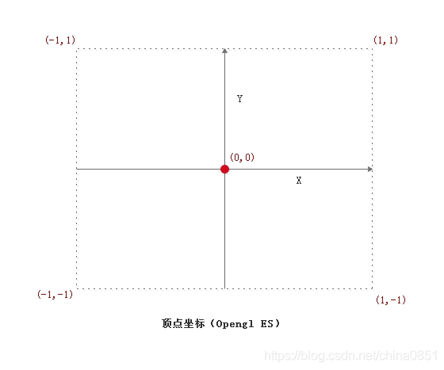
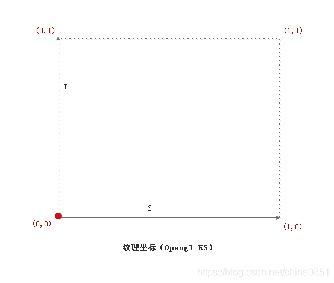
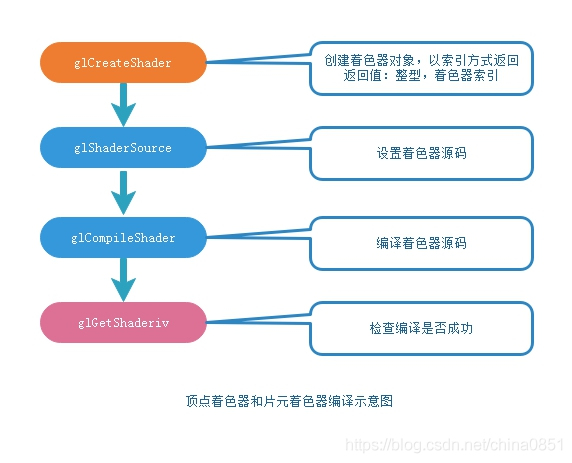
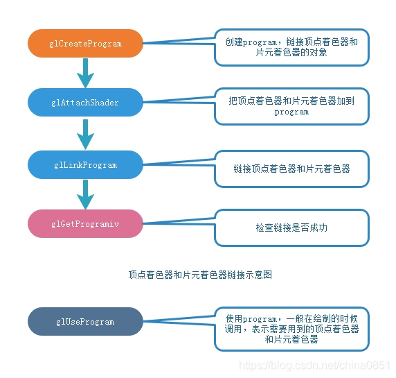
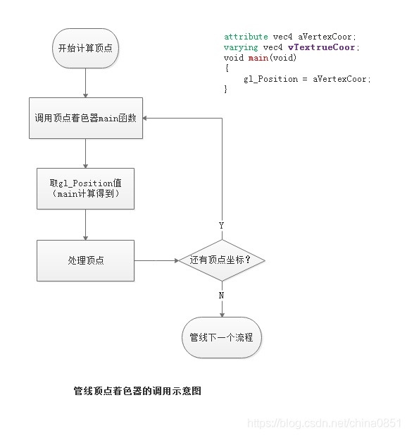
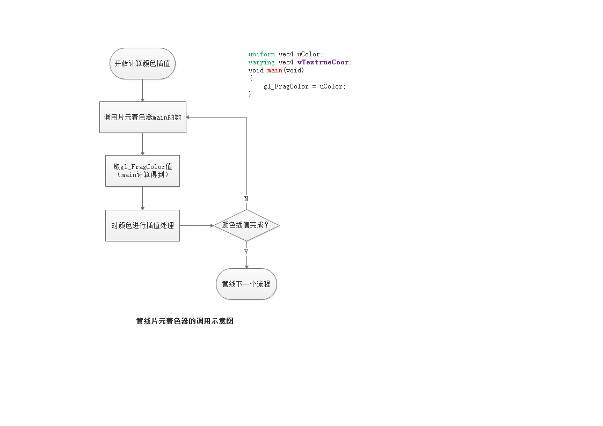
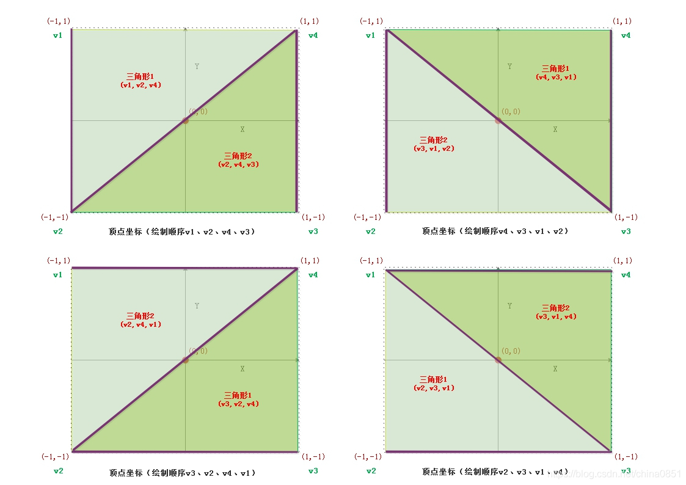
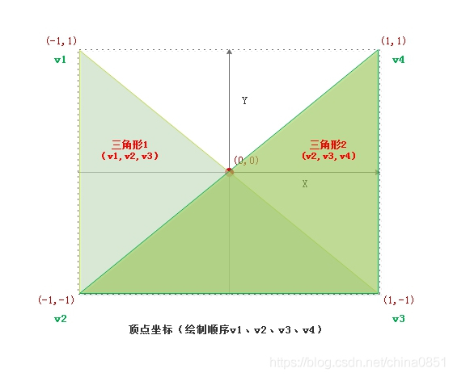
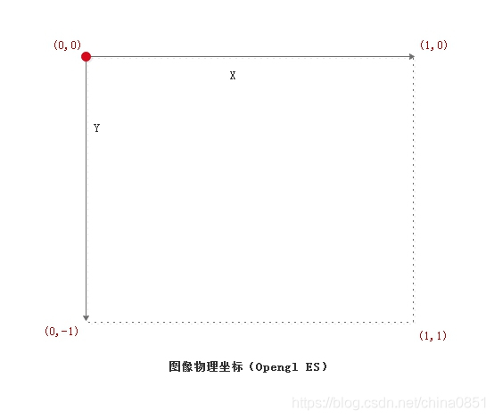
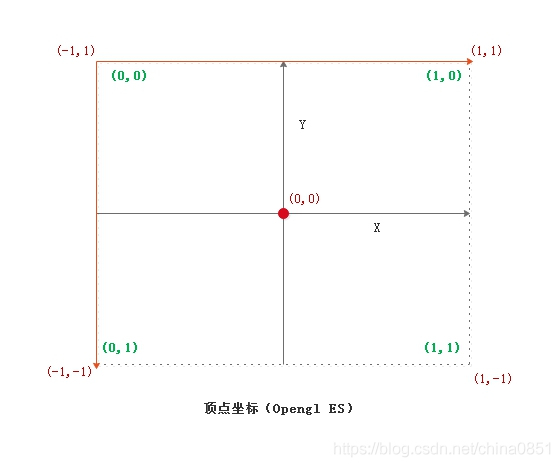

<h1 align="center">Opengl ES</h1>

*Opengl ES基础系列文章是音视频学习的图形图像部分，旨在通过这部分学习，能够把Opengl ES和视频结合在一起，最终形成一个完整的知识体系。*

​    这一节我们介绍Opengl ES的几个基本东西，为后面的学习有个整体的概念，而且只做最简单的概
念介绍，不会长篇大论（对于初学者会搞得晕头转向），大家也不必要去追根究底，只要记住有这么个
东西就行，通过后面的学习，然后再回过头来看，一定会有顿悟的感觉。这节主要介绍如下几个知识点。

- Opengl ES渲染管线
- 可编程着色器
- 着色器语言GLSL介绍
- Opengl ES坐标

  **1. 管线**
    简单理解就是显卡绘制的流水线，主要阶段如下（下面这张图来自于网络，如有侵权，请告知）：

​    

​    从上图可以看出，顶点着色器描述绘制的形状，然后进行片元的装配、裁剪、光栅化，到片元着色，最后输出到帧缓冲区，到帧缓冲区，渲染的数据准备好了，下一步提交到屏幕显示。


  **2. 可编程着色器**
    从管线的流程我们知道，其中的顶点着色器和片元着色器这两个流程是可以编程定制的。

- 顶点着色器

​    通过编程确定我们绘制的区域，片元（姑且叫绘制区域）就是通过描述的顶点来计算生成的。

- 片元着色器

​    为我们绘制的区域进行颜色或图像填充（描述不太专业但是好理解）。

​    上面简单介绍顶点着色器和片元着色器，下一节会详细介绍，包括写法、编译和链接等。


  **3. 着色器语言GLSL**
    既然着色器可以编程定制，那么就需要对应的编写语言来完成，这就是GLSL，它是Opengl ES里
用来编写顶点着色器和片元着色器的语言，类似C语言，有变量、函数定义，执行方法是main，下面主
要介绍下GLSL用到的类型和几个常用修饰符的含义。


  **3.1 GLSL数据类型**

   float  bool  int   基本数据类型

   vec2         包含了2个浮点数的向量

   vec3         包含了3个浮点数的向量

   vec4         包含了4个浮点数的向量

   ivec2        包含了2个整数的向量

   ivec3        包含了3个整数的向量

   ivec4        包含了4个整数的向量

   bvec2        包含了2个布尔数的向量

   bvec3        包含了3个布尔数的向量

   bvec4        包含了4个布尔数的向量

   mat2         2*2维矩阵

   mat3         3*3维矩阵

   mat4         4*4维矩阵

   sampler1D      1D纹理采样器

   sampler2D      2D纹理采样器

   sampler3D      3D纹理采样器

 

  **3.2 变量修饰符**

- attribute

​    由 vertext array 提供的顶点数据，如空间位置，法向量，纹理坐标以及顶点颜色，属性可以理解为针对每一个顶点的输入数据。属性只在顶点着色器中才有，片元着色器中没有属性。OpenGL ES 2.0 规定了所有实现应该支持的最大属性个数不能少于 8 个。

- uniform

​    Uniforms保存由应用程序传递给着色器的只读常量数据。在顶点着色器中，这些数据通常是变换矩阵，光照参数，颜色等。由 uniform 修饰符修饰的变量属于全局变量，该全局性对顶点着色器与片元着色器均可见，也就是说，这两个着色器如果被连接到同一个应用程序中，它们共享同一份 uniform 全局变量集。因此如果在这两个着色器中都声明了同名的 uniform 变量，要保证这对同名变量完全相同：同名+同类型，因为它们实际是同一个变量。此外，uniform 变量存储在常量存储区，因此限制了uniform 变量的个数，OpenGL ES 2.0 也规定了所有实现应该支持的最大顶点着色器 uniform 变量个数不能少于 128 个，最大的片元着色器 uniform 变量个数不能少于 16 个。

- varying

​    varying 变量用于存储顶点着色器的输出数据，也存储片元着色器的输入数据。varying 变量会在光栅化处理阶段被线性插值。顶点着色器如果声明了 varying 变量，它必须被传递到片元着色器中才能进一步传递到下一阶段，因此顶点着色器中声明的 varying 变量都应在片元着色器中重新声明为同名同类型的 varying 变量。OpenGL ES 2.0 也规定了所有实现应该支持的最大varying 变量个数不能少于8 个。

-  Samplers

​     一种特殊的 uniform，用于呈现纹理。sampler 可用于顶点着色器和片元着色器。

-  const

​    常量的定义，其和uniform区别是，uniform是全局，外部可以初始化，着色器里不可更改；而const仅仅在着色器里定义的常量而已。

 

  **4. Opengl ES坐标**
    Opengl ES坐标及其转换，网上有很多介绍，但大都是概念性的，对于初学者会看的云里雾里的
，这里我们一步一步来，先介绍顶点坐标和纹理坐标。

- 归一化

​    首先，Opengl ES里坐标范围在[-1, 1]范围，这个叫归一化坐标，通过比率和屏幕坐标进行映
射，通俗点讲，通过归一化坐标不会发生越界访问操作。

- 顶点坐标

​    这是Opengl ES里的坐标系，就是网上很多文章说的世界坐标，它是以中心点为原点，大小在[-1, 1]范围内的点组成。

   

​    从上图看出，Opengl ES的坐标原点在中心，坐标都归一化到[-1, 1]，定点坐标到屏幕的显示会经过一系列的变化，然后结合视窗（实际显示的屏幕视口坐标）最终渲染图形或图像到屏幕。

​    关于视窗坐标后面我们会结合实际的项目进行理解。

- 纹理坐标

​    这个坐标先理解为贴图到顶点坐标的映射关系的描述，纹理坐标以左下点为原点，向上为Y正轴，向右为X的正轴，也叫做S、T向量。

   

​    纹理坐标被归一化到[0, 1]范围，比如800x600（宽x高）的一副图像，如果纹理坐标为(0,0)、(0.0.5)、(0.5,0.5)、(0.5,0)，那么实际渲染的图像区域是从左下角开始往上300像素，往右400像素的区域。

   为了避免复杂性，这里我们没有介绍Z轴，后面讲到3D以及坐标转换的时候会介绍，学习需要循序渐进、由易到难，这样才会事半功倍。

​    上面的介绍足够简单，大家只需要知道有这么个东西即可，下一节我们继续介绍顶点着色器和片元着色器，因为这在Opengl ES2.0是我们绘图用到的，从第三节开始，我们就会以实际项目逐步介绍，因此，这两节大家可以快速浏览，记住概念即可。

[（1）Opengl ES 基础概念 - 会说话的小鱼 - 博客园 (cnblogs.com)](https://www.cnblogs.com/xiaomazixun/p/10269986.html)

## [（2）Opengl ES 着色器介绍](https://www.cnblogs.com/xiaomazixun/p/10269987.html)

​    *Opengl ES基础系列文章是音视频学习的图形图像部分，旨在通过这部分学习，能够把Opengl ES和视频结合在一起，最终形成一个完整的知识体系。*    

​    着色器的写法类似C语言，可以定义变量、常量以及函数，有main方法，在Opengl ES渲染过程中，会不断调用其main方法来进行计算，我们不去大篇幅讨论着色器语法、API等，会通过实际的例子让大家真正知道着色器中变量的含义、以及对变量进行定位和其赋值等。

> ### 1. 术语   

​    VertexShader：顶点着色器；

​    FragmentShader：片段着色器；

> ### **2. 着色器写法**

​    下面是一个简单的顶点着色器和片段着色器的代码：

- ### 顶点着色器代码

    ```
    		attribute vec4 aVertexCoor; // 1
        varying vec4 vTextrueCoor;
        void main(void)
        {
            gl_Position = aVertexCoor;
        }
    ```

​    **gl_Position：**Opengl ES的全局变量，这里表示当前计算的顶点坐标位置。

​    **aVertexCoor：**定义一个attribute类型的变量，用来存储顶点坐标值，实际使用中会把值赋给它；

- ### 片元着色器代码

```
    uniform vec4 uColor; // 
    varying vec4 vTextrueCoor;
    void main(void)
    {
        gl_FragColor = uColor;
    }
```

​    **gl_FragColor：**经过计算后得到对片元（通过顶点着色器计算的区域）填充的颜色信息。

​    **uColor：**图形的填充颜色，实际中会设置需要填充的颜色值。

> ### 3. 着色器编译

​    前面章节介绍过，在Opengl ES中，在顶点着色器和片段着色器里定义完全相同的uniform和varying类型的变量，那么它们其实共享一个内存地址，相当于同一个变量。所以，在顶点代码里定义的vTextrueCoor，片段着色器里也同样定义了，因此，我们给顶点着色器的vTextrueCoor赋值，片段着色器里通过vTextrueCoor变量访问的也是同样的值，这样，纹理坐标的值通过顶点着色器透传给了片段着色器（这个纹理坐标绘制三角形暂时不用，后面使用图像纹理时会详细讲解）。
​    顶点着色器和片段着色器代码写好后，还不能用，需要通过Opengl ES进行编译、链接后才能使用。

- ### 着色器编译流程

   

 

- ### 着色器的链接过程

​    

 

- ### 使用着色器

  glUseProgram();

  调用此函数切换到和program链接的顶点着色器和片段着色器，使用我们编写的着色器代码。

> ### 4. 着色器在Opengl ES管线中调用

​    在Opengl ES渲染管线流水线中，顶点着色器和片元着色器我们是可以编程定制的，下面看下在渲染过程中对顶点着色器和片元着色器的调用过程。

- ### 顶点着色器

​    

- ### 片段着色器

 



> ### 5. 再谈顶点坐标和纹理坐标

- ### 顶点坐标

​    上节简单讲解了顶点坐标，其原点在中心点，归一化坐标在[-1, 1]之间，下面我们以绘制矩形来对顶点坐标做个直观了解。



​    上面四个图简要说明了绘制一个矩形其四个顶点其中的四种顶点坐标顺序，我们知道，在Opengl ES仅支持点、线、三角形绘制（先知道就这么回事），那么矩形可以看成是两个三角形组合而成，下面这句话大家一定要记住：

​    **在Opengl ES，三角形是以连续的三个顶点坐标确定的。**

​    记住上面的**连续**，三角形是以连续的三个顶点坐标组合而成，所以我们在不指定**绘制顺序（order）**的情况下，矩形的四个顶点只需要按照顺序组合成两个三角形，而这两个三角形刚好拼装成一个矩形就可以了，这里提一点，绘制顺序是可以指定，后面我们会讲到，我们看下上图的第一个，顶点顺序为：v1、v2、v4、v3，那么我们从四个顶点中，从第一个顶点开始，每三个一组（一个三角形需要三个顶点），取两组（一个矩形需要两个三角形组合），那么唯一的组合就是：（v1,v2,v4）、（v2,v4,v3），那为什么不是（v1,v2,v4）、（v1,v4,v3）呢，那是因为（v1,v4,v3）这个组合的点不是连续的，到这里大家应该明白了吧，其实只要保证两个对角线连续，三角形的三个点连续，那么就可以有多种组合，上面我们列出四种顶点组合，大家可以根据这个原理，列出其它的组合。

​    为了更直观，我们来看一组不能组合成矩形的顶点顺序。



​    从上图看到，如果以顶点顺序v1、v2、v3、v4，那么最终得到三角是交叉的，不能组合成矩形。

- ### 纹理坐标

​    上节我们说过，纹理坐标原点在左下角，向上为Y正轴，向右为X正轴，这里的纹理坐标实际会映射到我们图像纹理上，实际中我们的图像数据是从左到右，从上到下，其坐标系如下：



​    这个坐标其实和纹理坐标在垂直方向是一个镜像关系，因此，实际绘制中需要对纹理坐标沿X轴翻转180（垂直镜像），因为在图元装配和光栅化的时候，顶点坐标和纹理坐标会按照顺序一一对应起来，所以，要正确显示图像，那么顶点坐标和纹理坐标一定要对应起来，顶点坐标和图像纹理坐标对应关系如下（垂直做镜像）：



​    上图黄色坐标系为图像纹理的坐标，只要按照上图的对应点进行组合顶点坐标和图像纹理坐标就可以正确绘制出我们的图像了（结合上面顶点坐标的组合然后对应这个图就可以正确的图像纹理坐标和顶点坐标了）。

​    这一节主要讲解着色器的基本概念、写法，编译和链接过程以及顶点坐标和纹理坐标，关于着色器相关的API调用，我们会在后续章节中实际的项目里进行讲解，那样效果会更好。


[（2）Opengl ES 着色器介绍 - 会说话的小鱼 - 博客园 (cnblogs.com)](https://www.cnblogs.com/xiaomazixun/p/10269987.html)