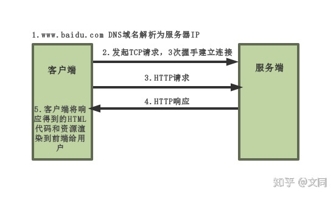
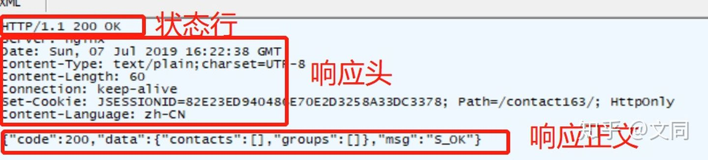
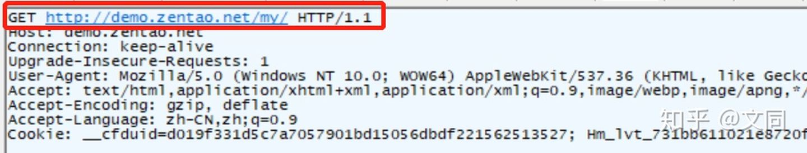

<h1 align="center">HTTP</h1>

[TOC]

## 什么是协议？

网络协议是计算机之间为了实现网络通信而达成的一种“约定”或者”规则“，有了这种”约定“，不同厂商的生产设备，以及不同操作系统组成的计算机之间，就可以实现通信。

## HTTP协议是什么？

HTTP协议是**超文本传输协议**的缩写，英文是Hyper Text Transfer Protocol。它是从WEB服务器传输超文本标记语言(HTML)到本地浏览器的传送协议。

设计HTTP最初的目的是为了提供一种发布和接收HTML页面的方法。

HTPP有多个版本，目前广泛使用的是HTTP/1.1版本。

## HTTP原理

HTTP是一个基于TCP/IP通信协议来传递数据的协议，传输的数据类型为HTML 文件，图片文件，查询结果等。

HTTP协议一般用于B/S架构（）。浏览器作为HTTP客户端通过URL向HTTP服务端即WEB服务器发送所有请求。

我们以访问百度为例：

访问百度流程

## HTTP特点

1. http协议支持客户端/服务端模式，也是一种请求/响应模式的协议。
2. 简单快速：客户向服务器请求服务时，只需传送请求方法和路径。请求方法常用的有GET、HEAD、POST。
3. 灵活：HTTP允许传输任意类型的数据对象。传输的类型由Content-Type加以标记。
4. 无连接：限制每次连接只处理一个请求。服务器处理完请求，并收到客户的应答后，即断开连接，但是却不利于客户端与服务器保持会话连接，为了弥补这种不足，产生了两项记录http状态的技术，一个叫做Cookie,一个叫做Session。后来使用了`Keep-Alive`技术。
5. 无状态：无状态是指协议对于事务处理没有记忆，服务器不知道客户端是什么状态，后续处理需要前面的信息，则必须重传。即我们给服务器发送 HTTP 请求之后，服务器根据请求，会给我们发送数据过来，但是，发送完，不会记录任何信息。
6. HTTP构建于`TCP/IP`协议之上，默认端口号是80。

## HTTP优点和缺点

HTTP 协议这种特性有优点也有缺点，优点在于解放了服务器，每一次请求“点到为止”不会造成不必要连接占用，**缺点在于每次请求会传输大量重复的内容信息**。

为了解决HTTP无状态的缺点，两种用于保持 HTTP 连接状态的技术就应运而生了，一个是 `Cookie`，而另一个则是 `Session`。`Cookie`在客户端记录状态，比如登录状态。`Session`在服务器记录状态。

## URI和URL的区别

HTTP使用统一资源标识符（Uniform Resource Identifiers, URI）来传输数据和建立连接。

- URI：Uniform Resource Identifier 统一资源**标识**符
- URL：Uniform Resource Location 统一资源**定位**符

URI 是用来标示 一个具体的资源的，我们可以通过 URI 知道一个资源是什么。

URL 则是用来定位具体的资源的，标示了一个具体的资源位置。互联网上的每个文件都有一个唯一的URL。

## HTTP报文组成

### **请求报文头部构成**

1. 请求行：包括请求方法、URL、协议/版本

2. 请求头(Request Header)

3. 请求正文

   																					请求报文组成

  - `User-Agent`：产生请求的浏览器类型。
  - `Accept`：客户端可识别的响应内容类型列表;
  - `Accept-Language`：客户端可接受的自然语言;
  - `Accept-Encoding`：客户端可接受的编码压缩格式;
  - `Accept-Charset`：可接受的应答的字符集;
  - `Host`：请求的主机名，允许多个域名同处一个IP 地址，即虚拟主机;（必选）
  - `Connection`：连接方式(close 或 `keep-alive`);
  - `Cookie`：存储于客户端扩展字段，向同一域名的服务端发送属于该域的cookie;
  - `请求包体`：在`POST`方法中使用。
  - `Referer`：包含一个URL，用户从该URL代表的页面出发访问当前请求的页面。
  - `If-Modified-Since`：文档的最后改动时间

### 响应报文构成

1. 状态行

2. 响应头

3. 响应正文

   																											响应报文组成

  - `Allow`	服务器支持哪些请求方法（如GET、POST等）。
  - `Content-Encoding`	文档的编码（Encode）方法。
  - `Content-Length`	表示内容长度。只有当浏览器使用持久HTTP连接时才需要这个数据。
  - `Content-Type`	表示后面的文档属于什么MIME类型。
  - `Date`	当前的GMT时间。你可以用setDateHeader来设置这个头以避免转换时间格式的麻烦。
  - `Expires`	应该在什么时候认为文档已经过期，从而不再缓存它。
  - `Last-Modified`	文档的最后改动时间。
  - `Refresh`	表示浏览器应该在多少时间之后刷新文档，以秒计。
  - `Server`	服务器名字。
  - `Set-Cookie`	设置和页面关联的Cookie。
  - `ETag`：被请求变量的实体值。ETag是一个可以与Web资源关联的记号（MD5值）。
  - `Cache-Control`：这个字段用于指定所有缓存机制在整个请求/响应链中必须服从的指令。

  > max-age：表示当访问此网页后的 x 秒内再次访问不会去服务器；no-cache，实际上Cache-Control: no-cache是会被缓存的，只不过每次在向客户端（浏览器）提供响应数据时，缓存都要向服务器评估缓存响应的有效性；no-store，这个才是响应不被缓存的意思；

>`Last-Modified`与`If-Modified-Since`都是用来记录页面的最后修改时间。当客户端访问页面时，服务器会将页面最后修改时间通过 Last-Modified 标识由服务器发往客户端，客户端记录修改时间，再次请求本地存在的cache页面时，客户端会通过 If-Modified-Since 头将先前服务器端发过来的最后修改时间戳发送回去，服务器端通过这个时间戳判断客户端的页面是否是最新的，如果不是最新的，则返回新的内容，如果是最新的，则返回 304。

## Http的状态码含义。

### 1xx: 信息，服务器收到请求，需要请求者继续执行操作

| 消息： | 英文名              | 描述：                                                       |
| ------ | :------------------ | ------------------------------------------------------------ |
| 100    | Continue            | 服务器仅接收到部分请求，但是一旦服务器并没有拒绝该请求，客户端应该继续发送其余的请求。 |
| 101    | Switching Protocols | 服务器转换协议：服务器将遵从客户的请求转换到另外一种协议。   |
| 103    | Checkpoint          | 用于 PUT 或者 POST 请求恢复失败时的恢复请求建议。            |

### 2xx: 成功，操作被成功接收并处理

| 消息： | 英文名                        | 描述：                                                       |
| ------ | ----------------------------- | ------------------------------------------------------------ |
| 200    | OK                            | 请求成功（这是对HTTP请求成功的标准应答。）                   |
| 201    | Created                       | 请求被创建完成，同时新的资源被创建。                         |
| 202    | Accepted                      | 供处理的请求已被接受，但是处理未完成。                       |
| 203    | Non-Authoritative Information | 请求已经被成功处理，但是一些应答头可能不正确，因为使用的是其他文档的拷贝。 |
| 204    | No Content                    | 请求已经被成功处理，但是没有返回新文档。浏览器应该继续显示原来的文档。如果用户定期地刷新页面，而Servlet可以确定用户文档足够新，这个状态代码是很有用的。 |
| 205    | Reset Content                 | 请求已经被成功处理，但是没有返回新文档。但浏览器应该重置它所显示的内容。用来强制浏览器清除表单输入内容。 |
| 206    | Partial Content               | 客户发送了一个带有Range头的GET请求，服务器完成了它。         |

### 3xx: 重定向，需要进一步的操作以完成请求

| 消息： | 英文名             | 描述：                                                       |
| ------ | ------------------ | ------------------------------------------------------------ |
| 300    | Multiple Choices   | 多重选择。链接列表。用户可以选择某链接到达目的地。最多允许五个地址。 |
| 301    | Moved Permanently  | 所请求的页面已经转移至新的 URL 。请求的资源已被永久的移动到新URI，返回信息会包括新的URI，浏览器会自动定向到新URI。今后任何新的请求都应使用新的URI代替 |
| 302    | Found              | 所请求的页面已经临时转移至新的 URL 。客户端应继续使用原有URI |
| 303    | See Other          | 所请求的页面可在别的 URL 下被找到。                          |
| 304    | Not Modified       | 未按预期修改文档。客户端有缓冲的文档并发出了一个条件性的请求（一般是提供If-Modified-Since头表示客户只想比指定日期更新的文档）。服务器告诉客户，原来缓冲的文档还可以继续使用。 |
| 305    | Use Proxy          | 客户请求的文档应该通过Location头所指明的代理服务器提取。     |
| 306    | Switch Proxy       | *目前已不再使用，但是代码依然被保留。*                       |
| 307    | Temporary Redirect | 被请求的页面已经临时移至新的 URL 。                          |
| 308    | Resume Incomplete  | 用于 PUT 或者 POST 请求恢复失败时的恢复请求建议。            |

### 4xx: 客户端错误，请求包含语法错误或无法完成请求

| 消息： | 英文名                          | 描述：                                                       |
| ------ | ------------------------------- | ------------------------------------------------------------ |
| 400    | Bad Request                     | 因为语法错误，服务器未能理解请求。                           |
| 401    | Unauthorized                    | 合法请求，但对被请求页面的访问被禁止。因为被请求的页面需要身份验证，客户端没有提供或者身份验证失败。这个状态代码必须和WWW-Authenticate报头域一起使用 |
| 402    | Payment Required                | *此代码尚无法使用。*                                         |
| 403    | Forbidden                       | 合法请求，但对被请求页面的访问被禁止。服务器通常会在响应正文中给出不提供服务的原因 |
| 404    | Not Found                       | 服务器无法找到被请求的页面。例如，输入了错误的URL            |
| 405    | Method Not Allowed              | 请求中指定的方法不被允许。                                   |
| 406    | Not Acceptable                  | 服务器生成的响应无法被客户端所接受。                         |
| 407    | Proxy Authentication Required   | 用户必须首先使用代理服务器进行验证，这样请求才会被处理。     |
| 408    | Request Timeout                 | 请求超出了服务器的等待时间。                                 |
| 409    | Conflict                        | 由于冲突，请求无法被完成。                                   |
| 410    | Gone                            | 被请求的页面不可用。                                         |
| 411    | Length Required                 | "Content-Length" 未被定义。如果无此内容，服务器不会接受请求。 |
| 412    | Precondition Failed             | 请求中的前提条件被服务器评估为失败。                         |
| 413    | Request Entity Too Large        | 由于所请求的实体太大，服务器不会接受请求。                   |
| 414    | Request-URI Too Long            | 由于 URL 太长，服务器不会接受请求。当 POST 请求被转换为带有很长的查询信息的 GET 请求时，就会发生这种情况。 |
| 415    | Unsupported Media Type          | 由于媒介类型不被支持，服务器不会接受请求。                   |
| 416    | Requested Range Not Satisfiable | 客户端请求部分文档，但是服务器不能提供被请求的部分。         |
| 417    | Expectation Failed              | 服务器不能满足客户在请求中指定的请求头。                     |

### 5xx: 服务器错误，服务器在处理请求的过程中发生了错误

| 消息： | 英文名                          | 描述：                                                       |
| ------ | ------------------------------- | ------------------------------------------------------------ |
| 500    | Internal Server Error           | 请求未完成。服务器遇到不可预知的情况。导致无法完成客户端的请求。 |
| 501    | Not Implemented                 | 请求未完成。服务器不支持所请求的功能，或者服务器无法完成请求。 |
| 502    | Bad Gateway                     | 请求未完成。服务器充当网关或者代理的角色时，从上游服务器收到一个无效的响应。 |
| 503    | Service Unavailable             | 服务器当前不可用（过载或者当机）。                           |
| 504    | Gateway Timeout                 | 网关超时。服务器充当网关或者代理的角色时，未能从上游服务器收到一个及时的响应。 |
| 505    | HTTP Version Not Supported      | 服务器不支持请求中指明的HTTP协议版本。                       |
| 511    | Network Authentication Required | 用户需要提供身份验证来获取网络访问入口。                     |

## Http request的几种类型。

  - `GET`	请求指定的页面信息，并返回实体主体。
  - `POST`	向指定资源提交数据进行处理请求（例如提交表单或者上传文件）。数据被包含在请求体中。POST请求可能会导致新的资源的建立和/或已有资源的修改。
  - `PUT`	从客户端向服务器传送的数据取代指定的文档的内容。
  - `DELETE`	请求服务器删除指定的页面。

  >GET可提交的数据量受到URL长度的限制，HTTP协议规范没有对URL长度进行限制。这个限制是特定的浏览器及服务器对它的限制

  >理论上讲，POST是没有大小限制的，HTTP协议规范也没有进行大小限制，出于安全考虑，服务器软件在实现时会做一定限制

- GET:请求指定的页面信息，并返回实体主体。
- POST:向指定资源提交数据进行处理请求（例如提交表单或者上传文件）。数据被包含在请求体中。POST请求可能会导致新的资源的建立和/或已有资源的修改。
- HEAD:类似于get请求，只不过返回的响应中没有具体的内容，用于获取报头
- PUT:从客户端向服务器传送的数据取代指定的文档的内容。
- DELETE:请求服务器删除指定的页面。

																										GET请求

																										POST请求

**post和get的区别：**

- 都包含请求头请求行，post多了请求body。
- get多用来查询，请求参数放在url中，不会对服务器上的内容产生作用。post用来提交，如把账号密码放入body中。
- GET是直接添加到URL后面的，直接就可以在URL中看到内容，而POST是放在报文内部的，用户无法直接看到。
- GET提交的数据长度是有限制的，因为URL长度有限制，具体的长度限制视浏览器而定。而POST没有。

## 条件 GET

HTTP条件GET 是 `HTTP` 协议为了减少不必要的带宽浪费，提出的一种方案。实际上就是利用`If-Modified-Since`做浏览器缓存。

## 持久连接

我们知道 HTTP 协议采用`请求-应答`模式，当使用普通模式，即非 Keep-Alive 模式时，每个请求/应答客户和服务器都要新建一个连接，完成之后立即断开连接（HTTP协议为无连接的协议）；当使用 `Keep-Alive 模式`（又称持久连接、连接重用）时，`Keep-Alive` 功能使客户端到服务器端的连接持续有效，当出现对服务器的后继请求时，`Keep-Alive` 功能避免了建立或者重新建立连接。

在 HTTP 1.0 中, 没有官方的 `keep alive` 的操作。通常是在现有协议上添加一个指数。如果浏览器支持 keep-alive，它会在请求的包头中添加：

```
Connection: Keep-Alive
```

然后当服务器收到请求，作出回应的时候，它也添加一个头在响应中：

```
Connection: Keep-Alive
```

这样做，连接就不会中断（超过 Keep-Alive 规定的时间--服务器设置，意外断电等情况除外），而是保持连接。当客户端发送另一个请求时，它会使用同一个连接。这一直继续到客户端或服务器端认为会话已经结束，其中一方中断连接。

在 HTTP 1.1 版本中，默认情况下所有连接都被保持，如果加入 "Connection: close" 才关闭。

> HTTP Keep-Alive 简单说就是保持当前的TCP连接，避免了重新建立连接。

> **HTTP 长连接不可能一直保持，例如 Keep-Alive: timeout=5, max=100，表示这个TCP通道可以保持5秒，max=100，表示这个长连接最多接收100次请求就断开**。

> HTTP是一个无状态协议，这意味着每个请求都是独立的，Keep-Alive没能改变这个结果。另外，**Keep-Alive也不能保证客户端和服务器之间的连接一定是活跃的**，在HTTP1.1版本中也如此。唯一能保证的就是当连接被关闭时你能得到一个通知，所以不应该让程序依赖于Keep-Alive的保持连接特性，否则会有意想不到的后果。

> 使用长连接之后，客户端、服务端怎么知道本次传输结束呢？
>
> 两部分：
>
> 1. 判断传输数据是否达到了Content-Length 指示的大小；
>
> 2. 动态生成的文件没有 Content-Length ，它是分块传输（chunked），这时候就要根据 chunked 编码来判断，chunked 编码的数据在最后有一个空 chunked 块，表明本次传输数据结束。

## 跨站攻击

CSRF（Cross-site request forgery，跨站请求伪造）伪造请求，冒充用户在站内的正常操作，比如爬虫。

### 防范的方法

  - 关键操作只接受POST请求
  - 验证码
  - 检测 Referer
  - Token
    - Token 要足够随机——只有这样才算不可预测
    - Token 是一次性的，即每次请求成功后要更新Token——这样可以增加攻击难度，增加预测难度
    - Token 要注意保密性——敏感操作使用 post，防止 Token 出现在 URL 中

## 断点续传

要实现断点续传的功能，通常都需要客户端记录下当前的下载进度，并在需要续传的时候通知服务端本次需要下载的内容片段。

HTTP1.1协议中定义了断点续传相关的HTTP头 `Range` 和 `Content-Range` 字段，一个最简单的断点续传实现大概如下：
  1. 客户端下载一个1024K的文件，已经下载了其中512K
  2. 网络中断，客户端请求续传，因此需要在HTTP头中申明本次需要续传的片段：`Range:bytes=512000-`，这个头通知服务端从文件的512K位置开始传输文件。
  3. 服务端收到断点续传请求，从文件的512K位置开始传输，并且在HTTP头中增加：`Content-Range:bytes 512000-/1024000`，并且此时服务端返回的HTTP状态码应该是`206`，而不是200。

但是在实际场景中，会出现一种情况，即在终端发起续传请求时，URL对应的文件内容在服务端已经发生变化，此时续传的数据肯定是错误的。如何解决这个问题了？显然此时我们需要有一个标识文件唯一性的方法。在RFC2616中也有相应的定义，比如 **实现Last-Modified来标识文件的最后修改时间，这样即可判断出续传文件时是否已经发生过改动**。同时RFC2616中还定义有一个ETag的头，可以使用ETag头来放置文件的唯一标识，比如文件的MD5值。

客户端在发起续传请求时应该在HTTP头中申明`If-Match` 或者 `If-Modified-Since` 字段，帮助服务端判别文件变化。

## 一次HTTP请求

1. 域名解析
          1. 浏览器缓存
          2. 系统缓存
          3. hosts
          4. ISP DNS 缓存
          5. DNS 服务器搜索

  2. 浏览器发送 HTTP 请求到目标服务器
  3. 服务器永久重定向
  4. 浏览器跟踪重定向地址
  5. 服务器“处理”请求
  6. 服务器发回一个HTML响应
  7. 浏览器开始显示HTML
  8. 浏览器请求获取嵌入在 HTML 中的对象（图片&脚本等）
  9. 浏览器发送异步（AJAX）请求


## 参考

* [HTTP各种响应码](https://www.cnblogs.com/okcy/p/11376068.html)
* https://zhuanlan.zhihu.com/p/72616216
* [硬核！30 张图解 HTTP 常见的面试题 - 小林coding - 博客园 (cnblogs.com)](https://www.cnblogs.com/xiaolincoding/p/12442435.html)

