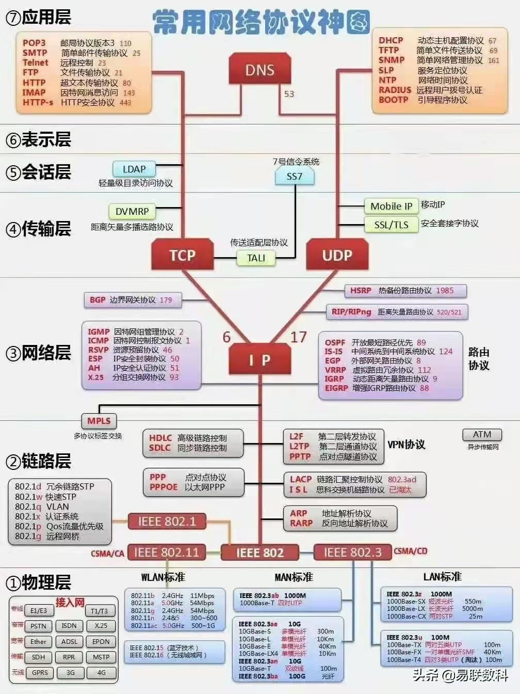

<h1 align="center">网络</h1>
[TOC]

## 网络分层-OSI

| 层         | 功能                                                         |
| :--------- | :----------------------------------------------------------- |
| 应用层     | 网络进程到应用程序。针对特定应用规定各层协议、时序、表示等，进行封装 。在端系统中用软件来实现，如HTTP等 |
| 表示层     | 数据表示形式，加密和解密，把机器相关的数据转换成独立于机器的数据。规定数据的格式化表示 ，数据格式的转换等 |
| 会话层     | 主机间通讯，管理应用程序之间的会话。规定通信时序 ；数据交换的定界、同步，创建检查点等 |
| 传输层     | 在网络的各个节点之间可靠地分发数据包。所有传输遗留问题；复用；流量；可靠 |
| 网络层     | 在网络的各个节点之间进行地址分配、路由和（不一定可靠的）分发报文。路由（ IP寻址）；拥塞控制。 |
| 数据链路层 | 一个可靠的点对点数据直链。检错与纠错（CRC码）；多路访问；寻址 |
| 物理层     | 一个（不一定可靠的）点对点数据直链。定义机械特性；电气特性；功能特性；规程特性 |

## 网络协议

* [网络基础---HTTP协议](https://www.jianshu.com/p/eeb4ffac8945)
* [一篇文章带你详解 HTTP 协议（网络协议篇一）](https://www.jianshu.com/p/6e9e4156ece3)
* [一篇文章带你熟悉 TCP/IP 协议（网络协议篇二）](https://www.jianshu.com/p/9f3e879a4c9c)
* [Socket协议，Socket实现长连接]()
* [TCP、UDP、IP 协议分析](http://blog.chinaunix.net/uid-26833883-id-3627644.html)
* [HTTP协议中GET和POST的具体实现]()
* [HTTP协议报文、工作原理及Java中的HTTP通信技术详解](http://www.cnblogs.com/rocomp/p/4803864.html)

##  网络库

* [Android OkHttp3 ：最简单&粗暴（使用与原理）讲解](https://www.jianshu.com/p/9143520922fb)
* [Retrofit]()

## 资源

* [**The-TCP-IP-Guide**](https://github.com/cqlilon/The-TCP-IP-Guide)：《The TCP/IP Guide》翻译项目

