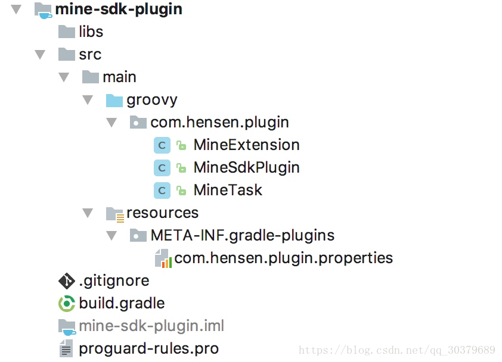

<h1 align="center">Gradle语法基础</h1>

## 生命周期

Gradle的构建依次会执行下面的三个生命周期
* 初始化阶段(Initialization)：解析整个工程中的所有Project，构建出所有的project对象
* 配置阶段(Configuration)：解析所有的projects对象中的task，构建好所有task的拓扑图
* 执行阶段(Execution)：执行具体的task及其依赖task

## 生命周期监听

在项目的build.gradle中，监听配置阶段和执行阶段的生命周期

```gradle
this.gradle.beforeProject {
    println "配置阶段开始之前(一)"
}

this.beforeEvaluate {
    println "配置阶段开始之前(二)"
}

this.gradle.afterProject {
    println "配置阶段执行完毕(一)"
}

this.afterEvaluate {
    println "配置阶段执行完毕(二)"
}

this.gradle.buildFinished {
    println "执行阶段执行完毕"
}
```

在项目的settings.gradle中，监听初始化阶段的生命周期，直接增加输出即可

```gradle
include ':app'
println "初始化阶段开始"
```

执行**clean**命令后，可以在控制台看到生命周期的执行顺序

```gradle
Executing tasks: [clean]

初始化阶段开始
Configuration on demand is an incubating feature.
配置阶段执行完毕(一)
配置阶段执行完毕(二)
配置阶段开始之前(一)
配置阶段执行完毕(一)
:clean
:app:clean

BUILD SUCCESSFUL in 1s
2 actionable tasks: 2 executed
执行阶段执行完毕
```

## Project对象

项目中的工程或Module都可以看成Project对象，根工程称为**Root Project**，Module称为**子Project**

* 如果在工程中或Module中存在build.gradle文件，那么它就是Project对象
* 如果在工程中或Module中不存在build.gradle文件，那么它就是个文件夹
对于子Project来说，一个子Project对应一个输出，输出类型是根据build.gradle文件来确定的

* 如果build.gradle定义application类型，则输出为apk
* 如果build.gradle定义library类型，则输出为aar

## Project相关Api

1、获取所有的Project

```gradle
def getProjects(){
    this.getAllprojects().eachWithIndex { Project project ,int index ->
        if(index == 0){
            println "Root Project :${project.name}"
        } else {
            println "+--- Project :${project.name}"
        }
    }
}
```

2、获取所有的子Project

```gradle
def getProjects(){
    this.getSubprojects().eachWithIndex { Project project ,int index ->
        println "+--- Project :${project.name}"
    }
}
```

3、获取父Project

```gradle
def getProjects(){
    def name = this.getParent().name
    println "parent project: ${name}"
}
```


4、获取根Project

```gradle
def getProjects(){
    def name = this.getRootProject().name
    println "root project: ${name}"
}
```


5、获取指定名字的Project

```gradle
project('app') {
    apply plugin: 'com.android.application'
    group 'com.hensen'
    version '1.0.0'
    dependencies {}
    android {}
}
```

6、统一配置所有的Project

```gradle
allprojects {
    group 'com.hensen'
    version '1.0.0'
}
```


7、统一配置所有的子Project

```gradle
subprojects { Project project ->
    if(project.plugins.hasPlugin('com.android.library')){
        apply from: '../publishToMaven.gradle'
    }
}
```

## Project属性Api

1、在根工程或gradle文件中定义全局扩展属性

```gradle
//在根工程或gradle文件中定义扩展属性
ext {
    android = [compileSdkVersion : 25,
               buildToolsVersion : '25.0.0',
               versionCode : 1,
               versionName : '1.0.0']
}
//如果在gradle文件中定义扩展属性，需要在子工程引入该gradle文件，然后在子工程使用扩展属性
apply from: '../common.gradle'
android {
    compileSdkVersion rootProject.ext.android.compileSdkVersion
    buildToolsVersion rootProject.ext.android.buildToolsVersion
    defaultConfig {
        versionCode rootProject.ext.android.versionCode
        versionName rootProject.ext.android.versionName
        ......
    }
}
```

2、在gradle.properties中定义全局扩展属性

在gradle.properties定义全局扩展属性，应该注意命名不能和系统定义的属性重名，否则会报出找不到扩展属性

```gradle
//在gradle.properties文件中定义全局扩展属性
isIncludeTestModule = false
mCompileSdkVersion = 25

//在settings.gradle中使用扩展属性
if(hasProperty('isIncludeTestModule') ? isIncludeTestModule.toBoolean() : false){
    include ':Test'
}
//在build.gradle中使用扩展属性
android {
    compileSdkVersion mCompileSdkVersion.toInteger()
    ......
}
```

## 文件Api

1、获取工程相关的文件

```gradle
println getRootDir().absolutePath
println getBuildDir().absolutePath
println getProjectDir().absolutePath
```

2、获取文件内容

```gradle
getContent('build.gradle')

def getContent(String path){
    try{
        def file = file(path)
        return file.text
    }catch(GradleException e){
        println 'file not found'
    }
    return null
}
```

3、文件拷贝

```gradle
copy {
    from file('build/outputs/apk/app-debug.apk')
    into getRootProject().getBuildDir()
}
```

4、文件夹拷贝

```gradle
copy {
    from file('build/outputs/apk/')
    into getRootProject().getBuildDir().path + '/apk/'
    exclude {} //可以对不需要拷贝的文件进行移除
    rename {} //可以对文件进行重命名
}
```

5、文件树遍历

```gradle
fileTree('build/outputs/apk/') {
	FileTree fileTree ->
    	fileTree.visit {
        	FileTreeElement element ->
        		println element.file
        		println element.file.name
    	}
}
```

## 依赖第三方Api

1、根工程的第三方依赖

```gradle
buildscript {
    //配置工程的仓库地址
    repositories {
        google()
        jcenter()
        mavenCentral()
        mavenLocal()
        maven { 
            name 'netWork' 
            url 'http://localhost:8080/nexus/repositories'
            credentials{
                username = 'Hensen'
                password = '123456'
            }
        }
    }
    //配置工程的插件依赖地址
    dependencies {
        classpath 'com.android.tools.build:gradle:3.0.1'
    }
}
```

2、子工程的第三方依赖

```gradle
dependencies {
    compile fileTree(dir: 'libs', include: ['*.jar'])
    compile ('com.android.support:appcompat-v7:26.1.0') {
        exclude module: 'support-v4'
        exclude group: 'com.android.support'
        exclude group: 'com.android.support', module: 'support-v4'
        transitive false //禁止传递依赖
    }

    provided 'com.android.support:support-v4:26.1.0'
}
```

概念梳理

1. 传递依赖:A依赖B，B依赖C，如果允许传递依赖，那么A可以使用C的内容，否则为禁止传递依赖
2. compile:参与编译时期和参与打包过程
3. provided:参与编译时期，但不参与打包过程

provided应用场景

1. 当前依赖的库只适用于编译时期生成代码的工具库
2. 当前依赖的库已经存在于根工程的依赖，在子工程中只参与编译

## 外部命令Api

1、调用系统指令

```gradle
task(name: 'apkcopy') {
    doLast {
        def srcPath = this.buildDir.path + '/outputs/apk'
        def destPath = './target/apk'
        def command = "mv -f ${srcPath} ${destPath}"
        exec {
            try {
                executable 'bash'
                args '-c', command
                println 'this command exec success'
            }catch(GradleException e){
                println 'this command exec error'
            }
        }
    }
}
```

2、调用脚本

```gradle
task stopTomcat(type:Exec) {
    //dir
    workingDir '../tomcat/bin'
    //windows
    commandLine 'cmd', '/c', 'stop.bat'
    //linux
    commandLine './stop.sh'
}
```

## task对象

1、定义

由于task运行于配置阶段中，因此在gradle文件中，只要执行其中一个task，则其他task都会执行一遍

```gradle
//第一种定义方式
task helloword(group: 'hensen',description :'hello'){
    println "Hello Word"
}
//第二种定义方式
this.tasks.create(name: 'helloword'){
    setGroup('hensen')
    setDescription('hello')
    println "Hello Word"
}
```

2、时序

```gradle
//第一种定义方式
task helloword(group: 'hensen',description :'hello'){
    println "Hello Word"
    doFirst {
        println "doFirst"
    }
    doLast {
        println "doLast"
    }
}
//第二种定义方式
helloword.doFirst {
    println "doFirst"
}
//第三种定义方式
helloword << {
    println "doLast"
}
```

三种定义方式中，第二种定义方式会比第一种定义方式先执行

* doFirst:task配置阶段时运行
* doLast:task执行阶段时运行
* <<:doLast的简写，等同于doLast

3、计算build执行时长

```gradle
gradle build执行的时长即task执行阶段的时长

def startTime,endTime
this.afterEvaluate { Project project ->
    def prebuild = project.tasks.getByName('preBuild')
    prebuild.doFirst {
        startTime = System.currentTimeMillis()
    }
    def build = project.tasks.getByName('build')
    build.doLast {
        endTime = System.currentTimeMillis()
        println "the build time is : ${endTime - startTime}"
    }
}
```

4、依赖关系

```gradle
task与task之间的依赖

task taskA {
    doLast {
        println "taskA run"
    }
}
task taskB {
    doLast {
        println "taskB run"
    }
}
task taskC(dependsOn: [taskA, taskB]) {
    doLast {
        println "taskC run"
    }
}

//执行taskC后的输出结果
taskA run
taskB run
taskC run
```

task与lib之间的依赖

```gradle
task taskC {
    dependsOn this.tasks.findAll { task ->
        return task.name.startsWith('lib')
    }
    doLast {
        println "taskC run"
    }
}
task lib1 << {println 'lib1'}
task lib2 << {println 'lib2'}
task lib3 << {println 'lib3'}

//执行taskC后的输出结果
lib1
lib2
lib3
taskC run
```

5、输入输出

通过指定输入的属性和输出的文件，在构建完成后自动将信息解析成xml存放在releases.xml文件中，作为版本说明的文本

```gradle
ext {
    versionName = rootProject.ext.android.versionName
    versionCode = rootProject.ext.android.versionCode
    versionInfo = 'App 2.0.0版本 上线啦'
    destFile = file('releases.xml')
    if (destFile != null && !destFile.exists()) {
      destFile.createNewFile()
    }
}

task writeTask {
    inputs.property('versionCode', this.versionCode)
    inputs.property('versionName', this.versionName)
    inputs.property('versionInfo', this.versionInfo)
    outputs.file this.destFile
    doLast {
        //将输入的内容写入到输出文件中去
        def data = inputs.getProperties()
        File file = outputs.getFiles().getSingleFile()
        def versionMsg = new VersionMsg(data)
        //将实体对象写入到xml文件中
        def sw = new StringWriter()
        def xmlBuilder = new MarkupBuilder(sw)
        if (file.text != null && file.text.size() <= 0) {
            //没有内容
            xmlBuilder.releases {
                release {
                    versionCode(versionMsg.versionCode)
                    versionName(versionMsg.versionName)
                    versionInfo(versionMsg.versionInfo)
                }
            }
            //直接写入
            file.withWriter { writer -> 
                writer.append(sw.toString())
            }
        } else {
            //已有其它版本内容
            xmlBuilder.release {
                versionCode(versionMsg.versionCode)
                versionName(versionMsg.versionName)
                versionInfo(versionMsg.versionInfo)
            }
            //插入到最后一行前面
            def lines = file.readLines()
            def lengths = lines.size() - 1
            file.withWriter { writer ->
                lines.eachWithIndex { line, index ->
                    if (index != lengths) {
                        writer.append(line + '\r\n')
                    } else if (index == lengths) {
                        writer.append('\r\r\n' + sw.toString() + '\r\n')
                        writer.append(lines.get(lengths))
                    }
                }
            }
        }
    }
}

task readTask {
    //指定输入文件为上一个task的输出
    inputs.file this.destFile
    doLast {
        //读取输入文件的内容并显示
        def file = inputs.files.singleFile
        println file.text
    }
}

class VersionMsg {
    String versionCode
    String versionName
    String versionInfo
}

this.project.afterEvaluate { project ->
    def buildTask = project.tasks.getByName('build')
    buildTask.doLast {
        writeTask.execute()
    }
}
```

6、执行顺序

无论三个task的执行顺序是怎么样，它们都会按照指定的顺序taskA taskB taskC执行

```gradle
task taskA {
    doLast {
        println "taskA run"
    }
}
task taskB {
    mustRunAfter taskA
    doLast {
        println "taskB run"
    }
}
task taskC() {
    mustRunAfter taskB
    doLast {
        println "taskC run"
    }
}
```

## Setting对象

Setting对象对应项目中的工程的settings.gradle文件，它是gradle的初始化阶段时运行的文件

## SourceSets对象

sourceSets可以指定当前的工程使用哪套资源配置来进行不同模版的切换，比如经常用到的是闪屏界面的特效切换等

```gradle
sourceSets {
    main {
        java.srcDir = ['src']
        java.excludes = ['androidTest/**','test/**']
        mainfest.srcFile 'AndroidManifest.xml'
        jniLibs.srcDirs = ['libs']
        if (app_type == "1") {
            res.srcDirs = ['res','res_a']
            assets.srcDirs = ['assets','assets_a']
        } else if (app_type == "2"){
            res.srcDirs = ['res','res_b']
            assets.srcDirs = ['assets','assets_b']
        }
    }
}
```

## Variants相关Api

Variants指的是多渠道打包出来的apk的一种统称

```gradle
this.afterEvaluate {
    this.android.applicationVariants.all { variant ->
        //获取Variants相关属性
        def name = variant.name
        def baseName = variant.baseName
        def buildType = variant.buildType
        def signingConfig = variant. signingConfig
        def versionName = variant.versionName
        def verionCode = variant.versionCode
        println "name: ${name} , baseName: ${baseName}"

        //修改variant的apk名字
        def output = variant.outputs.first()
        def apkName = "app-${variant.baseName}-${variant.versionName}.apk"
        output.outputFile = new File(output.outputFile.parent,apkName)

        //修改variant的task
        def checkTask = variant.checkManifest
        checkTask.doFirst {
            ......   
        }
    }
}

//输出结果
name: appDebug , baseName: app-debug
name: baiduDebug , baseName: baidu-debug
```

## 自定义Plugin

自定义Plugin是在原有的工程项目中增加一个新的Module作为Plugin，自定义Plugin的目录结构和正常的Project目录结构有很大区别，而且自定义Plugin的目录结构需要按照规定的命名规则和存放位置才能生效，自定义Plugin分为三步骤：

1. 自定义Plugin
2. 自定义Extension
3. 自定义Task

下图是自定义Plugin的目录结构，其中有两个主要的目录

1. groovy：编写groovy脚本的目录，创建的文件都必须以groovy为后缀名
2. resources：必须创建META-INF/gradle-plugins的目录和properties文件，其命名会用

在project中的apply plugin语句中



## 一、自定义Plugin

1、创建MineSdkPlugin.groovy，实现Plugin<Project>

```java
package com.hensen.plugin

import org.gradle.api.Plugin
import org.gradle.api.Project

class MineSdkPlugin implements Plugin<Project> {

    @Override
    void apply(Project project) {

        println "Hello Gradle Plugin"
    }
}
```

2、编写build.gradle，创建uploadArchives上传Plugin到本地仓库

```gradle
apply plugin: 'groovy'
apply plugin: 'maven'

group "com.hensen.plugin"
version "1.0.0"

dependencies {
    implementation fileTree(dir: 'libs', include: ['*.jar'])
    implementation gradleApi()
    implementation localGroovy()
    implementation 'com.android.tools.build:gradle:3.0.1'
}

sourceSets {
    main {
        groovy {
            srcDir 'src/main/groovy'
        }
        resources {
            srcDir 'src/main/resources'
        }
    }
}

uploadArchives {
    repositories {
        mavenDeployer {
            repository(url: uri('../repo')) //定义本地maven仓库的地址
        }
    }
}

sourceCompatibility = "1.7"
targetCompatibility = "1.7"
```

3、编写com.hensen.plugin.properties，指定Plugin的路径

```gradle
implementation-class=com.hensen.plugin.MineSdkPlugin
```

4、执行gradle project右边栏的upload/uploadArchives，在本地仓库生成自定义Plugin信息

## 二、自定义Extension

1、创建MineExtension，提供Plugin的参数配置项

```gradle
public class MineExtension {
    def appId
    String appVersion
    boolean autoBackUp

    MineExtension() {
        appId = ""
        appVersion = ""
        autoBackUp = false
    }
}
```

2、在MineSdkPlugin中，创建Extension

```gradle
class MineSdkPlugin implements Plugin<Project> {

    @Override
    void apply(Project project) {

        println "Hello Gradle Plugin"

        project.extensions.create("MineSdkExtension", MineExtension)
    }
}
```

3、执行gradle project右边栏的upload/uploadArchives，在本地仓库更新自定义Plugin信息

## 三、自定义Task

1、创建MineTask，继承DefaultTask

```gradle
import org.gradle.api.DefaultTask
import org.gradle.api.tasks.TaskAction

class MineTask extends DefaultTask {

    public MineTask(){
        group = "mine"
        description = "MineSdkTask"
    }

    /**
     * 执行在gradle的执行阶段
     */
    @TaskAction
    void doAction() {
        printInfo()
    }

    private void printInfo() {
        println project.extensions.MineSdkExtension.appId
        println project.extensions.MineSdkExtension.appVersion
        println project.extensions.MineSdkExtension.autoBackUp
    }
}
```

2、在MineSdkPlugin中，创建Task

```gradle
class MineSdkPlugin implements Plugin<Project> {

    @Override
    void apply(Project project) {

        println "Hello Gradle Plugin"

        project.extensions.create("MineSdkExtension", MineExtension)
        project.tasks.create("MineSdkTask", MineTask)
    }
}
```

3、执行gradle project右边栏的upload/uploadArchives，在本地仓库更新自定义Plugin信息

## 四、使用自定义Plugin

1、在根build.gradle引入maven地址和classpath

```gradle
buildscript {

    repositories {
        maven {
            url uri('./repo')
        }
        jcenter()
    }
    dependencies {
        classpath 'com.android.tools.build:gradle:3.0.1'
        //取名规则 group:module:version
        classpath 'com.hensen.plugin:mine-sdk-plugin:1.0.0'
    }
}

allprojects {
    repositories {
        maven {
            url uri('./repo')
        }
        jcenter()
    }
}
```

2、在project的build.gradle中引入自定义Plugin，然后使用MineSdkExtension

```gradle
apply plugin: 'com.android.application'
apply plugin: 'com.hensen.plugin' //引入自定义Plugin

android {

    ......
}

dependencies {
    implementation fileTree(dir: 'libs', include: ['*.jar'])
}

//使用自定义Extension
MineSdkExtension {
    appId "10010"
    appVersion "1.0.1"
    autoBackUp true
}
```

3、执行gradle project右边栏的mine/MineSdkTask，在gradle console就能看到输出结果

```gradle
Executing tasks: [MineSdkTask]

Configuration on demand is an incubating feature.
Hello Gradle Plugin
:app:MineSdkTask
10010
1.0.1
true

BUILD SUCCESSFUL in 1s
1 actionable task: 1 executed
```

————————————————
版权声明：本文为CSDN博主「Hensen_」的原创文章，遵循 CC 4.0 BY-SA 版权协议，转载请附上原文出处链接及本声明。
原文链接：https://blog.csdn.net/qq_30379689/article/details/81432291