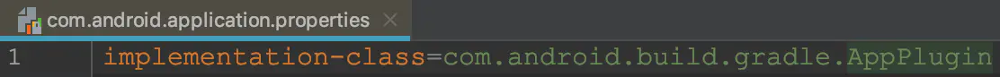
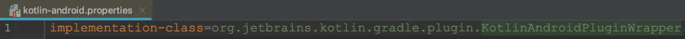
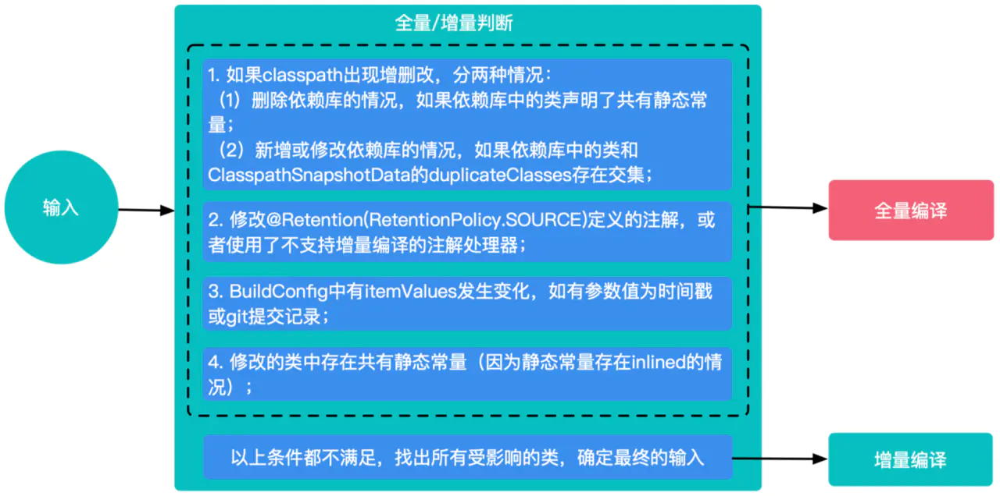
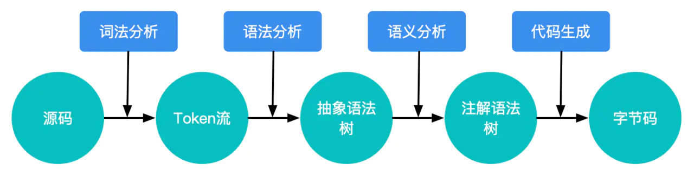
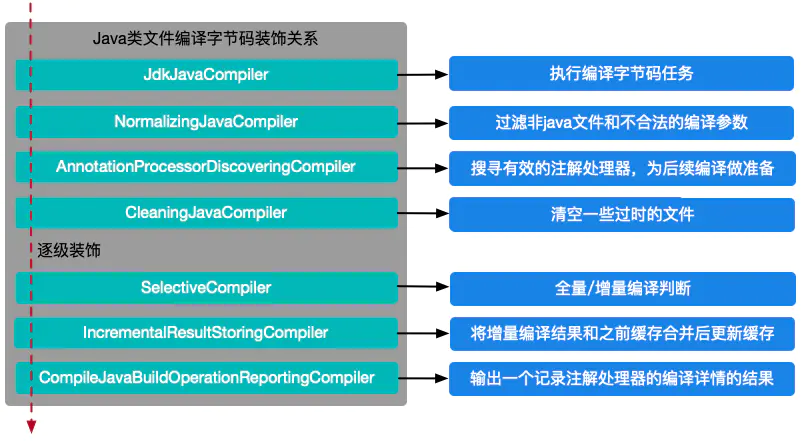
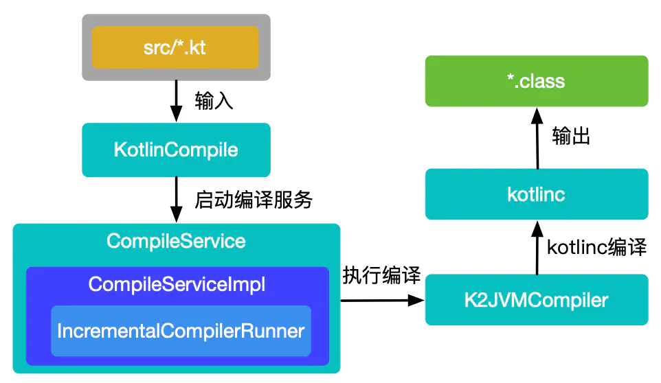
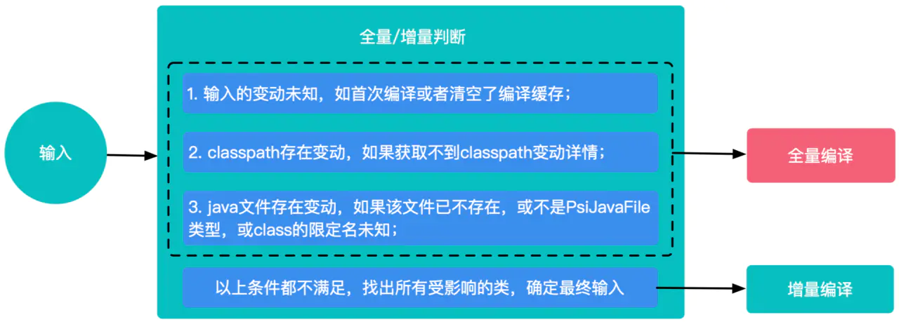
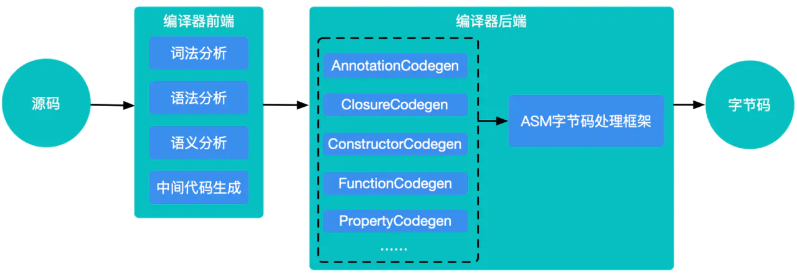

<h1 align="center">详解Android Gradle生成字节码流程</h1>

[TOC]

## 一、背景

当前绝大部分的Android工程都是使用Gradle框架搭配Android Gradle Plugin（以下简称AGP）和Kotlin Gradle Plugin（以下简称KGP）进行编译构建的。虽然市面上有很多入门介绍，但是分析其中实现细节的文章并不多。这篇文章主要介绍了AGP和KGP生成字节码的核心流程，通过这些介绍，读者将了解到Java类和Kotlin类是如何被编译为字节码的，并学习到一些加快编译速度的最佳实践。

## 二、准备工作

为了加深理解字节码的生成过程，读者需要如下一些背景知识：

### 2.1 Gradle基础

学习Gradle基础，可以参考[深入理解Android之Gradle](https://blog.csdn.net/innost/article/details/48228651)和[【Android 修炼手册】Gradle 篇 — Gradle 的基本使用](https://zhuanlan.zhihu.com/p/65249493)这两篇文章，重点掌握以下几点：

- Task是Gradle构建中最核心的概念，Android工程的构建过程也是被分成了无数个Task按照一定的顺序执行，最后输出apk产物；
- Gradle构建生命周期分三个阶段：初始化阶段，配置阶段和执行阶段，每个阶段都有不同的作用；
- Gradle构建过程中有三个非常重要的类：Gradle，Project，Setting，每个类都有不同的作用。

### 2.2 AGP和KGP构建流程

AGP是谷歌团队为了支持Android工程构建所开发的插件。AGP在Gradle的基础上，新增了一些与Android工程构建相关的Task。AGP的基本构建流程可以参考[【Android 修炼手册】Android Gradle Plugin](https://zhuanlan.zhihu.com/p/66052867) 插件主要流程。如果我们在工程中也使用了Kotlin语言来开发，则需要依赖KGP插件来编译Kotlin文件。

只有找到插件的入口类，才能分析插件的源码。Android项目中每个子工程的build.gradle脚本文件通过apply引用的插件id，实际上也是该插件入口类声明的文件名。比如：“com.android.application”和“kotlin-android”插件的入口分别为AppPlugin和KotlinAndroidPluginWrapper，入口声明如下：





### 2.3 工程和调试

StudyGradleDemo是一个Demo工程，可以用于调试AGP和KGP编译过程，也可以用于阅读和分析AGP、KGP源码，读者可按需自行下载。

- AGP: 依赖包gradle-3.5.0-source.jar，入口类：AppPlugin
- KGP: 依赖包kotlin-gradle-plugin-1.3.50-source.jar，入口类：KotlinAndroidPluginWrapper

Gradle调试方法可以参照官方教程Debugging build logic。总结来说：

- 创建Remote调试任务；
- 命令行输入开始调试命令，注意红框中的任务也可以改成其他debug的任务：
- 
- 点击Android Studio中的debug按钮开启调试；

### 2.4 其他说明

AGP和KGP当下依然在不定期的升级，不同的版本，类中方法的实现可能有所不同，但是核心的实现应该都一样。本文基于的源码版本如下：

- gradle-wrapper.properites/gradle-5.6.1-all.zip
- build.gradle.kts/org.jetbrains.kotlin:kotlin-gradle-plugin:1.3.50
- build.gradle.kts/com.android.tools.build:gradle:3.5.0

## 三、Java类文件字节码编译流程

### 3.1 任务名

compile(Flavor)JavaWithJavac

### 3.2 实现类

AndroidJavaCompile

### 3.3 整体实现图


如上图所示：当编译Java类文件时，AndroidJavaCompile和JavaCompile首先做一些预处理操作，如校验注解类型，判断编译配置是否允许增量编译等。如果配置为增量编译，则使用SelectiveCompiler对输入做全量/增量的判断（注意并不是所有的修改都会进行增量编译，有些修改可能会触发全量编译），这些判断是在JavaRecompilationSpecProvider的processClasspathChanges和processOtherChanges方法中完成。如果判断结果为全量编译，则直接走接下来的编译流程；如果判断结果为增量编译，还会进一步确定修改的影响范围，并把所有受到影响的类都作为编译的输入，再走接下来的编译流程。最后的编译流程是使用JdkJavaCompiler执行编译任务，用javac将类文件编译为字节码。

### 3.4 调用链路

这里给出了Java类文件生成字节码的核心调用链路（实现类和具体方法），读者可参考该调用链路自行翻阅源码。

```
/* ------ 编译java文件准备阶段 ------ */
-> AndroidJavaCompile.compile
-> JavaCompile.compile
/* ------ 两种编译方式可选，本例选择跟踪：增量编译 ------ */
-> JavaCompile.performCompilation
-> CompileJavaBuildOperationReportingCompiler.execute
-> IncrementalResultStoringCompiler.execute
-> SelectiveCompiler.execute
/* ------ 搜索增量编译范围 ------ */
-> JavaRecompilationSpecProvider.provideRecompilationSpec
-> JavaRecompilationSpecProvider.processOtherChanges
-> InputChangeAction.execute
-> SourceFileChangeProcessor.processChange
-> PreviousCompilation.getDependents
-> ClassSetAnalysis.getRelevantDependents
/* ------ 编译任务执行 ------ */
-> CleaningJavaCompilerSupport.execute
-> AnnotationProcessorDiscoveringCompiler.execute
-> NormalizingJavaCompiler.execute
-> JdkJavaCompiler.execute
-> JavacTaskImpl.call
-> JavacTaskImpl.doCall
/* ------ javac执行阶段 ------ */
-> Main.compile
-> JavaCompiler.compile
-> JavaCompiler.compile2
```

### 3.5 主要代码分析

compile(Flavor)JavaWithJavac任务的入口类是AndroidJavaCompile。运行时该类首先做了注解的校验工作，然后再将类文件编译字节码。本节将从注解处理，编译方式，字节码生成，JdkJavaCompiler的拓展设计四个方面进行介绍，其他环节请读者自行查阅源码。

#### 3.5.1 注解处理

为了高效开发，我们往往会自定义一些注解来生成模板代码。在编译过程中，处理注解有两种方式：一种是直接在compile(Flavor)JavaWithJavac的Task中处理，一种是创建独立的Task处理。独立的Task又分为ProcessAnnotationsTask和KaptTask两种。

创建ProcessAnnotationsTask处理注解要求满足如下三点：

- 设置了增量编译（无论是用户主动设置还是DSL默认设置）；
- build.gradle中没有使用kapt依赖注解处理器；
- 使能了BooleanOption.ENABLE_SEPARATE_ANNOTATION_PROCESSING标志位；

如果build.gradle中使用kapt依赖注解处理器（常见于纯Kotlin工程或者Kotlin、Java混合工程），则：

- 不会创建ProcessAnnotationsTask；
- 创建KaptTask且该Task只处理注解，不处理编译；
- AndroidJavaCompile和KotlinCompile只编译，不处理注解；

如果build.gradle中没有使用kapt依赖注解处理器（常见于纯Java工程），则：

- 如果创建了ProcessAnnotationsTask，那么ProcessAnnotationsTask将负责处理注解，AndroidJavaCompile只负责进行编译，不处理注解。
- 如果没有创建ProcessAnnotationsTask，那么AndroidJavaCompile将会处理注解和编译；

AndroidJavaCompile中处理注解的源码如下，当var3不为空时，在编译字节码前会先处理注解。

```
// com.sun.tool.javac.main.JavaCompiler.java
public void compile(List<JavaFileObject> var1, List<String> var2, Iterable<? extends Processor> var3) {
    ...
    this.initProcessAnnotations(var3);
    this.delegateCompiler = this.processAnnotations(this.enterTrees(this.stopIfError(CompileState.PARSE, this.parseFiles(var1))), var2);
    ...
}
```

#### 3.5.2 编译方式

一般而言，我们首次打开工程或者执行了clean project操作之后，编译器会把工程中的全部文件编译一次，把编译过程中的一些中间产物进行缓存，即为全量编译。如果后面又触发了一次编译，编译器首先会把变化内容和之前缓存的内容做对比，找出所有需要重新编译的文件，然后只对这些文件进行重新编译，其他的仍然复用之前的缓存，即为增量编译。通常来讲，增量编译的速度肯定快于全量编译，平时开发过程中，我们用到更多的应该也是增量编译。

将Java类文件编译为字节码支持全量编译和增量编译两种方式。当编译配置支持增量编译时，AGP会在JavaRecompilationSpecProvider类的processClasspathChanges方法和processOtherChanges方法中拿当前输入的修改内容和之前缓存的编译内容做对比。下面给出了processOtherChanges方法的源码，可以看出AGP主要从源文件、注解处理器，资源等方面进行了对比。

```
// JavaRecompilationSpecProvider.java
private void processOtherChanges(CurrentCompilation current, PreviousCompilation previous, RecompilationSpec spec) {
    SourceFileChangeProcessor javaChangeProcessor = new SourceFileChangeProcessor(previous);
    AnnotationProcessorChangeProcessor annotationProcessorChangeProcessor = new AnnotationProcessorChangeProcessor(current, previous);
    ResourceChangeProcessor resourceChangeProcessor = new ResourceChangeProcessor(current.getAnnotationProcessorPath());
    InputChangeAction action = new InputChangeAction(spec, javaChangeProcessor, annotationProcessorChangeProcessor, resourceChangeProcessor, this.sourceFileClassNameConverter);
    this.inputs.outOfDate(action);
    this.inputs.removed(action);
}
```

如果输入的修改内容满足了全量编译的条件，则会触发全量编译；否则会执行增量编译。全量/增量判断的示意图如下：



上图中的判断条件是通过调试源码提炼出来的，从这些判断条件可以看出，开发过程中一些不经意的书写习惯可能会触发全量编译，所以我们应该有意识地改变这些书写习惯。另外Gradle官网也对一些判断条件作了解释，详情参阅Incremental Java compilation。

除了上述情况外，编译过程还有一个非常重要的概念：类的依赖链。举个例子：定义了一个类A，然后类B引用了类A，然后类C有使用类B的一个方法，然后类D又引用了类C，这样A-B-C-D就构成一条类的依赖链。假如类A被修改了，AGP会用递归的方式找出所有这个类A相关的类依赖链，本例中即为A-B-C-D。在得到整个类依赖链之后，AGP会把这个依赖链作为输入进行编译，如此一来，看似只是修改了一个类，实际被编译的可能是多个类文件。如果依赖链复杂，只修改一个类却编译上千的类也不是不可能，这样就出现了compile(Flavor)JavaWithJavac非常耗时的情况。AGP中递归搜寻类的依赖链源码如下：

```
// ClassSetAnalysis.java
private void recurseDependentClasses(Set<String> visitedClasses, Set<String> resultClasses, Set<GeneratedResource> resultResources, Iterable<String> dependentClasses) {
    Iterator var5 = dependentClasses.iterator();
    while(var5.hasNext()) {
        String d = (String)var5.next();
        if (visitedClasses.add(d)) {
            if (!this.isNestedClass(d)) {
                resultClasses.add(d);
            }
            DependentsSet currentDependents = this.getDependents(d);
            if (!currentDependents.isDependencyToAll()) {
                resultResources.addAll(currentDependents.getDependentResources());
                this.recurseDependentClasses(visitedClasses, resultClasses, resultResources, currentDependents.getDependentClasses());
            }
        }
    }
}
```

AGP为什么不只编译当前修改的类，而是要编译整个类依赖链呢？笔者认为这其实涉及到自动化编译中一个非常重要的问题：在通用场景下，自动化编译的自动化边界如何确定？比如本例中：AGP如何知道被修改的文件是否会影响其下游？这个问题很难回答，通常需要结合具体的场景来分析。AGP作为一个通用的编译工具，首要考虑的应该是准确性，在保证准确性的基础上再考虑速度问题。所以AGP增量编译的方案编译了整个类的依赖链。在开发过程中，我们可以从实际场景出发，在速度和准确性方面做出一定的取舍，如：release包要发到线上必须要正确性，而debug阶段为了加快编译速度，尽快看到效果，不追求绝对正确性，这样就可以针对性的做出优化了。

#### 3.5.3 字节码生成

在增量编译确定了最终的输入类文件后，接下来的任务就是将类文件编译为字节码，即javac执行过程。AGP的javac过程最终是通过调用JDK 的Java Compiler API来实现的。javac将Java类编译成字节码文件需要经过语法解析、词法解析、语义解析、字节码生成四个步骤。如下图：



javac过程是深入理解JVM的一部分，我们在此就不做深入介绍了，读者可以自行查阅。javac最终通过Gen类将语义解析后的语法树转换成字节码，并将字节码写入*.class文件。

#### 3.5.4 JdkJavaCompiler的拓展设计

javac最终执行前需要提前做一些准备工作，如编译参数的校验，收集注解处理器；执行后也需要做一些处理工作，如对返回结果的封装，日志记录等；AGP使用了装饰模式来实现这一流程，下面是其中一层装饰的源码：

```
// DefaultJavaCompilerFactory.java
public Compiler<JavaCompileSpec> create(Class<? extends CompileSpec> type) {
    Compiler<JavaCompileSpec> result = this.createTargetCompiler(type, false);
    return new AnnotationProcessorDiscoveringCompiler(new NormalizingJavaCompiler(result), this.processorDetector);
}

// AnnotationProcessorDiscoveringCompiler.java
public class AnnotationProcessorDiscoveringCompiler<T extends JavaCompileSpec> implements Compiler<T> {
    private final Compiler<T> delegate;
    private final AnnotationProcessorDetector annotationProcessorDetector;

    public AnnotationProcessorDiscoveringCompiler(Compiler<T> delegate, AnnotationProcessorDetector annotationProcessorDetector) {
        this.delegate = delegate;
        this.annotationProcessorDetector = annotationProcessorDetector;
    }

    public WorkResult execute(T spec) {
        Set<AnnotationProcessorDeclaration> annotationProcessors = this.getEffectiveAnnotationProcessors(spec);
        spec.setEffectiveAnnotationProcessors(annotationProcessors);
        return this.delegate.execute(spec);
    }
    ...
}
```

我们先分析DefaultJavaCompilerFactory类中的create方法，这个方法首先通过createTargetCompiler()方法创建了一个目标Compiler（debug可以发现是JdkJavaCompiler），然后将该目标Compiler作为构造参数创建了NormalizingJavaCompiler，最后将NormalizingJavaCompiler实例作为构造参数创建了AnnotationProcessorDiscoveringCompiler，并将该实例返回。这些Compiler类都继承了Compiler接口，最终负责执行的是接口中的execute方法。从AnnotationProcessorDiscoveringCompiler的execute方法中，我们可以看到先执行了getEffectiveAnnotationProcessors方法去搜寻有效的注解处理器，最后调用了delegate的execute方法，也就是继续执行NormalizingJavaCompiler的execute方法，以此类推，最后再执行JdkJavaCompiler的execute方法。

由此可见，AGP在生成字节码的过程中，创建了多层装饰来将核心的字节码生成功能和其他一些装饰功能区分开，这样设计可以简化核心Compiler类，也有了更好的拓展性，这种设计思路是我们需要学习的一点。整个字节码生成过程中Compiler装饰关系如下图所示：



## 四、Kotlin类文件字节码编译流程

### 4.1 任务名

compile(Flavor)Kotlin

### 4.2 实现类

KotlinCompile, CompileServiceImpl

### 4.3 整体实现图



如上图所示：编译Kotlin类文件时，先由KotlinCompile做一些准备工作，如创建临时输出文件等。然后启动编译服务CompileService，并在该服务的实现类CompileServiceImpl中完成全量编译和增量编译的判断工作，最后由K2JVMCompiler执行编译，用kotlinc将Kotlin类文件编译为字节码。

### 4.4 调用链路

这里给出了Kotlin类文件生成字节码的核心调用链路（实现类和具体方法），读者可参考该调用链路自行翻阅源码。

```
/* ------ 编译kotlin文件准备阶段，配置环境及参数 ------ */
-> KotlinCompile.callCompilerAsync
-> GradleCompilerRunner.runJvmCompilerAsync
-> GradleCompilerRunner.runCompilerAsync
-> GradleKotlinCompilerWork.run
-> GradleKotlinCompilerWork.compileWithDaemonOrFallbackImpl
/* ------ 三种编译策略可选，本例选择跟踪：daemon策略 ------ */
-> GradleKotlinCompilerWork.compileWithDaemon
/* ------ 两种编译方式可选，本例选择跟踪：增量编译 ------ */
-> GradleKotlinCompilerWork.incrementalCompilationWithDaemon
/* ------ 启动编译服务 ------ */
-> CompileServiceImpl.compile
-> CompileServiceImplBase.compileImpl
-> CompileServiceImplBase.doCompile
/* ------ 执行增量编译 ------ */
-> CompileServiceImplBase.execIncrementalCompiler
-> IncrementalCompilerRunner.compile
-> IncrementalCompilerRunner.compileIncrementally
-> IncrementalJvmCompilerRunner.runCompiler
/* ------ kotlinc执行阶段 ------ */
-> CLITool.exec
-> CLICompiler.execImpl
-> K2JVMCompiler.doExecute
-> KotlinToJVMBytecodeCompiler.compileModules
```

### 4.5 主要代码分析

在AbstractAndroidProjectHandler类中有这样一段代码：

```
// AbstractAndroidProjectHandler.kt
internal fun configureJavaTask(kotlinTask: KotlinCompile, javaTask: AbstractCompile, logger: Logger) {
    ...
    javaTask.dependsOn(kotlinTask)
    ...
}
```

我们可以看到Kotlin文件字节码编译是在Java文件字节码编译之前完成的。为什么要把Kotlin编译放到Java编译之前呢？官方并没有给出解释，所以这里的理解就仁者见仁智者见智了，一种比较合理的解释是：一般来讲，语言的发展都是向前兼容的，即后来的语言会兼容之前语言的特性。我们开发过程中很多情况下都是Kotlin和Java代码相互之间混合调用的，所以理论上来讲，如果Kotlin工程依赖了Java的Library工程应该是可以兼容并编译成功的，反过来如果Java工程依赖了Kotlin的Library工程可能就会出现不兼容的情况，所以应该先编译Kotlin的文件。

compile(Flavor)Kotlin任务的入口类是KotlinCompile，运行时该类首先做一些编译准备工作，如参数校验工作，然后再将类文件编译字节码。本节将重点介绍编译策略，编译方式，字节码生成三个部分的实现，其他部分请读者自行查阅源码。

#### 4.5.1 编译策略

从GradleKotlinCompilerWork类的compileWithDaemonOrFallbackImpl方法中，我们可以看到在Kotlin文件编译过程中，根据编译参数设置的不同，有三种可选的编译策略：daemon, in-process, out-of-process。三种编译策略的差异主要体现在编译任务的运行方式上：

- daemon策略：在daemon进程中启动编译服务，后续将Kotlin文件编译为字节码都由该服务完成，支持增量编译，默认采用此策略；
- in-process策略：直接在当前线程中将Kotlin编译为字节码，该策略不支持增量编译，一般调试编译过程可以尝试此策略；
- out-of-process策略：新起一个进程来将Kotlin编译为字节码，进程起失败则编译失败，该策略不支持增量编译。

按笔者理解：daemon策略应该是编译最快的策略，out-of-process策略应该是编译最慢的策略，in-process策略应该介于这两个策略之间。因为通常来讲，在Gradle开启编译流程前就已经启动了daemon进程，daemon策略下可以直接启动编译服务并执行编译过程，这样原进程也可以去并行执行其他任务，并且还支持增量编译；而out-of-process策略需要启动一个全新的进程，并且不支持增量编译，所以编译耗时应该最久；有时为了方便调试，可以考虑使用in-process策略。

那应该怎么配置编译策略呢？有两种配置方式：

在全局的gradle.property（注意：全局的gradle目录一般是/User/.gradle/gradle.property，gradle.property不存在时需新建，而非当前工程的gradle.property）下使用如下配置：

```
kotlin.compiler.execution.strategy=???(可选项：daemon/in-process/out-of-process)
org.gradle.daemon=???(可选项：true/false)
```

在调试命令后增加调试参数，指定编译策略。示例如下：

```bash
> ./gradlew <task> -Dorg.gradle.debug=true -Dkotlin.compiler.execution.strategy=in-process -Dorg.gradle.daemon=false
```

#### 4.5.2 编译方式

和AGP一样，KGP同样支持增量编译和全量编译两种方式。编译过程是否采用增量编译主要取决于KotlinCompile类的incremental属性，该属性初始化时被设置为true，并且后续的编译过程并没有修改该属性，所以KGP默认支持增量编译。增量编译的核心判断源码如下：

```
// KotlinCompile.kt
init {
    incremental = true
}

// GradleKotlinCompilerWork.kt
private fun compileWithDaemon(messageCollector: MessageCollector): ExitCode? {
    ...
    val res = if (isIncremental) {
        incrementalCompilationWithDaemon(daemon, sessionId, targetPlatform, bufferingMessageCollector)
    } else {
        nonIncrementalCompilationWithDaemon(daemon, sessionId, targetPlatform, bufferingMessageCollector)
    }
    ...
}
```

同AGP一样，KGP会在IncrementalJvmCompilerRunner类的calculateSourcesToCompile方法中进行全量/增量编译的判断，满足全量编译的条件则会触发全量编译，否则会执行增量编译。全量/增量判断的示意图如下：



执行增量编译前，KGP也会通过递归的方式搜寻出类的编译链，搜寻结果将作为增量编译的输入。在增量编译完成后，KGP会将增量编译的中间产物和原有缓存的中间产物合并，并更新缓存。KGP最终是通过IncrementalCompilerRunner类的compileIncrementally方法来执行增量编译的。上述过程的源码如下：

```kotlin
// IncrementalCompilerRunner.kt
private fun compileIncrementally(args: Args, caches: CacheManager, allKotlinSources: List<File>, compilationMode: CompilationMode, messageCollector: MessageCollector): ExitCode {
    ...
    val complementaryFiles = caches.platformCache.getComplementaryFilesRecursive(dirtySources)
    ...
    exitCode = runCompiler(sourcesToCompile.toSet(), args, caches, services, messageCollectorAdapter)
    ...
    caches.platformCache.updateComplementaryFiles(dirtySources, expectActualTracker)
    ...
}
```

#### 4.5.3 字节码生成

确定了最终输入后，接下来便是生成字节码，即kotlinc执行过程。执行kotlinc的入口是K2JVMCompiler的doExecute方法。这个方法首先会配置编译的参数，并做一些编译准备工作（比如创建临时文件夹和临时输出文件），准备工作结束后调用KotlinToJVMBytecodeCompiler的repeatAnalysisIfNeeded做词法分析、语法分析和语义分析，最后调用DefaultCodegenFactory的generateMultifileClass方法来生成字节码。Kotlin类文件生成字节码的流程图如下：



如上图所示：kotlic在词法分析、语法分析、语义分析这些流程上和javac基本一致，但是目标代码生成阶段与javac有较大的区别。这里的区别主要有两点：一是双方生成字节码的方式不一样，javac通过自带的Gen类生成字节码，kotlinc通过ASM生成字节码；二是kotlinc在这个阶段通过各种Codegen做了很多自身语法糖的解析工作。比如属性自动生成Getter/Setter代码、reified修饰的方法中解析过程等。由此可见：我们在夸kotlin语言简洁的时候，实际上编译器在编译过程中帮我们做了很多的转换工作。Kotlin语法糖解析源码示例：

```kotlin
// PropertyCodegen.java
private void gen(@NotNull KtProperty declaration, @NotNull PropertyDescriptor descriptor, @Nullable KtPropertyAccessor getter, @Nullable KtPropertyAccessor setter) {
    ...
    if (isAccessorNeeded(declaration, descriptor, getter, isDefaultGetterAndSetter)) {
        generateGetter(descriptor, getter);
    }
    if (isAccessorNeeded(declaration, descriptor, setter, isDefaultGetterAndSetter)) {
        generateSetter(descriptor, setter);
    }
}
```

## 五、最佳实践

通过上述分析，相信读者已经对Android工程中Java类文件和Kotlin类文件生成字节码的过程了然于胸了。下面我们来总结一些最佳实践来避免本应增量编译却触发全量编译的情况发生，从而加快编译的速度。

### 5.1 修复增量编译失效

增量编译失效，意味着本次修改将会进行全量编译，那么编译时间必然会增加，所以我们应该从以下几个方面来改善我们的代码：

- BuildConfig中的itemValue如果存在动态变化的值，建议区分场景，如release包变，开发调试包不变；
- 将注解处理器修改为支持增量的注解处理器，修改方法请参考官网Incremental annotation processing；
- 如果类中有定义一些公有静态常量需要被外部引用，尝试改为静态方法去获取，而不是直接引用，例如：

```java
public class Constants {
    private static String TAG = "Constans";

    // 暴露静态方法给外部引用
    public static String getTag() {
        return TAG;
    }
}
```

### 5.2 类编译链过长

为了避免类的依赖链过长，我们应该尽可能拆分解耦业务，如推进组件化，并将模块之间的依赖关系改为二进制依赖而非源码依赖。只有这样，才有可能减少类依赖链的长度，进而减少Task的执行时间。

## 六、总结

至此，Java类和Kotlin类生成字节码的流程就介绍完了，最后我们来总结一下：编译Java类时，AGP通过AndroidJavaCompile先做一些预处理操作，然后进行全量/增量编译的判断，最终通过javac生成字节码。编译Kotlin类时，KGP通过KotlinCompile先做一些准备工作，然后进行全量/增量编译的判断，最终通过kotlinc生成字节码。最后，为了加快编译速度，本文给出了最佳实践。

## 七、参考资料

- [深入理解Android之Gradle](https://blog.csdn.net/innost/article/details/48228651)
- [【Android 修炼手册】Gradle 篇 — Gradle 的基本使用](https://zhuanlan.zhihu.com/p/65249493)
- [【Android 修炼手册】Android Gradle Plugin 插件主要流程](https://zhuanlan.zhihu.com/p/66052867)
- [Incremental Java compilation](https://docs.gradle.org/current/userguide/java_plugin.html#sec:incremental_compile)
- [Kotlin 实践及原理](http://www.jackywang.tech/2019/01/30/Kotlin-实践及原理/)
- [Kotlin 编译之路 “Kotlin编译器”](https://zhuanlan.zhihu.com/p/76622754)
- [Incremental annotation processing](https://docs.gradle.org/nightly/userguide/java_plugin.html#sec:incremental_annotation_processing)

## 来源

* [详解Android Gradle生成字节码流程](http://www.androidchina.net/10264.html)

