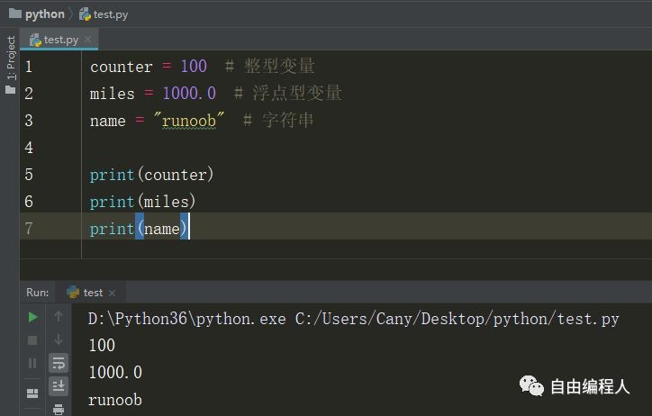
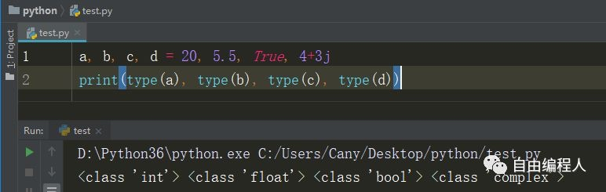
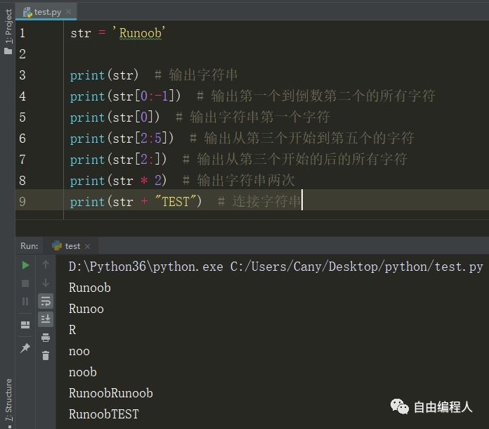
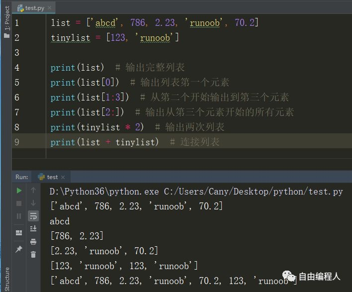
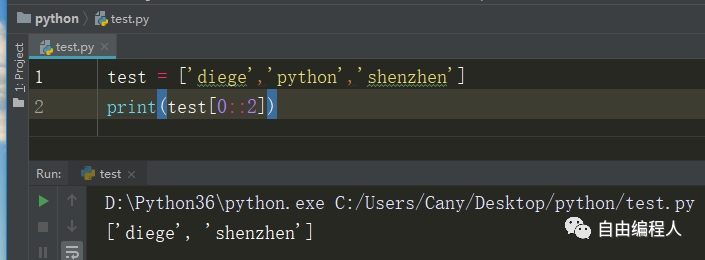
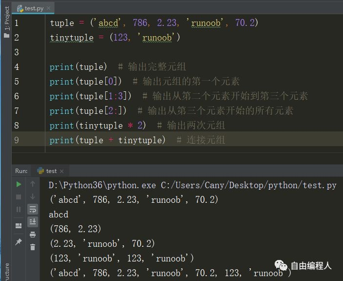
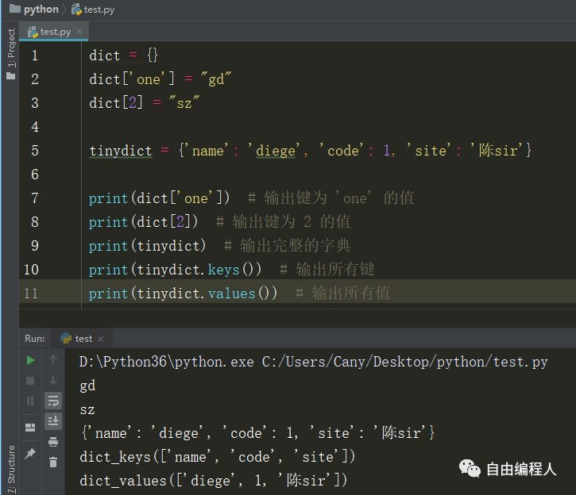
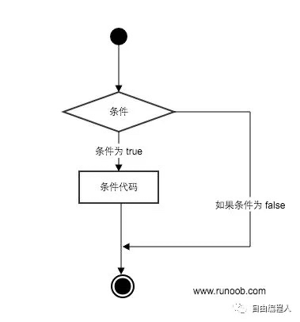
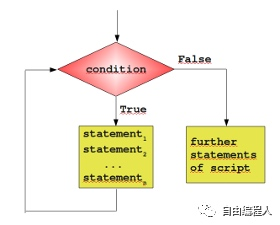

<h1 align="center">一文让你学完Python</h1>

[toc]

## 一 、 python入门和基本语法

<center>Python 简介</center>

Python 是一个高层次的结合了解释性、编译性、互动性和面向对象的脚本语言。

Python 的设计具有很强的可读性，相比其他语言经常使用英文关键字，其他语言的一些标点符号，它具有比其他语言更有特色语法结构。

Python 是一种解释型语言：这意味着开发过程中没有了编译这个环节。类似于PHP和Perl语言。

Python 是交互式语言：这意味着，您可以在一个 Python 提示符 >>> 后直接执行代码。

Python 是面向对象语言: 这意味着Python支持面向对象的风格或代码封装在对象的编程技术。

### Python 特点

1.易于学习：Python有相对较少的关键字，结构简单，和一个明确定义的语法，学习起来更加简单。

2.易于阅读：Python代码定义的更清晰。

3.易于维护：Python的成功在于它的源代码是相当容易维护的。

4.一个广泛的标准库：Python的最大的优势之一是丰富的库，跨平台的，在UNIX，Windows和Macintosh兼容很好。

5.互动模式：互动模式的支持，您可以从终端输入执行代码并获得结果的语言，互动的测试和调试代码片断。

6.可移植：基于其开放源代码的特性，Python已经被移植（也就是使其工作）到许多平台。

7.可扩展：如果你需要一段运行很快的关键代码，或者是想要编写一些不愿开放的算法，你可以使用C或C++完成那部分程序，然后从你的Python程序中调用。

8.数据库：Python提供所有主要的商业数据库的接口。

9.GUI编程：Python支持GUI可以创建和移植到许多系统调用。

10.可嵌入: 你可以将Python嵌入到C/C++程序，让你的程序的用户获得"脚本化"的能力。

### python环境安装

网上有很多教程，读者可自行搜索，在此不再赘述。

### 查看python版本

我们可以在命令窗口(Windows 使用 win+R 调出 cmd 运行框)使用以下命令查看我们使用的Python版本：

```Python
python -V
```

你也可以进入Python的交互式编程模式，查看版本：

```Python
Python 3.3.2 (v3.3.2:d047928ae3f6, May 16 2013, 00:03:43) [MSC v.1600 32 bit (Intel)] on win32
Type "copyright", "credits" or "license()" for more information.
>>>
```

### 第一个Python3.x程序

对于大多数程序语言，第一个入门编程代码便是"Hello World！"，以下代码为使用Python输出"Hello World！"：
实例(Python 3.0+)

```Python
#!/usr/bin/python3

print("Hello, World!")
```

运行实例 
你可以将以上代码保存在 hello.py 文件中并使用 python 命令执行该脚本文件。

```Python
$ python3 hello.py
```

以上命令输出结果为：

```
Hello, World!
```

<center>Python3 基础语法</center>

### 编码

默认情况下，Python 3 源码文件以 UTF-8 编码，所有字符串都是 unicode 字符串。当然你也可以为源码文件指定不同的编码：

```Python
# -*- coding: cp-1252 -*-
```

上述定义允许在源文件中使用 Windows-1252 字符集中的字符编码，对应适合语言为保加利亚语、白罗斯语、马其顿语、俄语、塞尔维亚语。

### 标识符

* 第一个字符必须是字母表中字母或下划线 _ 。
* 标识符的其他的部分由字母、数字和下划线组成。
* 标识符对大小写敏感。

在 Python 3 中，非 ASCII 标识符也是允许的了。

### python保留字

保留字即关键字，我们不能把它们用作任何标识符名称。Python 的标准库提供了一个 keyword 模块，可以输出当前版本的所有关键字：

```Python
>>> import keyword
>>> keyword.kwlist
['False', 'None', 'True', 'and', 'as', 'assert', 'break', 'class', 'continue', 'def', 'del', 'elif', 'else', 'except', 'finally', 'for', 'from', 'global', 'if', 'import', 'in', 'is', 'lambda', 'nonlocal', 'not', 'or', 'pass', 'raise', 'return', 'try', 'while', 'with', 'yield']
```

### 注释

Python中单行注释以 # 开头，实例如下：
实例(Python 3.0+)

```Python
#!/usr/bin/python3

# 第一个注释
print ("Hello, Python!") # 第二个注释
```

执行以上代码，输出结果为：

```
Hello, Python!
```

多行注释可以用多个 # 号，还有 ''' 和 """：
实例(Python 3.0+)

```Python
#!/usr/bin/python3

# 第一个注释
# 第二个注释

'''
第三注释
第四注释
'''

"""
第五注释
第六注释
"""
print ("Hello, Python!")
```

执行以上代码，输出结果为：

```
Hello, Python!
```

### 行与缩进

python最具特色的就是使用缩进来表示代码块，不需要使用大括号 {} 。
缩进的空格数是可变的，但是同一个代码块的语句必须包含相同的缩进空格数。实例如下：
实例(Python 3.0+)

```Python
if True:
    print ("True")
else:
    print ("False")
```

以下代码最后一行语句缩进数的空格数不一致，会导致运行错误：

```Python
if True:
    print ("Answer")
    print ("True")
else:
    print ("Answer")
  print ("False")    # 缩进不一致，会导致运行错误
```

以上程序由于缩进不一致，执行后会出现类似以下错误：

```Python
 File "test.py", line 6
    print ("False")    # 缩进不一致，会导致运行错误
                                      ^
IndentationError: unindent does not match any outer indentation level
```

### 多行语句

Python 通常是一行写完一条语句，但如果语句很长，我们可以使用反斜杠()来实现多行语句，例如：

```Python
total = item_one + \
        item_two + \
        item_three
```

在 [], {}, 或 () 中的多行语句，不需要使用反斜杠()，例如：

```Python
total = ['item_one', 'item_two', 'item_three',
        'item_four', 'item_five']
```

### 数字(Number)类型

python中数字有四种类型：整数、布尔型、浮点数和复数。
int (整数), 如 1, 只有一种整数类型 int，表示为长整型，没有 python2 中的 Long。

* bool (布尔), 如 True。
* float (浮点数), 如 1.23、3E-2
* complex (复数), 如 1 + 2j、 1.1 + 2.2j

### 字符串(String)

* python中单引号和双引号使用完全相同。
* 使用三引号('''或""")可以指定一个多行字符串。
* 转义符 '\'
* 反斜杠可以用来转义，使用r可以让反斜杠不发生转义。。如 r"this is a line with \n" 则\n会显示，并不是换行。
* 按字面意义级联字符串，如"this " "is " "string"会被自动转换为this is string。
* 字符串可以用 + 运算符连接在一起，用 * 运算符重复。
* Python 中的字符串有两种索引方式，从左往右以 0 开始，从右往左以 -1 开始。
* Python中的字符串不能改变。
* Python 没有单独的字符类型，一个字符就是长度为 1 的字符串。
* 字符串的截取的语法格式如下：变量[头下标:尾下标:步长]

```Python
word = '字符串'
sentence = "这是一个句子。"
paragraph = """这是一个段落，
可以由多行组成"""
```

实例(Python 3.0+)

```Python
#!/usr/bin/python3

str='Runoob'

print(str)                 # 输出字符串
print(str[0:-1])           # 输出第一个到倒数第二个的所有字符
print(str[0])              # 输出字符串第一个字符
print(str[2:5])            # 输出从第三个开始到第五个的字符
print(str[2:])             # 输出从第三个开始的后的所有字符
print(str * 2)             # 输出字符串两次
print(str + '你好')        # 连接字符串

print('------------------------------')

print('hello\nrunoob')      # 使用反斜杠(\)+n转义特殊字符
print(r'hello\nrunoob')     # 在字符串前面添加一个 r，表示原始字符串，不会发生转义
```

这里的 r 指 raw，即 raw string。
输出结果为：

```Python
Runoob
Runoo
R
noo
noob
RunoobRunoob
Runoob你好
------------------------------
hello
runoob
hello\nrunoob
```

### 多个语句构成代码组

**缩进相同的一组语句构成一个代码块，我们称之代码组。**
像if、while、def和class这样的复合语句，首行以关键字开始，以冒号( : )结束，该行之后的一行或多行代码构成代码组。
我们将首行及后面的代码组称为一个子句(clause)。
如下实例：

```Python
if expression : 
   suite
elif expression : 
   suite 
else : 
   suite
```

### import 与 from...import

**在 python 用 import 或者 from...import 来导入相应的模块。**
将整个模块(somemodule)导入，格式为：import somemodule
从某个模块中导入某个函数,格式为：from somemodule import somefunction
从某个模块中导入多个函数,格式为：from somemodule import firstfunc, secondfunc, thirdfunc
将某个模块中的全部函数导入，格式为：from somemodule import *
导入 sys 模块

```Python
import sys
print('================Python import mode==========================');
print ('命令行参数为:')
for i in sys.argv:
    print (i)
print ('\n python 路径为',sys.path)
```

导入 sys 模块的 argv,path 成员

```Python
from sys import argv,path  #  导入特定的成员

print('================python from import===================================')
print('path:',path) # 因为已经导入path成员，所以此处引用时不需要加sys.path
```

## 二 、Python基本数据类型

Python 中的变量不需要声明。每个变量在使用前都必须赋值，变量赋值以后该变量才会被创建。
在 Python 中，变量就是变量，它没有类型，我们所说的"类型"是变量所指的内存中对象的类型。
等号（=）用来给变量赋值。等号（=）运算符左边是一个变量名,等号（=）运算符右边是存储在变量中的值。


### 多个变量赋值

同值多变量

```Python
a =b =
```

不同值多变量

```Python
a, b, c = 1, 2, "hello word"

a = 1
b = 2
c = "hello word"
```

### 标准数据类型

不可变数据类型

* Number（数字）
* String（字符串）
* Tuple（元组）

可变数据类型

* List（列表）
* Set（集合）
* Dictionary（字典）

### Number 数字

支持 int、float、bool、complex（复数）。


### String 字符串

变量[头下标:尾下标]索引值以 0 为开始值，-1 为从末尾的开始位置。Python中的字符串有两种索引方式，从左往右以0开始，从右往左以-1开始，且字符串不能改变。


Python 使用反斜杠()转义特殊字符，如果你不想让反斜杠发生转义，可以在字符串前面添加一个 r，表示原始字符串。


### List 列表

变量[头下标:尾下标]索引值以 0 为开始值，-1 为从末尾的开始位置。和字符串一样，列表同样可以被索引和截取，列表被截取后返回一个包含所需元素的新列表。与字符串不同的是List中的元素是可以改变的。


Python 列表截取可以接收第三个参数，参数作用是截取的步长来截取字符串，一下实例0到最后一个元素，以步长为2截取，也是就截取0和3位置。


### Tuple 元组

元组（tuple）与列表类似，不同之处在于元组的元素不能修改。元组写在小括号 () 里，元素之间用逗号隔开。元组中的元素类型也可以不相同。


### Dictionary 字典

* 列表是有序的对象集合，字典是无序的对象集合。两者之间的区别在于：字典当中的元素是通过键来存取的，而不是通过偏移存取。
* 字典是一种映射类型，字典用 { } 标识，它是一个无序的 键(key) : 值(value) 的集合。
* 键(key)必须使用不可变类型。
* 在同一个字典中，键(key)必须是唯一的。
* 字典的关键字必须为不可变类型，且不能重复。
  

## 三 、 Python 条件控制语句

Python 条件语句是通过一条或多条语句的执行结果（True 或者 False）来决定执行的代码块。
可以通过下图来简单了解条件语句的执行过程:


### if 语句

Python中if语句的一般形式如下所示：

```Python
if condition_1:
    statement_block_1
elif condition_2:
    statement_block_2
else:
    statement_block_3
```

* 如果 "condition_1" 为 True 将执行 "statement_block_1" 块语句
* 如果 "condition_1" 为False，将判断 "condition_2"
* 如果"condition_2" 为 True 将执行 "statement_block_2" 块语句
* 如果 "condition_2" 为False，将执行"statement_block_3"块语句

Python 中用 elif 代替了 else if，所以if语句的关键字为：if – elif – else。

注意：
1、每个条件后面要使用冒号 :，表示接下来是满足条件后要执行的语句块。
2、使用缩进来划分语句块，相同缩进数的语句在一起组成一个语句块。
3、在Python中没有switch – case语句。
实例
以下是一个简单的 if 实例：
实例

```Python
#!/usr/bin/python3

var1 = 100
if var1:
    print ("1 - if 表达式条件为 true")
    print (var1)

var2 = 0
if var2:
    print ("2 - if 表达式条件为 true")
    print (var2)
print ("Good bye!")
```

执行以上代码，输出结果为：

```Python
1 - if 表达式条件为 true
100
Good bye!
```

从结果可以看到由于变量 var2 为 0，所以对应的 if 内的语句没有执行。
以下实例演示了狗的年龄计算判断：
实例

```Python
#!/usr/bin/python3

age = int(input("请输入你家狗狗的年龄: "))
print("")
if age < 0:
    print("你是在逗我吧!")
elif age == 1:
    print("相当于 14 岁的人。")
elif age == 2:
    print("相当于 22 岁的人。")
elif age > 2:
    human = 22 + (age -2)*5
    print("对应人类年龄: ", human)

### 退出提示
input("点击 enter 键退出")
```

将以上脚本保存在dog.py文件中，并执行该脚本：

```Python
$ python3 dog.py 
请输入你家狗狗的年龄: 1

相当于 14 岁的人。
点击 enter 键退出
```

以下为if中常用的操作运算符:
| 操作符 | 描述                     |
| ------ | ------------------------ |
| <      | 小于                     |
| <=     | 小于或等于               |
| >      | 大于                     |
| >=     | 大于或等于               |
| ==     | 等于，比较两个值是否相等 |
| !=     | 不等于                   |

实例

```Python
#!/usr/bin/python3

# 程序演示了 == 操作符
# 使用数字
print(5 == 6)
# 使用变量
x = 5
y = 8
print(x == y)
```

以上实例输出结果：

```Python
False
False
```

以下实例演示了数字的比较运算：
实例

```Python
#!/usr/bin/python3 

# 该实例演示了数字猜谜游戏
number = 7
guess = -1
print("数字猜谜游戏!")
while guess != number:
    guess = int(input("请输入你猜的数字："))

    if guess == number:
        print("恭喜，你猜对了！")
    elif guess < number:
        print("猜的数字小了...")
    elif guess > number:
        print("猜的数字大了...")
```

执行以上脚本，实例输出结果如下：

```Python
#!/usr/bin/python3 

# 该实例演示了数字猜谜游戏
number = 7
guess = -1
print("数字猜谜游戏!")
while guess != number:
    guess = int(input("请输入你猜的数字："))

    if guess == number:
        print("恭喜，你猜对了！")
    elif guess < number:
        print("猜的数字小了...")
    elif guess > number:
        print("猜的数字大了...")
```

### if 嵌套

在嵌套 if 语句中，可以把 if...elif...else 结构放在另外一个 if...elif...else 结构中。

```Python
if 表达式1:
    语句
    if 表达式2:
        语句
    elif 表达式3:
        语句
    else:
        语句
elif 表达式4:
    语句
else:
    语句
```

实例

```Python
# !/usr/bin/python3

num=int(input("输入一个数字："))
if num%2==0:
    if num%3==0:
        print ("你输入的数字可以整除 2 和 3")
    else:
        print ("你输入的数字可以整除 2，但不能整除 3")
else:
    if num%3==0:
        print ("你输入的数字可以整除 3，但不能整除 2")
    else:
        print  ("你输入的数字不能整除 2 和 3")
```

将以上程序保存到 test_if.py 文件中，执行后输出结果为：

```Python
$ python3 test.py 
输入一个数字：6
你输入的数字可以整除 2 和 3
```

## 四 、 Python 循环语句

Python中的循环语句有 for 和 while。
Python循环语句的控制结构图如下所示：


### while 循环

Python中while语句的一般形式：

```Python
while 判断条件：
语句
```

同样需要注意冒号和缩进。另外，在 Python 中没有 do..while 循环。
以下实例使用了 while 来计算 1 到 100 的总和：
实例

```Python
#!/usr/bin/env python3

n = 100

sum = 0
counter = 1
while counter <= n:
    sum = sum + counter
    counter += 1

print("1 到 %d 之和为: %d" % (n,sum))
```

执行结果如下：

```Python
1 到 100 之和为: 5050
```

### 无限循环

我们可以通过设置条件表达式永远不为 false 来实现无限循环，实例如下：
实例

```Python
#!/usr/bin/python3

var = 1
while var == 1 :  # 表达式永远为 true
   num = int(input("输入一个数字  :"))
   print ("你输入的数字是: ", num)

print ("Good bye!")
```

执行以上脚本，输出结果如下：

```Python
输入一个数字 :5
你输入的数字是: 5
输入一个数字 :
```

你可以使用 CTRL+C 来退出当前的无限循环。
无限循环在服务器上客户端的实时请求非常有用。

### while 循环使用 else 语句

在 while … else 在条件语句为 false 时执行 else 的语句块：
实例

```Python
#!/usr/bin/python3

count = 0
while count < 5:
   print (count, " 小于 5")
   count = count + 1
else:
   print (count, " 大于或等于 5")
```

执行以上脚本，输出结果如下：

```Python
0  小于 5
1  小于 5
2  小于 5
3  小于 5
4  小于 5
5  大于或等于 5
```

### 简单语句组

类似if语句的语法，如果你的while循环体中只有一条语句，你可以将该语句与while写在同一行中， 如下所示：
实例

```Python
#!/usr/bin/python

flag = 1

while (flag): print ('hello!')

print ("Good bye!")
```

注意：以上的无限循环你可以使用 CTRL+C 来中断循环。
执行以上脚本，输出结果如下：

```Python
hello！
hello！
hello！
...
```

### for 语句

Python for循环可以遍历任何序列的项目，如一个列表或者一个字符串。
for循环的一般格式如下：

```Python
for <variable> in <sequence>:
    <statements>
else:
    <statements>
```

Python loop循环实例：
实例

```Python
>>>languages = ["C", "C++", "Perl", "Python"] 
>>> for x in languages:
...     print (x)
... 
C
C++
Perl
Python
>>>
```

以下 for 实例中使用了 break 语句，break 语句用于跳出当前循环体：
实例

```Python
#!/usr/bin/python3

sites = ["Baidu", "Google","Runoob","Taobao"]
for site in sites:
    if site == "Runoob":
        print("test!")
        break
    print("循环数据 " + site)
else:
    print("没有循环数据!")
print("完成循环!")
```

执行脚本后，在循环到 "Runoob"时会跳出循环体：

```Python
循环数据 Baidu
循环数据 Google
test!
完成循环!
```

### range()函数

如果你需要遍历数字序列，可以使用内置range()函数。它会生成数列，例如:
实例

```Python
>>>for i in range(5):
...     print(i)
...
0
1
2
3
4
```

你也可以使用range指定区间的值：
实例

```Python
>>>for i in range(5,9) :
    print(i)


5
6
7
8
>>>
```

也可以使range以指定数字开始并指定不同的增量(甚至可以是负数，有时这也叫做'步长'):
实例

```Python
>>>for i in range(0, 10, 3) :
    print(i)


0
3
6
9
>>>
```

负数：
实例

```Python
>>>a = ['Google', 'Baidu', 'Runoob', 'Taobao', 'QQ']
>>> for i in range(len(a)):
...     print(i, a[i])
... 
0 Google
1 Baidu
2 Runoob
3 Taobao
4 QQ
>>>
```

您可以结合range()和len()函数以遍历一个序列的索引,如下所示:
实例

```Python
>>>a = ['Google', 'Baidu', 'Runoob', 'Taobao', 'QQ']
>>> for i in range(len(a)):
...     print(i, a[i])
... 
0 Google
1 Baidu
2 Runoob
3 Taobao
4 QQ
>>>
```

还可以使用range()函数来创建一个列表：
实例

```Python
>>>list(range(5))
[0, 1, 2, 3, 4]
>>>
```

### break和continue语句及循环中的else子句

break 语句可以跳出 for 和 while 的循环体。如果你从 for 或 while 循环中终止，任何对应的循环 else 块将不执行。实例如下：
实例

```Python
#!/usr/bin/python3

for letter in 'Runoob':     # 第一个实例
   if letter == 'b':
      break
   print ('当前字母为 :', letter)

var = 10                    # 第二个实例
while var > 0:              
   print ('当期变量值为 :', var)
   var = var -1
   if var == 5:
      break

print ("Good bye!")
```

执行以上脚本输出结果为：

```Python
当前字母为 : R
当前字母为 : u
当前字母为 : n
当前字母为 : o
当前字母为 : o
当期变量值为 : 10
当期变量值为 : 9
当期变量值为 : 8
当期变量值为 : 7
当期变量值为 : 6
Good bye!
```

continue语句被用来告诉Python跳过当前循环块中的剩余语句，然后继续进行下一轮循环。
实例

```Python
#!/usr/bin/python3

for letter in 'Runoob':     # 第一个实例
   if letter == 'o':        # 字母为 o 时跳过输出
      continue
   print ('当前字母 :', letter)

var = 10                    # 第二个实例
while var > 0:              
   var = var -1
   if var == 5:             # 变量为 5 时跳过输出
      continue
   print ('当前变量值 :', var)
print ("Good bye!")
```

执行以上脚本输出结果为：

```Python
当前字母 : R
当前字母 : u
当前字母 : n
当前字母 : b
当前变量值 : 9
当前变量值 : 8
当前变量值 : 7
当前变量值 : 6
当前变量值 : 4
当前变量值 : 3
当前变量值 : 2
当前变量值 : 1
当前变量值 : 0
Good bye!
```

循环语句可以有 else 子句，它在穷尽列表(以for循环)或条件变为 false (以while循环)导致循环终止时被执行,但循环被break终止时不执行。
如下实例用于查询质数的循环例子:
实例

```Python
#!/usr/bin/python3

for n in range(2, 10):
    for x in range(2, n):
        if n % x == 0:
            print(n, '等于', x, '*', n//x)
            break
    else:
        # 循环中没有找到元素
        print(n, ' 是质数')
```

执行以上脚本输出结果为：

```Python
2  是质数
3  是质数
4 等于 2 * 2
5  是质数
6 等于 2 * 3
7  是质数
8 等于 2 * 4
9 等于 3 * 3
```

### pass 语句

Python pass是空语句，是为了保持程序结构的完整性。

pass 不做任何事情，一般用做占位语句，如下实例

实例

```Python
>>>while True:
...     pass  # 等待键盘中断 (Ctrl+C)
```

## 五、 Python函数

Python中的函数，无论是命名函数，还是匿名函数，都是语句和表达式的集合。在Python中，函数是第一个类对象，这意味着函数的用法并没有限制。Python函数的使用方式就像Python中其他值一样，例如字符串和数字等。Python函数拥有一些属性，通过使用Python内置函数dir就能查看这些属性，如下代码所示：

```Python
def square(x):
return x**2

>>> square
<function square at 0x031AA230>
>>> dir(square)
['__call__', '__class__', '__closure__', '__code__', '__defaults__', '__delattr__', '__dict__', '__doc__', '__format__', '__get__', '__getattribute__', '__globals__', '__hash__', '__init__', '__module__', '__name__', '__new__', '__reduce__', '__reduce_ex__', '__repr__', '__setattr__', '__sizeof__', '__str__', '__subclasshook__', 'func_closure', 'func_code', 'func_defaults', 'func_dict', 'func_doc', 'func_globals', 'func_name']
>>>
```

其中，一些重要的函数属性包括以下几个：

1. __doc__返回指定函数的文档字符串。

```Python
def square(x):
"""return square of given number"""
return x**2

>>> square.__doc__
'return square of given number'
```

2. __name__返回函数名字。

```Python
def square(x):
"""return square of given number"""
return x**2

>>> square.func_name
'square'
```

3. __module__返回函数定义所在模块的名字。

```Python
def square(x):
"""return square of given number"""
return x**2

>>> square.__module__
'__main__'
```

4. func_defaults返回一个包含默认参数值的元组。

5. func_globals返回一个包含函数全局变量的字典引用。

```Python
def square(x):"""return square of given number"""return x**2>>> square.func_globals{'__builtins__': <module '__builtin__' (built-in)>, '__name__': '__main__', 'square': <function square at 0x10f099c08>, '__doc__': None, '__package__': None}
6. func_dict返回支持任意函数属性的命名空间。
def square(x):"""return square of given number"""return x**2>>> square.func_dict{}
```

7. func_closure返回一个胞体元组，其中胞体包含了函数自由变量的绑定。

函数可以作为参数传递给其他函数。这些以其他函数作为参数的函数通常称为更高阶函数，这就构成了函数式编程中一个非常重要的部分。高阶函数一个很好的例子就是map函数，该函数接受一个函数和一个迭代器作为参数，并将函数应用于迭代器中的每一项，最后返回一个新的列表。我们将在下面的例子中演示这一点，例子中将前面定义的square函数和一个数字迭代器传递给map函数。

```Python
>>> map(square, range(10))
[0, 1, 4, 9, 16, 25, 36, 49, 64, 81]
```

此外，函数也可以在其他函数代码块内部定义，同时也能从其他函数调用中返回。

```Python
def outer():    outer_var = "outer variable"def inner():return outer_varreturn inner
```

在上面的例子中，我们在函数outer中定义了另一个函数inner，并且当函数outer执行时将返回inner函数。此外，像任何其他Python对象一样，函数也可以赋值给变量，如下所示：

```Python
def outer():    outer_var = "outer variable"def inner():return outer_varreturn inner>>> func = outer()>>> func<function inner at 0x031AA270>>>>
```

在上面的例子中，outer函数被调用时将会返回一个函数，并将返回的函数赋值给变量func。最后，该变量就可以像被返回的函数一样被调用：

```Python
def outer():
    outer_var = "outer variable"
    def inner():
        return outer_var
    return inner

>>> func = outer()
>>> func
<function inner at 0x031AA270>
>>>
```

### 函数定义

关键字def用于创建用户自定义函数，函数定义就是一些可执行的语句。

```Python
def square(x):
return x**2
```

在上面的square函数中，当包含该函数的模块加载到Python解释器中时，或者如果该函数在Python REPL中定义，那么将会执行函数定义语句def square(x)。然而，这对以可变数据结构作为值的默认参数有一些影响，这一点我们将会在后文讲述。函数定义的执行会绑定当前本地命名空间中的函数名（可以将命名空间当作名字到值的一种映射，并且这种映射还可以嵌套，命名空间和范围会在另一个教程中详细介绍）到一个函数对象，该对象是一个对函数中可执行代码的包装器。这个函数对象包含了一个对当前全局命名空间的引用，而当前命名空间指该函数调用时所使用的全局命名空间。此外，函数定义不会执行函数体，只有在函数被调用时才会执行函数体。

### 函数调用参数

除了正常的参数之外，Python函数还支持数量可变的参数。这些参数有主要有下面描述的三种类别：

1. 默认参数值：这允许用户为函数的参数定义一些默认值。这种情况下，可以以更少的参数来调用该函数，而函数调用时未提供的参数，Python会使用默认提供的值作为这些参数值。下面的例子展示了这种用法：

```Python
def show_args(arg, def_arg=1, def_arg2=2):
return "arg={}, def_arg={}, def_arg2={}".format(arg, def_arg, def_arg2)
```

上面例子函数的定义中，包含一个正常位置的参数arg和两个默认参数def_arg和def_arg2。该函数可以以下面中的任何一种方式进行调用：

（1）只提供非缺省位置参数值。在本例中，缺省参数取默认值：

```Python
def show_args(arg, def_arg=1, def_arg2=2):return "arg={}, def_arg={}, def_arg2={}".format(arg, def_arg, def_arg2)>>> show_args("tranquility")'arg=tranquility, def_arg=1, def_arg2=2'
```

（2）用提供的值覆盖一些默认的参数值，包括非缺省位置参数：

```Python
def show_args(arg, def_arg=1, def_arg2=2):return "arg={}, def_arg={}, def_arg2={}".format(arg, def_arg, def_arg2)>>> show_args("tranquility", "to Houston")'arg=tranquility, def_arg=to Houston, def_arg2=2'
```

（3）为所有参数提供值，可以用这些值覆盖默认参数值：

```Python
def show_args(arg, def_arg=1, def_arg2=2):return "arg={}, def_arg={}, def_arg2={}".format(arg, def_arg, def_arg2)>>> show_args("tranquility", "to Houston", "the eagle has landed")'arg=tranquility, def_arg=to Houston, def_arg2=the eagle has landed'
```

当使用可变的默认数据结构作为默认参数时，需要特别小心。因为函数定义只执行一次，所以这些可变的数据结构（引用值）只在函数定义时创建一次。这就意味着，相同的可变数据结构将用于所有函数调用。

2. 关键字参数：以“kwarg=value”的形式使用关键字参数也可以调用函数。其中，kwarg指函数定义中使用的参数名称。以下面定义的含有默认和非默认参数的函数为例：

```Python
def show_args(arg, def_arg=1):return "arg={}, def_arg={}".format(arg, def_arg)
```

为了演示使用关键字参数调用函数，下面的函数可以以后面的任何一种方式调用：

```Python
show_args(arg="test", def_arg=3)
show_args(test)
show_args(arg="test")
show_args("test", 3)
```

在函数调用中，关键字参数不得早于非关键字参数，所以以下调用会失败：

```Python
show_args(def_arg=4)
```

函数不能为一个参数提供重复值，所以下面的调用方法是非法的：

```Python
show_args("test", arg="testing")
```

3. 任意的参数列表：Python还支持定义这样的函数，该函数可以接受以元组形式传递的任意数量的参数，Python教程中的一个例子如下所示：

```Python
def write_multiple_items(file, separator, *args):
    file.write(separator.join(args))
```

任意数量的参数必须在正常参数之后。在本例中，任意数量参数存在于参数file和separator之后。下面是一个调用上述定义函数的示例：

```Python
f = open("test.txt", "wb")
write_multiple_items(f, " ", "one", "two", "three", "four", "five")
```

上面的参数one、two、three、four、five捆绑在一起共同组成了一个元组，通过参数args就能访问该元组。

### 匿名函数

Python也支持匿名函数，这些函数使用lambda关键字创建。Python中Lambda表达式的形式如下所示：

```Python
lambda_expr ::=  "lambda" [parameter_list]: expression
```

Lambda表达式返回评估后的函数对象，并且具有与命名函数相同的属性。在Python中，Lambda表达式通常只用于非常简单的函数，如下所示：

```Python
>>> square = lambda x: x**2
>>> for i in range(10):
    square(i)
0
1
4
9
16
25
36
49
64
81
>>>
```

上面的lambda表达式的功能与下面命名函数的功能相同：

```Python
def square(x):
return x**2
```

## 六 、 Python 迭代器与生成器

### 迭代器

迭代是Python最强大的功能之一，是访问集合元素的一种方式。

迭代器是一个可以记住遍历的位置的对象。

迭代器对象从集合的第一个元素开始访问，直到所有的元素被访问完结束。迭代器只能往前不会后退。

迭代器有两个基本的方法：iter() 和 next()。

字符串，列表或元组对象都可用于创建迭代器：

实例(Python 3.0+)

```Python
>>>list=[1,2,3,4]
>>> it = iter(list)    # 创建迭代器对象
>>> print (next(it))   # 输出迭代器的下一个元素
1
>>> print (next(it))
2
>>>
```

迭代器对象可以使用常规for语句进行遍历：
实例(Python 3.0+)

```Python
#!/usr/bin/python3

list=[1,2,3,4]
it = iter(list)    # 创建迭代器对象
for x in it:
    print (x, end=" ")
```

执行以上程序，输出结果如下：

```Python
1 2 3 4
```

也可以使用 next() 函数：

实例(Python 3.0+)

```Python
#!/usr/bin/python3

import sys         # 引入 sys 模块

list=[1,2,3,4]
it = iter(list)    # 创建迭代器对象

while True:
    try:
        print (next(it))
    except StopIteration:
        sys.exit()
```

执行以上程序，输出结果如下：

```Python
1 2 3 4
```

### 创建一个迭代器

把一个类作为一个迭代器使用需要在类中实现两个方法 __iter__() 与 __next__() 。
如果你已经了解的面向对象编程，就知道类都有一个构造函数，Python 的构造函数为 __init__(), 它会在对象初始化的时候执行。
__iter__() 方法返回一个特殊的迭代器对象， 这个迭代器对象实现了 __next__() 方法并通过 StopIteration 异常标识迭代的完成。
__next__() 方法（Python 2 里是 next()）会返回下一个迭代器对象。
创建一个返回数字的迭代器，初始值为 1，逐步递增 1：
实例(Python 3.0+)

```Python
class MyNumbers:
  def __iter__(self):
    self.a = 1
    return self

  def __next__(self):
    x = self.a
    self.a += 1
    return x

myclass = MyNumbers()
myiter = iter(myclass)

print(next(myiter))
print(next(myiter))
print(next(myiter))
print(next(myiter))
print(next(myiter))
```

执行输出结果为：

```Python
1 2 3 4 5
```

### StopIteration

StopIteration 异常用于标识迭代的完成，防止出现无限循环的情况，在 __next__() 方法中我们可以设置在完成指定循环次数后触发 StopIteration 异常来结束迭代。

在 20 次迭代后停止执行：

实例(Python 3.0+)

```Python
class MyNumbers:
  def __iter__(self):
    self.a = 1
    return self

  def __next__(self):
    if self.a <= 20:
      x = self.a
      self.a += 1
      return x
    else:
      raise StopIteration

myclass = MyNumbers()
myiter = iter(myclass)

for x in myiter:
  print(x)
```

执行输出结果为：

```Python
1 2 3 4 5 6 7 8 9 10 11 12 13 14 15 16 17 18 19 20
```

### 生成器

**在 Python 中，使用了 yield 的函数被称为生成器（generator）。**

跟普通函数不同的是，生成器是一个返回迭代器的函数，只能用于迭代操作，更简单点理解生成器就是一个迭代器。

在调用生成器运行的过程中，每次遇到 yield 时函数会暂停并保存当前所有的运行信息，返回 yield 的值, 并在下一次执行 next() 方法时从当前位置继续运行。

调用一个生成器函数，返回的是一个迭代器对象。

以下实例使用 yield 实现斐波那契数列：

实例(Python 3.0+)

```Python
#!/usr/bin/python3

import sys

def fibonacci(n): # 生成器函数 - 斐波那契
    a, b, counter = 0, 1, 0
    while True:
        if (counter > n): 
            return
        yield a
        a, b = b, a + b
        counter += 1
f = fibonacci(10) # f 是一个迭代器，由生成器返回生成

while True:
    try:
        print (next(f), end=" ")
    except StopIteration:
        sys.exit()
```

执行以上程序，输出结果如下：

```Python
0 1 1 2 3 5 8 13 21 34 55
```

[来源](https://mp.weixin.qq.com/s?__biz=MzU3MzUzMTYwMg==&mid=2247486051&idx=1&sn=1041f195a0dc96f60bdc522d3f2d308c&source=41#wechat_redirect)

