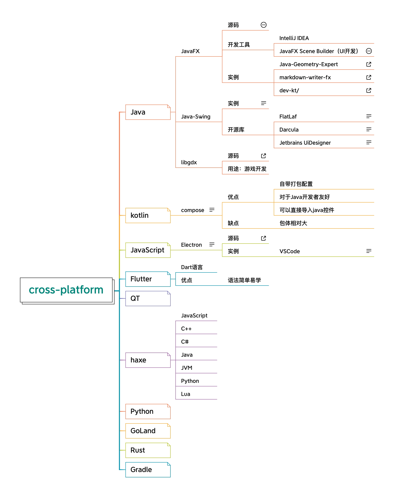

<h1 align="center">Desktop Development</h1>

[toc]

## Cross-Platform Development

* [haxe](./haxe/README.md)
* [Java](./Java/README.md)
  * [JavaFX](./JavaFX/README.md)
  * [Java-libgdx](./libgdx/README.md)

* [Kotlin](./Kotlin/README.md)
* [JavaScript](./Javascript/README.md)
* [Flutter](./Flutter/README.md)
* [Electron](./Electron/README.md)
* QT
* [Python](../Python/README.md)
* [Gradle](./Gradle/README.md)
* [GoLand](./Golang/README.md)
* [Rust](./Rust/README.md)
* [AWTK](./AWTK/README.md)

## macOS Development
* swift
* swiftUI

## Linux Development

## Windows Development

## 语法高亮资源
* https://github.com/topics/syntax-highlighting?l=java
* https://github.com/markusressel/KodeEditor
* https://github.com/kbiakov/CodeView-Android
* https://github.com/bobbylight/RSyntaxTextArea

## Java打包工具

Users of your Java app **must have the JRE installed** in order to run it.
You can either tell them to install Java first, or **distribute JRE with your app**, as [Processing](http://processing.org/) does.
Note, however, that your packaged program will be heavy if you include JRE with it. And, if you want to do that, users will need to download the appropiate package for their platform.

### Executable Java Wrappers

They take your Java app as input and *wrap* them in an executable (for a specified platform). You can customize them as you like; and if the user doesn't have Java installed, the download page will open.

Some examples are [Launch4J](http://launch4j.sourceforge.net/), [JSmooth](http://jsmooth.sourceforge.net/) and [Jar2EXE](http://www.regexlab.com/en/jar2exe/).

### Installers

They are independent applications configured to *copy* your app files to the user's computer and (optionally) create a shortcut.

Some installers are written in Java, so they're multiplatform. In this case, the installer is a `.jar`.
Some others are platform-dependent, but you have the advantage that you don't need to wrap them.

**Java installers:** [IzPack](http://izpack.org/), [Packlet](http://packlet.sourceforge.net/), [PackJacket](http://packjacket.sourceforge.net/), [Antigen](http://antigen.sourceforge.net/), …

### Java Web Start

It's a Java feature that allows you users to easily run your apps. You give them a `.jnpl` file,
they open it, and Java downloads the latest version of your app and runs it. No packaging troubles!

See the complete list of resources [here](http://java-source.net/open-source/installer-generators).
