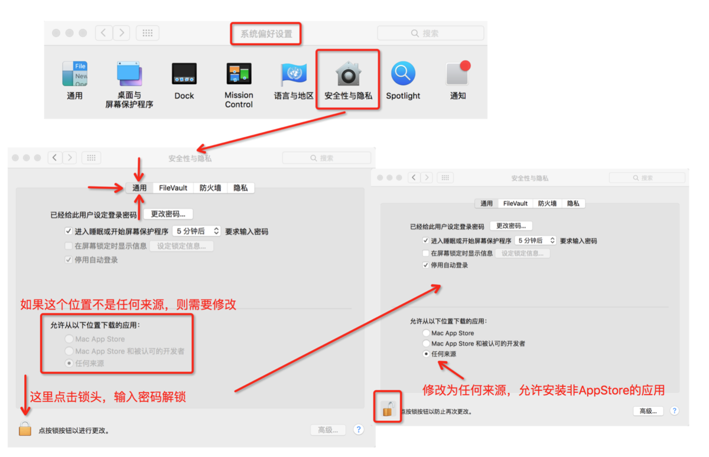
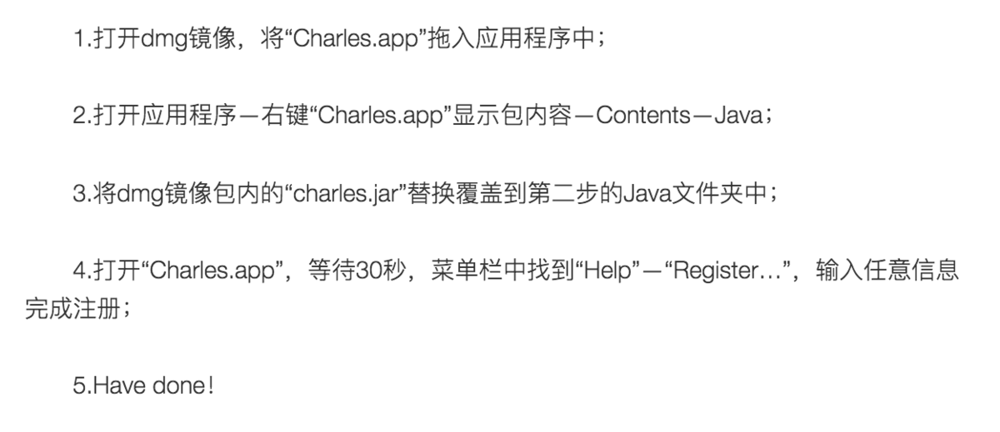
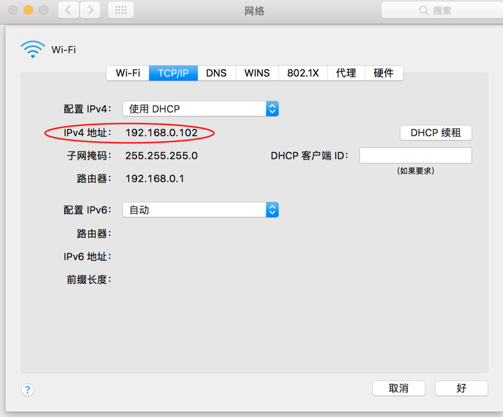
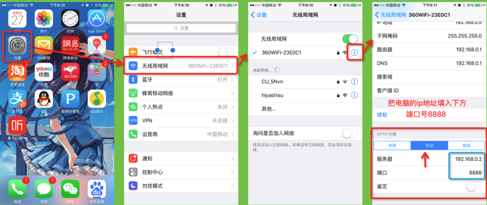
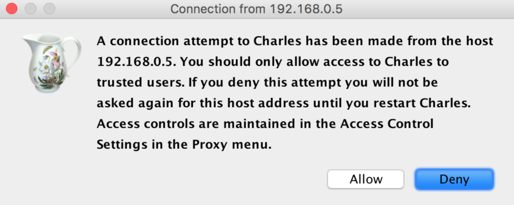
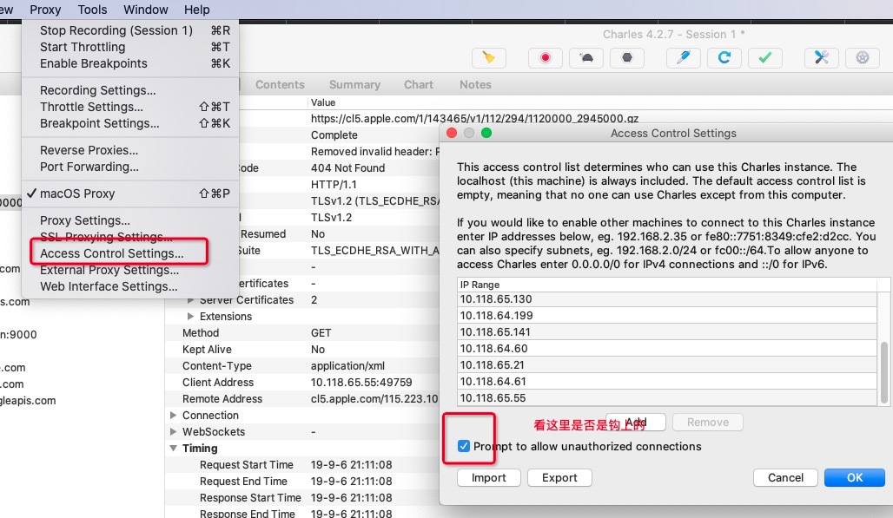

# Charles
**Charles** 是一款收费的抓包修改工具，易上手，数据请求容易控制，修改简单，抓取数据的开始暂停方便等优势！下面详细介绍下这款强大好用的抓包工具。

**抓包**（packet capture）就是将网络传输发送与接收的数据包进行截获、重发、编辑、转存等操作。也用来检测网络安全。抓包也经常被用来进行数据截取等。对于iOS初学者来说，抓包主要是为了了解网络请求操作，解决没有专人提供网络接口进行练习的问题。可以抓取大量已经上架AppStore的App的网络请求，进行网络阶段的操作练习。

# **前期准备**

**以下两个操作时必须的**

**1.**因为**Charles**不是从**AppStore**上下载的应用程序，安装和运行都需要修改**系统偏好设置** 选项，修改为允许 **任何来源**

如不你升级了系统，设置下没有任何来源这个选项。

解决办法：在终端下 执行 sudo spctl --master-disable

# **下载与安装**

**1.贫民版：直接下载破解版本**

**[点击下载](https://link.jianshu.com/?t=https://pan.baidu.com/s/1kUEUHQB) ：下载密码 cxjb**

下载好，按照下边步骤完成破解

# 使用篇

打开**Charles软件**

**1.**确保iOS设备**iphone或ipad**与运行**Charles的mac电脑处于同一个wifi环境下。**

**2.查看mac的IP地址，系统偏好设置->网络->wifi->高级->TCP/IP就看到了。**

**3.打开iOS设备，这里以iphone为例，设置手机网络操作由mac来负责。**

**PS：不抓包时，把HTTP代理设置为关闭，否则你的手机无法上网。**

4.第三步完成后，正常情况下，Mac上会弹出以下提示框，表示Charles软件检测到可供检测的设备。两个按钮选项：Allow 允许 ， Deny拒绝。当然我们要选择允许了。

作者：item_小朋链接：https://www.jianshu.com/p/633ac6221028来源：简书著作权归作者所有。商业转载请联系作者获得授权，非商业转载请注明出处。

## Charles使用遇到的问题

### 1. 升级到macOS Catalina之后，打开Charles出现警告，然后抓包用不了

    Charles cannot configure your proxy settings while it is on a read-only volume

> 这个是文件的权限问题，主要是Charles Proxy Settings的权限报错了，可以通过修改权限来解除这个警告弹窗，修改的脚本如下：

    #!/bin/bash -il
    # coding=UTF-8
    cd ~
    SETTINGS_BIN="/Applications/Charles.app/Contents/Resources/Charles Proxy Settings"
    sudo chown root "${SETTINGS_BIN}"
    sudo chmod u+s "${SETTINGS_BIN}"

## 2. 手机连接了代理，IP地址和端口号都设置正确，打开`chls.pro/ssl`却提示打不开

正常情况是会弹出安装配置描述文件的弹窗的，如果确认ip和端口都配置没有问题，在去检查一下`Access Control Settings`这里的配置

IP Range中的IP才可以连接，默认`Prompt to allow unauthorized connections`是选中的，我觉得‘不安全’就手贱勾掉了，导致新的设备的ip连接的时候不再IP Range中，所以无法连接

作者：jayhe链接：https://www.jianshu.com/p/f8d60930e258来源：简书著作权归作者所有。商业转载请联系作者获得授权，非商业转载请注明出处。