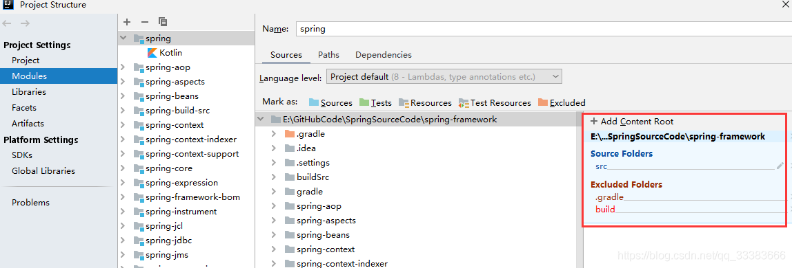
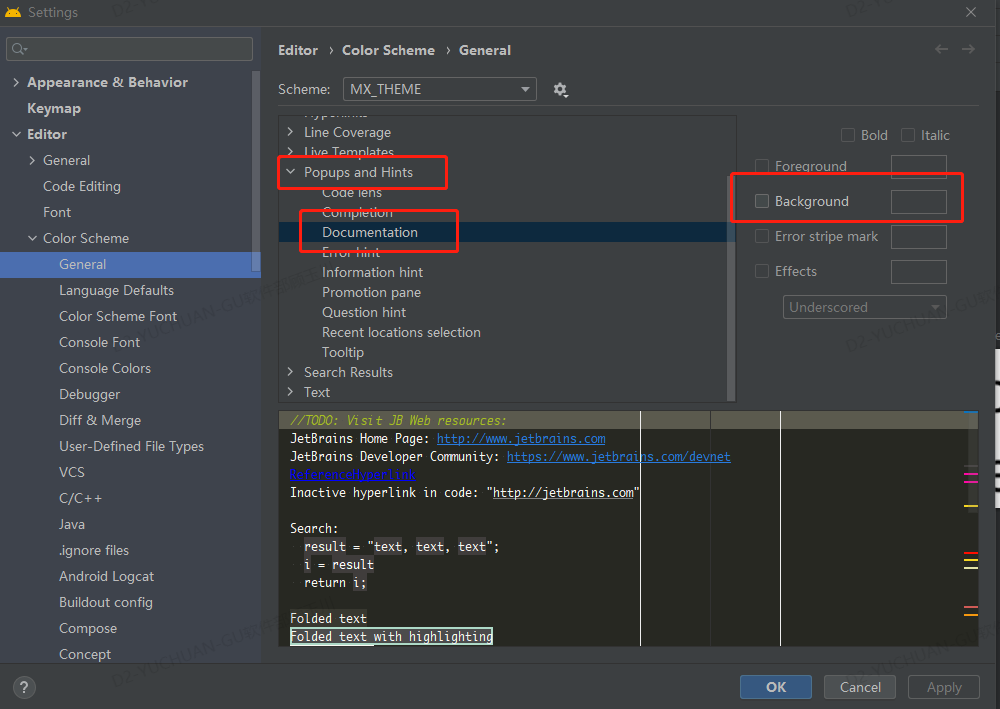

<h1 align="center">Idea 使用技巧</h1>

[toc]

## 高级技巧

* 菜单：Analyze -> Run Inspection By nam -> 弹出框输入：Unused 会提示很多操作功能（快捷键：command + option + shift + i）
* 将光标处代码插入代码模板：Command + j
* 查找复写方法：control + o
* 查找实现方法：control + i
* 代码块重构：control + shift + m

## 常用快捷键

* [http://www.developerphil.com/android-studio-tips-of-the-day-roundup-1/](http://www.developerphil.com/android-studio-tips-of-the-day-roundup-1/)
* [http://www.developerphil.com/android-studio-tips-of-the-day-roundup-2/](http://www.developerphil.com/android-studio-tips-of-the-day-roundup-2/)
* [http://www.developerphil.com/android-studio-tips-of-the-day-roundup-3/](http://www.developerphil.com/android-studio-tips-of-the-day-roundup-3/)
* [http://www.developerphil.com/android-studio-tips-of-the-day-roundup-4/](http://www.developerphil.com/android-studio-tips-of-the-day-roundup-4/)
* [http://www.developerphil.com/android-studio-tips-of-the-day-roundup-5/](http://www.developerphil.com/android-studio-tips-of-the-day-roundup-5/)
* [http://www.developerphil.com/android-studio-tips-of-the-day-roundup-6/](http://www.developerphil.com/android-studio-tips-of-the-day-roundup-6/)
* [Android studio快捷操作](https://mp.weixin.qq.com/s?__biz=MzIwMzYwMTk1NA==&mid=2247495457&idx=1&sn=876da80acea6f2cb35ea95d5654f5c18&chksm=96ce4e6ca1b9c77ab0181c5baa70361e10b68be41c112339d9593c12bc26b59faba5e6e0bb3b&mpshare=1&scene=1&srcid=&sharer_sharetime=1575337503881&sharer_shareid=9697f114c69c7eacf8e81382c2407f09#rd)

## 插件

* **CodeGlance**：与Sublime或Xcode相似，此插件在你的编辑器中嵌入了代码的缩略图。如下图所示，右边是代码的缩略小图，滚动条也变大了。 使用Codeglance预览代码模式，让你 快速导航至所需部分。
* **Rainbow Brackets**：这个插件为您的代码添加了漂亮的彩虹色，用于圆括号，方括号和大括号。对于刚刚起步的开发人员，或者对于发现自己陷入大量代码中的开发人员而言，这是一个救星。
* **SQLDelight**：SQLDelight是一个著名的Kotlin多平台数据库库。它通过SQL生成Kotlin API，并负责根据架构本身创建数据库。SQLDelight出自大名鼎鼎的Square（此外，Square开源了很多强大的流行库，比如：Retrofit、Okhttp、Picasso等），它具有IntelliJ和Android Studio插件，用于语法突出显示，代码完成和通过SQL查询导航。
* **ADB Idea**：这是Android Studio和Intellij IDEA的插件，可加快你日常的Android开发速度。 ADB Idea提供了单击快捷方式命令，用于启动，卸载，终止应用程序，撤消权限以及清除应用程序数据。要调用此插件，您可以导航到“工具”->“ Android”->“ ADB Idea”菜单，或从“查找操作”中搜索命令。
* **ADB Wifi**：与iOS开发不同，Android开发人员通常必须确保在设备上进行调试时，永远不要断开USB的连接。尽管有一组ADB Shell命令可以通过WIFI建立连接，但是使用GUI快捷方式要方便的多。只需安装ADB Wifi插件即可。确保你的电脑和手机连接在同一网络上，然后转到“Tools”→“ android”→“ ADB WIFI”→“ ADB USB to WIFI”开始连接，现在您无需USB连接，即可运行应用程序。
* **Material UI Theme**：Android Studio为黑暗模式爱好者提供了一个可爱的Dracula主题，但是有时候，做一些更改并不不是坏事，Material UI Theme就是为此而设计。该插件具有令人印象深刻的主题调色板，提供漂亮的配色方案，并支持绝大多数编程语言，以及Material图标，填充和一系列自定义设置。
* **JSON To Kotlin Class**：使用此插件，将JSON字符串转换为Kotlin数据类非常容易。此外，它还支持：
   - 一系列JSON注解库-Gson，Jackson，Fastjson，Moshi，LoganSquare等
   - 使用默认值初始化属性，并使它们可以为空。
   - 将属性名称重命名为驼峰样式，并将类生成为内部或单个类。
   - 如果JSON字符串有效，则从本地文件/ Http URL加载JSON。
* **Vector Drawable Thumbnails**：要预览矢量drawable XML文件，我们通常必须重新构建项目。而使用Vector Drawable Thumbnails插件，我们只需单击一次，就可以预览所有vector drawables 。
* **Codota**：Codota是一个基于AI的代码补全插件，它使用机器学习数百万个代码段（Java，Javascript，Python等），根据您的上下文建议补全代码。它还使你可以直接嵌入通用代码段，以提高开发技能并减少出错的机会。
* **Name That Color**：如果觉得Android代码库中的颜色命名令人头痛，别担心，你不是一个人！尽管编码通常被称为艺术，但并不是所有的开发人员都擅长颜色命名，尤其是不同的阴影。在这种情况下，请输入诸如red1，blue_lighter或red2之类的神秘名称。
* **String Manipulation**：从toggling cases到switching between camel、snake、kebab cases再到incrementing duplicates、排序、转义/取消转义HTML，Java，SQL，PHP，XML字符串以及执行过滤器操作（如grep，字符串操作）等，一切触手可及。
* **Gradle Killer**：通常，你后悔开始Gradle构建或只是希望立即将其关闭。您可以运行ps命令或在任务管理器中四处寻找Java.exe，但这会很麻烦。现在，令开发人员高兴的是，我们有一个插件，可以在你的Android Studio的运行菜单中添加一个Kill Gradle图标。要回收您的RAM，只需单击它！
* **Kotlin Fill Class**：有一个常见的需求，就是快速创建具有默认属性的Kotlin类。此IntelliJ插件就是用于此目的。它为空的构造函数和函数提供了意图操作，使您可以快速初始化参数。
* **TabNine**：这是一个自动完成功能插件(代码提示)，可利用深度学习来建议智能完成情况，让你更快地编写内容。
* **Key Promoter X**：这是一个IntelliJ IDE插件，可帮助你在工作时学习基本的快捷方式。当你在IDE内，把鼠标放按钮上时，Key Promoter X会提示你应该使用的快捷键。它还在侧窗格中显示了以前使用的鼠标操作，及其对应的键盘快捷键的列表。对于没有快捷方式的按钮，Key Promoter X会提示您直接创建一个快捷方式。
* **Clear Cache Plugin**：通常，当开发者需要清除缓存时，他们必须遍历.gradle目录。那很费时间。您可以创建Gradle脚本来加速此过程，但是为什么要重新造轮子呢？通过使用Clear Cache插件，我们可以检索具有给定前缀的所有软件包，并删除不再需要的软件包。
* **FCM Push Sender**：通过给Firebase设置Registration ID，我们可以使用此插件直接从Android Studio发送推送通知。该插件还具有使用Stetho dumpapp插件自动搜索Firebase Registration ID token 的应用内共享首选项的功能。
* **SQLScout**：这是对Android Studio和IntelliJ IDEA极好的SQLite支持，可让您实时管理数据库。这使得在调试应用程序时轻松实时执行SQL查询以更新表。它还支持Room 持久性库-从现有数据库模式自动生成Room 实体，DAO，Migration和Database类。数据库图表，带有语法突出显示工具的SQL编辑器，可导出schema 为Excel等不同格式。
* **Material Design Icon Generator**：这个插件可以帮助你在Android应用程序中添加Material设计图标。导入assets，指定颜色，大小和密度非常简单。
* **NyanProgress**：我们有一个不错的进度条，可让您在Gradle构建和重建过程中始终陪伴着您。无休止的等待时间会使任何开发人员感到沮丧。幸运的是，NyanProgress将我们最喜欢的NyanCat带到了丰富多彩的进度条上，使等待时间变得更加有趣。不用再怀疑Gradle版本是否已冻结！
* **GsonFormat**：GsonFormat是一个快速将json字符串生成一个JavaBean的插件，免去我们根据json字符串手动写对应JavaBean的过程，而且还支持序列化自动生成。
* **ECTranslation**:ETCTranslation是一个可以对Android Studio中的英文进行翻译的插件，我们在看源码及英文注释的时候，就不用再去查字典了，可以设置鼠标悬停翻译，也可自定义快捷键，这样方便多了。
* **AndroidProguardPlugin**：AndroidProguardPlugin是一个一键生成项目混淆规则代码的插件，它可以很方便的进行个各种开源库及常用混淆配置
* **JSON To Kotlin Class**：
* **SequencePlugin**：

## 使用技巧

### idea导入java源码不识别

**进入File->Project Structure->Modules->选中需要识别的源码，然后在右侧找到Mark as：点击Sources即可**

[idea导入的spring源码，idea不识别java代码，java文件左下角是J_Arthur李的博客-CSDN博客](https://blog.csdn.net/qq_33383666/article/details/100943693)

## 代码提示框颜色调整

