# 你真的理解Intellij IDEA的Debug技巧吗？这篇文章全部教给你

## 1. 什么是 Debug？

还记得以前不会使用 Intellij IDEA 的 debug 功能时，想要看什么数据都是在那行数据的下面一行加上 System.out.println()，然后运行程序，把数据打印出来，如果要看另一个数据，我就再加一行 System.out.println()，所以我的代码就会长的像下面这样……

```java
public User getMaleUser() {
    List<User> userList = userDao.getUserList();
    
    // 打印出userList，看一下userList里面的内容长怎样
    System.out.println(userList);
    
    // 从userList中取出男生，然后回传
    User resultUser;
    for (User user : userList) {
        if (user.getGender() == "男") {
            resultUser = user;
        }
    }

    // 打印出resultUser，确认一下回传的user到底是哪一个
    System.out.println(resultUser);
    
    return resultUser;
}
```

可想而知，这样做的开发效率是非常差的，每多看一个数据就要多增加一行 System.out.println()，而且每次改动之后，都要重新运行程序，让程序再打印出一次数据，我想想都觉得痛苦，难道 IDEA 就没有一个能够实时反应出现在这个数据的数值是什么的功能吗？

事实上，IDEA 是有提供的！当我们在运行代码时，改成使用 Debug 模式 运行就可以了！

## 2. IDEA 的 Debug 模式

使用 IDEA 的 Debug 模式来运行代码的好处

* 可以一步步排查代码.
* 可以实时的知道代码运行中的变量的值，甚至改变变量的值，从此不用再使用System.out.println()去打印代码变量了.

在 IDEA 的 Debug 模式中，有几个比较重要的功能面板如下：
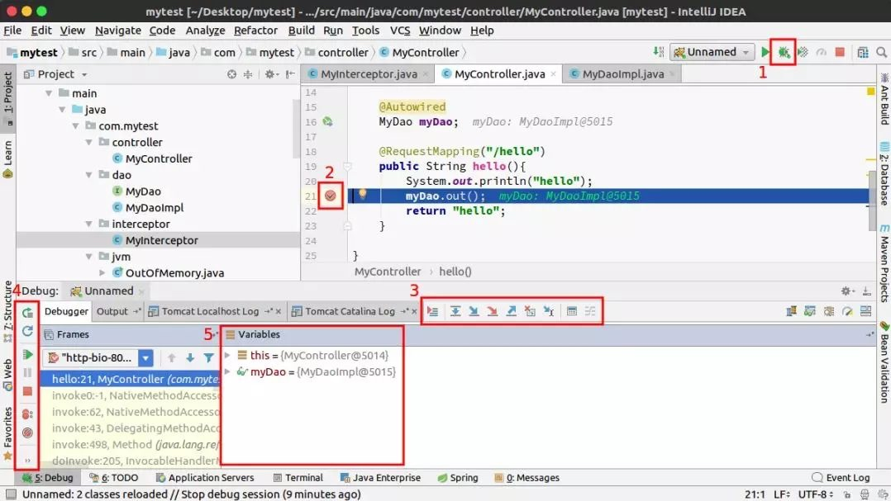

1. 开启 Debug 模式的开关：通常在写代码时都会改用 Debug 模式来跑程序，已经很少使用旁边的 Run 模式了。
2. 设置断点：在左边行号栏单击左键就可以设置断点，再点一下则可以取消此断点，能够设置断点是 Debug 模式和 Run 模式最大的区别，而设置断点可以帮助我们对代码进行一步步的排查，这也是为什么推荐使用 Debug 模式而不是使用 Run 模式。
3. 调试按钮：Debug 调试代码的主要功能就对应着这几个按钮。
4. 服务按纽：和 Debug 的断点有关系，主要搭配着 3. 调适按钮 一起用。
5. 变量区：可以查看当前断点之前的变量。

## 3. Debug 基本用法

IDEA 的 Debug 模式基本用法主要对应着上述的 3. 调试按钮 和 4. 服务按钮 这两组按钮。

调试按钮，从左到右共 8 个按钮


1. Show Execution Point : 如果你的光标在其它行或其它页面，点击这个按钮可跳转到当前代码执行的地方。
2. Step Over : 一行一行的代码往下执行，如果这一行上有方法不会进入方法。
3. Step Into : 如果当前行有方法，可以进入方法内部，一般用于进入自定义方法内，不会进入官方类库的方法。
4. Force Step Into : 强制进入方法内部，能进入任何方法，查看底层源码的时候可以用这个进入官方类库的方法。
5. Step Out : 退出方法，从进入的方法内退出到方法调用处，此时方法已执行完毕，只是还没有完成赋值。
6. Drop Frame : 回退断点，很少用到。
7. Run to Cursor : 运行到光标处，你可以将光标定位到你需要查看的那一行，然后使用这个功能，代码会运行至光标行，而不需要打断点（前提是已经进入了 Debug 模式，也就是已经停在某个断点上了）。
8. Evaluate Expression : 计算表达式，后面第五部分详细说明。

服务按钮，从上到下共 7 个按钮

  

1. Rerun : 重新运行程序，他会关闭服务后重新啓动程序，不过很少用到，通常都会直接关掉再开启一次。
2. Update 'tech' application : 更新程序，就是执行当初定义的 update 选项，当 Debug 模式启动后，再次点击 debug 按钮也会跳出此选项。
3. Resume Program : 继续执行程序，例如在第 20 行和 25 行有两个断点，而当前运行至第 20 行，按一下，则运行到下一个断点（即第 25 行），再按一下，则运行完整个流程，因为后面已经没有断点了。
4. Pause Program : 暂停程序，很少用不是很重要。
5. Stop : 连续按两下关闭程序，有时候你会发现关闭服务再啓动时，报端口被佔用，这是因爲没完全关闭服务的原因。
6. View Breakpoints : 查看所有断点，后面第七部分详细说明。
7. Mute Breakpoints : 将所有断点变爲灰色使断点失效，按 Resume Program 那个键（也就是第三个按键）可以直接运行完程序（因为所有打的断点都被设置为无效了），再次点击这个 Mute Breakpoints 按键可以使所有无效断点变为红色有效。

## 4. Debug 模式下的变量查看
在 Debug 过程中，跟踪查看变量的变化是非常必要的，有几个方式可以查看当前变量的值

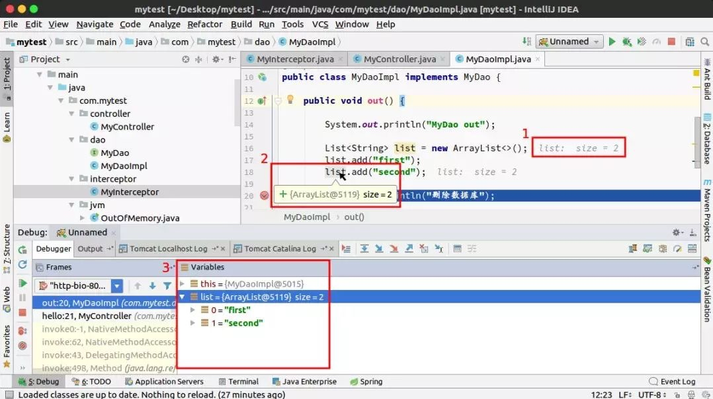

1. 参数所在行后面会显示当前变量的值。
2. 游标停到参数上，会显示当前变量信息，点击打开可以看到变量的详情。
3. 在下方的 Variables 变量区窗口查看，这里会显示当前方法的所有变量，可以一次看到所有变量的详情。

## 5. 计算表达式 Evaluate Expression

在前面第三部分有提到一个计算表达式 Evaluation Expression 按钮，可以使用这个按钮在调试过程中计算某个表达式的值，或是直接改变某个变量的值，而不用再去重新改代码手动改变量的值然后再重启程序。

假设在 Debug 模式下，想要快速比较当前 list.get(0).equals("first") 的结果，可以不用改代码，直接在计算表达式里面运算，让 IDEA 快速帮助我们计算出这个函式会回传的值，非常方便，像是下面的 **3. Result** 部分，得到的就是使用计算表达式运行 list.get(0).equals("first") 的结果。

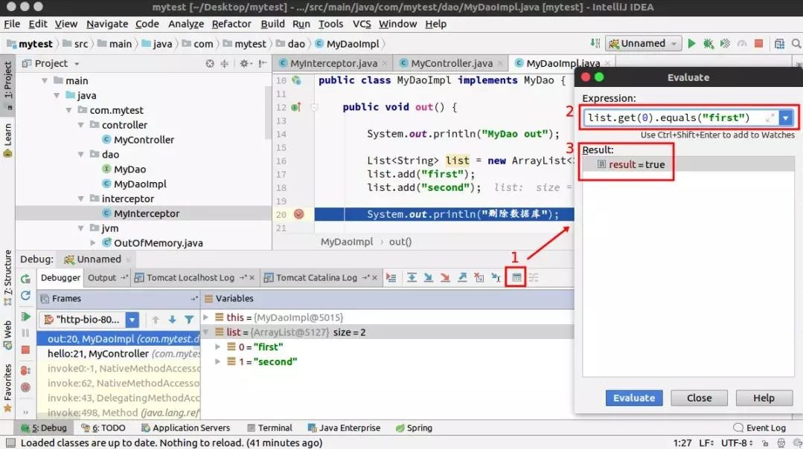

或是说想要更改变量的值的话，也可以透过计算表达式来改变，像是下面这个例子，正常代码来说，list 裡只会有 first、second 两个字串，但是因为我们在计算表达式裡调用了 list.add("third") 向 list 里插了一条新的字串，所以下方 Variables 变量区才会显示 list 裡面有三个字串 first、second、third。

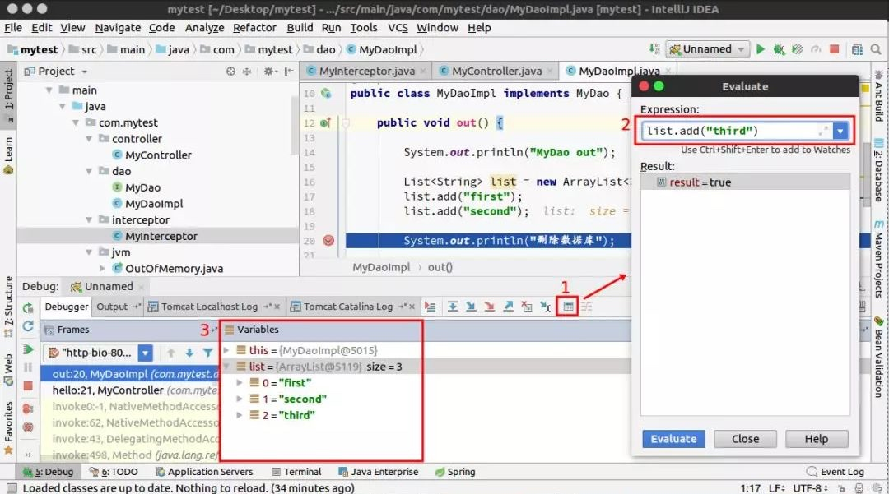

题外话说一下，如果只是单纯想要改变变量的值的话，还有另一种方法，不用透过计算表达式那么麻烦。只要在 Variables 变量区直接在变量上点右键，使用 setValue 也能重新改变此变量的值的。

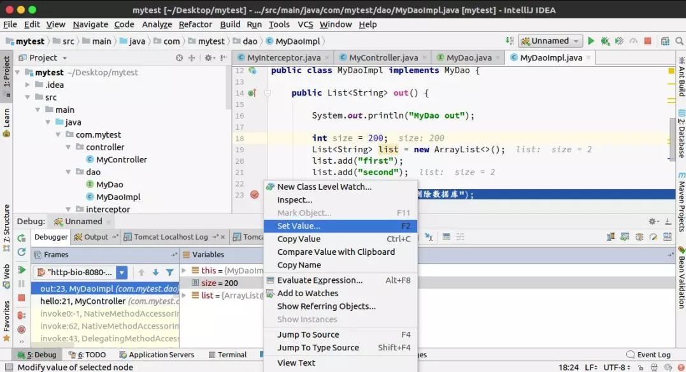

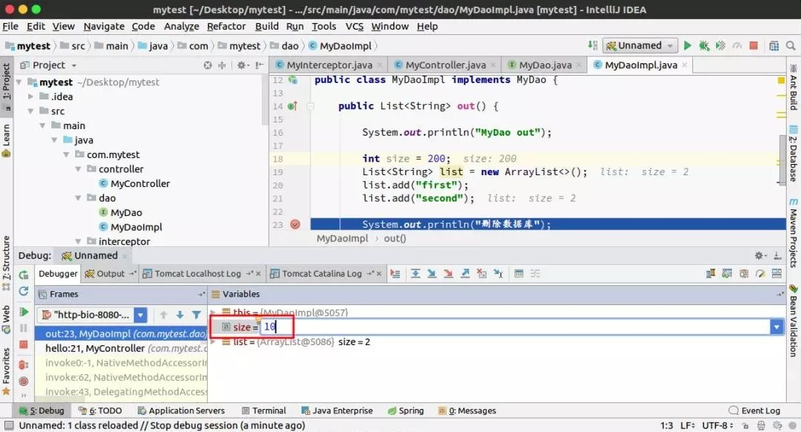

## 6. 断点条件设置

有的时候在遍历一个集合或是数组的时候，可能只想要看 for 循环面的某个 i 值超过多少以上的变量情况，这时候就可以透过设置断点条件来达成，也就是说，只有在满足了断点条件时，才会停在断点处，不然就会直接忽略此断点。

对断点点击右键可以设置断点条件，像是下图是设置成在 i=3 时才停下（如果没有设置断点条件的话，则每进一次 for loop，每个 i 都会停一次断点）。

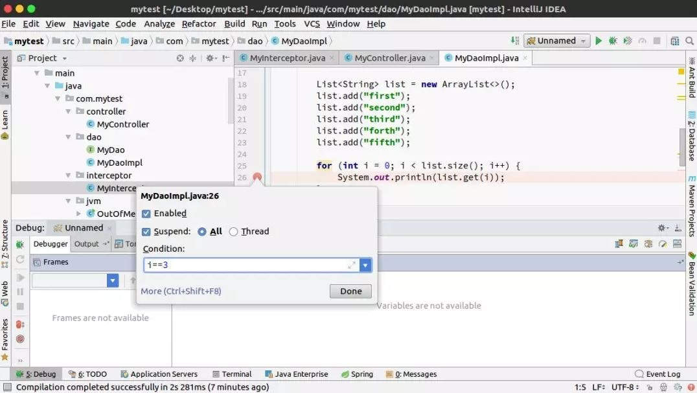

## 7. 查看所有断点

在左下方点击 View Breakpoints 可以查看目前已经设置的所有断点，有时候自己断点打多了很容易忘记打在哪，可以透过这个功能知道自己都在哪些地方打了断点，取消勾选可以使此断点失效。

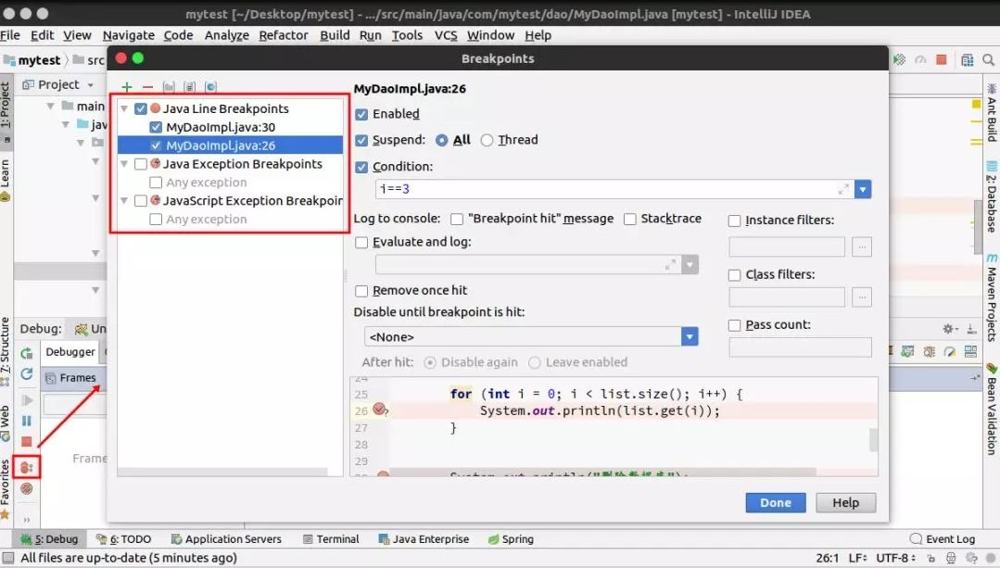

## 8. 设置异常断点

当设置异常断点，在程序中出现需要拦截的异常时，会自动定位到异常行
设置方式一样是先点击 view breakpoints，之后点击 + 号添加异常断点，这边添加了 NullPointerException。

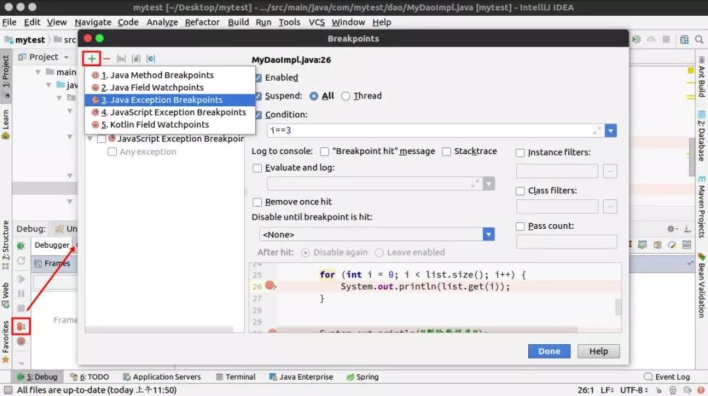

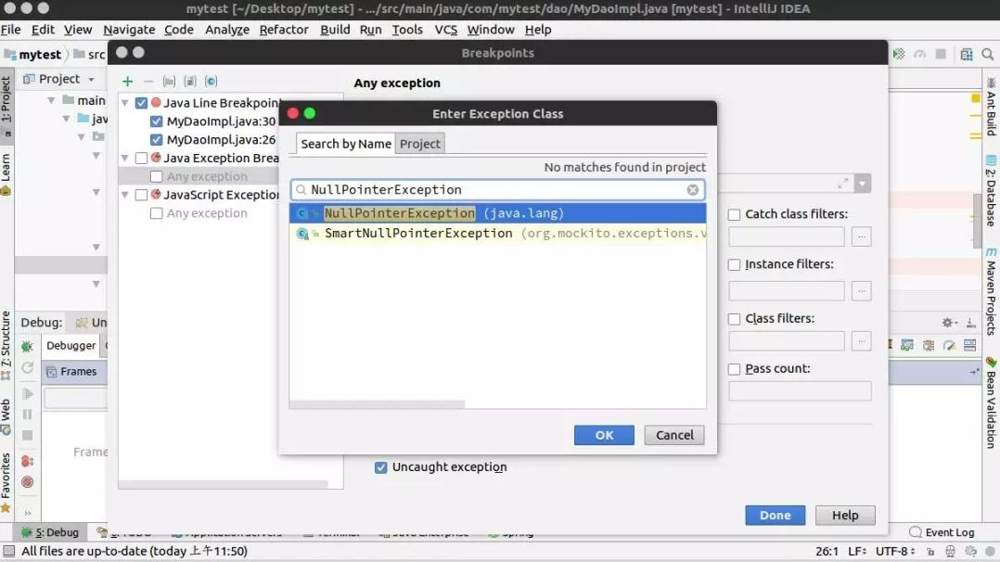

当出现空指针异常时，会自动跳到抛出空指针异常的行数，省的我们再去定位问题点在哪，非常方便。

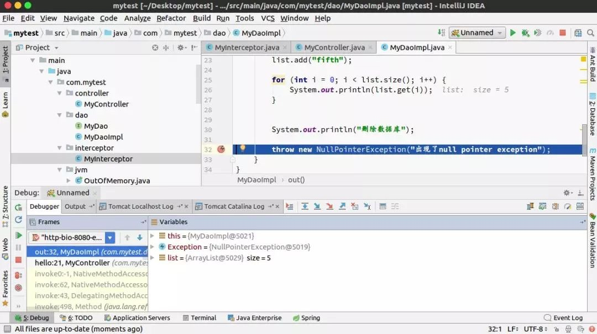

