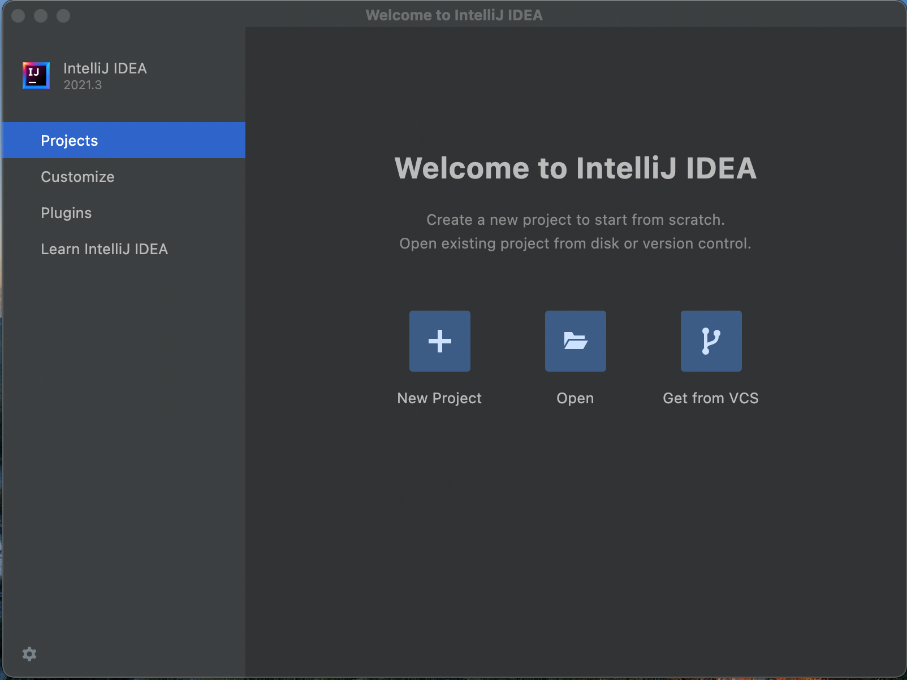

<h1 align="center">Intellij-community</h1>

[toc]

## 一、clone源码：

[intellij-community](https://github.com/JetBrains/intellij-community): 源码有4点多个G，如果不需要完整的git历史，可以使用git clone --depth 1，只有240M左右

## 二、代码分析

### 1. 启动界面--（没有导入项目时）

platform\bootstrap\src\com.intellij.idea.Main --> main --> StartupUtil.start --> MainImpl.start --> ApplicationLoader.initApplication --> ApplicationLoader.startApp --> IdeaStarter.main --> IdeaStarter.openProjectIfNeeded --> IdeaStarter.showWelcomeFrame --> WelcomeFrame.prepareToShow --> FlatWelcomeFrame() --> FlatWelcomeFrameProvider.createFrame --> FlatWelcomeFrame() --> TabbedWelcomeScreen() --> TabbedWelcomeScreen.getAssociatedComponent --> ProjectsTabFactory.buildComponent --> EmptyStateProjectsPanel --> 

NewProjectAction.class: Welcome --> New Project 操作（如上图）

OpenFileAction.class: Welcome --> Open 操作

FileChooserFactoryImpl.class --> 文件选择（Mac, Window, File）

## 2. 资源文件

路径：
Platform/Platform-api/resource/messages/IdeBundle.properties

welcom.screen: 欢迎页资源
  * CreateNewProjectGroupAction：创建新项目Action

路径：Platform/platform-resouces/scr/idea/PlatformActions: 操作配置
