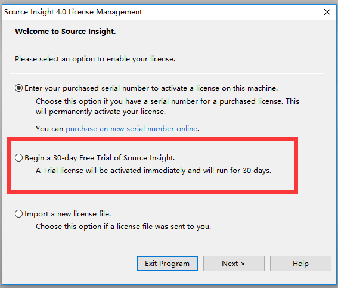
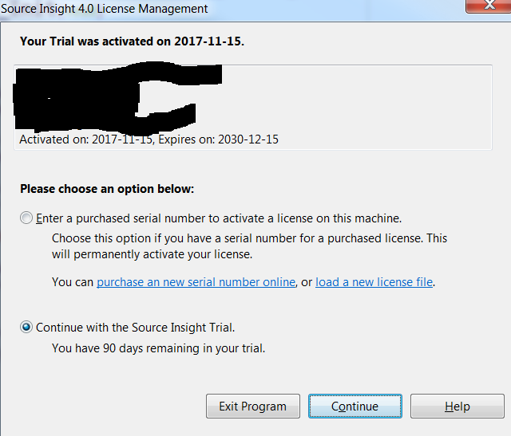

<h1 align="center">Source Insight</h1>

## 下载

https://www.sourceinsight.com/download/

## 注册码：

### 3.x

```
SI3US-279028-11281
SI3US-772862-51931
SI3US-465643-84290
SI3US-176526-66007
SI3US-060062-28251
```

### 4.x 

```

```


## 破解

### 安装程序下载

在[官网](https://link.jianshu.com?t=https://www.sourceinsight.com/updates/)上下载Source Insight 4.0的安装程序.

### 30天的试用安装

首次启动选择授权方式，这里选择第二个选项，30天试用。



点击下一步，输入名称、公司或组织名称、邮箱信息，申请30天的试用。
 输入完成后，点击下一步，直到安装完成。

### 修改sourceinsight4.exe

用16进制编辑器（sublime text）打开sourceinsight4.exe文件，找到**c800 0000 742a 83bc 2408** 这一段，修改74 为 eb。

### 修改license文件

打开 C:\ProgramData\Source Insight\4.0\si4.lic
 将Expiration=”2017-XX-XX”中的2017修改为2030，试用期将永不过期。

启动界面如下:




## 破解2

1. 安装原版软件：Source Insight Version 4.0.0085/4.0.0086
2. 替换原主程序：sourceinsight4.exe
3. 导入授权文件(Import a new license file)：si4.pediy.lic

## 导入工程


## 参考

* [Source Insight 4.0 完美破解](https://www.jianshu.com/p/a4735cf9f334)
* [Mac安装source insight](https://www.jianshu.com/p/624495a0ad2f)

