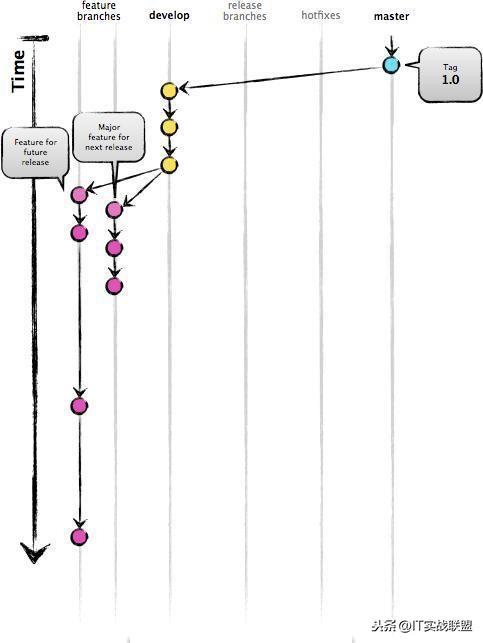
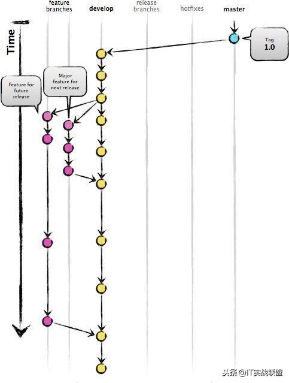

<h1 align="center">Git Doc</h1>

[toc]

## 生成 SSH 公钥

首先，你需要确认自己是否已经拥有密钥。 默认情况下，用户的 SSH 密钥存储在其 `~/.ssh` 目录下。 进入该目录并列出其中内容，你便可以快速确认自己是否已拥有密钥：

```console
$ cd ~/.ssh
$ ls
authorized_keys2  id_dsa       known_hosts
config            id_dsa.pub
```

我们需要寻找一对以 `id_dsa` 或 `id_rsa` 命名的文件，其中一个带有 `.pub` 扩展名。 `.pub` 文件是你的公钥，另一个则是与之对应的私钥。 如果找不到这样的文件（或者根本没有 `.ssh` 目录），你可以通过运行 `ssh-keygen` 程序来创建它们。 在 Linux/macOS 系统中，`ssh-keygen` 随 SSH 软件包提供；在 Windows 上，该程序包含于 MSysGit 软件包中。

```console
$ ssh-keygen -o
Generating public/private rsa key pair.
Enter file in which to save the key (/home/schacon/.ssh/id_rsa):
Created directory '/home/schacon/.ssh'.
Enter passphrase (empty for no passphrase):
Enter same passphrase again:
Your identification has been saved in /home/schacon/.ssh/id_rsa.
Your public key has been saved in /home/schacon/.ssh/id_rsa.pub.
The key fingerprint is:
d0:82:24:8e:d7:f1:bb:9b:33:53:96:93:49:da:9b:e3 schacon@mylaptop.local
```

首先 `ssh-keygen` 会确认密钥的存储位置（默认是 `.ssh/id_rsa`），然后它会要求你输入两次密钥口令。 如果你不想在使用密钥时输入口令，将其留空即可。 然而，如果你使用了密码，那么请确保添加了 `-o` 选项，它会以比默认格式更能抗暴力破解的格式保存私钥。 你也可以用 `ssh-agent` 工具来避免每次都要输入密码。

现在，进行了上述操作的用户需要将各自的公钥发送给任意一个 Git 服务器管理员 （假设服务器正在使用基于公钥的 SSH 验证设置）。 他们所要做的就是复制各自的 `.pub` 文件内容，并将其通过邮件发送。 公钥看起来是这样的：

```console
$ cat ~/.ssh/id_rsa.pub
ssh-rsa AAAAB3NzaC1yc2EAAAABIwAAAQEAklOUpkDHrfHY17SbrmTIpNLTGK9Tjom/BWDSU
GPl+nafzlHDTYW7hdI4yZ5ew18JH4JW9jbhUFrviQzM7xlELEVf4h9lFX5QVkbPppSwg0cda3
Pbv7kOdJ/MTyBlWXFCR+HAo3FXRitBqxiX1nKhXpHAZsMciLq8V6RjsNAQwdsdMFvSlVK/7XA
t3FaoJoAsncM1Q9x5+3V0Ww68/eIFmb1zuUFljQJKprrX88XypNDvjYNby6vw/Pb0rwert/En
mZ+AW4OZPnTPI89ZPmVMLuayrD2cE86Z/il8b+gw3r3+1nKatmIkjn2so1d01QraTlMqVSsbx
NrRFi9wrf+M7Q== schacon@mylaptop.local
```

关于在多种操作系统中生成 SSH 密钥的更深入教程，请参阅 GitHub 的 SSH 密钥指南 https://help.github.com/articles/generating-ssh-keys。

## 配置Git全局账号

如果没有设置 git 配置，请设置
可以通过 git config --list 查看，如果设置了user.email，user.name，可以跳过此步骤

如果没有，请如下设置

```
git config --global user.email "You email"   // 该部分邮箱请用工作邮箱；
git config --global user.name "You name"     // 为了便于管理，该部分规定用自己名字的拼音，不要用简写或者英文名；
```

例如：

```
git config --global user.email "caishaojiang＠szltp.com" // 用户邮箱
git config --global user.name "caishaojiang"			 // 用户名
```

设置可选属性
设置默认git默认的编辑器为 vim

```
git config --global core.editor "vim"
```

设置git输出颜色

```
git config --global color.ui auto
```

## Git基本操作

### 1. 克隆代码

```
git clone url // 克隆master分支代码
// 例如：
git clone https://github.com/git/git
git clone --branch <tag_name> <repo_url>  // 根据tag拉代码
// 例如：
git clone --branch android-8.1.0_r23 https://android.googlesource.com/platform/packages/apps/Launcher3
```

### 2. 分支操作

```
git init  			      // 创建项目
git branch 分支名称    // 创建分支
git branch     		    // 当前分支
git branch -r  		    // 远程分支
git branch -a  		    // 所有分支
git branch -v  				// 查看所有分支的最后一次操作
git branch -av 				// 查看所有分支及最后提交log
git branch -vv 				// 查看当前分支
git branch -b  分支名 origin/分支名   // 创建远程分支到本地
git branch --merged    // 查看别的分支和当前分支合并过的分支
git branch --no-merged // 查看未与当前分支合并的分支
git branch -d 分支名    // 删除本地分支
git branch -D 分支名    // 强行删除分支
git branch origin :分支名  // 删除远处仓库分支
git merge 分支名           // 合并分支到当前分支上
git checkout . 			      // 恢复本地所有未提交的修改
git checkout 分支名称  	   // 切换分支
git checkout -b       	  // 创建并切换到新建的分支上
git checkout --track <remote/branch>  // 追踪远程分支
git push origin 分支名称               // 推送分支到远程  创建新的可追溯的分支（基于远成分支）
git branch --set-upstream-to=origin/分支名称  // 关联
git branch -d <branch>    // 删除本地分支
git branch -rm <old-branch> <new-branch>     // 重命名分支
```

### 3. 提交代码

```
git status  // 显示本地路径下的全部已修改的文件
git diff 文件名  // 显示与上次提价版本文件的不同
git add .  // 把当前所有修改添加到下次提交中
git add -p <file>  // 指定某个文件的修改添加到下次提交中
git commit -a  // 提交本地所有修改
git commit   // 提交标记的变化
git commit --amend   // 修改上次提交（请勿修改已发布的提交记录）
```

### 4. 代码暂存

```
git stash 暂存当前修改
git stash apply 恢复最近的一次暂存
git stash pop 恢复暂存并删除暂存记录
git stash list 查看暂存列表
git stash drop 暂存名(例：stash@{0}) 移除某次暂存
git stash clear 清除暂存
```

### 5. 更新代码

```
git pull
git pull --rebase	
git fetch 获取远程仓库中所有的分支到本地
# 如果有冲突，解决冲突
git rebase --continue
# gerrit review
git push origin HEAD:refs/for/master
# or
# github
git push origin develop 
git pull
git stash pop
```

### 6. 回退操作

```
git log -3  // 查看最近的三个tag，也可以不加数字
git reset --hard HEAD^ // 回退到上一个版本
git reset --hard ahdhs1(commit_id) // 回退到某个版本
git checkout -- file  // 撤销修改的文件(如果文件加入到了暂存区，则回退到暂存区的，如果文件加入到了版本库，则还原至加入版本库之后的状态)
git reset HEAD file // 撤回暂存区的文件修改到工作区/撤销已add但是没有push的某个文件或者文件夹
git push -f origin master  // 强制提交到master
```

### 7. 标签操作

```
git tag 标签名 // 添加标签(默认对当前版本)
git tag 标签名 commit_id  	// 对某一提交记录打标签
git tag -a 标签名 -m '描述' // 创建新标签并增加备注
git tag 					// 列出所有标签列表
git show 标签名 		// 查看标签信息
git tag -d 标签名  // 删除本地标签
git push origin 标签名  // 推送标签到远程仓库
git push origin --tags // 推送所有标签到远程仓库
git push origin :refs/tags/标签名 // 从远程仓库中删除标签
```

### 8. 常规操作

```
git push origin test   					 // 推送本地分支到远程仓库
git rm -r --cached 文件/文件夹名字 // 取消文件被版本控制
git rm filename									 // 删除本地文件
git reflog  										 // 获取执行过的命令
git log 												 // 从最新提交开始显示所有的提交记录
git log -p <file>  		// 显示指定文件的修改
git blame <file>  		// 在什么时间，修改了文件的什么内容
git log --graph 			// 查看分支合并图
git merge --no-ff -m '合并描述' 分支名 // 不使用Fast forward方式合并，采用这种方式合并可以看到合并记录
git check-ignore -v 文件名   // 查看忽略规则
git add -f 文件名 					  // 强制将文件提交
git reflog 		// 打印所有的日志,假如：ABC三个节点，回退到B后，仍旧打印所有日志
git update-index --assume-unchanged file // 忽略单个文件
git rm -r --cached 文件/文件夹名字 (. // 忽略全部文件)
git update-index --no-assume-unchanged file  // 取消忽略文件
git config --global credential.helper store  // 拉取、上传免密码
```

### 9. 远程

```
git remote -v  						// 列出当前配置的远程端
git remote show <remote>  // 显示远程端信息
git remote add <showname> <url>  // 添加新的远程端
git fetch <remote>        			 // 下载远程端的所有改动到本地（不会自动合并到当前）
git pull <remote> <branch>   	 // 下载远程端的所有改动到本地（自动合并到当前）
git push <remote> <branch>    	 // 将本地版本发布到远程端
git branch -dr <remote/branch>   // 删除远程端分支
```

### 10. 合并与重置

```
git merge <branch>  		 // 将分支合并到当前
git rebase <branch>  		 // 将当前版本重置到分支中（请勿重置已发布的提交）
git rebase --abort  		 // 退出重置
git rebase --continue  	 // 解决冲突后继续重置
git mergetool  					 // 使用配置好的合并工具去解决冲突
git add <resolved-file>  // 在编辑器中手动解决冲突后（标记文件为已解决冲突）
git rm <resolved-file>   // 在编辑器中手动解决冲突后（标记文件为已解决冲突）
```

### 11. 撤销

```
git reset --hard HEAD  		 // 放弃工作目录下的所有修改
git push -f -u origin master // 推送到远程分支
git checkout HEAD <file>   // 放弃某个文件的所有本地修改
git revert <commit>  			 // 重置一个提交（通过创建一个截然不同的新提交）
git reset --hard <commit>  // 将HEAD重置到上一个提价的版本（并抛出该版本之后的所有修改）
git reset <commit>  // 将HEAD重置到上一个提交的版本（并将之后的修改标记为未添加到缓存区的修改）
git reset --keep <commit>  // 将HEAD重置到上一个提交的版本（并保留未提交的本地修改）
```


### 修改代码地址

```
git remote -v  // 查看源码地址
git remote set-url origin [GIT URL] // orgin为当前源地址名，[GIT URL]为欲修改源地址
git remote add [NAME] [GIT URL]			// [NAME]为新的Git库源地址名，[GIT URL]为新的git库源地址
```


## 第二部分 版本管理

GitFlow 是由 Vincent Driessen 提出的一个 git操作流程标准。包含如下几个关键分支：

```
1. master：主分支develop：主开发分支，包含确定即将发布的代码；
2. feature：新功能分支，一般一个新功能对应一个分支，对于功能的拆分需要比较合理，以避免一些后面不必要的代码冲突；
3. release：发布分支，发布时候用的分支，一般测试时候发现的 bug 在这个分支进行修复；
4. hotfix：热修复分支，紧急修 bug 的时候用。
```

GitFlow 的优势有如下几点：

```
1. 并行开发：GitFlow可以很方便的实现并行开发。每个新功能都会建立一个新的 feature分支，从而和已经完成的功能隔离开来，而且只有在新功能完成开发的情况下，其对应的 feature分支才会合并到主开发分支上（也就是我们经常说的develop分支）。另外，如果你正在开发某个功能，同时又有一个新的功能需要开发，你只需要提交当前 feature 的代码，然后创建另外一个feature 分支并完成新功能开发。然后再切回之前的 feature 分支即可继续完成之前功能的开发。
2. 协作开发：GitFlow 还支持多人协同开发，因为每个 feature 分支上改动的代码都只是为了让某个新的 feature 可以独立运行。同时我们也很容易知道每个人都在干啥。
3. 发布阶段：当一个新 feature 开发完成的时候，它会被合并到 develop 分支，这个分支主要用来暂时保存那些还没有发布的内容，所以如果需要再开发新的 feature，我们只需要从 develop 分支创建新分支，即可包含所有已经完成的 feature 。
4. 支持紧急修复：GitFlow 还包含了 hotfix 分支。这种类型的分支是从某个已经发布的 tag 上创建出来并做一个紧急的修复，而且这个紧急修复只影响这个已经发布的 tag，而不会影响到你正在开发的新 feature。
```

```
然后就是 GitFlow 最经典的几张流程图，一定要理解:
```



**feature 分支都是从 develop 分支创建，完成后再合并到 develop 分支上，等待发布**



当需要发布时，我们从 develop 分支创建一个 release 分支

然后这个 release 分支会发布到测试环境进行测试，如果发现问题就在这个分支直接进行修复。在所有问题修复之前，我们会**不停的重复发布->测试->修复->重新发布->重新测试这个流程。**


发布结束后，这个release 分支会合并到 develop 和 master 分支，从而保证不会有代码丢失。


master 分支只跟踪已经发布的代码，合并到 master 上的 commit 只能来自 release 分支和 hotfix 分支。

hotfix 分支的作用是紧急修复一些 Bug。它们都是从 master 分支上的某个 tag 建立，修复结束后再合并到 develop 和 master 分支上。


## 第三部分 Git常见错误汇总

### 常见错误1、windows使用git时出现：warning:LF will be replaced by CRLF

windows中的换行符为 CRLF， 而在linux下的换行符为LF，所以在执行add . 时出现提示，解决办法：

```
$ rm -rf .git // 删除.git
$ git config --global core.autocrlf false //禁用自动转换
```

然后重新执行：

```
$ git init
$ git add .
```

### 常见错误2、git push origin master出错：error:failed to push sonme refs to...

很明显是：

本地没有update到最新版本的项目（git上有README.md文件没下载下来）

本地直接push所以会出错。

【解决过程】

```
看到提示里面，感觉是本地的代码不是最新的。
所以觉得应该是类似于svn中的，先update一下，再去commit，估计就可以了。
所以先去pull试试：
git pull --rebase origin master
解决！
```

### 常见错误3、fatal: remote origin already exists.

解决办法如下：

```
1、先输入$ git remote rm origin
2、再输入$ git remote add origin git@github.com:djqiang/gitdemo.git 就不会报错了！
3、如果输入$ git remote rm origin 还是报错的话，error: Could not remove config section 'remote.origin'. 我们需要修改gitconfig文件的内容
4、找到你的github的安装路径，我的是C:UsersASUSAppDataLocalGitHubPortableGit_ca477551eeb4aea0e4ae9fcd3358bd96720bb5c8etc
5、找到一个名为gitconfig的文件，打开它把里面的[remote "origin"]那一行删掉就好了！
```


## 参考

* [Git官方文档](https://git-scm.com/book/zh/v2)

