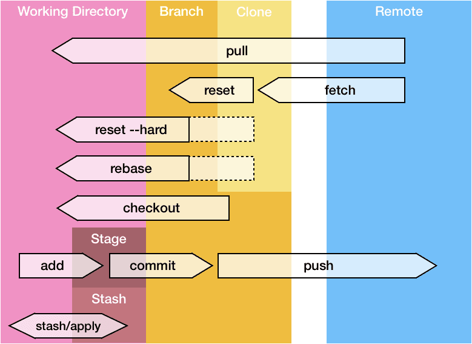
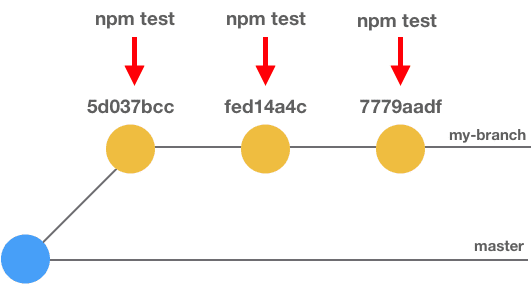

<h1 align="center">Git 的一些高级用法，效率必备！</h1>

请注意我有意跳过了 **git commit、git pull/push** 之类的基本命令，这份小抄的主题是 git 的一些**「高级」**用法。




##    跳到之前的分支

```
git checkout -
```

## 查看历史

```
# 每个提交在一行内显示
git log --oneline

# 在所有提交日志中搜索包含「homepage」的提交
git log --all --grep='homepage'

# 获取某人的提交日志
git log --author="Maxence"
```

## 哎呀：之前重置了一个不想保留的提交，但是现在又想要回滚？

```
# 获取所有操作历史
git reflog

# 重置到相应提交
git reset HEAD@{4}

# ……或者……
git reset --hard <提交的哈希值>
```

## 哎哟：我把本地仓库搞得一团糟，应该怎么清理？

```
git fetch origin
git checkout master
git reset --hard origin/master
```

## 查看我的分支和 master 的不同

```
git diff master..my-branch
```

## 定制提交

```
# 编辑上次提交
git commit --amend -m "更好的提交日志"

# 在上次提交中附加一些内容，保持提交日志不变
git add . && git commit --amend --no-edit1

# 空提交 —— 可以用来重新触发 CI 构建
git commit --allow-empty -m "chore: re-trigger build"
```

## squash 提交

比方说我想要 rebase 最近 3 个提交：

```
- git rebase -i HEAD~3
- 保留第一行的 pick，剩余提交替换为 squash 或 s
- 清理提交日志并保存（vi 编辑器中键入 :wq 即可保存）

pick 64d26a1 feat: add index.js
s 45f0259 fix: update index.js
s 8b15b0a fix: typo in index.js
```

## git 提交分支

```
git add .
git commit --fixup HEAD~1
# 或者也可以用提交的哈希值（fed14a4c）替换 HEAD~1

git rebase -i HEAD~3 --autosquash
# 保存并退出文件（VI 中输入 `:wq`）
```

## rebase 的时候在每个提交上执行命令

如果特性很多，一个分支里可能有多个提交。如果测试失败了，你希望能找到导致测试失败的提交。这时候你可以使用 `rebase --exec` 命令在每个提交上执行命令。

```
# 在最近 3 个提交上运行 `npm test` 命令
git rebase HEAD~3 --exec "npm test"
```




## 暂存

暂存不止是 **`git stash`** 和 **`git stash pop`**` `

```
# 保存所有正在追踪的文件
git stash save "日志信息"

# 列出所有的暂存项
git stash list

# 获取并删除暂存项
git stash apply stash@{1}
git stash drop stash@{1}

# ……或使用一条命令……
git stash pop stash@{1}
```

## 清理

```
# 移除远程仓库上不存在的分支
git fetch -p

# 移除所有包含 `greenkeeper` 的分支
git fetch -p && git branch --remote | fgrep greenkeeper | sed 's/^.\{9\}//' | xargs git push origin --delete
```

## GitHub = Git + Hub

我把 Hub 当成 git 的一个封装来用。你如果也想这么做，可以设置一个别名：`alias git='hub'`

```
# 打开浏览器访问仓库 url（仅限 GitHub 仓库）git browse
```

## git 别名

```
alias g='git'
alias glog='git log --oneline --decorate --graph'
alias gst='git status'
alias gp='git push'
alias ga='git add' 
alias gc='git commit -v'
alias yolo='git push --force'
```

## 每周站会汇报工作时用

```
git-standup() {
    AUTHOR=${AUTHOR:="`git config user.name`"}

    since=yesterday
    if [[ $(date +%u) == 1 ]] ; then
        since="2 days ago"
    fi

    git log --all --since "$since" --oneline --author="$AUTHOR"
}
```

source:https://mp.weixin.qq.com/s/8VVZZWpnoVGEuBsNQdDoRA