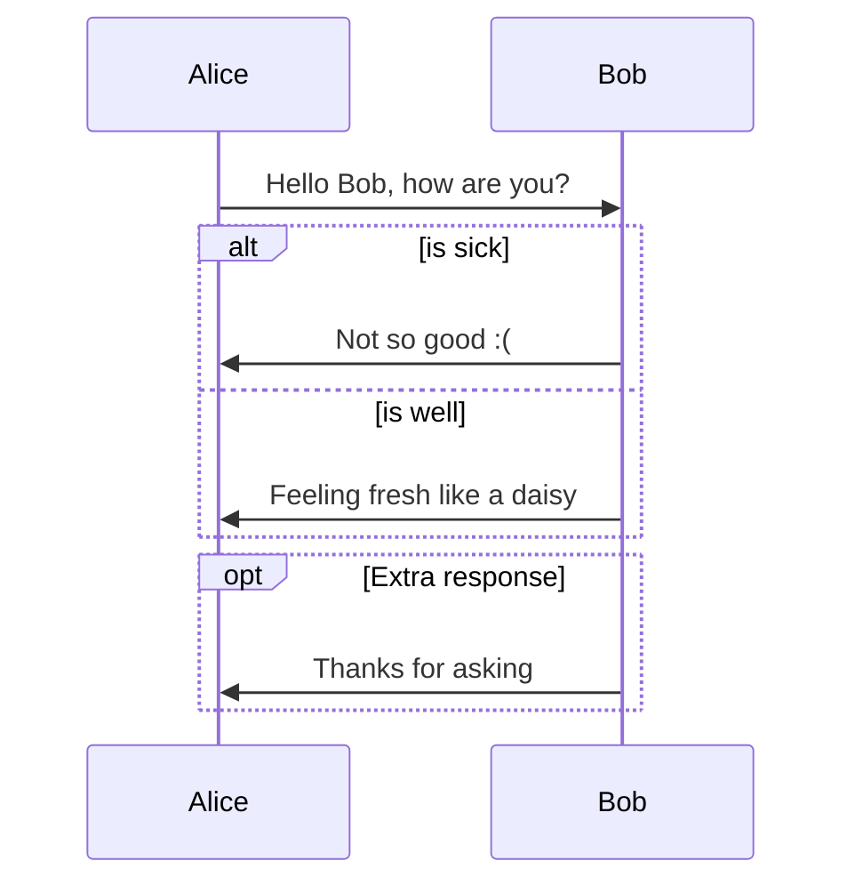
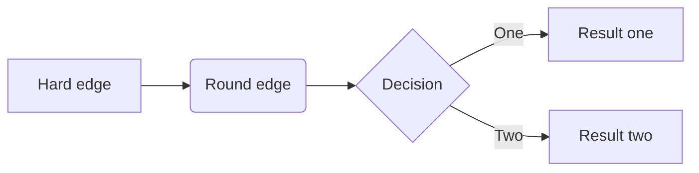
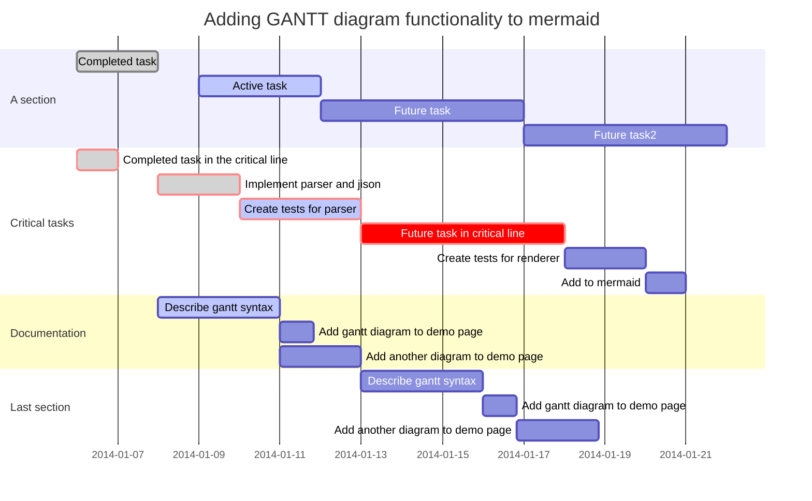
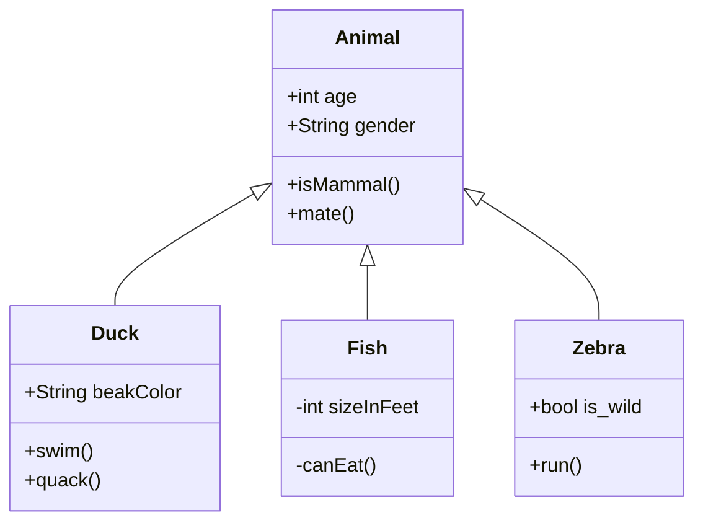
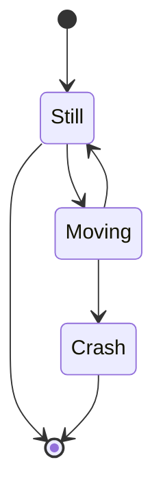
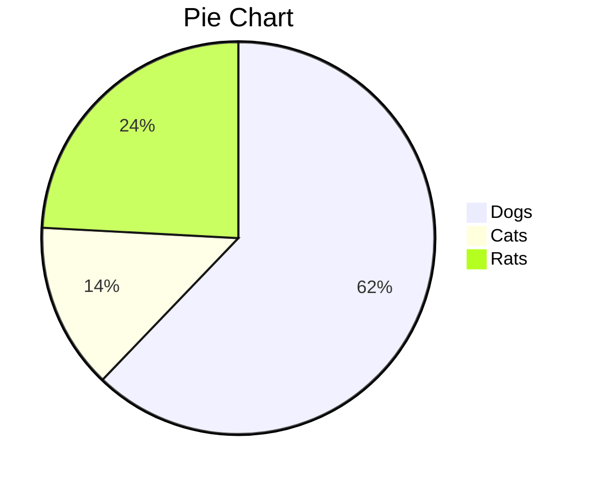

<h1 align="center">Draw Diagrams With Markdown</h1>

[toc]

Typora supports some Markdown extensions for diagrams, once they are enabled from preference panel.

When exporting as HTML, PDF, epub, docx, those rendered diagrams will also be included, but diagrams features are not supported when exporting markdown into other file formats in current version. Besides, you should also notice that diagrams is not supported by standard Markdown, CommonMark or GFM. Therefore, we still recommend you to insert an image of these diagrams instead of write them in Markdown directly.

# Sequence Diagrams

This feature uses [js-sequence](https://bramp.github.io/js-sequence-diagrams/), which turns the following code block into a rendered diagram:

~~~gfm
```sequence
Alice->Bob: Hello Bob, how are you?
Note right of Bob: Bob thinks
Bob-->Alice: I am good thanks!
```
~~~

```sequence
Alice->Bob: Hello Bob, how are you?
Note right of Bob: Bob thinks
Bob-->Alice: I am good thanks!
```

For more details, please see [this syntax explanation](https://bramp.github.io/js-sequence-diagrams/#syntax).

# Flowcharts

This feature uses [flowchart.js](http://flowchart.js.org/), which turns the following code block into a rendered diagram:

~~~gfm
```flow
st=>start: Start
op=>operation: Your Operation
cond=>condition: Yes or No?
e=>end

st->op->cond
cond(yes)->e
cond(no)->op
```
~~~

```flow
st=>start: Start
op=>operation: Your Operation
cond=>condition: Yes or No?
e=>end

st->op->cond
cond(yes)->e
cond(no)->op
```

# Mermaid

Typora also has integration with [mermaid](https://mermaid-js.github.io/mermaid/#/), which supports sequence diagrams, flowcharts, Gantt charts, class and state diagrams, and pie charts.

## Sequence Diagrams

For more details see [these instructions](https://mermaid-js.github.io/mermaid/#/sequenceDiagram).

~~~gfm

~~~


## Flowcharts

For more details see [these instructions](https://mermaid-js.github.io/mermaid/#/flowchart).

~~~gfm

~~~


## Gantt Charts

For more details see [these instructions](https://mermaid-js.github.io/mermaid/#gantt).

~~~gfm

~~~


## Class Diagrams

For more details see [these instructions](https://mermaid-js.github.io/mermaid/#/classDiagram).

~~~gfm

~~~


## State Diagrams

For more details see [these instructions](https://mermaidjs.github.io/#/stateDiagram).

~~~gfm

~~~


## Pie Charts

~~~gfm

~~~

