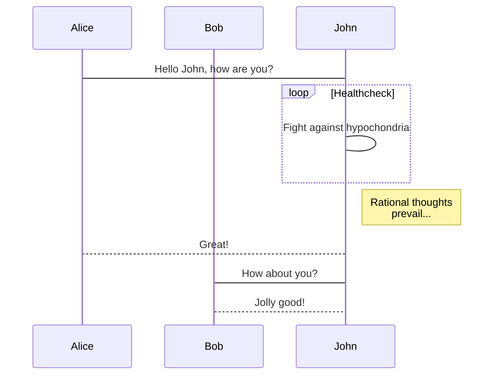
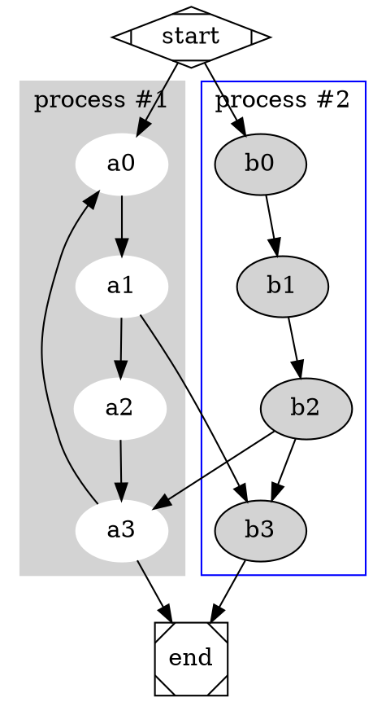
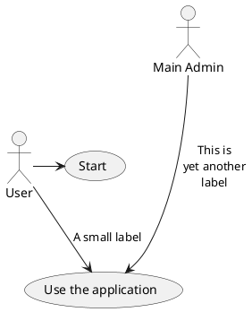

 <h1 align="center">Markdown完全教程</h1>

 [TOC]


## 1.标题

```
# h1 Heading
## h2 Heading
### h3 Heading
#### h4 Heading
##### h5 Heading
###### h6 Heading
```


## 2.文字

### (1)字体

```
<font face="黑体">我是黑体字</font>
<font face="微软雅黑">我是微软雅黑</font>
<font face="STCAIYUN">我是华文彩云</font>
```

效果：
<font face="黑体">我是黑体字</font>
<font face="微软雅黑">我是微软雅黑</font>
<font face="STCAIYUN">我是华文彩云</font>

### (2)颜色

```
<font color=red>我是红色</font>
<font color=#008000>我是绿色</font>
<font color=Blue>我是蓝色</font>
```

效果：

<font color=red>我是红色</font>
<font color=#008000>我是绿色</font>
<font color=Blue>我是蓝色</font>

### (3)大小

```
<font size=5>我是尺寸</font>
```

效果：

<font size=5>我是尺寸</font>


### (4)组合

```
<font face="黑体" color=green size=5>我是黑体，绿色，尺寸为5</font>
```

效果：

<font face="黑体" color=green size=5>我是黑体，绿色，尺寸为5</font>

### (5)格式

```
<center>文字居中</center>
<p align="left">左对齐</p>
<p align="right">右对齐</p>
```

效果:

<center>文字居中</center>
<p align="left">左对齐</p>
<p align="right">右对齐</p>

### (6)背景色

```
<table><tr><td bgcolor=yellow>背景色yellow</td></tr></table>
```

效果：

<table><tr><td bgcolor=yellow>背景色yellow</td></tr></table>

### (7)样式

```
文字 `标签` 显示
*文字斜体*
**文字加粗**
__文字加粗__
_文字下划线_
~~文字~~
[超链接](www.baidu.com)
```

效果：

文字 `标签` 显示
*文字斜体*
**文字加粗**
__文字加粗__
_文字下划线_
~~文字~~
[超链接](www.baidu.com)


## 3.符号

### (1)换行

```
方法1: 连续两个以上空格+回车
方法2：使用html语言换行标签：<br>
```
效果：

文字  
换行

文字<br>换行

### (2)分隔符

```
***
---
___
```

效果:

***
---
___

### (3)首行缩进

```
&ensp; 半角的空格 或&#8194; 半角的空格
&emsp; 全角的空格 或&#8195; 全角的空格
&nbsp; 不断行的空格 或&#160; 不断行的空格
&emsp;&emsp;段落从此开始。
```

开始&ensp; 半角的空格 或&#8194; 半角的空格
开始&emsp; 全角的空格 或&#8195; 全角的空格
开始&nbsp; 不断行的空格 或&#160; 不断行的空格
开始&emsp;&emsp;段落从此开始。

### (4)引用

```
>引用

// 引用中的引用符号前面的空格必须要有
>引用
 >>引用中的引用
```

效果：
>引用

<br>

>引用
 >>引用中的引用


## 4.图片

### (1)显示

```
GitHub set up
```

GitHub set up

```
<center>
GitHub set up</center>
```

<center>
GitHub set up</center>

### (2)大小

```
// 文字也居中的话要换行
GitHub set up
```

效果：

GitHub set up

```

```

效果：


GitHub set up


### (3)百分百显示

```
<div align=right></div>
```

效果：

<div align=center></div>

### (4)并排显示

```
// 各图片链接可以换行
<div align=right>


</div>
```

效果：

<div align=center>


</div>


```
// 图片链接不能换行

```

效果：


## 5.插入多媒体

### (1)插入音乐

*方法一：*

```
<audio id="audio" controls="" preload="none">
<source id="mp3" src="http://qiniu.cloud.fandong.me/Music_iP%E8%B5%B5%E9%9C%B2%20-%20%E7%A6%BB%E6%AD%8C%20%28Live%29.mp3">
</audio>
```

效果： 

<audio id="audio" controls="" preload="none">
<source id="mp3" src="http://link.hhtjim.com/163/463157222.mp3">
</audio>

*方法二：*

```
<iframe name="music" src="http://link.hhtjim.com/163/463157222.mp3" marginwidth="1px" marginheight="20px" width=100% height="80px" frameborder=1 border="0"　scrolling="no">
</iframe>
```

效果：

<iframe name="music" src="http://link.hhtjim.com/163/463157222.mp3" marginwidth="1px" marginheight="20px" width=100% height="80px" frameborder=1 border="0"　scrolling="yes">
</iframe>

网易云音乐获取音乐id:


### (2)插入视频

*方法一：*

```
// 不支持优酷，可以用youtube。
<iframe width="560" height="315" src="https://www.youtube.com/embed/Ilg3gGewQ5U" frameborder="0" allowfullscreen></iframe>
```

效果：

<iframe width="560" height="315" src="https://www.youtube.com/embed/Ilg3gGewQ5U" frameborder="0" allowfullscreen></iframe>

*方法二：*

```
<video id="video" controls="" preload="none" poster="http://img.blog.fandong.me/2017-08-26-Markdown-Advance-Video.jpg"><source id="mp4" src="http://img.blog.fandong.me/2017-08-26-Markdown-Advance-Video.mp4" type="video/mp4"></video>
```

效果:

<video id="video" controls="" preload="none" poster="http://img.blog.fandong.me/2017-08-26-Markdown-Advance-Video.jpg"><source id="mp4" src="http://img.blog.fandong.me/2017-08-26-Markdown-Advance-Video.mp4" type="video/mp4"></video>


## 6.列表

### (1)无序列表

```
* title1
* title2
* title3
```

效果：

* title1
* title2
* title3


```
- title1
- title2
- title3
```

效果：
- title1
- title2
- title3


```
+ title1
+ title2
+ title3
```

效果：

+ title1
+ title2
+ title3

### (2)有序列表

```
1. title1
2. title2
3. title3
```

效果：

1. title1
2. title2
3. title3


### (3)嵌套列表

```
// -+*可循环使用，但符号之后的空格不能少，符号之前的空格也不能少
* title1
 - title11
 - title12
* title2
 + title21
 + title22
* title3
 * title21
 * title22
```

效果：

* title1
 - title11
 - title12
* title2
 + title21
 + title22
* title3
 * title21
 * title22

## 7.超链接
### (1)普通超链接

```
[超链接](www.baidu.com)
```

效果：

[超链接](www.baidu.com)

### (2)索引超链：Reference方式

```
[不如][1]
[1]:http://bruce-sha.github.io
```

效果：

[不如][1]
[1]:http://bruce-sha.github.io

### (3)自动链接

```
// 网址加尖括号的要加http或者https
www.baidu.com
<http://www.baidu.com>
yuchuangu85@gmail.com
<yuchuangu85@gmail.com>
```

效果：

www.baidu.com
<http://www.baidu.com>
yuchuangu85@gmail.com
<yuchuangu85@gmail.com>

## 8.表格

```
// 中间横线分割符中的冒号（:），左侧有表示内容左对齐显示，两边都有表示居中，右侧有表示右侧对齐，默认左侧对齐。
| Tables        | Are           | Cool  |
| ------------- |:-------------:| -----:|
| col 3 is      | right-aligned | $1600 |
| col 2 is      | centered      |   $12 |
| zebra stripes | are neat      |    $1 |
```

效果：

| Tables        | Are           | Cool  |
| ------------- |:-------------:| -----:|
| col 3 is      | right-aligned | $1600 |
| col 2 is      | centered      |   $12 |
| zebra stripes | are neat      |    $1 |


```
项目     | 价格
-------- | ---
Computer | $1600
Phone    | $12
Pipe     | $1
```

效果:

项目     | 价格
-------- | ---
Computer | $1600
Phone    | $12
Pipe     | $1


## 9.转义字符

```
\\ 反斜杠
\` 反引号
\* 星号
\_ 下划线
\{\} 大括号
\[\] 中括号
\(\) 小括号
\# 井号
\+ 加号
\- 减号
\. 英文句号
\! 感叹号
```

效果：

\\ 反斜杠
\` 反引号
\* 星号
\_ 下划线
\{\} 大括号
\[\] 中括号
\(\) 小括号
\# 井号
\+ 加号
\- 减号
\. 英文句号
\! 感叹号

## 10.代码

~~~text

// 可以选择是否添加代码类型，添加代码类型会高亮代码
```js
function fancyAlert(arg) {
  if(arg) {
    $.facebox({div:'#foo'})
  }

}
```
~~~

效果：

```js
function fancyAlert(arg) {
  if(arg) {
    $.facebox({div:'#foo'})
  }

}
```


## 11.画图

### (1)mermaid


~~~text

```mermaid
# https://mermaidjs.github.io/
sequenceDiagram
    participant Alice
    participant Bob
    Alice->John: Hello John, how are you?
    loop Healthcheck
        John->John: Fight against hypochondria
    end
    Note right of John: Rational thoughts <br/>prevail...
    John-->Alice: Great!
    John->Bob: How about you?
    Bob-->John: Jolly good!
```
~~~


效果:



### (2)Graphviz

~~~text


~~~

效果：


### (3)echarts

~~~text

```echarts
option = {
    xAxis: {
        type: 'category',
        data: ['Mon', 'Tue', 'Wed', 'Thu', 'Fri', 'Sat', 'Sun']
    },
    yAxis: {
        type: 'value'
    },
    series: [{
        data: [820, 932, 901, 934, 1290, 1330, 1320],
        type: 'line'
    }]
};
```
~~~

效果：

```echarts
option = {
    xAxis: {
        type: 'category',
        data: ['Mon', 'Tue', 'Wed', 'Thu', 'Fri', 'Sat', 'Sun']
    },
    yAxis: {
        type: 'value'
    },
    series: [{
        data: [820, 932, 901, 934, 1290, 1330, 1320],
        type: 'line'
    }]
};
```

### (4)plantuml

~~~text


~~~

效果：


### (5)Sequence diagram and flow chart

~~~text
```sequence
张三->李四: 嘿，小四儿, 写博客了没?
Note right of 李四: 李四愣了一下，说：
李四-->张三: 忙得吐血，哪有时间写。
```

```flow
st=>start: 开始
e=>end: 结束
op=>operation: 我的操作
cond=>condition: 确认？

st->op->cond
cond(yes)->e
cond(no)->op
```
~~~

效果：

```sequence
张三->李四: 嘿，小四儿, 写博客了没?
Note right of 李四: 李四愣了一下，说：
李四-->张三: 忙得吐血，哪有时间写。
```

```flow
st=>start: 开始
e=>end: 结束
op=>operation: 我的操作
cond=>condition: 确认？

st->op->cond
cond(yes)->e
cond(no)->op
```

## 12.MathJax

```text
For example this is a Block level $$x = {-b \pm \sqrt{b^2-4ac} \over 2a}$$ formula, and this is an inline Level $x = {-b \pm \sqrt{b^2-4ac} \over 2a}$ formula.

\\[ \frac{1}{\Bigl(\sqrt{\phi \sqrt{5}}-\phi\Bigr) e^{\frac25 \pi}} =
1+\frac{e^{-2\pi}} {1+\frac{e^{-4\pi}} {1+\frac{e^{-6\pi}}
{1+\frac{e^{-8\pi}} {1+\ldots} } } } \\]
```

效果:

For example this is a Block level $$x = {-b \pm \sqrt{b^2-4ac} \over 2a}$$ formula, and this is an inline Level $x = {-b \pm \sqrt{b^2-4ac} \over 2a}$ formula.

\\[ \frac{1}{\Bigl(\sqrt{\phi \sqrt{5}}-\phi\Bigr) e^{\frac25 \pi}} =
1+\frac{e^{-2\pi}} {1+\frac{e^{-4\pi}} {1+\frac{e^{-6\pi}}
{1+\frac{e^{-8\pi}} {1+\ldots} } } } \\]

## 13.Footnote

```text
Here's a simple footnote,[^1] and here's a longer one.[^bignote]

[^1]: This is the first footnote.

[^bignote]: Here's one with multiple paragraphs and code.

    Indent paragraphs to include them in the footnote.

    `{ my code }`

    Add as many paragraphs as you like.
```


效果：

Here's a simple footnote,[^1] and here's a longer one.[^bignote]

[^1]: This is the first footnote.

[^bignote]: Here's one with multiple paragraphs and code.

    Indent paragraphs to include them in the footnote.

    `{ my code }`

    Add as many paragraphs as you like.
    

## 14.TOC
    
```text
[TOC]
```

效果:

[TOC]

----

footnote text detail... [↩](#myfootnote1)