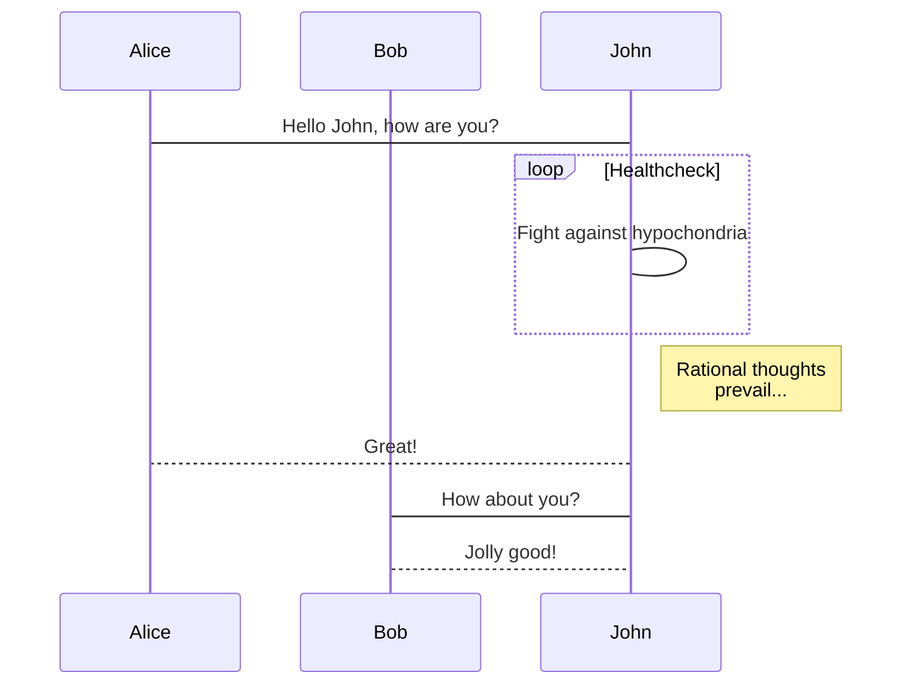
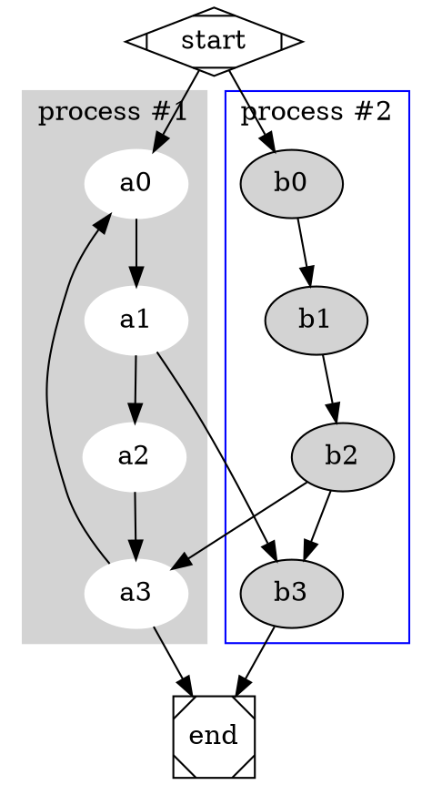
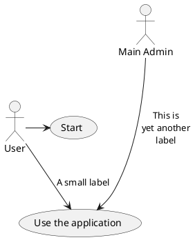

# MWeb

## The first thing you should know

What every Markdwon user should know is the official version. How was it created? What is its design philosophy and grammar? If you haven't seen it, it is recommended to check out this: **[Markdown syntax guide full version](https://www.mweb.im/markdown-syntax-guide-full-version.html)**.

The syntax used by MWeb is Github Flavored Markdown (GFM) syntax. GFM is an extended version of the official version. In addition to supporting the official syntax, it also supports tables, TOC, LaTeX, code blocks, task lists, footnotes, and more.

In addition, MWeb also supports two more useful grammars based on GFM grammar compatibility: drawing support (mermaid, viz, echarts, plantuml, sequence, flow) and setting the image width, which will be explained in detail below.

## Philosophy

> Markdown is intended to be as easy-to-read and easy-to-write as is feasible.
> Readability, however, is emphasized above all else. A Markdown-formatted document should be publishable as-is, as plain text, without looking like it's been marked up with tags or formatting instructions.
> Markdown's syntax is intended for one purpose: to be used as a format for *writing* for the web.


## Notice

If you see writing `Result:`, you can see the result only by using `CMD + 4` or `CMD + R` preview in MWeb. You can download this post and open it in MWeb to see the result. The download URL is: [Download this post Markdown text](https://www.mweb.im/media/15305971422667/markdown syntax.md)

## Headers

**Example:**

```text
# This is an `<h1>` tag
## This is an `<h2>` tag
###### This is an `<h6>` tag
```

**Result:**

# This is an `<h1>` tag

## This is an `<h2>` tag

###### This is an `<h6>` tag

## Emphasis

**Example:**

```text
*This text will be italic*
_This will also be italic_

**This text will be bold**
__This will also be bold__
```

**Shortcuts:** `CMD + U`、`CMD + I`、`CMD + B`
**Result:**

*This text will be italic*
_This will also be italic_

**This text will be bold**
__This will also be bold__

## Newlines

End a line with two or more spaces + enter.
Just typing enter to newline,please set：`Preferences` - `Themes` - `Translate newlines to <br>
 tags` enable ( default is enable )
 
## front
 
```
<font face="黑体">我是黑体字</font>
<font face="微软雅黑">我是微软雅黑</font>
<font face="STCAIYUN">我是华文彩云</font>
<font face="黑体">我是黑体字</font>
<font face="微软雅黑">我是微软雅黑</font>
<font color=red>我是红色</font>
<font color=#008000>我是绿色</font>
<font color=Blue>我是蓝色</font>
<font size=5>我是尺寸</font>
<font face="黑体" color=green size=5>我是黑体，绿色，尺寸为5</font>
```
 
<font face="黑体">我是黑体字</font>
<font face="微软雅黑">我是微软雅黑</font>
<font face="STCAIYUN">我是华文彩云</font>
<font face="黑体">我是黑体字</font>
<font face="微软雅黑">我是微软雅黑</font>
<font color=red>我是红色</font>
<font color=#008000>我是绿色</font>
<font color=Blue>我是蓝色</font>
<font size=5>我是尺寸</font>
<font face="黑体" color=green size=5>我是黑体，绿色，尺寸为5</font>

```
<table><tr><td bgcolor=yellow>背景色yellow</td></tr></table>
```

<table><tr><td bgcolor=yellow>背景色yellow</td></tr></table>


  
## Align

```
<center>文字居中</center>
<p align="left">左对齐</p>
<p align="right">右对齐</p>
```

<center>文字居中</center>
<p align="left">左对齐</p>
<p align="right">右对齐</p>


## Lists

### Unordered

**Example:**

```text
* Item 1 unordered list `* + SPACE`
* Item 2
    * Item 2a unordered list `TAB + * + SPACE`
    * Item 2b
```

**Shortcuts:** `Option + U`
**Result:**

- Item 1 unordered list `* + SPACE`
- Item 2
  - Item 2a unordered list `TAB + * + SPACE`
  - Item 2b

### Ordered

**Example:**

```text
1. Item 1 ordered list `Number + . + SPACE`
2. Item 2 
3. Item 3
    1. Item 3a ordered list `TAB + Number + . + SPACE`
    2. Item 3b
```

**Result:**

1. Item 1 ordered list `Number + . + SPACE`
2. Item 2
3. Item 3
   1. Item 3a ordered list `TAB + Number + . + SPACE`
   2. Item 3b

### Task lists

**Example:**

```text
- [ ] task one not finish `- + SPACE + [ ]`
- [x] task two finished `- + SPACE + [x]`
```

**Result:**

-  task one not finish `- + SPACE + [ ]`
-  task two finished `- + SPACE + [x]`

## Images

**Example:**

```text

Format: 
```

**Shortcuts:** `Control + Shift + I`
The Library's document support drag & drop or `CMD + V` paste or `CMD + Option + I` to insert the pictrue.
**Result:**


GitHub set up


In MWeb, you can use `-w + Number` to control image width, for example, set the image width 140px:

```text

```


GitHub set up


In MWeb, you can also set the alignment of the image. Take the above image as an example. The left alignment is `-l140`, the center is `-c140`, and the right is `-r140`.


GitHub set up


size:

GitHub set up


size and center:

<div align=center></div>GitHub set up


## Insert Music

<iframe frameborder="no" border="0" marginwidth="0" marginheight="0" width=330 height=86 src="//music.163.com/outchain/player?type=2&id=528478901&auto=1&height=66"></iframe>

## Insert Video

```
不支持优酷，可以用youtube。
```

<iframe width="560" height="315" src="https://www.youtube.com/embed/Ilg3gGewQ5U" frameborder="0" allowfullscreen></iframe>


## Links

**Example:**

```text
email <example@example.com>
[GitHub](http://github.com)
autolink  <http://www.github.com/>
```

**Shortcuts:** `Control + Shift + L`
The Library's document support drag & drop or `CMD + Option + I` to insert attachment.
**Result:**

An email [example@example.com](mailto:example@example.com) link.
[GitHub](http://github.com/)
Automatic linking for URLs
Any URL (like http://www.github.com/) will be automatically converted into a clickable link.

## Blockquotes

**Example:**

```text
As Kanye West said:
> We're living the future so
> the present is our past.
```

**Shortcuts:** `CMD + Shift + B`
**Result:**

As Kanye West said:

> We're living the future so
> the present is our past.

## Inline code

**Example:**

```text
I think you should use an
`<addr>` `code` element here instead.
```

**Shortcuts:** `CMD + K`
**Result:**

I think you should use an
`<addr>` `code` element here instead.

## Multi-line code

**Example:**

~~~text
```js
function fancyAlert(arg) {
  if(arg) {
    $.facebox({div:'#foo'})
  }

}
```
~~~

**Shortcuts:** `CMD + Shift + K`
**Result:**

```javascript
function fancyAlert(arg) {
  if(arg) {
    $.facebox({div:'#foo'})
  }

}
```

## MWeb Drawing

### mermaid

Mermaid is a popular js graphics library. It supports flowcharts, sequence diagrams and Gantt charts. Its official website is: https://mermaidjs.github.io/. The syntax for using mermaid in MWeb is to declare code blocks. The language is mermaid, and the mermaid drawing syntax can be written in the code block. You can copy the following syntax into MWeb to view the result.

~~~text

~~~

**Result：**


### Graphviz

Graphviz is an open source graph visualization software and its official website is http://www.graphviz.org/. MWeb uses the implementation of Graphviz's js version http://viz-js.com/, which can parse the Graphviz syntax to generate images. You can try the following syntax to copy it into MWeb. When you try, you can change the dot to circo, fdp, neato, osage, twopi to try the result.

~~~text

~~~

**Result：**


### echarts

Echarts is a js graph library of Baidu. Its website is http://echarts.baidu.com/index.html. It is very powerful. MWeb supports some basic usages of echarts. You can try the following syntax to copy it into MWeb. You can also go to the http://echarts.baidu.com/examples/index.html URL to see some examples. Note that MWeb can only parse `option = {}` which is simple but should be enough used.

~~~text
```echarts
option = {
    xAxis: {
        type: 'category',
        data: ['Mon', 'Tue', 'Wed', 'Thu', 'Fri', 'Sat', 'Sun']
    },
    yAxis: {
        type: 'value'
    },
    series: [{
        data: [820, 932, 901, 934, 1290, 1330, 1320],
        type: 'line'
    }]
};
```
~~~

**Result：**

```echarts
option = {
    xAxis: {
        type: 'category',
        data: ['Mon', 'Tue', 'Wed', 'Thu', 'Fri', 'Sat', 'Sun']
    },
    yAxis: {
        type: 'value'
    },
    series: [{
        data: [820, 932, 901, 934, 1290, 1330, 1320],
        type: 'line'
    }]
};
```


### plantuml

The website of plantuml is: http://www.plantuml.com/, you can learn more directly. The way MWeb supports plantuml is to reference the images generated by the plantuml server. You can copy the following syntax into MWeb to try.

~~~text

~~~

**Result:**


### Sequence diagram and flow chart

The sequence diagram and flow chart are using http://bramp.github.io/js-sequence-diagrams/, http://adrai.github.io/flowchart.js/ It's Markdown syntax in MWeb.

~~~text
```sequence
张三->李四: 嘿，小四儿, 写博客了没?
Note right of 李四: 李四愣了一下，说：
李四-->张三: 忙得吐血，哪有时间写。
```

```flow
st=>start: 开始
e=>end: 结束
op=>operation: 我的操作
cond=>condition: 确认？

st->op->cond
cond(yes)->e
cond(no)->op
```
~~~

**Result：**

```sequence
张三->李四: 嘿，小四儿, 写博客了没?
Note right of 李四: 李四愣了一下，说：
李四-->张三: 忙得吐血，哪有时间写。
```

```flow
st=>start: 开始
e=>end: 结束
op=>operation: 我的操作
cond=>condition: 确认？

st->op->cond
cond(yes)->e
cond(no)->op
```

## Tables

**Example:**

```text
First Header | Second Header
------------ | -------------
Content from cell 1 | Content from cell 2
Content in the first column | Content in the second column
```

You can create tables by assembling a list of words and dividing them with hyphens - (for the first row), and then separating each column with a pipe |:

**Result:**

| First Header                | Second Header                |
| :-------------------------- | :--------------------------- |
| Content from cell 1         | Content from cell 2          |
| Content in the first column | Content in the second column |

## Strikethrough

**Example:**

```text
 (like ~~this~~)
```

**Result:**

Any word wrapped with two tildes (like ~~this~~) will appear crossed out.

## Horizontal Rules

Following lines will produce a horizontal rule:

```text
***

*****

- - -
```

**Result:**

***

*****

- - -


## MathJax

Use double US dollors sign pair for Block level Math formula, and one US dollor sign pair for Inline Level.

```text
For example this is a Block level $$x = {-b \pm \sqrt{b^2-4ac} \over 2a}$$ formula, and this is an inline Level $x = {-b \pm \sqrt{b^2-4ac} \over 2a}$ formula.

\\[ \frac{1}{\Bigl(\sqrt{\phi \sqrt{5}}-\phi\Bigr) e^{\frac25 \pi}} =
1+\frac{e^{-2\pi}} {1+\frac{e^{-4\pi}} {1+\frac{e^{-6\pi}}
{1+\frac{e^{-8\pi}} {1+\ldots} } } } \\]
```

**Result:**

For example this is a Block level $$x = {-b \pm \sqrt{b^2-4ac} \over 2a}$$ formula, and this is an inline Level $x = {-b \pm \sqrt{b^2-4ac} \over 2a}$ formula.

\\[ \frac{1}{\Bigl(\sqrt{\phi \sqrt{5}}-\phi\Bigr) e^{\frac25 \pi}} =
1+\frac{e^{-2\pi}} {1+\frac{e^{-4\pi}} {1+\frac{e^{-6\pi}}
{1+\frac{e^{-8\pi}} {1+\ldots} } } } \\]


## Footnote

**Example:**

```text
Here's a simple footnote,[^1] and here's a longer one.[^bignote]

[^1]: This is the first footnote.

[^bignote]: Here's one with multiple paragraphs and code.

    Indent paragraphs to include them in the footnote.

    `{ my code }`

    Add as many paragraphs as you like.
```

**Result:**

Here's a simple footnote,[^1] and here's a longer one.[^bignote]

[^1]: This is the first footnote.

[^bignote]: Here's one with multiple paragraphs and code.

    Indent paragraphs to include them in the footnote.

    `{ my code }`

    Add as many paragraphs as you like.


## Comment And Read More..

Actions->Insert Read More Comment *OR* `CMD + .`

## TOC

**Example:**

```text
[TOC]
```
[TOC]

**Result:**

- [The first thing you should know](https://www.mweb.im/markdown.html#toc_0)
- [Philosophy](https://www.mweb.im/markdown.html#toc_1)
- [Notice](https://www.mweb.im/markdown.html#toc_2)
- [Headers](https://www.mweb.im/markdown.html#toc_3)

[This is an `<h1>` tag](https://www.mweb.im/markdown.html#toc_4)

- This is an `<h2>` tag
  - - - - [This is an `<h6>` tag](https://www.mweb.im/markdown.html#toc_6)
- [Emphasis](https://www.mweb.im/markdown.html#toc_7)
- [Newlines](https://www.mweb.im/markdown.html#toc_8)
- Lists
  - [Unordered](https://www.mweb.im/markdown.html#toc_10)
  - [Ordered](https://www.mweb.im/markdown.html#toc_11)
  - [Task lists](https://www.mweb.im/markdown.html#toc_12)
- [Images](https://www.mweb.im/markdown.html#toc_13)
- [Links](https://www.mweb.im/markdown.html#toc_14)
- [Blockquotes](https://www.mweb.im/markdown.html#toc_15)
- [Inline code](https://www.mweb.im/markdown.html#toc_16)
- [Multi-line code](https://www.mweb.im/markdown.html#toc_17)
- MWeb Drawing
  - [mermaid](https://www.mweb.im/markdown.html#toc_19)
  - [Graphviz](https://www.mweb.im/markdown.html#toc_20)
  - [echarts](https://www.mweb.im/markdown.html#toc_21)
  - [plantuml](https://www.mweb.im/markdown.html#toc_22)
  - [Sequence diagram and flow chart](https://www.mweb.im/markdown.html#toc_23)
- [Tables](https://www.mweb.im/markdown.html#toc_24)
- [Strikethrough](https://www.mweb.im/markdown.html#toc_25)
- [Horizontal Rules](https://www.mweb.im/markdown.html#toc_26)
- [MathJax](https://www.mweb.im/markdown.html#toc_27)
- [Footnote](https://www.mweb.im/markdown.html#toc_28)
- [Comment And Read More..](https://www.mweb.im/markdown.html#toc_29)
- [TOC](https://www.mweb.im/markdown.html#toc_30)


footnote text detail... [↩](#myfootnote1)