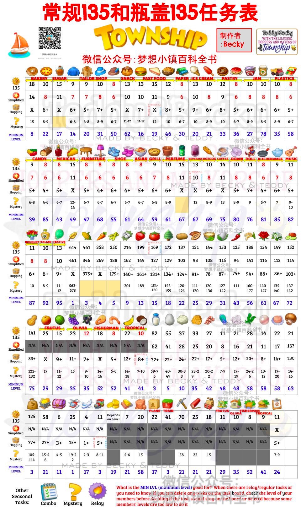

# Township

>35常规、瓶盖简易、问号和季外赛箱子数量表

图片解释：本土共有七栏，分别为：
1-物品所对应的图片。
2-第二栏有黄色的箭头，同一区域内代表他们是同一个工厂的。红色的英文名称注明了他们所在的工厂。
3-龙舟常规135任务的要求数。工厂任务要求数小于或者等于8个的被标红，只要准备充分，就不需要加速就可以秒完成(工厂升级至11级可以获得额外的两个架子，共八个）。
4-瓶盖简易任务的要求数，工厂任务要求数小于或者等于8个的被标红。
5-季外赛箱子任务中的最低要求。
6-问号随机任务的要求数。
7-每个任务所需的最低等级。

