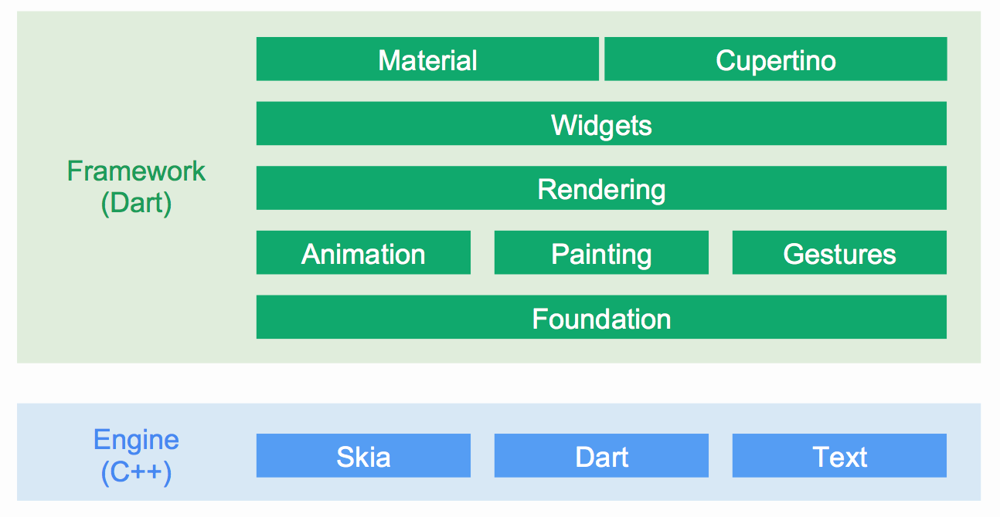

<h1 align="center">Flutter<h1>

## 目录

* [开发网站](#开发网站)
* [开源项目](#开源项目)
* [架构图](#架构图)

## 开发网站

* [官网-英文](https://flutter.dev)
* [官网-中文](https://flutter-io.cn)
* [Flutter中文网](https://flutterchina.club)
* [Flutter实战](https://book.flutterchina.club/)
* [Flutter实战电子书](https://github.com/flutterchina/flutter-in-action)

## 开源项目

* [Dart&Flutter](https://pub.dev/)：Dart & Flutter资源网站
* [**FlutterCreateSubmissions2019**](https://github.com/pinkeshdarji/FlutterCreateSubmissions2019)：Flutter开发竞赛项目
* [5KB 代码创乾坤！快来感受下 Flutter 的美妙与潜力！](https://mp.weixin.qq.com/s?__biz=MzAwODY4OTk2Mg==&mid=2652049406&idx=1&sn=3baafcc89a06897792f130da199d1cba&chksm=808cafbbb7fb26ad91a21a7546da2f83b110b17b6ee86e2878169b8f35389895a9b5c1a7e98a&xtrack=1&scene=90&subscene=93&sessionid=1559179898&clicktime=1559179902&ascene=56&devicetype=android-25&version=2700043b&nettype=WIFI&abtest_cookie=BQABAAoACwASABMAFQAHACOXHgBWmR4AxJkeANyZHgDzmR4AA5oeAAmaHgAAAA%3D%3D&lang=zh_CN&pass_ticket=4tGg9D9qobHgioDuSC3WyaTqhGFHo%2BW5Z0gz4uy%2F0vOAwikjlAMoSEAJcq9ci%2Bbz&wx_header=1)
* [Flutter源码](https://github.com/flutter/flutter)
* [Flutter官方插件](https://github.com/flutter/plugins)
* [flutter 开发者帮助 APP](https://github.com/alibaba/flutter-go)
* [awesome-flutter](https://github.com/Solido/awesome-flutter)
* [Flutter Awesome](https://flutterawesome.com/)：一个非常好的Flutter库列表
* [flutter_wanandroid](https://github.com/Sky24n/flutter_wanandroid)：基于Google Flutter的WanAndroid客户端，支持Android和iOS。包括BLoC、RxDart 、国际化、主题色、启动页、引导页，拥有较好的项目结构&比较规范的代码！
* [FlutterExampleApps](https://github.com/iampawan/FlutterExampleApps)
* [GSYGithubAppFlutter](https://github.com/CarGuo/GSYGithubAppFlutter)
* [flutter-desktop-embedding](https://github.com/google/flutter-desktop-embedding)
* [fish-redux](https://github.com/alibaba/fish-redux)
* [HistoryOfEverything](https://github.com/2d-inc/HistoryOfEverything)
* [flutter_architecture_samples](https://github.com/brianegan/flutter_architecture_samples)
* [zhihu-flutter](https://github.com/HackSoul/zhihu-flutter)：知乎开源flutter项目
* [flutter-ui-nice](https://github.com/nb312/flutter-ui-nice)
* [todo-list-app](https://github.com/asjqkkkk/todo-list-app)：全面而又精美的Flutter Todo-List项目
* [circle_list](https://github.com/asjqkkkk/circle_list)：圆形list开源库
* [Best-Flutter-UI-Templates](https://github.com/mitesh77/Best-Flutter-UI-Templates)：completely free for everyone. Its build-in Flutter Dart.

## 架构图

