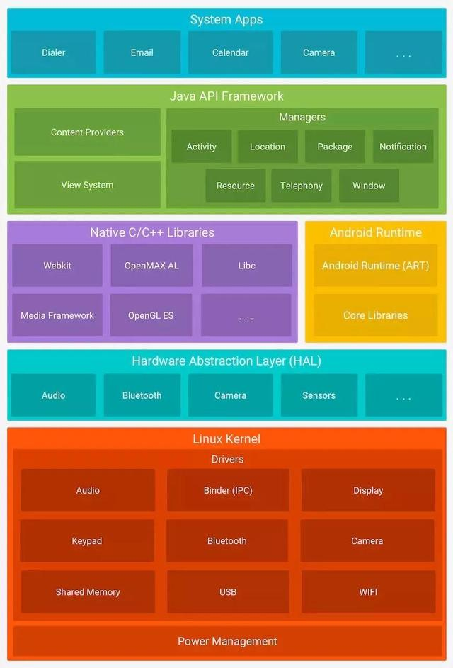

<h1 align="center">Android工程师的面经</h1>

[toc]

## Java基础

**什么是乐观锁?**

乐观锁：假设每次去拿数据都认为别人不会修改，所以不会上锁。但是在更新的时候会判断一下此期间别人有没有去更新这个数据。一般用在读比较多，写比较少的情况。

悲观锁：假设每次都是最坏情况，每次去拿数据时别人都会修改，所以每次拿数据的时候都会上锁，这样别人想拿这个数据就会被阻塞直到它拿到锁，多写少读时使用。

**volatile关键字**

1. 保证可见性，不保证原子性
2. 禁止指令重排序
3. 不缓存，每次都是从主存中取

**hashmap 原理，红黑树是什么?**

- 数组+链表,链表过长时，会导致查询效率退化
- 数组+链表+红黑树，当链表长度大于8转为红黑树
- HashMap 的默认初始大小为 16，初始化大小必须为 2 的幂，最大大小为 2 的 30 次方。数组中存储的链表节点 Entry 类实现于 Map.Entry 接口，它实现了对节点的通用操作。HashMap 的阈值默认为 “容量 * 0.75f”，当存储节点数量超过该值，则对 map 进行扩容处理。
- 线程不安全的容器，解决并发问题使用ConcurrentHashMap(高效)或者是Collections.synchronizedMap()。Collections.synchronizedMap()其实就是每个方法加一个synchronize，其实和HashTable 差不多。

**红黑树**

- 平衡的二叉查找树
- 节点是红色或者是黑色
- 根节点是黑色
- 每个叶子的节点都是黑色的空节点(NULL)
- 每个红色节点的两个子节点都是黑色的
- 从任意节点到其每个叶子的所有路径都包含相同的黑色节点
- 插入时会涉及到变色和旋转

**jvm内存分配**

- 程序计数器
- Java虚拟机栈
- 本地方法栈
- Java堆
- 方法区
- 运行时常量池
- 直接内存

**String,StringBuffer,StringBuilder 区别**

String，StringBuffer，StringBuilder最终底层存储与操作的都是char数组。但是String里面的char数组是final的，而StringBuffer，StringBuilder不是，也就是说，String是不可变的，想要新的字符串只能重新生成String。而StringBuffer和StringBuilder只需要修改底层的char数组就行。相对来说，开销要小很多。

String的大多数方法都是重新new一个新String对象返回，频繁重新生成容易生成很多垃圾。StringBuffer是线程安全的，StringBuilder是线程不安全的，因为StringBuffer的方法是加了synchronized锁起来了的，而StringBuilder没有。增删比较多时用StringBuffer或StringBuilder（注意单线程与多线程）。实际情况按需而取吧，既然已经知道了里面的原理。


## 安卓基础

**安卓各版本大变化(Android 6.0到10.0),兼容适配**

**Android 5.0**

- Material Design
- ART虚拟机

**Android 6.0**

- 应用权限管理
- 官方指纹支持
- Doze电量管理
- 运行时权限机制->需要动态申请权限

**Android 7.0**

- 多窗口模式
- 支持Java 8语言平台
- 需要使用FileProvider访问照片
- 安装apk需要兼容

**Android 8.0**

- 通知
- 画中画
- 自动填充
- 后台限制
- 自适应桌面图标->适配
- 隐式广播限制
- 开启后台Service限制

**Android 9.0**

- 利用 Wi-Fi RTT 进行室内定位
- 刘海屏 API 支持
- 多摄像头支持和摄像头更新
- 不允许调用hide api
- 限制明文流量的网络请求 http

**Android 10**

- 暗黑模式
- 隐私增强(后台能否访问定位)
- 限制程序访问剪贴板
- 应用黑盒
- 权限细分需兼容
- 后台定位单独权限需兼容
- 设备唯一标示符需兼容
- 后台打开Activity 需兼容
- 非 SDK 接口限制 需兼容

**热修复原理**

**原理**

1. 安卓在加载class时会通过双亲委托机制去加载一个类，先让父类去加载，如果找不到再让子类去加载某个类。
2. 通过查看ClassLoader源码发现findClass方法是由每个子类自己实现的，比如BootClassLoader或者BaseDexClassLoader。而PathClassLoader是继承自BaseDexClassLoader的，它的findClass也是在BaseDexClassLoader里面实现的。
3. BaseDexClassLoader的findClass里面使用了另一个对象DexPathList去查找对应的class，这是安卓里面特有的实现。在DexPathList对象里面有一个属性dexElements，dexElements是用于存放加载好了的dex数组的，查找class是从这个dexElements数组里面去找的。
4. dexElements里面存放的是Element对象，findClass最终会交给Element去实现，Element又会交给Element里面的一个属性DexFile去实现。我看了下，最终是用native实现的。
5. 回到上面的第3步中的DexPathList对象从dexElements数组里面查找class，从数组的前面往后找,找到了就返回结果，不再继续查找。
6. 所以当我们把修复好bug了的class，搞成dex,然后通过反射等技术放到dexElements的最前面，这样系统在通过PathClassLoader找到class时，就能先找到我们放置的修复好bug的class，然后就不会再往后找了，相当于实现了热修复。这样有bug的class就不会被用了。应了一句古话，近水楼台先得月。
7. 第6点中的反射，流程是：获取到PathClassLoader，然后反射获取到父类中的DexPathList对象，然后再反射到DexPathList对象中的dexElements数组。然后将补丁(dex)转为Element对象，插入到dexElements数组的前面(先复制出来，再合并，再通过反射放回去)。

一句话总结。将修复好的类放在dexElements的最前面，这样在加载类的时候就会被优先加载到而达到修复的目的。

**MVC,MVP,MVVM**

首先需要知道的是为什么要进行技术框架的设计？肯定是为了低耦合，提高开发效率是吧。所以不要为了设计而设计。

**MVC**

在Android中View和Controller一般就是被Activity充当了，当逻辑非常多，操作非常复杂时，Activity代码量非常庞大，不易维护。

- Model : 模型层，业务逻辑+数据存储等
- View : 用户界面，一般就是xml+Activity
- Controller : 控制层，一般就是Activity

**MVP**

我个人角度，现在(2019年10月29日20:02:49)大多是使用这种方式，既不复杂也解耦合了。

- Model：模型层，业务逻辑+数据存储+网络请求
- View：视图层，View绘制和用户交互等，一般是Activity
- Presenter：呈现层，连接V层和M层，完成他们之间的交互

**MVVM**

为了更加分离M，V层，所以有了MVVM。

- Model：模型层，业务逻辑+数据存储+网络请求
- View：视图层，View绘制和用户交互等，一般是Activity
- ViewModel：其实就是Presenter和View的数据模型的合体。双向绑定，View的变动会反应到ViewModel中，数据的变动也会反应到View上。

**组件化的好处**

1. 任意修改都需要编译整个工程，效率低下。
2. 解耦，有利于多人团队协作开发
3. 功能复用

**app启动流程**

1. Launcher startActivity
2. AMS startActivity
3. Zygote fork进程
4. Activity main()
5. ActivityThread 进程loop循环
6. 开启Activity,开始生命周期回调…

**Activity启动流程**

1. Activity startActivityForResult
2. Instrumentation execStartActivity
3. AMS startActivity
4. ApplicationThread scheduleLaunchActivity
5. ActivityThread.H handleMessage -> performLaunchActivity
6. Activity attach
7. Instrumentation callActivityOnCreate

**app体积优化**

可以使用lint工具，检测出没有用的文件。同时可以开启资源压缩,自动删除无用的资源。尽量多使用可绘制对象，某些图像不需要静态图像资源，框架可以在运行时动态绘制图像。尽量自己写Drawable，能不用UI切图就不用，占用空间小。

重用资源，比如一个三角按钮,点击前三角朝上代表收起的意思，点击后三角朝下，代表展开，一般情况下,我们会用两张图来切换，我们其实完全可以用旋转的形式去改变。比如同一图像的着色不同,我们可以用android:tint和tintMode属性，低版本可以使用ColorFilter。

压缩PNG和JPEG文件，可以减少PNG文件的大小，而不会丢失图像质量。使用WebP文件格式，可以使用WebP文件格式，而不是使用PNG或JPEG文件。可以使用AS将现有的BMP、JPG、PNG或静态GIF图像转换成WebP格式。使用矢量图形.svg；代码混淆，使用proGuard代码混淆器工具,它包括压缩，优化，混淆等功能。这个大家太熟悉。插件化，将功能模块放服务器上，按需下载，可以减少安装包大小。

**app启动优化**

利用提前展示出来的Window，快速展示出来一个节目，给用户快速反馈的体验。障眼法，治标不治本。

避免在启动时做密集沉重的初始化(Heavy app initialization)。某些SDK初始化放在异步去加载(比如友盟，bugly这样的业务非必要可以异步加载)，比如地图，推送等，非第一时间需要的可以在主线程做延时启动(比如闪屏页)，当程序已经启动起来之后,再进行初始化。对于网络，图片请求框架就必须在主线程中初始化了。启动时，避免I/O操作，反序列化，网络操作，布局嵌套等耗时操作。

**app布局优化**

- 如果父控件有颜色，也是自己需要的颜色，那么就不必在子控件加背景颜色
- 如果子控件有背景颜色，并且能完全覆盖父控件，那么父控件不用设置背景颜色
- 尽量减少不必要的嵌套
- 能用LinearLayout和FrameLayout，就不要用RelativeLayout，因为RelativeLayout相对比较复杂，测绘也相对耗时。
- include和merge一起使用，增加复用，减少层级
- ViewStub按需加载，更加轻便
- 复杂界面选择ConstraintLayout，可有效减少层级

**app内存优化**

频繁使用字符串拼接用StringBuilder或者StringBuffer；ArrayMap、SparseArray替换HashMap；避免内存泄漏。

- 集合类泄漏(集合一直引用着被添加进来的元素对象)
- 单例/静态变量造成的内存泄漏(生命周期长的持有了生命周期短的引用)
- 匿名内部类/非静态内部类
- 资源未关闭造成的内存泄漏
- 检测内存泄漏的几个工具: LeakCanary，TraceView，Systrace，Android Lint和Memory Monitor+mat

**内存泄漏有哪些**

- 集合类泄漏(集合一直引用着被添加进来的元素对象)
- 单例/静态变量造成的内存泄漏(生命周期长的持有了生命周期短的引用)
- 匿名内部类/非静态内部类
- 资源未关闭造成的内存泄漏
- 网络，文件等流忘记关闭
- 手动注册广播时，退出时忘记unregisterReceiver()
- Service执行完成后忘记stopSelf()
- EventBus等观察者模式的框架忘记手动解除注册

**app线程优化**

线程池避免存在大量的Thread，重用线程池内部的线程，从而避免了线程的创建和销毁带来的性能开销，同时能有效控制线程池的最大并发数，避免大量线程因互相抢占系统资源而导致阻塞线现象发生。

**分类**

- FixedThreadPool 数量固定的线程池
- CachedThreadPool 只有非核心线程，数量不定，空闲线程有超时机制，比较适合执行大量耗时较少的任务
- ScheduledThreadPool 核心线程数量固定，非核心线程没有限制。主要用于执行定时任务和具有固定中周期的重复任务。
- SingleThreadPool 只有一个核心线程，确保所有的任务在同一个线程顺序执行，统一外界任务到一个线程中，这使得在这些任务之间不需要处理线程同步的问题。

**优点**

- 减少在创建和销毁线程上所花的时间以及系统资源的开销
- 不使用线程池有可能造成系统创建大量的线程而导致消耗完系统内存以及"过度切换"

**注意点**

- 如果线程池中的数量未达到核心线程的数量,则直接启动一个核心线程来执行任务
- 如果线程池中的数量已经达到或超过核心线程的数量,则任何会被插入到任务队列中等待执行
- 如果2中的任务无法插入到任务队列中,由于任务队列已满,这时候如果线程数量未达到线程池规定的最大值,则会启动一个非核心线程来执行任务
- 如果3中的线程数量已经达到线程池最大值,则会拒绝执行此任务,ThreadPoolExecutor会调用RejectedExecutionHandler的rejectedExecution()方法通知调用者

**Android换肤如何实现，原理**

重新设置LayoutInflater的Factory2，从而拦截创建View的过程，然后搞成自己的控件，想怎么换肤就怎么换肤。

**fresco原理，glide原理，两者区别，哪个更省内存**

这块暂时不懂，加入todo。

**Handler原理，Android 消息机制**

之前写过一篇文章，死磕Android_Handler机制你需要知道的一切，里面介绍得很详细，顺便说了一下为什么loop不会阻塞主线程问题。

Handler机制的关键在于对于ThreadLocal原理的理解，线程私有数据。利用ThreadLocal机制将Looper存放到线程内部，perfect !

**Android 系统架构**




应用层，应用框架层，系统运行库层，硬件抽象层和Linux内核层。

**常用布局有哪些**

- FrameLayout
- LinearLayout
- RelativeLayout
- ConstraintLayout
- CoordinatorLayout

**Android数据存储有几种方式**

- SharedPreferences: 小东西,最终是xml文件中,key-value的形式存储的.
- 文件
- 数据库
- ContentProvider
- 网络

**View，SurfaceView**

- View是Android中所有控件的基类
- View适用于主动更新的情况，而SurfaceView则适用于被动更新的情况，比如频繁刷新界面。
- View在主线程中对页面进行刷新，而SurfaceView则开启一个子线程来对页面进行刷新。
- View在绘图时没有实现双缓冲机制，SurfaceView在底层机制中就实现了双缓冲机制。

**jni调用流程**

我之前也写过简单的demo，JNI Java与C的相互调用与基本操作。

**组件之间相互引用，如何解决**

- 调用其他组件的对外提供的方法：之前看到过一种思路,利用"接口+实现"的方式,定义一个ComponentBase 中间层，然后里面有每个组件对外提供方法调用的Interface，每个组件在初始化的时候就把这些Interface给实现了，然后其他组件需要用的时候就从ComponentBase里面取。
- 界面跳转：ARouter

**Android 数字签名**

校验用户身份，校验数据的完整性。

**fragment用在哪里，与Activity的区别**

- 当Activity需要模块化的时候
- 不同设备上的适配，比如平台和手机
- Activity相对Fragment而言，非常笨重，一般小界面小模块用Fragment比较合适，或者首页的tab之类的。

**View绘制原理**

主要是分析measure，layout，draw的过程，之前写过一篇比较完整的，如下。死磕Android_View工作原理你需要知道的一切：

> https://blog.csdn.net/xfhy_/article/details/90270630

**Retrofit和OkHttp原理，拦截器**

- Retrofit的话，源码写的非常非常棒。主要是通过动态代理+获取方法上面的注解等，然后组装请求网络的参数，最后用OkHttp去请求网络。
- OkHttp的拦截器链设计得非常巧妙，是典型的责任链模式。并最终由最后一个链处理了网络请求，并拿到结果。

**点击事件传递机制，事件分为哪几种**

事件传递大体过程：Activity--> Window-->DecorView --> View树从上往下，传递过程中谁想拦截就拦截自己处理。MotionEvent是Android中的点击事件。主要事件类型：

- ACTION_DOWN 手机初次触摸到屏幕事件
- ACTION_MOVE 手机在屏幕上滑动时触发，会回调多次
- ACTION_UP 手指离开屏幕时触发

需要关注的几个方法。

- dispatchTouchEvent(event);
- onInterceptTouchEvent(event);
- onTouchEvent(event);

上面3个方法可以用以下伪代码来表示其关系：

```java
public boolean dispatchTouchEvent(MotionEvent ev) { boolean consume = false;//事件是否被消费 if (onInterceptTouchEvent(ev)) {//调用onInterceptTouchEvent判断是否拦截事件 consume = onTouchEvent(ev);//如果拦截则调用自身的onTouchEvent方法 } else { consume = child.dispatchTouchEvent(ev);//不拦截调用子View的dispatchTouchEvent方法 } return consume;//返回值表示事件是否被消费，true事件终止，false调用父View的onTouchEvent方法}
```

**anr如何产生，Service触发anr是多长时间（20秒），如何解决anr？如何解决那种莫名其妙的anr？**

我觉得anr就是在主线程做了耗时操作,比如io、读写文件、数据库操作等等。anr发生之后一般会有日志,在/data/anr/traces.txt里面。可以参考我的这篇文章拿anr日志，Android 未root查看ANR异常：

> https://blog.csdn.net/xfhy_/article/details/80223190

**Dialog和Activity是同一个Window？**

不是同一个。

- Activity的attach方法,这里是为Activity实例化了一个PhoneWindow实例
- Dialog的构造方法里面也是实例化了一个PhoneWindow实例

**Window,Activity,Dectorview之间的关系**

Activity里面实例化了一个Window，Window里面有一个DecorView(根布局)。看一下这篇文章，Android Window机制探索：

> https://blog.csdn.net/qian520ao/article/details/78555397

**ConstraintLayout和RelativeLayout在绘制方面有何差别？**

todo。

**onClick事件和onTouchListener在哪里回调？**

如果一个View需要处理事件，它设置了OnTouchListener，那么OnTouchListener的onTouch方法会被回调。如果onTouch返回false,则onTouchEvent会被调用，反之不会。在onTouchEvent方法中，事件为Action.UP的时候会回调OnClickListener的onClick方法，可见OnClickListener的优先级很低。

**LinearLayout是如何测量(measure)的？如果有weight又是如何测量的？**

先做一次测量，做完之后有空间剩余，有weight的View再测量一下，分一下剩余的空间。

**屏幕适配**

先前有鸿洋的AndroidAutoLayout，根据宽高进行控件缩放，非常经典，很多项目可能都还在使用，但是已经停止更新了。然后就是有名的今日头条方案，出来还是有点时间了。原理其实就是更改density。

屏幕的宽度=设计稿宽度 * density。

然后有AndroidAutoSize库，将今日头条方案融合进去还完善了很多问题，易用，完美。

## **其他**

**Java四种引用**

- 强引用，默认就是，宁愿OOM，也不回收
- 弱引用，内存不够会被回收
- 软引用，GC时会被回收
- 虚引用，它的作用在于跟踪垃圾回收过程，在对象被收集器回收时收到一个系统通知。

**项目中遇到的最困难的事情是什么?如何解决的?**

每个人遇到的情况不同，这个提前思考一下自己做过的项目最有挑战的地方。

**Kotlin优势**

- 完全兼容java
- 空安全
- 支持lambda表达式
- 支持扩展函数
- 更少的代码量,更快的开发速度

缺点就是有时候代码阅读性可能会降低。

**Kotlin 协程是什么?**

就是一个线程框架，提供了一套操作线程的api。

**二叉树,广度优先遍历,深度优先遍历**

推荐小灰的漫画算法。还有其他的一些，随便聊聊：

- tcp,http,https,socket
- 敏捷开发
- 你经常使用哪些设计模式，常见设计模式的运用
- 3年之后工资怎么想的
- 你的优势
- 职业规划(3年后干啥,5年后干啥)
- 应用，进程，线程之间的区别

## 出自:  [有人说这是初级Android工程师的面经？吓到我了](https://www.toutiao.com/i6766111276780225037/?tt_from=weixin&utm_campaign=client_share&wxshare_count=1&timestamp=1575441603&app=news_article&utm_source=weixin&utm_medium=toutiao_android&req_id=2019120414400301002302815512002BC6&group_id=6766111276780225037)